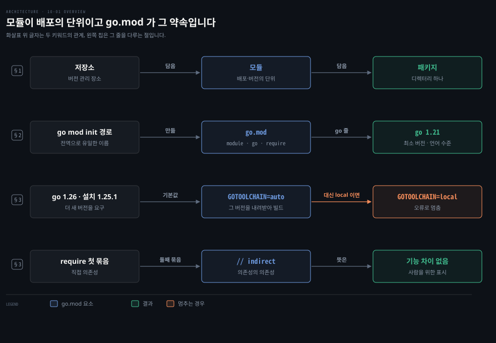
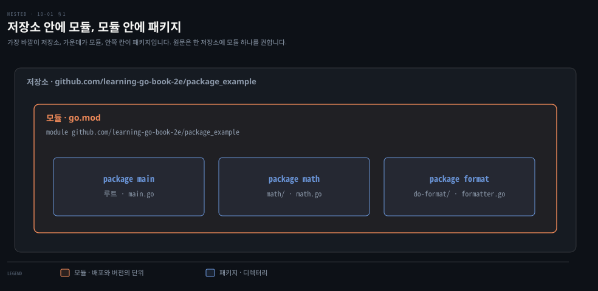
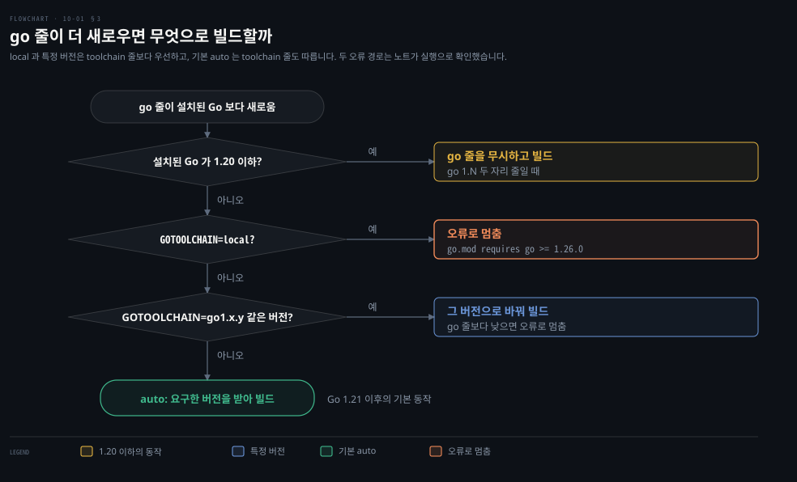

# 모듈은 go.mod 로 한 단위가 되고 go 지시어가 빌드할 Go 버전을 정합니다

---

> Learning Go 10장 앞 부분입니다. Go 의 코드 묶음 단위인 저장소·모듈·패키지, 모듈을 만드는 go.mod, 빌드할 Go 버전을 정하는 `go` 지시어와 `toolchain`·`GOTOOLCHAIN`, 그리고 의존성을 적는 `require` 지시어를 다룹니다.

## 핵심 요약

> 이 편이 매달린 하나의 생각은 Go 에서 배포와 버전의 단위가 모듈이고, 그 모듈의 모든 약속이 go.mod 한 파일에 적힌다는 것입니다.

저장소는 소스 코드가 놓이는 버전 관리 장소, 모듈은 한 단위로 배포되고 버전이 매겨지는 Go 코드 묶음, 패키지는 모듈 안의 디렉터리입니다. 모듈은 저장소 위치에 기반한 전역으로 유일한 모듈 경로를 갖습니다. go.mod 는 `go mod init` 으로 만들고 `module`·`go`·`require` 지시어가 가장 흔합니다.

`go` 지시어는 모듈이 기대하는 최소 Go 버전이자 언어 수준입니다. Go 1.21 부터는 설치된 것보다 새 버전이 적혀 있으면 그 버전을 내려받아 빌드하고 `toolchain` 지시어와 `GOTOOLCHAIN` 환경 변수로 이 동작을 조절합니다. Go 1.22 의 루프 변수 변화처럼 언어 동작이 `go` 지시어에 따라 모듈마다 갈리기도 합니다. `require` 는 직접 의존성과, `// indirect` 로 표시한 의존성의 의존성을 적습니다.


## 학습 목표

> 이 편을 읽고 나면 아래 다섯 가지를 스스로 해낼 수 있습니다.

1. 저장소·모듈·패키지가 각각 무엇이고 Java·Node.js 의 용어와 어떻게 어긋나는지 말할 수 있습니다.
2. 모듈 경로가 왜 전역으로 유일해야 하는지, 대문자를 피하라는 이유와 함께 설명할 수 있습니다.
3. go.mod 의 `go` 지시어가 무엇을 정하는지, 설치된 Go 가 더 낮을 때 1.21 전후로 무엇이 달라지는지 말할 수 있습니다.
4. `toolchain` 지시어와 `GOTOOLCHAIN` 의 세 값(`auto`·`local`·특정 버전)을 구별할 수 있습니다.
5. `require` 의 두 묶음과 `// indirect` 표시가 무엇을 뜻하는지 말할 수 있습니다.

아래는 이 편의 키워드를 이은 개념도입니다. 첫 줄은 저장소가 모듈을, 모듈이 패키지를 담는 세 단계입니다. 둘째 줄은 `go mod init` 이 go.mod 를 만들고 그 안의 `go` 줄이 최소 버전을 정한다는 것입니다. 셋째 줄은 `go` 줄이 더 새로울 때 `GOTOOLCHAIN` 값에 따라 내려받거나 멈춘다는 것입니다. 넷째 줄은 `// indirect` 가 기능 차이 없는 표시라는 것입니다. 왼쪽 칩이 그 줄을 다루는 절입니다.




## 1. 저장소·모듈·패키지 — Go 의 코드 묶음 세 단계

> Go 의 라이브러리 관리는 저장소·모듈·패키지 세 개념으로 돌아갑니다. 모듈은 한 단위로 배포되고 버전이 매겨지며, 전역으로 유일한 모듈 경로로 식별됩니다.

남이 만든 코드를 가져다 쓰려면 두 가지를 가릴 수 있어야 합니다. 어느 코드인지 헷갈리지 않을 이름과, 어느 판을 쓰는지 정할 버전의 단위입니다. 대부분의 현대 언어에는 코드를 네임스페이스와 라이브러리로 정리하는 체계가 있고 Go 도 예외가 아닙니다. 원문은 Go 의 라이브러리 관리가 저장소·모듈·패키지 세 개념에 기반한다고 말합니다.

**저장소**는 모든 개발자에게 익숙한 개념입니다. 프로젝트의 소스 코드를 저장하는 버전 관리 시스템 안의 장소입니다. **모듈**은 한 단위로 배포되고 버전이 매겨지는 Go 소스 코드 묶음이며 저장소에 저장됩니다. 모듈은 하나 이상의 **패키지**로 이루어집니다. 패키지는 소스 코드 디렉터리입니다. 패키지가 모듈에 조직과 구조를 줍니다.



원문의 메모는 한 저장소에 모듈을 둘 이상 둘 수는 있지만 권하지 않는다고 말합니다. 모듈 안의 모든 것은 함께 버전이 매겨지는데, 한 저장소에 모듈이 둘이면 서로 다른 두 모듈의 버전을 한 저장소에서 따로 관리해야 하기 때문입니다.

### 같은 단어가 언어마다 다른 것을 가리킵니다

원문은 언어마다 이 단어들로 다른 개념을 나타내는 것이 아쉽다고 말합니다. Java 와 Go 의 패키지는 비슷합니다. 하지만 Java 저장소는 여러 아티팩트(Go 모듈에 해당)를 모아 두는 중앙 장소입니다. Node.js 와 Go 는 용어의 뜻이 서로 뒤바뀝니다. Node.js 의 패키지는 Go 의 모듈과 비슷하고, Go 의 패키지는 Node.js 의 모듈과 비슷합니다.

Spring 개발자에게 옮기면 Go 모듈은 `pom.xml` 하나가 정의하는 Maven 아티팩트(groupId·artifactId·version)에 가깝고 Go 패키지는 Java 패키지처럼 디렉터리 하나입니다. 다만 Go 에는 Maven Central 같은 중앙 저장소에 올리는 단계가 없습니다(10-04 §1). 이 대응은 원문 밖입니다.

### 모듈 경로는 전역으로 유일합니다

표준 라이브러리 밖의 패키지 코드를 쓰려면 먼저 모듈을 제대로 만들어야 합니다. 모든 모듈에는 전역으로 유일한 식별자가 있습니다. 원문은 이것이 Go 만의 것이 아니라며 Java 가 역도메인 이름 관례(`com.companyname.projectname.library`)로 전역으로 유일한 패키지 선언을 정의하는 것을 예로 듭니다.

Go 에서는 이 이름을 **모듈 경로**라고 부릅니다. 모듈 경로는 보통 모듈이 저장된 저장소를 바탕으로 합니다. 원문 저자가 Go 에서 관계형 데이터베이스 접근을 단순하게 하려고 만든 모듈 Proteus 는 `https://github.com/jonbodner/proteus` 에 있고 모듈 경로는 `github.com/jonbodner/proteus` 입니다.

원문의 메모는 01-01 에서 만든 모듈 이름 `hello_world` 가 분명히 전역으로 유일하지 않다고 짚습니다. 로컬에서만 쓰는 모듈이라면 괜찮지만 유일하지 않은 이름의 모듈을 소스 코드 저장소에 올리면 다른 모듈이 그것을 import 할 수 없습니다.


## 2. go.mod — 모듈을 선언하는 파일

> 디렉터리 트리에 유효한 go.mod 가 있으면 그 트리가 모듈이 됩니다. go.mod 는 `module` 지시어로 시작하고, `go` 지시어가 최소 호환 Go 버전을, `require` 지시어가 의존성을 적습니다.

Go 소스 코드 디렉터리 트리는 그 안에 유효한 go.mod 파일이 있을 때 모듈이 됩니다. 원문은 이 파일을 손으로 만들지 말고 `go mod` 명령의 하위 명령으로 모듈을 관리하라고 말합니다. `go mod init MODULE_PATH` 는 현재 디렉터리를 모듈의 뿌리로 만드는 go.mod 를 만듭니다. `MODULE_PATH` 는 모듈을 식별하는 전역으로 유일한 이름입니다. 모듈 경로는 대소문자를 구별하므로 혼란을 줄이려면 대문자를 쓰지 않습니다.

```bash
module github.com/learning-go-book-2e/money

go 1.21

require (
    github.com/learning-go-book-2e/formatter v0.0.0-20220918024742-1835a89362c9
    github.com/shopspring/decimal v1.3.1
)

require (
    github.com/fatih/color v1.13.0 // indirect
    github.com/mattn/go-colorable v0.1.9 // indirect
    github.com/mattn/go-isatty v0.0.14 // indirect
    golang.org/x/sys v0.0.0-20210630005230-0f9fa26af87c // indirect
)
```

원문 밖 보충입니다. `go mod init` 이 새 go.mod 에 적는 `go` 줄은 이 노트의 툴체인에서 설치된 버전 그대로였습니다. go1.26.8 은 `go 1.26.8`, go1.27.1 은 `go 1.27.1` 을 적었습니다.

Go 1.26 릴리스 노트는 `go mod init` 이 한 단계 낮은 `go 1.25.0` 을 적는다고 밝혔습니다. 하지만 두 툴체인의 cmd/go 소스도 설치된 버전(`gover.Local()`)을 넣고 있어 그 설명대로 동작하지 않았습니다. 더 낮은 버전이 필요하면 `go get go@1.25.0` 처럼 따로 내립니다.

원문 PDF 는 `formatter` 줄이 `18...` 에서 잘렸습니다. 위 값은 10-03 §1 에서 이 모듈을 실제로 `go get` 해 얻은 pseudo-version 으로 채운 것입니다. go.mod 문법은 Go 코드가 아니라 전용 형식이라 `bash` 펜스에 담았습니다.

모든 go.mod 는 `module` 이라는 단어와 모듈의 고유 경로로 된 `module` 지시어로 시작합니다. 다음으로 `go` 지시어가 호환되는 최소 Go 버전을 적습니다. 모듈 안의 모든 소스 코드는 적힌 버전과 호환되어야 합니다. 원문의 예로, 꽤 오래된 `1.12` 를 적으면 숫자 리터럴 안의 밑줄(02-01)을 쓸 수 없습니다. 그 기능은 Go 1.13 에 더해졌기 때문입니다.


## 3. go 지시어로 빌드할 Go 버전을 다룹니다

> Go 1.21 부터는 `go` 지시어가 설치된 것보다 새 버전을 적으면 그 버전을 내려받아 빌드합니다. `toolchain` 지시어와 `GOTOOLCHAIN` 환경 변수로 이 동작을 조절하고, 루프 변수 같은 언어 동작도 모듈마다 `go` 지시어에 따라 갈립니다.

`go` 지시어에 설치된 것보다 새 Go 버전이 적혀 있으면 어떻게 될까요? 원문은 Go 1.20 이하가 설치되어 있으면 더 새 버전은 무시되고 설치된 버전의 기능을 쓴다고 말합니다. Go 1.21 이상이 설치되어 있으면 기본 동작은 더 새 Go 를 내려받아 그것으로 빌드하는 것입니다. 원문은 Go 1.21 이상에서 `toolchain` 지시어와 `GOTOOLCHAIN` 환경 변수로 이 동작을 조절하며 둘 다 다음 값을 받는다고 적습니다.

| 값 | 뜻 |
|------|------|
| `auto` | 더 새 Go 를 내려받습니다. Go 1.21 이후의 기본 동작입니다 |
| `local` | Go 1.21 이전 릴리스의 동작으로 돌아간다고 원문은 적습니다(아래 원문 정오) |
| 특정 Go 버전(예: `go1.20.4`) | 그 버전을 내려받아 프로그램을 빌드합니다 |

원문의 예로 `GOTOOLCHAIN=go1.18 go build` 는 필요하면 Go 1.18 을 내려받아 그것으로 빌드합니다. 이 노트를 쓰면서 `GOTOOLCHAIN=go1.18 go version` 을 돌리니 `go: downloading go1.18 (darwin/arm64)` 다음에 `go version go1.18 darwin/arm64` 가 찍혔습니다. `GOTOOLCHAIN` 환경 변수와 `toolchain` 지시어가 둘 다 설정되어 있으면 `GOTOOLCHAIN` 의 값이 쓰입니다. 자세한 것은 공식 Go 툴체인 문서에 있다고 원문은 안내합니다. 아래 원문 정오까지 반영한 판단 순서는 이렇습니다.



> **원문 정오**: 원문은 두 설정이 같은 세 값을 받는다고 적었지만, `auto`·`local` 은 `GOTOOLCHAIN` 에만 줄 수 있습니다. 이 노트의 go1.25.1 에서 go.mod 에 `toolchain local` 을 적으니 `invalid toolchain version 'local'` 오류가 났습니다. 오류는 `go1.23.0` 같은 버전이나 `default` 만 받는다고 알려 줍니다.
>
> `local` 의 뜻도 원문과 다릅니다. Go 1.20 이하는 새 `go` 줄을 무시하고 빌드했지만, `GOTOOLCHAIN=local` 은 설치된 Go 만 쓰고 더 새 버전을 요구하는 모듈 앞에서 멈춥니다. `go 1.26.0` 모듈을 이렇게 빌드하니 `go.mod requires go >= 1.26.0 (running go 1.25.1; GOTOOLCHAIN=local)` 가 찍혔습니다. 공식 툴체인 문서도 Go 1.21 부터 툴체인은 더 새 Go 를 요구하는 모듈에서 오류를 내고 끝난다고 적습니다.

원문 밖 보충입니다. 특정 버전을 준 경우도 그 버전이 `go` 줄을 만족하지 못하면 멈춥니다. `GOTOOLCHAIN=go1.25.1` 로 `go 1.26.0` 모듈을 빌드하니 `go.mod requires go >= 1.26.0 (running go 1.25.1; GOTOOLCHAIN=go1.25.1)` 가 찍혔습니다. `GOTOOLCHAIN=go1.18` 은 `invalid go version '1.26.0': must match format 1.23` 로 go.mod 를 읽지도 못했습니다. Go 1.20 이하가 새 `go` 줄을 무시하는 것은 `go 1.N` 두 자리 줄일 때의 이야기입니다.

또 `go env GOTOOLCHAIN` 의 기본값은 `auto` 이고, `auto` 는 go.mod 의 `toolchain` 줄도 따릅니다. 원문이 말한 `GOTOOLCHAIN` 우선은 `local` 이나 특정 버전을 줄 때 드러납니다.

Maven 에서 `maven-toolchains-plugin` 이나 Gradle 의 Java toolchain 설정으로 빌드할 JDK 버전을 고정하는 것과 같은 자리를, Go 는 go.mod 한 줄과 자동 내려받기로 처리합니다. 이 비교는 원문 밖입니다.

### 루프 변수의 동작이 go 지시어에 따라 갈립니다

04-02 에서 본 대로 Go 1.22 는 언어 최초의 하위 호환을 깨는 변경을 들였습니다. Go 1.22 이상을 쓰고 `go` 지시어가 1.22 이상이면 `for` 루프가 반복마다 인덱스와 값 변수를 새로 만듭니다. 원문은 이 동작이 모듈 단위로 적용된다고 적습니다. import 한 각 모듈의 `go` 지시어 값이 그 모듈의 언어 수준을 정합니다.

```go
func main() {
	x := []int{1, 2, 3, 4, 5}
	for _, v := range x {
		fmt.Printf("%p\n", &v)
	}
}
```

`%p` 서식 문자는 포인터가 가리키는 메모리 위치를 찍습니다. 원문은 저장소의 go.mod 에 `go 1.21` 이 적혀 있으면 같은 주소가 다섯 번, `go 1.22` 로 바꾸면 서로 다른 주소 다섯 개가 찍힌다고 보여 줍니다. 이 노트를 쓰면서 go.mod 의 `go` 줄만 바꿔 돌렸습니다. 1.21 에서는 `0x140000ac008` 이 다섯 번 찍혔고 1.22 에서는 `0x14000104020`·`0x14000104028`·`0x14000104040`·`0x14000104048`·`0x14000104050` 이 찍혔습니다. 같은 Go 1.25.1 컴파일러인데 모듈의 언어 수준만으로 동작이 갈린 것입니다.

> **원문 정오**: 원문의 두 출력은 `140000140a8`·`1400000e0b0` 처럼 앞에 `0x` 가 없습니다. `fmt` 패키지의 `%p` 는 포인터를 늘 `0x` 로 시작하는 16진수로 찍으며, 이 노트의 go1.25.1 출력도 모두 `0x` 로 시작했습니다. 주소 값 자체는 실행마다 다르다고 원문이 밝혀 두었으므로, 틀린 것은 접두어가 빠진 모양뿐입니다. 원문의 값은 접두어를 빼는 `%#p` 의 출력 모양과 같습니다.

### require 지시어는 직접 의존성과 간접 의존성을 나눠 적습니다

go.mod 의 다음 부분은 `require` 지시어입니다. 모듈에 의존성이 있을 때만 있습니다. 이 지시어는 모듈이 기대는 모듈과 각각에 필요한 최소 버전을 나열합니다. 첫째 `require` 묶음은 모듈의 직접 의존성이고 둘째 묶음은 의존성의 의존성입니다. 둘째 묶음의 줄은 모두 `// indirect` 주석으로 끝납니다.

원문은 `indirect` 로 표시한 모듈과 아닌 모듈 사이에 기능상 차이가 없다고 말합니다. go.mod 를 보는 사람을 위한 문서일 뿐입니다. 직접 의존성이 `indirect` 로 표시되는 상황이 하나 있습니다. 원문은 그것을 `go get` 쓰는 법에서 다룹니다(10-03 §1).

원문은 `module`·`go`·`require` 말고도 지시어가 셋 더 있다며 `replace`·`exclude`·`retract` 를 예고합니다. 셋 다 10-04 §3 에서 다룹니다. 앞 절의 `toolchain` 지시어도 go.mod 에 쓰며 이 노트의 go1.25.1 은 그 밖에 `godebug`·`tool` 지시어도 받아들입니다. `godebug` 는 Go 1.23, `tool` 은 Go 1.24 에서 더해진 지시어이며 이 내용은 원문 밖 보충입니다.


## 핵심 개념 체크리스트

목표 번호 순서대로 짝지었습니다.

- [ ] (목표 1) Node.js 의 package 는 Go 의 무엇에, Go 의 package 는 Node.js 의 무엇에 해당합니까?
- [ ] (목표 2) 모듈 이름을 `hello_world` 로 두고 저장소에 올리면 어떤 문제가 생깁니까?
- [ ] (목표 3) Go 1.25 가 설치된 컴퓨터에서 `go 1.26` 이 적힌 모듈을 빌드하면 기본으로 무슨 일이 일어납니까?
- [ ] (목표 3) 같은 컴파일러로도 `go` 지시어가 1.21 인 모듈과 1.22 인 모듈의 루프 동작이 다른 이유를 말할 수 있습니까?
- [ ] (목표 4) `GOTOOLCHAIN=local` 로 두면 더 새 Go 를 요구하는 모듈 앞에서 무슨 일이 일어납니까?
- [ ] (목표 5) `// indirect` 표시를 지우면 빌드 결과가 달라집니까?


## 관련 문서

- [10-02 패키지는 대문자로 내보내고 이름으로 기능을 말하며 internal 로 감춥니다](./10-02.%ED%8C%A8%ED%82%A4%EC%A7%80%EB%8A%94%20%EB%8C%80%EB%AC%B8%EC%9E%90%EB%A1%9C%20%EB%82%B4%EB%B3%B4%EB%82%B4%EA%B3%A0%20%EC%9D%B4%EB%A6%84%EC%9C%BC%EB%A1%9C%20%EA%B8%B0%EB%8A%A5%EC%9D%84%20%EB%A7%90%ED%95%98%EB%A9%B0%20internal%20%EB%A1%9C%20%EA%B0%90%EC%B6%A5%EB%8B%88%EB%8B%A4.md) — 10장 둘째. 패키지
- [04-02 for 하나로 네 가지 반복을 씁니다](./04-02.for%20%ED%95%98%EB%82%98%EB%A1%9C%20%EB%84%A4%20%EA%B0%80%EC%A7%80%20%EB%B0%98%EB%B3%B5%EC%9D%84%20%EC%94%81%EB%8B%88%EB%8B%A4.md) — 4장. Go 1.22 루프 변수
- [01-01 go 명령 하나로 만들고 다듬고 검사합니다](./01-01.go%20%EB%AA%85%EB%A0%B9%20%ED%95%98%EB%82%98%EB%A1%9C%20%EB%A7%8C%EB%93%A4%EA%B3%A0%20%EB%8B%A4%EB%93%AC%EA%B3%A0%20%EA%B2%80%EC%82%AC%ED%95%A9%EB%8B%88%EB%8B%A4.md) — 1장. 처음 만든 go.mod
- [Learning Go 2판 — 정독 인덱스](./README.md) — 16장 전체 지도


## 참고 자료

- 원본: 《Learning Go, 2nd Edition》 (Jon Bodner, O'Reilly)
- 다룬 범위: Chapter 10 도입부터 "The require Directive" 까지
