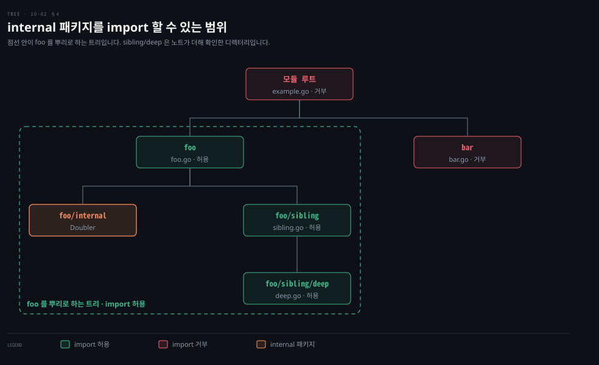

# 패키지는 대문자로 내보내고 이름으로 기능을 말하며 internal 로 감춥니다

---

> Learning Go 10장 둘째 부분입니다. 대문자로 정하는 내보내기, 패키지를 만들고 import 경로로 가져오는 법, 패키지 이름 짓기와 바꾸기, Go Doc 주석, 모듈 안에서만 나누는 `internal`, 순환 의존을 피하는 법, 모듈 정리와 API 이름 바꾸기, 그리고 되도록 피해야 할 `init` 함수를 다룹니다.

## 핵심 요약

> 이 편이 매달린 하나의 생각은 Go 가 키워드 대신 이름의 모양과 디렉터리 위치로 공개 범위를 정한다는 것입니다.

패키지 수준 식별자는 대문자로 시작하면 내보내지고 소문자나 밑줄로 시작하면 패키지 안에서만 보입니다. 내보낸 것은 모두 API 이므로 신중하게 고르고 문서로 남깁니다. 패키지 이름은 import 경로가 아니라 패키지 절이 정하며, `util` 같은 이름 대신 기능을 말하는 명사로 짓습니다. 이름이 겹치면 import 할 때 다른 이름을 줍니다.

모듈 안에서만 나누고 싶은 코드는 `internal` 디렉터리에 둡니다. 패키지 사이의 순환 의존은 허용되지 않습니다. 서로 기대는 패키지는 합치거나 원인이 되는 항목을 옮깁니다. 내보낸 이름을 바꿀 때는 원래 이름을 지우지 않고 새 이름을 더합니다. 타입은 `type Bar = Foo` 같은 별칭을 씁니다. `init` 함수는 보이지 않게 실행되므로 되도록 피합니다. 써야 한다면 한 번에 대입할 수 없는 패키지 변수 초기화에만 씁니다.


## 학습 목표

> 이 편을 읽고 나면 아래 다섯 가지를 스스로 해낼 수 있습니다.

1. 대문자로 내보내는 규칙과 import 경로·패키지 이름의 관계를 설명할 수 있습니다.
2. 기능을 말하는 패키지 이름을 짓고, 이름이 겹칠 때 import 이름을 바꿀 수 있습니다.
3. Go Doc 주석 규칙에 맞춰 패키지·타입·함수에 주석을 달 수 있습니다.
4. `internal` 패키지를 import 할 수 있는 범위와, 순환 의존을 푸는 두 방법을 말할 수 있습니다.
5. 타입 별칭으로 API 이름을 바꾸는 법과, `init` 함수를 피해야 하는 이유를 말할 수 있습니다.


## 1. 대문자로 내보내고 import 경로로 가져옵니다

> Go 는 키워드 대신 대문자로 시작하는 패키지 수준 식별자를 내보냅니다. 다른 패키지는 모듈 경로에 패키지 경로를 붙인 import 경로로 가져오며, 패키지 이름은 import 경로가 아니라 패키지 절이 정합니다.

지금까지의 예제는 `import` 문을 써 왔지만, 원문은 그것이 무엇을 하고 다른 언어의 import 와 어떻게 다른지 이제 설명한다고 말합니다. Go 의 `import` 문으로 다른 패키지에서 내보낸 상수·변수·함수·타입에 접근합니다. 식별자란 변수·상수·타입·함수·메서드의 이름이나 struct 의 필드 이름입니다. 패키지가 내보낸 식별자는 `import` 문 없이는 다른 패키지에서 접근할 수 없습니다.

그러면 Go 에서는 식별자를 어떻게 내보낼까요? Go 는 특별한 키워드 대신 대소문자로 패키지 수준 식별자가 선언된 패키지 밖에서 보이는지를 정합니다. 대문자로 시작하는 이름은 내보내집니다. 반대로 소문자나 밑줄로 시작하는 이름은 선언된 패키지 안에서만 접근할 수 있습니다. Go 식별자는 숫자로 시작할 수 없지만 숫자를 담을 수는 있습니다. Java 의 `public`·`private` 이 이름 첫 글자 하나로 대신되는 셈이고, Java 의 패키지 전용(package-private) 접근이 Go 의 소문자 이름에 가장 가깝습니다. 이 대응은 원문 밖입니다.

원문은 내보내는 것은 무엇이든 패키지 API 의 일부라고 말합니다. 식별자를 내보내기 전에 클라이언트에 드러낼 생각인지 확인하십시오. 내보낸 식별자는 모두 문서로 남기고, 의도적으로 메이저 버전을 바꾸는 게 아니라면 하위 호환을 지켜야 합니다(10-04 §2).

### 패키지를 만들고 가져옵니다

원문은 작은 프로그램으로 패키지를 보입니다. `package_example` 디렉터리 안에 `math` 와 `do-format` 디렉터리가 있습니다. `math` 의 `math.go` 는 이렇습니다.

```go
package math

func Double(a int) int {
	return a * 2
}
```

파일의 첫 줄을 **패키지 절**이라 부르며, `package` 키워드와 패키지 이름으로 이루어집니다. 패키지 절은 Go 소스 파일에서 빈 줄과 주석을 뺀 첫 줄이 늘 됩니다. `do-format` 디렉터리의 `formatter.go` 는 이렇습니다.

```go
package format

import "fmt"

func Number(num int) string {
	return fmt.Sprintf("The number is %d", num)
}
```

패키지 절의 이름은 `format` 인데 디렉터리는 `do-format` 입니다. 마지막으로 루트 디렉터리의 `main.go` 입니다.

```go
package main

import (
	"fmt"

	"github.com/learning-go-book-2e/package_example/do-format"
	"github.com/learning-go-book-2e/package_example/math"
)

func main() {
	num := math.Double(2)
	output := format.Number(num)
	fmt.Println(output)
}
```

`import` 부분은 패키지 셋을 가져옵니다. `fmt` 는 표준 라이브러리입니다. 나머지 둘은 프로그램 안의 패키지를 가리킵니다. 표준 라이브러리 밖에서 가져올 때는 **import 경로**를 적어야 하며, import 경로는 모듈 경로 뒤에 모듈 안의 패키지 경로를 붙인 것입니다. `"github.com/learning-go-book-2e/package_example/math"` 는 모듈 경로 `github.com/learning-go-book-2e/package_example` 과 모듈 안의 경로 `/math` 로 되어 있습니다.

패키지를 import 하고 그 패키지가 내보낸 식별자를 하나도 쓰지 않으면 컴파일 오류입니다. 원문은 이 덕에 Go 컴파일러가 만든 바이너리에 실제로 쓰는 코드만 들어간다고 말합니다. 원문의 경고도 있습니다. 웹에서 상대 경로 import 를 언급하는 옛 문서를 볼 수 있는데, 모듈에서는 동작하지 않고 애초에 나쁜 생각이었다는 것입니다. 이 프로그램을 빌드해 실행하면 `The number is 4` 가 찍힙니다.

### 패키지 이름은 패키지 절이 정합니다

`main` 은 `math` 패키지의 `Double` 을 패키지 이름을 앞에 붙여 불렀고, `format` 패키지의 `Number` 도 불렀습니다. import 에는 `do-format` 이라고 적었는데 `format` 은 어디서 왔을까요? 한 디렉터리의 모든 Go 파일은 같은 패키지 절을 가져야 합니다. 작은 예외 하나는 15장 「Testing Your Public API」에서 봅니다(절 이름만 원문에 있고 장 번호는 노트가 찾아 붙였습니다). 패키지 이름은 import 경로가 아니라 패키지 절이 정하기 때문에 `format` 입니다.

일반 규칙으로 패키지 이름은 그 패키지를 담은 디렉터리 이름과 맞춥니다. 맞지 않으면 패키지 이름을 알아내기 어렵습니다.

원문은 다르게 두는 경우 셋을 듭니다. 첫째는 늘 해 온 `main` 입니다. 특별한 패키지 이름 `main` 은 Go 애플리케이션의 시작점을 선언하며, `main` 패키지는 import 할 수 없어 헷갈리는 import 문이 생기지 않습니다. 둘째는 디렉터리 이름에 Go 식별자로 쓸 수 없는 문자가 있을 때입니다. `do-format` 은 유효한 식별자가 아니라 `format` 으로 바꿨습니다. 원문은 유효한 식별자가 아닌 이름으로 디렉터리를 아예 만들지 않는 편이 낫다고 말합니다. 셋째는 디렉터리로 버전을 나눌 때이며 10-04 §2 에서 봅니다.

04-01 에서 본 대로 import 문의 패키지 이름은 파일 블록에 있습니다. 그래서 한 패키지의 내보낸 기호를 다른 패키지의 두 파일에서 쓴다면, 두 파일 모두에서 import 해야 합니다.


## 2. 패키지 이름 짓기와 바꾸기

> 패키지 이름은 `util` 이 아니라 기능을 설명하는 명사로 짓고, 함수 이름은 동사로 둡니다. 이름이 겹치는 패키지는 import 할 때 다른 이름을 줍니다.

원문은 패키지 이름이 설명적이어야 한다고 말합니다. 문자열에서 이름을 모두 뽑는 함수와 이름을 알맞게 서식화하는 함수가 있다고 합시다. `util` 패키지에 `ExtractNames` 와 `FormatNames` 를 두면 쓸 때마다 `util.ExtractNames`·`util.FormatNames` 가 되는데, `util` 은 함수가 하는 일에 대해 아무것도 알려 주지 않습니다.

한 가지 방법은 `extract` 패키지에 `Names` 함수를, `format` 패키지에 또 `Names` 함수를 두는 것입니다. 패키지 이름으로 늘 구별되니 두 함수 이름이 같아도 괜찮습니다. 원문은 품사를 생각하는 편이 더 낫다고 말합니다. 함수나 메서드는 무언가를 하니 동사여야 하고, 패키지는 그 함수들이 만들거나 고치는 것의 이름, 곧 명사여야 합니다. 이 규칙대로면 `names` 패키지에 `Extract` 와 `Format` 을 두어 `names.Extract`·`names.Format` 으로 부릅니다.

패키지 안의 함수와 타입 이름에 패키지 이름을 되풀이하지도 않습니다. `names` 패키지 안의 함수를 `ExtractNames` 로 짓지 않습니다. 예외는 식별자 이름이 패키지 이름과 같을 때입니다. 표준 라이브러리의 `sort` 패키지에는 `Sort` 함수가, `context` 패키지에는 `Context` 인터페이스가 있습니다. Spring 프로젝트에 흔한 `common.util.StringUtils` 같은 이름이 Go 에서 권하지 않는 모양입니다. 이 비교는 원문 밖입니다.

### import 이름을 바꿔 충돌을 피합니다

이름이 겹치는 두 패키지를 import 할 때가 있습니다. 표준 라이브러리에는 난수를 만드는 패키지가 둘 있습니다. 암호학적으로 안전한 `crypto/rand` 와 그렇지 않은 `math/rand` 입니다. 일반 난수 생성기는 암호화용이 아니면 괜찮지만 예측할 수 없는 값으로 시드를 줘야 하므로, 암호학적 생성기의 값으로 일반 생성기에 시드를 주는 패턴이 흔합니다. 두 패키지의 이름은 모두 `rand` 라서, 현재 파일 안에서 한쪽에 다른 이름을 줍니다.

```go
import (
	crand "crypto/rand"
	"encoding/binary"
	"fmt"
	"math/rand"
)

func seedRand() *rand.Rand {
	var b [8]byte
	_, err := crand.Read(b[:])
	if err != nil {
		panic("cannot seed with cryptographic random number generator")
	}
	r := rand.New(rand.NewSource(int64(binary.LittleEndian.Uint64(b[:]))))
	return r
}
```

`crypto/rand` 를 `crand` 라는 이름으로 import 해 패키지 안에서 선언된 이름 `rand` 를 덮었습니다. `math/rand` 는 그대로 import 했습니다. 원문의 메모에 따르면 패키지 이름으로 쓸 수 있는 기호가 둘 더 있습니다. `.`(점)은 가져온 패키지의 내보낸 식별자를 모두 현재 패키지의 네임스페이스에 넣어 접두어 없이 쓰게 하지만, 이름만 보고는 현재 패키지에서 정의했는지 가져왔는지 알 수 없어 권하지 않습니다. `_`(밑줄)은 §5 의 `init` 에서 봅니다.

04-01 에서 본 대로 패키지 이름도 가려질 수 있습니다. 패키지와 같은 이름의 변수·타입·함수를 선언하면 그 선언이 있는 블록에서 패키지에 접근할 수 없습니다. 원문은 피할 수 없다면, 예를 들어 새로 import 한 패키지 이름이 기존 식별자와 겹친다면, 패키지 이름을 바꿔 충돌을 풀라고 말합니다.


## 3. Go Doc 주석으로 문서를 씁니다

> Go 는 주석을 그대로 문서로 바꾸는 Go Doc 형식을 씁니다. 문서화할 대상 바로 앞에 `//` 로 쓰고, 첫 단어는 그 기호의 이름으로 시작합니다.

다른 사람이 쓸 모듈을 만든다면 문서화가 중요합니다. Go 에는 자동으로 문서가 되는 주석 형식 Go Doc 이 있고, 규칙은 단순합니다.

- 문서화할 항목 바로 앞에, 선언과 사이에 빈 줄 없이 주석을 둡니다.
- 주석의 각 줄은 `//` 와 공백 하나로 시작합니다. `/*` 와 `*/` 도 적법하지만 `//` 가 관용적입니다.
- 기호(함수·타입·상수·변수·메서드)에 단 주석의 첫 단어는 그 기호의 이름이어야 합니다. 문법에 맞추려고 이름 앞에 "A" 나 "An" 을 써도 됩니다.
- 빈 주석 줄(`//` 와 줄바꿈)로 여러 문단을 나눕니다.

원문은 pkg.go.dev(10-03 §4)에서 HTML 로 보이는 문서를 꾸미는 방법도 나열합니다. `//` 뒤에 공백을 하나 더 넣으면 표나 소스 코드 같은 미리 서식화한 내용이 됩니다. `//` 뒤에 `#` 와 공백을 넣으면 제목이 됩니다. Markdown 과 달리 `#` 여러 개로 제목 단계를 나눌 수는 없습니다.

다른 패키지로 링크하려면 패키지 경로를 대괄호로 감쌉니다. 내보낸 기호로 링크하려면 이름을 대괄호로 감쌉니다. 다른 패키지의 기호면 `[pkgName.SymbolName]` 으로 씁니다. 날 URL 은 링크가 됩니다. 웹 페이지로 가는 링크 텍스트는 대괄호로 감싼 뒤 주석 블록 끝에 `// [TEXT]: URL` 형식으로 텍스트와 URL 을 짝짓습니다.

패키지 선언 앞의 주석은 패키지 수준 주석이 됩니다. `fmt` 패키지처럼 패키지 주석이 길면 패키지 안의 `doc.go` 파일에 두는 것이 관례입니다. 원문의 예 셋을 옮깁니다.

```go
// Package convert provides various utilities to
// make it easy to convert money from one currency to another.
package convert

// Money represents the combination of an amount of money
// and the currency the money is in.
//
// The value is stored using a [github.com/shopspring/decimal.Decimal]
type Money struct {
	Value    decimal.Decimal
	Currency string
}

// Convert converts the value of one currency to another.
//
// It has two parameters: a Money instance with the value to convert,
// and a string that represents the currency to convert to. Convert returns
// the converted currency and any errors encountered from unknown or unconvertible
// currencies.
//
// If an error is returned, the Money instance is set to the zero value.
//
// Supported currencies are:
//   - USD - US Dollar
//   - CAD - Canadian Dollar
//   - EUR - Euro
//   - INR - Indian Rupee
//
// More information on exchange rates can be found at [Investopedia].
//
// [Investopedia]: https://www.investopedia.com/terms/e/exchangerate.asp
func Convert(from Money, to string) (Money, error) {
	// ...
}
```

원문 PDF 는 `Convert` 주석의 한 줄이 `unconv` 에서 잘렸는데, 문맥상 `unconvertible` 로 채웠습니다.

명령줄 도구 `go doc` 이 문서를 보여 줍니다. `go doc PACKAGE_NAME` 은 패키지 문서와 식별자 목록을, `go doc PACKAGE_NAME.IDENTIFIER_NAME` 은 특정 식별자의 문서를 보여 줍니다. 웹에 올리기 전에 HTML 서식을 미리 보려면 pkg.go.dev 를 돌리는 프로그램과 같은 `pkgsite` 를 씁니다. `go install golang.org/x/pkgsite/cmd/pkgsite@latest` 로 설치하고, 모듈 루트에서 `pkgsite` 를 실행한 뒤 `http://localhost:8080` 을 엽니다.

원문의 팁은 적어도 내보낸 식별자에는 모두 주석을 달라는 것입니다. 빠진 주석을 알려 주는 서드파티 도구는 11장 「Using Code-Quality Scanners」에서 다룹니다. 장 번호는 노트가 찾아 붙였습니다. Javadoc 이 `/** ... */` 와 `@param` 태그를 쓰는 것과 달리 Go Doc 은 평범한 `//` 주석과 첫 단어 규칙만 씁니다. 이 비교는 원문 밖입니다.


## 4. internal 로 감추고 순환 의존을 피합니다

> `internal` 디렉터리 안의 패키지는 그 부모 디렉터리를 뿌리로 하는 트리 안에서만 import 됩니다. 패키지 사이의 순환 의존은 허용되지 않으니, 합치거나 원인이 되는 항목을 옮깁니다.

모듈 안의 패키지끼리는 함수·타입·상수를 나누고 싶지만 API 에는 넣고 싶지 않을 때가 있습니다. Go 는 특별한 패키지 이름 `internal` 로 이것을 지원합니다. 원문의 예는 그림 10-1 의 `internal_package_example` 디렉터리에서 `foo/internal` 패키지에 이 함수를 둡니다. 오류 출력에 찍힌 모듈 경로는 `…/internal_example` 입니다.

```go
func Doubler(a int) int {
	return a * 2
}
```

`foo` 패키지의 `foo.go` 와 `sibling` 패키지의 `sibling.go` 에서는 이 함수에 접근할 수 있습니다. 하지만 `bar` 패키지의 `bar.go` 나 루트 패키지의 `example.go` 에서 쓰려 하면 컴파일 오류가 납니다.

```bash
# 원문의 go build ./... 출력
package github.com/learning-go-book-2e/internal_example
example.go:3:8: use of internal package
github.com/learning-go-book-2e/internal_example/foo/internal not allowed

package github.com/learning-go-book-2e/internal_example/bar
bar/bar.go:3:8: use of internal package
github.com/learning-go-book-2e/internal_example/foo/internal not allowed
```

> **원문 정오**: 원문은 `internal` 패키지의 내보낸 식별자에 "only to the direct parent package of internal and the sibling packages of internal" 만 접근할 수 있다고 적었습니다. go1.25.1 의 `go doc cmd/go` 는 이 규칙을 "Code in or below a directory named "internal" is importable only by code in the directory tree rooted at the parent of "internal"." 로 정의합니다. 직계 부모와 형제뿐 아니라 부모 아래의 모든 하위 패키지가 import 할 수 있다는 뜻입니다. 이 노트를 쓰면서 `foo/sibling/deep` 패키지에서 `foo/internal` 을 import 하니 빌드가 통과했고, `bar` 에서는 `use of internal package ... not allowed` 로 막혔습니다. 원문이 드는 `foo`·`sibling` 예에는 들어맞지만, "only" 가 붙은 일반 규칙으로는 좁습니다. 원문 그림 10-1 은 PDF 추출본에 담기지 않아 이 노트에서 확인하지 못했습니다.



### 순환 의존은 허용되지 않습니다

원문은 빠른 컴파일러와 이해하기 쉬운 소스 코드가 Go 의 목표 둘이라며, 이를 위해 패키지 사이의 순환 의존을 허용하지 않는다고 말합니다. 패키지 A 가 직접이든 간접이든 패키지 B 를 import 하면, B 는 직접이든 간접이든 A 를 import 할 수 없습니다. 원문의 예는 `pet` 패키지가 `person` 을, `person` 패키지가 `pet` 을 import 해 서로의 타입으로 map 을 만듭니다. 빌드하면 import 사슬을 보여 주며 `import cycle not allowed` 로 실패합니다.

순환 의존이 생겼다면 선택지가 있습니다. 패키지를 너무 잘게 쪼개서 생긴 경우가 있는데, 두 패키지가 서로 기댄다면 하나로 합쳐야 할 가능성이 큽니다. `person` 과 `pet` 을 한 패키지로 합치면 문제가 풀립니다. 패키지를 나눠 둘 좋은 이유가 있다면, 순환을 일으키는 항목만 두 패키지 가운데 하나로 옮기거나 새 패키지로 옮길 수 있습니다. Spring 에서 두 서비스 빈이 서로 주입하면 순환 참조 오류가 나는 것과 비슷하지만, Go 는 이것을 실행 전 컴파일 단계에서 패키지 단위로 막습니다. 이 비교는 원문 밖입니다.


## 5. 모듈 정리, API 이름 바꾸기, init

> 작은 모듈은 패키지 하나로 두고, 애플리케이션은 로직을 `internal` 에, 라이브러리는 루트를 저장소 이름과 같은 패키지로 둡니다. 내보낸 이름을 바꿀 때는 새 이름을 더하고, 보이지 않게 실행되는 `init` 은 되도록 피합니다.

원문은 모듈 안의 Go 패키지를 구조화하는 공식 방법은 없지만 몇 가지 패턴이 자리 잡았다고 말합니다. 이 패턴들은 코드를 이해하고 유지하기 쉽게 하라는 원칙을 따릅니다. 모듈이 작으면 코드를 모두 한 패키지에 둡니다. 다른 모듈이 기대지 않는 한 정리를 미뤄도 해가 없습니다.

모듈이 커지면 먼저 어떤 종류의 모듈인지 묻습니다. 모듈은 크게 한 애플리케이션용과 주로 라이브러리용으로 나뉩니다. 애플리케이션으로만 쓸 것이 확실하면 프로젝트 루트를 `main` 패키지로 둡니다. `main` 의 코드는 최소로 하고 로직은 모두 `internal` 디렉터리에 둡니다. `main` 함수는 `internal` 의 코드를 부르기만 합니다. 이렇게 하면 누구도 애플리케이션 구현에 기대는 모듈을 만들 수 없습니다.

라이브러리라면 모듈 루트의 패키지 이름을 저장소 이름과 맞춰 import 이름과 패키지 이름이 같게 합니다. 그러려면 저장소 이름이 유효한 Go 식별자여야 합니다. 특히 하이픈을 단어 구분자로 쓸 수 없습니다. 라이브러리 모듈에 도구 애플리케이션이 딸려 있다면 모듈 루트에 `cmd` 디렉터리를 둡니다. 모듈에서 빌드할 바이너리마다 그 안에 디렉터리를 하나씩 만들고 패키지 이름을 `main` 으로 씁니다. 원문은 단순한 Go 모듈의 구조에 대해 Eli Bendersky 의 블로그 글을 권합니다.

### 기능 단위로 나누고 공유는 internal 로 합니다

프로젝트가 복잡해지면 패키지를 쪼개고 싶어지는데, 패키지 사이 의존을 줄이도록 정리하라고 원문은 말합니다.

흔한 패턴은 기능 조각별로 나누는 것입니다. 쇼핑 사이트라면 고객 관리 코드를 한 패키지에, 재고 관리 코드를 다른 패키지에 둡니다. 이 방식은 패키지 사이 의존을 줄여, 나중에 웹 애플리케이션 하나를 여러 마이크로서비스로 쪼개기 쉽게 합니다.

원문은 이것이 비즈니스 로직·데이터베이스 로직·DTO 를 각각 한 패키지에 모으는 많은 Java 애플리케이션의 방식과 대조된다고 짚습니다. Spring 프로젝트의 `controller`·`service`·`repository` 계층별 패키지 대신 `order`·`inventory` 같은 기능별 패키지를 쓰라는 말입니다. 이 풀이는 노트의 것입니다.

라이브러리를 만든다면 `internal` 을 활용하라고 원문은 권합니다. 모듈 안에 패키지를 여럿 두고 `internal` 밖에 두면, 모듈 안의 다른 패키지가 쓰도록 내보낸 기호는 모듈을 import 하는 누구나 쓸 수 있습니다. 원문은 하이럼의 법칙을 인용합니다.

> "With a sufficient number of users of an API, it does not matter what you promise in the contract: all observable behaviors of your system will be depended on by somebody."

API 사용자가 충분히 많으면 계약에 무엇을 약속했든 관계없이, 시스템의 관찰 가능한 모든 동작에 누군가 기대게 된다는 뜻입니다. 한번 API 가 되면 하위 호환을 깨는 새 버전을 내기로 할 때까지 계속 지원할 책임이 생깁니다(10-03 §3). 모듈 안에서만 나누고 싶은 기호는 `internal` 에 두고, 마음이 바뀌면 나중에 `internal` 밖으로 옮기면 됩니다. 원문은 Go 프로젝트 구조에 대한 좋은 개관으로 Kat Zien 의 GopherCon 2018 발표 "How Do You Structure Your Go Apps" 를 권합니다.

원문의 경고도 있습니다. GitHub 의 "golang-standards" 저장소가 "표준" 모듈 레이아웃이라고 주장하지만, Go 개발 책임자 Russ Cox 가 Go 팀이 이를 승인하지 않았고 권하는 구조는 오히려 안티패턴이라고 공개적으로 밝혔다는 것입니다. 코드 정리 방법으로 이 저장소를 인용하지 말라고 원문은 말합니다.

### 이름을 바꿀 때는 원래 이름을 남기고 별칭을 더합니다

모듈을 쓰다 보면 API 가 이상적이지 않다는 걸 깨닫게 됩니다. 그러면 내보낸 식별자 이름을 바꾸거나 모듈 안의 다른 패키지로 옮기고 싶어질 수 있습니다. 하위 호환을 깨지 않으려면 원래 식별자를 지우지 말고 다른 이름을 더합니다. 함수나 메서드라면 원래 것을 부르는 함수나 메서드를 선언하면 되고, 상수라면 같은 타입과 값의 다른 이름 상수를 선언하면 됩니다.

내보낸 타입의 이름을 바꾸거나 옮기려면 **별칭**을 씁니다. 별칭은 타입의 새 이름일 뿐입니다. 07-02 §1 에서 `type` 키워드로 기존 타입을 바탕으로 새 타입을 선언했는데, 별칭도 `type` 키워드로 선언합니다.

```go
type Foo struct {
	x int
	S string
}

func (f Foo) Hello() string {
	return "hello"
}

func (f Foo) goodbye() string {
	return "goodbye"
}

type Bar = Foo
```

별칭은 `type` 키워드, 별칭 이름, 등호, 원래 타입 이름으로 만듭니다. 별칭은 원래 타입과 같은 필드와 메서드를 가지며, 타입 변환 없이 원래 타입의 변수에 대입할 수 있습니다.

```go
func MakeBar() Bar {
	bar := Bar{
		x: 20,
		S: "Hello",
	}
	var f Foo = bar
	fmt.Println(f.Hello())
	return bar
}
```

로컬에서 `MakeBar()` 가 돌려준 값을 `%T` 로 찍으니 `main.Foo` 가 나왔습니다. 별칭은 새 타입이 아니라 같은 타입의 다른 이름이라는 것이 실행 결과로도 드러납니다. 07-02 §1 의 `type HighScore Score` 가 변환 없이는 대입되지 않던 것과 정반대입니다. 이 대비는 노트의 해석입니다.

원문은 별칭이 타입의 다른 이름일 뿐이라, 별칭으로 가리킨 struct 에 메서드를 더하거나 필드를 바꾸려면 원래 타입에 해야 한다고 말합니다. 별칭은 같은 패키지에도, 다른 패키지나 다른 모듈의 타입에도 만들 수 있습니다. 다만 다른 패키지에서 만든 별칭으로는 원래 타입의 내보내지 않은 메서드와 필드를 가리킬 수 없습니다. 별칭이 패키지 API 를 점진적으로 바꾸려고 있고, API 는 내보낸 부분만으로 이루어지니 말이 되는 제약입니다. 우회하려면 타입의 원래 패키지에 있는 코드를 불러 그런 필드와 메서드를 다룹니다.

내보낸 식별자 가운데 다른 이름을 가질 수 없는 것이 둘 있습니다. 패키지 수준 변수와 struct 필드입니다. 내보낸 struct 필드의 이름을 한번 정하면 다른 이름을 만들 방법이 없다고 원문은 말합니다.

### init 함수는 되도록 피합니다

원문은 Go 코드를 읽을 때 어떤 메서드와 함수가 불리는지 보통 분명하다고 말합니다. Go 에 메서드 오버라이딩이나 함수 오버로딩이 없는 이유 하나도 어떤 코드가 도는지 이해하기 쉽게 하려는 것입니다. 그런데 아무것도 명시적으로 부르지 않고 패키지에 상태를 준비하는 방법이 있습니다. 매개변수도 반환 값도 없는 `init` 함수를 선언하면, 다른 패키지가 그 패키지를 처음 참조할 때 실행됩니다. 입력도 출력도 없으니 패키지 수준 함수와 변수를 건드리는 부수 효과로만 일할 수 있습니다.

`init` 에는 독특한 점이 하나 더 있습니다. 한 패키지에, 심지어 한 파일에 `init` 을 여럿 선언할 수 있습니다. 여러 `init` 의 실행 순서는 문서화되어 있지만, 원문은 외우기보다 그냥 피하는 편이 낫다고 말합니다.

데이터베이스 드라이버 같은 일부 패키지는 `init` 으로 드라이버를 등록합니다. 하지만 그 패키지의 식별자는 하나도 쓰지 않고, Go 는 쓰지 않는 import 를 허용하지 않습니다. 그래서 Go 는 import 이름을 밑줄로 주는 빈 import 를 허용합니다. 함수의 쓰지 않는 반환 값을 밑줄로 건너뛰듯, 빈 import 는 패키지의 `init` 을 실행시키지만 내보낸 식별자에는 접근하지 않습니다.

```go
import (
	"database/sql"

	_ "github.com/lib/pq"
)
```

원문은 이 패턴이 등록 작업을 한다는 것이 분명하지 않아 낡은 것으로 여겨진다고 말합니다. 표준 라이브러리의 호환성 보장 때문에 데이터베이스 드라이버와 이미지 형식을 등록하는 데는 계속 써야 하지만, 자기 코드에 레지스트리 패턴이 있다면 플러그인을 명시적으로 등록하라고 합니다. Spring 의 컴포넌트 스캔이 클래스패스에서 빈을 찾아 등록하는 것처럼 보이지 않는 등록인데, Go 는 이것을 권하지 않는 쪽입니다. 이 비교는 원문 밖입니다.

원문은 오늘날 `init` 의 주된 쓰임이 한 번의 대입으로 설정할 수 없는 패키지 수준 변수를 초기화하는 것이라고 말합니다.

패키지 최상위에 가변 상태를 두면 데이터 흐름을 이해하기 어려우니, `init` 으로 설정한 패키지 수준 변수는 사실상 불변이어야 합니다. Go 에는 이것을 강제하는 수단이 없으니 코드가 값을 바꾸지 않게 지켜야 한다고 원문은 말합니다. 실행 중에 바꿔야 할 패키지 수준 변수가 있다면, 그 상태를 패키지의 함수가 초기화해 돌려주는 struct 에 넣도록 리팩터링할 수 있는지 보라고 합니다.

`init` 은 명시적으로 불리지 않으니 동작을 문서화해야 합니다. 예를 들어 파일을 읽거나 네트워크에 접근하는 `init` 이 있는 패키지는 패키지 수준 주석에 그것을 밝혀, 보안에 민감한 사용자가 예상 밖의 I/O 에 놀라지 않게 합니다.


## 핵심 개념 체크리스트

목표 번호 순서대로 짝지었습니다.

- [ ] (목표 1) import 경로가 `.../do-format` 인데 코드에서 `format.Number` 로 부르는 이유를 말할 수 있습니까?
- [ ] (목표 1) 패키지 수준 함수 `doubler` 를 다른 패키지에서 부를 수 없는 이유를 말할 수 있습니까?
- [ ] (목표 2) `util.FormatNames` 대신 원문이 권하는 이름은 무엇이고, 그 근거가 되는 품사 규칙은 무엇입니까?
- [ ] (목표 3) Go Doc 에서 함수 주석의 첫 단어는 무엇이어야 합니까?
- [ ] (목표 4) `foo/internal` 을 `foo/sibling/deep` 은 import 할 수 있고 `bar` 는 못 하는 이유를 말할 수 있습니까?
- [ ] (목표 4) `pet` 과 `person` 이 서로 import 할 때 풀 수 있는 두 방법을 말할 수 있습니까?
- [ ] (목표 5) `type Bar = Foo` 와 `type Bar Foo` 의 차이를 대입 가능성으로 설명할 수 있습니까?
- [ ] (목표 5) 빈 import `_ "github.com/lib/pq"` 가 하는 일과 원문이 이 패턴을 낡았다고 보는 이유를 말할 수 있습니까?


## 관련 문서

- [10-01 모듈은 go.mod 로 한 단위가 되고 go 지시어가 빌드할 Go 버전을 정합니다](./10-01.%EB%AA%A8%EB%93%88%EC%9D%80%20go.mod%20%EB%A1%9C%20%ED%95%9C%20%EB%8B%A8%EC%9C%84%EA%B0%80%20%EB%90%98%EA%B3%A0%20go%20%EC%A7%80%EC%8B%9C%EC%96%B4%EA%B0%80%20%EB%B9%8C%EB%93%9C%ED%95%A0%20Go%20%EB%B2%84%EC%A0%84%EC%9D%84%20%EC%A0%95%ED%95%A9%EB%8B%88%EB%8B%A4.md) — 10장 앞. 모듈과 go.mod
- [10-03 서드파티 모듈은 go get 으로 들이고 최소 버전 선택으로 버전을 고릅니다](./10-03.%EC%84%9C%EB%93%9C%ED%8C%8C%ED%8B%B0%20%EB%AA%A8%EB%93%88%EC%9D%80%20go%20get%20%EC%9C%BC%EB%A1%9C%20%EB%93%A4%EC%9D%B4%EA%B3%A0%20%EC%B5%9C%EC%86%8C%20%EB%B2%84%EC%A0%84%20%EC%84%A0%ED%83%9D%EC%9C%BC%EB%A1%9C%20%EB%B2%84%EC%A0%84%EC%9D%84%20%EA%B3%A0%EB%A6%85%EB%8B%88%EB%8B%A4.md) — 10장 셋째. 서드파티 모듈
- [04-01 안쪽 블록의 같은 이름은 바깥 변수를 가립니다](./04-01.%EC%95%88%EC%AA%BD%20%EB%B8%94%EB%A1%9D%EC%9D%98%20%EA%B0%99%EC%9D%80%20%EC%9D%B4%EB%A6%84%EC%9D%80%20%EB%B0%94%EA%B9%A5%20%EB%B3%80%EC%88%98%EB%A5%BC%20%EA%B0%80%EB%A6%BD%EB%8B%88%EB%8B%A4.md) — 4장. 파일 블록과 패키지 이름 섀도잉
- [Learning Go 2판 — 정독 인덱스](./README.md) — 16장 전체 지도


## 참고 자료

- 원본: 《Learning Go, 2nd Edition》 (Jon Bodner, O'Reilly)
- 다룬 범위: Chapter 10 "Building Packages" 부터 "Avoiding the init Function if Possible" 까지
- go1.25.1 `go doc cmd/go` 「Internal Directories」 — internal 원문 정오의 근거
