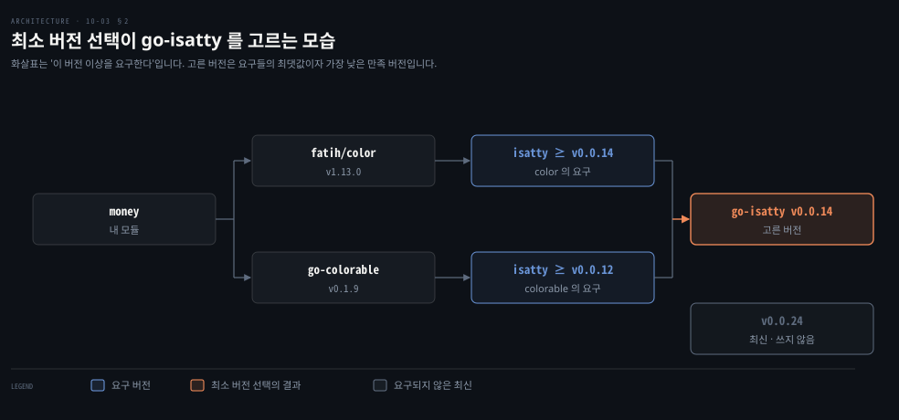

# 서드파티 모듈은 go get 으로 들이고 최소 버전 선택으로 버전을 고릅니다

---

> Learning Go 10장 셋째 부분입니다. 서드파티 모듈을 `go get` 으로 들여 go.mod 와 go.sum 을 채우는 법, 버전을 내리고 올리는 법, 유의적 버전과 최소 버전 선택, 메이저 버전이 바뀔 때 import 경로가 바뀌는 규칙, 벤더링과 pkg.go.dev 를 다룹니다.

## 핵심 요약

> 이 편이 매달린 하나의 생각은 Go 가 의존성 버전을 "가장 최신"이 아니라 "요구를 만족하는 가장 낮은 것"으로 고른다는 것입니다.

Go 는 늘 소스 코드에서 바이너리 하나를 빌드합니다. 서드파티 패키지도 저장소 위치를 import 경로로 적어 가져옵니다. `go get ./...` 은 소스의 import 를 훑어 go.mod 에 모듈을 더합니다. 그리고 go.sum 에 해시를 적습니다. 모듈 경로를 직접 넘기면 개별 모듈의 버전을 바꿀 수 있습니다. `go mod tidy` 는 go.mod 를 소스와 맞춥니다.

모듈 버전은 유의적 버전을 따릅니다. 여러 의존성이 같은 모듈의 서로 다른 버전을 요구하면, Go 는 모든 요구를 만족하는 가장 낮은 버전 하나를 고릅니다. 이것이 최소 버전 선택입니다. 하위 호환을 깨는 메이저 버전은 import 경로 끝에 `/v2` 처럼 붙어 아예 다른 패키지가 됩니다. 벤더링은 의존성을 모듈 안에 복사하는 방법이고, pkg.go.dev 는 공개 모듈의 문서를 모아 둡니다.


## 학습 목표

> 이 편을 읽고 나면 아래 다섯 가지를 스스로 해낼 수 있습니다.

1. `go get ./...` 과 모듈 경로를 넘긴 `go get` 의 차이를 말하고, go.sum 이 담는 것을 설명할 수 있습니다.
2. `go list -m -versions` 와 `go get 모듈@버전` 으로 의존성 버전을 확인하고 내릴 수 있습니다.
3. 최소 버전 선택이 여러 요구 가운데 어떤 버전을 고르는지 `go mod graph` 로 보일 수 있습니다.
4. `-u=patch` 와 `-u` 의 차이, 그리고 메이저 버전이 바뀌면 import 경로가 바뀌는 이유를 말할 수 있습니다.
5. 벤더링을 언제 쓰고 무엇을 치르는지 말할 수 있습니다.


## 1. 서드파티 코드를 들입니다

> 서드파티 패키지도 저장소 위치를 담은 import 경로로 가져옵니다. `go get ./...` 이 소스의 import 를 훑어 go.mod 에 모듈을 더하고, go.sum 에 각 모듈과 그 go.mod 의 해시를 적습니다.

지금까지는 `fmt`·`errors`·`os`·`math` 같은 표준 라이브러리 패키지를 import 했습니다. Go 는 서드파티 패키지도 같은 import 체계로 통합합니다. 원문은 다른 많은 컴파일 언어와 달리 Go 가 늘 소스 코드에서 바이너리 파일 하나로 애플리케이션을 빌드한다고 말합니다. 여기에는 내 모듈의 소스와 내 모듈이 기대는 모든 모듈의 소스가 들어갑니다. Go 컴파일러는 참조하지 않은 패키지를 바이너리에 넣지 않습니다. 서드파티 패키지를 import 할 때도 패키지가 있는 저장소 위치를 적습니다.

Maven 이 컴파일된 jar 를 내려받아 클래스패스에 두는 것과 달리, Go 는 의존성의 소스를 받아 내 코드와 함께 컴파일합니다. 이 대비는 원문 밖입니다.

### money 예제로 go get 을 봅니다

원문은 2장에서 정확한 십진수 표현이 필요하면 부동소수점을 쓰지 말라고 했던 것을 떠올립니다. 좋은 선택지 하나가 ShopSpring 의 `decimal` 모듈입니다. 원문은 저자가 만든 서식 모듈 `formatter` 와 함께 세금을 포함한 가격을 계산해 깔끔하게 찍는 `money` 프로그램을 보입니다.

```go
package main

import (
	"fmt"
	"log"
	"os"

	"github.com/learning-go-book-2e/formatter"
	"github.com/shopspring/decimal"
)

func main() {
	if len(os.Args) < 3 {
		fmt.Println("Need two parameters: amount and percent")
		os.Exit(1)
	}
	amount, err := decimal.NewFromString(os.Args[1])
	if err != nil {
		log.Fatal(err)
	}
	percent, err := decimal.NewFromString(os.Args[2])
	if err != nil {
		log.Fatal(err)
	}
	percent = percent.Div(decimal.NewFromInt(100))
	total := amount.Add(amount.Mul(percent)).Round(2)
	fmt.Println(formatter.Space(80, os.Args[1], os.Args[2],
		total.StringFixed(2)))
}
```

`github.com/learning-go-book-2e/formatter` 와 `github.com/shopspring/decimal` 이 서드파티 import 입니다. 저장소 안의 패키지 위치를 담고 있다는 점을 눈여겨봅니다. 처음 go.mod 에는 `module` 과 `go 1.20` 두 줄뿐이라 빌드하면 오류가 납니다.

```bash
# go build 출력 (원문과 go1.25.1 이 같았습니다)
main.go:8:2: no required module provides package github.com/learning-go-book-2e/formatter; to add it:
	go get github.com/learning-go-book-2e/formatter
main.go:9:2: no required module provides package github.com/shopspring/decimal; to add it:
	go get github.com/shopspring/decimal
```

서드파티 모듈을 go.mod 에 적어야 빌드할 수 있습니다. `go get` 은 모듈을 내려받고 go.mod 를 고칩니다. 가장 단순한 방법은 `go get ./...` 으로 소스를 훑어 `import` 문에 있는 모듈을 모두 더하는 것입니다. 원문의 출력은 `decimal v1.3.1`, `formatter` 의 pseudo-version, 그리고 `fatih/color`·`go-colorable`·`go-isatty`·`golang.org/x/sys` 를 내려받고 더합니다.

go.mod 에는 `require` 묶음 둘이 생깁니다(10-01 §2 의 모양). 첫 묶음은 직접 import 한 모듈입니다. `formatter` 에는 버전 태그가 없어서 Go 가 **pseudo-version**(`v0.0.0-20220918024742-1835a89362c9` 처럼 날짜와 커밋 해시로 만든 버전)을 지어냅니다. 둘째 묶음의 `// indirect` 모듈 가운데 `fatih/color` 는 `formatter` 가 직접 씁니다. 나머지 셋은 `fatih/color` 가 기댑니다.

원문은 의존성의 의존성까지 모두 내 모듈의 go.mod 에 들어간다고 말합니다. 의존성에서만 쓰는 것에는 `indirect` 가 붙습니다.

### go.sum 은 모듈과 go.mod 의 해시를 담습니다

go.mod 를 고치는 것과 함께 go.sum 파일이 생깁니다. 의존성 트리의 모듈마다 go.sum 에 한두 줄이 들어갑니다. 한 줄은 모듈과 버전과 모듈의 해시이고, 다른 한 줄은 그 모듈 go.mod 의 해시입니다.

```bash
github.com/fatih/color v1.13.0 h1:8LOYc1KYPPmyKMuN8QV2DNRWNbLo6LZ0iLs...
github.com/fatih/color v1.13.0/go.mod h1:kLAiJbzzSOZDVNGyDpeOxJ47H46q...
github.com/mattn/go-isatty v0.0.12/go.mod h1:cbi8OIDigv2wuxKPP5vlRcQ1...
github.com/mattn/go-isatty v0.0.14 h1:yVuAays6BHfxijgZPzw+3Zlu5yQgKGP...
```

원문의 go.sum 일부입니다. 해시의 쓰임은 10-04 §5 의 프록시에서, 같은 모듈의 여러 버전이 보이는 이유는 §2 의 최소 버전 선택에서 다룹니다. 이 노트를 쓰면서 같은 순서로 빌드하고 `./money 99.99 7.25` 를 돌리니, 원문처럼 80칸 폭에 `99.99`·`7.25`·`107.24` 가 벌어져 찍혔습니다.

원문의 메모는 이 예제가 go.sum 없이, 불완전한 go.mod 로 올려져 있었다고 밝힙니다. 파일이 채워지는 과정을 보여 주려고 그런 것입니다. 자기 모듈을 소스 관리에 커밋할 때는 늘 최신 go.mod 와 go.sum 을 함께 넣으라고 원문은 말합니다. 그래야 의존성 버전이 정확히 정해져, 누가 빌드하든 같은 바이너리가 나옵니다.

npm 과 비교하면 go.sum 하나가 `package-lock.json` 에 해당하지는 않습니다. Go 는 버전을 go.mod 가 정하고 최소 버전 선택이 결정적이라, go.sum 은 해시만 담습니다. go.mod 와 go.sum 을 합친 것이 잠금 파일의 자리이고, go.sum 만 떼면 잠금 파일의 `integrity` 필드에 가깝습니다. 이 비교는 원문 밖입니다.

### 모듈 경로를 넘기면 모두 indirect 로 적힙니다

`go get` 을 쓰는 다른 방법은 모듈 경로를 직접 넘기는 것입니다. 원문은 go.mod 를 되돌리고 go.sum 을 지운 뒤 두 모듈을 차례로 `go get` 합니다.

```bash
# 원문의 출력
go get github.com/learning-go-book-2e/formatter
go: added github.com/learning-go-book-2e/
    formatter v0.0.0-20200921021027-5abc380940ae
go get github.com/shopspring/decimal
go: added github.com/shopspring/decimal v1.3.1
```

> **원문 정오**: 원문은 이 `go get` 이 `formatter v0.0.0-20200921021027-5abc380940ae` 를 더했다고 출력을 보이는데, 바로 뒤 go.mod 에는 `formatter v0.0.0-20220918024742-1835a89362c9` 가 적혀 있습니다. 같은 명령의 결과가 서로 다른 커밋입니다. 이 노트를 쓰면서 같은 명령을 돌리니 go.mod 에 `1835a89362c9` 판이 들어갔습니다. `5abc380940ae` 는 모듈 프록시에 있는 2020년의 더 오래된 커밋이라, 출력 쪽이 이전 판 책의 것이 남은 것으로 보입니다(노트의 추정).

원문의 메모는 두 번째 `go get` 에서 `go: downloading` 이 안 보이는 이유를 설명합니다. Go 는 로컬 컴퓨터에 모듈 캐시를 둡니다. 한 번 내려받은 모듈 버전은 사본을 캐시에 둡니다. 소스 코드는 작고 디스크는 크니 보통 문제가 되지 않습니다. 캐시를 지우려면 `go clean -modcache` 를 씁니다.

이렇게 받은 뒤 go.mod 를 보면 모든 import 가 `indirect` 로 표시되어 있습니다. `formatter` 에서 온 것만이 아닙니다. 모듈 이름을 넘기면 `go get` 은 그 모듈이 메인 모듈 안에서 쓰이는지 소스를 확인하지 않습니다. 그래서 안전하게 `indirect` 를 붙입니다.

10-01 §3 에서 예고한 "직접 의존성이 indirect 로 표시되는 상황"이 이것입니다. 표시를 자동으로 고치려면 `go mod tidy` 를 씁니다. 소스를 훑어 go.mod 와 go.sum 을 소스와 맞춥니다. 모듈 참조를 더하고 지우며 `indirect` 주석도 바로잡습니다. 이 노트에서도 `go mod tidy` 뒤 go.mod 가 앞의 두 묶음 모양으로 돌아왔습니다.

그렇다면 왜 모듈 이름으로 `go get` 을 할까요? 원문의 답은 개별 모듈의 버전을 바꿀 수 있기 때문이라는 것입니다.


## 2. 버전과 최소 버전 선택

> 의존성 버전은 `go list -m -versions` 로 확인하고 `go get 모듈@버전` 으로 바꿉니다. 여러 모듈이 같은 모듈의 다른 버전을 요구하면 Go 는 모든 요구를 만족하는 가장 낮은 버전 하나를 고릅니다.

원문은 세금 계산 프로그램 `region_tax` 로 버전을 다룹니다. 저자가 만든 `simpletax` 모듈과 `decimal` 을 import 합니다. `go get ./...` 을 하면 `simpletax v1.1.0` 이 더해집니다. 원문은 기본으로 Go 가 의존성을 더할 때 최신 버전을 고른다고 말합니다. 그런데 `./region_tax 99.99 12345` 를 돌리면 `unknown zip: 12345` 라는 뜻밖의 오류가 납니다. 최신 버전에 버그가 있을 수 있습니다.

버전 관리가 쓸모 있는 이유 하나는 모듈의 이전 버전을 지정할 수 있다는 것입니다. 먼저 쓸 수 있는 버전을 `go list` 로 봅니다.

```bash
go list -m -versions github.com/learning-go-book-2e/simpletax
github.com/learning-go-book-2e/simpletax v1.0.0 v1.1.0
```

이 노트를 쓰면서 돌린 결과도 같았습니다. `go list` 는 기본으로 모듈에서 쓰는 패키지를 나열합니다. `-m` 은 모듈을 나열하게 바꿉니다. `-versions` 는 지정한 모듈의 쓸 수 있는 버전을 보고하게 합니다. v1.0.0 으로 내리려면 `go get github.com/learning-go-book-2e/simpletax@v1.0.0` 을 씁니다. 출력은 `go: downgraded github.com/learning-go-book-2e/simpletax v1.1.0 => v1.0.0` 입니다. go.mod 의 버전도 바뀝니다.

go.sum 에는 `simpletax` 의 두 버전이 모두 남습니다. 원문은 모듈 버전을 바꾸거나 지워도 go.sum 에 항목이 남을 수 있지만 문제가 되지 않는다고 말합니다. 다시 빌드해 돌리면 `107.99` 가 나와 버그가 사라집니다.

### 유의적 버전 — major.minor.patch

원문의 글상자는 Go 모듈의 버전이 **유의적 버전**(SemVer)을 따른다고 말합니다. 모듈에 유의적 버전을 요구해 모듈 관리 코드를 단순하게 하고, 사용자가 새 릴리스의 약속을 이해하게 합니다. 버전은 `v` 뒤에 `major.minor.patch` 로 씁니다. 버그를 고치면 패치 번호를 올립니다. 하위 호환되는 새 기능을 더하면 마이너 번호를 올리고 패치를 0 으로 돌립니다. 하위 호환을 깨면 메이저 번호를 올리고 마이너와 패치를 0 으로 돌립니다.

### 최소 버전 선택 — 요구를 만족하는 가장 낮은 버전

내 모듈이 기대는 모듈 둘 이상이 같은 모듈에 기댈 때가 옵니다. 흔히 그 모듈의 서로 다른 마이너나 패치 버전을 선언합니다. 원문은 Go 가 이것을 **최소 버전 선택**으로 푼다고 말합니다. 모든 의존성의 go.mod 에서 동작한다고 선언된 버전 가운데 가장 낮은 버전을 늘 얻는다는 원칙입니다.

원문의 예로, 내 모듈이 A·B·C 에 직접 기대고 셋 모두 D 에 기댄다고 합시다. A 는 D v1.1.0, B 는 v1.2.0, C 는 v1.2.3 을 요구합니다. Go 는 D 를 한 번만 import 하고 v1.2.3 을 고릅니다. Go Modules Reference 의 말로 모든 요구를 만족하는 최소 버전이기 때문입니다.

`go mod graph` 는 모듈과 모든 의존성의 그래프를 보여 줍니다. 각 줄은 부모와, 의존성과 그 버전입니다. 이 노트를 쓰면서 `money` 에서 돌린 결과의 일부입니다.

```bash
github.com/fatih/color@v1.13.0 github.com/mattn/go-isatty@v0.0.14
github.com/mattn/go-colorable@v0.1.9 github.com/mattn/go-isatty@v0.0.12
```

`fatih/color` 는 `go-isatty` v0.0.14 를 요구합니다. `go-colorable` 은 v0.0.12 를 요구합니다. 모든 요구를 만족하는 가장 낮은 버전인 v0.0.14 가 쓰입니다. 이 노트의 `go list -m all` 도 `go-isatty v0.0.14` 였습니다. 원문은 글을 쓸 때 `go-isatty` 의 최신이 v0.0.16 이었지만 쓰이지 않았다고 말합니다.

이 노트를 쓴 2026년 9월 기준 최신은 v0.0.24 였는데 그래도 v0.0.14 가 골라졌습니다. 원문은 이것을 "The Go compiler selects" 라고 적었습니다. 엄밀히 버전을 고르는 것은 컴파일러가 아니라 `go` 명령의 모듈 시스템입니다(원문 밖 보충).



### 호환성이 깨지면 모듈 작성자가 고칩니다

원문은 이 체계가 완벽하지 않다고 인정합니다. A 가 D v1.1.0 에서는 동작하는데 v1.2.3 에서는 동작하지 않는다면 어떻게 할까요? Go 의 답은 모듈 작성자에게 연락해 호환성 문제를 고치게 하라는 것입니다. import 호환성 규칙은 이렇습니다.

> "If an old package and a new package have the same import path, the new package must be backward compatible with the old package."

옛 패키지와 새 패키지의 import 경로가 같으면, 새 패키지는 옛 패키지와 하위 호환되어야 한다는 뜻입니다. 모듈의 모든 마이너와 패치 버전은 하위 호환되어야 하고, 그렇지 않으면 버그입니다. 예에서는 하위 호환을 깬 D 를 고치거나, D 의 동작을 잘못 가정한 A 를 고쳐야 합니다.

원문은 이 답이 만족스럽지 않을 수 있지만 정직하다고 말합니다. npm 같은 일부 빌드 시스템은 같은 패키지의 여러 버전을 함께 넣습니다. 그러면 특히 패키지 수준 상태가 있을 때 나름의 버그가 생기고, 애플리케이션 크기도 커집니다. 원문은 어떤 일은 코드보다 커뮤니티가 더 잘 푼다고 정리합니다. Maven 은 의존성 트리에서 가장 가까운 선언을 고르는 규칙이라, 간접 의존성이 뜻밖에 낮은 버전으로 정해지기도 합니다. Go 는 요구의 최댓값을 고르는 셈이라 동작이 다릅니다. 이 비교는 원문 밖입니다.


## 3. 호환되는 버전과 호환되지 않는 버전으로 올리기

> 같은 마이너 안의 패치로 올리려면 `go get -u=patch`, 가장 최신으로 올리려면 `go get -u` 를 씁니다. 메이저 버전이 바뀌면 import 경로 끝에 `/vN` 이 붙어 다른 패키지가 됩니다.

의존성을 명시적으로 올리고 싶다면 어떻게 할까요? 원문은 `simpletax` 에 세 버전이 더 나왔다고 가정합니다. v1.1.0 의 문제를 고친 버그 패치 v1.1.1, 기능을 유지하며 함수를 하나 더한 v1.2.0, v1.2.0 의 버그를 고친 v1.2.1 입니다.

현재 마이너 버전의 버그 패치로 올리려면 `go get -u=patch github.com/learning-go-book-2e/simpletax` 를 씁니다.

v1.0.0 으로 내려 둔 상태라면 같은 마이너의 패치 버전이 없으니 그대로 남습니다. `go get github.com/learning-go-book-2e/simpletax@v1.1.0` 으로 올린 뒤 `-u=patch` 를 쓰면 v1.1.1 이 됩니다. 마지막으로 `go get -u github.com/learning-go-book-2e/simpletax` 는 가장 최근 버전인 v1.2.1 로 올립니다. 이 세 버전은 원문의 가정입니다. 이 노트에서 `go list` 로 본 실제 v1 버전은 v1.0.0 과 v1.1.0 뿐이었습니다.

### 메이저 버전이 바뀌면 import 경로가 바뀝니다

원문은 프로그램을 캐나다로 넓힌다고 합니다. 다행히 미국과 캐나다를 모두 다루는 `simpletax` 판이 있지만 API 가 조금 달라서 버전이 v2.0.0 입니다. 호환되지 않는 변경을 다루려고 Go 모듈은 **유의적 import 버전 규칙**을 따르며, 두 부분으로 됩니다.

- 모듈의 메이저 버전을 올려야 합니다.
- 메이저 버전이 0 과 1 이 아니면 모듈 경로가 `vN` 으로 끝나야 합니다(N 은 메이저 버전).

경로가 바뀌는 이유는 import 경로가 패키지를 유일하게 식별하기 때문입니다. 정의상 호환되지 않는 버전의 패키지는 같은 패키지가 아닙니다. 경로가 다르니 호환되지 않는 두 버전을 프로그램의 다른 부분에서 따로 import 해, 점진적으로 올릴 수 있습니다.

```go
"github.com/learning-go-book-2e/simpletax/v2"
```

import 를 이렇게 바꾸고 `main` 을 고칩니다.

```go
func main() {
	amount, err := decimal.NewFromString(os.Args[1])
	if err != nil {
		log.Fatal(err)
	}
	zip := os.Args[2]
	country := os.Args[3]
	percent, err := simpletax.ForCountryPostalCode(country, zip)
	if err != nil {
		log.Fatal(err)
	}
	total := amount.Add(amount.Mul(percent)).Round(2)
	fmt.Println(total)
}
```

이제 셋째 명령줄 인자로 국가 코드를 읽고, `simpletax` 의 다른 함수를 부릅니다. `go get ./...` 을 하면 `simpletax/v2 v2.0.0` 이 더해집니다. 이 노트를 쓰면서 같은 코드로 빌드하니 `./region_tax 99.99 M4B1B4 CA` 는 `112.99`, `./region_tax 99.99 12345 US` 는 `107.99` 로 원문과 같았습니다. 다만 `decimal` 은 원문의 v1.3.1 이 아니라 그 사이 나온 v1.4.0 이 더해졌습니다. 기본으로 최신 버전을 고른다는 원문의 설명대로입니다.

원문의 go.mod 에는 `simpletax v1.0.0` 과 `simpletax/v2 v2.0.0` 이 함께 적힙니다. 옛 버전은 더는 쓰지 않는데도 남아 있으니 `go mod tidy` 로 지웁니다. 그러면 go.mod 와 go.sum 에 `simpletax` 의 v2.0.0 만 남습니다. Java 에서 호환되지 않는 새 판은 보통 같은 좌표에 버전만 올라가 클래스패스 충돌을 부르는데, Go 는 경로 자체를 바꿔 두 판이 공존하게 합니다. 이 대비는 원문 밖입니다.


## 4. 벤더링과 pkg.go.dev

> 벤더링은 의존성 사본을 모듈 안 `vendor` 디렉터리에 두는 방법입니다. 모듈 프록시 뒤로 쓰임이 줄었지만 CI 에서 내려받기를 줄일 때 여전히 쓰며, 대가는 저장소 크기입니다.

어떤 조직은 모듈이 늘 같은 의존성으로 빌드되도록 의존성 사본을 모듈 안에 둡니다. 이것을 **벤더링**이라 부릅니다. `go mod vendor` 로 켭니다. 모듈 최상위에 모든 의존성을 담은 `vendor` 디렉터리가 생깁니다. 컴퓨터의 모듈 캐시 대신 이것이 쓰입니다.

go.mod 에 새 의존성을 더하거나 `go get` 으로 기존 의존성을 올리면 `go mod vendor` 를 다시 돌려 `vendor` 를 갱신해야 합니다. 잊으면 `go build`·`go run`·`go test` 가 오류 메시지를 보이며 실행을 거부합니다.

원문은 예전 Go 의존성 관리 체계는 벤더링이 필요했지만, 모듈과 프록시 서버(10-04 §5)가 나오며 쓰임이 줄고 있다고 말합니다. 그래도 벤더링을 쓸 이유 하나는 일부 CI/CD 파이프라인에서 빌드를 빠르고 효율적으로 하는 것입니다. 파이프라인의 빌드 서버가 매번 새로 뜨면 모듈 캐시가 보존되지 않습니다. 의존성을 벤더링해 두면 빌드마다 의존성을 내려받는 네트워크 호출을 여러 번 하지 않아도 됩니다. 대가는 버전 관리 안의 코드베이스 크기가 크게 늘어난다는 것입니다.

### pkg.go.dev 가 공개 모듈의 문서를 모읍니다

Go 모듈의 중앙 저장소는 없지만, 문서를 모아 두는 서비스는 하나 있습니다. Go 팀이 만든 pkg.go.dev 는 오픈 소스 Go 모듈을 자동으로 색인합니다. 모듈마다 godoc, 라이선스, README, 모듈의 의존성, 그 모듈에 기대는 오픈 소스 모듈을 보여 줍니다. 원문은 그림 10-2 로 `simpletax` 모듈의 pkg.go.dev 페이지를 보여 준다고 하는데, 그림은 PDF 추출본에 담기지 않았습니다. Maven Central 의 검색 페이지와 javadoc.io 를 합친 자리라고 보면 됩니다. 이 비교는 원문 밖입니다.


## 핵심 개념 체크리스트

목표 번호 순서대로 짝지었습니다.

- [ ] (목표 1) 모듈 경로를 넘겨 `go get` 하면 직접 쓰는 모듈에도 `// indirect` 가 붙는 이유와 고치는 명령을 말할 수 있습니까?
- [ ] (목표 1) go.sum 의 한 모듈에 줄이 둘 있는 이유를 말할 수 있습니까?
- [ ] (목표 2) `simpletax` 를 v1.0.0 으로 내리는 명령을 쓸 수 있습니까?
- [ ] (목표 3) `go-isatty` 의 최신이 v0.0.24 인데도 v0.0.14 가 쓰이는 이유를 설명할 수 있습니까?
- [ ] (목표 4) v1.0.0 에 머문 상태에서 `go get -u=patch` 를 하면 버전이 바뀌지 않는 이유를 말할 수 있습니까?
- [ ] (목표 4) `simpletax` 와 `simpletax/v2` 를 한 프로그램에서 함께 import 할 수 있는 이유를 말할 수 있습니까?
- [ ] (목표 5) 매번 새로 뜨는 CI 빌드 서버에서 벤더링이 주는 이점과 대가를 말할 수 있습니까?


## 관련 문서

- [10-04 모듈은 태그로 게시하고 워크스페이스와 프록시로 다룹니다](./10-04.%EB%AA%A8%EB%93%88%EC%9D%80%20%ED%83%9C%EA%B7%B8%EB%A1%9C%20%EA%B2%8C%EC%8B%9C%ED%95%98%EA%B3%A0%20%EC%9B%8C%ED%81%AC%EC%8A%A4%ED%8E%98%EC%9D%B4%EC%8A%A4%EC%99%80%20%ED%94%84%EB%A1%9D%EC%8B%9C%EB%A1%9C%20%EB%8B%A4%EB%A3%B9%EB%8B%88%EB%8B%A4.md) — 10장 끝. 게시와 프록시
- [10-02 패키지는 대문자로 내보내고 이름으로 기능을 말하며 internal 로 감춥니다](./10-02.%ED%8C%A8%ED%82%A4%EC%A7%80%EB%8A%94%20%EB%8C%80%EB%AC%B8%EC%9E%90%EB%A1%9C%20%EB%82%B4%EB%B3%B4%EB%82%B4%EA%B3%A0%20%EC%9D%B4%EB%A6%84%EC%9C%BC%EB%A1%9C%20%EA%B8%B0%EB%8A%A5%EC%9D%84%20%EB%A7%90%ED%95%98%EB%A9%B0%20internal%20%EB%A1%9C%20%EA%B0%90%EC%B6%A5%EB%8B%88%EB%8B%A4.md) — 10장 둘째. 패키지
- [Learning Go 2판 — 정독 인덱스](./README.md) — 16장 전체 지도


## 참고 자료

- 원본: 《Learning Go, 2nd Edition》 (Jon Bodner, O'Reilly)
- 다룬 범위: Chapter 10 "Working with Modules" 부터 "Using pkg.go.dev" 까지
