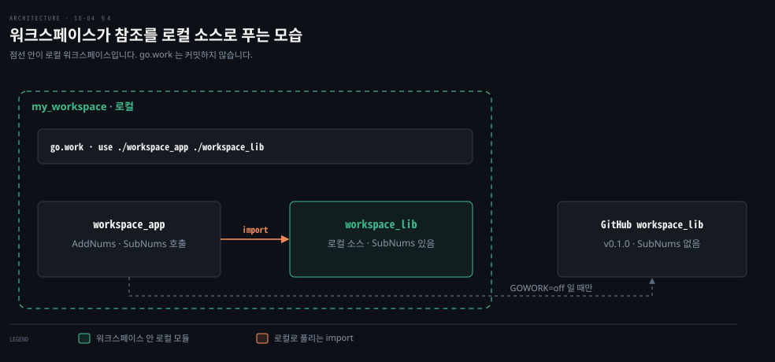
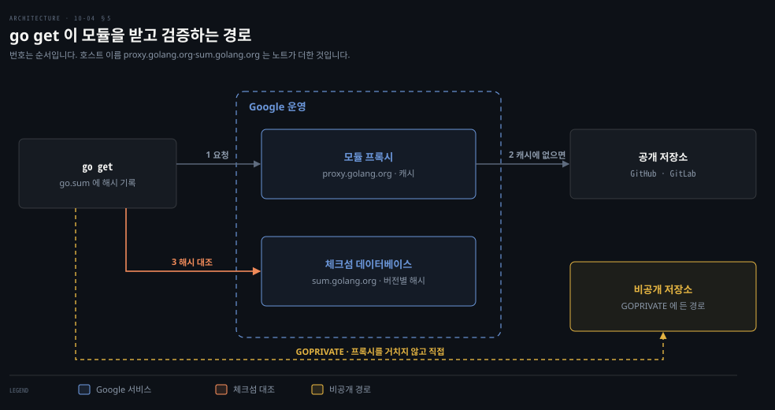

# 모듈은 태그로 게시하고 워크스페이스와 프록시로 다룹니다

---

> Learning Go 10장 끝입니다. 모듈을 저장소에 올리는 것만으로 게시하는 법과 라이선스, 버전 태그와 메이저 버전 올리기, `replace`·`exclude`·`retract`, 여러 모듈을 함께 고치는 워크스페이스, 그리고 모듈 프록시와 체크섬 데이터베이스를 다루고 장 끝 연습 문제를 풉니다.

## 핵심 요약

> 이 편이 매달린 하나의 생각은 Go 모듈의 게시와 버전이 중앙 저장소가 아니라 저장소의 태그와 go.mod 로 이루어진다는 것입니다.

모듈은 버전 관리 시스템에 올리기만 하면 게시됩니다. 오픈 소스라면 루트에 LICENSE 를 둡니다. Go 커뮤니티는 허용적 라이선스를 선호합니다. 버전은 유의적 버전 태그로 매깁니다. 하위 호환을 깨면 `vN` 하위 디렉터리나 브랜치를 만들어 모듈 경로 끝에 `/vN` 을 붙입니다.

`replace` 는 의존성을 포크로 바꿉니다. `exclude` 는 특정 버전을 막습니다. `retract` 는 내 모듈의 특정 버전을 쓰지 말라고 알립니다. 아직 올리지 않은 모듈을 함께 고칠 때는 워크스페이스(go.work)를 씁니다. `go get` 은 기본으로 Google 이 운영하는 프록시에서 모듈을 받습니다. 그리고 체크섬 데이터베이스로 내용이 바뀌지 않았는지 확인합니다. 비공개 저장소는 `GOPRIVATE` 나 자체 프록시로 다룹니다.


## 학습 목표

> 이 편을 읽고 나면 아래 다섯 가지를 스스로 해낼 수 있습니다.

1. 모듈을 게시하는 절차와 허용적·비허용적 라이선스의 차이를 말할 수 있습니다.
2. 프리릴리스 태그를 달고, 메이저 버전을 올리는 두 저장 방식(하위 디렉터리·브랜치)을 설명할 수 있습니다.
3. `replace`·`exclude`·`retract` 가 각각 누구를 무엇으로부터 막는지 구별할 수 있습니다.
4. 워크스페이스로 아직 게시하지 않은 모듈을 함께 쓰고, go.work 를 커밋하지 말아야 하는 이유를 말할 수 있습니다.
5. 모듈 프록시·체크섬 데이터베이스·`GOPROXY`·`GOPRIVATE` 가 하는 일을 말할 수 있습니다.


## 1. 모듈 게시와 라이선스

> 모듈은 버전 관리 시스템에 올리는 것으로 게시되며 중앙 저장소에 업로드하지 않습니다. 오픈 소스라면 LICENSE 파일을 두고, Go 커뮤니티는 BSD·MIT·Apache 같은 허용적 라이선스를 선호합니다.

원문은 모듈을 다른 사람이 쓰게 하는 일이 버전 관리 시스템에 올리는 것만큼 간단하다고 말합니다. GitHub 같은 공개 저장소든, 직접 호스팅하거나 회사 안에 둔 비공개 저장소든 마찬가지입니다. Go 프로그램은 소스에서 빌드하고 저장소 경로로 자신을 식별합니다. 그래서 Maven Central 이나 npm 처럼 중앙 라이브러리 저장소에 명시적으로 올릴 필요가 없습니다. go.mod 와 go.sum 을 모두 커밋하라고 원문은 말합니다.

원문의 메모에 따르면 Go 개발자 대부분은 Git 을 쓰지만 Go 는 Subversion·Mercurial·Bazaar·Fossil 도 지원합니다. 기본으로 공개 저장소에는 Git 과 Mercurial 을, 비공개 저장소에는 지원하는 어떤 버전 관리 시스템이든 쓸 수 있습니다.

오픈 소스 모듈을 낸다면 저장소 루트에 LICENSE 파일을 두어 코드를 어떤 오픈 소스 라이선스로 내는지 밝힙니다. 원문은 여러 라이선스를 배우는 데 It's FOSS 를 좋은 자료로 권합니다. 오픈 소스 라이선스는 대략 둘로 나뉩니다. 허용적 라이선스는 코드 사용자가 자기 코드를 비공개로 둘 수 있게 하고, 비허용적 라이선스는 사용자도 코드를 공개하도록 요구합니다.

어떤 라이선스를 고를지는 자유지만 Go 커뮤니티는 BSD·MIT·Apache 같은 허용적 라이선스를 선호합니다. Go 는 서드파티 코드를 모든 애플리케이션에 직접 컴파일해 넣습니다. 그래서 GPL 같은 비허용적 라이선스를 쓰면 그 코드를 쓰는 사람도 자기 코드를 오픈 소스로 내야 합니다. 많은 조직이 이를 받아들이지 않습니다. 원문의 마지막 당부는 라이선스를 직접 쓰지 말라는 것입니다. 변호사의 검토를 제대로 받았다고 믿을 사람이 적습니다. 모듈에 대해 어떤 주장을 하는지도 알 수 없습니다.


## 2. 모듈에 버전을 매깁니다

> 기능을 더하거나 버그를 고칠 때는 유의적 버전 태그를 달면 됩니다. 하위 호환을 깰 때는 `vN` 하위 디렉터리나 브랜치에 코드를 두고, go.mod 의 모듈 경로와 모든 import 를 `/vN` 으로 바꾼 뒤 `vN.0.0` 태그를 답니다.

모듈이 공개든 비공개든 Go 의 모듈 시스템과 제대로 맞물리도록 버전을 매겨야 합니다. 원문은 기능을 더하거나 버그를 고치는 동안에는 과정이 단순하다고 말합니다. 변경을 저장소에 넣고, 10-03 §2 의 유의적 버전 규칙을 따르는 태그를 답니다.

Go 의 유의적 버전은 프리릴리스 개념을 지원합니다. 현재 버전이 `v1.3.4` 이고 아직 끝나지 않은 1.4.0 을 다른 모듈에서 import 해 보고 싶다고 합시다. 버전 태그 끝에 하이픈과 프리릴리스 빌드 식별자를 붙입니다. 1.4.0 의 베타 1 이면 `v1.4.0-beta1`, 릴리스 후보 2 면 `v1.4.0-rc2` 입니다. Go 는 프리릴리스 버전을 자동으로 고르지 않으므로, 프리릴리스에 기대려면 `go get` 에 버전을 명시해야 합니다. Maven 의 `-SNAPSHOT` 과 비슷한 자리지만, Go 의 프리릴리스 태그는 바뀌지 않는 고정 버전이라는 점이 다릅니다. 이 비교는 원문 밖입니다.

### 메이저 버전을 올리는 두 방법

하위 호환을 깨야 할 때는 과정이 더 복잡합니다. 10-03 §3 에서 `simpletax` v2 를 import 할 때 본 대로 import 경로가 달라져야 합니다. 원문은 먼저 새 버전을 저장할 방법을 고르라고 말합니다. Go 는 두 가지를 지원합니다.

| 방법 | 원문의 설명 |
|------|------|
| 하위 디렉터리 | 모듈 안에 `vN` 디렉터리를 만듭니다(N 은 메이저 버전). 버전 2 라면 `v2` 입니다. README 와 LICENSE 를 포함해 코드를 이 디렉터리로 복사합니다 |
| 브랜치 | 버전 관리 시스템에 브랜치를 만들어 옛 코드나 새 코드를 둡니다. 새 코드를 두면 `vN`, 옛 코드를 두면 `vN-1` 로 이름 짓습니다. 버전 2 를 만들며 버전 1 코드를 브랜치에 두면 브랜치 이름은 `v1` 입니다 |

어디에 둘지 정했으면 그 하위 디렉터리나 브랜치의 import 경로를 고칩니다. go.mod 의 모듈 경로는 `/vN` 으로 끝나야 하고, 모듈 안의 모든 import 도 `/vN` 을 써야 합니다. 모든 코드를 고치는 일이 지루할 수 있는데, 원문은 Marwan Sulaiman 이 이를 자동화하는 도구를 만들었다고 소개합니다. 경로를 고친 뒤 변경을 구현합니다.

원문의 메모는 기술적으로는 go.mod 와 import 만 고치고 메인 브랜치에 최신 버전 태그를 달아, 하위 디렉터리나 버전 브랜치 없이 끝낼 수도 있다고 말합니다. 하지만 옛 메이저 버전을 어디서 찾을지 불분명해져 좋은 관행이 아니라고 합니다.

새 코드를 낼 준비가 되면 저장소에 `vN.0.0` 모양의 태그를 답니다. 하위 디렉터리 방식이거나 최신 코드를 메인 브랜치에 둔다면 메인 브랜치에, 새 코드를 다른 브랜치에 둔다면 그 브랜치에 태그를 답니다. 원문은 더 자세한 내용으로 Go Blog 의 "Go Modules: v2 and Beyond" 와 Go 개발자 웹사이트의 "Developing a Major Version Update" 를 안내합니다.


## 3. 의존성 덮어쓰기와 버전 철회

> `replace` 는 의존성을 포크나 로컬 경로로 바꾸고, `exclude` 는 다른 모듈의 특정 버전을 막습니다. `retract` 는 내가 낸 모듈의 특정 버전을 남들이 쓰지 말라고 알립니다.

원문은 포크가 일어난다고 말합니다. 오픈 소스 커뮤니티에는 포크를 꺼리는 분위기가 있지만, 모듈 관리가 끊기거나 소유자가 받아들이지 않는 변경을 실험하고 싶을 때가 있습니다. `replace` 지시어는 모든 의존성에 걸친 한 모듈의 참조를 지정한 포크로 바꿉니다.

```bash
replace github.com/jonbodner/proteus => github.com/someone/my_proteus v1.0.0
```

원문 PDF 는 이 줄이 `v1.0.` 에서 잘렸습니다. 위는 문법에 맞게 `v1.0.0` 으로 채운 것입니다. `=>` 왼쪽이 원래 모듈 위치이고 오른쪽이 대체입니다. 오른쪽에는 버전이 있어야 하고 왼쪽 버전은 선택입니다.

왼쪽에 버전을 적으면 그 버전만 바뀝니다. 적지 않으면 원래 모듈의 모든 버전이 포크의 특정 버전으로 바뀝니다. `replace` 는 로컬 파일 시스템 경로를 가리킬 수도 있습니다. 이때는 오른쪽 버전을 생략해야 합니다.

```bash
replace github.com/jonbodner/proteus => ../projects/proteus
```

원문은 로컬 `replace` 를 피하라고 경고합니다. 워크스페이스(§4)가 나오기 전에는 여러 모듈을 함께 고치는 방법이었지만 이제는 모듈을 망가뜨릴 원인이 됩니다. 버전 관리로 모듈을 나누면, 다른 사람의 디스크에 같은 위치의 대체 모듈이 있다고 보장할 수 없어 대개 빌드되지 않습니다.

특정 모듈 버전을 막고 싶을 수도 있습니다. 버그가 있거나 내 모듈과 호환되지 않는 경우입니다. `exclude` 지시어가 그 버전을 쓰지 못하게 합니다.

```bash
exclude github.com/jonbodner/proteus v0.10.1
```

모듈 버전을 제외하면 의존 모듈들 안의 그 버전 언급이 모두 무시됩니다. 제외한 버전이 의존성들이 요구하는 그 모듈의 유일한 버전이라면, `go get` 으로 다른 버전을 간접 import 로 go.mod 에 더해 모듈이 여전히 컴파일되게 합니다.

### retract 로 내가 낸 버전을 철회합니다

원문은 언젠가 아무도 쓰지 않길 바라는 모듈 버전을 실수로 내게 된다고 말합니다. 테스트가 끝나기 전에 실수로 냈을 수도, 내고 나서 치명적인 취약점이 발견됐을 수도 있습니다. Go 는 모듈의 go.mod 에 `retract` 지시어를 더해 특정 버전을 무시하라고 알리는 방법을 줍니다. `retract` 라는 단어와 더는 쓰지 말아야 할 유의적 버전으로 됩니다. 범위를 막으려면 위아래 경계를 쉼표로 나눠 대괄호에 넣습니다. 필수는 아니지만 버전이나 범위 뒤에 철회 이유를 주석으로 남기라고 원문은 권합니다.

연속하지 않은 여러 버전을 철회하려면 `retract` 지시어를 여러 개 씁니다. 원문의 예는 1.5.0 을, 그리고 1.7.0 부터 1.8.5 까지를 포함해 철회합니다.

```bash
retract v1.5.0 // not fully tested
retract [v1.7.0, v1.8.5] // posts your cat photos to LinkedIn w/o permission
```

> **원문 정오**: 원문은 범위의 윗경계를 `v.1.8.5` 로 인쇄했습니다. 유의적 버전은 `v` 바로 뒤에 숫자가 와야 하며, 앞의 설명과 예의 뜻도 1.8.5 입니다. 이 노트를 쓰면서 go.mod 에 원문 그대로 적으니 go1.25.1 은 이것을 버전으로 받아들이지 못해 모듈 경로를 조회하려다 오류를 냈고, `v1.8.5` 로 고치자 빌드가 통과했습니다. 원문 PDF 는 주석 끝도 `permissi` 에서 잘려 위에서는 `permission` 으로 채웠습니다.

go.mod 에 `retract` 를 더하려면 모듈의 새 버전을 만들어야 합니다. 새 버전에 철회만 들어 있다면 그 버전도 철회해야 합니다.

버전이 철회되면 그 버전을 지정한 기존 빌드는 계속 동작합니다. 하지만 `go get` 과 `go mod tidy` 는 그 버전으로 올리지 않습니다. `go list` 의 선택지에도 나오지 않습니다. 최신 버전이 철회되면 `@latest` 와 맞지 않습니다. 철회되지 않은 가장 높은 버전이 대신 맞습니다.

원문의 메모는 `retract` 와 `exclude` 를 헷갈리기 쉽지만 중요한 차이가 있다고 말합니다. `retract` 는 남들이 내 모듈의 특정 버전을 쓰지 못하게 하고, `exclude` 는 내가 다른 모듈의 특정 버전을 쓰지 못하게 합니다. Maven Central 에서는 한번 올린 아티팩트를 지우거나 고칠 수 없어 새 버전을 내는 수밖에 없는데, Go 의 `retract` 는 그 위에 "이 버전은 쓰지 말라"는 표시를 더하는 장치입니다. 이 비교는 원문 밖입니다.


## 4. 워크스페이스로 여러 모듈을 함께 고칩니다

> 워크스페이스는 여러 모듈을 로컬에 두고, 그 사이의 참조를 저장소가 아닌 로컬 소스로 풀어 줍니다. `go work init`·`go work use` 로 go.work 를 만들며, go.work 는 로컬 전용이라 커밋하지 않습니다.

원문은 저장소와 태그로 의존성과 버전을 추적하는 방식에 단점이 하나 있다고 말합니다. 모듈 둘 이상을 함께 고치고 그 변경을 모듈 사이에서 실험하려면, 저장소의 버전 대신 로컬 사본을 쓸 방법이 필요합니다. 원문은 go.mod 에 로컬 디렉터리를 가리키는 임시 `replace` 를 두라는 옛 조언을 따르지 말라고 경고합니다. 커밋하고 푸시하기 전에 되돌리는 걸 잊기 너무 쉽고, 워크스페이스는 바로 이 안티패턴을 피하려고 들어왔습니다.

**워크스페이스**는 여러 모듈을 컴퓨터에 내려받아 두고, 그 모듈들 사이의 참조를 저장소에 올린 코드가 아닌 로컬 소스로 자동으로 풀어 줍니다. 원문은 `my_workspace` 안에 `workspace_lib` 과 `workspace_app` 두 모듈을 만듭니다. `workspace_lib` 에는 `AddNums` 함수를 둡니다.

```go
package workspace_lib

func AddNums(a, b int) int {
	return a + b
}
```

`workspace_app` 의 `app.go` 는 이 함수를 부릅니다.

```go
package main

import (
	"fmt"
	"github.com/learning-go-book-2e/workspace_lib"
)

func main() {
	fmt.Println(workspace_lib.AddNums(2, 3))
}
```

`workspace_lib` 은 아직 GitHub 에 올리지 않았으니 `go get ./...` 도 `go build` 도 모듈을 찾지 못합니다. 이 노트를 쓰면서 같은 구조를 만들어 빌드하니 `no required module provides package github.com/learning-go-book-2e/workspace_lib` 오류가 났습니다. `my_workspace` 에서 다음 두 명령을 돌리면 go.work 가 생깁니다.

```bash
go work init ./workspace_app
go work use ./workspace_lib
```

원문의 go.work 는 `go 1.20` 줄과 두 디렉터리를 담은 `use` 묶음입니다. 이 노트의 go1.25.1 은 첫 줄을 `go 1.25.1` 로 만들었습니다. 이제 `workspace_app` 을 빌드하면 동작해 `5` 가 찍힙니다. 원문은 go.work 가 로컬 컴퓨터 전용이니 소스 관리에 커밋하지 말라고 경고합니다.



### 게시한 뒤에도 워크스페이스는 로컬 소스를 씁니다

원문은 이어서 `workspace_lib` 을 GitHub 에 올리고 `v0.1.0` 릴리스를 만듭니다. 그러면 `workspace_app` 에서 `go get ./...` 이 공개 모듈을 받아 `require github.com/learning-go-book-2e/workspace_lib v0.1.0` 을 더합니다.

환경 변수 `GOWORK=off` 로 빌드하면 워크스페이스를 끄고 공개 모듈로 빌드되는지 확인할 수 있습니다. 이 노트는 저장소에 올리지 않아서 `GOWORK=off` 로 빌드하니 앞과 같은 "no required module" 오류가 났습니다. 워크스페이스가 꺼지면 로컬 모듈을 찾지 않는다는 것이 반대 방향으로 확인된 셈입니다.

공개 모듈을 가리키는 `require` 가 있어도 로컬 워크스페이스의 변경이 대신 쓰입니다. 원문은 `workspace_lib` 에 `SubNums` 를, `app.go` 에 그 호출을 더합니다.

```go
func SubNums(a, b int) int {
	return a - b
}
```

다시 빌드하면 공개 판에는 없는 `SubNums` 를 로컬 모듈에서 가져와 `5` 와 `-1` 이 찍힙니다. 이 노트에서도 같았습니다.

편집을 마치고 소프트웨어를 낼 때는 모듈의 go.mod 가 갱신된 코드를 가리키도록 버전 정보를 고쳐야 합니다. 원문은 의존 순서대로 커밋하라며 다섯 단계를 듭니다.

1. 워크스페이스 안에서 고친 모듈 가운데, 다른 고친 모듈에 기대지 않는 것을 고릅니다.
2. 그 모듈을 소스 저장소에 커밋합니다.
3. 새로 커밋한 모듈에 새 버전 태그를 답니다.
4. 새로 커밋한 모듈에 기대는 모듈들의 go.mod 버전을 `go get` 으로 올립니다.
5. 고친 모듈을 모두 커밋할 때까지 1~4 를 되풀이합니다.

나중에 `workspace_lib` 을 또 고쳐 GitHub 에 올리거나 임시 버전을 잔뜩 만들지 않고 `workspace_app` 에서 시험하고 싶다면, 모듈들의 최신 판을 워크스페이스로 다시 `git pull` 해 고치면 된다고 원문은 말합니다. Maven 멀티 모듈 프로젝트에서 부모 `pom.xml` 이 하위 모듈을 묶어 로컬 소스로 함께 빌드하는 것과 비슷한 자리인데, go.work 는 서로 다른 저장소의 모듈도 묶고 커밋하지 않는다는 점이 다릅니다. 이 비교는 원문 밖입니다.


## 5. 모듈 프록시와 체크섬 데이터베이스

> `go get` 은 기본으로 저장소가 아닌 Google 의 프록시에서 모듈을 받고, 체크섬 데이터베이스로 받은 모듈이 바뀌지 않았는지 확인합니다. 프록시를 끄거나 자체 프록시를 둘 수 있고, 비공개 모듈은 `GOPRIVATE` 로 직접 받습니다.

원문은 Go 가 라이브러리를 위한 중앙 저장소 하나에 기대지 않고 혼합 모델을 쓴다고 말합니다. 모든 Go 모듈은 GitHub 나 GitLab 같은 소스 저장소에 있습니다. 하지만 기본으로 `go get` 은 소스 저장소에서 코드를 직접 받지 않고, Google 이 운영하는 프록시 서버에 요청합니다. 프록시는 요청을 받으면 이 모듈 버전을 전에 요청받은 적이 있는지 캐시를 봅니다. 있으면 캐시된 정보를 돌려줍니다. 없으면 모듈 저장소에서 내려받아 사본을 저장하고 돌려줍니다.

이 덕에 프록시는 사실상 모든 공개 Go 모듈의 모든 버전을 사본으로 갖게 됩니다. 이 노트에서 `go list -m -versions` 로 책의 예제 모듈들을 받을 수 있었던 것도 이 프록시 덕입니다.

Google 은 프록시와 함께 **체크섬 데이터베이스**도 운영합니다. 프록시가 캐시한 모든 모듈의 모든 버전 정보를 저장합니다. 프록시가 모듈이나 버전이 인터넷에서 사라지는 것을 막아 준다면, 체크섬 데이터베이스는 모듈 버전이 바뀌는 것을 막아 줍니다. 누가 모듈을 가로채 악성 코드를 넣는 악의적인 경우일 수도 있고, 관리자가 버그를 고치거나 기능을 더하면서 기존 버전 태그를 다시 쓰는 실수일 수도 있습니다. 어느 쪽이든 같은 바이너리를 빌드하지 못하고 영향도 알 수 없으니, 바뀐 모듈 버전은 쓰고 싶지 않을 것입니다.

`go get` 이나 `go mod tidy` 로 모듈을 받을 때마다 Go 도구는 모듈의 해시를 계산해, 체크섬 데이터베이스에 저장된 그 버전의 해시와 비교합니다. 맞지 않으면 모듈을 설치하지 않습니다. 10-03 §1 의 go.sum 해시가 여기서 쓰입니다.



### 프록시를 끄거나 직접 둘 수 있습니다

서드파티 라이브러리 요청을 Google 에 보내는 것을 꺼리는 사람도 있습니다. 원문은 선택지 둘을 듭니다. 첫째, `GOPROXY` 환경 변수를 `direct` 로 두어 프록시를 아예 끌 수 있습니다. 모듈을 저장소에서 직접 받습니다. 다만 저장소에서 지운 버전에 기대고 있으면 받을 수 없습니다.

둘째, 자체 프록시를 둘 수 있습니다. Artifactory 와 Sonatype 의 기업용 저장소 제품에 Go 프록시 기능이 있습니다. Athens 프로젝트는 오픈 소스 프록시를 제공합니다. 이 가운데 하나를 네트워크에 설치하고 `GOPROXY` 를 그 URL 로 가리킵니다. Spring 조직에서 Nexus 나 Artifactory 를 Maven 미러로 두는 것과 같은 구성입니다. 이 비교는 원문 밖입니다.

### 비공개 저장소는 GOPRIVATE 로 직접 받습니다

대부분의 조직은 코드를 비공개 저장소에 둡니다. 비공개 모듈을 다른 Go 모듈에서 쓰려 해도 Google 의 프록시에 요청할 수는 없습니다. Go 는 비공개 저장소를 직접 확인하는 쪽으로 넘어가지만, 비공개 서버와 저장소의 이름이 외부 서비스로 새는 것을 원하지 않을 수 있습니다.

자체 프록시를 쓰거나 프록시를 껐다면 문제가 되지 않습니다. 원문은 비공개 프록시에 이점이 더 있다고 말합니다. 서드파티 모듈이 회사 네트워크에 캐시되어 내려받기가 빨라집니다. 비공개 저장소에 인증이 필요하다면, 비공개 프록시가 비공개 저장소에 인증하도록 설정하고 프록시 호출은 인증 없이 둘 수 있습니다. 그러면 CI/CD 파이프라인에 인증 정보를 드러낼 걱정이 없습니다.

공개 프록시를 쓴다면 `GOPRIVATE` 환경 변수에 비공개 저장소를 쉼표로 나눠 적습니다.

```bash
GOPRIVATE=*.example.com,company.com/repo
```

이렇게 두면 example.com 의 모든 하위 도메인에 있는 저장소나 company.com/repo 로 시작하는 URL 의 모듈은 직접 내려받습니다. 원문은 이 장의 내용 말고도 Git 외 버전 관리 시스템, 모듈 캐시의 구조와 API, 모듈 조회를 조절하는 다른 환경 변수, 모듈 프록시와 체크섬 데이터베이스의 REST API 가 Go Modules Reference 에 있다고 안내합니다.


## 연습 문제

> 원문 연습 문제는 자기 공개 저장소에 모듈을 올리는 문제입니다. 이 노트는 저장소에 올리는 단계는 하지 않고, 같은 v1·v2 모듈을 로컬에 만들어 go1.25.1 에서 문서와 동작을 확인했습니다.

### 1~2. Add 함수와 godoc 주석

첫 문제는 두 `int` 를 받아 합을 돌려주는 `Add` 함수 하나를 가진 모듈을 공개 저장소에 만들고 v1.0.0 을 매기는 것입니다. 둘째는 패키지와 `Add` 를 설명하는 godoc 주석을 달고, `Add` 의 주석에 `https://www.mathsisfun.com/numbers/addition.html` 링크를 넣어 v1.0.1 을 매기는 것입니다. 10-02 §3 의 링크 문법을 씁니다.

```go
// Package addmod provides a simple function for adding two integers.
package addmod

// Add returns the sum of a and b.
//
// For more about addition, see [Addition].
//
// [Addition]: https://www.mathsisfun.com/numbers/addition.html
func Add(a, b int) int {
	return a + b
}
```

`go doc . Add` 로 보니 링크 텍스트는 본문에 `Addition` 으로, URL 은 아래에 `[Addition]: https://...` 로 나왔습니다. 모듈 경로는 노트가 정한 `github.com/example/addmod` 입니다.

### 3. 제네릭 Add 와 v2

셋째는 `Add` 를 제네릭으로 바꾸는 문제입니다. `golang.org/x/exp/constraints` 패키지를 import 하고 그 안의 `Integer` 와 `Float` 를 합쳐 `Number` 인터페이스를 만듭니다. `Add` 는 `Number` 타입 매개변수 둘을 받아 `Number` 값을 돌려줍니다. 하위 호환을 깨는 변경이니 v2.0.0 이어야 합니다. 이 노트는 §2 의 하위 디렉터리 방식으로 `v2` 디렉터리에 모듈 경로 `github.com/example/addmod/v2` 를 두었습니다.

```go
// Package addmod provides a simple generic function for adding two numbers.
package addmod

import "golang.org/x/exp/constraints"

// Number is any integer or floating-point type.
type Number interface {
	constraints.Integer | constraints.Float
}

// Add returns the sum of a and b.
//
// For more about addition, see [Addition].
//
// [Addition]: https://www.mathsisfun.com/numbers/addition.html
func Add[T Number](a, b T) T {
	return a + b
}
```

두 판을 함께 import 하는 작은 프로그램을 로컬 `replace` 로 묶어 돌리니 `addmod.Add(2, 3)`, `addv2.Add(2.5, 3.25)`, `addv2.Add[uint8](200, 100)` 이 `5 5.75 44` 를 찍었습니다. 마지막 값은 300 이 `uint8` 을 넘친 것입니다. 이 확인용 `replace` 는 §3 의 경고대로 게시할 모듈에는 두지 않습니다.

예상 밖의 일도 하나 있었습니다. `v2` 에서 버전 없이 `go get golang.org/x/exp` 를 하니 최신 판이 Go 1.26 을 요구해, go.mod 의 `go` 줄이 `go 1.26.0` 으로 올라갔습니다.

기본 설정인 `GOTOOLCHAIN=auto` 에서는 `go get` 이 `switching to` 를 찍고 새 툴체인으로 넘어갔고, 그 디렉터리의 `go version` 은 go1.26.0 을 보였습니다. 같은 모듈을 `GOTOOLCHAIN=local` 로 빌드하니 `requires go >= 1.26.0` 오류가 났습니다. 10-01 §3 의 `go` 지시어가 의존성 때문에 올라가는 실제 사례입니다. `golang.org/x/exp@v0.0.0-20240506185415-9bf2ced13842` 처럼 더 오래된 판을 지정하니 `go 1.22` 를 유지한 채 동작했습니다.

08-02 §1 에서 본 대로 Go 1.21 부터는 `cmp.Ordered` 가 표준 라이브러리에 있지만, `Integer` 와 `Float` 를 따로 나눈 제약은 여전히 `x/exp/constraints` 에 있습니다(원문 밖 보충).


## 핵심 개념 체크리스트

목표 번호 순서대로 짝지었습니다.

- [ ] (목표 1) Go 모듈을 게시할 때 Maven Central 에 올리는 것 같은 단계가 필요 없는 이유를 말할 수 있습니까?
- [ ] (목표 1) Go 커뮤니티가 GPL 보다 허용적 라이선스를 선호하는 이유를 말할 수 있습니까?
- [ ] (목표 2) `v1.4.0-rc2` 는 `go get -u` 로 자동으로 올라갑니까?
- [ ] (목표 2) v2 를 하위 디렉터리로 만들 때 go.mod 와 import 에서 무엇을 바꿉니까?
- [ ] (목표 3) 내가 낸 v1.5.0 을 남들이 쓰지 않게 하려면 `retract` 와 `exclude` 가운데 무엇을 씁니까?
- [ ] (목표 4) `GOWORK=off` 로 빌드하면 무엇이 달라집니까?
- [ ] (목표 5) 관리자가 같은 버전 태그를 다른 커밋에 다시 달았을 때 체크섬 데이터베이스가 무엇을 막습니까?
- [ ] (목표 5) 사내 저장소의 모듈을 Google 프록시에 묻지 않고 받으려면 어떤 환경 변수를 씁니까?


## 관련 문서

- [10-03 서드파티 모듈은 go get 으로 들이고 최소 버전 선택으로 버전을 고릅니다](./10-03.%EC%84%9C%EB%93%9C%ED%8C%8C%ED%8B%B0%20%EB%AA%A8%EB%93%88%EC%9D%80%20go%20get%20%EC%9C%BC%EB%A1%9C%20%EB%93%A4%EC%9D%B4%EA%B3%A0%20%EC%B5%9C%EC%86%8C%20%EB%B2%84%EC%A0%84%20%EC%84%A0%ED%83%9D%EC%9C%BC%EB%A1%9C%20%EB%B2%84%EC%A0%84%EC%9D%84%20%EA%B3%A0%EB%A6%85%EB%8B%88%EB%8B%A4.md) — 10장 셋째. go get 과 버전
- [10-01 모듈은 go.mod 로 한 단위가 되고 go 지시어가 빌드할 Go 버전을 정합니다](./10-01.%EB%AA%A8%EB%93%88%EC%9D%80%20go.mod%20%EB%A1%9C%20%ED%95%9C%20%EB%8B%A8%EC%9C%84%EA%B0%80%20%EB%90%98%EA%B3%A0%20go%20%EC%A7%80%EC%8B%9C%EC%96%B4%EA%B0%80%20%EB%B9%8C%EB%93%9C%ED%95%A0%20Go%20%EB%B2%84%EC%A0%84%EC%9D%84%20%EC%A0%95%ED%95%A9%EB%8B%88%EB%8B%A4.md) — 10장 앞. go 지시어
- [08-02 타입 요소는 쓸 수 있는 연산자를 정하고 ~ 는 바탕 타입까지 넓힙니다](./08-02.%ED%83%80%EC%9E%85%20%EC%9A%94%EC%86%8C%EB%8A%94%20%EC%93%B8%20%EC%88%98%20%EC%9E%88%EB%8A%94%20%EC%97%B0%EC%82%B0%EC%9E%90%EB%A5%BC%20%EC%A0%95%ED%95%98%EA%B3%A0%20~%20%EB%8A%94%20%EB%B0%94%ED%83%95%20%ED%83%80%EC%9E%85%EA%B9%8C%EC%A7%80%20%EB%84%93%ED%9E%99%EB%8B%88%EB%8B%A4.md) — 8장. 타입 요소와 cmp
- [Learning Go 2판 — 정독 인덱스](./README.md) — 16장 전체 지도


## 참고 자료

- 원본: 《Learning Go, 2nd Edition》 (Jon Bodner, O'Reilly)
- 다룬 범위: Chapter 10 "Publishing Your Module" 부터 장 끝까지, 연습 문제 1~3
