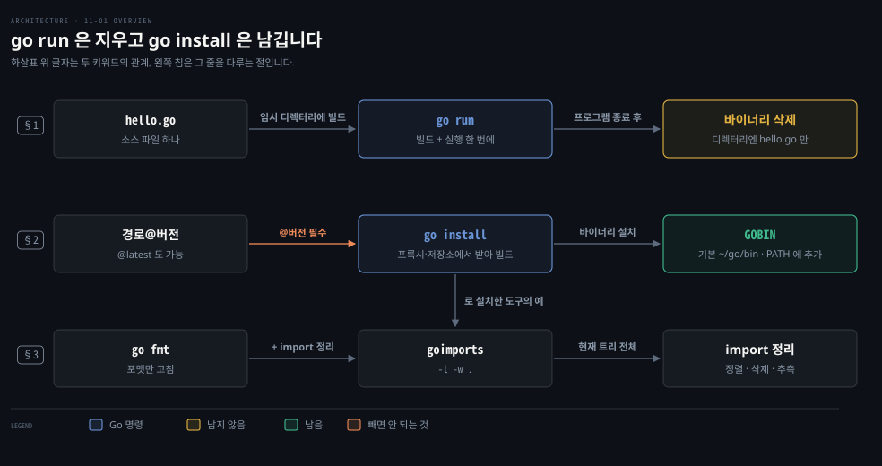

# go run 은 임시로 빌드해 바로 실행하고 go install 은 @버전으로 도구를 설치합니다

---

> Learning Go 11장 앞 부분입니다. 컴파일 언어인 Go 를 스크립트처럼 돌리는 `go run`, 서드파티 도구를 소스에서 빌드해 설치하는 `go install`, 그리고 import 까지 정리하는 `goimports` 를 다룹니다.

## 핵심 요약

> 이 편이 매달린 하나의 생각은 Go 의 도구가 소스 코드를 곧바로 실행 파일로 바꾸는 일을 짧은 명령 하나에 맡긴다는 것입니다.

`go run` 은 코드를 임시 디렉터리에서 빌드해 실행하고, 끝나면 바이너리를 지웁니다. 그래서 인터프리터 언어처럼 빠른 확인이 필요할 때 씁니다. `go install` 은 모듈 경로 뒤에 `@버전` 이나 `@latest` 를 붙여 도구를 내려받고 빌드해 `GOBIN` 에 설치합니다. 이 디렉터리를 `PATH` 에 넣어 두면 설치한 도구를 바로 부를 수 있습니다.

`goimports` 는 `go install` 로 들이는 도구의 한 예입니다. `go fmt` 가 하는 포맷에 더해 import 를 정렬합니다. 쓰지 않는 import 는 지우고 빠진 import 는 추측해 넣습니다.


## 학습 목표

> 이 편을 읽고 나면 아래 다섯 가지를 스스로 해낼 수 있습니다.

1. `go run` 이 실행한 뒤 디렉터리에 바이너리가 남지 않는 이유를 말할 수 있습니다.
2. `go install` 로 도구를 설치할 때 `@버전` 을 붙여야 하는 이유와 빼면 생기는 일을 말할 수 있습니다.
3. `go install` 이 바이너리를 어디에 두는지, 그 위치를 어떻게 바꾸는지 말할 수 있습니다.
4. `GOROOT` 와 `GOPATH` 를 이제 직접 설정하지 않아도 되는 이유를 설명할 수 있습니다.
5. `goimports -l -w .` 가 무엇을 고치는지, 그 추측을 그대로 믿으면 안 되는 이유를 말할 수 있습니다.

아래는 이 편의 키워드를 이은 개념도입니다. 윗줄은 소스 파일 하나를 임시로 빌드해 실행하고 지우는 `go run` 의 길입니다. 가운데 줄은 모듈 경로와 버전에서 출발해 `GOBIN` 에 바이너리를 남기는 `go install` 의 길입니다. 아랫줄의 `goimports` 는 그렇게 설치한 도구의 한 예입니다. 왼쪽 칩이 그 줄을 다루는 절이고, 두 길의 차이는 바이너리가 남느냐입니다.




## 1. go run — 컴파일 언어를 스크립트처럼 돌립니다

> Go 는 실행 전에 실행 파일로 바꿔야 하는 컴파일 언어지만, `go run` 이 빌드와 실행을 한 번에 합니다. 바이너리는 임시 디렉터리에 만들고 프로그램이 끝나면 지웁니다.

원문은 11장을 여는 자리에서 언어는 홀로 존재하지 않는다고 말합니다. 소스 코드를 실행 파일로 바꾸는 도구가 있어야 쓸모가 있습니다. Go 는 빌드·포맷·갱신·검증·배포와 사용자의 설치 방법까지 도구를 공들여 설계했습니다.

앞 장들에서 이미 `go vet`·`go fmt`·`go mod`·`go get`·`go list`·`go work`·`go doc`·`go build` 를 다뤘습니다. `go test` 는 15장에서 따로 다룬다고 원문은 밝힙니다. 이 장은 Go 팀과 서드파티가 만든 나머지 도구를 봅니다.

Python 이나 JavaScript 같은 인터프리터 언어는 짧은 스크립트를 써서 곧바로 실행해 볼 수 있습니다. 이 빠른 피드백이 중요하기 때문에 Go 는 `go run` 명령으로 비슷한 경험을 줍니다. 1장의 첫 프로그램을 hello.go 로 저장하고 돌려 봅니다.

```go
package main

import "fmt"

func main() {
	fmt.Println("Hello, world!")
}
```

```bash
go run hello.go
# Hello, world!
```

실행한 뒤 디렉터리를 보면 hello.go 하나만 있습니다. 원문은 실행 파일이 어디로 갔느냐고 묻습니다. `go run` 도 코드를 바이너리로 컴파일합니다. 다만 그 바이너리를 임시 디렉터리에 만들어 거기서 실행하고, 프로그램이 끝나면 지웁니다.

이 노트를 쓰면서 원서 예제 저장소의 gorun 디렉터리에서 `go run -work hello.go` 를 돌려 보았습니다. `-work` 는 임시 작업 디렉터리를 지우지 말고 이름을 찍으라는 플래그입니다. `WORK=/var/folders/.../go-build3340557282` 가 먼저 찍히고 `Hello, world!` 가 이어졌습니다. 디렉터리에는 여전히 hello.go 만 남았습니다. `-work` 플래그는 원문 밖 보충입니다.

원문의 팁은 Go 프로그램을 스크립트처럼 다루며 소스 코드를 곧바로 실행하고 싶을 때 `go run` 을 쓰라고 합니다. Java 11 부터 `java Hello.java` 로 소스 파일 하나를 `javac` 단계 없이 실행하는 것과 같은 자리입니다. 그쪽도 메모리에서 컴파일한 뒤 실행하니 `go run` 과 방식이 같습니다. 이 비교는 원문 밖입니다.


## 2. go install — 서드파티 도구를 @버전으로 설치합니다

> Go 로 쓴 도구는 `go install 모듈경로@버전` 으로 소스에서 빌드해 설치합니다. 바이너리는 기본으로 홈 디렉터리의 go/bin 에 놓이고, `GOBIN` 으로 위치를 바꿉니다.

Go 프로그램을 미리 컴파일한 바이너리로 배포하는 사람도 있습니다. 하지만 Go 로 쓴 도구는 `go install` 명령으로 소스에서 빌드해 설치할 수도 있습니다.

10-04 §1 에서 본 대로 Go 모듈은 소스 코드 저장소로 식별됩니다. `go install` 은 모듈 저장소 안의 main 패키지 경로를 인자로 받습니다. 경로 뒤에는 `@` 와 원하는 버전을 붙이고, 최신 버전이면 `@latest` 를 붙입니다. 그러면 도구를 내려받고 컴파일해 설치합니다.

### @버전을 빼면 헷갈리는 일이 생깁니다

원문의 경고는 설치하는 패키지 이름 뒤에 `@version` 이나 `@latest` 를 꼭 붙이라고 말합니다. 빼면 헷갈리는 동작이 일어나고, 그것은 거의 틀림없이 원하던 일이 아닙니다.

원문이 꼽는 경우는 셋입니다. 현재 디렉터리가 모듈 안이 아니면 오류가 납니다. 모듈 안이더라도 그 패키지가 go.mod 에 없으면 역시 오류가 납니다. go.mod 에 있으면 거기 적힌 버전이 설치됩니다. 이 노트의 go1.25.1 에서 앞의 두 경우를 재현했습니다.

```bash
# 모듈 밖에서
go install golang.org/x/tools/cmd/stringer
# go: 'go install' requires a version when current directory is not in a module
# 	Try 'go install golang.org/x/tools/cmd/stringer@latest' to install the latest version

# go.mod 에 없는 모듈 안에서
go install golang.org/x/tools/cmd/stringer
# no required module provides package golang.org/x/tools/cmd/stringer; to add it:
# 	go get golang.org/x/tools/cmd/stringer
```

셋째 경우가 가장 조용한 함정입니다. 오류 없이 설치되지만, 설치되는 것은 최신판이 아니라 그 모듈의 go.mod 가 고른 버전입니다. 이 해석은 노트의 풀이입니다.

### 설치 위치는 GOBIN 이고 GOROOT·GOPATH 는 이제 설정하지 않습니다

`go install` 은 기본으로 홈 디렉터리의 go/bin 에 바이너리를 둡니다. 위치를 바꾸려면 `GOBIN` 환경 변수를 설정합니다. 원문은 이 디렉터리를 실행 파일 검색 경로에 넣으라고 강하게 권합니다. Unix 와 Windows 모두 `PATH` 환경 변수를 고치면 됩니다. 이 장의 예제는 모두 그렇게 했다고 가정합니다.

원문의 메모는 `go help environment` 로 `go` 도구가 알아보는 환경 변수의 전체 목록과 짧은 설명을 볼 수 있다고 말합니다. 대부분은 저수준 동작을 다뤄 무시해도 되고, 필요한 것은 그때마다 짚겠다고 합니다.

온라인 자료 가운데는 `GOROOT` 나 `GOPATH` 를 설정하라는 글이 있습니다. `GOROOT` 는 Go 개발 환경이 설치된 위치입니다. `GOPATH` 는 예전에 자기 코드와 서드파티 의존성을 포함한 모든 Go 소스를 두던 곳입니다. 원문은 둘 다 이제 설정할 필요가 없다고 말합니다. `go` 도구가 `GOROOT` 를 스스로 알아내고, `GOPATH` 기반 개발은 모듈이 대신했기 때문입니다.

### hey 를 설치하고 실행해 봅니다

원문의 예는 Jaana Dogan 이 만든 HTTP 서버 부하 시험 도구 `hey` 입니다. 원하는 웹사이트나 자기가 쓴 애플리케이션에 겨눌 수 있습니다.

```bash
go install github.com/rakyll/hey@latest
# go: downloading github.com/rakyll/hey v0.1.4
# go: downloading golang.org/x/net v0.0.0-20181017193950-04a2e542c03f
# go: downloading golang.org/x/text v0.3.0
```

이 명령이 `hey` 와 그 의존성을 모두 내려받고, 프로그램을 빌드해 Go 바이너리 디렉터리에 설치합니다. 원문 출력은 v0.1.4 를 받았습니다. 이 노트를 쓰는 2026-09-28 에 프록시가 알려 준 `@latest` 는 2026-01-10 에 나온 v0.1.5 입니다. 같은 명령도 시점에 따라 다른 버전을 받습니다.

원문의 메모는 10-04 §5 의 모듈 프록시를 다시 짚습니다. 저장소와 `GOPROXY` 값에 따라 `go install` 은 프록시에서 받기도 하고 저장소에서 직접 받기도 합니다. 저장소에서 직접 받을 때는 컴퓨터에 명령행 도구가 깔려 있어야 합니다. 예를 들어 GitHub 에서 받으려면 Git 이 있어야 합니다.

설치한 뒤에는 `hey` 를 바로 부릅니다.

```bash
hey https://go.dev

# Summary:
#     Total:          2.1272 secs
#     Slowest:        1.4227 secs
#     Fastest:        0.0573 secs
#     Average:        0.3467 secs
#     Requests/sec:   94.0181
```

이미 설치한 도구를 새 버전으로 올릴 때도 같은 명령에 새 버전이나 `@latest` 를 주고 다시 돌립니다.

`go install` 로 설치한 프로그램은 평범한 실행 파일입니다. go/bin 에 둘 필요 없이 컴퓨터 어디에 옮겨 두어도 됩니다. Go 로 쓴 프로그램을 꼭 `go install` 로 배포할 필요도 없습니다. 바이너리를 내려받게 올려 두어도 됩니다. 그래도 `go install` 은 Go 개발자에게 편해서 서드파티 개발 도구를 배포하는 대표 방법이 되었다고 원문은 말합니다.

Maven 플러그인은 `mvn dependency:tree` 처럼 선언 없이 부를 수도 있지만 늘 `mvn` 을 거쳐 돕니다. `go install` 로 들인 도구는 그 자체로 독립된 명령이 됩니다. 이 비교는 원문 밖입니다.


## 3. goimports — go fmt 에 import 정리를 더합니다

> `goimports` 는 `go fmt` 의 확장판으로 import 까지 정리합니다. 알파벳 순으로 정렬하고, 쓰지 않는 import 를 지우고, 빠진 import 를 추측해 넣습니다.

`goimports` 는 import 문을 알파벳 순으로 정렬합니다. 쓰지 않는 import 는 지우고 적지 않은 import 는 추측해 넣습니다. 원문은 그 추측이 가끔 틀리니 import 는 직접 넣으라고 말합니다.

```bash
go install golang.org/x/tools/cmd/goimports@latest
goimports -l -w .
```

`-l` 은 포맷이 틀린 파일 이름을 콘솔에 찍으라는 플래그이고, `-w` 는 파일을 그 자리에서 고치라는 플래그입니다. `.` 은 현재 디렉터리와 모든 하위 디렉터리를 검사하라는 뜻입니다.

이 노트를 쓰면서 `"os"` 와 `"fmt"` 를 이 순서로 import 하고 본문에서는 `fmt` 와 `strings` 만 쓰는 파일을 만들어 돌렸습니다. `goimports -l -w .` 는 `main.go` 를 찍었습니다. 파일의 import 는 `"fmt"`·`"strings"` 두 줄로 바뀌었습니다. 쓰지 않던 `os` 는 지워졌고 빠진 `strings` 는 표준 라이브러리에서 찾아 들어갔습니다. 이름이 같은 패키지가 여럿이면 엉뚱한 것을 고를 수 있어 원문이 직접 넣으라고 한 것입니다. 이 설명은 노트의 풀이입니다.

### golang.org/x 는 표준 라이브러리보다 느슨하게 호환됩니다

원문의 메모는 golang.org/x 아래 패키지를 설명합니다. 이 패키지들은 Go 프로젝트의 일부지만 주 Go 트리 밖에 있습니다. 쓸모가 있지만 표준 라이브러리보다 느슨한 호환성 요건으로 개발되며, 하위 호환을 깨는 변경이 들어올 수 있습니다.

14장에서 다룰 `context` 패키지처럼 golang.org/x 에서 시작해 표준 라이브러리로 들어간 패키지도 있습니다. 10-02 §3 에서 본 `pkgsite` 도구도 여기에 있습니다. 나머지 패키지는 Go 문서의 "Sub-repositories" 절에서 볼 수 있다고 원문은 안내합니다.

이 노트를 쓰면서 `goimports@latest` 를 설치하자 `golang.org/x/tools@v0.50.0 requires go >= 1.26.0; switching to go1.26.8` 이 찍혔습니다. golang.org/x 모듈의 최신판이 최신 Go 를 요구하는 모습입니다. 10-01 §3 의 기본 설정 `GOTOOLCHAIN=auto` 덕에 새 툴체인을 받아 설치를 마쳤습니다.


## 핵심 개념 체크리스트

목표 번호 순서대로 짝지었습니다.

- [ ] (목표 1) `go run hello.go` 를 돌린 뒤 디렉터리에 실행 파일이 없는 이유를 말할 수 있습니까?
- [ ] (목표 2) 모듈 밖 디렉터리에서 `go install golang.org/x/tools/cmd/stringer` 를 돌리면 무슨 일이 일어납니까?
- [ ] (목표 2) 모듈 안에서 go.mod 에 이미 있는 도구를 버전 없이 설치하면 어떤 버전이 들어옵니까?
- [ ] (목표 3) `go install` 한 바이너리를 /opt/tools 에 두게 하려면 무엇을 설정합니까?
- [ ] (목표 4) `GOPATH` 를 설정하라는 옛 글을 따르지 않아도 되는 이유를 말할 수 있습니까?
- [ ] (목표 5) `goimports` 가 빠진 import 를 추측해 넣을 때 틀릴 수 있는 경우를 하나 들 수 있습니까?


## 관련 문서

- [11-02 린터는 믿되 확인하며 쓰고 govulncheck 는 실제로 부르는 취약 코드를 짚습니다](./11-02.%EB%A6%B0%ED%84%B0%EB%8A%94%20%EB%AF%BF%EB%90%98%20%ED%99%95%EC%9D%B8%ED%95%98%EB%A9%B0%20%EC%93%B0%EA%B3%A0%20govulncheck%20%EB%8A%94%20%EC%8B%A4%EC%A0%9C%EB%A1%9C%20%EB%B6%80%EB%A5%B4%EB%8A%94%20%EC%B7%A8%EC%95%BD%20%EC%BD%94%EB%93%9C%EB%A5%BC%20%EC%A7%9A%EC%8A%B5%EB%8B%88%EB%8B%A4.md) — 11장 둘째. 코드 품질 스캐너
- [10-04 모듈은 태그로 게시하고 워크스페이스와 프록시로 다룹니다](./10-04.%EB%AA%A8%EB%93%88%EC%9D%80%20%ED%83%9C%EA%B7%B8%EB%A1%9C%20%EA%B2%8C%EC%8B%9C%ED%95%98%EA%B3%A0%20%EC%9B%8C%ED%81%AC%EC%8A%A4%ED%8E%98%EC%9D%B4%EC%8A%A4%EC%99%80%20%ED%94%84%EB%A1%9D%EC%8B%9C%EB%A1%9C%20%EB%8B%A4%EB%A3%B9%EB%8B%88%EB%8B%A4.md) — 10장. 모듈 프록시
- [01-01 go 명령 하나로 만들고 다듬고 검사합니다](./01-01.go%20%EB%AA%85%EB%A0%B9%20%ED%95%98%EB%82%98%EB%A1%9C%20%EB%A7%8C%EB%93%A4%EA%B3%A0%20%EB%8B%A4%EB%93%AC%EA%B3%A0%20%EA%B2%80%EC%82%AC%ED%95%A9%EB%8B%88%EB%8B%A4.md) — 1장. go build·go fmt·go vet
- [Learning Go 2판 — 정독 인덱스](./README.md) — 16장 전체 지도


## 참고 자료

- 원본: 《Learning Go, 2nd Edition》 (Jon Bodner, O'Reilly)
- 다룬 범위: Chapter 11 도입부터 "Improving Import Formatting with goimports" 까지
- 원서 예제 저장소: [learning-go-book-2e/ch11](https://github.com/learning-go-book-2e/ch11) — 이 노트는 Go 모듈 프록시에서 받은 2024-06-13 커밋으로 돌렸습니다
- [hey](https://github.com/rakyll/hey) — HTTP 부하 시험 도구
- [Go Sub-repositories](https://pkg.go.dev/golang.org/x) — golang.org/x 패키지 목록
