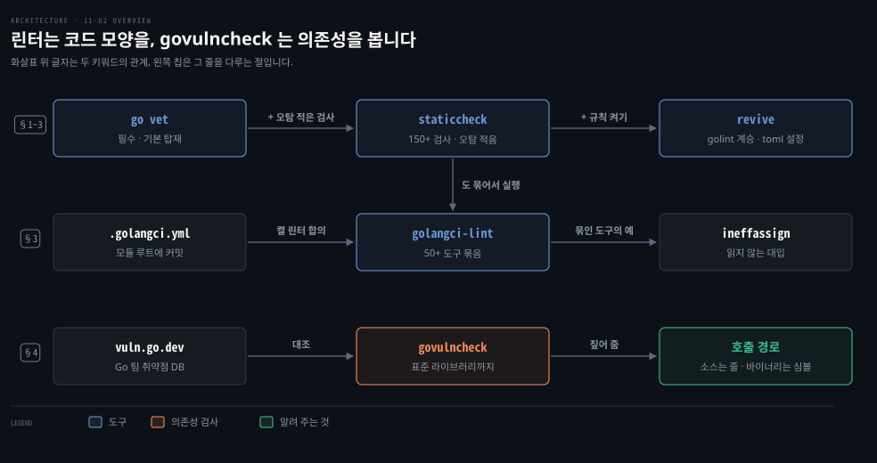
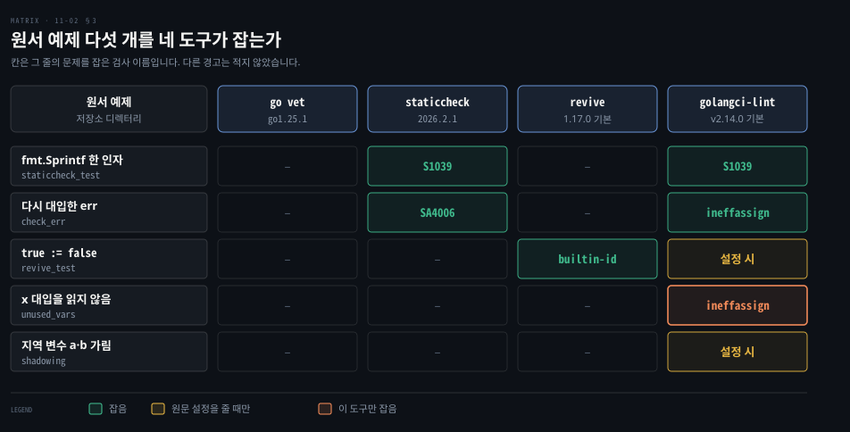

# 린터는 믿되 확인하며 쓰고 govulncheck 는 실제로 부르는 취약 코드를 짚습니다

---

> Learning Go 11장 둘째 부분입니다. `go vet` 이 놓치는 문제를 잡는 서드파티 코드 품질 스캐너 `staticcheck`·`revive`·`golangci-lint` 와, 의존성의 알려진 취약점을 찾는 `govulncheck` 를 다룹니다.

## 핵심 요약

> 이 편이 매달린 하나의 생각은 컴파일러가 통과시킨 코드에도 관용에서 벗어난 곳과 알려진 취약점이 남으니, 도구를 빌드에 넣되 결과는 판단해서 받아들이라는 것입니다.

린터는 컴파일을 막지는 않지만 관용에서 벗어난 코드를 짚습니다. 결과가 모호해 오탐과 미탐이 있으니 "믿되 확인하라" 는 태도로 씁니다. 제안을 무시할 때는 무시 주석에 이유를 남깁니다. 하나만 고른다면 오탐이 거의 없는 `staticcheck` 이고, `revive` 는 설정 파일로 규칙을 늘립니다. `golangci-lint` 는 여러 도구를 한 번에 돌립니다.

원문이 권하는 도입 순서는 `go vet` 을 필수로 두고 `staticcheck` 를 더하는 데서 시작합니다. 기준을 정할 때 `revive` 를 보고, 익숙해지면 `golangci-lint` 로 갑니다. `govulncheck` 는 Go 팀이 관리하는 취약점 데이터베이스와 의존성을 대조합니다. 취약한 함수를 실제로 부르는 코드 줄까지 알려 줍니다.


## 학습 목표

> 이 편을 읽고 나면 아래 다섯 가지를 스스로 해낼 수 있습니다.

1. 린터가 짚는 것이 오류가 아닌데도 따라야 하는 이유와, 따르지 않을 때 무엇을 남겨야 하는지 말할 수 있습니다.
2. `go vet` 이 통과시킨 코드에서 `staticcheck` 가 잡는 문제 두 가지를 예로 들 수 있습니다.
3. `revive` 의 설정 파일과 `golangci-lint` 의 .golangci.yml 이 각각 무엇을 바꾸는지 말할 수 있습니다.
4. 네 도구를 팀에 들이는 순서와 그 이유를 말할 수 있습니다.
5. `govulncheck` 가 취약한 모듈을 찾았을 때 무엇을 알려 주고, 어떤 버전으로 올려야 하는지 판단할 수 있습니다.

아래는 이 편의 키워드를 이은 개념도입니다. 윗줄은 원문이 권하는 린터 도입 순서입니다. 화살표 위에는 각 도구가 앞 도구 위에 더하는 것을 적었습니다. 가운데 줄은 `golangci-lint` 가 모듈 루트의 설정에 따라 앞의 도구와 `ineffassign` 같은 도구를 묶어 돌리는 모습입니다.

아랫줄은 `govulncheck` 가 취약점 데이터베이스를 대조해 호출 경로를 짚는 길이며, 바이너리 방식은 11-04 §1 에서 다룹니다. 위 두 줄은 코드 모양을, 아랫줄은 의존성을 봅니다.




## 1. 린터 — 컴파일은 되지만 관용에서 벗어난 코드를 짚습니다

> 린터는 변수 이름, 오류 메시지 형식, 공개 메서드의 주석처럼 컴파일을 막지 않는 문제를 짚습니다. 오탐과 미탐이 있으니 제안은 진지하게 보되, 무시할 때는 이유를 주석으로 남깁니다.

01-01 §5 에서 본 `go vet` 은 흔한 프로그래밍 실수를 찾는 내장 도구입니다. 서드파티 도구 가운데는 `go vet` 이 놓치는 버그 후보와 코드 스타일까지 검사하는 것이 많습니다. 이런 도구를 흔히 **린터**(linter)라고 부릅니다.

원문의 각주는 이 이름의 유래를 적습니다. Bell Labs 의 Unix 팀에 있던 Steve Johnson 이 1978년 논문에서 소개한 lint 프로그램에서 왔습니다. 건조기 필터에 걸리는 옷의 보풀(lint)처럼 작은 오류를 걸러 낸다는 뜻입니다.

린터는 버그 후보 말고도 변수 이름을 제대로 짓는 일, 오류 메시지 형식, 공개 메서드와 타입의 주석 같은 것을 제안합니다. 프로그램이 컴파일되지 않거나 틀리게 돌지는 않으니 오류는 아닙니다. 다만 관용에서 벗어난 코드를 쓰고 있음을 알려 줍니다.

빌드 과정에 린터를 넣을 때는 "믿되 확인하라" 는 격언을 따르라고 원문은 말합니다. 린터가 찾는 문제는 경계가 모호해 오탐과 미탐이 있습니다. 그래서 제안을 모두 따를 필요는 없지만 진지하게 받아들여야 합니다. Go 개발자는 코드가 일정한 모양과 규칙을 따르리라 기대하므로 그렇지 않은 코드는 금방 드러납니다.

제안이 도움이 되지 않으면 소스에 주석을 달아 그 결과를 막을 수 있습니다. 주석 형식은 린터마다 다르니 각 도구의 문서를 봅니다. 그 주석에는 왜 무시하는지도 적습니다. 코드 리뷰어와 여섯 달 뒤의 자신이 그 판단을 이해하게 하려는 것입니다. Java 의 `@SuppressWarnings` 나 SpotBugs 의 제외 설정에 이유를 남기는 습관과 같습니다. 이 비교는 원문 밖입니다.


## 2. staticcheck — 하나만 고른다면

> 원문은 서드파티 스캐너를 하나만 고른다면 `staticcheck` 를 쓰라고 합니다. 150개 넘는 검사를 하면서도 오탐을 거의 내지 않도록 만든 도구입니다.

린터는 많고 저마다 검사 범위와 오탐 정도가 다릅니다. 무엇부터 들일지 고르기 어렵다면 원문의 답은 `staticcheck` 입니다. `staticcheck` 는 Go 커뮤니티에서 활발한 여러 회사가 후원합니다. 150개가 넘는 코드 품질 검사를 하면서도 오탐을 되도록 내지 않으려 합니다. `go install honnef.co/go/tools/cmd/staticcheck@latest` 로 설치하고 `staticcheck ./...` 로 모듈을 검사합니다.

첫 예는 `go vet` 은 통과하지만 `staticcheck` 가 잡는 코드입니다.

```go
package main

import "fmt"

func main() {
	s := fmt.Sprintf("Hello")
	fmt.Println(s)
}
```

```bash
staticcheck ./...
# main.go:6:7: unnecessary use of fmt.Sprintf (S1039)
staticcheck -explain S1039
# Unnecessary use of fmt.Sprint
#
# Calling fmt.Sprint with a single string argument is unnecessary
# and identical to using the string directly.
```

괄호 안의 코드를 `-explain` 플래그에 넘기면 설명이 나옵니다. 이 노트의 staticcheck 2026.2.1 도 같은 결과를 냈고, 설명 끝의 온라인 문서 주소만 원문의 staticcheck.io 가 아니라 staticcheck.dev 였습니다.

### 다시 대입한 err 를 읽지 않으면 잡아 줍니다

`staticcheck` 가 흔히 찾는 또 하나는 쓰이지 않는 대입입니다. Go 컴파일러는 모든 변수를 한 번은 읽으라고 요구하지만, 변수에 대입한 값마다 읽혔는지는 보지 않습니다. 함수 안에서 여러 함수를 부르며 `err` 변수를 다시 쓰는 것은 흔한 관행입니다. 그중 한 호출 뒤에 `if err != nil` 을 빠뜨려도 컴파일러는 도와주지 못합니다.

```go
func main() {
	err := returnErr(false)
	if err != nil {
		fmt.Println(err)
	}
	err = returnErr(true)
	fmt.Println("end of program")
}
```

```bash
staticcheck ./...
# main.go:13:2: this value of err is never used (SA4006)
# main.go:13:8: returnErr doesn't have side effects and its return value is ignored (SA4017)
```

13행에 관련된 문제가 둘입니다. 첫째는 `returnErr` 가 돌려준 오류를 아무도 읽지 않는다는 것입니다. 둘째는 부작용이 없는 `returnErr` 의 결과, 곧 그 오류를 무시한다는 것입니다. 이 노트의 재현도 두 줄이 똑같이 나왔습니다.


## 3. revive 와 golangci-lint — 규칙을 늘리고 도구를 묶습니다

> `revive` 는 Go 팀이 관리하던 `golint` 를 바탕으로 하며 설정 파일로 규칙을 켭니다. `golangci-lint` 는 50개 넘는 도구를 한 설정으로 돌리며, 설정 파일은 모듈 루트에 두고 팀이 함께 씁니다.

아래 표는 이 절의 도구들이 원서 예제 다섯 개에서 그 줄의 문제를 잡는지 이 노트가 직접 돌려 채운 것입니다. 줄의 문제와 다른 경고는 칸에 적지 않았습니다. revive 가 다섯 예제 모두에 낸 패키지 주석 경고, shadowing 예제에서 staticcheck 와 golangci-lint 가 낸 `var b is unused` 가 그렇습니다. `golangci-lint` 는 설정 파일 없이 돌린 v2.14.0 의 결과입니다. 맨 아랫줄의 지역 변수 가림은 원문 설정을 줄 때만 잡힙니다. 표 전체가 원문 밖 재현입니다.



### revive 는 설정 파일로 규칙을 켭니다

`revive` 는 Go 팀이 예전에 관리하던 `golint` 를 바탕으로 만들었습니다. `go install github.com/mgechev/revive@latest` 로 설치합니다. 원문은 기본으로 `golint` 에 있던 규칙만 켠다고 말합니다. 주석 없는 공개 식별자, 명명 관례를 어긴 변수, 마지막이 아닌 오류 반환 값 같은 스타일·품질 문제를 찾습니다.

설정 파일을 주면 규칙을 훨씬 많이 켤 수 있습니다. 예를 들어 universe 블록 식별자를 가리는 것을 검사하려면 built_in.toml 에 다음 한 줄을 적습니다. universe 블록과 가림은 04-01 §1·§2 에서 다뤘습니다.

```bash
# built_in.toml
[rule.redefines-builtin-id]
```

```go
package main

import "fmt"

func main() {
	true := false
	fmt.Println(true)
}
```

```bash
revive -config built_in.toml ./...
# main.go:6:2: assignment creates a shadow of built-in identifier true
```

이 노트의 revive 1.17.0 은 설정 파일 없이 돌려도 같은 경고를 냈습니다. 여기에 `should have a package comment` 경고가 하나 더 붙었습니다. 지금 판의 기본 규칙에는 이 검사가 이미 들어 있다는 뜻입니다. 설정 파일로 규칙을 켜는 방법 자체는 그대로입니다. 이 관찰은 원문 밖입니다.

켤 수 있는 규칙 가운데는 함수의 줄 수나 한 파일의 공개 struct 수를 제한하는 것처럼 코드 조직에 대한 주관이 들어간 것도 있습니다. 함수 로직의 복잡도를 평가하는 규칙도 있습니다. 원문은 `revive` 문서와 지원 규칙 목록을 보라고 권합니다.

### golangci-lint 는 여러 도구를 한 번에 돌립니다

도구를 뷔페처럼 골라 쓰고 싶다면 `golangci-lint` 가 있습니다. `go vet`·`staticcheck`·`revive` 를 포함해 50개가 넘는 코드 품질 도구를 되도록 효율적으로 설정하고 돌리게 설계했습니다. `go install` 로도 설치할 수 있지만, 원문은 웹사이트의 안내대로 바이너리를 내려받으라고 권합니다. 설치한 뒤에는 `golangci-lint run` 으로 돌립니다.

02-02 §4 에서 본 쓰이지 않는 대입을 다시 봅니다. `go vet` 과 컴파일러는 이것을 찾지 못했고, `staticcheck` 도 `revive` 도 잡지 못합니다. `golangci-lint` 에 묶인 도구 하나가 잡습니다.

```go
func main() {
	x := 10 // this assignment isn't read!
	x = 20
	fmt.Println(x)
	x = 30 // this assignment isn't read!
}
```

```bash
golangci-lint run
# main.go:6:2: ineffectual assignment to x (ineffassign)
#     x := 10
#     ^
# main.go:9:2: ineffectual assignment to x (ineffassign)
#     x = 30
#      ^
```

`golangci-lint` 로 `revive` 보다 넓은 가림 검사도 할 수 있습니다. universe 블록 식별자와 자기 코드 안 식별자의 가림을 모두 잡으려면 `golangci-lint` 를 돌리는 디렉터리의 .golangci.yml 에 다음을 적습니다.

```yaml
linters:
  enable:
    - govet
    - predeclared

linters-settings:
  govet:
    check-shadowing: true
    settings:
      shadow:
        strict: true
    enable-all: true
```

```go
package main

import "fmt"

var b = 20

func main() {
	true := false
	a := 10
	b := 30
	if true {
		a := 20
		fmt.Println(a)
	}
	fmt.Println(a, b)
}
```

```bash
golangci-lint run
# main.go:5:5: var `b` is unused (unused)
# main.go:10:2: shadow: declaration of "b" shadows declaration at line 5 (govet)
# main.go:12:3: shadow: declaration of "a" shadows declaration at line 9 (govet)
# main.go:8:2: variable true has same name as predeclared identifier (predeclared)
```

원문 출력은 페이지 폭 때문에 줄 끝이 잘려 `(go`·`(predec` 로 끝납니다. 이 노트의 v1.64.8 재현에서 온전한 이름인 `(govet)`·`(predeclared)` 를 확인해 위에 채웠습니다.

`golangci-lint` 는 도구를 워낙 많이 돌려서 팀이 일부 제안에 동의하지 않는 일이 생기기 마련입니다. 원문은 집필 당시 기본으로 7개 도구를 돌리고 50개 넘게 더 켤 수 있었다고 적습니다. 각 도구가 무엇을 하는지 문서로 확인하고, 켤 린터에 합의하면 모듈 루트의 .golangci.yml 을 고쳐 소스 관리에 커밋하라고 말합니다.

원문의 메모는 홈 디렉터리에도 설정 파일을 둘 수 있지만 다른 개발자와 일한다면 두지 말라고 합니다. 코드 리뷰에서 쓸데없는 논쟁으로 몇 시간을 보내고 싶지 않다면, 모두가 같은 품질 검사와 포맷 규칙을 쓰게 해야 합니다. Maven 에서 Checkstyle 규칙 파일을 저장소에 두고 모두가 같은 파일을 쓰게 하는 것과 같은 이유입니다. 이 비교는 원문 밖입니다.

> **원문 밖 보충**: 위 설정은 golangci-lint v1 형식입니다. v1.64.8 은 원문 출력을 그대로 냈지만 `linters.govet.check-shadowing` 이 폐기되었다는 경고를 먼저 찍었습니다. 2025년에 나온 v2 는 이 파일을 `unsupported version of the configuration` 오류로 거부합니다. v2 는 맨 위에 `version: "2"` 를 적고 설정을 `linters.settings` 아래로 옮긴 형식을 씁니다. `golangci-lint migrate` 로 바꾼 파일은 v2.14.0 에서 같은 네 경고를 냈습니다. 설정 없이 켜지는 기본 도구도 v1.64.8 은 6개, v2.14.0 은 5개였습니다.

### 도입 순서 — vet, staticcheck, revive, golangci-lint

원문의 권고는 순서가 있습니다. 먼저 `go vet` 을 자동 빌드의 필수 단계로 둡니다. 다음으로 오탐이 적은 `staticcheck` 를 더합니다. 도구를 설정하고 품질 기준을 정하는 데 관심이 생기면 `revive` 를 봅니다. 다만 `revive` 는 오탐과 미탐이 있을 수 있어 보고한 문제를 팀에 모두 고치라고 요구할 수는 없습니다. 이런 제안에 익숙해지면 `golangci-lint` 를 써 보고 팀에 맞게 설정을 다듬습니다.

오탐이 적은 도구부터 강제하고, 판단이 필요한 도구는 뒤에 두는 순서입니다. 강제 규칙이 오탐을 내면 팀이 도구 자체를 불신하게 되기 때문입니다. 이 이유 설명은 노트의 풀이입니다.

원문 밖 보충입니다. Go 1.26 은 `go fix` 를 `go vet` 과 같은 분석 프레임워크 위에 다시 만들어, 코드를 새 관용과 새 API 로 고치는 modernizer 의 자리로 바꿨습니다. 짚기만 하는 린터와 달리 고침까지 적용합니다.

go1.27.1 에서 `strings.Split` 결과를 순회하는 루프와 세 절 `for` 를 둔 `go 1.27` 모듈을 만들었습니다. `go vet` 은 아무 말이 없었습니다. `go fix -diff .` 는 앞의 루프를 `for p := range strings.SplitSeq(s, ",")` 로, 뒤의 루프를 `for i := range 3` 으로 바꾸는 diff 를 냈습니다. 같은 파일도 go.mod 를 `go 1.19` 로 내리면 diff 가 없었고, `go 1.19` 인 원서 예제 모듈 ch11 전체에서도 diff 가 없었습니다.


## 4. govulncheck — 의존성의 알려진 취약점을 찾습니다

> 지금까지의 도구는 소프트웨어 취약점을 보지 않습니다. `govulncheck` 는 표준 라이브러리와 서드파티 의존성을 Go 팀이 관리하는 공개 취약점 데이터베이스와 대조하고, 취약한 함수를 부르는 코드 줄까지 알려 줍니다.

서드파티 모듈 생태계가 풍부한 것은 좋은 일입니다. 하지만 영리한 공격자는 라이브러리의 보안 취약점을 찾아 악용합니다. 개발자는 보고된 버그를 고칩니다. 그래도 취약한 판을 쓰는 소프트웨어가 고친 판으로 올라가게 하는 것은 또 다른 문제입니다. Go 팀은 이를 위해 `govulncheck` 를 내놓았습니다.

`govulncheck` 는 의존성을 훑어 표준 라이브러리와 모듈이 가져온 서드파티 라이브러리의 알려진 취약점을 찾습니다. 취약점은 Go 팀이 관리하는 공개 데이터베이스에 보고됩니다. `go install golang.org/x/vuln/cmd/govulncheck@latest` 로 설치합니다.

원문의 예제 모듈 vulnerable 은 서드파티 YAML 라이브러리로 작은 YAML 문자열을 struct 에 읽어 들입니다.

```go
func main() {
	info := Info{}

	err := yaml.Unmarshal([]byte(data), &info)
	if err != nil {
		fmt.Printf("error: %v\n", err)
		os.Exit(1)
	}
	fmt.Printf("%+v\n", info)
}
```

```bash
# go.mod
module github.com/learning-go-book-2e/vulnerable

go 1.20

require gopkg.in/yaml.v2 v2.2.7

require gopkg.in/check.v1 v1.0.0-20201130134442-10cb98267c6c // indirect
```

```bash
govulncheck ./...
# Vulnerability #1: GO-2020-0036
#     Excessive resource consumption in YAML parsing in gopkg.in/yaml.v2
#     More info: https://pkg.go.dev/vuln/GO-2020-0036
#     Module: gopkg.in/yaml.v2
#       Found in: gopkg.in/yaml.v2@v2.2.7
#       Fixed in: gopkg.in/yaml.v2@v2.2.8
#       Example traces found:
#         #1: main.go:25:23: vulnerable.main calls yaml.Unmarshal
#
# Your code is affected by 1 vulnerability from 1 module.
```

이 모듈은 취약한 옛 YAML 패키지를 씁니다. `govulncheck` 는 문제의 코드를 부르는 정확한 줄까지 짚어 줍니다. 원문의 메모는 모듈에 취약점이 있어도 취약한 부분을 부르는 코드를 찾지 못하면 덜 심각한 경고가 나온다고 말합니다. 그 메시지는 취약점과 그것을 고친 버전을 알려 주면서, 이 모듈은 영향을 받지 않을 가능성이 높다고 덧붙입니다.

고친 버전으로 올리고 다시 검사합니다.

```bash
go get -u=patch gopkg.in/yaml.v2
# go: downloading gopkg.in/yaml.v2 v2.2.8
# go: upgraded gopkg.in/yaml.v2 v2.2.7 => v2.2.8
govulncheck ./...
# No vulnerabilities found.
```

원문은 의존성 변경을 늘 가장 작게 하라고 말합니다. 의존성의 변화가 내 코드를 깨뜨릴 가능성이 그만큼 줄어듭니다. 그래서 v2.2.x 의 최신 패치인 v2.2.8 로만 올립니다. `-u=patch` 는 10-03 §3 에서 본 플래그입니다.

원문 집필 당시 `govulncheck` 는 `go install` 로 따로 받아야 했고, 언젠가 표준 도구에 들어갈 것 같다고 원문은 내다봅니다. 그때까지는 빌드의 정기 단계로 설치해 돌리라고 권합니다. 이 노트를 쓰는 2026-09-28 에도 v1.8.0 은 golang.org/x/vuln 에서 따로 설치했습니다.

### 이 노트의 재현 — 호출하지 않는 취약점도 따로 셉니다

원서 예제 저장소 vulnerable 모듈을 govulncheck v1.8.0 으로 돌리자 GO-2020-0036 과 `main.go:25:23` 호출 경로가 원문과 똑같이 나왔습니다. 출력 모양은 조금 달라서 `=== Symbol Results ===` 머리가 붙었습니다. 끝에는 코드가 부르지 않는 취약점을 따로 센 줄이 더 있었습니다.

```bash
# This scan also found 3 vulnerabilities in packages you import and 42
# vulnerabilities in modules you require, but your code doesn't appear to call
# these vulnerabilities.
```

`-show verbose` 로 보니 이 45건은 모두 이 노트의 Go 1.25.1 표준 라이브러리 것이었습니다. 1.25.2~1.25.13 에서 고친 취약점입니다. yaml.v2 를 v2.2.8 로 올린 뒤에도 `No vulnerabilities found` 아래에 같은 줄이 남았습니다. 표준 라이브러리도 검사한다는 원문의 말이 이렇게 드러납니다. 부르지 않는 취약점과 부르는 취약점을 나눠 세는 것이 원문 메모의 "덜 심각한 경고" 입니다. 이 재현과 해석은 원문 밖입니다.

저장소의 go.mod 는 원문과 달리 `go 1.20` 이 아니라 `go 1.19` 였습니다. 검사 결과에는 영향이 없었습니다.

원문 밖 보충입니다. 같은 govulncheck v1.8.0 을 go1.27.1 이 `PATH` 앞에 오게 두고 돌리니 GO-2020-0036 과 `main.go:25:23` 은 그대로였습니다. 다만 끝줄이 `This scan found no other vulnerabilities in packages you import or modules you require.` 로 바뀌었습니다. go1.25.1 을 앞에 두고 다시 돌리면 3건과 42건을 센 줄이 돌아왔습니다. 45건이 이 노트 툴체인의 표준 라이브러리에서 왔다는 앞의 해석이 이렇게 확인됩니다.


## 핵심 개념 체크리스트

목표 번호 순서대로 짝지었습니다.

- [ ] (목표 1) 린터 제안을 무시하는 주석에 이유까지 적어야 하는 까닭을 말할 수 있습니까?
- [ ] (목표 2) `go vet` 은 통과하지만 `staticcheck` 가 잡는 코드를 두 가지 들 수 있습니까?
- [ ] (목표 2) Go 컴파일러가 읽지 않은 변수는 막으면서 읽지 않은 대입은 막지 못하는 차이를 말할 수 있습니까?
- [ ] (목표 3) 팀의 .golangci.yml 을 홈 디렉터리가 아니라 모듈 루트에 두어야 하는 이유를 말할 수 있습니까?
- [ ] (목표 4) `revive` 가 보고한 문제를 팀에 모두 고치라고 요구하지 않는 이유를 말할 수 있습니까?
- [ ] (목표 5) yaml.v2 v2.2.7 의 취약점을 고칠 때 최신 v2.4 가 아니라 v2.2.8 로 올리는 이유를 말할 수 있습니까?


## 관련 문서

- [11-01 go run 은 임시로 빌드해 바로 실행하고 go install 은 @버전으로 도구를 설치합니다](./11-01.go%20run%20%EC%9D%80%20%EC%9E%84%EC%8B%9C%EB%A1%9C%20%EB%B9%8C%EB%93%9C%ED%95%B4%20%EB%B0%94%EB%A1%9C%20%EC%8B%A4%ED%96%89%ED%95%98%EA%B3%A0%20go%20install%20%EC%9D%80%20%40%EB%B2%84%EC%A0%84%EC%9C%BC%EB%A1%9C%20%EB%8F%84%EA%B5%AC%EB%A5%BC%20%EC%84%A4%EC%B9%98%ED%95%A9%EB%8B%88%EB%8B%A4.md) — 11장 첫째. go install
- [11-04 Go 바이너리는 빌드 정보를 품고 GOOS·GOARCH 와 빌드 태그로 대상을 가립니다](./11-04.Go%20%EB%B0%94%EC%9D%B4%EB%84%88%EB%A6%AC%EB%8A%94%20%EB%B9%8C%EB%93%9C%20%EC%A0%95%EB%B3%B4%EB%A5%BC%20%ED%92%88%EA%B3%A0%20GOOS%C2%B7GOARCH%20%EC%99%80%20%EB%B9%8C%EB%93%9C%20%ED%83%9C%EA%B7%B8%EB%A1%9C%20%EB%8C%80%EC%83%81%EC%9D%84%20%EA%B0%80%EB%A6%BD%EB%8B%88%EB%8B%A4.md) — 11장 넷째. 바이너리 검사
- [04-01 안쪽 블록의 같은 이름은 바깥 변수를 가립니다](./04-01.%EC%95%88%EC%AA%BD%20%EB%B8%94%EB%A1%9D%EC%9D%98%20%EA%B0%99%EC%9D%80%20%EC%9D%B4%EB%A6%84%EC%9D%80%20%EB%B0%94%EA%B9%A5%20%EB%B3%80%EC%88%98%EB%A5%BC%20%EA%B0%80%EB%A6%BD%EB%8B%88%EB%8B%A4.md) — 4장. 가림과 universe 블록
- [10-03 서드파티 모듈은 go get 으로 들이고 최소 버전 선택으로 버전을 고릅니다](./10-03.%EC%84%9C%EB%93%9C%ED%8C%8C%ED%8B%B0%20%EB%AA%A8%EB%93%88%EC%9D%80%20go%20get%20%EC%9C%BC%EB%A1%9C%20%EB%93%A4%EC%9D%B4%EA%B3%A0%20%EC%B5%9C%EC%86%8C%20%EB%B2%84%EC%A0%84%20%EC%84%A0%ED%83%9D%EC%9C%BC%EB%A1%9C%20%EB%B2%84%EC%A0%84%EC%9D%84%20%EA%B3%A0%EB%A6%85%EB%8B%88%EB%8B%A4.md) — 10장. -u=patch
- [Learning Go 2판 — 정독 인덱스](./README.md) — 16장 전체 지도


## 참고 자료

- 원본: 《Learning Go, 2nd Edition》 (Jon Bodner, O'Reilly)
- 다룬 범위: Chapter 11 "Using Code-Quality Scanners" 부터 "Using govulncheck to Scan for Vulnerable Dependencies" 까지
- [staticcheck 검사 목록](https://staticcheck.dev/docs/checks) — S1039·SA4006 설명
- [revive 규칙 목록](https://github.com/mgechev/revive/blob/master/RULES_DESCRIPTIONS.md)
- [golangci-lint v2 마이그레이션 안내](https://golangci-lint.run/docs/product/migration-guide) — v1 설정을 v2 로 옮기는 법
- [Go 취약점 관리](https://go.dev/doc/security/vuln/) — govulncheck 와 취약점 데이터베이스
