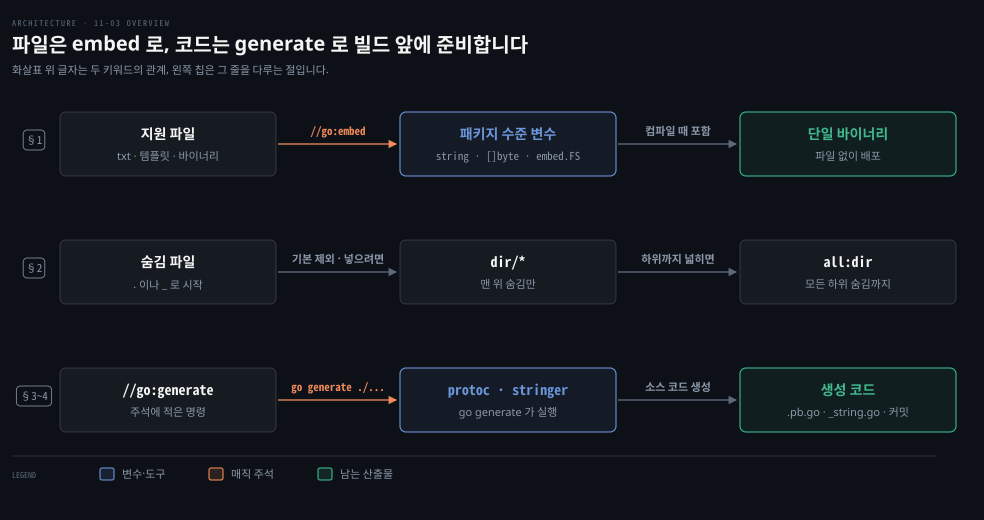
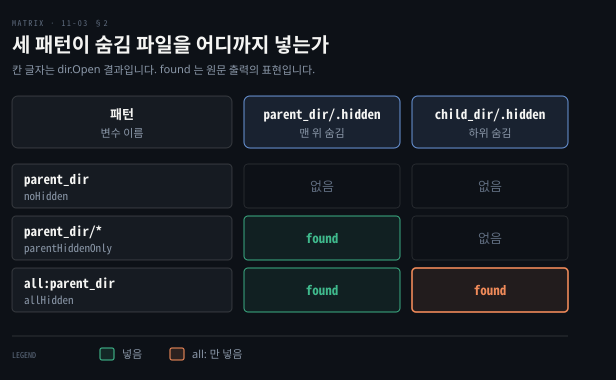

# embed 지시어는 파일을 바이너리에 넣고 go generate 는 코드를 만들어 냅니다

---

> Learning Go 11장 셋째 부분입니다. 지원 파일을 바이너리 안에 넣는 `//go:embed` 와 `embed.FS`, 숨김 파일을 넣는 두 방법, 다른 도구를 불러 소스 코드를 만드는 `go generate`, 그리고 생성 코드를 커밋하고 Makefile 로 묶는 관례를 다룹니다.

## 핵심 요약

> 이 편이 매달린 하나의 생각은 단일 바이너리라는 Go 의 장점을 지키려고 빌드 앞 단계에서 파일과 코드를 미리 준비해 둔다는 것입니다.

`//go:embed` 매직 주석을 패키지 수준 변수 바로 위에 두면 컴파일러가 파일 내용을 그 변수에 넣습니다. 파일 하나는 `string` 이나 `[]byte` 로, 디렉터리는 가상 파일 시스템인 `embed.FS` 로 받습니다. 이름이 `.` 이나 `_` 로 시작하는 숨김 파일은 기본으로 빠집니다. `dir/*` 는 맨 위 디렉터리의 숨김 파일만, `all:dir` 는 모든 하위 디렉터리의 숨김 파일까지 넣습니다.

`go generate` 는 스스로는 아무것도 하지 않고 `//go:generate` 주석에 적힌 프로그램을 돌립니다. 주로 protobuf 스키마나 열거형에서 소스 코드를 만드는 도구를 부릅니다. 생성한 코드는 버전 관리에 커밋합니다. Makefile 에서는 빌드 단계가 generate 단계에 의존하게 둡니다.


## 학습 목표

> 이 편을 읽고 나면 아래 다섯 가지를 스스로 해낼 수 있습니다.

1. `//go:embed` 를 쓰려면 무엇을 import 하고 주석을 어디에 두어야 하는지 말할 수 있습니다.
2. 파일 하나와 디렉터리를 넣을 때 변수 타입을 각각 무엇으로 고르는지, 컴파일이 실패하는 패턴이 무엇인지 말할 수 있습니다.
3. `parent_dir`·`parent_dir/*`·`all:parent_dir` 세 패턴이 숨김 파일을 어디까지 넣는지 구별할 수 있습니다.
4. `go generate` 가 하는 일과, protobuf·`stringer` 가 그것으로 무엇을 만드는지 말할 수 있습니다.
5. 생성 코드를 커밋하고 Makefile 에서 generate 를 빌드 앞에 두는 이유, 그리고 그 권고를 따르지 않는 두 경우를 말할 수 있습니다.

아래는 이 편의 키워드를 이은 개념도입니다. 윗줄은 지원 파일이 `//go:embed` 를 거쳐 패키지 수준 변수에 담기고 단일 바이너리가 되는 길입니다. 가운데 줄은 기본으로 빠지는 숨김 파일을 넣는 두 패턴입니다. 아랫줄은 `//go:generate` 주석이 도구를 불러 소스 코드를 만들고 커밋하는 길입니다. 왼쪽 칩이 그 줄을 다루는 절이며, 세 줄 모두 빌드 앞에 준비하는 일입니다.




## 1. go:embed — 지원 파일을 바이너리 안에 넣습니다

> 지원 파일을 디렉터리째 함께 배포하면 단일 바이너리라는 Go 의 장점을 잃습니다. `embed` 패키지를 import 하고 패키지 수준 변수 바로 위에 `//go:embed` 주석을 달면 파일 내용이 바이너리에 들어갑니다.

많은 프로그램이 지원 파일 디렉터리와 함께 배포됩니다. 웹 페이지 템플릿이나 프로그램이 시작할 때 읽는 표준 데이터 같은 것입니다. Go 프로그램도 파일 디렉터리를 함께 둘 수 있습니다. 하지만 그러면 배포하기 쉬운 단일 바이너리로 컴파일된다는 Go 의 장점을 잃습니다. 다른 방법은 `go:embed` 주석으로 파일 내용을 Go 바이너리 안에 넣는 것입니다.

원문의 예제 embed_passwords 는 입력한 비밀번호가 가장 흔히 쓰이는 비밀번호 목록에 있는지 확인합니다. 그 목록을 소스 코드에 직접 쓰지 않고 넣습니다.

```go
package main

import (
	_ "embed"
	"fmt"
	"os"
	"strings"
)

//go:embed passwords.txt
var passwords string

func main() {
	pwds := strings.Split(passwords, "\n")
	if len(os.Args) > 1 {
		for _, v := range pwds {
			if v == os.Args[1] {
				fmt.Println("true")
				os.Exit(0)
			}
		}
		fmt.Println("false")
	}
}
```

넣기를 켜려면 두 가지가 필요합니다. 첫째는 `embed` 패키지를 import 하는 것입니다. 컴파일러는 이 import 를 넣기를 켜라는 표시로 씁니다. 이 예제는 `embed` 가 내보내는 것을 쓰지 않으니 10-02 §5 에서 본 빈 import 를 씁니다. `embed` 가 내보내는 것은 `FS` 하나뿐입니다.

둘째는 파일 내용을 담을 패키지 수준 변수 바로 위에 매직 주석을 두는 것입니다. 주석은 `//go:embed` 로 시작하고, 슬래시와 `go:embed` 사이에 빈칸이 없어야 합니다. 이 노트의 go1.25.1 에서 `// go:embed a.txt` 처럼 빈칸을 두니 컴파일러도 `go vet` 도 아무 말이 없었습니다. 평범한 주석이 되어 변수는 빈 문자열로 남았고 `len(s)` 는 0 이었습니다. 주석은 변수 바로 윗줄에 둡니다. 원문은 빈 줄이나 매직 주석이 아닌 주석을 사이에 두어도 문법상 되지만 그러지 말라고 합니다.

넣은 값이 든 변수는 불변으로 다루는 것이 관용입니다. 패키지 수준 변수에만 넣을 수 있고, 타입은 `string`·`[]byte`·`embed.FS` 가운데 하나여야 합니다. 파일이 하나면 `string` 이나 `[]byte` 가 가장 간단합니다.

이 노트를 쓰면서 저장소 예제를 돌리니 `123456` 에는 `true`, `zzqqxx` 에는 `false` 가 찍혔습니다.

> **원문 정오**: 원문은 이 예제가 가장 흔한 비밀번호 1만 개를 확인한다고 적습니다. 이 노트가 받은 저장소의 passwords.txt 는 중복 없는 999,998줄, 8.1MB 였습니다. 1만 번째 줄 부근은 `brook`·`brady` 이고 끝은 `vjht008` 입니다. GitHub API 로 이 파일의 커밋 이력을 보니 2023-01-23 의 첫 커밋 하나뿐이었습니다. 2판이 나온 2024년 1월보다 앞서니, 인쇄 당시에도 목록은 약 100만 개였습니다. 책 16장 전체에서 "10,000 most" 는 이 한 곳에만 나옵니다.
>
> 800만 바이트가 넘는 파일도 문자열 변수 하나로 바이너리에 들어간다는 점은 오히려 넣기의 쓸모를 보여 줍니다.

### 디렉터리는 embed.FS 로 받습니다

디렉터리 하나 이상을 프로그램에 넣으려면 `embed.FS` 타입 변수를 씁니다. 이 타입은 `io/fs` 패키지의 `FS`·`ReadDirFS`·`ReadFileFS` 세 인터페이스를 구현합니다. 그래서 `embed.FS` 값 하나가 가상 파일 시스템을 나타낼 수 있습니다. 원문의 help_system 예제는 간단한 명령행 도움말입니다. 도움말 파일을 주지 않으면 있는 파일을 모두 나열하고, 없는 파일을 주면 오류를 돌려줍니다.

```go
//go:embed help
var helpInfo embed.FS

func main() {
	if len(os.Args) == 1 {
		printHelpFiles()
		os.Exit(0)
	}
	data, err := helpInfo.ReadFile("help/" + os.Args[1])
	if err != nil {
		fmt.Println(err)
		os.Exit(1)
	}
	fmt.Println(string(data))
}
```

```bash
go build
./help_system
# contents:
# advanced/topic1.txt
# advanced/topic2.txt
# info.txt
./help_system advanced/topic1.txt
# This is advanced topic 1.
./help_system advanced/topic3.txt
# open help/advanced/topic3.txt: file does not exist
```

두 가지를 볼 수 있습니다. 첫째, `embed.FS` 를 쓰니 `embed` 를 빈 import 로 가져올 필요가 없습니다. 둘째, 디렉터리 이름이 넣은 파일 시스템의 일부입니다. 사용자는 "help/" 접두어를 입력하지 않으니 `ReadFile` 을 부를 때 붙여 줘야 합니다. 이 노트의 재현도 세 출력이 원문과 같았습니다.

`printHelpFiles` 는 넣은 가상 파일 시스템을 실제 파일 시스템처럼 다룰 수 있음을 보여 줍니다.

```go
func printHelpFiles() {
	fmt.Println("contents:")
	fs.WalkDir(helpInfo, "help",
		func(path string, d fs.DirEntry, err error) error {
			if !d.IsDir() {
				_, fileName, _ := strings.Cut(path, "/")
				fmt.Println(fileName)
			}
			return nil
		})
}
```

`io/fs` 의 `WalkDir` 로 넣은 파일 시스템을 돕니다. `WalkDir` 은 `fs.FS` 값, 시작 경로, 함수 하나를 받습니다. 그 함수는 시작 경로부터 파일과 디렉터리마다 불립니다. `fs.DirEntry` 가 디렉터리가 아니면 `strings.Cut` 으로 `help/` 접두어를 떼고 경로를 찍습니다.

Spring Boot 가 `src/main/resources` 의 파일을 jar 안에 넣고 `ClassPathResource` 로 읽게 하는 것과 같은 자리입니다. 다른 점은 Go 가 이것을 빌드 도구 설정이 아니라 언어의 주석과 표준 라이브러리로 한다는 것입니다. 이 비교는 원문 밖입니다.

### 패턴 규칙과 컴파일 오류

원문이 더 알아 둘 것으로 꼽는 것은 이렇습니다. 예제는 모두 텍스트 파일이었지만 바이너리 파일도 넣을 수 있습니다. 파일이나 디렉터리 이름을 빈칸으로 나눠 적으면 여러 개를 `embed.FS` 변수 하나에 넣을 수 있습니다. 이름에 빈칸이 있으면 따옴표로 감쌉니다.

정확한 이름 말고 와일드카드와 범위도 쓸 수 있습니다. 문법은 표준 라이브러리 `path` 패키지의 `Match` 함수 문서에 정의되어 있지만 흔한 관례를 따릅니다. `*` 는 0개 이상의 문자, `?` 는 문자 하나에 맞습니다.

패턴을 쓰든 쓰지 않든 모든 지정은 컴파일러가 검사합니다. 잘못되면 컴파일이 실패합니다. 원문이 꼽는 경우는 셋이며, 이 노트의 go1.25.1 에서 모두 재현했습니다.

| 잘못된 지정 | go1.25.1 오류 |
|---|---|
| 이름이나 패턴에 맞는 파일·디렉터리가 없음 | `pattern nope.txt: no matching files found` |
| `string`·`[]byte` 변수에 이름을 여럿 줌 | `invalid go:embed: multiple files for type string` |
| `string`·`[]byte` 변수에 준 패턴이 파일 여럿에 맞음 | `invalid go:embed: multiple files for type string` |

함수 안의 지역 변수에 `//go:embed` 를 달면 `go:embed cannot apply to var inside func` 오류가 났습니다. 패키지 수준 변수에만 넣을 수 있다는 규칙이 이렇게 드러납니다. 이 줄은 원문 밖 재현입니다.


## 2. 숨김 파일은 dir/* 와 all: 로 넣습니다

> 이름이 `.` 이나 `_` 로 시작하는 파일은 디렉터리를 지정해도 기본으로 빠집니다. `dir/*` 는 맨 위 디렉터리의 숨김 파일만, `all:dir` 는 모든 하위 디렉터리의 숨김 파일까지 넣습니다.

디렉터리 트리 안에서 `.` 이나 `_` 로 시작하는 파일을 넣는 것은 조금 까다롭습니다. 많은 운영 체제가 이것을 숨김 파일로 여기니, 디렉터리 이름을 지정해도 기본으로 들어가지 않습니다. 원문은 이 동작을 바꾸는 방법이 둘이라고 말합니다.

첫째는 넣을 디렉터리 이름 뒤에 `/*` 를 붙이는 것입니다. 루트 디렉터리 안의 숨김 파일은 모두 들어가지만, 하위 디렉터리의 숨김 파일은 들어가지 않습니다. 둘째는 디렉터리 이름 앞에 `all:` 을 붙이는 것으로, 모든 하위 디렉터리의 숨김 파일까지 넣습니다.

원문의 embed_hidden 예제에서 parent_dir 디렉터리는 파일 .hidden·visible 과 하위 디렉터리 child_dir 를 담고, child_dir 도 .hidden·visible 을 담습니다.

```go
//go:embed parent_dir
var noHidden embed.FS

//go:embed parent_dir/*
var parentHiddenOnly embed.FS

//go:embed all:parent_dir
var allHidden embed.FS

func checkForHidden(name string, dir embed.FS) {
	fmt.Println(name)
	allFileNames := []string{
		"parent_dir/.hidden",
		"parent_dir/child_dir/.hidden",
	}
	for _, v := range allFileNames {
		_, err := dir.Open(v)
		if err == nil {
			fmt.Println(v, "found")
		}
	}
	fmt.Println()
}
```

```bash
go run .
# noHidden
#
# parentHiddenOnly
# parent_dir/.hidden found
#
# allHidden
# parent_dir/.hidden found
# parent_dir/child_dir/.hidden found
```

이 노트의 재현도 원문 출력과 같았습니다. 아래 표가 세 변수의 결과를 한눈에 보입니다.



`parent_dir/*` 에서 child_dir 은 `*` 에 맞는 이름이라 디렉터리째 들어가지만, 그 안에서는 다시 기본 규칙이 적용되어 숨김 파일이 빠집니다. 그래서 둘째 줄만 비어 있습니다. 이 풀이는 노트의 해석입니다.


## 3. go generate — 주석에 적은 도구로 소스 코드를 만듭니다

> `go generate` 는 스스로 아무것도 하지 않고 `//go:generate` 주석에 적힌 프로그램을 돌립니다. protobuf 스키마에서 Go 구조체와 직렬화 코드를 만들거나, `stringer` 로 열거형에 `String` 메서드를 붙이는 데 씁니다.

`go generate` 는 조금 다른 도구입니다. 스스로는 아무것도 하지 않습니다. `go generate` 를 돌리면 소스 코드에서 특별한 형식의 주석을 찾아 거기 적힌 프로그램을 실행합니다. 무엇이든 돌릴 수 있지만, 이름대로 소스 코드를 만드는 도구를 돌리는 데 가장 많이 씁니다. 기존 코드를 분석해 기능을 더하거나, 스키마를 처리해 소스 코드를 만드는 것입니다.

### protobuf 스키마에서 Go 코드를 만듭니다

자동으로 코드로 바꿀 수 있는 좋은 예가 Protocol Buffers, 줄여서 protobuf 입니다. Google 이 데이터를 저장하고 주고받는 데 쓰는 인기 있는 바이너리 형식입니다. protobuf 를 쓸 때는 데이터 구조를 언어와 무관하게 설명하는 스키마를 씁니다. 그 형식의 데이터를 다루려는 개발자는 스키마를 처리하는 도구를 돌립니다. 도구는 데이터를 담을 언어별 자료 구조와, protobuf 형식으로 읽고 쓰는 언어별 함수를 만듭니다.

원문의 proto_generate 모듈에는 person.proto 스키마가 있습니다.

```bash
# person.proto
syntax = "proto3";

message Person {
  string name = 1;
  int32 id = 2;
  string email = 3;
}
```

`Person` 을 구현하는 struct 를 만들기는 쉽습니다. 어려운 것은 바이너리 형식과 오가는 변환 코드를 쓰는 일입니다. Google 의 도구에 이 일을 맡기고 `go generate` 로 부릅니다. 설치할 것은 둘입니다. 하나는 컴퓨터에 맞는 `protoc` 바이너리이고, 다른 하나는 `go install` 로 설치하는 Go protobuf 플러그인입니다.

```bash
go install google.golang.org/protobuf/cmd/protoc-gen-go@v1.28
```

main.go 에 `go generate` 가 처리하는 매직 주석이 있습니다. 원문은 인쇄 폭 때문에 여러 줄로 감쌌지만 실제로는 한 줄이라고 밝힙니다. 인쇄본의 둘째 `--go_opt` 는 줄 끝이 잘려 `proto_generate/dat` 로 끝납니다. 아래는 이 노트가 저장소의 main.go 와 대조해 `/data` 로 채운 것입니다.

```go
//go:generate protoc -I=. --go_out=. --go_opt=module=github.com/learning-go-book-2e/proto_generate --go_opt=Mperson.proto=github.com/learning-go-book-2e/proto_generate/data person.proto
```

`go generate ./...` 를 돌리면 data 디렉터리가 생기고 그 안에 person.pb.go 가 만들어집니다. 이 파일에는 `Person` struct 의 소스 코드가 있습니다. `google.golang.org/protobuf` 모듈의 `proto` 패키지에 있는 `Marshal`·`Unmarshal` 함수가 쓰는 메서드와 함수도 들어 있습니다. main 함수에서 이 함수들을 부릅니다.

```go
func main() {
	p := &data.Person{
		Name:  "Bob Bobson",
		Id:    20,
		Email: "bob@bobson.com",
	}
	fmt.Println(p)
	protoBytes, _ := proto.Marshal(p)
	fmt.Println(protoBytes)
	var p2 data.Person
	proto.Unmarshal(protoBytes, &p2)
	fmt.Println(&p2)
}
```

```bash
go build
./proto_generate
# name:"Bob Bobson" id:20 email:"bob@bobson.com"
# [10 10 66 111 98 32 66 111 98 115 111 110 16 20 26 14 98 111 98 64 98 111 98 115 111 110 46 99 111 109]
# name:"Bob Bobson" id:20 email:"bob@bobson.com"
```

이 노트의 재현에서는 도구 버전이 결과를 갈랐습니다. 원문대로 protoc-gen-go v1.28 을 설치하면 v1.28.1 이 받아집니다. 그 생성 코드는 빌드되어 위와 같은 바이트 30개를 찍었습니다.

 `@latest` 인 v1.36.11 로 만든 코드는 `unsafe.StringData requires go1.20 or later (-lang was set to go1.19; check go.mod)` 로 빌드가 멈췄습니다. 모듈의 `go` 지시어가 1.19 인데 새 생성기가 Go 1.20 기능을 쓰는 코드를 냈기 때문입니다. 원문은 `@v1.28` 로 고정한 이유를 밝히지 않았지만, 이 재현은 생성기 버전을 고정해야 하는 이유 하나를 보여 줍니다. 이 관찰은 원문 밖입니다.

### stringer 로 열거형에 이름을 붙입니다

`go generate` 와 흔히 함께 쓰는 또 하나의 도구는 `stringer` 입니다. 07-02 §2 에서 본 대로 Go 의 열거형에는 다른 언어의 열거형이 가진 기능이 많이 없습니다. 그 하나가 각 값의 출력용 이름을 자동으로 만드는 기능입니다. `stringer` 는 `go generate` 와 함께 열거형 값에 `String` 메서드를 붙여 출력할 수 있게 합니다.

```go
type Direction int

const (
	_ Direction = iota
	North
	South
	East
	West
)

//go:generate stringer -type=Direction

func main() {
	fmt.Println(North.String())
}
```

`go install golang.org/x/tools/cmd/stringer@latest` 로 설치하고 `go generate ./...` 를 돌리면 direction_string.go 가 생깁니다. 빌드해 실행하면 `North` 가 찍힙니다. `stringer` 와 그 출력은 여러 방식으로 설정할 수 있고, Arjun Mahishi 의 블로그 글이 사용법과 출력 설정을 잘 설명한다고 원문은 안내합니다.

> **원문 정오**: 원문은 "`go build` 로 string_demo 바이너리를 빌드한다" 고 적었지만, 원문이 바로 앞에 적은 디렉터리 이름은 stringer_demo 입니다. `go build` 는 패키지 import 경로의 마지막 요소로 바이너리 이름을 정합니다. 이 저장소에서는 그것이 디렉터리 이름과 같으므로 stringer_demo 가 맞습니다. 이 노트의 재현에서도 stringer_demo 가 만들어졌습니다. 책 16장 전체에서 string_demo 는 이 한 곳에만 나옵니다.

Java 에서 `enum` 이 `name()` 을 기본으로 주는 것과 달리, Go 는 이름 문자열을 코드 생성으로 얻습니다. MapStruct 같은 어노테이션 처리기는 컴파일할 때마다 돌고 결과를 빌드 산출물 디렉터리에 둡니다. `go generate` 는 따로 돌리고 결과를 소스 트리에 남겨 커밋합니다. 이 비교는 원문 밖입니다.


## 4. go generate 와 Makefile — 생성 코드는 커밋하고 빌드 앞에 둡니다

> 코드를 기계적으로 만드는 일은 `go generate` 가, 검증과 컴파일은 Makefile 이 맡습니다. 생성 코드는 커밋하고, Makefile 에서는 build 가 generate 에 의존하게 두는 것이 원칙입니다.

`go generate` 가 하는 일이 다른 도구를 돌리는 것이라면, 좋은 Makefile 이 있는데 굳이 써야 하는지 궁금할 수 있습니다. 원문은 `go generate` 의 장점이 책임을 나눈다는 데 있다고 말합니다. 소스 코드를 기계적으로 만드는 일은 `go generate` 명령에 맡기고, 소스 코드를 검증하고 컴파일하는 일은 Makefile 에 맡깁니다. Makefile 은 01-01 §6 에서 본 것입니다.

`go generate` 가 만든 소스 코드는 버전 관리에 커밋하는 것이 모범 관례입니다. 원서 예제 저장소는 `go generate` 가 도는 모습을 보여 주려고 생성 코드를 넣지 않았다고 원문은 밝힙니다. 생성 코드를 커밋하면 소스를 둘러보는 사람이 생성된 부분까지 호출되는 모든 것을 볼 수 있습니다. 코드를 빌드하려고 `protoc` 같은 도구를 설치할 필요도 없습니다.

### 그래도 generate 를 빌드 앞에 자동으로 둡니다

생성 코드를 커밋했다면 엄밀히는 출력이 달라질 때만 `go generate` 를 돌리면 됩니다. protobuf 정의나 열거형이 바뀐 경우입니다. 그래도 원문은 `go build` 전에 `go generate` 를 자동으로 부르는 편이 좋다고 말합니다. 손으로 하는 절차에 기대면 문제가 생깁니다.

`stringer` 처럼 `go generate` 를 다시 돌리는 것을 잊으면 컴파일을 막는 영리한 장치를 넣은 생성기도 있습니다. 하지만 모든 생성기가 그렇지는 않습니다. 결국 시험 중에 변경이 왜 반영되지 않았는지 헤매다 `go generate` 를 잊은 것을 깨닫게 된다고 원문은 말합니다. 저자는 이 실수를 여러 번 하고서야 배웠다고 적습니다. 그래서 Makefile 에 generate 단계를 두고 build 단계가 그것에 의존하게 하는 것이 가장 좋습니다.

이 노트를 쓰면서 `stringer` 의 장치를 확인했습니다. direction_string.go 에는 `_ = x[North-1]` 같은 줄이 든 빈 함수가 있고, 상수 값이 바뀌면 컴파일 오류가 나게 한다는 주석이 달려 있습니다. `North` 앞에 `Up` 을 끼우고 다시 생성하지 않은 채 빌드하니 `invalid argument: index 1 out of bounds [0:1]` 가 네 줄 났습니다. 이 확인은 원문 밖입니다.

```makefile
.DEFAULT_GOAL := build

.PHONY: generate build
generate:
	go generate ./...

build: generate
	go build
```

위 Makefile 은 원문의 권고를 01-01 §6 의 형식에 맞춰 노트가 쓴 것입니다.

### 이 권고를 따르지 않는 두 경우

원문은 두 상황에서는 이 권고를 무시하겠다고 말합니다. 첫째는 같은 입력에 `go generate` 를 돌려도 타임스탬프처럼 사소하게 다른 소스 파일이 나올 때입니다. 잘 만든 도구라면 같은 입력에 늘 같은 출력을 내야 하지만, 쓰는 도구가 모두 잘 만들어졌다는 보장은 없습니다. 기능이 같은 파일의 새 판을 계속 커밋하면 버전 관리가 어지러워지고 코드 리뷰가 시끄러워집니다.

둘째는 `go generate` 가 아주 오래 걸릴 때입니다. 빠른 빌드는 개발자가 집중을 유지하고 빠르게 피드백을 받게 해 주는 Go 의 기능입니다. 똑같은 파일을 만들려고 빌드를 눈에 띄게 늦춘다면 잃는 생산성이 더 큽니다. 두 경우 모두 할 수 있는 일은 무언가 바뀌면 다시 만들라는 주석을 많이 남기고, 팀이 부지런하기를 바라는 것뿐이라고 원문은 말합니다.


## 핵심 개념 체크리스트

목표 번호 순서대로 짝지었습니다.

- [ ] (목표 1) `embed` 에서 아무것도 쓰지 않는데도 import 해야 하는 이유와 그때의 import 모양을 말할 수 있습니까?
- [ ] (목표 1) `// go:embed` 처럼 슬래시 뒤에 빈칸을 두면 어떻게 됩니까?
- [ ] (목표 2) `string` 변수에 `*.txt` 패턴을 주었는데 txt 파일이 둘이면 무슨 일이 일어납니까?
- [ ] (목표 3) child_dir 안의 .hidden 까지 넣으려면 세 패턴 가운데 무엇을 씁니까?
- [ ] (목표 4) protoc-gen-go 를 `@latest` 가 아니라 특정 버전으로 설치해야 하는 이유를 말할 수 있습니까?
- [ ] (목표 5) 생성 코드를 커밋했는데도 Makefile 에서 build 가 generate 에 의존하게 두는 이유를 말할 수 있습니까?
- [ ] (목표 5) 생성할 때마다 타임스탬프가 바뀌는 도구라면 이 관례를 어떻게 바꿉니까?


## 관련 문서

- [11-02 린터는 믿되 확인하며 쓰고 govulncheck 는 실제로 부르는 취약 코드를 짚습니다](./11-02.%EB%A6%B0%ED%84%B0%EB%8A%94%20%EB%AF%BF%EB%90%98%20%ED%99%95%EC%9D%B8%ED%95%98%EB%A9%B0%20%EC%93%B0%EA%B3%A0%20govulncheck%20%EB%8A%94%20%EC%8B%A4%EC%A0%9C%EB%A1%9C%20%EB%B6%80%EB%A5%B4%EB%8A%94%20%EC%B7%A8%EC%95%BD%20%EC%BD%94%EB%93%9C%EB%A5%BC%20%EC%A7%9A%EC%8A%B5%EB%8B%88%EB%8B%A4.md) — 11장 둘째. 코드 품질 스캐너
- [11-04 Go 바이너리는 빌드 정보를 품고 GOOS·GOARCH 와 빌드 태그로 대상을 가립니다](./11-04.Go%20%EB%B0%94%EC%9D%B4%EB%84%88%EB%A6%AC%EB%8A%94%20%EB%B9%8C%EB%93%9C%20%EC%A0%95%EB%B3%B4%EB%A5%BC%20%ED%92%88%EA%B3%A0%20GOOS%C2%B7GOARCH%20%EC%99%80%20%EB%B9%8C%EB%93%9C%20%ED%83%9C%EA%B7%B8%EB%A1%9C%20%EB%8C%80%EC%83%81%EC%9D%84%20%EA%B0%80%EB%A6%BD%EB%8B%88%EB%8B%A4.md) — 11장 넷째. 매직 주석 //go:build
- [07-02 타입 선언과 임베딩은 상속이 아니라 이름 붙이기와 승격입니다](./07-02.%ED%83%80%EC%9E%85%20%EC%84%A0%EC%96%B8%EA%B3%BC%20%EC%9E%84%EB%B2%A0%EB%94%A9%EC%9D%80%20%EC%83%81%EC%86%8D%EC%9D%B4%20%EC%95%84%EB%8B%88%EB%9D%BC%20%EC%9D%B4%EB%A6%84%20%EB%B6%99%EC%9D%B4%EA%B8%B0%EC%99%80%20%EC%8A%B9%EA%B2%A9%EC%9E%85%EB%8B%88%EB%8B%A4.md) — 7장. iota 열거형
- [10-02 패키지는 대문자로 내보내고 이름으로 기능을 말하며 internal 로 감춥니다](./10-02.%ED%8C%A8%ED%82%A4%EC%A7%80%EB%8A%94%20%EB%8C%80%EB%AC%B8%EC%9E%90%EB%A1%9C%20%EB%82%B4%EB%B3%B4%EB%82%B4%EA%B3%A0%20%EC%9D%B4%EB%A6%84%EC%9C%BC%EB%A1%9C%20%EA%B8%B0%EB%8A%A5%EC%9D%84%20%EB%A7%90%ED%95%98%EB%A9%B0%20internal%20%EB%A1%9C%20%EA%B0%90%EC%B6%A5%EB%8B%88%EB%8B%A4.md) — 10장. 빈 import 와 init
- [01-01 go 명령 하나로 만들고 다듬고 검사합니다](./01-01.go%20%EB%AA%85%EB%A0%B9%20%ED%95%98%EB%82%98%EB%A1%9C%20%EB%A7%8C%EB%93%A4%EA%B3%A0%20%EB%8B%A4%EB%93%AC%EA%B3%A0%20%EA%B2%80%EC%82%AC%ED%95%A9%EB%8B%88%EB%8B%A4.md) — 1장. Makefile
- [Learning Go 2판 — 정독 인덱스](./README.md) — 16장 전체 지도


## 참고 자료

- 원본: 《Learning Go, 2nd Edition》 (Jon Bodner, O'Reilly)
- 다룬 범위: Chapter 11 "Embedding Content into Your Program" 부터 "Working with go generate and Makefiles" 까지
- [embed 패키지 문서](https://pkg.go.dev/embed) — 지시어 위치·패턴·숨김 파일 규칙
- [path.Match](https://pkg.go.dev/path#Match) — 넣기 패턴의 문법
- [Protocol Buffers Go 튜토리얼](https://protobuf.dev/getting-started/gotutorial/)
- [stringer](https://pkg.go.dev/golang.org/x/tools/cmd/stringer)
