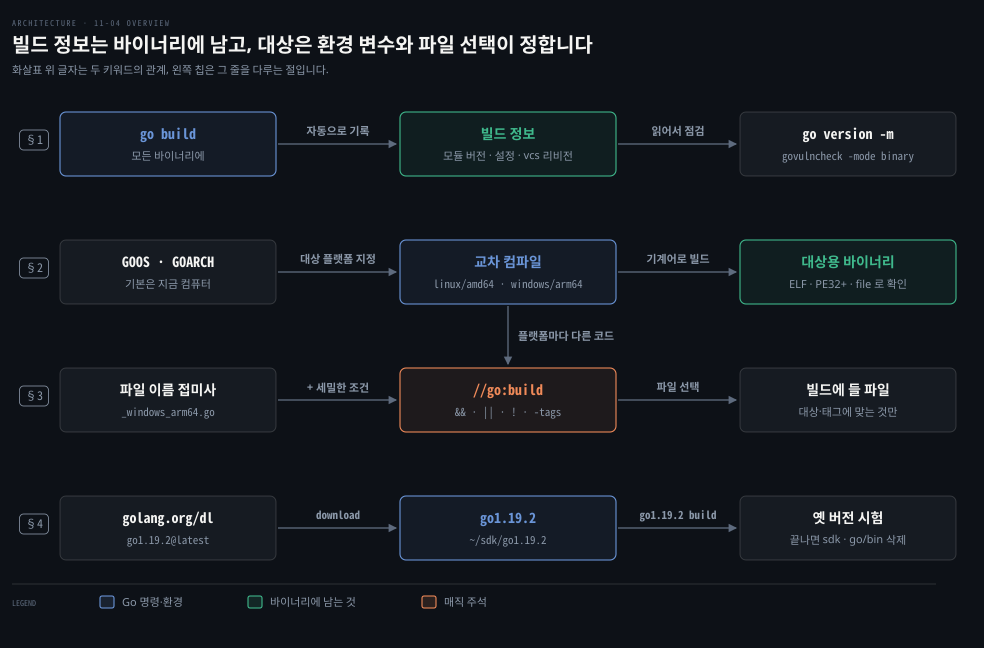
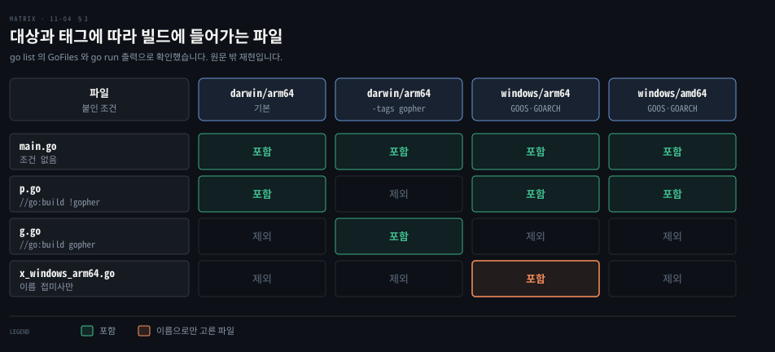

# Go 바이너리는 빌드 정보를 품고 GOOS·GOARCH 와 빌드 태그로 대상을 가립니다

---

> Learning Go 11장 끝입니다. 바이너리 안에 든 빌드 정보를 읽는 `go version -m`, 다른 운영 체제와 CPU 용 바이너리를 만드는 교차 컴파일, 플랫폼마다 다른 파일을 고르는 파일 이름 규칙과 빌드 태그, 다른 Go 버전으로 시험하는 법을 다루고 장 끝 연습 문제를 풉니다.

## 핵심 요약

> 이 편이 매달린 하나의 생각은 Go 바이너리 하나가 자기가 무엇으로 어떻게 만들어졌는지 스스로 기록하고, 어느 플랫폼용인지는 빌드할 때 환경 변수와 파일 선택으로 정해진다는 것입니다.

`go build` 로 만든 바이너리에는 들어간 모듈의 버전, 빌드 설정, 버전 관리 리비전이 자동으로 들어갑니다. `go version -m` 으로 읽고 `govulncheck -mode binary` 로 배포된 바이너리의 취약점을 찾습니다. `GOOS`·`GOARCH` 환경 변수를 바꾸면 다른 운영 체제와 CPU 용으로 교차 컴파일합니다.

플랫폼마다 다른 코드는 두 방법으로 고릅니다. 파일 이름에 `_windows_arm64` 같은 접미사를 붙이는 방법과, `package` 선언 앞에 `//go:build` 태그를 두는 방법입니다. 태그는 불리언 연산자로 더 세밀하게 고르고, 직접 만든 태그는 `-tags` 로 켭니다. 다른 Go 버전으로 시험하려면 golang.org/dl 로 보조 Go 환경을 설치합니다.


## 학습 목표

> 이 편을 읽고 나면 아래 다섯 가지를 스스로 해낼 수 있습니다.

1. Go 바이너리에 어떤 빌드 정보가 들어 있고, 배포된 소프트웨어의 취약점을 찾을 때 그것이 왜 쓸모 있는지 말할 수 있습니다.
2. `GOOS`·`GOARCH` 로 교차 컴파일하는 명령을 쓰고, 그 결과를 `file` 로 확인할 수 있습니다.
3. 파일 이름 접미사와 `//go:build` 태그가 각각 언제 알맞은지, 표준 라이브러리가 둘을 함께 쓰는 이유와 함께 말할 수 있습니다.
4. 직접 만든 빌드 태그로 파일을 빌드에서 빼거나 켜는 법을 말할 수 있습니다.
5. 다른 Go 버전을 설치해 시험하고 깔끔하게 지우는 절차를 말할 수 있습니다.

아래는 이 편의 키워드를 이은 개념도입니다. 첫 줄은 `go build` 가 바이너리에 남긴 빌드 정보를 `go version -m` 과 `govulncheck` 가 읽는 길입니다. 둘째 줄에서는 `GOOS`·`GOARCH` 가 대상 플랫폼을 정해 교차 컴파일합니다. 셋째 줄은 파일 이름 접미사와 `//go:build` 태그로 그 플랫폼에 들어갈 파일을 고르는 단계입니다. 넷째 줄에서는 golang.org/dl 로 다른 Go 버전을 설치해 같은 코드를 시험합니다. 왼쪽 칩이 그 줄을 다루는 절입니다.




## 1. 바이너리 안의 빌드 정보를 읽습니다

> `go build` 로 만든 모든 바이너리에는 들어간 모듈의 버전, 빌드 명령과 설정, 버전 관리 시스템과 리비전이 자동으로 들어갑니다. `go version -m` 으로 읽고, `govulncheck` 는 이 정보로 바이너리의 취약점을 찾습니다.

회사가 자체 소프트웨어를 많이 만들수록 데이터 센터와 클라우드에 무엇을 배포했는지 버전과 의존성까지 정확히 알고 싶어집니다. 버전 관리에 이미 있는 정보를 왜 컴파일된 코드에서 얻어야 하는지 궁금할 수 있습니다.

개발과 배포 파이프라인이 성숙한 회사는 배포 직전에 이 정보를 기록해 정확성을 보장합니다. 하지만 원문은 많은 회사, 어쩌면 대부분이 배포한 내부 소프트웨어의 정확한 버전을 추적하지 않는다고 말합니다. 몇 년 동안 교체되지 않은 채 돌고 아무도 기억하지 못하는 소프트웨어도 있습니다.

서드파티 라이브러리의 어떤 버전에 취약점이 보고되면 배포된 소프트웨어를 검사해 서드파티 라이브러리 버전을 알아낼 방법을 찾아야 합니다. 그러지 못하면 안전을 위해 모두 다시 배포해야 합니다. Java 세계에서는 널리 쓰이던 Log4j 라이브러리에서 심각한 취약점이 발견되었을 때 바로 이 문제가 벌어졌습니다.

Go 는 이 문제를 풉니다. `go build` 로 만든 모든 Go 바이너리에는 어떤 모듈의 어떤 버전이 들어갔는지가 자동으로 들어갑니다. 어떤 빌드 명령을 썼는지, 어떤 버전 관리 시스템을 썼는지, 코드가 그 시스템의 어느 리비전이었는지도 들어갑니다. `go version -m` 명령으로 이 정보를 봅니다. 원문의 예는 11-02 §4 의 vulnerable 프로그램을 Apple Silicon Mac 에서 빌드한 것입니다.

```bash
go build
# go: downloading gopkg.in/yaml.v2 v2.2.7
go version -m vulnerable
# vulnerable: go1.20
#     path    github.com/learning-go-book-2e/vulnerable
#     mod     github.com/learning-go-book-2e/vulnerable  (devel)
#     dep     gopkg.in/yaml.v2 v2.2.7 h1:VUgggvou5XRW9mHwD/yXxIYSMtY0zoKQ
#     build   -compiler=gc
#     build   CGO_ENABLED=1
#     build   GOARCH=arm64
#     build   GOOS=darwin
#     build   vcs=git
#     build   vcs.revision=623a65b94fd02ea6f18df53afaaea3510cd1e611
#     build   vcs.time=2022-10-02T03:31:05Z
#     build   vcs.modified=false
```

원문 출력의 `CGO_CFLAGS=` 처럼 값이 빈 네 줄은 줄였고 `dep` 줄의 해시는 원문에서도 잘려 있습니다. 이 노트는 프록시에서 vulnerable 모듈을 받았습니다. 그 pseudo-version `v0.0.0-20221002033105-623a65b94fd0` 이 `vcs.revision` 의 `623a65b94fd0...` 과 맞습니다.

이 정보가 모든 바이너리에 들어 있어서 `govulncheck` 는 Go 프로그램 바이너리를 검사해 알려진 취약점이 있는 라이브러리를 찾을 수 있습니다.

```bash
govulncheck -mode binary vulnerable
# Scanning your binary for known vulnerabilities...
#
# Vulnerability #1: GO-2020-0036
#     Excessive resource consumption in YAML parsing in gopkg.in/yaml.v2
#     Found in: gopkg.in/yaml.v2@v2.2.7
#     Fixed in: gopkg.in/yaml.v2@v2.2.8
#     Example traces found:
#       #1: yaml.Unmarshal
#
# Your code is affected by 1 vulnerability from 1 module.
```

바이너리를 검사할 때 `govulncheck` 는 정확한 코드 줄까지 찾지는 못합니다. 소스 검사가 `main.go:25:23` 을 짚은 것과 달리 여기서는 `yaml.Unmarshal` 이라는 심볼만 나옵니다. 원문은 바이너리에서 문제가 나오면 `go version -m` 으로 배포된 정확한 버전을 알아내라고 말합니다. 그 버전을 버전 관리에서 꺼내 소스 코드에 다시 돌려 문제 위치를 짚으라고 합니다. 자기 도구로 빌드 정보를 읽고 싶다면 표준 라이브러리의 `debug/buildinfo` 패키지를 보라고 안내합니다.

### 이 노트의 재현 — 지금의 Go 는 모듈 버전도 적습니다

이 노트는 vulnerable 모듈을 git 저장소로 만들어 커밋한 뒤 go1.25.1 로 빌드했습니다. `vcs=git`·`vcs.revision`·`vcs.time`·`vcs.modified=false` 가 원문처럼 들어갔습니다. 원문 출력에 없던 `build -buildmode=exe`·`build GOARM64=v8.0` 줄도 있었습니다. 눈에 띄는 차이는 둘이었습니다.

첫째, `mod` 줄이 `(devel)` 이 아니라 `v0.0.0-20260927152917-794a673bdb9a` 였습니다. Go 1.24 부터 `go build` 가 버전 관리의 태그나 커밋으로 메인 모듈의 버전을 매겨 넣기 때문입니다. 둘째, `build DefaultGODEBUG=...` 줄이 더 있었습니다. 모듈의 `go` 지시어가 1.19 라서 그 뒤에 바뀐 동작을 옛 방식으로 되돌리는 설정들입니다. 10-01 §3 에서 본 대로 `go` 지시어가 모듈의 동작 수준을 정한다는 것이 바이너리에도 기록됩니다. 두 관찰은 원문 밖입니다.

원문 밖 보충입니다. Go 1.25 는 `go version -m -json` 을 더해, 바이너리에 든 `runtime/debug.BuildInfo` 구조체를 JSON 으로 찍게 했습니다.

go1.27.1 로 다시 빌드한 vulnerable 에 돌리니 `"GoVersion": "go1.27.1"` 과 `"Main"` 의 `"Version": "v0.0.0-20261003012637-512ef8c03969"` 이 나왔습니다. `"Deps"` 에는 `gopkg.in/yaml.v2` `v2.2.7` 이 있었고, 빌드 설정은 `"Settings"` 배열의 `Key`·`Value` 쌍이었습니다.

원문이 안내한 `debug/buildinfo` 의 `buildinfo.ReadFile` 로 같은 바이너리를 읽은 짧은 프로그램도 `go1.27.1`, 같은 메인 모듈 버전, `gopkg.in/yaml.v2 v2.2.7` 을 찍었습니다.

Java 생태계가 SBOM 을 따로 만들어 얻는 정보를 Go 바이너리는 빌드 도구의 기본 동작으로 의존성 목록에 담습니다. 이 비교는 원문 밖입니다.


## 2. 다른 플랫폼용 바이너리는 GOOS·GOARCH 로 만듭니다

> Go 는 기계어로 컴파일되어 바이너리가 운영 체제와 CPU 하나에만 맞습니다. 대신 `GOOS`·`GOARCH` 환경 변수만 바꾸면 `go build` 가 다른 플랫폼용 바이너리를 만듭니다.

Java·JavaScript·Python 처럼 VM 위에서 도는 언어는 VM 이 설치된 컴퓨터라면 어디서든 코드를 돌릴 수 있다는 장점이 있습니다. 이 이식성 덕에 Windows 나 Mac 에서 만든 프로그램을 운영 체제와 CPU 가 다른 Linux 서버에 배포하기 쉽습니다.

Go 프로그램은 기계어로 컴파일되니 만든 바이너리는 운영 체제와 CPU 아키텍처 하나에만 맞습니다. 그렇다고 여러 플랫폼용으로 내려고 가상이든 실물이든 기계를 잔뜩 둘 필요는 없습니다. `go build` 로는 **교차 컴파일**(cross-compile), 곧 다른 운영 체제나 CPU 용 바이너리를 만드는 일을 쉽게 할 수 있습니다.

`go build` 는 대상 운영 체제를 `GOOS` 환경 변수로, CPU 아키텍처를 `GOARCH` 로 받습니다. 둘을 따로 정하지 않으면 지금 컴퓨터의 값을 씁니다. 그래서 지금까지는 이 변수를 신경 쓸 일이 없었습니다.

쓸 수 있는 값과 조합은 설치 문서에 있고, 원문은 가끔 "GOOSE" 와 "GORCH" 로 읽는다고 덧붙입니다. 이 노트의 go1.25.1 에서 `go tool dist list` 는 48개 조합을 찍었습니다. 이 명령은 원문 밖 보충입니다. 몇몇 운영 체제와 CPU 는 조금 낯설고 번역이 필요한 것도 있습니다. `darwin` 은 macOS 이고(Darwin 은 macOS 커널의 이름입니다), `amd64` 는 64비트 Intel 호환 CPU 입니다.

원문 밖 보충입니다. go1.26.8·go1.27.1 의 `go tool dist list` 는 47개를 찍었습니다. Go 1.26 이 freebsd/riscv64 를 고장 난(broken) 포트로 표시해 목록에서 빠졌고, `-broken` 을 주면 linux/sparc64 와 함께 다시 나와 49개가 됩니다.

go1.27.1 에서 `GOOS=freebsd GOARCH=riscv64 go build` 는 그래도 빌드되었습니다. Go 1.26 은 고장 난 32비트 windows/arm 포트도 지웠습니다. go1.25.1 목록에도 이미 없던 조합인데, go1.27.1 에서 `GOOS=windows GOARCH=arm go build` 를 돌리면 `go: unsupported GOOS/GOARCH pair windows/arm` 으로 멈춥니다.

vulnerable 프로그램으로 돌아갑니다. ARM64 CPU 를 쓰는 Apple Silicon Mac 에서 `go build` 는 `GOOS` 에 `darwin`, `GOARCH` 에 `arm64` 를 씁니다. `file` 명령으로 확인합니다.

```bash
go build
file vulnerable
# vulnerable: Mach-O 64-bit executable arm64

GOOS=linux GOARCH=amd64 go build
file vulnerable
# vulnerable: ELF 64-bit LSB executable, x86-64, version 1 (SYSV),
#     statically linked, Go BuildID=..., with debug_info, not stripped
```

이 노트의 재현도 같은 두 모양이 나왔습니다. 다만 Linux 바이너리의 `file` 출력은 `Go BuildID=...` 가 아니라 `BuildID[sha1]=...` 로 찍혔습니다.

go1.27.1 로 재확인하니 이 차이는 `file` 판이 아니라 Go 판에서 왔습니다. 같은 file-5.41 에서 go1.25.1 이 만든 바이너리에는 `Go BuildID=` 가 없었고, go1.26.8·go1.27.1 이 만든 바이너리에는 `Go BuildID=...` 와 `BuildID[sha1]=...` 가 함께 찍혔습니다. Go 1.26 릴리스 노트는 링커가 실행 파일의 섹션 배치를 몇 군데 바꿨다고 적는데, 어느 변경이 이 차이를 냈는지는 확인하지 못했습니다.

Spring Boot 앱을 컨테이너로 배포할 때는 JVM 이 든 베이스 이미지를 고르지만, Go 는 대상 플랫폼용으로 정적 링크한 바이너리 하나를 빈 이미지에 넣어도 됩니다. 위 Linux 바이너리도 `file` 이 statically linked 로 보였습니다. 교차 컴파일은 이 차이의 출발점입니다. 이 비교는 원문 밖입니다.


## 3. 빌드 태그 — 플랫폼마다 다른 파일을 고릅니다

> 플랫폼마다 다른 코드가 필요하면 파일 이름에 `_GOOS_GOARCH` 접미사를 붙이거나, `package` 선언 앞 줄에 `//go:build` 태그를 둡니다. 태그는 불리언 연산자로 더 세밀하게 고르고, 파일 이름은 사람이 찾기 쉽습니다.

여러 운영 체제나 CPU 에서 돌아야 하는 프로그램을 쓰다 보면 플랫폼마다 다른 코드가 필요할 때가 있습니다. 최신 Go 기능을 쓰면서도 옛 Go 컴파일러와 호환되는 모듈을 쓰고 싶을 수도 있습니다. 원문은 대상별 코드를 만드는 방법이 둘이라고 말합니다.

첫째는 파일 이름으로 그 파일이 언제 빌드에 들어가는지 알리는 것입니다. `.go` 앞에 대상 `GOOS` 와 `GOARCH` 를 `_` 로 이어 붙입니다. Windows 에서만 컴파일할 파일은 something_windows.go, ARM64 Windows 에서만 컴파일할 파일은 something_windows_arm64.go 로 이름 짓습니다.

둘째는 **빌드 태그**(build tag), 다른 이름으로 빌드 제약입니다. 11-03 의 넣기·생성처럼 빌드 태그도 매직 주석 `//go:build` 를 씁니다. 이 주석은 파일의 `package` 선언 앞 줄에 둡니다.

빌드 태그는 불리언 연산자(`||`·`&&`·`!`)와 괄호로 아키텍처·운영 체제·Go 버전에 대한 정확한 빌드 규칙을 적습니다. 원문의 예는 `//go:build (!darwin && !linux) || (darwin && !go1.12)` 입니다. Linux 나 macOS 에서는 컴파일하지 않되, Go 1.11 이하라면 macOS 에서는 컴파일해도 된다는 뜻입니다.

원문은 이 태그가 실제로 Go 표준 라이브러리에 있다고 적습니다. 이 노트가 찾아보니 Go 1.18 소스 트리의 링커 파일 cmd/link/internal/ld/outbuf_nofallocate.go 에 있었습니다. 표준 라이브러리 패키지가 아니라 `go` 도구의 일부입니다. 이 노트의 go1.25.1 에서는 같은 파일의 태그가 `!darwin && !(freebsd && go1.21) && !linux` 로 바뀌어 있었습니다. Go 1.20 에서 이미 `!darwin && !linux` 였으니 원문이 대상으로 한 Go 1.21 무렵에는 표준 트리에 없던 태그입니다.

go1.26.8·go1.27.1 에서는 다시 `!darwin && !freebsd && !linux && !(netbsd && go1.25)` 로 바뀌어 있었습니다. 이 추적은 원문 밖입니다.

메타 빌드 제약도 몇 가지 있습니다. `unix` 는 Unix 계열 플랫폼 모두에 맞습니다. `cgo` 는 현재 플랫폼이 cgo 를 지원하고 켜져 있을 때 맞습니다. 원문은 cgo 를 「Cgo Is for Integration, Not Performance」 절에서 다룬다고 말합니다. 그 절은 16장에 있으며 절 이름만 원문에 있고 장 번호는 노트가 찾아 붙였습니다.

### 파일 이름과 태그를 함께 씁니다

그러면 언제 파일 이름을 쓰고 언제 빌드 태그를 쓸까요? 빌드 태그는 이진 연산자를 쓸 수 있어 플랫폼 집합을 더 세밀하게 정할 수 있습니다. 원문은 Go 표준 라이브러리가 때로 벨트와 멜빵을 함께 매듯 둘 다 쓴다고 말합니다.

표준 라이브러리의 `internal/cpu` 패키지는 CPU 기능 감지를 위한 플랫폼별 소스를 둡니다. internal/cpu/cpu_arm64_darwin.go 는 이름으로 Apple CPU 를 쓰는 컴퓨터 전용임을 알립니다. 그 안에는 `//go:build arm64 && darwin && !ios` 줄도 있어 iPhone·iPad 가 아닌 Apple Silicon Mac 용으로 빌드할 때만 컴파일됩니다. 빌드 태그는 대상 플랫폼을 더 자세히 정합니다. 파일 이름 관례 덕에 사람은 플랫폼에 맞는 파일을 쉽게 찾습니다. 이 노트의 go1.25.1 소스에도 이 파일과 태그가 그대로 있었습니다.

### 직접 만든 태그로 파일을 켜고 끕니다

Go 버전·운영 체제·CPU 를 나타내는 내장 태그 말고도 아무 문자열이나 사용자 정의 빌드 태그로 쓸 수 있습니다. 그리고 `-tags` 명령행 플래그로 그 파일의 컴파일을 조절합니다. `package` 선언 앞 줄에 `//go:build gopher` 를 둔 파일은 `go build`·`go run`·`go test` 에 `-tags gopher` 를 주지 않으면 컴파일되지 않습니다.

원문은 사용자 정의 태그가 뜻밖에 편하다고 말합니다. 아직 컴파일되지 않거나 실험 중이라 빌드에 넣고 싶지 않은 소스 파일은 `package` 선언 앞 줄에 `//go:build ignore` 를 두어 건너뛰는 것이 관용입니다. 원문은 「Using Integration Tests and Build Tags」 절에서 사용자 정의 태그의 다른 쓰임을 본다고 예고합니다. 그 절은 15장에 있으며 장 번호는 노트가 찾아 붙였습니다.

원문의 경고는 `//` 와 `go:build` 사이에 빈칸을 두지 말라고 합니다. 빈칸이 있으면 Go 가 빌드 태그로 여기지 않습니다.

이 노트는 파일 네 개로 작은 모듈을 만들었습니다. 아래 표는 그 모듈에서 대상과 태그에 따라 어느 파일이 빌드에 들어가는지 `go list` 와 `go run` 으로 확인한 결과입니다. p.go 는 `//go:build !gopher`, g.go 는 `//go:build gopher` 를 달았고 x_windows_arm64.go 는 이름으로만 대상을 정했습니다. 표 전체가 원문 밖 재현입니다.



같은 모듈에 `// go:build gopher` 처럼 빈칸을 둔 파일을 더하니 그 파일은 태그 없이도 늘 컴파일되었습니다. `go vet` 도 아무 말이 없었습니다. 원문의 경고가 가리키는 함정이 조용히 지나갑니다. 이 재현도 원문 밖입니다.


## 4. 다른 Go 버전으로 시험하고 go help 로 더 찾습니다

> 하위 호환 약속이 있어도 버그는 생깁니다. golang.org/dl 로 보조 Go 환경을 설치해 `go1.19.2 build` 처럼 다른 버전으로 시험하고, 끝나면 ~/sdk 의 환경과 go/bin 의 바이너리를 지웁니다.

Go 가 하위 호환을 강하게 보장해도 버그는 생깁니다. 새 릴리스가 내 프로그램을 깨지 않는지 확인하고 싶은 것은 자연스럽습니다. 라이브러리 사용자가 옛 Go 버전에서 코드가 기대대로 돌지 않는다고 버그를 보고할 수도 있습니다. 한 가지 방법은 보조 Go 환경을 설치하는 것입니다.

```bash
go install golang.org/dl/go1.19.2@latest
go1.19.2 download
go1.19.2 build
```

`go` 대신 `go1.19.2` 명령을 쓰면 1.19.2 에서 프로그램이 도는지 볼 수 있습니다. 코드가 도는 것을 확인했으면 보조 환경을 지웁니다. Go 는 보조 환경을 홈 디렉터리의 sdk 디렉터리에 둡니다. sdk 디렉터리에서 환경을, go/bin 디렉터리에서 바이너리를 지웁니다.

```bash
rm -rf ~/sdk/go1.19.2
rm ~/go/bin/go1.19.2
```

> **원문 정오**: 원문의 첫 제거 명령은 `rm -rf ~/sdk/go.19.2` 로 버전 앞의 `1` 이 빠졌습니다. 이 노트의 go1.25.1 에서 `go1.19.2 download` 를 돌리니 `Unpacking /Users/.../sdk/go1.19.2/go1.19.2.darwin-arm64.tar.gz` 가 찍혔고, 디렉터리 이름은 go1.19.2 였습니다. golang.org/dl 의 소스도 경로를 `filepath.Join(home, "sdk", version)` 으로 만들고 `version` 이 `go1.19.2` 입니다. 원문대로 지우면 없는 디렉터리를 가리켜 환경이 남습니다. 위 명령은 고친 것입니다.

이 노트는 go1.19.2 로 11-03 의 help_system 을 빌드해 성공한 뒤 고친 두 명령으로 환경을 지웠습니다. 10-01 §3 의 `GOTOOLCHAIN=go1.19.2 go build` 도 같은 목적에 쓸 수 있습니다. 그쪽은 툴체인을 모듈 캐시에 받으니 ~/sdk 에 남는 것이 없습니다. 이 비교는 원문 밖입니다.

### go help 로 도구를 더 알아봅니다

`go help` 명령은 Go 도구와 런타임 환경에 대해 더 알려 줍니다. 여기서 다룬 모든 명령은 물론, 모듈·import 경로 문법·비공개 소스 코드를 다루는 법까지 빠짐없이 담았습니다. 예를 들어 import 경로 문법은 `go help importpath` 로 봅니다.

원문은 장을 맺으며 Go 가 소프트웨어 공학 실천을 돕는 도구와 서드파티 코드 품질 도구를 배웠다고 정리합니다. 다음 장은 Go 의 대표 기능인 동시성을 다룹니다.


## 연습 문제

> 원문 연습 문제 셋은 이 장의 도구를 직접 써 보는 문제입니다. 이 노트는 원서 예제 저장소의 풀이를 go1.25.1 에서 돌려 확인했습니다.

### 1. 세계 인권 선언을 여러 언어로 넣습니다

첫 문제는 UN 세계 인권 선언(UDHR) 페이지의 영어 본문을 english_rights.txt 에 복사하는 데서 시작합니다. 다른 언어 몇 개는 LANGUAGE_rights.txt 로 복사합니다. 이 파일들을 패키지 수준 변수에 넣고 명령행 인자로 받은 언어의 선언을 찍는 프로그램을 씁니다.

저장소의 풀이는 영어·프랑스어·스페인어 파일을 `//go:embed` 로 `string` 변수 셋에 넣고 인자를 소문자로 바꿔 `switch` 로 고릅니다.

```go
//go:embed english_rights.txt
var englishRights string

//go:embed french_rights.txt
var frenchRights string

//go:embed spanish_rights.txt
var spanishRights string

func process(args []string) {
	if len(args) == 1 {
		fmt.Println("no language provided")
		return
	}
	switch strings.ToLower(args[1]) {
	case "english":
		fmt.Println(englishRights)
	case "spanish":
		fmt.Println(spanishRights)
	case "french":
		fmt.Println(frenchRights)
	default:
		fmt.Println("unknown language:", os.Args[1])
	}
}
```

`go run . french` 는 `Déclaration universelle des droits de l'homme` 로 시작하는 본문을 찍었고 `go run . german` 은 `unknown language: german` 을 찍었습니다. `default` 가 받은 `args` 가 아니라 `os.Args` 를 찍는 것은 풀이의 작은 흠입니다. 테스트에서 `process` 에 다른 인자를 넘기면 메시지가 어긋납니다. 이 지적은 노트의 것입니다.

### 2. staticcheck 로 검사합니다

둘째 문제는 `go install` 로 `staticcheck` 를 설치해 첫 문제의 프로그램에 돌리고 찾은 문제를 고치라고 합니다. 이 노트의 staticcheck 2026.2.1 은 풀이에서 아무것도 찾지 않았습니다.

```bash
go install honnef.co/go/tools/cmd/staticcheck@latest
staticcheck ./...
```

### 3. ARM64 Windows 용으로 교차 컴파일합니다

셋째 문제에서는 프로그램을 ARM64 Windows 용으로 교차 컴파일합니다. ARM64 Windows 컴퓨터를 쓴다면 AMD64 Linux 용으로 컴파일합니다.

```bash
GOOS=windows GOARCH=arm64 go build
file ex1.exe
# ex1.exe: PE32+ executable (console) Aarch64, for MS Windows
```

저장소 풀이의 출력에는 `(stripped to external PDB)` 가 더 붙어 있었지만 이 노트의 `file` 출력에는 없었습니다. 풀이는 Windows 에 `file` 명령이 없으니 `go install github.com/joeky888/fil@latest` 로 받은 `fil` 로 확인하라고 안내합니다.


## 핵심 개념 체크리스트

목표 번호 순서대로 짝지었습니다.

- [ ] (목표 1) Log4j 같은 사고가 났을 때 배포된 Go 바이너리에서 라이브러리 버전을 알아내는 명령을 말할 수 있습니까?
- [ ] (목표 1) `govulncheck -mode binary` 가 소스 검사처럼 코드 줄을 짚지 못하는 이유와 그다음 할 일을 말할 수 있습니까?
- [ ] (목표 2) Mac 에서 64비트 Intel Linux 서버용 바이너리를 만드는 명령을 쓸 수 있습니까?
- [ ] (목표 3) cpu_arm64_darwin.go 가 파일 이름이 있는데도 `//go:build` 태그를 또 다는 이유를 말할 수 있습니까?
- [ ] (목표 4) 실험 중인 파일을 빌드에서 빼는 관용적인 태그는 무엇입니까?
- [ ] (목표 4) `// go:build gopher` 처럼 빈칸을 두면 어떤 일이 일어납니까?
- [ ] (목표 5) go1.19.2 보조 환경을 지울 때 지워야 할 두 경로를 말할 수 있습니까?


## 관련 문서

- [11-03 embed 지시어는 파일을 바이너리에 넣고 go generate 는 코드를 만들어 냅니다](./11-03.embed%20%EC%A7%80%EC%8B%9C%EC%96%B4%EB%8A%94%20%ED%8C%8C%EC%9D%BC%EC%9D%84%20%EB%B0%94%EC%9D%B4%EB%84%88%EB%A6%AC%EC%97%90%20%EB%84%A3%EA%B3%A0%20go%20generate%20%EB%8A%94%20%EC%BD%94%EB%93%9C%EB%A5%BC%20%EB%A7%8C%EB%93%A4%EC%96%B4%20%EB%83%85%EB%8B%88%EB%8B%A4.md) — 11장 셋째. 매직 주석 //go:embed·//go:generate
- [11-02 린터는 믿되 확인하며 쓰고 govulncheck 는 실제로 부르는 취약 코드를 짚습니다](./11-02.%EB%A6%B0%ED%84%B0%EB%8A%94%20%EB%AF%BF%EB%90%98%20%ED%99%95%EC%9D%B8%ED%95%98%EB%A9%B0%20%EC%93%B0%EA%B3%A0%20govulncheck%20%EB%8A%94%20%EC%8B%A4%EC%A0%9C%EB%A1%9C%20%EB%B6%80%EB%A5%B4%EB%8A%94%20%EC%B7%A8%EC%95%BD%20%EC%BD%94%EB%93%9C%EB%A5%BC%20%EC%A7%9A%EC%8A%B5%EB%8B%88%EB%8B%A4.md) — 11장 둘째. govulncheck 소스 검사
- [10-01 모듈은 go.mod 로 한 단위가 되고 go 지시어가 빌드할 Go 버전을 정합니다](./10-01.%EB%AA%A8%EB%93%88%EC%9D%80%20go.mod%20%EB%A1%9C%20%ED%95%9C%20%EB%8B%A8%EC%9C%84%EA%B0%80%20%EB%90%98%EA%B3%A0%20go%20%EC%A7%80%EC%8B%9C%EC%96%B4%EA%B0%80%20%EB%B9%8C%EB%93%9C%ED%95%A0%20Go%20%EB%B2%84%EC%A0%84%EC%9D%84%20%EC%A0%95%ED%95%A9%EB%8B%88%EB%8B%A4.md) — 10장. go 지시어와 GOTOOLCHAIN
- [01-01 go 명령 하나로 만들고 다듬고 검사합니다](./01-01.go%20%EB%AA%85%EB%A0%B9%20%ED%95%98%EB%82%98%EB%A1%9C%20%EB%A7%8C%EB%93%A4%EA%B3%A0%20%EB%8B%A4%EB%93%AC%EA%B3%A0%20%EA%B2%80%EC%82%AC%ED%95%A9%EB%8B%88%EB%8B%A4.md) — 1장. 단일 바이너리
- [Learning Go 2판 — 정독 인덱스](./README.md) — 16장 전체 지도


## 참고 자료

- 원본: 《Learning Go, 2nd Edition》 (Jon Bodner, O'Reilly)
- 다룬 범위: Chapter 11 "Reading the Build Info Inside a Go Binary" 부터 장 끝까지, 연습 문제 1~3
- [debug/buildinfo](https://pkg.go.dev/debug/buildinfo) — 바이너리의 빌드 정보를 읽는 표준 패키지
- [Go 설치 문서의 GOOS·GOARCH 목록](https://go.dev/doc/install/source#environment)
- [빌드 제약](https://pkg.go.dev/cmd/go#hdr-Build_constraints) — `go help buildconstraint` 와 같은 내용
- [Go 1.24 릴리스 노트](https://go.dev/doc/go1.24) — 메인 모듈 버전을 VCS 로 매기는 변경
- [golang.org/dl](https://pkg.go.dev/golang.org/dl) — 보조 Go 버전 설치
