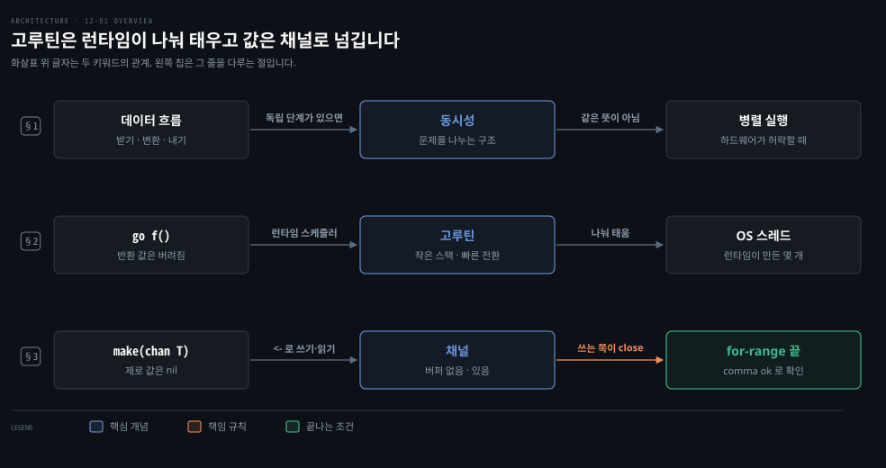
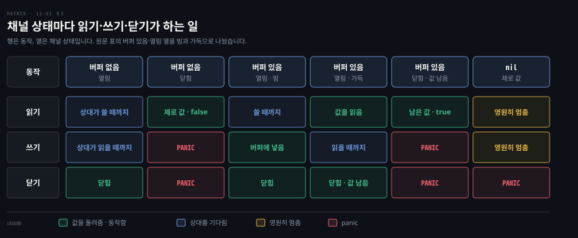

# 고루틴은 런타임이 나눠 돌리는 가벼운 스레드이고 채널로 값을 주고받습니다

---

> Learning Go 12장 앞 부분입니다. 동시성을 언제 쓸지 가리는 기준, Go 런타임이 관리하는 고루틴, 그리고 고루틴끼리 값을 주고받는 채널의 읽기·쓰기·버퍼·닫기와 상태별 동작을 다룹니다.

## 핵심 요약

> 이 편이 매달린 하나의 생각은 Go 의 동시성이 락으로 공유 메모리를 지키는 대신 고루틴 사이에 값을 채널로 넘기는 모델이라는 것입니다.

동시성은 병렬성이 아닙니다. 서로 기다릴 필요가 없는 단계가 있고 그 일이 I/O 처럼 오래 걸릴 때만 이득이 납니다. 확신이 없으면 순차 코드를 먼저 쓰고 벤치마크로 비교합니다.

고루틴은 Go 런타임이 OS 스레드 위에 나눠 태우는 가벼운 스레드입니다. 함수 호출 앞에 `go` 를 붙이면 시작되며 수만 개를 띄워도 됩니다. 고루틴끼리는 채널로 값을 주고받습니다. 버퍼 없는 채널은 상대가 올 때까지 기다립니다. 버퍼 있는 채널은 버퍼가 찰 때까지 기다리지 않습니다. 채널을 닫는 책임은 쓰는 쪽에 있습니다. 닫힌 채널을 읽으면 제로 값이 나오므로 comma ok 로 구별합니다.


## 학습 목표

> 이 편을 읽고 나면 아래 다섯 가지를 스스로 해낼 수 있습니다.

1. 동시성과 병렬성의 차이를 말하고, 동시성이 이득이 되는 조건 두 가지를 들 수 있습니다.
2. 고루틴이 OS 스레드보다 가벼운 이유를 네 가지 들 수 있습니다.
3. 비즈니스 로직을 고루틴 밖에 두고 클로저로 감싸는 관례가 무엇을 얻는지 말할 수 있습니다.
4. 버퍼 없는 채널과 버퍼 있는 채널이 언제 고루틴을 멈추는지 구별할 수 있습니다.
5. 닫힌 채널과 nil 채널을 읽고 쓰고 닫을 때 각각 무슨 일이 일어나는지 말할 수 있습니다.

아래는 이 편의 키워드를 이은 개념도입니다. 첫 줄은 데이터 흐름에 독립된 단계가 있을 때 동시성을 쓰고, 하드웨어가 허락할 때만 병렬로 돈다는 것입니다. 둘째 줄은 `go` 키워드로 시작한 고루틴을 런타임 스케줄러가 OS 스레드에 나눠 태우는 모습입니다. 셋째 줄은 채널을 만들고 값을 주고받다가 쓰는 쪽이 닫으면 읽는 쪽 루프가 끝나는 흐름입니다. 왼쪽 칩이 그 줄을 다루는 절입니다.




## 1. 동시성은 언제 쓰나 — 병렬성이 아니라 구조입니다

> 동시성은 하나의 프로세스를 독립된 부분으로 나누고 그 부분들이 데이터를 안전하게 나누는 방법을 정하는 일입니다. 더 많은 동시성이 더 빠른 속도를 뜻하지 않으니, 독립된 단계가 있고 그 일이 오래 걸릴 때만 씁니다.

원문은 **동시성**(concurrency)을 하나의 프로세스를 독립된 구성 요소로 나누고, 그 구성 요소들이 데이터를 안전하게 공유하는 방법을 정하는 일이라고 정의합니다. 대부분의 언어는 OS 수준 스레드와 락으로 동시성을 제공합니다. Go 의 주된 동시성 모델은 다릅니다. Quicksort 를 만든 Tony Hoare 가 1978년 논문에서 설명한 CSP(Communicating Sequential Processes)에 기반합니다. 원문은 CSP 로 구현한 패턴이 표준 방식만큼 강력하면서 훨씬 이해하기 쉽다고 말합니다.

원문은 먼저 경고부터 합니다. 동시성을 처음 써 보는 Go 개발자는 대개 이런 단계를 거친다고 합니다. 모든 것을 고루틴에 넣다가, 빨라지지 않아 채널에 버퍼를 붙이고, 교착 상태가 나자 버퍼를 아주 크게 키웁니다. 그래도 막히면 뮤텍스를 쓰다가 결국 동시성을 포기합니다.

사람들이 동시성에 끌리는 것은 동시 프로그램이 더 빠르다고 믿어서입니다. 하지만 원문은 동시성이 병렬성이 아니라는 점을 핵심으로 짚습니다. 동시성은 풀려는 문제를 더 잘 구조화하는 도구입니다. 동시 코드가 실제로 동시에, 곧 병렬로 도는지는 하드웨어와 알고리즘이 허락하는지에 달려 있습니다.

1967년 Gene Amdahl 이 유도한 암달의 법칙은 일의 얼마만큼이 순차로 돌아야 하는지에 따라 병렬 처리가 성능을 얼마나 올릴 수 있는지 계산합니다. 원문은 자세한 내용을 Clay Breshears 의 《The Art of Concurrency》에 맡기고, 여기서는 동시성이 늘어도 속도가 늘지는 않는다는 것만 알면 된다고 말합니다.

### 독립된 단계가 있고 오래 걸릴 때만 씁니다

넓게 보면 모든 프로그램은 데이터를 받아 변환하고 결과를 내는 세 단계를 거칩니다. 동시성을 쓸지는 데이터가 이 단계들을 어떻게 흐르는지에 달려 있습니다. 한 단계의 데이터가 다른 단계에 필요 없으면 두 단계는 동시에 돌 수 있습니다. 한 단계가 다른 단계의 출력에 기대면 차례로 돌아야 합니다. 원문은 독립적으로 도는 여러 작업의 데이터를 합치고 싶을 때 동시성을 쓰라고 말합니다.

동시에 도는 일이 오래 걸리지 않으면 동시성은 쓸 가치가 없습니다. 동시성에는 비용이 있습니다. 흔한 메모리 안 알고리즘은 워낙 빨라서, 동시성으로 값을 넘기는 부담이 병렬 실행으로 아낄 시간을 넘어섭니다. 그래서 동시 작업은 흔히 I/O 에 씁니다. 디스크나 네트워크를 읽고 쓰는 일은 아주 복잡한 메모리 안 처리를 빼면 수천 배 느립니다.

확신이 없으면 먼저 순차 코드를 쓴 뒤 동시 구현과 성능을 비교하는 벤치마크를 쓰라고 원문은 권합니다. 벤치마크는 15장의 「Using Benchmarks」 절에서 다루며, 장 번호는 노트가 찾아 붙였습니다.

원문의 예는 다른 웹 서비스 셋을 부르는 웹 서비스입니다. 두 서비스에 데이터를 보낸 뒤 그 두 결과를 셋째 서비스에 보내 결과를 돌려줍니다. 전체가 50밀리초 안에 끝나지 않으면 오류를 돌려줘야 합니다. 서로 기다리지 않는 I/O 부분과 결과를 합치는 부분이 있습니다. 실행 시간 제한도 있으니 동시성을 쓰기 좋은 경우입니다. 이 예는 12-04 §1 에서 구현합니다.


## 2. 고루틴 — 런타임이 관리하는 가벼운 스레드

> 고루틴은 Go 런타임이 관리하는 가벼운 스레드입니다. 런타임 스케줄러가 고루틴을 OS 스레드에 나눠 태우므로 생성과 전환이 빠르고 스택이 작아, 수만 개를 동시에 띄울 수 있습니다.

고루틴을 이해하려고 원문은 두 용어부터 정의합니다. **프로세스**는 운영 체제가 실행하는 프로그램의 인스턴스입니다. 운영 체제는 메모리 같은 자원을 프로세스에 묶어 다른 프로세스가 그 자원에 접근하지 못하게 합니다. 프로세스는 스레드 하나 이상으로 이루어집니다. **스레드**는 운영 체제가 실행 시간을 나눠 주는 실행 단위입니다. 한 프로세스 안의 스레드는 자원을 공유합니다. CPU 는 코어 수에 따라 스레드 하나 이상의 명령을 동시에 실행합니다.

**고루틴**(goroutine)은 Go 런타임이 관리하는 가벼운 스레드라고 생각하면 됩니다. Go 프로그램이 시작하면 런타임은 스레드 여러 개를 만들고, 프로그램을 돌릴 고루틴 하나를 띄웁니다. 처음 것을 포함해 프로그램이 만든 모든 고루틴은 Go 런타임 스케줄러가 이 스레드들에 자동으로 배정합니다. 운영 체제가 스레드를 CPU 코어에 배정하는 것과 같습니다.

운영 체제에 이미 스케줄러가 있으니 헛수고처럼 보일 수 있습니다. 원문은 이점이 넷이라고 말합니다.

- 고루틴 생성은 OS 수준 자원을 만들지 않으니 스레드 생성보다 빠릅니다.
- 고루틴의 처음 스택은 스레드 스택보다 작고 필요한 만큼 자랍니다. 그래서 메모리를 덜 씁니다.
- 고루틴 사이의 전환은 프로세스 안에서 끝나 비교적 느린 시스템 호출을 피하므로 스레드 전환보다 빠릅니다.
- 스케줄러가 Go 프로세스의 일부라서 더 나은 결정을 내립니다. 네트워크 폴러와 함께 I/O 에서 막힌 고루틴을 내려놓고, 가비지 컬렉터와 함께 일을 스레드들에 고르게 나눕니다.

덕분에 Go 프로그램은 고루틴을 수백, 수천, 수만 개까지 동시에 띄웁니다. 네이티브 스레드를 쓰는 언어에서 스레드를 수천 개 띄우면 프로그램이 기어가듯 느려진다고 원문은 말합니다. 스케줄러의 동작이 궁금하면 Kavya Joshi 의 GopherCon 2018 발표 「The Scheduler Saga」를 보라고 원문은 권합니다.

Java 21 의 가상 스레드도 JVM 이 적은 수의 플랫폼 스레드 위에 가벼운 스레드를 많이 태우는 같은 발상입니다. Spring Boot 3.2 부터 `spring.threads.virtual.enabled=true` 로 요청 처리에 쓸 수 있습니다. 이 비교는 원문 밖입니다.

### go 키워드로 띄우고 클로저로 감쌉니다

함수 호출 앞에 `go` 키워드를 붙이면 고루틴이 시작됩니다. 다른 함수처럼 매개변수로 상태를 넘길 수 있지만, 함수가 돌려주는 값은 버려집니다. 어떤 함수든 고루틴으로 띄울 수 있습니다. 원문은 함수를 `async` 로 선언해야만 비동기로 도는 JavaScript 와 다르다고 짚습니다.

Go 에서는 비즈니스 로직을 감싸는 클로저로 고루틴을 띄우는 것이 관례입니다. 동시성에 필요한 뒤치다꺼리는 클로저가 맡습니다.

```go
func process(val int) int {
	// do something with val
}

func processConcurrently(inVals []int) []int {
	// create the channels
	in := make(chan int, 5)
	out := make(chan int, 5)
	// launch processing goroutines
	for i := 0; i < 5; i++ {
		go func() {
			for val := range in {
				out <- process(val)
			}
		}()
	}
	// load the data into the in channel in another goroutine
	// read the data from the out channel
	// return the data
}
```

`processConcurrently` 가 만든 클로저는 채널에서 값을 읽어 `process` 에 넘긴 뒤 결과를 다른 채널에 씁니다. `process` 는 자기가 고루틴 안에서 도는지 전혀 모릅니다. 이렇게 책임을 나누면 프로그램이 모듈화되고 테스트하기 쉬워집니다. 동시성도 API 밖에 머뭅니다.

원문은 스레드 같은 모델을 고른 덕에 Go 가 Bob Nystrom 의 글 「What Color Is Your Function?」이 말한 "함수 색칠" 문제를 피한다고 말합니다. 비동기 함수와 동기 함수가 갈라지지 않는다는 뜻입니다. 저장소의 goroutine 예제는 1~20 을 두 배 한 `[2 4 6 ... 40]` 을 찍었습니다.


## 3. 채널 — 고루틴끼리 값을 넘기는 통로

> 채널은 `make` 로 만드는 내장 타입이고 map 처럼 참조 타입이라 제로 값은 nil 입니다. 버퍼 없는 채널은 상대 고루틴이 올 때까지 멈추고, 버퍼 있는 채널은 버퍼가 차거나 빌 때만 멈춥니다.

고루틴으로 띄운 함수가 돌려주는 값은 버려진다고 §2 에서 봤습니다. 그러면 고루틴이 계산한 결과는 어떻게 받아 올까요? 앞의 `processConcurrently` 가 이미 답을 썼습니다. 고루틴은 **채널**(channel)로 소통합니다. slice·map 처럼 채널도 `make` 로 만드는 내장 타입입니다.

```go
ch := make(chan int)
```

채널은 map 처럼 참조 타입입니다. 함수에 채널을 넘기면 사실은 채널을 가리키는 포인터를 넘깁니다. map·slice 처럼 채널의 제로 값도 `nil` 입니다. map 이 포인터라는 것은 06-02 §3 에서 다뤘습니다.

### <- 로 읽고 쓰고, 방향으로 한쪽만 허락합니다

채널은 `<-` 연산자로 다룹니다. 채널 변수 왼쪽에 두면 읽기, 오른쪽에 두면 쓰기입니다.

```go
a := <-ch // reads a value from ch and assigns it to a
ch <- b   // write the value in b to ch
```

채널에 쓴 값은 한 번만 읽힙니다. 여러 고루틴이 같은 채널을 읽으면 쓴 값 하나는 그중 하나만 읽습니다.

고루틴 하나가 같은 채널을 읽고 쓰는 일은 드뭅니다. 채널을 변수나 필드에 대입하거나 함수에 넘길 때 `chan` 앞에 화살표를 둔 `ch <-chan int` 는 읽기만 한다는 표시입니다. `chan` 뒤에 둔 `ch chan<- int` 는 쓰기만 한다는 표시입니다. 이렇게 하면 함수가 채널을 한 방향으로만 쓰는지 컴파일러가 보장합니다.

### 버퍼 없는 채널과 버퍼 있는 채널

채널은 기본으로 버퍼가 없습니다. 열린 버퍼 없는 채널에 쓰면 다른 고루틴이 같은 채널을 읽을 때까지 쓰는 고루틴이 멈춥니다. 읽기도 마찬가지로, 다른 고루틴이 쓸 때까지 읽는 고루틴이 멈춥니다. 그래서 버퍼 없는 채널은 동시에 도는 고루틴이 적어도 둘 있어야 읽고 쓸 수 있습니다.

버퍼 있는 채널은 정해진 수만큼의 쓰기를 막지 않고 담아 둡니다. 읽기 전에 버퍼가 차면 다음 쓰기는 누군가 읽을 때까지 멈춥니다. 빈 버퍼를 읽는 것도 멈춥니다. 버퍼 있는 채널은 만들 때 용량을 줍니다.

```go
ch := make(chan int, 10)
```

내장 함수 `len` 은 지금 버퍼에 든 값의 수를, `cap` 은 버퍼의 최대 크기를 알려 줍니다. 버퍼 용량은 바꿀 수 없습니다. 원문의 메모는 버퍼 없는 채널을 `len`·`cap` 에 넘기면 0 이 나온다고 말합니다. 이 노트의 재현도 `0 0` 이었습니다.

원문은 대개 버퍼 없는 채널을 쓰라고 말합니다. 버퍼 있는 채널이 쓸모 있는 경우는 12-03 §1 에서 다룹니다.

### for-range 로 닫힐 때까지 읽습니다

`for-range` 루프로도 채널을 읽습니다.

```go
for v := range ch {
	fmt.Println(v)
}
```

다른 `for-range` 와 달리 채널에는 변수가 값 하나뿐입니다. 채널이 열려 있고 값이 있으면 `v` 에 대입하고 본문을 실행합니다. 값이 없으면 값이 오거나 채널이 닫힐 때까지 고루틴이 멈춥니다. 루프는 채널이 닫히거나 `break`·`return` 을 만날 때까지 돕니다.

### 닫기는 쓰는 쪽의 책임이고 comma ok 로 확인합니다

채널에 다 썼으면 내장 함수 `close` 로 닫습니다. 닫힌 채널에 쓰거나 다시 닫으면 panic 이 납니다. 반면 닫힌 채널을 읽는 것은 늘 성공합니다. 버퍼에 읽지 않은 값이 남아 있으면 차례로 돌려줍니다. 버퍼가 없거나 비었으면 채널 타입의 제로 값을 돌려줍니다.

그러면 map 에서 본 것과 비슷한 질문이 생깁니다. 읽은 제로 값이 누가 쓴 값인지, 채널이 닫혀서 나온 값인지 어떻게 구별할까요? 원문은 Go 가 일관된 언어라서 익숙한 답이 있다고 말합니다. 03-02 에서 본 comma ok 관용구입니다.

```go
v, ok := <-ch
```

`ok` 가 `true` 면 채널이 열려 있고, `false` 면 닫혀 있습니다. 원문의 팁은 닫혔을 수 있는 채널을 읽을 때는 언제나 comma ok 로 확인하라고 합니다.

채널을 닫을 책임은 그 채널에 쓰는 고루틴에 있습니다. 닫기가 꼭 필요한 것은 `for-range` 처럼 채널이 닫히기를 기다리는 고루틴이 있을 때뿐입니다. 채널도 변수이므로, 더 이상 참조되지 않는 채널은 런타임이 찾아내 가비지 컬렉션합니다.

원문은 채널이 Go 의 동시성 모델을 돋보이게 하는 두 가지 가운데 하나라고 말합니다. 채널은 코드를 단계의 연속으로 생각하고 데이터 의존을 드러내게 이끕니다. 다른 언어는 스레드끼리 전역 공유 상태로 소통하는데, 바뀌는 공유 상태는 데이터 흐름을 가리고 두 스레드가 정말 독립인지 알기 어렵게 만듭니다. 나머지 하나인 `select` 는 12-02 §1 에서 다룹니다.

### 채널의 상태별 동작

채널에는 여러 상태가 있고, 상태마다 읽기·쓰기·닫기의 결과가 다릅니다. 원문은 이를 표 12-1 로 정리합니다. 아래 도식은 그 표를 이 노트의 go1.25.1 에서 여섯 상태로 나눠 직접 확인한 것입니다. 원문의 "버퍼 있음·열림" 열은 버퍼가 빈 경우와 찬 경우로 나눠 확인했습니다.



재현은 각 동작을 별도 고루틴에서 실행하고 100밀리초 안에 끝나는지, panic 이 나는지 봤습니다. 원문 표와 모든 칸이 맞았습니다. 버퍼에 7 을 넣고 닫은 채널은 `7 true` 를 먼저 돌려줬고, 그다음에야 제로 값과 `false` 를 돌려줍니다.

도식에는 값이 남은 경우만 그렸고, 다 비운 뒤의 모습은 버퍼 없는 닫힌 채널 열과 같습니다. 재현은 100밀리초 안에 끝나지 않으면 멈춘 것으로만 셌으니, 상대를 기다리는지와 영원히 멈추는지의 구분은 원문 표를 따른 것입니다.

원문은 Go 프로그램이 panic 하는 상황을 피해야 한다고 말합니다. 표준 패턴은 더 쓸 것이 없을 때 쓰는 고루틴이 채널을 닫는 것입니다. 여러 고루틴이 같은 채널에 쓰면 복잡해집니다. 같은 채널을 두 번 닫으면 panic 입니다. 한 고루틴이 닫은 채널에 다른 고루틴이 써도 panic 입니다. 이 문제는 12-03 §5 의 `sync.WaitGroup` 으로 풉니다. 영원히 멈추는 nil 채널도 위험하지만 쓸모 있는 곳이 있으며, 그것은 12-03 §3 에서 봅니다.


## 핵심 개념 체크리스트

목표 번호 순서대로 짝지었습니다.

- [ ] (목표 1) 동시성을 늘려도 속도가 늘지 않을 수 있는 이유를 말할 수 있습니까?
- [ ] (목표 1) 메모리 안에서 끝나는 짧은 계산을 고루틴으로 나누면 왜 느려질 수 있습니까?
- [ ] (목표 2) 고루틴이 OS 스레드보다 가벼운 이유 네 가지를 들 수 있습니까?
- [ ] (목표 3) `process` 함수가 자기가 고루틴 안에서 도는지 모르게 만들면 무엇이 좋습니까?
- [ ] (목표 4) 버퍼 없는 채널에 쓰는 고루틴은 언제까지 멈춥니까?
- [ ] (목표 5) 닫힌 채널에서 읽은 0 이 누가 쓴 값인지 어떻게 구별합니까?
- [ ] (목표 5) nil 채널을 닫으면 무슨 일이 일어납니까?


## 관련 문서

- [12-02 select 는 준비된 case 를 무작위로 고르고 고루틴은 반드시 끝나게 만듭니다](./12-02.select%20%EB%8A%94%20%EC%A4%80%EB%B9%84%EB%90%9C%20case%20%EB%A5%BC%20%EB%AC%B4%EC%9E%91%EC%9C%84%EB%A1%9C%20%EA%B3%A0%EB%A5%B4%EA%B3%A0%20%EA%B3%A0%EB%A3%A8%ED%8B%B4%EC%9D%80%20%EB%B0%98%EB%93%9C%EC%8B%9C%20%EB%81%9D%EB%82%98%EA%B2%8C%20%EB%A7%8C%EB%93%AD%EB%8B%88%EB%8B%A4.md) — 12장 둘째. select 와 고루틴 정리
- [03-02 문자열은 바이트이고 map 은 없는 키에 제로 값을 돌려줍니다](./03-02.%EB%AC%B8%EC%9E%90%EC%97%B4%EC%9D%80%20%EB%B0%94%EC%9D%B4%ED%8A%B8%EC%9D%B4%EA%B3%A0%20map%20%EC%9D%80%20%EC%97%86%EB%8A%94%20%ED%82%A4%EC%97%90%20%EC%A0%9C%EB%A1%9C%20%EA%B0%92%EC%9D%84%20%EB%8F%8C%EB%A0%A4%EC%A4%8D%EB%8B%88%EB%8B%A4.md) — 3장. comma ok 관용구
- [05-02 함수는 값이고 클로저는 바깥 변수를 붙잡습니다](./05-02.%ED%95%A8%EC%88%98%EB%8A%94%20%EA%B0%92%EC%9D%B4%EA%B3%A0%20%ED%81%B4%EB%A1%9C%EC%A0%80%EB%8A%94%20%EB%B0%94%EA%B9%A5%20%EB%B3%80%EC%88%98%EB%A5%BC%20%EB%B6%99%EC%9E%A1%EC%8A%B5%EB%8B%88%EB%8B%A4.md) — 5장. 클로저
- [Learning Go 2판 — 정독 인덱스](./README.md) — 16장 전체 지도


## 참고 자료

- 원본: 《Learning Go, 2nd Edition》 (Jon Bodner, O'Reilly)
- 다룬 범위: Chapter 12 도입부터 "Understanding How Channels Behave" 까지
- 원서 예제 저장소: [learning-go-book-2e/ch12](https://github.com/learning-go-book-2e/ch12) — 이 노트는 Go 모듈 프록시에서 받은 2023-08-28 커밋으로 돌렸습니다
- [The Scheduler Saga — Kavya Joshi, GopherCon 2018](https://www.youtube.com/watch?v=YHRO5WQGh0k)
- [What Color Is Your Function? — Bob Nystrom](https://journal.stuffwithstuff.com/2015/02/01/what-color-is-your-function/)
- [Go 언어 명세 — Channel types](https://go.dev/ref/spec#Channel_types)
