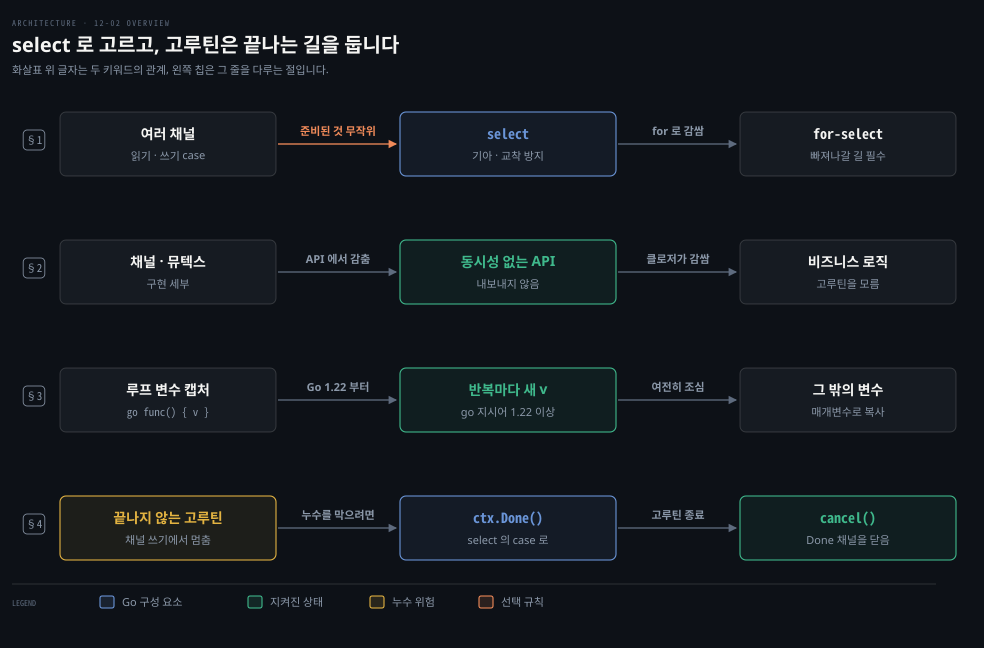
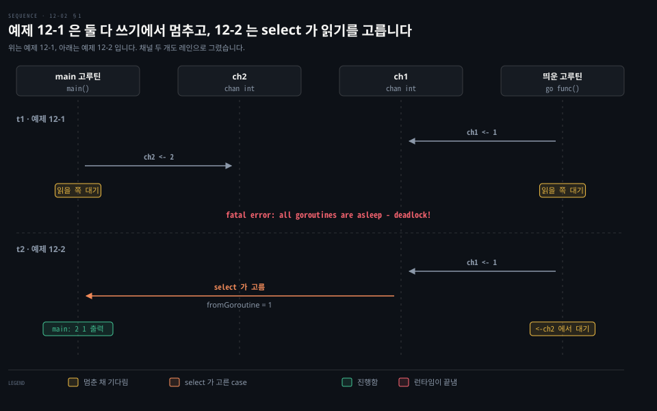

# select 는 준비된 case 를 무작위로 고르고 고루틴은 반드시 끝나게 만듭니다

---

> Learning Go 12장 둘째 부분입니다. 여러 채널 가운데 진행할 수 있는 것을 고르는 `select`, 교착 상태와 for-select 루프, 동시성을 API 밖에 두는 원칙, 루프 변수를 캡처하는 고루틴, 그리고 고루틴 누수와 context 로 고루틴을 끝내는 법을 다룹니다.

## 핵심 요약

> 이 편이 매달린 하나의 생각은 고루틴이 어느 채널에서 기다릴지를 `select` 로 고르게 하고, 모든 고루틴에 끝나는 길을 만들어 두어야 한다는 것입니다.

`select` 는 여러 채널 읽기·쓰기 가운데 진행할 수 있는 case 를 무작위로 골라 실행합니다. 순서에 기대지 않으니 한 case 만 굶기는 기아가 없습니다. 락을 다른 순서로 잡아 생기는 교착도 막습니다. 흔히 `for` 로 감싼 for-select 루프로 쓰며, 빠져나갈 길을 꼭 둡니다.

동시성은 구현 세부라서 채널과 뮤텍스를 API 에 내보내지 않습니다. Go 1.22 부터는 고루틴이 루프 변수를 캡처해도 반복마다 새 변수를 봅니다. 런타임은 끝나지 않을 고루틴을 찾아내지 못하므로, 멈춘 고루틴은 누수가 됩니다. context 의 `Done` 채널을 `select` 에 넣고 `cancel` 을 부르면 고루틴을 끝낼 수 있습니다.


## 학습 목표

> 이 편을 읽고 나면 아래 다섯 가지를 스스로 해낼 수 있습니다.

1. `select` 가 case 를 고르는 규칙이 `switch` 와 어떻게 다른지, 그 규칙이 기아와 교착을 어떻게 막는지 말할 수 있습니다.
2. 예제 12-1 이 교착에 빠지는 이유와 예제 12-2 가 그것을 피하는 방법을 말할 수 있습니다.
3. for-select 루프에 `default` 를 두면 안 되는 이유를 말할 수 있습니다.
4. Go 1.21 이하에서 루프 변수를 캡처한 고루틴이 모두 같은 값을 보는 이유와 두 가지 우회법을 말할 수 있습니다.
5. 고루틴 누수가 무엇이고, context 취소로 그것을 막는 코드를 읽을 수 있습니다.

아래는 이 편의 키워드를 이은 개념도입니다. 첫 줄은 `select` 가 준비된 case 를 무작위로 골라 기아와 교착을 피하고, `for` 로 감싸 for-select 루프가 되는 흐름입니다. 둘째 줄은 채널과 뮤텍스를 내보내지 않고 클로저가 비즈니스 로직을 감싸 동시성을 API 밖에 두는 원칙입니다. 셋째 줄은 Go 1.22 부터 반복마다 새로 생기는 루프 변수입니다. 넷째 줄은 끝나지 않는 고루틴이 누수가 되고 context 취소가 그것을 끝내는 흐름입니다. 왼쪽 칩이 그 줄을 다루는 절입니다.




## 1. select — 진행할 수 있는 case 를 무작위로 고릅니다

> 두 동시 작업을 모두 할 수 있을 때 어느 것을 먼저 할지가 문제입니다. `select` 는 읽기·쓰기가 가능한 case 가운데 하나를 무작위로 골라, 한 case 만 굶는 기아를 막고 교착을 피하게 돕습니다.

원문은 `select` 문이 Go 의 동시성 모델을 돋보이게 하는 나머지 하나라고 말합니다. `select` 는 Go 에서 동시성을 위한 제어 구조입니다. 동시 작업 두 개를 모두 할 수 있을 때 무엇부터 할까요? 한 작업만 계속 편들면 어떤 case 는 영영 처리되지 않습니다. 이것을 **기아**(starvation)라고 합니다.

`select` 키워드는 고루틴이 여러 채널 가운데 하나를 읽거나 쓰게 합니다. 모양은 빈 `switch` 문과 아주 닮았습니다.

```go
select {
case v := <-ch:
	fmt.Println(v)
case v := <-ch2:
	fmt.Println(v)
case ch3 <- x:
	fmt.Println("wrote", x)
case <-ch4:
	fmt.Println("got value on ch4, but ignored it")
}
```

`select` 의 각 case 는 채널 하나에 대한 읽기나 쓰기입니다. 어떤 case 의 읽기나 쓰기가 가능하면 그것을 실행하고 case 본문을 실행합니다. `switch` 처럼 `select` 의 각 case 도 자기 블록을 만듭니다.

여러 case 가 동시에 가능하면 어떻게 될까요? 원문은 알고리즘이 단순하다고 말합니다. 진행할 수 있는 case 가운데 무작위로 고르며, 순서는 상관없습니다. 참이 되는 첫 case 를 늘 고르는 `switch` 와 아주 다릅니다. 어떤 case 도 편들지 않고 모두를 동시에 보니 기아 문제도 깔끔히 풀립니다.

### 교착 상태와 select

무작위 선택의 또 다른 이점은 교착의 가장 흔한 원인 하나를 막는다는 것입니다. 원문은 그 원인을 락을 일관되지 않은 순서로 잡는 것이라고 말합니다. 두 고루틴이 같은 두 채널에 접근하면 두 고루틴에서 같은 순서로 접근해야 합니다. 그러지 않으면 서로를 기다리느라 둘 다 진행하지 못하는 **교착 상태**(deadlock)에 빠집니다. 앱의 모든 고루틴이 교착되면 Go 런타임이 프로그램을 죽입니다.

```go
// 예제 12-1
func main() {
	ch1 := make(chan int)
	ch2 := make(chan int)
	go func() {
		inGoroutine := 1
		ch1 <- inGoroutine
		fromMain := <-ch2
		fmt.Println("goroutine:", inGoroutine, fromMain)
	}()
	inMain := 2
	ch2 <- inMain
	fromGoroutine := <-ch1
	fmt.Println("main:", inMain, fromGoroutine)
}
```

```bash
fatal error: all goroutines are asleep - deadlock!
```

`main` 도 시작할 때 Go 런타임이 띄운 고루틴 위에서 돈다는 것을 기억합니다. 명시적으로 띄운 고루틴은 누군가 `ch1` 을 읽을 때까지 진행하지 못합니다. main 고루틴은 누군가 `ch2` 를 읽을 때까지 진행하지 못합니다. 이 노트의 재현에서는 오류 아래에 두 고루틴이 모두 `[chan send]` 상태로 멈춘 스택이 함께 찍혔습니다.

main 고루틴의 채널 쓰기와 읽기를 `select` 로 감싸면 교착을 피합니다.

```go
// 예제 12-2 의 main 고루틴 부분
inMain := 2
var fromGoroutine int
select {
case ch2 <- inMain:
case fromGoroutine = <-ch1:
}
fmt.Println("main:", inMain, fromGoroutine)
```

```bash
main: 2 1
```

`select` 는 진행할 수 있는 case 가 있는지 보니 교착이 생기지 않습니다. 원문은 띄운 고루틴이 `ch1` 에 1 을 썼다고 표현합니다. 정확히는 버퍼 없는 `ch1` 에 쓰려고 그 고루틴이 기다리고 있어서 `ch1` 을 읽는 case 가 곧바로 성공합니다. 아래 도식은 두 예제에서 두 고루틴이 어디서 멈추는지 나란히 보입니다.



원문은 이 프로그램이 교착은 없어도 아직 옳지 않다고 짚습니다. 띄운 고루틴의 `fmt.Println` 은 실행되지 않습니다. 그 고루틴은 `ch2` 에서 읽을 값을 기다리며 멈춰 있기 때문입니다. main 고루틴이 끝나면 프로그램이 끝나며 남은 고루틴을 모두 죽이니, 기술적으로는 멈춤이 풀립니다. 그래도 모든 고루틴이 제대로 끝나게 해서 누수를 막아야 하며, 이것은 §4 에서 다룹니다.

저장소의 select 예제는 원문의 예제 12-2 와 변수 이름이 다르고 `main:` 접두어 없이 `2 1` 을 찍었습니다. 원문 코드를 그대로 옮겨 돌리니 `main: 2 1` 이 나왔습니다.

### for-select 루프와 default

`select` 는 여러 채널로 소통하는 일을 맡으니 흔히 `for` 루프 안에 넣습니다.

```go
for {
	select {
	case <-done:
		return
	case v := <-ch:
		fmt.Println(v)
	}
}
```

워낙 흔해서 이 조합을 **for-select 루프**라고 부릅니다. for-select 루프를 쓸 때는 루프를 빠져나갈 길을 꼭 둡니다. 한 방법은 §4 에서 봅니다.

`switch` 처럼 `select` 에도 `default` 절을 둘 수 있습니다. 읽거나 쓸 수 있는 case 가 없을 때 `default` 가 선택됩니다. 채널을 막히지 않게 읽거나 쓰고 싶으면 `default` 가 있는 `select` 를 씁니다. 다음 코드는 `ch` 에 읽을 값이 없으면 기다리지 않고 바로 `default` 본문을 실행합니다.

```go
select {
case v := <-ch:
	fmt.Println("read from ch:", v)
default:
	fmt.Println("no value written to ch")
}
```

`default` 를 쓰는 예는 12-03 §2 의 백프레셔에서 봅니다. 원문의 메모는 for-select 루프 안에 `default` 를 두는 것이 거의 늘 잘못이라고 말합니다. 어느 case 도 읽거나 쓸 것이 없을 때마다 `default` 가 걸려 루프가 쉬지 않고 돕니다. 그래서 CPU 를 아주 많이 씁니다.


## 2. 동시성은 API 에서 감춥니다

> 동시성은 구현 세부입니다. 채널이나 뮤텍스를 API 의 타입·함수·메서드에 내보내면 채널 관리의 책임과 교착의 위험이 사용자에게 넘어갑니다.

원문은 여기서부터 동시성 모범 관례와 패턴을 봅니다. 첫째는 API 를 동시성 없이 두는 것입니다. 동시성은 구현 세부이고, 좋은 API 설계는 구현 세부를 되도록 감춥니다. 그래야 호출하는 방법을 바꾸지 않고 동작 방식을 바꿀 수 있습니다.

실제로는 API 의 타입·함수·메서드에 채널이나 뮤텍스를 절대 드러내지 말라는 뜻입니다. 채널을 드러내면 채널 관리 책임이 API 사용자에게 넘어갑니다. 사용자는 채널에 버퍼가 있는지, 닫혔는지, nil 인지를 걱정해야 합니다. 채널이나 뮤텍스를 예상 밖의 순서로 건드려 교착을 일으킬 수도 있습니다. 뮤텍스는 12-04 §2 에서 다룹니다.

원문의 메모는 이것이 채널을 함수 매개변수나 struct 필드로 절대 쓰지 말라는 뜻은 아니라고 말합니다. 내보내지 말라는 뜻입니다. 예외도 있습니다. 동시성 도우미 함수를 제공하는 라이브러리라면 채널이 API 에 들어갈 수밖에 없습니다.

Java 에서 공개 메서드가 `BlockingQueue` 를 매개변수로 받게 하기보다 `CompletableFuture` 를 돌려주거나 내부에서 실행기를 관리하는 쪽을 택하는 것과 같은 판단입니다. 이 비교는 원문 밖입니다.


## 3. 고루틴과 for 루프 변수 — Go 1.22 가 바꾼 것

> Go 1.21 이하에서는 루프의 인덱스·값 변수를 반복마다 재사용해서, 그 변수를 캡처한 고루틴들이 모두 마지막 값을 봤습니다. Go 1.22 부터는 반복마다 새 변수를 만들며, 그 밖의 바뀌는 변수는 여전히 복사해 넘겨야 합니다.

고루틴을 띄우는 클로저는 대개 매개변수가 없고, 선언된 환경의 값을 캡처합니다. Go 1.22 전에는 이것이 통하지 않는 흔한 경우가 하나 있었습니다. `for` 루프의 인덱스나 값을 캡처할 때입니다. 04-02 §3 과 10-01 §3 에서 본 대로 Go 1.22 는 하위 호환을 깨는 변경으로, 반복마다 인덱스와 값 변수를 새로 만들게 바꿨습니다.

원문은 이 변경이 왜 가치가 있었는지 다음 코드로 보입니다. 이 코드는 Learning Go 2판 GitHub 조직의 goroutine_for_loop 저장소에 있습니다. Go 1.21 이하에서 돌리거나, 1.22 이상이라도 go.mod 의 `go` 지시어가 1.21 이하면 미묘한 버그가 보입니다.

```go
func main() {
	a := []int{2, 4, 6, 8, 10}
	ch := make(chan int, len(a))
	for _, v := range a {
		go func() {
			ch <- v * 2
		}()
	}
	for i := 0; i < len(a); i++ {
		fmt.Println(<-ch)
	}
}
```

값마다 고루틴을 하나씩 띄우니 고루틴마다 다른 값이 넘어가는 것처럼 보입니다. 하지만 옛 버전에서는 다섯 번 모두 20 이 찍힙니다. 모든 고루틴의 클로저가 같은 변수를 캡처했기 때문입니다. 루프 변수는 반복마다 재사용되었고, `v` 에 마지막으로 대입된 값이 10 이라 고루틴들이 돌 때 그 값을 봅니다.

Go 1.22 이상으로 올리고 `go` 지시어도 1.22 이상으로 바꾸면 반복마다 새 변수가 생겨 기대한 결과가 나옵니다. 원문 출력은 `20 8 4 12 16` 처럼 고루틴이 끝나는 순서대로 섞여 나옵니다. 이 노트의 go1.25.1 에서 `go 1.21` 로 두 번 돌리니 두 번 다 `20 20 20 20 20` 이었습니다. `go 1.25` 로 바꾸니 `4 8 12 16 20` 처럼 서로 다른 다섯 값이 나왔고, 순서는 실행마다 달랐습니다.

### 1.22 로 못 올리면 복사해서 넘깁니다

Go 1.22 로 올릴 수 없다면 두 방법이 있습니다. 첫째는 루프 안에서 값을 가려 복사본을 만드는 것입니다.

```go
for _, v := range a {
	v := v
	go func() {
		ch <- v * 2
	}()
}
```

가림을 피하고 데이터 흐름을 더 분명히 하려면 값을 고루틴의 매개변수로 넘깁니다.

```go
for _, v := range a {
	go func(val int) {
		ch <- val * 2
	}(v)
}
```

Go 1.22 가 막아 주는 것은 `for` 루프의 인덱스·값 변수뿐입니다. 클로저가 캡처하는 다른 변수는 여전히 조심해야 합니다. 값이 바뀔 수 있는 변수에 클로저가 기댄다면, 고루틴이든 아니든 그 값을 클로저에 넘기거나 클로저마다 변수의 복사본이 생기게 합니다. 원문의 팁도 같은 말을 합니다. 값이 바뀔 수 있는 변수를 클로저가 쓰면, 매개변수로 그 순간의 값을 복사해 넘기라고 합니다.


## 4. 고루틴은 반드시 끝나게 만듭니다

> 런타임은 다시 쓰이지 않을 고루틴을 찾아내지 못합니다. 끝나지 않는 고루틴의 스택과 그것이 붙잡은 힙은 회수되지 않으니, context 의 `Done` 채널로 고루틴에 멈추라고 알립니다.

고루틴 함수를 띄울 때마다 그것이 결국 끝나게 해야 합니다. 변수와 달리 Go 런타임은 고루틴이 다시 쓰이지 않을지를 알아내지 못합니다. 고루틴이 끝나지 않으면 그 스택의 변수에 할당한 메모리가 그대로 남습니다. 그 스택 변수에서 이어지는 힙 메모리도 가비지 컬렉션되지 않습니다. 이것을 **고루틴 누수**(goroutine leak)라고 합니다.

고루틴이 끝난다는 보장이 없다는 것은 잘 드러나지 않습니다. 원문의 예는 고루틴을 생성기처럼 쓴 코드입니다.

```go
func countTo(max int) <-chan int {
	ch := make(chan int)
	go func() {
		for i := 0; i < max; i++ {
			ch <- i
		}
		close(ch)
	}()
	return ch
}

func main() {
	for i := range countTo(10) {
		if i > 5 {
			break
		}
		fmt.Println(i)
	}
}
```

원문의 메모는 이것이 짧은 예일 뿐이라고 말합니다. 숫자 목록을 만드는 데 고루틴을 쓰면 너무 단순한 작업이라 12-01 §1 의 기준을 어깁니다. 값을 모두 쓰는 흔한 경우에는 고루틴이 끝납니다. 하지만 위처럼 루프를 일찍 빠져나오면, 고루틴은 채널에서 누가 읽어 가기를 기다리며 영원히 멈춥니다.

### context 로 고루틴에 멈추라고 알립니다

`countTo` 의 누수를 고치려면 고루틴에 이제 멈추라고 알릴 방법이 필요합니다. Go 에서는 context 로 풉니다. 저장소의 context_cancel 예제입니다.

```go
func countTo(ctx context.Context, max int) <-chan int {
	ch := make(chan int)
	go func() {
		defer close(ch)
		for i := 0; i < max; i++ {
			select {
			case <-ctx.Done():
				return
			case ch <- i:
			}
		}
	}()
	return ch
}

func main() {
	ctx, cancel := context.WithCancel(context.Background())
	defer cancel()
	ch := countTo(ctx, 10)
	for i := range ch {
		if i > 5 {
			break
		}
		fmt.Println(i)
	}
}
```

`countTo` 는 `max` 말고도 `context.Context` 를 받습니다. 고루틴 안의 `for` 루프는 case 가 둘인 for-select 루프가 됩니다. 한 case 는 `ch` 에 쓰기를 시도합니다. 다른 case 는 context 의 `Done` 메서드가 돌려준 채널을 봅니다. 그 채널이 값을 돌려주면 for-select 루프와 고루틴을 빠져나갑니다.

> **원문 정오**: 원문은 이 코드로 "모든 값을 읽을 때(when every value is read)" 고루틴이 새는 것을 막을 수 있게 되었다고 적었습니다. 하지만 바로 앞에서 원문이 설명한 누수는 루프를 일찍 빠져나와 모든 값을 읽지 않을 때 생깁니다. 값을 모두 읽으면 옛 `countTo` 도 끝납니다. 그러니 "모든 값을 읽지 않을 때" 가 맞습니다. 책 16장 전체에서 이 문구는 이 한 곳에만 나옵니다.

그러면 `Done` 채널이 값을 돌려주게 하는 것은 무엇일까요? context 취소입니다. `main` 은 `context` 패키지의 `WithCancel` 로 context 와 취소 함수를 만들고, `defer` 로 `main` 이 끝날 때 `cancel` 을 부릅니다. `cancel` 은 `Done` 이 돌려준 채널을 닫습니다. 닫힌 채널은 늘 값을 돌려주므로 `countTo` 를 도는 고루틴이 끝납니다.

이 노트를 쓰면서 `runtime.NumGoroutine` 으로 고루틴 수를 셌습니다. 시작할 때 1 이었고, 옛 `countTo` 에서 일찍 빠져나온 뒤에는 2 가 되었습니다. 멈춘 고루틴 하나가 남은 것입니다. 이어서 context 판을 같은 방식으로 돌리고 `cancel` 한 뒤에도 2 였습니다. 새 누수가 없고 먼저 샌 하나만 남았다는 뜻입니다. 이 재현은 원문 밖입니다.

원문은 context 로 고루틴을 끝내는 것이 아주 흔한 패턴이라고 말합니다. 호출 스택의 앞쪽 함수에서 온 신호로 고루틴을 멈출 수 있기 때문입니다. 14장의 「Cancellation」 절에서 context 로 고루틴 여럿에 멈추라고 알리는 법을 자세히 본다고 원문은 예고합니다. 장 번호는 노트가 찾아 붙였습니다.

Spring 에서 `Future` 를 돌려주는 `@Async` 작업을 `cancel(true)` 로 멈추면 스레드에 인터럽트를 보냅니다. 작업이 인터럽트를 확인하지 않으면 계속 돕니다. `CompletableFuture` 의 `cancel(true)` 는 인터럽트조차 보내지 않습니다. Go 의 context 취소도 같은 협력 방식이라, 고루틴이 `Done` 을 `select` 로 확인해야만 멈춥니다. 이 비교는 원문 밖입니다.


## 핵심 개념 체크리스트

목표 번호 순서대로 짝지었습니다.

- [ ] (목표 1) 두 case 가 동시에 준비되면 `select` 와 `switch` 는 각각 무엇을 고릅니까?
- [ ] (목표 1) 무작위 선택이 락 순서 문제로 생기는 교착을 어떻게 피하게 합니까?
- [ ] (목표 2) 예제 12-1 에서 두 고루틴은 각각 무엇을 기다리며 멈춥니까?
- [ ] (목표 2) 예제 12-2 가 교착은 피하지만 여전히 옳지 않은 이유는 무엇입니까?
- [ ] (목표 3) for-select 루프에 `default` 를 두면 CPU 사용량이 어떻게 됩니까?
- [ ] (목표 4) go.mod 의 `go` 지시어를 1.21 로 두면 go1.25 로 빌드해도 루프 변수 동작이 옛날식인 이유는 무엇입니까?
- [ ] (목표 5) 옛 `countTo` 에서 `i > 5` 일 때 `break` 하면 생산자 고루틴은 어디서 멈춥니까?
- [ ] (목표 5) `cancel` 을 부르면 `ctx.Done()` 을 기다리던 case 가 왜 바로 실행됩니까?


## 관련 문서

- [12-01 고루틴은 런타임이 나눠 돌리는 가벼운 스레드이고 채널로 값을 주고받습니다](./12-01.%EA%B3%A0%EB%A3%A8%ED%8B%B4%EC%9D%80%20%EB%9F%B0%ED%83%80%EC%9E%84%EC%9D%B4%20%EB%82%98%EB%88%A0%20%EB%8F%8C%EB%A6%AC%EB%8A%94%20%EA%B0%80%EB%B2%BC%EC%9A%B4%20%EC%8A%A4%EB%A0%88%EB%93%9C%EC%9D%B4%EA%B3%A0%20%EC%B1%84%EB%84%90%EB%A1%9C%20%EA%B0%92%EC%9D%84%20%EC%A3%BC%EA%B3%A0%EB%B0%9B%EC%8A%B5%EB%8B%88%EB%8B%A4.md) — 12장 첫째. 고루틴과 채널
- [12-03 버퍼 채널은 개수를 알 때 쓰고 WaitGroup 과 Once 가 기다림과 한 번 실행을 맡습니다](./12-03.%EB%B2%84%ED%8D%BC%20%EC%B1%84%EB%84%90%EC%9D%80%20%EA%B0%9C%EC%88%98%EB%A5%BC%20%EC%95%8C%20%EB%95%8C%20%EC%93%B0%EA%B3%A0%20WaitGroup%20%EA%B3%BC%20Once%20%EA%B0%80%20%EA%B8%B0%EB%8B%A4%EB%A6%BC%EA%B3%BC%20%ED%95%9C%20%EB%B2%88%20%EC%8B%A4%ED%96%89%EC%9D%84%20%EB%A7%A1%EC%8A%B5%EB%8B%88%EB%8B%A4.md) — 12장 셋째. 동시성 패턴
- [04-02 for 하나로 네 가지 반복을 씁니다](./04-02.for%20%ED%95%98%EB%82%98%EB%A1%9C%20%EB%84%A4%20%EA%B0%80%EC%A7%80%20%EB%B0%98%EB%B3%B5%EC%9D%84%20%EC%94%81%EB%8B%88%EB%8B%A4.md) — 4장. Go 1.22 루프 변수
- [10-01 모듈은 go.mod 로 한 단위가 되고 go 지시어가 빌드할 Go 버전을 정합니다](./10-01.%EB%AA%A8%EB%93%88%EC%9D%80%20go.mod%20%EB%A1%9C%20%ED%95%9C%20%EB%8B%A8%EC%9C%84%EA%B0%80%20%EB%90%98%EA%B3%A0%20go%20%EC%A7%80%EC%8B%9C%EC%96%B4%EA%B0%80%20%EB%B9%8C%EB%93%9C%ED%95%A0%20Go%20%EB%B2%84%EC%A0%84%EC%9D%84%20%EC%A0%95%ED%95%A9%EB%8B%88%EB%8B%A4.md) — 10장. go 지시어와 언어 동작
- [Learning Go 2판 — 정독 인덱스](./README.md) — 16장 전체 지도


## 참고 자료

- 원본: 《Learning Go, 2nd Edition》 (Jon Bodner, O'Reilly)
- 다룬 범위: Chapter 12 "select" 부터 "Use the Context to Terminate Goroutines" 까지
- [Go 언어 명세 — Select statements](https://go.dev/ref/spec#Select_statements)
- [Fixing For Loops in Go 1.22](https://go.dev/blog/loopvar-preview) — 루프 변수 변경의 배경
- [context 패키지](https://pkg.go.dev/context)
