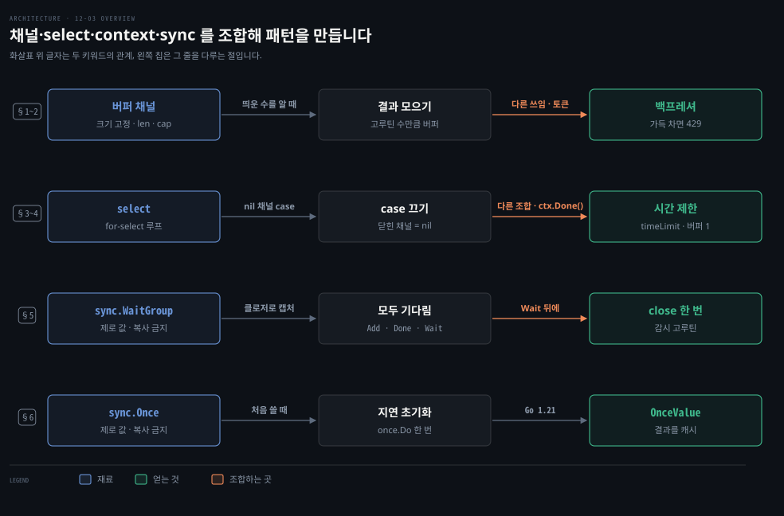
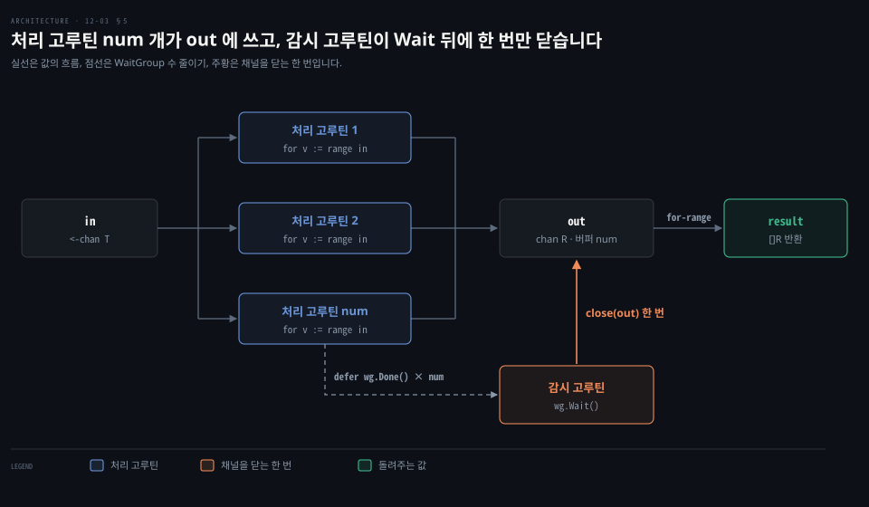

# 버퍼 채널은 개수를 알 때 쓰고 WaitGroup 과 Once 가 기다림과 한 번 실행을 맡습니다

---

> Learning Go 12장 셋째 부분입니다. 버퍼 채널을 쓸 때와 백프레셔, nil 채널로 `select` 의 case 를 끄는 법, 시간 제한을 거는 관용구, 여러 고루틴을 기다리는 `sync.WaitGroup`, 그리고 한 번만 실행하는 `sync.Once` 와 Go 1.21 의 `sync.OnceValue` 를 다룹니다.

## 핵심 요약

> 이 편이 매달린 하나의 생각은 Go 의 동시성 패턴이 새 기능이 아니라 채널·`select`·context·`sync` 의 작은 조각을 조합해 만들어진다는 것입니다.

버퍼 채널은 띄운 고루틴 수를 알 때, 고루틴 수를 제한할 때, 쌓이는 일의 양을 제한할 때 씁니다. 크기가 정해진 버퍼와 `select` 의 `default` 를 묶으면, 넘치는 요청을 거절하는 백프레셔가 됩니다. 닫힌 채널의 case 는 채널 변수를 nil 로 바꿔 끄고, 시간 제한은 `context.WithTimeout` 의 `Done` 채널을 `select` 에 넣어 겁니다.

여러 고루틴을 기다릴 때는 `sync.WaitGroup` 을 씁니다. 여러 고루틴이 쓰는 채널을 한 번만 닫는 데 특히 쓸모 있습니다. 느린 초기화를 한 번만 하려면 `sync.Once`, 결과까지 캐시하려면 Go 1.21 의 `sync.OnceValue` 를 씁니다. WaitGroup·Once 는 제로 값 그대로 쓰고, 복사하면 안 됩니다.


## 학습 목표

> 이 편을 읽고 나면 아래 다섯 가지를 스스로 해낼 수 있습니다.

1. 버퍼 채널이 쓸모 있는 세 경우를 들고, 결과를 모으는 코드에서 버퍼 크기를 왜 고루틴 수로 정하는지 말할 수 있습니다.
2. `PressureGauge` 가 버퍼 채널과 `default` 로 동시 요청 수를 제한하는 원리를 설명할 수 있습니다.
3. 닫힌 채널의 case 를 nil 채널로 끄는 이유와 방법을 말할 수 있습니다.
4. `timeLimit` 이 버퍼 크기 1 채널을 쓰는 이유와, 시간이 넘어도 작업 고루틴이 계속 도는 이유를 말할 수 있습니다.
5. `sync.WaitGroup` 으로 채널을 한 번만 닫는 코드와 `sync.OnceValue` 로 초기화를 캐시하는 코드를 쓸 수 있습니다.

아래는 이 편의 키워드를 이은 개념도입니다. 첫 줄은 버퍼 채널이 결과 모으기와 백프레셔의 재료가 되는 모습입니다. 둘째 줄은 `select` 에 nil 채널을 넣어 case 를 끄고, `ctx.Done()` 을 넣어 시간 제한을 거는 두 조합입니다. 셋째 줄은 `WaitGroup` 이 모든 고루틴을 기다린 뒤 채널을 한 번만 닫는 흐름입니다. 넷째 줄은 `Once` 와 `OnceValue` 가 초기화를 한 번만 하고 결과를 캐시하는 흐름입니다. 왼쪽 칩이 그 줄을 다루는 절입니다.




## 1. 버퍼 채널은 개수를 알거나 제한할 때 씁니다

> 버퍼 없는 채널은 이어달리기의 바통처럼 이해하기 쉽지만, 버퍼 채널은 크기를 골라야 하고 가득 찼을 때를 다뤄야 합니다. 띄운 고루틴 수를 알 때, 고루틴 수나 쌓이는 일을 제한할 때만 씁니다.

원문은 버퍼 채널을 언제 쓸지 정하는 것이 Go 동시성에서 익히기 가장 어려운 기법 가운데 하나라고 말합니다. 채널은 기본으로 버퍼가 없고 이해하기 쉽습니다. 한 고루틴이 쓰고, 다른 고루틴이 그 일을 받아 갈 때까지 기다립니다. 원문은 이어달리기의 바통 같다고 합니다.

버퍼 채널은 훨씬 복잡합니다. 버퍼가 무한일 수 없으니 크기를 골라야 합니다. 버퍼가 차서 쓰는 고루틴이 읽는 고루틴을 기다리는 경우도 다뤄야 합니다. 원문은 한 문장으로 이렇게 정리합니다. 버퍼 채널은 띄운 고루틴 수를 알 때, 띄울 고루틴 수를 제한하고 싶을 때, 쌓이는 일의 양을 제한하고 싶을 때 쓸모 있습니다.

원문의 첫 예는 채널의 처음 결과 10개를 처리하는 코드입니다. 고루틴 10개를 띄우고, 각 고루틴이 결과를 버퍼 채널에 씁니다.

```go
func processChannel(ch chan int) []int {
	const conc = 10
	results := make(chan int, conc)
	for i := 0; i < conc; i++ {
		go func() {
			v := <-ch
			results <- process(v)
		}()
	}
	var out []int
	for i := 0; i < conc; i++ {
		out = append(out, <-results)
	}
	return out
}
```

띄운 고루틴 수를 정확히 알며 각 고루틴이 일을 마치자마자 끝나기를 원합니다. 그래서 고루틴마다 한 칸씩 버퍼를 만들면, 각 고루틴이 막히지 않고 결과를 쓰고 끝납니다. 버퍼에서 값을 모두 읽으면 결과를 돌려줍니다. 새는 고루틴이 없다는 것도 압니다. 저장소 예제는 `[20 10 12 2 4 6 8 16 14 18]` 처럼 끝난 순서대로 섞인 결과를 찍었습니다.

> **원문 정오**: 원문은 각 고루틴이 "이 고루틴에(to this goroutine)" 데이터를 쓴다고 적었습니다. 코드에서 고루틴이 쓰는 곳은 버퍼 채널 `results` 이므로 "이 채널에" 가 맞습니다. 책 16장 전체에서 이 문구는 이 한 곳에만 나옵니다.


## 2. 백프레셔 — 받을 수 있는 만큼만 받습니다

> 구성 요소가 받아들일 일의 양을 스스로 제한하면 시스템 전체가 더 잘 돕니다. 크기가 제한된 버퍼 채널에 토큰을 넣는 쓰기를 `select` 와 `default` 로 감싸면, 가득 찼을 때 기다리지 않고 거절합니다.

버퍼 채널로 구현할 수 있는 또 하나의 기법이 **백프레셔**(backpressure)입니다. 원문은 직관에 어긋나지만 구성 요소가 처리할 일의 양을 스스로 제한하면 시스템 전체가 더 잘 돈다고 말합니다. 버퍼 채널과 `select` 로 시스템의 동시 요청 수를 제한할 수 있습니다.

```go
type PressureGauge struct {
	ch chan struct{}
}

func New(limit int) *PressureGauge {
	return &PressureGauge{
		ch: make(chan struct{}, limit),
	}
}

func (pg *PressureGauge) Process(f func()) error {
	select {
	case pg.ch <- struct{}{}:
		f()
		<-pg.ch
		return nil
	default:
		return errors.New("no more capacity")
	}
}
```

이 struct 는 "토큰" 몇 개를 담는 버퍼 채널을 가집니다.

> **원문 정오**: 원문은 이 struct 가 버퍼 채널과 "실행할 함수(a function to run)"를 담는다고 적었습니다. 코드의 `PressureGauge` 필드는 `ch` 하나뿐이고, 실행할 함수는 `Process` 의 인자로 들어옵니다. 책 16장 전체에서 이 문구는 이 한 곳에만 나옵니다.

함수를 쓰고 싶은 고루틴은 `Process` 를 부릅니다. 원문은 이것이 같은 고루틴이 같은 채널을 읽고 쓰는 드문 예라고 짚습니다. `select` 는 채널에 토큰 쓰기를 시도합니다. 쓸 수 있으면 함수를 실행하고, 버퍼 채널에서 토큰을 하나 읽어 돌려놓습니다. 쓸 수 없으면 `default` 가 실행되어 오류를 돌려줍니다.

> **원문 정오**: 원문은 함수를 실행한 뒤 토큰을 버퍼 채널"로 읽는다(is read to)" 고 적었습니다. 코드의 `<-pg.ch` 는 채널"에서" 읽어 토큰 하나를 비우는 동작이므로 "read from" 이 맞습니다. 책 16장 전체에서 이 문구는 이 한 곳에만 나옵니다.

원문은 이것을 내장 HTTP 서버와 함께 씁니다. HTTP 는 13장의 「The Server」 절에서 자세히 다루며, 장 번호는 노트가 찾아 붙였습니다.

```go
func doThingThatShouldBeLimited() string {
	time.Sleep(2 * time.Second)
	return "done"
}

func main() {
	pg := New(10)
	http.HandleFunc("/request", func(w http.ResponseWriter, r *http.Request) {
		err := pg.Process(func() {
			w.Write([]byte(doThingThatShouldBeLimited()))
		})
		if err != nil {
			w.WriteHeader(http.StatusTooManyRequests)
			w.Write([]byte("Too many requests"))
		}
	})
	http.ListenAndServe(":8080", nil)
}
```

이 노트를 쓰면서 저장소의 backpressure 예제를 18080 포트로 바꿔 띄우고 요청 15개를 동시에 보냈습니다. 이 컴퓨터에서는 8080 을 OrbStack 이 쓰고 있었습니다. 응답은 200 이 10개, 429 가 5개였습니다. 한도 10을 넘은 다섯 요청은 2초를 기다리지 않고 곧바로 거절되었습니다.

Spring 에서 Resilience4j 의 `Bulkhead` 가 동시 호출 수를 제한하고 넘치면 `BulkheadFullException` 을 던지는 것과 같은 자리입니다. Go 는 이것을 라이브러리 없이 버퍼 채널 하나로 만듭니다. 이 비교는 원문 밖입니다.


## 3. nil 채널로 select 의 case 를 끕니다

> 닫힌 채널을 읽는 case 는 늘 성공해 제로 값을 돌려주므로, `select` 가 쓸모없는 값을 계속 읽습니다. 채널이 닫힌 것을 알아채면 변수를 nil 로 바꿔 그 case 가 다시는 실행되지 않게 합니다.

여러 동시 소스의 데이터를 합칠 때 `select` 는 훌륭하지만, 닫힌 채널을 잘 다뤄야 합니다. `select` 의 한 case 가 닫힌 채널을 읽으면 늘 성공해 제로 값을 돌려줍니다. 그 case 가 선택될 때마다 값이 유효한지 확인하고 건너뛰어야 합니다.

읽기가 드문드문하면 프로그램은 쓸모없는 값을 읽느라 많은 시간을 버립니다. 닫히지 않은 채널에 활동이 많아도 `select` 가 무작위로 고르니 일정 시간은 닫힌 채널 읽기에 씁니다.

이때 원문은 오류처럼 보이는 것에 기댄다고 말합니다. nil 채널 읽기입니다. 12-01 §3 에서 본 대로 nil 채널을 읽거나 쓰면 영원히 멈춥니다. 버그로 생기면 나쁘지만, `select` 의 case 를 끄는 데는 쓸 수 있습니다. 채널이 닫힌 것을 알아채면 채널 변수를 nil 로 바꿉니다. nil 채널 읽기는 값을 돌려주지 않으니 그 case 는 다시 실행되지 않습니다.

```go
// in and in2 are channels
for count := 0; count < 2; {
	select {
	case v, ok := <-in:
		if !ok {
			in = nil // the case will never succeed again!
			count++
			continue
		}
		// process the v that was read from in
	case v, ok := <-in2:
		if !ok {
			in2 = nil // the case will never succeed again!
			count++
			continue
		}
		// process the v that was read from in2
	}
}
```

두 채널이 모두 닫힐 때까지 읽는 for-select 루프입니다. 저장소의 close_case 예제는 10~90 을 보내는 채널과 20~0 을 보내는 채널을 이렇게 합쳤습니다. 값 9개와 21개, 모두 30개가 섞인 순서로 모였습니다.


## 4. 시간 제한 — context.WithTimeout 과 select

> 대부분의 대화형 프로그램은 정해진 시간 안에 응답해야 합니다. 작업을 고루틴에서 돌리고, 결과 채널과 `ctx.Done()` 채널 가운데 먼저 오는 쪽을 `select` 로 고르면 시간 제한이 됩니다.

대부분의 대화형 프로그램은 정해진 시간 안에 응답을 돌려줘야 합니다. Go 의 동시성으로 할 수 있는 일 하나가 요청이나 그 일부에 쓸 시간을 관리하는 것입니다. 원문은 다른 언어가 promise 나 future 위에 기능을 더 얹어 이것을 제공한다고 말합니다. 반면 Go 의 시간 제한 관용구는 기존 조각으로 복잡한 기능을 만드는 모습을 보여 줍니다.

```go
func timeLimit[T any](worker func() T, limit time.Duration) (T, error) {
	out := make(chan T, 1)
	ctx, cancel := context.WithTimeout(context.Background(), limit)
	defer cancel()
	go func() {
		out <- worker()
	}()
	select {
	case result := <-out:
		return result, nil
	case <-ctx.Done():
		var zero T
		return zero, errors.New("work timed out")
	}
}
```

Go 에서 작업 시간을 제한할 때는 늘 이 패턴의 변형을 보게 된다고 원문은 말합니다. context 는 14장에서, 시간 제한은 14장의 「Contexts with Deadlines」 절에서 자세히 다룹니다. 지금은 시간이 넘으면 context 가 취소된다는 것만 알면 됩니다. context 의 `Done` 메서드가 돌려준 채널은 시간이 넘거나 `cancel` 이 불려 context 가 취소되면 값을 돌려줍니다. `WithTimeout` 으로 시간 제한 context 를 만들고, `time` 패키지의 상수로 기다릴 시간을 정합니다. 타입 매개변수 `T` 는 08-01 에서 본 제네릭입니다.

context 를 준비하면 작업을 고루틴에서 돌리고 `select` 로 두 case 가운데 하나를 고릅니다. 첫 case 는 작업이 끝나 `out` 채널에 온 값을 읽습니다. 둘째 case 는 `Done` 이 돌려준 채널에 값이 오기를 기다리고, 오면 시간 초과 오류를 돌려줍니다. 크기 1 인 버퍼 채널에 쓰는 이유는 `Done` 이 먼저 와도 고루틴의 채널 쓰기가 끝나게 하려는 것입니다.

원문의 메모는 `timeLimit` 이 고루틴보다 먼저 끝나도 고루틴은 계속 돈다고 말합니다. 결국 결과를 버퍼 채널에 쓰고 끝나지만 그 결과는 아무도 쓰지 않습니다. 더 기다리지 않을 작업을 실제로 멈추려면 context 취소를 쓰라고 합니다. 저장소의 time_out 예제는 2초 제한을 겁니다. 작업은 짝수 난수면 바로 돌려주고 홀수면 10초 잠든 뒤 100 을 돌려줍니다. 이 노트의 실행은 `0 work timed out` 을 찍었습니다.

Spring WebFlux 의 `Mono.timeout(Duration)` 이나 `CompletableFuture.orTimeout` 처럼 비동기 타입에 붙은 연산자가 하는 일을, Go 는 context 와 `select` 두 조각으로 합니다. 이 비교는 원문 밖입니다.


## 5. WaitGroup — 여러 고루틴이 끝나기를 기다립니다

> 고루틴 하나를 기다릴 때는 context 취소 패턴이면 되지만, 여럿을 기다릴 때는 `sync.WaitGroup` 을 씁니다. `Add` 로 세고 `Done` 으로 줄이고 `Wait` 로 0 이 되기를 기다리며, 여러 고루틴이 쓰는 채널을 한 번만 닫는 데 특히 쓸모 있습니다.

한 고루틴이 여러 고루틴의 일이 끝나기를 기다려야 할 때가 있습니다. 하나만 기다린다면 앞서 본 context 취소 패턴을 쓰면 됩니다. 여럿을 기다린다면 표준 라이브러리 `sync` 패키지의 `WaitGroup` 이 필요합니다.

```go
func main() {
	var wg sync.WaitGroup
	wg.Add(3)
	go func() {
		defer wg.Done()
		doThing1()
	}()
	go func() {
		defer wg.Done()
		doThing2()
	}()
	go func() {
		defer wg.Done()
		doThing3()
	}()
	wg.Wait()
}
```

`sync.WaitGroup` 은 제로 값이 쓸모 있어서 초기화 없이 선언만 하면 됩니다. 메서드는 셋입니다. `Add` 는 기다릴 고루틴 수를 늘리고, `Done` 은 끝난 고루틴이 불러 수를 줄입니다. `Wait` 는 수가 0 이 될 때까지 자기 고루틴을 멈춥니다.

`Add` 는 보통 띄울 고루틴 수를 주고 한 번 부릅니다. `Done` 은 고루틴 안에서 부르며, 고루틴이 panic 해도 불리도록 `defer` 로 부릅니다. 저장소의 waitgroup 예제는 `Thing 3 done!`, `Thing 1 done!`, `Thing 2 done!` 처럼 끝난 순서대로 찍고 끝났습니다.

`sync.WaitGroup` 을 명시적으로 넘기지 않는 이유는 둘입니다. 첫째, `sync.WaitGroup` 을 쓰는 모든 곳이 같은 인스턴스를 써야 합니다. 포인터가 아닌 값으로 고루틴 함수에 넘기면 함수는 복사본을 받고, `Done` 은 원본을 줄이지 못합니다. 클로저로 캡처하면 모든 고루틴이 같은 인스턴스를 봅니다. 둘째는 설계입니다. 동시성을 API 밖에 두라는 12-02 §2 의 원칙대로, 클로저가 동시성을 맡고 함수는 알고리즘을 맡습니다.

이 노트를 쓰면서 `sync.WaitGroup` 을 값으로 받는 함수를 만들어 `go vet` 을 돌렸습니다. `work passes lock by value: sync.WaitGroup contains sync.noCopy` 가 나왔습니다. vet 의 copylocks 검사가 이 실수를 잡아 줍니다. 이 재현은 원문 밖입니다.

### 채널을 한 번만 닫습니다

12-01 §3 에서 본 대로, 여러 고루틴이 같은 채널에 쓰면 채널이 한 번만 닫히게 해야 합니다. `sync.WaitGroup` 이 여기에 딱 맞습니다. 채널의 값을 동시에 처리하고 결과를 slice 로 모아 돌려주는 함수입니다.

```go
func processAndGather[T, R any](in <-chan T, processor func(T) R, num int) []R {
	out := make(chan R, num)
	var wg sync.WaitGroup
	wg.Add(num)
	for i := 0; i < num; i++ {
		go func() {
			defer wg.Done()
			for v := range in {
				out <- processor(v)
			}
		}()
	}
	go func() {
		wg.Wait()
		close(out)
	}()
	var result []R
	for v := range out {
		result = append(result, v)
	}
	return result
}
```

처리 고루틴이 모두 끝나기를 기다리는 감시 고루틴을 하나 더 띄웁니다. 처리 고루틴이 모두 끝나면 감시 고루틴이 출력 채널을 닫습니다. `out` 이 닫히고 버퍼가 비면 `for-range` 루프가 끝납니다. 그러면 함수는 처리한 값을 돌려줍니다. 원문 인쇄본은 함수 시그니처 끝의 `[]R {` 가 잘렸습니다. 위 코드는 저장소와 대조해 채운 것입니다. 저장소 예제는 값 20개를 섞인 순서로 모두 모았습니다.



원문은 WaitGroup 이 편리하지만 고루틴을 조율할 때 첫 선택이어서는 안 된다고 말합니다. 모든 작업 고루틴이 끝난 뒤 정리할 것이 있을 때만 씁니다. 모두가 쓰던 채널을 닫는 일이 그런 예입니다.

### errgroup 과 Go 1.25 의 WaitGroup.Go

원문의 곁글은 golang.org/x 에 있는 `errgroup` 패키지의 `errgroup.Group` 을 소개합니다. `WaitGroup` 위에 만든 타입으로, 고루틴 가운데 하나가 오류를 돌려주면 나머지도 처리를 멈추는 고루틴 묶음을 만듭니다. 자세한 것은 `errgroup.Group` 문서를 보라고 원문은 말합니다.

원문 밖 보충입니다. Go 1.25 는 `WaitGroup.Go` 메서드를 더했습니다. `wg.Go(func() { ... })` 하나가 `Add(1)`, 고루틴 시작, `defer Done()` 을 대신합니다. 이 노트의 go1.25.1 에서 `wg.Go` 로 세 고루틴을 띄우고 `Wait` 하니 `thing 3`, `thing 1`, `thing 2` 가 찍힌 뒤 `all done` 이 나왔습니다.


## 6. Once 와 OnceValue — 초기화를 한 번만 합니다

> 느리고 매번 필요하지도 않은 초기화는 처음 쓸 때 한 번만 하고 싶습니다. `sync.Once` 의 `Do` 는 넘긴 함수를 한 번만 실행하고, Go 1.21 의 `sync.OnceValue` 는 결과까지 캐시하는 함수를 돌려줍니다.

10-02 §5 에서 본 대로 `init` 은 사실상 불변인 패키지 수준 상태를 초기화하는 데만 써야 합니다. 그런데 프로그램이 시작한 뒤 초기화 코드를 지연 로딩하거나 정확히 한 번만 부르고 싶을 때가 있습니다. 대개 초기화가 비교적 느리고, 실행할 때마다 필요하지 않을 수도 있기 때문입니다. `sync` 패키지의 `Once` 타입이 이 기능을 줍니다.

```go
type SlowComplicatedParser interface {
	Parse(string) string
}

var parser SlowComplicatedParser
var once sync.Once

func Parse(dataToParse string) string {
	once.Do(func() {
		parser = initParser()
	})
	return parser.Parse(dataToParse)
}
```

패키지 수준 변수가 둘입니다. `SlowComplicatedParser` 타입의 `parser` 와 `sync.Once` 타입의 `once` 입니다. `sync.WaitGroup` 처럼 `sync.Once` 도 설정할 필요가 없습니다. 원문은 이것이 제로 값을 쓸모 있게 만드는 Go 의 흔한 패턴이라고 말합니다.

`sync.WaitGroup` 처럼 `sync.Once` 인스턴스도 복사하면 안 됩니다. 복사본마다 이미 쓰였는지를 나타내는 상태를 따로 가지기 때문입니다. 함수 안에서 `sync.Once` 를 선언하는 것도 대개 잘못입니다. 함수를 부를 때마다 새 인스턴스가 생겨 앞선 호출을 기억하지 못합니다.

`parser` 를 한 번만 초기화하려고, `once` 의 `Do` 메서드에 넘긴 클로저 안에서 `parser` 를 설정합니다. `Parse` 를 여러 번 불러도 `once.Do` 는 클로저를 다시 실행하지 않습니다. 저장소의 sync_once 예제는 `initializing!` 을 한 번만 찍고 `h`, `g` 를 이어 찍었습니다.

### OnceFunc·OnceValue·OnceValues

Go 1.21 은 함수를 정확히 한 번 실행하기 쉽게 하는 도우미 함수 `sync.OnceFunc`·`sync.OnceValue`·`sync.OnceValues` 를 더했습니다. 셋의 차이는 넘기는 함수의 반환 값 개수가 0개·1개·2개라는 것뿐입니다. `OnceValue`·`OnceValues` 는 제네릭이라 원래 함수의 반환 타입에 맞춰집니다.

원래 함수를 도우미 함수에 넘기면, 원래 함수를 한 번만 부르는 함수를 돌려받습니다. 원래 함수가 돌려준 값은 캐시됩니다.

```go
var initParserCached func() SlowComplicatedParser = sync.OnceValue(initParser)

func Parse(dataToParse string) string {
	parser := initParserCached()
	return parser.Parse(dataToParse)
}
```

패키지 수준 변수 `initParserCached` 에는 `initParser` 를 넘긴 `sync.OnceValue` 가 돌려준 함수를 대입합니다. `initParserCached` 를 처음 부르면 `initParser` 도 불리고 그 반환 값이 캐시됩니다. 그다음부터는 캐시된 값을 돌려줍니다. 그래서 `parser` 패키지 수준 변수를 없앨 수 있습니다. 저장소의 sync_value 예제도 `initializing!` 을 한 번만 찍었습니다.

Spring 의 `@Lazy` 싱글턴 빈이 처음 필요해질 때 한 번만 만들어지는 것과 같은 자리입니다. 주입 지점에 `@Lazy` 를 달면 프록시가 들어가고, 실제 빈은 첫 메서드 호출 때 만들어집니다. Java 에서 손으로 하려면 이중 검사 잠금이나 holder 클래스 관용구를 써야 합니다. 이 비교는 원문 밖입니다.


## 핵심 개념 체크리스트

목표 번호 순서대로 짝지었습니다.

- [ ] (목표 1) `processChannel` 의 `results` 버퍼를 1 로 줄이면 무엇이 달라집니까?
- [ ] (목표 2) `PressureGauge.Process` 에서 `default` 를 지우면 한도를 넘은 요청은 어떻게 됩니까?
- [ ] (목표 3) 닫힌 채널을 nil 로 바꾸지 않고 두면 `select` 가 어떻게 CPU 를 낭비합니까?
- [ ] (목표 4) `timeLimit` 의 `out` 을 버퍼 없는 채널로 바꾸면 시간이 넘었을 때 작업 고루틴은 어떻게 됩니까?
- [ ] (목표 5) `processAndGather` 에서 `close(out)` 을 처리 고루틴 안에 두면 무슨 일이 생깁니까?
- [ ] (목표 5) 함수 안에서 `var once sync.Once` 를 선언하면 왜 초기화가 매번 다시 일어납니까?


## 관련 문서

- [12-02 select 는 준비된 case 를 무작위로 고르고 고루틴은 반드시 끝나게 만듭니다](./12-02.select%20%EB%8A%94%20%EC%A4%80%EB%B9%84%EB%90%9C%20case%20%EB%A5%BC%20%EB%AC%B4%EC%9E%91%EC%9C%84%EB%A1%9C%20%EA%B3%A0%EB%A5%B4%EA%B3%A0%20%EA%B3%A0%EB%A3%A8%ED%8B%B4%EC%9D%80%20%EB%B0%98%EB%93%9C%EC%8B%9C%20%EB%81%9D%EB%82%98%EA%B2%8C%20%EB%A7%8C%EB%93%AD%EB%8B%88%EB%8B%A4.md) — 12장 둘째. select 와 context 취소
- [12-04 채널로 파이프라인을 짜고 공유 필드는 뮤텍스로 지킵니다](./12-04.%EC%B1%84%EB%84%90%EB%A1%9C%20%ED%8C%8C%EC%9D%B4%ED%94%84%EB%9D%BC%EC%9D%B8%EC%9D%84%20%EC%A7%9C%EA%B3%A0%20%EA%B3%B5%EC%9C%A0%20%ED%95%84%EB%93%9C%EB%8A%94%20%EB%AE%A4%ED%85%8D%EC%8A%A4%EB%A1%9C%20%EC%A7%80%ED%82%B5%EB%8B%88%EB%8B%A4.md) — 12장 넷째. 파이프라인과 뮤텍스
- [10-02 패키지는 대문자로 내보내고 이름으로 기능을 말하며 internal 로 감춥니다](./10-02.%ED%8C%A8%ED%82%A4%EC%A7%80%EB%8A%94%20%EB%8C%80%EB%AC%B8%EC%9E%90%EB%A1%9C%20%EB%82%B4%EB%B3%B4%EB%82%B4%EA%B3%A0%20%EC%9D%B4%EB%A6%84%EC%9C%BC%EB%A1%9C%20%EA%B8%B0%EB%8A%A5%EC%9D%84%20%EB%A7%90%ED%95%98%EB%A9%B0%20internal%20%EB%A1%9C%20%EA%B0%90%EC%B6%A5%EB%8B%88%EB%8B%A4.md) — 10장. init 을 피하는 이유
- [08-01 제네릭은 타입 매개변수로 한 번 쓰고 컴파일 시점에 타입을 검사합니다](./08-01.%EC%A0%9C%EB%84%A4%EB%A6%AD%EC%9D%80%20%ED%83%80%EC%9E%85%20%EB%A7%A4%EA%B0%9C%EB%B3%80%EC%88%98%EB%A1%9C%20%ED%95%9C%20%EB%B2%88%20%EC%93%B0%EA%B3%A0%20%EC%BB%B4%ED%8C%8C%EC%9D%BC%20%EC%8B%9C%EC%A0%90%EC%97%90%20%ED%83%80%EC%9E%85%EC%9D%84%20%EA%B2%80%EC%82%AC%ED%95%A9%EB%8B%88%EB%8B%A4.md) — 8장. 타입 매개변수
- [Learning Go 2판 — 정독 인덱스](./README.md) — 16장 전체 지도


## 참고 자료

- 원본: 《Learning Go, 2nd Edition》 (Jon Bodner, O'Reilly)
- 다룬 범위: Chapter 12 "Know When to Use Buffered and Unbuffered Channels" 부터 "Run Code Exactly Once" 까지
- [sync 패키지](https://pkg.go.dev/sync) — WaitGroup·Once·OnceValue
- [errgroup](https://pkg.go.dev/golang.org/x/sync/errgroup)
- [Go 1.25 릴리스 노트](https://go.dev/doc/go1.25) — WaitGroup.Go
