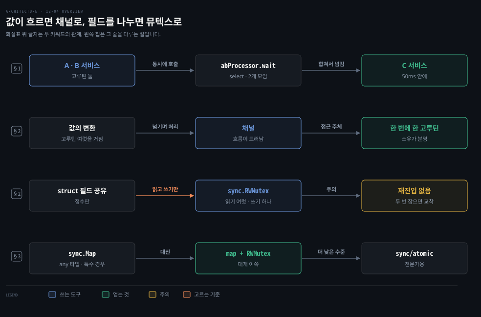
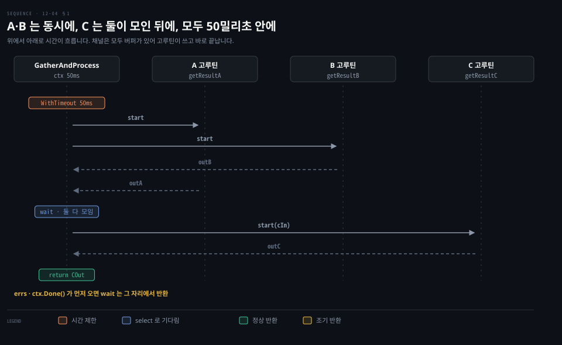

# 채널로 파이프라인을 짜고 공유 필드는 뮤텍스로 지킵니다

---

> Learning Go 12장 끝입니다. 장 처음에 낸 세 웹 서비스 문제를 고루틴·채널·`select`·context 로 구현하고, 채널 대신 뮤텍스를 쓸 때와 `sync.Map`·atomic 을 피하는 이유를 다룬 뒤 장 끝 연습 문제를 풉니다.

## 핵심 요약

> 이 편이 매달린 하나의 생각은 값이 고루틴 사이를 흘러가면 채널로, 고루틴들이 같은 필드를 읽고 쓰기만 하면 뮤텍스로 지킨다는 것입니다.

세 서비스 파이프라인은 A·B 를 고루틴 둘로 동시에 부릅니다. 그리고 결과 채널과 오류 채널과 `ctx.Done()` 을 `select` 로 기다립니다. 둘이 모이면 C 를 같은 방식으로 부릅니다. 채널은 모두 버퍼가 있어 고루틴이 읽는 쪽을 기다리지 않고 끝납니다. 50밀리초 제한은 `context.WithTimeout` 하나로 겁니다.

뮤텍스는 데이터 흐름을 가리니 첫 선택이 아닙니다. 하지만 고루틴들이 공유 값을 처리하지 않고 읽고 쓰기만 할 때는 뮤텍스가 더 분명합니다. `sync.RWMutex` 는 읽기를 여럿 허락하고 쓰기는 하나만 허락합니다. Go 의 뮤텍스는 재진입하지 않고 복사하면 안 됩니다. `sync.Map` 은 아주 특수한 경우에만 쓰고, atomic 은 전문가가 아니면 쓰지 않습니다.


## 학습 목표

> 이 편을 읽고 나면 아래 다섯 가지를 스스로 해낼 수 있습니다.

1. `GatherAndProcess` 가 A·B 를 동시에 부르고, 둘 다 모였을 때만 C 로 넘어가는 흐름을 코드로 따라갈 수 있습니다.
2. `abProcessor.wait` 가 오류·시간 초과·정상 결과를 어떻게 한 `select` 로 다루는지 말할 수 있습니다.
3. 채널과 뮤텍스 가운데 무엇을 쓸지 Cox-Buday 의 기준 셋으로 판단할 수 있습니다.
4. Go 의 뮤텍스가 재진입하지 않는다는 것이 재귀 호출과 다른 함수 호출에서 무엇을 뜻하는지 말할 수 있습니다.
5. `sync.Map` 이 맞는 두 경우와, 대신 `map` 과 `sync.RWMutex` 를 쓰는 이유를 말할 수 있습니다.

아래는 이 편의 키워드를 이은 개념도입니다. 첫 줄은 A·B 를 동시에 부르고 결과를 합쳐 C 에 넘기는 파이프라인입니다. 둘째 줄은 값이 고루틴 사이를 흐르면 채널을 쓰는 경우입니다. 셋째 줄은 struct 필드를 나눠 읽고 쓰면 `RWMutex` 를 쓰고, 재진입하지 않는다는 점을 조심하는 경우입니다. 넷째 줄은 `sync.Map` 과 atomic 대신 대개 `map` 과 `RWMutex` 를 쓴다는 결론입니다. 왼쪽 칩이 그 줄을 다루는 절입니다.




## 1. 도구를 합칩니다 — 세 웹 서비스 파이프라인

> 12-01 §1 의 문제는 서비스 A·B 를 동시에 부르고 두 결과를 C 에 넘기되, 전체를 50밀리초 안에 끝내는 것입니다. 호출하는 함수는 순차 코드처럼 보이고, 동시성은 `start`·`wait` 메서드를 가진 처리기 struct 두 개 안에 숨습니다.

12-01 §1 의 예로 돌아갑니다. 웹 서비스 셋을 부르는 함수입니다. 두 서비스에 데이터를 보내고, 그 두 결과를 셋째 서비스에 보내 결과를 돌려줍니다. 전체가 50밀리초 안에 끝나지 않으면 오류를 돌려줍니다. 먼저 호출하는 함수입니다.

```go
func GatherAndProcess(ctx context.Context, data Input) (COut, error) {
	ctx, cancel := context.WithTimeout(ctx, 50*time.Millisecond)
	defer cancel()

	ab := newABProcessor()
	ab.start(ctx, data)
	inputC, err := ab.wait(ctx)
	if err != nil {
		return COut{}, err
	}

	c := newCProcessor()
	c.start(ctx, inputC)
	out, err := c.wait(ctx)
	return out, err
}
```

가장 먼저 12-03 §4 에서 본 것처럼 50밀리초에 시간이 넘는 `context.Context` 를 만듭니다. 그다음 `defer` 로 context 의 `cancel` 함수가 꼭 불리게 합니다. 원문은 이 함수를 부르지 않으면 자원이 샌다고 말하고, 14장의 「Cancellation」 절에서 다룬다고 예고합니다. 장 번호는 노트가 찾아 붙였습니다.

동시에 부를 두 서비스를 A 와 B 라 부르니, 둘을 부를 `abProcessor` 를 만듭니다. `start` 메서드로 처리를 시작하고 `wait` 메서드로 결과를 기다립니다. `wait` 가 돌아오면 표준 오류 검사를 합니다. 문제가 없으면 C 라 부르는 셋째 서비스를 같은 방식으로 부르고, `cProcessor` 의 `wait` 결과를 돌려줍니다. 원문은 이 함수가 동시성 없는 순차 코드와 아주 닮았다고 말합니다.

### abProcessor — 채널 셋과 고루틴 둘

```go
type abProcessor struct {
	outA chan aOut
	outB chan bOut
	errs chan error
}

func newABProcessor() *abProcessor {
	return &abProcessor{
		outA: make(chan aOut, 1),
		outB: make(chan bOut, 1),
		errs: make(chan error, 2),
	}
}
```

`abProcessor` 의 필드 `outA`·`outB`·`errs` 는 모두 채널입니다. 모든 채널에 버퍼가 있어서, 쓰는 고루틴이 읽는 쪽을 기다리지 않고 쓰고 끝날 수 있습니다. `errs` 는 오류가 둘까지 올 수 있어 버퍼 크기가 2 입니다.

```go
func (p *abProcessor) start(ctx context.Context, data Input) {
	go func() {
		aOut, err := getResultA(ctx, data.A)
		if err != nil {
			p.errs <- err
			return
		}
		p.outA <- aOut
	}()
	go func() {
		bOut, err := getResultB(ctx, data.B)
		if err != nil {
			p.errs <- err
			return
		}
		p.outB <- bOut
	}()
}
```

`start` 는 고루틴 둘을 띄웁니다. 첫째는 `getResultA` 로 서비스 A 를 부르고, 오류면 `errs` 에, 성공이면 `outA` 에 씁니다. 채널에 버퍼가 있으니 어느 쪽에 쓰든 고루틴은 멈추지 않습니다. context 를 `getResultA` 에 넘겨, 시간이 넘으면 그쪽도 처리를 취소할 수 있게 합니다. 둘째 고루틴은 `getResultB` 를 불러 `outB` 에 쓰는 것만 다릅니다.

```go
func (p *abProcessor) wait(ctx context.Context) (cIn, error) {
	var cData cIn
	for count := 0; count < 2; count++ {
		select {
		case a := <-p.outA:
			cData.a = a
		case b := <-p.outB:
			cData.b = b
		case err := <-p.errs:
			return cIn{}, err
		case <-ctx.Done():
			return cIn{}, ctx.Err()
		}
	}
	return cData, nil
}
```

원문은 `wait` 가 구현할 메서드 가운데 가장 복잡하다고 말합니다. A·B 서비스의 결과를 담는 `cIn` 타입 `cData` 를 채웁니다. 성공하려면 채널 두 개에서 읽어야 하니 2 까지 세는 `for` 루프를 돕니다. 루프 안의 `select` 는 `outA` 에서 읽으면 `a` 필드를, `outB` 에서 읽으면 `b` 필드를 채웁니다. `errs` 에서 읽으면 오류와 함께 바로 돌아갑니다. context 시간이 넘으면 context 의 `Err` 메서드가 돌려준 오류와 함께 바로 돌아갑니다. 둘 다 읽으면 루프를 빠져나와 `cProcessor` 에 넘길 입력을 돌려줍니다.

### cProcessor — 같은 모양의 작은 판

```go
type cProcessor struct {
	outC chan COut
	errs chan error
}

func newCProcessor() *cProcessor {
	return &cProcessor{
		outC: make(chan COut, 1),
		errs: make(chan error, 1),
	}
}

func (p *cProcessor) start(ctx context.Context, inputC cIn) {
	go func() {
		cOut, err := getResultC(ctx, inputC)
		if err != nil {
			p.errs <- err
			return
		}
		p.outC <- cOut
	}()
}

func (p *cProcessor) wait(ctx context.Context) (COut, error) {
	select {
	case out := <-p.outC:
		return out, nil
	case err := <-p.errs:
		return COut{}, err
	case <-ctx.Done():
		return COut{}, ctx.Err()
	}
}
```

`cProcessor` 는 출력 채널과 오류 채널을 하나씩 가집니다. `start` 는 `abProcessor` 의 것과 닮았고, `wait` 는 `outC`·`errs`·`Done` 가운데 먼저 오는 것을 고르는 단순한 `select` 입니다. 아래 도식은 이 흐름을 시간 순서로 보입니다.



원문은 고루틴·채널·`select` 로 코드를 짜면 단계가 나뉜다고 말합니다. 독립된 부분은 어떤 순서로든 돌고 끝날 수 있습니다. 의존하는 부분 사이의 데이터 교환도 깔끔해집니다. 프로그램의 어느 부분도 멈춰 남지 않습니다. 이 함수에서 건 시간 제한과 호출 스택 앞쪽에서 온 제한을 모두 제대로 다룹니다. 이것이 더 나은 방법인지 의심스럽다면 다른 언어로 구현해 보라고 원문은 권합니다. 얼마나 어려운지 놀랄 것이라고 덧붙입니다.

### 이 노트의 재현 — 시간 초과와 오류 경로

저장소의 pipeline 예제는 `getResultA`·`getResultB`·`getResultC` 가 빈 값을 곧바로 돌려주는 자리표시자라 늘 `{map[]}` 을 찍습니다. 이 노트는 복사본에서 `getResultA` 에 지연을, `getResultB` 에 오류를 넣을 수 있게 고쳐 세 경우를 봤습니다.

| 조건 | 결과 |
|---|---|
| A 10밀리초 지연 | `{map[]}` — 정상 |
| A 80밀리초 지연 | `context deadline exceeded` — `ctx.Done()` case |
| A 30밀리초 지연, B 는 오류 | `B failed` — A 를 기다리지 않고 `errs` case 로 바로 돌아감 |

셋째 줄은 `wait` 가 오류를 받자마자 돌아가 A 의 결과를 기다리지 않는다는 것을 보입니다. 이 재현은 원문 밖입니다.


## 2. 채널 대신 뮤텍스를 쓸 때

> 뮤텍스는 누가 값을 가졌는지 드러내지 않아 데이터 흐름을 가립니다. 그래도 고루틴들이 공유 값을 처리하지 않고 읽고 쓰기만 하는 경우, 특히 struct 필드를 나눠 쓸 때는 채널보다 뮤텍스가 분명합니다.

다른 언어에서 스레드 사이의 데이터 접근을 조율해 봤다면 뮤텍스를 써 봤을 것입니다. **뮤텍스**(mutex)는 상호 배제(mutual exclusion)의 줄임말입니다. 어떤 코드의 동시 실행이나 공유 데이터 접근을 제한하는 일을 합니다.

뮤텍스가 보호하는 부분을 **임계 구역**(critical section)이라고 합니다.

원문은 Go 를 만든 사람들이 채널과 `select` 로 동시성을 다루게 설계한 데 이유가 있다고 말합니다. 뮤텍스의 주된 문제는 프로그램의 데이터 흐름을 가린다는 것입니다. 값이 채널을 거쳐 고루틴에서 고루틴으로 넘어가면 데이터 흐름이 분명합니다. 값에 접근하는 것도 한 번에 한 고루틴입니다. 뮤텍스로 값을 보호하면 모든 동시 처리가 값을 공유하니, 지금 누가 값을 가졌는지 알 수 없습니다. Go 커뮤니티는 이 철학을 이렇게 말합니다. "메모리를 공유해서 소통하지 말고, 소통해서 메모리를 공유하라."

그래도 뮤텍스가 더 분명할 때가 있고, 표준 라이브러리는 그런 상황을 위한 구현을 둡니다. 가장 흔한 경우는 고루틴들이 공유 값을 처리하지 않고 읽거나 쓰기만 할 때입니다. 원문의 예는 멀티플레이 게임의 메모리 안 점수판입니다.

### 채널로 만든 점수판은 번거롭습니다

```go
func scoreboardManager(ctx context.Context, in <-chan func(map[string]int)) {
	scoreboard := map[string]int{}
	for {
		select {
		case <-ctx.Done():
			return
		case f := <-in:
			f(scoreboard)
		}
	}
}

type ChannelScoreboardManager chan func(map[string]int)

func NewChannelScoreboardManager(ctx context.Context) ChannelScoreboardManager {
	ch := make(ChannelScoreboardManager)
	go scoreboardManager(ctx, ch)
	return ch
}

func (csm ChannelScoreboardManager) Update(name string, val int) {
	csm <- func(m map[string]int) {
		m[name] = val
	}
}
```

이 함수는 map 을 선언하고 그것을 읽거나 고치는 함수를 한 채널에서 받습니다. 종료 신호는 context 의 `Done` 채널에서 받습니다. 쓰기는 map 에 값을 넣는 함수를 넘기면 끝이라 간단합니다. 원문 인쇄본은 두 함수 시그니처의 끝이 잘렸습니다. 위 코드는 문맥에 맞춰 노트가 채운 것입니다. 이 저장소에는 채널 판 점수판이 없어서, 채운 코드와 아래 `Read` 를 직접 돌려 `Lions` 는 `10 true`, 없는 `Bears` 는 `0 false` 가 나오는 것을 확인했습니다.

읽기는 값을 돌려받아야 하니, 넘긴 함수 안에서 쓸 채널을 따로 만들어야 합니다.

```go
func (csm ChannelScoreboardManager) Read(name string) (int, bool) {
	type Result struct {
		out int
		ok  bool
	}
	resultCh := make(chan Result)
	csm <- func(m map[string]int) {
		out, ok := m[name]
		resultCh <- Result{out, ok}
	}
	result := <-resultCh
	return result.out, result.ok
}
```

원문은 이 코드가 돌기는 하지만 번거롭고, 한 번에 읽는 쪽이 하나뿐이라고 말합니다. 더 나은 방법이 뮤텍스입니다.

### Mutex 와 RWMutex

표준 라이브러리의 뮤텍스 구현은 `sync` 패키지에 둘 있습니다. 첫째 `Mutex` 는 `Lock`·`Unlock` 메서드를 가집니다. `Lock` 을 부르면 다른 고루틴이 임계 구역에 있는 동안 지금 고루틴이 멈춥니다. 임계 구역이 비면 지금 고루틴이 락을 얻고 임계 구역의 코드를 실행합니다. `Unlock` 은 임계 구역의 끝을 표시합니다.

둘째 `RWMutex` 는 읽기 락과 쓰기 락을 모두 줍니다. 한 번에 임계 구역에 들어갈 수 있는 쓰기 쪽은 하나지만, 읽기 락은 공유되어 여러 읽기 쪽이 함께 들어갈 수 있습니다. 쓰기 락은 `Lock`·`Unlock`, 읽기 락은 `RLock`·`RUnlock` 으로 다룹니다.

뮤텍스 락을 얻으면 반드시 풀어야 합니다. `Lock` 이나 `RLock` 바로 다음에 `defer` 로 `Unlock` 을 부릅니다.

```go
type MutexScoreboardManager struct {
	l          sync.RWMutex
	scoreboard map[string]int
}

func NewMutexScoreboardManager() *MutexScoreboardManager {
	return &MutexScoreboardManager{
		scoreboard: map[string]int{},
	}
}

func (msm *MutexScoreboardManager) Update(name string, val int) {
	msm.l.Lock()
	defer msm.l.Unlock()
	msm.scoreboard[name] = val
}

func (msm *MutexScoreboardManager) Read(name string) (int, bool) {
	msm.l.RLock()
	defer msm.l.RUnlock()
	val, ok := msm.scoreboard[name]
	return val, ok
}
```

저장소의 mutex 예제는 세 팀 고루틴이 점수를 열 번씩 읽고 고칩니다. 이 노트의 실행은 `Lions 55 true`, `Tigers 64 true`, `Bears 55 true` 를 찍었습니다. 처음 10점에 팀 이름 길이를 아홉 번 더한 값입니다. `go run -race` 로 돌려도 경고 없이 같은 결과가 나왔습니다.

### 채널이냐 뮤텍스냐 — 세 기준

원문은 뮤텍스를 쓰기 전에 신중히 따져 보라고 말합니다. 그리고 Katherine Cox-Buday 의 《Concurrency in Go》에 있는 결정 기준을 옮깁니다.

- 고루틴을 조율하거나, 값이 고루틴 여럿을 거치며 변환되는 것을 추적한다면 채널을 씁니다.
- struct 의 필드 접근을 공유한다면 뮤텍스를 씁니다.
- 채널을 쓰다 심각한 성능 문제를 발견했고 다른 방법으로 고칠 수 없다면 뮤텍스로 바꿉니다. 성능 문제는 15장의 「Using Benchmarks」 절로 찾으며, 장 번호는 노트가 찾아 붙였습니다.

점수판은 struct 의 필드이고 점수판을 넘겨주는 일이 없으니 뮤텍스가 맞습니다. 원문은 데이터가 메모리에 있어서 뮤텍스가 좋은 것이라고 짚습니다. HTTP 서버나 데이터베이스 같은 외부 서비스에 데이터가 있으면 그 시스템 접근을 뮤텍스로 지키지 말라고 합니다.

Spring 서비스에서 여러 인스턴스가 같은 DB 행을 고칠 때 JVM 의 `synchronized` 가 소용없고 DB 락이나 낙관적 락이 필요한 것과 같은 이유입니다. 뮤텍스는 한 프로세스의 메모리만 지킵니다. 이 비교는 원문 밖입니다.

### 뮤텍스는 재진입하지 않고 복사하면 안 됩니다

뮤텍스는 뒤치다꺼리가 더 많습니다. 락과 해제를 정확히 짝지어야 하며, 그러지 않으면 교착에 빠지기 쉽습니다. 예제는 같은 메서드 안에서 락을 얻고 풉니다.

또 하나는 Go 의 뮤텍스가 재진입하지 않는다는 것입니다. 한 고루틴이 같은 락을 두 번 얻으려 하면 자기가 락을 풀기를 기다리며 교착에 빠집니다. 원문은 락이 재진입하는 Java 같은 언어와 다르다고 말합니다. 이 노트의 go1.25.1 에서 `sync.Mutex` 에 `Lock` 을 두 번 부르니 `locked once` 를 찍은 뒤 `fatal error: all goroutines are asleep - deadlock!` 으로 끝났습니다.

재진입하지 않는 락은 재귀 함수에서 락을 얻기 까다롭게 만듭니다. 재귀 호출 전에 락을 풀어야 합니다. 일반적으로 락을 쥔 채 함수를 부를 때는 조심해야 합니다. 그 호출에서 어떤 락을 얻을지 모르기 때문입니다. 부른 함수가 같은 뮤텍스 락을 얻으려 하면 고루틴은 교착에 빠집니다.

`sync.WaitGroup`·`sync.Once` 처럼 뮤텍스도 절대 복사하면 안 됩니다. 함수에 넘기거나 struct 필드로 접근할 때는 포인터로 해야 합니다. 복사하면 락이 공유되지 않습니다. 위 `MutexScoreboardManager` 의 메서드가 모두 포인터 리시버인 이유이며, 포인터 리시버는 07-01 에서 다뤘습니다.

원문의 경고는 변수의 뮤텍스를 먼저 얻지 않고는 여러 고루틴에서 그 변수에 접근하지 말라고 합니다. 추적하기 어려운 이상한 오류가 생긴다고 합니다. 이런 문제를 찾는 데이터 경합 탐지기는 15장의 「Finding Concurrency Problems with the Data Race Detector」 절에서 다루며, 장 번호는 노트가 찾아 붙였습니다.


## 3. sync.Map 과 atomic — 대개 필요 없습니다

> `sync.Map` 은 한 번 넣고 여러 번 읽거나, 고루틴마다 다른 키를 쓸 때만 맞고 키·값이 `any` 입니다. atomic 은 성능을 끝까지 짜내는 전문가용이니, 대부분은 `map` 과 `sync.RWMutex`, 고루틴과 뮤텍스로 충분합니다.

원문의 곁글 제목은 "sync.Map — 찾는 map 이 아닙니다" 입니다. `sync` 패키지에는 `Map` 이라는 타입이 있고, Go 내장 map 의 동시성 안전 판을 제공합니다. 하지만 구현의 트레이드오프 때문에 아주 특정한 상황에만 맞습니다.

- 키·값 쌍을 한 번 넣고 여러 번 읽는 공유 map
- 고루틴들이 map 을 공유하지만 서로의 키·값에 접근하지 않을 때

게다가 `sync.Map` 은 제네릭이 들어오기 전에 표준 라이브러리에 추가되어 키와 값의 타입이 `any` 입니다. 그래서 컴파일러가 올바른 타입을 쓰는지 도와주지 못합니다. 원문은 이런 제약 때문에, 드물게 map 을 여러 고루틴이 나눠 써야 한다면 `sync.RWMutex` 로 지킨 내장 map 을 쓰라고 말합니다.

원문 밖 보충입니다. Go 1.24 는 `sync.Map` 의 구현을 바꿔, 서로 다른 키를 고치는 경합이 줄었다고 릴리스 노트에 적었습니다. 옛 구현으로 돌아가려면 `GOEXPERIMENT=nosynchashtriemap` 을 쓴다고 합니다. 타입이 `any` 라는 원문의 지적은 그대로입니다.

### atomic 은 전문가용입니다

뮤텍스 말고도 Go 는 여러 스레드 사이에 데이터를 일관되게 지키는 방법을 하나 더 줍니다. `sync/atomic` 패키지는 현대 CPU 에 내장된 원자적 변수 연산을 제공합니다. 다루는 값은 레지스터 하나에 들어가는 크기이고, 연산은 더하기·바꾸기·읽기·저장·비교 후 교체(CAS)입니다.

원문은 성능을 마지막 한 방울까지 짜내야 하고 동시 코드 작성의 전문가라면 Go 가 atomic 을 지원해 반가울 것이라고 말합니다. 나머지 모두는 고루틴과 뮤텍스로 동시성을 다루라고 합니다.

동시성을 더 배우려면 Katherine Cox-Buday 의 《Concurrency in Go》를 권한다고 원문은 말합니다. 원문은 이 장이 간단한 패턴 몇 개만 다뤘고, Go 동시성 패턴을 제대로 구현하는 법만으로 책 한 권을 쓸 수 있다고 덧붙입니다.


## 연습 문제

> 원문 연습 문제 셋은 고루틴 누수 없이 채널을 닫고, 닫힌 채널을 nil 로 꺼 가며 읽고, `sync.OnceValue` 로 캐시하는 문제입니다. 이 노트는 원서 예제 저장소의 풀이를 go1.25.1 에서 돌려 확인했습니다.

### 1. 쓰는 고루틴 둘과 읽는 고루틴 하나

첫 문제는 채널 하나로 소통하는 고루틴 셋을 띄우는 함수입니다. 처음 둘은 각각 숫자 10개를 씁니다. 셋째는 모든 숫자를 읽어 찍습니다. 모든 값을 찍으면 함수가 끝나야 하며 새는 고루틴이 없어야 합니다. 필요하면 고루틴을 더 만들어도 됩니다.

저장소 풀이는 `sync.WaitGroup` 을 둘 씁니다. 첫째는 쓰는 고루틴 둘을 기다렸다가 채널을 닫는 도우미 고루틴에 씁니다. 12-03 §5 의 한 번만 닫기 패턴입니다. 둘째는 읽는 고루틴이 끝나기를 함수가 기다리는 데 씁니다. 실행하면 0~9 와 1·101·…·901 이 섞여 20개 찍혔습니다.

### 2. for-select 로 채널 둘을 읽습니다

둘째 문제는 고루틴 둘이 각자 채널에 숫자 10개를 쓰고, for-select 루프로 두 채널을 읽어 숫자와 그 값을 쓴 고루틴을 찍는 함수입니다. 값을 모두 읽으면 끝나야 하고 새는 고루틴이 없어야 합니다.

저장소 풀이는 12-03 §3 의 방법대로, `ok` 가 `false` 면 채널 변수를 nil 로 바꾸고 남은 채널 수를 줄입니다. 두 case 가 모두 꺼지면 끝납니다. 다만 풀이는 숫자만 찍고 어느 고루틴이 썼는지는 찍지 않습니다. 문제의 요구를 채우려면 case 마다 출처를 함께 찍어야 합니다. 이 지적은 노트의 것입니다.

### 3. sync.OnceValue 로 제곱근 map 을 캐시합니다

셋째 문제는 0 이상 100,000 미만의 수를 키로, `math.Sqrt` 로 구한 제곱근을 값으로 하는 `map[int]float64` 를 만드는 함수입니다. `sync.OnceValue` 로 이 map 을 캐시하는 함수를 만들고, 0부터 100,000까지 1,000번째 수마다 캐시된 값으로 제곱근을 찾습니다.

```go
func buildSquareRootMap() map[int]float64 {
	out := make(map[int]float64, 100_000)
	for i := 0; i < 100_000; i++ {
		out[i] = math.Sqrt(float64(i))
	}
	return out
}

var squareRootMapCache = sync.OnceValue(buildSquareRootMap)

func main() {
	for i := 0; i < 100_000; i += 1_000 {
		fmt.Println(i, squareRootMapCache()[i])
	}
}
```

실행하면 `0 0`, `1000 31.622776601683793`, `10000 100` 처럼 100줄이 찍혔습니다. map 은 첫 호출에서 한 번만 만들어집니다. 원문은 장을 맺으며 Go 의 방식이 전통적 동시성보다 단순한 이유를 배웠다고 정리하고, 다음 장에서 "배터리 포함" 철학의 표준 라이브러리를 본다고 예고합니다.


## 핵심 개념 체크리스트

목표 번호 순서대로 짝지었습니다.

- [ ] (목표 1) `GatherAndProcess` 가 C 를 A·B 와 동시에 부르지 않는 이유를 말할 수 있습니까?
- [ ] (목표 2) `errs` 채널의 버퍼가 2 가 아니라 1 이면 A·B 가 모두 실패했을 때 무엇이 남습니까?
- [ ] (목표 2) 50밀리초가 지나면 `abProcessor.wait` 는 어느 case 로 돌아가고 무엇을 돌려줍니까?
- [ ] (목표 3) 점수판에 채널이 아니라 뮤텍스가 맞는 이유를 Cox-Buday 의 기준으로 말할 수 있습니까?
- [ ] (목표 4) 락을 쥔 채 다른 함수를 부를 때 조심해야 하는 이유는 무엇입니까?
- [ ] (목표 4) `MutexScoreboardManager` 의 메서드를 값 리시버로 바꾸면 무슨 일이 생깁니까?
- [ ] (목표 5) 여러 고루틴이 키를 섞어 읽고 쓰는 캐시에 `sync.Map` 대신 무엇을 씁니까?


## 관련 문서

- [12-03 버퍼 채널은 개수를 알 때 쓰고 WaitGroup 과 Once 가 기다림과 한 번 실행을 맡습니다](./12-03.%EB%B2%84%ED%8D%BC%20%EC%B1%84%EB%84%90%EC%9D%80%20%EA%B0%9C%EC%88%98%EB%A5%BC%20%EC%95%8C%20%EB%95%8C%20%EC%93%B0%EA%B3%A0%20WaitGroup%20%EA%B3%BC%20Once%20%EA%B0%80%20%EA%B8%B0%EB%8B%A4%EB%A6%BC%EA%B3%BC%20%ED%95%9C%20%EB%B2%88%20%EC%8B%A4%ED%96%89%EC%9D%84%20%EB%A7%A1%EC%8A%B5%EB%8B%88%EB%8B%A4.md) — 12장 셋째. 동시성 패턴
- [12-01 고루틴은 런타임이 나눠 돌리는 가벼운 스레드이고 채널로 값을 주고받습니다](./12-01.%EA%B3%A0%EB%A3%A8%ED%8B%B4%EC%9D%80%20%EB%9F%B0%ED%83%80%EC%9E%84%EC%9D%B4%20%EB%82%98%EB%88%A0%20%EB%8F%8C%EB%A6%AC%EB%8A%94%20%EA%B0%80%EB%B2%BC%EC%9A%B4%20%EC%8A%A4%EB%A0%88%EB%93%9C%EC%9D%B4%EA%B3%A0%20%EC%B1%84%EB%84%90%EB%A1%9C%20%EA%B0%92%EC%9D%84%20%EC%A3%BC%EA%B3%A0%EB%B0%9B%EC%8A%B5%EB%8B%88%EB%8B%A4.md) — 12장 첫째. 세 웹 서비스 문제
- [07-01 메서드는 리시버로 타입에 붙고 포인터 리시버만 원본을 바꿉니다](./07-01.%EB%A9%94%EC%84%9C%EB%93%9C%EB%8A%94%20%EB%A6%AC%EC%8B%9C%EB%B2%84%EB%A1%9C%20%ED%83%80%EC%9E%85%EC%97%90%20%EB%B6%99%EA%B3%A0%20%ED%8F%AC%EC%9D%B8%ED%84%B0%20%EB%A6%AC%EC%8B%9C%EB%B2%84%EB%A7%8C%20%EC%9B%90%EB%B3%B8%EC%9D%84%20%EB%B0%94%EA%BF%89%EB%8B%88%EB%8B%A4.md) — 7장. 포인터 리시버
- [Learning Go 2판 — 정독 인덱스](./README.md) — 16장 전체 지도


## 참고 자료

- 원본: 《Learning Go, 2nd Edition》 (Jon Bodner, O'Reilly)
- 다룬 범위: Chapter 12 "Put Your Concurrent Tools Together" 부터 장 끝까지, 연습 문제 1~3
- [Share Memory By Communicating](https://go.dev/blog/codelab-share) — Go 블로그
- [sync.Map](https://pkg.go.dev/sync#Map)
- [Go 1.24 릴리스 노트](https://go.dev/doc/go1.24) — sync.Map 구현 변경
- Katherine Cox-Buday, 《Concurrency in Go》 (O'Reilly)
