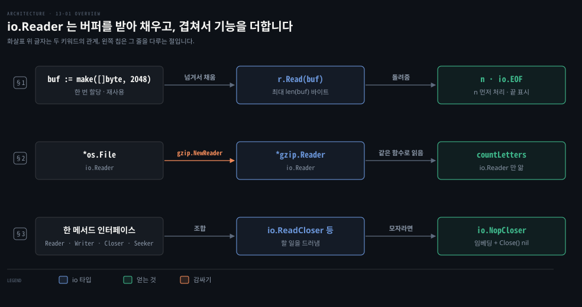
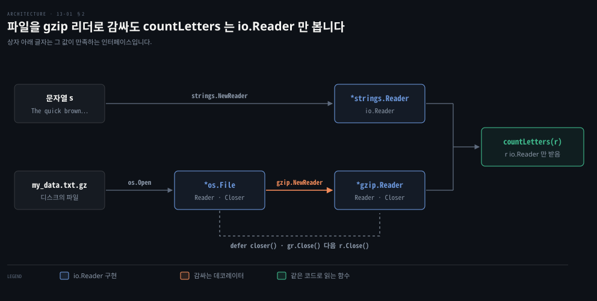

# io.Reader 는 버퍼를 받아 채우고 작은 인터페이스를 겹쳐 기능을 더합니다

---

> Learning Go 13장 앞 부분입니다. Go 표준 라이브러리의 설계 원칙을 가장 잘 보여 주는 `io` 패키지의 `io.Reader`·`io.Writer`, 이들을 겹쳐 기능을 더하는 데코레이터, `io.Closer`·`io.Seeker` 와 조합 인터페이스, `io.NopCloser`, 그리고 `os` 의 파일 함수를 다룹니다.

13장은 표준 라이브러리 전부를 훑지 않습니다. 원문은 Go 의 표준 라이브러리를 Python 처럼 "배터리 포함"이라고 소개합니다. 그리고 그중 관용적인 Go 의 원칙을 잘 보여 주는 I/O·시간·JSON·HTTP 를 고릅니다. `errors`·`sync`·`context`·`testing`·`reflect`·`unsafe` 는 각자의 장에서 다룹니다.

## 핵심 요약

> 이 편이 매달린 하나의 생각은 메서드 하나짜리 인터페이스가 작을수록 더 많은 타입이 구현하고, 그래서 서로 겹쳐 쓸 수 있다는 것입니다.

`io.Reader` 의 `Read` 는 데이터를 돌려주지 않습니다. 호출하는 쪽이 준 버퍼를 채운 뒤 채운 바이트 수를 돌려줍니다. 버퍼를 한 번 만들어 계속 다시 쓸 수 있어 할당이 줄고 메모리 할당을 개발자가 쥡니다. `Read` 의 결과는 오류를 확인하기 전에 읽은 바이트부터 처리합니다. 끝에 이르면 `io.EOF` 를 돌려줍니다.

`io.Reader` 를 받는 함수는 문자열이든 파일이든 gzip 압축 파일이든 똑같이 읽습니다. `io.Copy`·`io.MultiReader`·`io.LimitReader`·`io.MultiWriter` 같은 도우미가 기능을 겹칩니다. 함수 매개변수는 `os.File` 대신 `io.ReadCloser` 같은 인터페이스로 받아 할 일을 드러냅니다. 인터페이스에 메서드가 모자라면 `io.NopCloser` 처럼 임베딩으로 채웁니다.


## 학습 목표

> 이 편을 읽고 나면 아래 다섯 가지를 스스로 해낼 수 있습니다.

1. `Read` 가 slice 를 돌려주지 않고 받아서 채우는 이유를 할당과 가비지 컬렉션으로 설명할 수 있습니다.
2. `Read` 의 결과를 다룰 때 오류보다 `n` 을 먼저 처리해야 하는 이유와, `io.EOF` 가 뜻하는 것을 말할 수 있습니다.
3. `countLetters` 가 문자열과 gzip 파일을 코드 변경 없이 읽는 원리를 데코레이터로 설명할 수 있습니다.
4. `os.File` 대신 `io.ReadSeeker` 같은 조합 인터페이스를 매개변수로 받으면 무엇을 얻는지 말할 수 있습니다.
5. `io.NopCloser` 가 임베딩으로 메서드를 채우는 방법을 읽고 반복문 안에서 `defer Close` 를 쓰면 안 되는 이유를 말할 수 있습니다.

아래는 이 편의 키워드를 이은 개념도입니다. 첫 줄은 `Read` 가 호출자의 버퍼를 채우고 `n` 과 `io.EOF` 를 돌려주는 규약입니다. 둘째 줄은 파일을 gzip 리더로 감싸도 `io.Reader` 라서 같은 함수가 읽는 데코레이터입니다. 셋째 줄은 한 메서드 인터페이스를 조합하고 모자란 메서드를 임베딩으로 채우는 방법입니다. 왼쪽 칩이 그 줄을 다루는 절입니다.




## 1. io.Reader 와 io.Writer — 호출자가 준 버퍼를 채웁니다

> `io.Reader` 와 `io.Writer` 는 메서드 하나짜리 인터페이스이고, `error` 다음으로 많이 쓰이는 인터페이스입니다. `Read` 는 호출자가 넘긴 slice 를 채우고 채운 수를 돌려주어, 버퍼 하나로 큰 데이터를 읽게 합니다.

파일이든 네트워크든 데이터를 읽는 인터페이스를 직접 설계한다고 해 봅시다. 가장 먼저 떠오르는 모양은 읽은 데이터를 반환 값으로 돌려주는 것입니다. 원문도 이 모양이 자연스러워 보일 수 있다며 먼저 보여 줍니다.

```go
type NotHowReaderIsDefined interface {
	Read() (p []byte, err error)
}
```

그런데 이 모양으로 큰 파일을 읽으면 무슨 일이 생길까요? `Read` 를 부를 때마다 새 slice 가 힙에 할당됩니다. 다 쓴 slice 는 가비지 컬렉터가 치워야 하니, 읽는 양만큼 가비지가 쌓입니다. 힙과 가비지는 06-03 에서 다뤘습니다.

Go 입출력의 중심인 `io` 패키지는 그래서 반대로 정의합니다. 핵심은 `io.Reader` 와 `io.Writer` 두 인터페이스입니다. 원문은 이 둘이 9장의 `error` 다음으로 많이 쓰이는 인터페이스일 것이라고 말합니다.

```go
type Reader interface {
	Read(p []byte) (n int, err error)
}

type Writer interface {
	Write(p []byte) (n int, err error)
}
```

`Write` 는 바이트 slice 를 받아 구현체에 씁니다. 돌려주는 것은 쓴 바이트 수와 오류입니다. `Read` 는 데이터를 반환 값으로 돌려주지 않습니다. 호출자가 넘긴 slice `p` 에 최대 `len(p)` 바이트를 채우고 채운 바이트 수를 돌려줍니다.

### 버퍼를 한 번 만들어 계속 다시 씁니다

이 정의가 할당 문제를 어떻게 푸는지는 원문이 보인 전형적인 함수에서 드러납니다.

```go
func countLetters(r io.Reader) (map[string]int, error) {
	buf := make([]byte, 2048)
	out := map[string]int{}
	for {
		n, err := r.Read(buf)
		for _, b := range buf[:n] {
			if (b >= 'A' && b <= 'Z') || (b >= 'a' && b <= 'z') {
				out[string(b)]++
			}
		}
		if err == io.EOF {
			return out, nil
		}
		if err != nil {
			return nil, err
		}
	}
}
```

`buf` 는 반복문 밖에서 한 번만 만듭니다. `r.Read` 는 부를 때마다 같은 버퍼를 다시 채웁니다. 큰 데이터를 읽어도 읽기 버퍼는 한 번만 할당하는 셈입니다. `Read` 가 `[]byte` 를 돌려줬다면 부를 때마다 새로 할당했을 것이고 그 slice 가 모두 가비지 컬렉터의 일이 됩니다.

할당을 더 줄이고 싶다면 프로그램이 시작할 때 버퍼 풀을 만들 수 있습니다. 함수가 시작할 때 풀에서 버퍼를 꺼내고 끝날 때 돌려놓습니다. 원문은 `io.Reader` 에 slice 를 넘기는 설계 덕에 메모리 할당을 개발자가 쥔다고 말합니다.

버퍼를 다시 쓰니 이번 호출이 몇 바이트를 채웠는지 알아야 합니다. `r.Read` 가 돌려준 `n` 이 그 수이고 `countLetters` 는 `buf` 전체가 아니라 `buf[:n]` 만 돕니다.

더 읽을 것이 없으면 `r.Read` 는 `io.EOF` 를 돌려줍니다. 원문은 이 값이 사실 오류가 아니라서 조금 이상하다고 말합니다. 더 읽을 것이 없다는 표시일 뿐이라, `countLetters` 는 `io.EOF` 를 받으면 결과를 오류 없이 돌려줍니다.

### 오류보다 읽은 바이트를 먼저 처리합니다

`Read` 에는 특이한 점이 하나 있습니다. 대개 함수나 메서드가 오류를 돌려주면, 오류가 아닌 반환 값을 쓰기 전에 오류부터 확인합니다. `Read` 는 반대입니다. 데이터 끝이나 예상 밖의 상황으로 오류가 나기 전에 이미 바이트가 버퍼에 복사되었을 수 있기 때문입니다. `countLetters` 가 `buf[:n]` 을 먼저 돌고 오류를 나중에 보는 이유입니다.

원문의 팁은 `io.Reader` 의 끝에 예상 밖으로 이르면 다른 센티널 오류 `io.ErrUnexpectedEOF` 가 온다고 말합니다. 예상 밖의 상태라는 것을 드러내려고 이름이 `Err` 로 시작합니다. 센티널 오류는 09-01 에서 다뤘습니다.

Java 의 `InputStream.read(byte[] b)` 도 호출자가 준 배열을 채우고 읽은 수를 돌려줍니다. 끝이면 -1 을 돌려줍니다. 규약이 거의 같지만 Go 는 끝을 -1 이 아니라 `io.EOF` 오류 값으로 알립니다. 더 큰 차이는 Java 의 `read` 가 데이터와 끝 표시를 한 호출에 함께 돌려주지 않는다는 점입니다. Go 의 `Read` 는 `n > 0` 과 `io.EOF` 를 함께 돌려줄 수 있어서, 바로 위처럼 `n` 부터 처리해야 합니다. 이 비교는 원문 밖입니다.


## 2. 데코레이터 — 감싸도 io.Reader 입니다

> `io.Reader`·`io.Writer` 는 워낙 단순해 구현 방법이 많고, 서로 감싸는 데코레이터로 이어 씁니다. `io.Reader` 를 받는 함수는 문자열 리더든 gzip 리더든 코드를 바꾸지 않고 읽습니다.

같은 `countLetters` 로 문자열의 글자도 gzip 으로 압축한 파일의 글자도 세고 싶다고 해 봅시다. 입력마다 함수를 한 벌씩 새로 써야 할까요? `countLetters` 는 구체 타입이 아니라 `io.Reader` 에 기대므로 그럴 필요가 없습니다. `io.Reader` 는 메서드 하나라 구현하기 쉽고 문자열은 `strings.NewReader` 로 `io.Reader` 가 됩니다.

```go
s := "The quick brown fox jumped over the lazy dog"
sr := strings.NewReader(s)
counts, err := countLetters(sr)
if err != nil {
	return err
}
fmt.Println(counts)
```

gzip 파일은 한 겹을 더 씌웁니다. 07-03 §2 에서 본 데코레이터 패턴입니다. 파일을 연 `*os.File` 도 `io.Reader` 이고 그것을 감싼 `*gzip.Reader` 도 `io.Reader` 입니다. 먼저 파일 이름을 받아 `*gzip.Reader` 를 돌려주는 함수를 씁니다.

```go
func buildGZipReader(fileName string) (*gzip.Reader, func(), error) {
	r, err := os.Open(fileName)
	if err != nil {
		return nil, nil, err
	}
	gr, err := gzip.NewReader(r)
	if err != nil {
		return nil, nil, err
	}
	return gr, func() {
		gr.Close()
		r.Close()
	}, nil
}
```

원문은 이 함수가 `io.Reader` 구현 타입을 제대로 감싸는 방법을 보여 준다고 말합니다. `io.Reader` 인터페이스를 만족하는 `*os.File` 을 만들고 유효한지 확인한 뒤 `gzip.NewReader` 에 넘깁니다. 이 함수가 `*gzip.Reader` 를 돌려줍니다. 유효하면 `*gzip.Reader` 와 함께, 부르면 자원을 제대로 정리하는 클로저를 돌려줍니다.

원문 밖 보충입니다. 이 코드에는 오류 경로 하나가 빠져 있습니다. `gzip.NewReader` 가 실패하면 이미 연 `r` 을 닫지 않고 돌아가고, 호출자는 `nil` 클로저를 받으니 파일을 닫을 방법이 없습니다. 이 노트를 쓰면서 gzip 이 아닌 파일을 넘겨 보니 `gzip: invalid header` 가 나온 뒤에도 파일이 열려 있었습니다. 그 분기에서 `return` 전에 `r.Close()` 를 불러야 합니다. 아래 §3 의 "오류로 빠져나가는 경로에서도 `Close` 를 부른다"와 같은 이야기입니다.

```go
r, closer, err := buildGZipReader("my_data.txt.gz")
if err != nil {
	return err
}
defer closer()
counts, err := countLetters(r)
```

`*gzip.Reader` 도 `io.Reader` 를 구현하니 `*strings.Reader` 때처럼 `countLetters` 에 넘깁니다. 아래 도식은 이 감싸기를 보입니다.



이 노트를 쓰면서 저장소의 io_friends 예제를 돌렸습니다. 저장소에는 my_data.txt.gz 가 없어서 gzip 부분은 `open my_data.txt.gz: no such file or directory` 로 실패했습니다. 같은 문장을 gzip 으로 압축한 파일을 만들어 다시 돌리니, 문자열 판과 똑같은 `map[T:1 a:1 b:1 ... o:4 ... z:1]` 이 찍혔습니다.

### io 의 도우미 함수들

읽기·쓰기에 표준 인터페이스가 있으니 `io` 에는 `io.Reader` 에서 `io.Writer` 로 복사하는 표준 함수 `io.Copy` 가 있습니다. 기존 `io.Reader`·`io.Writer` 에 기능을 더하는 표준 함수도 있습니다.

| 함수 | 하는 일 |
|---|---|
| `io.MultiReader` | 여러 `io.Reader` 를 차례로 읽는 `io.Reader` 를 돌려줍니다 |
| `io.LimitReader` | 받은 `io.Reader` 에서 정한 바이트 수까지만 읽는 `io.Reader` 를 돌려줍니다 |
| `io.MultiWriter` | 여러 `io.Writer` 에 동시에 쓰는 `io.Writer` 를 돌려줍니다 |

이 노트를 쓰면서 셋을 한 줄에 겹쳤습니다. `"hello "` 와 `"world\n"` 을 `MultiReader` 로 잇고 `LimitReader` 로 8바이트만 읽었습니다. 그것을 `MultiWriter` 로 표준 출력과 표준 오류에 함께 `io.Copy` 했습니다. 표준 출력에는 `hello wo` 가 찍혔습니다. 원문의 "동시에" 는 한 번의 `Write` 로 모두에 쓴다는 뜻이지 병렬로 쓴다는 뜻은 아닙니다. go1.25.1 소스에서 `MultiWriter` 는 writer 를 차례로 돌며 쓰고, 하나가 실패하면 거기서 멈춰 뒤의 writer 에는 쓰지 않습니다. 이 재현과 소스 확인은 원문 밖입니다.

원문은 표준 라이브러리의 다른 패키지들도 `io.Reader`·`io.Writer` 를 다루는 타입과 함수를 준다고 말합니다. 압축 알고리즘, 아카이브, 암호화, 버퍼, 바이트 slice, 문자열을 덮습니다.

Java 의 `new GZIPInputStream(new FileInputStream(f))` 가 같은 데코레이터입니다. 다른 점은 Java 는 `InputStream` 이 추상 클래스라 상속으로 구현하고, Go 는 메서드 하나만 있으면 어떤 타입이든 암묵적으로 `io.Reader` 가 된다는 것입니다. 이 비교는 원문 밖입니다.


## 3. Closer·Seeker 와 조합 인터페이스, 그리고 NopCloser

> `io` 는 `io.Closer`·`io.Seeker` 같은 한 메서드 인터페이스와 이들을 묶은 `io.ReadCloser` 같은 조합을 정의합니다. 함수가 받을 인터페이스로 할 일을 드러내고, 메서드가 모자라면 임베딩으로 채웁니다.

앞의 `buildGZipReader` 는 읽을 리더와 함께 정리용 클로저를 따로 돌려줘야 했습니다. 파일처럼 다 쓰면 닫아야 하는 자원이 있기 때문입니다. 닫기 같은 능력은 인터페이스로 어떻게 나타낼까요? `io` 는 닫기와 위치 이동 같은 능력도 `io.Closer`·`io.Seeker` 라는 한 메서드 인터페이스로 정의합니다.

```go
type Closer interface {
	Close() error
}

type Seeker interface {
	Seek(offset int64, whence int) (int64, error)
}
```

`io.Closer` 는 `os.File` 처럼 읽기·쓰기가 끝나면 정리가 필요한 타입이 구현합니다. 대개 `defer` 로 `Close` 를 부릅니다.

```go
f, err := os.Open(fileName)
if err != nil {
	return nil, err
}
defer f.Close()
// use f
```

원문의 경고는 반복문 안에서 자원을 열 때는 `defer` 를 쓰지 말라고 합니다. `defer` 는 함수가 끝날 때까지 실행되지 않기 때문입니다. 대신 반복 한 번이 끝나기 전에 `Close` 를 부릅니다. 반복을 빠져나가게 하는 오류가 있다면 거기서도 `Close` 를 불러야 합니다. `defer` 가 도는 시점은 05-03 에서 다뤘습니다.

`io.Seeker` 는 자원의 임의 위치에 접근할 때 씁니다. `whence` 에 쓸 수 있는 값은 상수 `io.SeekStart`·`io.SeekCurrent`·`io.SeekEnd` 입니다. 원문은 사용자 정의 타입을 썼으면 더 분명했을 텐데, 뜻밖의 설계 실수로 `whence` 가 `int` 라고 말합니다.

### 조합 인터페이스로 할 일을 드러냅니다

파일을 읽기만 하는 함수가 매개변수를 `*os.File` 로 받으면, 그 함수는 파일에만 쓸 수 있습니다. 시그니처만 보고는 읽는지 쓰는지 닫는지도 알 수 없습니다. 그래서 `io` 는 네 인터페이스를 여러 방식으로 묶은 인터페이스도 정의합니다. `io.ReadCloser`·`io.ReadSeeker`·`io.ReadWriteCloser`·`io.ReadWriteSeeker`·`io.ReadWriter`·`io.WriteCloser`·`io.WriteSeeker` 입니다. 원문 목록에는 없지만 Go 1.16 에 `io.ReadSeekCloser` 도 더해졌습니다. 인터페이스 임베딩은 07-03 §2 에서 다뤘습니다.

원문은 이 인터페이스로 함수가 데이터로 무엇을 할지 드러내라고 말합니다. 매개변수로 그냥 `os.File` 을 받기보다, 인터페이스로 그 매개변수로 정확히 무엇을 할지 밝힙니다. 함수가 더 범용이 될 뿐 아니라 의도도 분명해집니다. 자기만의 데이터 소스나 싱크를 쓴다면 이 인터페이스들과 호환되게 만들라고 합니다. 원문은 `io` 의 인터페이스처럼 단순하고 결합이 느슨한 인터페이스를 만들려고 애쓰라고 말합니다. 단순한 추상화의 힘을 보여 주기 때문입니다.

### NopCloser — 임베딩으로 메서드를 채웁니다

조합 인터페이스로 받으면 반대 방향의 문제가 생깁니다. `strings.Reader` 처럼 `io.Reader` 는 구현하지만 `io.Closer` 는 구현하지 않는 타입을 `io.ReadCloser` 를 기대하는 함수에 넘겨야 할 때가 있습니다. 그러면 `io.Reader` 를 `io.NopCloser` 에 넘겨 `io.ReadCloser` 를 구현하는 타입을 돌려받습니다. 원문은 이 함수가 Go 타입에 메서드를 더하는 패턴을 보여 준다며 구현을 보입니다.

```go
type nopCloser struct {
	io.Reader
}

func (nopCloser) Close() error { return nil }

func NopCloser(r io.Reader) io.ReadCloser {
	return nopCloser{r}
}
```

원문은 인터페이스를 만족하려고 타입에 메서드를 더해야 할 때마다 이 임베딩 패턴을 쓰라고 말합니다. 임베딩과 승격은 07-02 §3 에서 다뤘습니다. 원문의 메모는 `io.NopCloser` 가 인터페이스를 돌려주지 말라는 일반 규칙을 어기지만, 표준 라이브러리의 일부라 바뀌지 않는 인터페이스의 단순한 어댑터라고 말합니다. 그 규칙은 07-03 §3 에서 본 "인터페이스를 받고 struct 를 돌려주라" 입니다.

원문 밖 보충입니다. 이 노트의 go1.25.1 소스에서 `NopCloser` 는 한 단계가 더 있습니다. 받은 `r` 이 `io.WriterTo` 도 구현하면 `nopCloserWriterTo{r}` 를, 아니면 `nopCloser{r}` 를 돌려줍니다. `io.Copy` 는 원본이 `io.WriterTo` 면 중간 버퍼 없이 그 `WriteTo` 메서드로 복사합니다. 감싼 뒤에도 이 최적화를 잃지 않게 하려는 것으로, 07-04 §2 에서 본 선택적 인터페이스를 지키는 방법입니다.

### os 의 파일 함수

`io` 에는 흔한 작업을 돕는 함수도 있습니다. 예를 들어 `io.ReadAll` 은 `io.Reader` 의 데이터를 모두 바이트 slice 로 읽습니다. `os` 패키지에도 파일을 다루는 함수가 있습니다. `os.ReadFile` 은 파일 전체를 바이트 slice 로 읽고 `os.WriteFile` 은 바이트 slice 를 파일에 씁니다. 원문은 이 함수들과 `io.ReadAll` 이 적은 데이터에는 괜찮지만 큰 데이터에는 맞지 않는다고 말합니다.

큰 데이터를 다룰 때는 `os` 의 `Create`·`NewFile`·`Open`·`OpenFile` 을 씁니다. 이 함수들은 `io.Reader`·`io.Writer` 를 구현하는 `*os.File` 을 돌려줍니다. `*os.File` 은 `bufio` 패키지의 `Scanner` 타입과 함께 쓸 수 있습니다.


## 핵심 개념 체크리스트

목표 번호 순서대로 짝지었습니다.

- [ ] (목표 1) `Read() ([]byte, error)` 로 정의했다면 큰 파일을 읽을 때 가비지 컬렉터에 무슨 일이 생깁니까?
- [ ] (목표 2) `Read` 가 `n > 0` 과 `io.EOF` 를 함께 돌려주면 무엇부터 합니까?
- [ ] (목표 3) `countLetters` 가 gzip 파일을 읽으려면 코드를 어디까지 바꿔야 합니까?
- [ ] (목표 4) 파일을 읽기만 하는 함수의 매개변수 타입으로 `*os.File` 대신 무엇을 씁니까?
- [ ] (목표 5) `io.NopCloser` 의 `Close` 는 무엇을 하고, `Read` 는 어디서 옵니까?
- [ ] (목표 5) 파일 100개를 도는 반복문에서 `defer f.Close()` 를 쓰면 파일은 언제 닫힙니까?


## 관련 문서

- [13-02 time 은 Duration 과 Time 두 타입이고 형식은 2006년 1월 2일 기준 시각으로 씁니다](./13-02.time%20%EC%9D%80%20Duration%20%EA%B3%BC%20Time%20%EB%91%90%20%ED%83%80%EC%9E%85%EC%9D%B4%EA%B3%A0%20%ED%98%95%EC%8B%9D%EC%9D%80%202006%EB%85%84%201%EC%9B%94%202%EC%9D%BC%20%EA%B8%B0%EC%A4%80%20%EC%8B%9C%EA%B0%81%EC%9C%BC%EB%A1%9C%20%EC%94%81%EB%8B%88%EB%8B%A4.md) — 13장 둘째. time
- [07-03 인터페이스는 암묵적으로 만족되고 nil 은 타입과 값이 모두 비어야 합니다](./07-03.%EC%9D%B8%ED%84%B0%ED%8E%98%EC%9D%B4%EC%8A%A4%EB%8A%94%20%EC%95%94%EB%AC%B5%EC%A0%81%EC%9C%BC%EB%A1%9C%20%EB%A7%8C%EC%A1%B1%EB%90%98%EA%B3%A0%20nil%20%EC%9D%80%20%ED%83%80%EC%9E%85%EA%B3%BC%20%EA%B0%92%EC%9D%B4%20%EB%AA%A8%EB%91%90%20%EB%B9%84%EC%96%B4%EC%95%BC%20%ED%95%A9%EB%8B%88%EB%8B%A4.md) — 7장. 데코레이터와 인터페이스 임베딩
- [07-04 타입 단언은 아껴 쓰고 암묵 인터페이스로 의존성을 주입합니다](./07-04.%ED%83%80%EC%9E%85%20%EB%8B%A8%EC%96%B8%EC%9D%80%20%EC%95%84%EA%BB%B4%20%EC%93%B0%EA%B3%A0%20%EC%95%94%EB%AC%B5%20%EC%9D%B8%ED%84%B0%ED%8E%98%EC%9D%B4%EC%8A%A4%EB%A1%9C%20%EC%9D%98%EC%A1%B4%EC%84%B1%EC%9D%84%20%EC%A3%BC%EC%9E%85%ED%95%A9%EB%8B%88%EB%8B%A4.md) — 7장. 선택적 인터페이스
- [06-03 값을 스택에 두면 가비지가 줄고 GOGC 와 GOMEMLIMIT 가 힙을 조절합니다](./06-03.%EA%B0%92%EC%9D%84%20%EC%8A%A4%ED%83%9D%EC%97%90%20%EB%91%90%EB%A9%B4%20%EA%B0%80%EB%B9%84%EC%A7%80%EA%B0%80%20%EC%A4%84%EA%B3%A0%20GOGC%20%EC%99%80%20GOMEMLIMIT%20%EA%B0%80%20%ED%9E%99%EC%9D%84%20%EC%A1%B0%EC%A0%88%ED%95%A9%EB%8B%88%EB%8B%A4.md) — 6장. 힙과 가비지
- [Learning Go 2판 — 정독 인덱스](./README.md) — 16장 전체 지도


## 참고 자료

- 원본: 《Learning Go, 2nd Edition》 (Jon Bodner, O'Reilly)
- 다룬 범위: Chapter 13 도입부터 "io and Friends" 끝까지
- 원서 예제 저장소: [learning-go-book-2e/ch13](https://github.com/learning-go-book-2e/ch13) — 이 노트는 Go 모듈 프록시에서 받은 2023-08-22 커밋으로 돌렸습니다
- [io 패키지](https://pkg.go.dev/io)
- [Go 표준 라이브러리 문서](https://pkg.go.dev/std)
