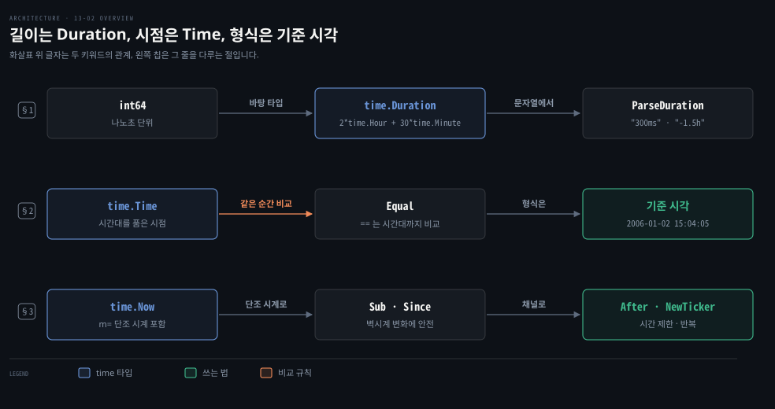
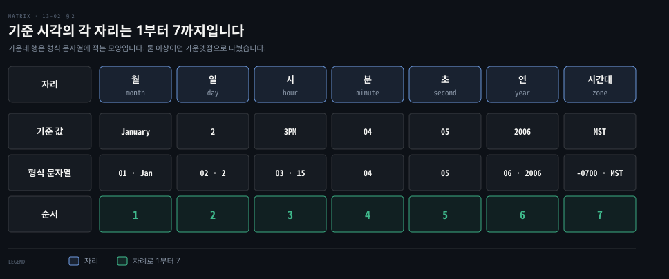

# time 은 Duration 과 Time 두 타입이고 형식은 2006년 1월 2일 기준 시각으로 씁니다

---

> Learning Go 13장 둘째 부분입니다. 시간의 길이를 나타내는 `time.Duration` 과 시점을 나타내는 `time.Time`, 2006년 1월 2일 오후 3시 4분 5초를 기준으로 쓰는 형식 문자열, 벽시계와 단조 시계, 그리고 타이머와 Ticker 를 다룹니다.

## 핵심 요약

> 이 편이 매달린 하나의 생각은 시간의 길이와 시점을 다른 타입으로 나누고, 형식 문자열은 기준 시각 하나로 적는다는 것입니다.

`time.Duration` 은 `int64` 를 바탕으로 한 나노초 단위의 길이이고, `time.Hour` 같은 타입 있는 상수로 `2*time.Hour + 30*time.Minute` 처럼 씁니다. `time.Time` 은 시간대를 품은 시점이라 `==` 가 아니라 `Equal` 로 비교합니다. 형식은 `01/02 03:04:05PM '06 -0700` 이라는 기준 시각을 원하는 모양으로 적어 정합니다.

`time.Now` 로 만든 값은 단조 시계도 품습니다. 그래서 `Sub` 로 구한 경과 시간은 서머타임이나 NTP 로 벽시계가 움직여도 틀리지 않습니다. `time.After` 는 한 번, `time.Tick` 은 반복해서 값을 주는 채널을 돌려줍니다. 원문은 `time.Tick` 대신 멈출 수 있는 `time.NewTicker` 를 쓰라고 하는데, Go 1.23 부터는 이 사정이 바뀌었습니다.


## 학습 목표

> 이 편을 읽고 나면 아래 다섯 가지를 스스로 해낼 수 있습니다.

1. `time.Duration` 과 `time.Time` 이 각각 무엇을 나타내는지, `Duration` 상수가 타입 있는 상수의 좋은 예인 이유를 말할 수 있습니다.
2. 두 `time.Time` 을 `==` 로 비교하면 안 되는 이유를 말할 수 있습니다.
3. 기준 시각으로 원하는 형식 문자열을 쓰고, 기준 시각이 왜 그 날짜인지 설명할 수 있습니다.
4. 벽시계와 단조 시계가 왜 따로 있고, `Sub` 가 어느 쪽을 쓰는지 말할 수 있습니다.
5. `time.After`·`time.Tick`·`time.AfterFunc`·`time.NewTicker` 의 쓰임을 구별할 수 있습니다.

아래는 이 편의 키워드를 이은 개념도입니다. 첫 줄은 `int64` 바탕의 `Duration` 을 타입 있는 상수로 만들고 `ParseDuration` 으로 읽는 흐름입니다. 둘째 줄은 시간대를 품은 `Time` 을 `Equal` 로 비교하고 기준 시각으로 형식을 적는 흐름입니다. 셋째 줄은 `time.Now` 의 단조 시계가 `Sub` 를 지키고, 타이머 채널이 12장의 시간 제한에 쓰인다는 연결입니다. 왼쪽 칩이 그 줄을 다루는 절입니다.




## 1. time.Duration — int64 바탕의 길이

> 시간의 길이는 `int64` 를 바탕으로 한 `time.Duration` 이 나타내며 가장 작은 단위는 나노초입니다. `time.Hour`·`time.Minute` 같은 타입 있는 상수로 곱하고 더해 읽기 쉽고 타입 안전하게 씁니다.

타임아웃을 정수 `30` 으로 넘기는 API 를 생각해 봅시다. 30초인지 30밀리초인지는 코드만 봐서는 모르고, 단위를 잘못 넘겨도 컴파일러가 잡지 못합니다. Go 의 `time` 패키지는 길이와 시점을 각자의 타입으로 나눠 이 문제를 풉니다. 주된 타입은 길이를 나타내는 `time.Duration` 과 시점을 나타내는 `time.Time` 둘입니다.

시간의 길이는 `int64` 를 바탕으로 한 타입 `time.Duration` 이 나타냅니다. Go 가 나타낼 수 있는 가장 작은 시간은 1나노초입니다. `time` 패키지는 나노초·마이크로초·밀리초·초·분·시를 나타내는 `time.Duration` 타입 상수를 정의합니다. 2시간 30분은 이렇게 씁니다.

```go
d := 2*time.Hour + 30*time.Minute // d is of type time.Duration
```

원문은 이 상수들이 `time.Duration` 을 읽기 쉽고 타입 안전하게 만든다고 말합니다. 타입 있는 상수를 잘 쓴 예입니다. 타입 있는 상수와 없는 상수는 02-02 §3 에서 다뤘습니다. 이 노트의 재현에서 `d` 를 찍으니 `2h30m0s` 였고 `d.Minutes()` 는 150 이었습니다.

Go 는 숫자를 이어 쓴 합리적인 문자열 형식을 정의합니다. `time.ParseDuration` 은 그것을 `time.Duration` 으로 바꿉니다. 원문이 옮긴 표준 라이브러리 문서의 설명은 이렇습니다. 기간 문자열은 부호가 붙을 수 있는 십진수의 연속이며 각각 소수부와 단위 접미사를 가질 수 있습니다. 예는 "300ms", "-1.5h", "2h45m" 입니다. 쓸 수 있는 단위는 "ns", "us"(또는 "µs"), "ms", "s", "m", "h" 입니다. 이 노트에서 `time.ParseDuration("-1.5h")` 는 `-1h30m0s` 였습니다.

`time.Duration` 에는 메서드가 여럿 있습니다. `fmt.Stringer` 인터페이스를 만족해 `String` 메서드로 형식을 갖춘 기간 문자열을 돌려줍니다. 값을 시·분·초·밀리초·마이크로초·나노초 수로 얻는 메서드도 있습니다. `Truncate` 와 `Round` 는 정한 `time.Duration` 단위로 자르거나 반올림합니다. 2시간 30분을 `time.Hour` 로 자르면 `2h0m0s`, 반올림하면 `3h0m0s` 였습니다.

Java 의 `java.time.Duration` 과 같은 자리이지만, Go 는 따로 객체를 만들지 않고 정수를 바탕으로 한 타입에 상수를 곱합니다. `Duration.ofHours(2).plusMinutes(30)` 이 `2*time.Hour + 30*time.Minute` 이 됩니다. 이 비교는 원문 밖입니다.


## 2. time.Time — 시간대를 품은 시점과 기준 시각 형식

> 시점은 시간대를 품은 `time.Time` 이 나타내며, 같은 순간이라도 시간대가 다르면 `==` 는 거짓이니 `Equal` 로 비교합니다. 형식은 2006년 1월 2일 오후 3시 4분 5초 MST 라는 기준 시각을 원하는 모양으로 적어 정합니다.

서울에서 찍은 오후 6시와 UTC 오전 9시는 같은 순간입니다. 그런데 두 값을 코드에서 같다고 판단하려면 시점이 시간대까지 품고 있어야 합니다. Go 에서 시점은 시간대까지 갖춘 `time.Time` 이 나타냅니다. `time.Now` 함수는 현재 지역 시각으로 설정된 `time.Time` 을 돌려줍니다.

원문의 팁은 `time.Time` 이 시간대를 품으니 두 `time.Time` 이 같은 순간인지 `==` 로 확인하지 말라고 합니다. 시간대를 보정하는 `Equal` 메서드를 쓰라고 합니다. 이 노트에서 UTC 오전 9시와, 그것을 `In` 으로 KST 로 바꾼 값을 비교하니 `==` 는 `false`, `Equal` 은 `true` 였습니다.

### 기준 시각으로 형식을 적습니다

`time.Parse` 는 문자열을 `time.Time` 으로 바꿉니다. `Format` 메서드는 `time.Time` 을 문자열로 바꿉니다. 원문은 Go 가 대개 과거에 잘 통한 생각을 받아들이지만 날짜·시각 형식에는 자기만의 언어를 쓴다고 말합니다. 2006년 1월 2일 오후 3시 4분 5초 MST(Mountain Standard Time)라는 날짜와 시각을 원하는 모양으로 적어 형식을 정합니다.

원문의 메모는 왜 그 날짜인지 설명합니다. 각 부분이 1부터 7까지의 수를 차례로 나타내기 때문입니다. 곧 `01/02 03:04:05PM '06 -0700` 이고, MST 는 UTC 보다 7시간 늦습니다. 아래 도식이 이 대응을 보입니다.



```go
t, err := time.Parse("2006-01-02 15:04:05 -0700", "2023-03-13 00:00:00 +0000")
if err != nil {
	return err
}
fmt.Println(t.Format("January 2, 2006 at 3:04:05PM MST"))
```

```bash
March 13, 2023 at 12:00:00AM UTC
```

원문 인쇄본은 입력 문자열 끝의 `+0000"` 가 잘렸고, 위 코드는 원문 출력과 대조해 노트가 채운 것입니다.

원문은 이 기준 시각이 영리한 기억법이라지만 자기는 기억하기 어려워 쓸 때마다 찾아본다고 말합니다. 다행히 가장 흔한 형식은 `time` 패키지에 상수로 있습니다. 이 노트의 go1.25.1 에서 `time.RFC3339` 는 `2006-01-02T15:04:05Z07:00`, `time.DateTime` 은 `2006-01-02 15:04:05`, `time.Kitchen` 은 `3:04PM` 이었습니다.

### 원문 출력의 UTC 는 로컬 시간대에 달려 있습니다

이 노트를 쓰면서 위 코드를 로컬 시간대만 바꿔 돌렸습니다. 원문처럼 `UTC` 가 찍힌 것은 `TZ=UTC`·`Etc/UTC`·빈 `TZ` 처럼 약어가 UTC 인 시간대일 때뿐이었습니다. 서울과 뉴욕에서는 `March 13, 2023 at 12:00:00AM +0000`, 런던에서는 `GMT` 가 찍혔습니다.

`time.Parse` 문서가 이유를 말합니다. `-0700` 같은 오프셋을 읽을 때 그 오프셋이 현재 로컬 시간대의 것과 맞으면 그 시간대 이름을 씁니다. 맞지 않으면 그 오프셋에 고정된 이름 없는 위치를 만들고, `MST` 자리에는 `+0000` 이 찍힙니다. 3월 13일 런던의 오프셋은 0 이라 `GMT` 가 붙었습니다. 원문 출력은 틀린 것이 아니라 UTC 로 설정된 환경의 결과이니, 시간대 이름이 필요하면 `In(time.UTC)` 로 명시하는 편이 안전합니다. 이 재현과 해석은 원문 밖입니다.

### 부분을 꺼내고 더하고 비교합니다

`time.Duration` 처럼 `time.Time` 에도 부분을 꺼내는 메서드가 있습니다. `Day`·`Month`·`Year`·`Hour`·`Minute`·`Second`·`Weekday` 가 있습니다. `Clock` 은 시각 부분을 시·분·초 `int` 셋으로, `Date` 는 연·월·일 셋으로 돌려줍니다. 두 `time.Time` 은 `After`·`Before`·`Equal` 로 비교합니다.

`Sub` 는 두 `time.Time` 사이의 경과 시간을 `time.Duration` 으로 돌려줍니다. `Add` 는 `time.Duration` 만큼 뒤의 `time.Time` 을 돌려주고, `AddDate` 는 연·월·일 수만큼 늘린 새 `time.Time` 을 돌려줍니다. `time.Duration` 처럼 `Truncate`·`Round` 도 있습니다. 원문은 이 메서드가 모두 값 리시버에 정의되어 `time.Time` 인스턴스를 바꾸지 않는다고 말합니다. 값 리시버는 07-01 §3 에서 다뤘습니다.

원문 밖 보충입니다. `AddDate` 는 넘친 날짜를 정규화합니다. 2023년 1월 31일에 한 달을 더하니 2월 31일이 3월 3일로 넘어가 `2023-03-03` 이 되었습니다. 월말 계산에 `AddDate` 를 쓸 때는 이 점을 조심해야 합니다.

Java 로 보면 `time.Time` 은 `ZonedDateTime` 에 가깝고, 형식은 `DateTimeFormatter.ofPattern("yyyy-MM-dd HH:mm:ss")` 의 기호 대신 기준 시각의 숫자로 적습니다. `ZonedDateTime` 도 `equals` 는 시간대까지 보고 `isEqual` 은 순간만 비교하니, `==` 와 `Equal` 의 구분과 같습니다. 이 비교는 원문 밖입니다.


## 3. 단조 시계와 타이머

> 벽시계는 서머타임·윤초·NTP 로 앞뒤로 움직일 수 있어, Go 는 `time.Now` 로 만든 값에 단조 시계도 담아 경과 시간을 잽니다. `time.After`·`time.Tick` 은 시간이 지나면 값을 주는 채널을 돌려줍니다.

대부분의 운영 체제는 두 종류의 시간을 기록합니다.

현재 시각에 대응하는 **벽시계**(wall clock)와, 컴퓨터가 부팅한 뒤부터 세는 **단조 시계**(monotonic clock)입니다.

두 시계를 기록하는 이유는 벽시계가 고르게 늘지 않기 때문입니다. 서머타임, 윤초, NTP(Network Time Protocol) 갱신이 벽시계를 예상 밖으로 앞뒤로 움직입니다. 그러면 타이머를 걸거나 경과 시간을 구할 때 문제가 생깁니다.

Go 는 이 문제를 풀려고 타이머를 걸거나 `time.Now` 로 `time.Time` 을 만들 때마다 단조 시간으로 경과 시간을 추적합니다. 이 지원은 보이지 않고 타이머는 자동으로 씁니다. `Sub` 는 두 `time.Time` 에 모두 단조 시간이 있으면 그것으로 `time.Duration` 을 구합니다. 둘 중 하나라도 `time.Now` 로 만든 것이 아니라 단조 시간이 없으면 인스턴스에 적힌 시각으로 구합니다.

원문의 메모는 단조 시간을 제대로 다루지 않아 생길 수 있는 문제가 궁금하면, 예전 Go 버전에 단조 시간 지원이 없어 생긴 버그를 다룬 Cloudflare 블로그 글을 보라고 합니다.

이 노트의 재현에서 `time.Now()` 를 찍으니 `2026-09-28 04:33:44.851714 +0900 KST m=+0.000105918` 처럼 끝에 `m=` 이 붙었습니다. 이것이 품고 있는 단조 시계 값입니다. `Round(0)` 을 부르면 이 부분이 떨어져 나가 `m=` 없이 찍혔습니다. 이 관찰은 원문 밖입니다.

### 타이머와 시간 제한

12-03 §4 에서 본 대로 `time` 패키지에는 정한 시간이 지나면 값을 내보내는 채널을 돌려주는 함수가 있습니다. `time.After` 가 돌려준 채널은 한 번 값을 내보냅니다. `time.Tick` 이 돌려준 채널은 정한 `time.Duration` 이 지날 때마다 새 값을 내보냅니다. 이것들은 Go 의 동시성과 함께 시간 제한이나 반복 작업에 쓰입니다.

`time.AfterFunc` 로 정한 `time.Duration` 뒤에 함수 하나를 실행할 수도 있습니다. 원문은 사소한 프로그램이 아니면 `time.Tick` 을 쓰지 말라고 말합니다. 그 아래의 `time.Ticker` 를 멈출 수 없어 가비지 컬렉션되지 않는다는 이유입니다. 대신 `time.NewTicker` 를 쓰라고 합니다. 이 함수가 돌려주는 `*time.Ticker` 는 들을 채널과 함께, Ticker 를 재설정하고 멈추는 메서드를 가집니다.

> **원문 밖 보충**: Go 1.23 부터 이 사정이 바뀌었습니다. 이 노트의 go1.25.1 에서 `go doc time.Tick` 은 "Go 1.23 부터 가비지 컬렉터가 멈추지 않은 Ticker 도 참조가 없으면 회수한다" 고 적습니다. 예전 문서의 경고는 1.23 전의 것이라고 밝힙니다. Go 1.23 릴리스 노트도 멈추지 않은 Timer·Ticker 가 참조를 잃으면 바로 회수 대상이 된다고 적습니다. 다만 이 새 동작은 go.mod 의 `go` 지시어가 1.23 이상일 때 켜집니다. 10-01 §3 에서 본 것처럼 옛 지시어의 모듈에서는 원문의 조언이 여전히 맞습니다. 멈추거나 재설정해야 한다면 여전히 `NewTicker` 가 필요합니다.

Spring 의 `@Scheduled(fixedRate = 1000)` 가 반복 작업을 선언으로 거는 자리를, Go 는 `time.NewTicker` 의 채널과 for-select 루프로 코드에 드러냅니다. 이 비교는 원문 밖입니다.


## 핵심 개념 체크리스트

목표 번호 순서대로 짝지었습니다.

- [ ] (목표 1) `time.Sleep(2)` 는 얼마나 잠듭니까? `time.Sleep(2 * time.Second)` 와 무엇이 다릅니까?
- [ ] (목표 2) 같은 순간을 UTC 와 KST 로 담은 두 `time.Time` 을 `==` 로 비교하면 무엇이 나옵니까?
- [ ] (목표 3) `2023-03-13 00:00` 을 `13/03/2023` 모양으로 찍는 형식 문자열을 쓸 수 있습니까?
- [ ] (목표 3) 형식 문자열에서 월이 `01`, 시가 `03` 또는 `15` 인 이유를 말할 수 있습니까?
- [ ] (목표 4) NTP 가 벽시계를 뒤로 돌린 순간에 `time.Since(start)` 는 음수가 됩니까?
- [ ] (목표 5) 반복 작업을 멈출 수 있어야 한다면 `time.Tick` 과 `time.NewTicker` 가운데 무엇을 씁니까?


## 관련 문서

- [13-01 io.Reader 는 버퍼를 받아 채우고 작은 인터페이스를 겹쳐 기능을 더합니다](./13-01.io.Reader%20%EB%8A%94%20%EB%B2%84%ED%8D%BC%EB%A5%BC%20%EB%B0%9B%EC%95%84%20%EC%B1%84%EC%9A%B0%EA%B3%A0%20%EC%9E%91%EC%9D%80%20%EC%9D%B8%ED%84%B0%ED%8E%98%EC%9D%B4%EC%8A%A4%EB%A5%BC%20%EA%B2%B9%EC%B3%90%20%EA%B8%B0%EB%8A%A5%EC%9D%84%20%EB%8D%94%ED%95%A9%EB%8B%88%EB%8B%A4.md) — 13장 첫째. io
- [13-03 encoding/json 은 구조체 태그로 이름을 정하고 Decoder 와 Encoder 로 스트림을 다룹니다](./13-03.encoding-json%20%EC%9D%80%20%EA%B5%AC%EC%A1%B0%EC%B2%B4%20%ED%83%9C%EA%B7%B8%EB%A1%9C%20%EC%9D%B4%EB%A6%84%EC%9D%84%20%EC%A0%95%ED%95%98%EA%B3%A0%20Decoder%20%EC%99%80%20Encoder%20%EB%A1%9C%20%EC%8A%A4%ED%8A%B8%EB%A6%BC%EC%9D%84%20%EB%8B%A4%EB%A3%B9%EB%8B%88%EB%8B%A4.md) — 13장 셋째. JSON
- [12-03 버퍼 채널은 개수를 알 때 쓰고 WaitGroup 과 Once 가 기다림과 한 번 실행을 맡습니다](./12-03.%EB%B2%84%ED%8D%BC%20%EC%B1%84%EB%84%90%EC%9D%80%20%EA%B0%9C%EC%88%98%EB%A5%BC%20%EC%95%8C%20%EB%95%8C%20%EC%93%B0%EA%B3%A0%20WaitGroup%20%EA%B3%BC%20Once%20%EA%B0%80%20%EA%B8%B0%EB%8B%A4%EB%A6%BC%EA%B3%BC%20%ED%95%9C%20%EB%B2%88%20%EC%8B%A4%ED%96%89%EC%9D%84%20%EB%A7%A1%EC%8A%B5%EB%8B%88%EB%8B%A4.md) — 12장. 시간 제한
- [02-02 var 와 짧은 선언은 의도를 드러내는 선택입니다](./02-02.var%20%EC%99%80%20%EC%A7%A7%EC%9D%80%20%EC%84%A0%EC%96%B8%EC%9D%80%20%EC%9D%98%EB%8F%84%EB%A5%BC%20%EB%93%9C%EB%9F%AC%EB%82%B4%EB%8A%94%20%EC%84%A0%ED%83%9D%EC%9E%85%EB%8B%88%EB%8B%A4.md) — 2장. 타입 있는 상수
- [Learning Go 2판 — 정독 인덱스](./README.md) — 16장 전체 지도


## 참고 자료

- 원본: 《Learning Go, 2nd Edition》 (Jon Bodner, O'Reilly)
- 다룬 범위: Chapter 13 "time" 부터 "Timers and Timeouts" 까지
- [time 패키지](https://pkg.go.dev/time) — ParseDuration·Parse·단조 시계 설명
- [How and why the leap second affected Cloudflare DNS](https://blog.cloudflare.com/how-and-why-the-leap-second-affected-cloudflare-dns/) — 원문이 가리킨 Cloudflare 글
- [Go 1.23 릴리스 노트](https://go.dev/doc/go1.23) — Timer·Ticker 회수 변경
