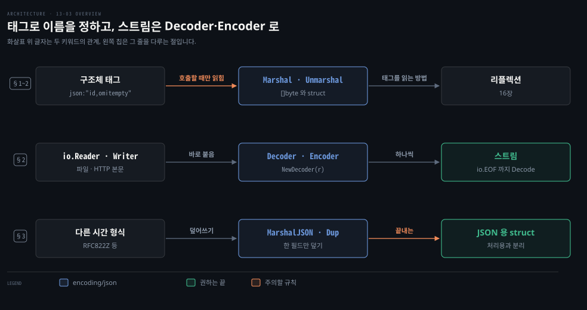
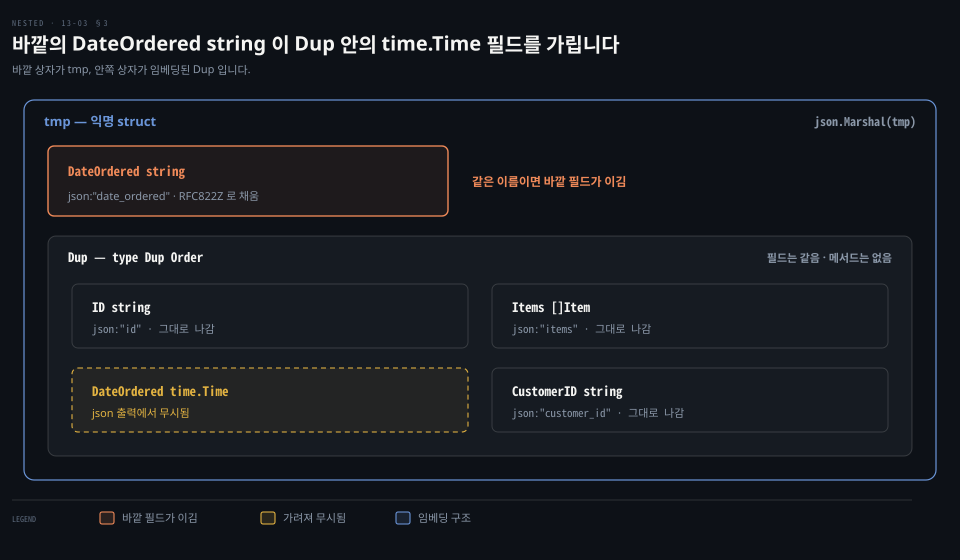

# encoding/json 은 구조체 태그로 이름을 정하고 Decoder 와 Encoder 로 스트림을 다룹니다

---

> Learning Go 13장 셋째 부분입니다. 구조체 태그로 JSON 필드 이름과 생략 규칙을 정하는 법, `json.Marshal`·`Unmarshal`, `io.Reader`·`io.Writer` 와 붙는 `json.Decoder`·`Encoder`, 여러 JSON 값의 스트림, 그리고 기본 동작을 바꾸는 사용자 정의 파싱을 다룹니다.

## 핵심 요약

> 이 편이 매달린 하나의 생각은 JSON 변환 규칙을 코드 밖의 마법이 아니라 필드 옆의 태그와 명시적인 함수 호출로 드러낸다는 것입니다.

구조체 태그 `json:"id"` 가 JSON 필드 이름을, `-` 는 무시를, `,omitempty` 는 빈 값 생략을 정합니다. 필드는 내보낸 것이어야 `encoding/json` 이 봅니다. 태그는 자동으로 평가되지 않고 구조체를 `json.Marshal`·`Unmarshal` 에 넘길 때만 처리됩니다. `Unmarshal` 은 `io.Reader` 처럼 넘긴 포인터를 채웁니다.

파일이나 네트워크처럼 `io.Reader`·`io.Writer` 인 데이터는 `json.NewDecoder`·`NewEncoder` 로 바로 읽고 씁니다. 여러 JSON 값이 이어진 스트림도 `Decode` 를 `io.EOF` 까지 되풀이해 읽습니다. 기본 규칙과 다른 필드는 `MarshalJSON`·`UnmarshalJSON` 을 가진 타입으로 바꾸거나 임베딩과 `Dup` 타입으로 그 필드만 덮어씁니다. 원문은 JSON 용 struct 와 비즈니스 struct 를 나누라고 권합니다.


## 학습 목표

> 이 편을 읽고 나면 아래 다섯 가지를 스스로 해낼 수 있습니다.

1. 구조체 태그로 JSON 이름·무시·생략을 정하고, `omitempty` 가 struct 제로 값을 생략하지 않는 이유를 말할 수 있습니다.
2. Go 가 Java 의 어노테이션 처리 대신 태그를 명시적 함수 호출에서만 처리하는 이유를 말할 수 있습니다.
3. `json.Unmarshal` 과 `json.Decoder` 가운데 무엇을 쓸지 데이터 출처로 고를 수 있습니다.
4. 여러 JSON 값이 이어진 스트림을 `Decoder` 로 하나씩 읽는 루프를 쓸 수 있습니다.
5. `MarshalJSON` 안에서 `Dup` 타입을 만들지 않으면 왜 스택이 넘치는지 말하고, JSON 형식을 비즈니스 로직에서 떼는 방법을 말할 수 있습니다.

아래는 이 편의 키워드를 이은 개념도입니다. 첫 줄은 구조체 태그가 필드 이름과 생략을 정하고 `Marshal`·`Unmarshal` 이 호출될 때만 읽힌다는 흐름입니다. 둘째 줄은 `io.Reader`·`io.Writer` 에 붙는 `Decoder`·`Encoder` 로 스트림을 하나씩 다루는 흐름입니다. 셋째 줄은 기본 규칙과 다른 필드를 사용자 정의 타입이나 `Dup` 임베딩으로 덮어쓰고, 끝내는 JSON 용 struct 를 따로 두는 선택지입니다. 왼쪽 칩이 그 줄을 다루는 절입니다.




## 1. 구조체 태그로 메타데이터를 붙입니다

> JSON 필드 이름은 필드 뒤의 구조체 태그 `json:"이름"` 으로 정합니다. 태그는 컴파일러가 검사하지 않지만 `go vet` 이 검사하며, 자동으로 평가되지 않고 구조체를 처리 함수에 넘길 때만 쓰입니다.

REST API 는 JSON 을 서비스 사이의 표준 통신 수단으로 굳혔습니다. Go 표준 라이브러리는 Go 데이터 타입과 JSON 사이의 변환을 지원합니다. **마셜링**(marshaling)은 Go 데이터 타입을 인코딩으로 바꾸는 것이고 **언마셜링**(unmarshaling)은 Go 데이터 타입으로 바꾸는 것입니다.

원문의 예는 주문 관리 시스템입니다. 다음 JSON 을 읽고 써야 합니다.

```json
{
  "id": "12345",
  "date_ordered": "2020-05-01T13:01:02Z",
  "customer_id": "3",
  "items": [{"id": "xyz123", "name": "Thing 1"}, {"id": "abc789", "name": "Thing 2"}]
}
```

JSON 의 키는 `date_ordered` 처럼 소문자와 밑줄로 씁니다. 그런데 `encoding/json` 이 읽고 쓰는 Go 필드는 패키지 밖에 보이도록 대문자로 시작해야 합니다. 이름이 어긋나니 둘을 잇는 규칙이 필요하고 그 규칙이 구조체 태그입니다. 이 데이터에 맞춰 타입을 정의합니다.

```go
type Order struct {
	ID          string    `json:"id"`
	DateOrdered time.Time `json:"date_ordered"`
	CustomerID  string    `json:"customer_id"`
	Items       []Item    `json:"items"`
}

type Item struct {
	ID   string `json:"id"`
	Name string `json:"name"`
}
```

JSON 처리 규칙은 **구조체 태그**(struct tag)로 정합니다. 구조체 필드 뒤에 쓰는 문자열입니다. 백틱으로 감싼 문자열이지만 한 줄을 넘을 수 없습니다. 태그는 `tagName:"tagValue"` 로 쓰는 태그/값 쌍 하나 이상을 빈칸으로 나눠 이룹니다. 그냥 문자열이라 컴파일러는 형식이 맞는지 검사하지 못하지만 `go vet` 은 검사합니다.

이 노트를 쓰면서 콜론 뒤에 빈칸을 넣은 `json: "name"` 태그로 `go vet` 을 돌렸습니다. `struct field tag` … `not compatible with reflect.StructTag.Get: bad syntax for struct tag value` 가 나왔습니다. 이 재현은 원문 밖입니다.

필드가 모두 내보낸 것이라는 점도 봐야 합니다. 다른 패키지처럼 `encoding/json` 의 코드도 다른 패키지 struct 의 내보내지 않은 필드에 접근하지 못합니다.

### 이름·무시·생략

JSON 처리에는 `json` 태그로 struct 필드에 대응할 JSON 필드 이름을 정합니다. `json` 태그가 없으면 JSON 객체의 필드 이름이 Go struct 필드 이름과 같다고 봅니다. 원문은 이름이 같더라도 태그로 이름을 명시하는 것이 가장 좋다고 말합니다.

원문의 메모는 태그 없는 필드의 규칙을 적습니다. JSON 에서 태그 없는 struct 필드로 언마셜할 때는 이름을 대소문자 구분 없이 맞춥니다. 태그 없는 struct 필드를 JSON 으로 마셜하면 필드가 내보낸 것이라 JSON 필드 이름은 늘 대문자로 시작합니다. 이 노트에서 태그 없는 `NoTag` 필드는 `"NoTag"` 로 나갔고, `{"notag":"lower"}` 를 언마셜하니 `lower` 가 들어갔습니다.

마셜링·언마셜링에서 빼야 할 필드는 이름에 대시(`-`)를 씁니다. 비었을 때 출력에서 빼려면 이름 뒤에 `,omitempty` 를 붙입니다. 예를 들어 `CustomerID` 가 빈 문자열일 때 출력에서 빼려면 태그를 `json:"customer_id,omitempty"` 로 씁니다.

원문의 경고는 "빈 값" 의 정의가 기대와 달리 제로 값과 딱 맞지 않는다고 말합니다. struct 의 제로 값은 빈 값으로 치지 않지만 길이 0 인 slice 나 map 은 빈 값입니다. 이 노트에서 제로 값 struct 필드에 `omitempty` 를 달아도 `"empty":{"A":0}` 로 나갔습니다. 길이 0 인 slice 와 map 은 빠졌습니다. `time.Time` 제로 값도 `"t":"0001-01-01T00:00:00Z"` 로 나갔습니다.

> **원문 밖 보충**: Go 1.24 는 이 문제를 위해 `omitzero` 태그 옵션을 더했습니다. 값이 제로 값이면 생략하고, 필드 타입에 `IsZero() bool` 메서드가 있으면 그것으로 판단한다고 릴리스 노트는 적습니다. 이 노트에서 `time.Time` 필드에 `json:"tz,omitzero"` 를 다니 제로 값일 때 출력에서 빠졌습니다.

### 태그는 호출할 때만 처리됩니다

원문은 구조체 태그가 메타데이터로 프로그램 동작을 조절하게 한다고 말합니다. 다른 언어, 특히 Java 는 프로그램 요소에 어노테이션을 달아 처리 방식을 설명하도록 권합니다. 무엇이 그 어노테이션을 처리하는지는 명시하지 않습니다. 선언형 프로그래밍은 프로그램을 짧게 만들지만 메타데이터를 자동으로 처리하면 프로그램 동작을 이해하기 어려워집니다.

원문은 이런 순간을 말합니다. 무언가 잘못되었는데 어느 코드가 어떤 어노테이션을 처리하고 무엇을 바꿨는지 몰라 당황하는 순간입니다. 어노테이션이 많은 큰 Java 프로젝트에서 일해 본 사람이라면 겪어 봤을 일입니다. Go 는 짧은 코드보다 명시적인 코드를 택합니다. 구조체 태그는 절대 자동으로 평가되지 않고 구조체 인스턴스를 함수에 넘길 때 처리됩니다.

Spring 에서 `@Transactional` 이 프록시를 통해 적용되는지 몰라 같은 클래스 안의 호출에서 트랜잭션이 빠지는 일이 원문이 말하는 "당황하는 순간" 의 흔한 예입니다. 이 예는 원문 밖입니다.


## 2. Marshal·Unmarshal 과 Decoder·Encoder

> `json.Unmarshal` 은 바이트 slice 를 넘긴 포인터에 채우고 `json.Marshal` 은 바이트 slice 를 돌려줍니다. 데이터가 `io.Reader`·`io.Writer` 에 있으면 `json.NewDecoder`·`NewEncoder` 로 바로 읽고 쓰며, 여러 값이 이어진 스트림도 하나씩 다룹니다.

`encoding/json` 의 `Unmarshal` 함수는 바이트 slice 를 struct 로 바꿉니다. `data` 라는 문자열이 있으면 `Order` 로 바꾸는 코드는 이렇습니다.

```go
var o Order
err := json.Unmarshal([]byte(data), &o)
if err != nil {
	return err
}
```

`json.Unmarshal` 은 `io.Reader` 구현처럼 입력 매개변수를 채웁니다. 06-02 §2 에서 본 대로 이렇게 하면 같은 struct 를 거듭 다시 쓸 수 있어 메모리 사용을 조절할 수 있습니다. `Order` 인스턴스를 다시 JSON 으로 쓸 때는 `json.Marshal` 을 쓰고 결과는 바이트 slice 에 담깁니다.

```go
out, err := json.Marshal(o)
```

원문은 여기서 질문 둘이 생긴다고 말합니다. 구조체 태그를 어떻게 평가할까요? `json.Marshal`·`Unmarshal` 은 어떻게 아무 타입의 struct 나 읽고 쓸까요? 지금까지 쓴 메서드는 모두 컴파일할 때 알려진 타입만 다뤘습니다. 타입 스위치의 타입도 미리 나열했습니다. 두 질문의 답은 **리플렉션**(reflection)이고, 16장에서 다룹니다.

### Decoder·Encoder 는 io 와 바로 붙습니다

`json.Marshal`·`Unmarshal` 은 바이트 slice 를 다룹니다. 그런데 13-01 에서 본 대로 Go 의 데이터 소스와 싱크는 대부분 `io.Reader`·`io.Writer` 를 구현합니다. `io.ReadAll` 로 `io.Reader` 의 내용을 통째로 바이트 slice 에 복사해 `json.Unmarshal` 에 넘겨도 되지만 비효율적입니다. 마찬가지로 `json.Marshal` 로 메모리 버퍼에 쓴 뒤 그것을 네트워크나 디스크에 쓸 수도 있지만 `io.Writer` 에 바로 쓰는 편이 낫습니다.

`encoding/json` 의 `json.Decoder`·`json.Encoder` 는 각각 `io.Reader`·`io.Writer` 를 만족하는 무엇이든 읽고 씁니다. 원문의 예는 간단한 struct 입니다.

```go
type Person struct {
	Name string `json:"name"`
	Age  int    `json:"age"`
}
toFile := Person{
	Name: "Fred",
	Age:  40,
}
```

`os.File` 은 `io.Reader`·`io.Writer` 를 모두 구현하니 두 타입을 보이기에 좋습니다. 임시 파일을 `json.NewEncoder` 에 넘겨 `json.Encoder` 를 얻고 `Encode` 로 `toFile` 을 씁니다.

```go
tmpFile, err := os.CreateTemp(os.TempDir(), "sample-")
if err != nil {
	panic(err)
}
defer os.Remove(tmpFile.Name())
err = json.NewEncoder(tmpFile).Encode(toFile)
if err != nil {
	panic(err)
}
err = tmpFile.Close()
if err != nil {
	panic(err)
}
```

다시 읽을 때는 임시 파일을 `json.NewDecoder` 에 넘기고 돌려받은 `json.Decoder` 의 `Decode` 에 `Person` 변수를 넘깁니다.

```go
tmpFile2, err := os.Open(tmpFile.Name())
if err != nil {
	panic(err)
}
var fromFile Person
err = json.NewDecoder(tmpFile2).Decode(&fromFile)
if err != nil {
	panic(err)
}
err = tmpFile2.Close()
if err != nil {
	panic(err)
}
fmt.Printf("%+v\n", fromFile)
```

저장소의 json 예제는 `{Name:Fred Age:40}` 을 찍었습니다.

### 여러 JSON 값의 스트림

JSON struct 여럿을 한꺼번에 읽거나 써야 하면 어떻게 할까요? 원문은 여기에도 `json.Decoder`·`Encoder` 를 쓴다고 말합니다. 다음 데이터가 `streamData` 문자열에 있다고 합시다. 파일이나 들어오는 HTTP 요청에 있어도 됩니다.

```json
{"name": "Fred", "age": 40}
{"name": "Mary", "age": 21}
{"name": "Pat", "age": 30}
```

앞서처럼 데이터 소스로 `json.Decoder` 를 만듭니다. 이번에는 오류가 날 때까지 `for` 루프를 돕니다. 오류가 `io.EOF` 면 모든 데이터를 잘 읽은 것이며 아니면 JSON 스트림에 문제가 있는 것입니다. 이렇게 JSON 객체를 하나씩 읽고 처리합니다.

```go
var t struct {
	Name string `json:"name"`
	Age  int    `json:"age"`
}

dec := json.NewDecoder(strings.NewReader(streamData))
for {
	err := dec.Decode(&t)
	if err != nil {
		if errors.Is(err, io.EOF) {
			break
		}
		panic(err)
	}
	// process t
}
```

여러 값을 쓰는 것도 하나를 쓸 때와 같습니다. 이 예는 `bytes.Buffer` 에 쓰지만 `io.Writer` 를 만족하는 어떤 타입이든 됩니다.

```go
var b bytes.Buffer
enc := json.NewEncoder(&b)
for _, input := range allInputs {
	t := process(input)
	err = enc.Encode(t)
	if err != nil {
		panic(err)
	}
}
out := b.String()
```

저장소의 encode_decode 예제는 `{Fred 40}`·`{Mary 21}`·`{Pat 30}` 을 읽은 뒤 다시 한 줄에 하나씩 `{"name":"Fred","age":40}` 처럼 썼습니다. 원문은 배열로 감싸지 않은 여러 JSON 객체를 다뤘지만 `json.Decoder` 로 배열 전체를 메모리에 올리지 않고 객체를 하나씩 읽을 수도 있다고 말합니다. 성능이 크게 오르고 메모리를 덜 쓴다고 하며, 예는 Go 문서에 있습니다.

Java 의 Jackson 으로 보면 `ObjectMapper.readValue(byte[])` 가 `Unmarshal`, `readValue(InputStream)` 이 `Decoder`, 스트림 읽기는 `MappingIterator` 에 해당합니다. 이 비교는 원문 밖입니다.

### Go 1.27 부터 encoding/json 은 v2 구현 위에서 돕니다

원문 밖 보충입니다. Go 1.25 에 실험 기능으로 들어온 `encoding/json/v2` 와 `encoding/json/jsontext` 가 Go 1.27 에서 정식 패키지가 됐습니다. 릴리스 노트는 `encoding/json` 이 이제 v2 구현 위에서 돌며, 마샬링·언마샬링 동작은 지키되 오류 메시지 문구는 다를 수 있다고 밝힙니다. 호환 문제가 있으면 빌드할 때 `GOEXPERIMENT=nojsonv2` 로 옛 구현을 되돌릴 수 있습니다.

재확인에서 이 장의 예제 출력은 모두 go1.25.1 과 같았습니다. 달라진 것은 중첩 필드의 타입 오류 문구였습니다. 이 노트에서 `{"items":[{"id":1}]}` 을 `id string` 필드에 넣었습니다. go1.25.1 은 `Go struct field Item.items.id`, go1.27.1 은 `Go struct field Order.items.0.id` 라고 적었습니다. 바깥 타입 이름과 배열 인덱스가 경로에 붙은 것입니다. `nojsonv2` 로 빌드하니 옛 문구로 돌아왔습니다. 오류 문자열을 비교하는 테스트(15-02 §1)는 이런 변화에 깨집니다.

v2 패키지를 직접 쓰면 기본값이 더 엄격합니다. 릴리스 노트는 JSON 문자열의 잘못된 UTF-8 과 객체 안의 중복 이름을 거절한다고 적습니다. 이름을 대소문자까지 맞춰 찾는 점과 `omitempty` 의 뜻이 바뀐 점도 go1.27.1 의 `go doc encoding/json` 이 v1 과의 차이로 듭니다. 기존 코드는 v1 API 를 그대로 써도 되고 옮길 의무는 없습니다.


## 3. 사용자 정의 JSON 파싱

> 기본 규칙과 다른 형식의 필드는 `json.Marshaler`·`Unmarshaler` 를 구현한 새 타입으로 다루거나, 임베딩과 `Dup` 타입으로 그 필드만 덮어씁니다. 원문은 끝내 JSON 용 struct 와 처리용 struct 를 나눠 비즈니스 로직을 통신 형식에서 떼라고 권합니다.

기본 기능으로 충분할 때가 많지만 바꿔야 할 때도 있습니다. `time.Time` 은 RFC 3339 형식의 JSON 필드를 기본으로 지원하지만 다른 시간 형식을 다뤄야 할 수 있습니다. 그런 필드는 어떻게 읽고 쓸까요? 그럴 때는 `json.Marshaler`·`json.Unmarshaler` 두 인터페이스를 구현하는 새 타입을 만듭니다.

```go
type RFC822ZTime struct {
	time.Time
}

func (rt RFC822ZTime) MarshalJSON() ([]byte, error) {
	out := rt.Time.Format(time.RFC822Z)
	return []byte(`"` + out + `"`), nil
}

func (rt *RFC822ZTime) UnmarshalJSON(b []byte) error {
	if string(b) == "null" {
		return nil
	}
	t, err := time.Parse(`"`+time.RFC822Z+`"`, string(b))
	if err != nil {
		return err
	}
	*rt = RFC822ZTime{t}
	return nil
}
```

`time.Time` 을 `RFC822ZTime` 이라는 새 struct 에 임베딩해 `time.Time` 의 다른 메서드도 계속 씁니다. 07-01 §3 에서 본 대로 시간 값을 읽는 메서드는 값 리시버에, 바꾸는 메서드는 포인터 리시버에 선언합니다. 그다음 `DateOrdered` 필드의 타입을 `RFC822ZTime` 으로 바꾸면 RFC 822 형식 시간을 다룰 수 있습니다.

저장소의 custom_json 예제는 `"01 May 20 13:01 +0000"` 을 읽어 `DateOrdered:2020-05-01 13:01:00 +0000 +0000` 을 채우고 월로 `May` 를 찍은 뒤 같은 형식으로 다시 썼습니다.

원문은 이 방식에 철학적 단점이 있다고 말합니다. JSON 의 날짜 형식 때문에 데이터 구조의 필드 타입이 정해져 버린다는 것입니다. `Order` 가 `json.Marshaler`·`Unmarshaler` 를 구현하게 하는 방법도 있습니다. 그러면 특별한 처리가 필요 없는 필드까지 모두 코드로 다뤄야 합니다. 구조체 태그 형식에는 특정 필드를 파싱할 함수를 지정하는 방법이 없어서 그 필드에 사용자 정의 타입을 만드는 수밖에 없습니다.

### 임베딩과 Dup 으로 한 필드만 덮어씁니다

원문은 Ukiah Smith 의 블로그 글이 설명한 다른 방법을 소개합니다. 07-02 §3 의 struct 임베딩은 JSON 마셜링·언마셜링과 맞물려 동작합니다. 이 방법은 그 점을 이용해 기본 동작과 맞지 않는 필드만 다시 정의합니다. 임베딩된 struct 의 필드가 바깥 struct 의 필드와 이름이 같으면 JSON 을 마셜링·언마셜링할 때 그 필드는 무시됩니다.

```go
type Order struct {
	ID          string    `json:"id"`
	Items       []Item    `json:"items"`
	DateOrdered time.Time `json:"date_ordered"`
	CustomerID  string    `json:"customer_id"`
}

func (o Order) MarshalJSON() ([]byte, error) {
	type Dup Order

	tmp := struct {
		DateOrdered string `json:"date_ordered"`
		Dup
	}{
		Dup: (Dup)(o),
	}
	tmp.DateOrdered = o.DateOrdered.Format(time.RFC822Z)
	b, err := json.Marshal(tmp)
	return b, err
}
```

`Order` 의 `MarshalJSON` 에서 바탕 타입이 `Order` 인 `Dup` 타입을 정의합니다. 다른 타입을 바탕으로 한 타입은 바탕 타입과 필드는 같지만 메서드는 갖지 않기 때문입니다. `Dup` 이 없으면 `json.Marshal` 을 부를 때 `MarshalJSON` 이 끝없이 다시 불려 결국 스택이 넘칩니다. 07-02 §1 에서 본 대로 타입 선언은 메서드를 물려받지 않습니다.

이 노트를 쓰면서 `Dup` 없이 `MarshalJSON` 안에서 `json.Marshal(o)` 를 부르는 코드를 돌렸습니다. `runtime: goroutine stack exceeds 1000000000-byte limit` 와 `fatal error: stack overflow` 로 끝났습니다. 이 재현은 원문 밖입니다.

익명 struct 는 `DateOrdered` 필드와 임베딩된 `Dup` 을 가집니다. `Order` 인스턴스를 `tmp` 의 임베딩 필드에 대입하고 `tmp` 의 `DateOrdered` 에 RFC822Z 형식 시간을 넣은 뒤 `tmp` 로 `json.Marshal` 을 부릅니다. 바깥의 `DateOrdered` 가 안쪽 `Dup` 의 같은 이름 필드를 가리니 원하는 JSON 이 나옵니다. 아래 도식이 이 구조를 보입니다.



`UnmarshalJSON` 도 같은 논리입니다.

```go
func (o *Order) UnmarshalJSON(b []byte) error {
	type Dup Order

	tmp := struct {
		DateOrdered string `json:"date_ordered"`
		*Dup
	}{
		Dup: (*Dup)(o),
	}

	err := json.Unmarshal(b, &tmp)
	if err != nil {
		return err
	}

	o.DateOrdered, err = time.Parse(time.RFC822Z, tmp.DateOrdered)
	if err != nil {
		return err
	}
	return nil
}
```

`UnmarshalJSON` 에서는 `*Dup` 을 임베딩하므로 `json.Unmarshal` 이 `o` 의 필드를 채웁니다. `DateOrdered` 만 예외입니다. 그다음 `tmp` 의 `DateOrdered` 문자열을 `time.Parse` 로 처리해 `o` 의 `DateOrdered` 를 채웁니다. 저장소의 custom_json2 예제도 같은 결과를 냈고 출력 JSON 에서 `date_ordered` 가 맨 앞에 왔습니다. 익명 struct 의 바깥 필드가 먼저 선언되었기 때문입니다.

### JSON 용 struct 와 처리용 struct 를 나눕니다

원문은 이 방법이 `Order` 에 JSON 형식에 묶인 필드를 두지 않게 해 주지만 `MarshalJSON`·`UnmarshalJSON` 이 JSON 의 시간 형식에 묶인다고 말합니다. 다른 시간 형식의 JSON 을 지원하려고 `Order` 를 다시 쓸 수는 없습니다.

JSON 모양을 신경 쓰는 코드를 줄이려면 struct 를 둘 정의하라고 원문은 권합니다. 하나는 JSON 과 오가는 변환용이고, 다른 하나는 데이터 처리용입니다. JSON 을 JSON 용 타입에 읽어 들인 뒤 다른 타입으로 복사합니다. JSON 을 쓸 때는 반대로 합니다. 중복이 생기지만 비즈니스 로직이 통신 규약에 기대지 않게 됩니다.

Spring 에서 JPA 엔티티를 그대로 JSON 으로 내보내지 않고 요청·응답 DTO 를 따로 두는 관례와 같은 이유입니다. 이 비교는 원문 밖입니다.

### map[string]any 와 다른 인코딩, 그리고 gob

`json.Marshal`·`Unmarshal` 에 `map[string]any` 를 넘겨 JSON 과 Go 사이를 오갈 수도 있습니다. 원문은 이것을 탐색 단계에만 쓰고 무엇을 처리하는지 알게 되면 구체 타입으로 바꾸라고 말합니다. Go 가 타입을 쓰는 데는 이유가 있습니다. 타입은 기대하는 데이터와 그 타입을 문서로 남깁니다.

JSON 이 표준 라이브러리에서 가장 많이 쓰이는 인코더겠지만 XML·Base64 같은 다른 인코더도 있습니다. 표준 라이브러리나 서드파티 모듈에서 원하는 데이터 형식을 찾지 못하면 직접 쓰면 됩니다. 원문은 16장의 「Use Reflection to Write a Data Marshaler」 절에서 인코더를 직접 구현한다고 예고하며, 장 번호는 노트가 찾아 붙였습니다.

원문의 경고는 `encoding/gob` 를 다룹니다. Java 직렬화와 조금 닮은 Go 전용 바이너리 표현입니다. Java 직렬화가 EJB 와 Java RMI 의 통신 규약이듯, gob 는 `net/rpc` 의 Go 전용 RPC 구현의 통신 형식으로 만들어졌습니다. 원문은 `encoding/gob` 도 `net/rpc` 도 쓰지 말라고 말합니다. Go 로 원격 메서드 호출을 하려면 특정 언어에 묶이지 않도록 gRPC 같은 표준 규약을 쓰라고 합니다. Go 를 아무리 좋아해도, 서비스가 쓸모 있으려면 다른 언어 개발자도 부를 수 있어야 한다고 덧붙입니다.


## 핵심 개념 체크리스트

목표 번호 순서대로 짝지었습니다.

- [ ] (목표 1) `password` 필드를 JSON 출력에서 늘 빼려면 태그를 어떻게 씁니까?
- [ ] (목표 1) `Address` struct 필드에 `omitempty` 를 달았는데 제로 값이 출력되는 이유는 무엇입니까?
- [ ] (목표 2) 구조체 태그의 형식 오류를 컴파일러가 아니라 무엇이 잡습니까?
- [ ] (목표 3) HTTP 응답 본문을 읽을 때 `io.ReadAll` 뒤 `Unmarshal` 대신 무엇을 씁니까?
- [ ] (목표 4) 스트림을 읽다 `io.EOF` 가 아닌 오류가 나면 무엇을 뜻합니까?
- [ ] (목표 5) `MarshalJSON` 안에서 `json.Marshal(o)` 를 부르면 무슨 일이 일어납니까?
- [ ] (목표 5) 같은 `Order` 를 두 가지 시간 형식의 JSON 으로 주고받아야 하면 어떤 구조를 택합니까?


## 관련 문서

- [13-02 time 은 Duration 과 Time 두 타입이고 형식은 2006년 1월 2일 기준 시각으로 씁니다](./13-02.time%20%EC%9D%80%20Duration%20%EA%B3%BC%20Time%20%EB%91%90%20%ED%83%80%EC%9E%85%EC%9D%B4%EA%B3%A0%20%ED%98%95%EC%8B%9D%EC%9D%80%202006%EB%85%84%201%EC%9B%94%202%EC%9D%BC%20%EA%B8%B0%EC%A4%80%20%EC%8B%9C%EA%B0%81%EC%9C%BC%EB%A1%9C%20%EC%94%81%EB%8B%88%EB%8B%A4.md) — 13장 둘째. time 과 RFC 형식
- [13-04 net/http 는 타임아웃을 직접 정하고 미들웨어는 Handler 를 감싸며 slog 로 구조화 로그를 남깁니다](./13-04.net-http%20%EB%8A%94%20%ED%83%80%EC%9E%84%EC%95%84%EC%9B%83%EC%9D%84%20%EC%A7%81%EC%A0%91%20%EC%A0%95%ED%95%98%EA%B3%A0%20%EB%AF%B8%EB%93%A4%EC%9B%A8%EC%96%B4%EB%8A%94%20Handler%20%EB%A5%BC%20%EA%B0%90%EC%8B%B8%EB%A9%B0%20slog%20%EB%A1%9C%20%EA%B5%AC%EC%A1%B0%ED%99%94%20%EB%A1%9C%EA%B7%B8%EB%A5%BC%20%EB%82%A8%EA%B9%81%EB%8B%88%EB%8B%A4.md) — 13장 넷째. HTTP 와 slog
- [06-02 포인터 매개변수는 바꿔도 된다는 표시이고 slice 는 길이까지 복사됩니다](./06-02.%ED%8F%AC%EC%9D%B8%ED%84%B0%20%EB%A7%A4%EA%B0%9C%EB%B3%80%EC%88%98%EB%8A%94%20%EB%B0%94%EA%BF%94%EB%8F%84%20%EB%90%9C%EB%8B%A4%EB%8A%94%20%ED%91%9C%EC%8B%9C%EC%9D%B4%EA%B3%A0%20slice%20%EB%8A%94%20%EA%B8%B8%EC%9D%B4%EA%B9%8C%EC%A7%80%20%EB%B3%B5%EC%82%AC%EB%90%A9%EB%8B%88%EB%8B%A4.md) — 6장. Unmarshal 이 포인터를 받는 이유
- [07-02 타입 선언과 임베딩은 상속이 아니라 이름 붙이기와 승격입니다](./07-02.%ED%83%80%EC%9E%85%20%EC%84%A0%EC%96%B8%EA%B3%BC%20%EC%9E%84%EB%B2%A0%EB%94%A9%EC%9D%80%20%EC%83%81%EC%86%8D%EC%9D%B4%20%EC%95%84%EB%8B%88%EB%9D%BC%20%EC%9D%B4%EB%A6%84%20%EB%B6%99%EC%9D%B4%EA%B8%B0%EC%99%80%20%EC%8A%B9%EA%B2%A9%EC%9E%85%EB%8B%88%EB%8B%A4.md) — 7장. 타입 선언과 임베딩
- [Learning Go 2판 — 정독 인덱스](./README.md) — 16장 전체 지도


## 참고 자료

- 원본: 《Learning Go, 2nd Edition》 (Jon Bodner, O'Reilly)
- 다룬 범위: Chapter 13 "encoding/json" 부터 "Custom JSON Parsing" 끝까지
- [encoding/json 패키지](https://pkg.go.dev/encoding/json) — 태그 옵션과 Decoder 예제
- [Go 1.24 릴리스 노트](https://go.dev/doc/go1.24) — omitzero
- [Go 1.27 릴리스 노트](https://go.dev/doc/go1.27) — encoding/json/v2·jsontext, v2 위의 encoding/json
