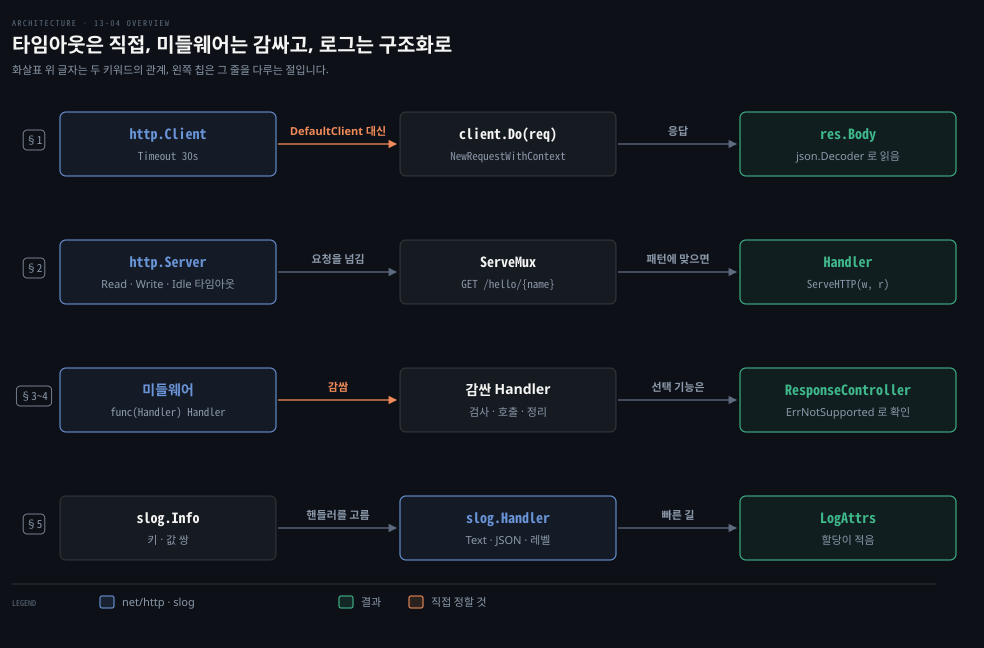
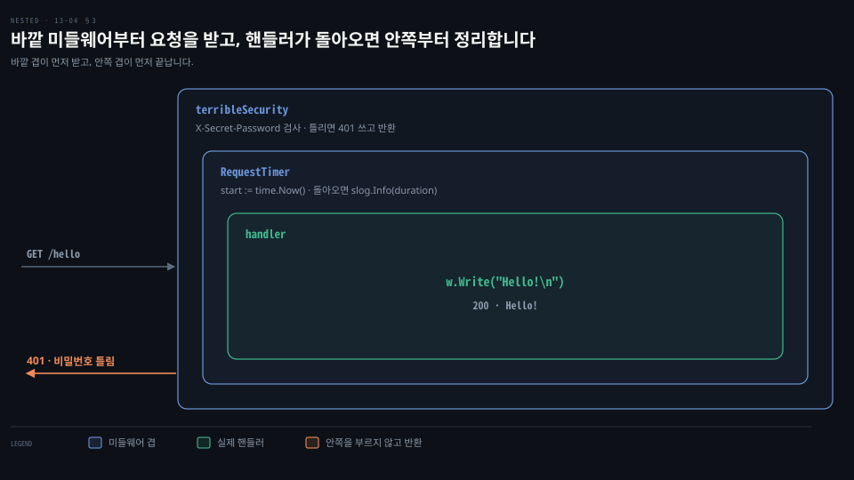

# net/http 는 타임아웃을 직접 정하고 미들웨어는 Handler 를 감싸며 slog 로 구조화 로그를 남깁니다

---

> Learning Go 13장 끝입니다. 표준 라이브러리의 HTTP 클라이언트와 서버, 요청 라우터 `ServeMux` 와 Go 1.22 의 경로 패턴, `http.Handler` 를 감싸는 미들웨어, 인터페이스를 넓히는 `http.ResponseController`, 그리고 Go 1.21 의 구조화 로깅 `log/slog` 를 다루고 장 끝 연습 문제를 풉니다.

## 핵심 요약

> 이 편이 매달린 하나의 생각은 표준 라이브러리가 운영 품질의 HTTP 와 로깅을 주되, 타임아웃과 설정은 기본값에 맡기지 말고 직접 정하라는 것입니다.

`http.DefaultClient` 와 `http.Get` 같은 패키지 함수는 타임아웃이 없으니 `Timeout` 을 정한 `http.Client` 를 프로그램에 하나 만들어 씁니다. 서버도 `http.Server` 를 직접 만들어 읽기·쓰기·유휴 타임아웃을 정합니다. 요청은 `http.Handler` 가 처리하고 `ServeMux` 가 경로별로 나눠 줍니다. Go 1.22 부터는 `"GET /hello/{name}"` 처럼 메서드와 경로 변수를 쓸 수 있습니다. 단 go.mod 의 `go` 지시어가 1.22 이상이어야 하고, 아니면 경고 없이 404 가 납니다.

미들웨어는 `http.Handler` 를 받아 `http.Handler` 를 돌려주는 함수이고 겹쳐 감싸 로그인 확인이나 시간 측정 같은 공통 관심사를 처리합니다. `http.ResponseController` 는 인터페이스를 바꾸지 않고 선택 기능을 더하는 구체 타입입니다. `log/slog` 는 키·값 쌍을 붙이는 구조화 로그를 표준으로 만들어 여러 로깅 라이브러리가 흩어지는 문제를 풉니다.


## 학습 목표

> 이 편을 읽고 나면 아래 다섯 가지를 스스로 해낼 수 있습니다.

1. `http.DefaultClient` 와 `http.ListenAndServe` 를 운영 코드에서 피해야 하는 이유를 말하고, 타임아웃을 정한 클라이언트와 서버를 만들 수 있습니다.
2. `ResponseWriter` 의 세 메서드를 불러야 하는 순서를 말할 수 있습니다.
3. `ServeMux` 를 중첩하고 Go 1.22 의 메서드·경로 변수 패턴을 쓸 수 있으며, `go` 지시어가 그 패턴에 주는 영향을 말할 수 있습니다.
4. 미들웨어를 쓰고, 설정을 받는 미들웨어가 클로저를 돌려주는 클로저인 이유를 설명할 수 있습니다.
5. `slog` 로 텍스트·JSON 구조화 로그를 남기고, `LogAttrs` 가 빠른 이유를 말할 수 있습니다.

아래는 이 편의 키워드를 이은 개념도입니다. 첫 줄은 타임아웃을 정한 `http.Client` 가 요청을 보내고 `Body` 를 `json.Decoder` 로 읽는 흐름입니다. 둘째 줄은 `http.Server` 가 `ServeMux` 에 요청을 넘기면 `ServeMux` 가 경로에 맞는 `Handler` 를 부르는 흐름입니다. 셋째 줄은 미들웨어가 `Handler` 를 감싸고 `ResponseController` 가 선택 기능을 더하는 모습입니다. 넷째 줄은 `slog` 가 핸들러를 골라 텍스트나 JSON 으로 쓰는 흐름입니다. 왼쪽 칩이 그 줄을 다루는 절입니다.




## 1. 클라이언트 — DefaultClient 대신 타임아웃을 정한 Client

> `http.DefaultClient` 는 타임아웃이 없어 운영 코드에서 피하고, `Timeout` 을 정한 `http.Client` 를 프로그램에 하나 만들어 모든 고루틴이 나눠 씁니다. 요청은 `http.NewRequestWithContext` 로 만들고 `Do` 로 보냅니다.

다른 서비스의 REST API 를 부르는데 그 서버가 응답하지 않는다고 해 봅시다. 연결은 됐는데 응답이 오지 않으면, 타임아웃이 없는 클라이언트의 고루틴은 끝없이 기다립니다. Go 에서 가장 손쉬운 클라이언트가 바로 그렇습니다.

원문은 Go 표준 라이브러리에 운영 품질의 HTTP/2 클라이언트와 서버가 들어 있다고 말합니다. 다른 언어 배포판이 서드파티의 몫으로 여기던 것입니다. `net/http` 는 요청을 보내고 응답을 받는 `Client` 타입을 정의하고 기본 인스턴스 `DefaultClient` 도 줍니다.

그런데 `DefaultClient` 는 기본으로 타임아웃이 없어서 원문은 운영 애플리케이션에서 피하라고 말합니다. 이 노트의 go1.25.1 에서 `http.DefaultClient.Timeout` 을 찍으니 `0s` 였습니다. 대신 타임아웃을 정한 인스턴스를 직접 만듭니다.

원문 밖 보충입니다. `DefaultClient` 에도 제한이 아예 없지는 않습니다. go1.25.1 소스의 `DefaultTransport` 는 연결 30초, TLS 핸드셰이크 10초 제한을 둡니다. 그러나 연결된 뒤 응답을 기다리는 제한은 없어서, 받아 놓고 답하지 않는 서버 앞에서는 멈춥니다. `http.Client` 는 여러 고루틴의 동시 요청을 제대로 다루니 프로그램 전체에 하나면 됩니다.

```go
client := &http.Client{
	Timeout: 30 * time.Second,
}
```

요청을 보낼 때는 `http.NewRequestWithContext` 로 새 `*http.Request` 를 만듭니다. context, 메서드, 연결할 URL 을 넘깁니다. `PUT`·`POST`·`PATCH` 요청이면 마지막 매개변수로 요청 본문을 `io.Reader` 로 주고 본문이 없으면 `nil` 을 줍니다. context 는 14장에서 다룹니다.

```go
req, err := http.NewRequestWithContext(context.Background(),
	http.MethodGet, "https://jsonplaceholder.typicode.com/todos/1", nil)
if err != nil {
	panic(err)
}
```

`*http.Request` 가 있으면 헤더를 설정하고 `http.Client` 의 `Do` 메서드에 요청을 넘겨 `http.Response` 로 결과를 받습니다.

> **원문 정오**: 원문은 인스턴스의 "Headers 필드" 로 헤더를 설정한다고 적었지만, `http.Request` 의 필드 이름은 `Header` 입니다. 바로 아래 원문 코드도 `req.Header.Add` 를 씁니다. 이 노트의 go1.25.1 에서 `req.Header.Add("X-My-Client", "Learning Go")` 뒤 `req.Header` 를 찍으니 `map[X-My-Client:[Learning Go]]` 였습니다. 책 16장 전체에서 이 문구는 이 한 곳에만 나옵니다.

```go
req.Header.Add("X-My-Client", "Learning Go")
res, err := client.Do(req)
if err != nil {
	panic(err)
}
```

응답에는 요청에 대한 정보를 담은 필드가 여럿 있습니다. 응답 상태의 숫자 코드는 `StatusCode`, 문자열은 `Status`, 응답 헤더는 `Header` 필드에 있습니다. 돌아온 내용은 `io.ReadCloser` 타입의 `Body` 필드에 있어서 13-03 §2 의 `json.Decoder` 로 REST API 응답을 바로 처리합니다.

```go
defer res.Body.Close()
if res.StatusCode != http.StatusOK {
	panic(fmt.Sprintf("unexpected status: got %v", res.Status))
}
fmt.Println(res.Header.Get("Content-Type"))
var data struct {
	UserID    int    `json:"userId"`
	ID        int    `json:"id"`
	Title     string `json:"title"`
	Completed bool   `json:"completed"`
}
err = json.NewDecoder(res.Body).Decode(&data)
if err != nil {
	panic(err)
}
fmt.Printf("%+v\n", data)
```

저장소의 client 예제를 돌리니 `application/json; charset=utf-8` 과 `{UserID:1 ID:1 Title:delectus aut autem Completed:false}` 가 찍혔습니다. 원문의 경고는 `net/http` 에 `GET`·`HEAD`·`POST` 호출을 하는 패키지 함수가 있지만 피하라고 합니다. 기본 클라이언트를 써서 요청 타임아웃이 없기 때문입니다.

원문 밖 보충입니다. Go 1.27 은 HTTP/1 `Response.Body` 를 닫을 때 읽지 않은 내용을 보수적인 한도까지 자동으로 읽어 비우게 바꿨습니다. 연결을 다시 쓰기 위해서입니다. go1.27.1 의 `go doc net/http.Response.Body` 도 대부분의 경우 본문을 끝까지 손으로 읽을 필요가 없다는 문장을 더했습니다. 위 코드처럼 `defer res.Body.Close()` 를 두는 습관은 그대로 필요합니다.

Spring 에서 `RestTemplate` 이나 `RestClient` 를 쓸 때도 요청 팩토리에 따라 기본값이 다르고, 기본 `SimpleClientHttpRequestFactory` 는 타임아웃이 사실상 무제한이라 직접 정해야 하는 것과 같은 함정입니다. 이 비교는 원문 밖입니다.


## 2. 서버 — http.Server 와 Handler, ServeMux

> 서버는 `http.Server` 가 요청을 듣고, `Handler` 필드의 `http.Handler` 가 처리합니다. 타임아웃은 기본으로 없으니 직접 정하고, 경로는 `ServeMux` 로 나누며 Go 1.22 부터 메서드와 경로 변수를 패턴에 씁니다.

타임아웃 문제는 서버 쪽에도 있습니다. 요청을 아주 천천히 보내거나 연결만 열어 둔 채 버티는 클라이언트가 있어도 서버가 끊지 않으면 연결과 고루틴이 계속 묶입니다. 그래서 서버도 기본값에 맡기지 않고 직접 만들어 설정합니다.

Go 의 HTTP 서버는 `http.Server` 와 `http.Handler` 인터페이스를 중심으로 만들어졌습니다. `http.Client` 가 요청을 보내듯 `http.Server` 는 요청을 듣습니다. 원문은 TLS 를 지원하는 성능 좋은 HTTP/2 서버라고 말합니다.

서버에 온 요청은 `Handler` 필드에 대입한 `http.Handler` 구현이 처리합니다. 이 인터페이스는 메서드 하나를 정의합니다.

```go
type Handler interface {
	ServeHTTP(http.ResponseWriter, *http.Request)
}
```

`*http.Request` 는 요청을 보낼 때 쓴 바로 그 타입입니다. `http.ResponseWriter` 는 메서드 셋을 가진 인터페이스입니다.

```go
type ResponseWriter interface {
	Header() http.Header
	Write([]byte) (int, error)
	WriteHeader(statusCode int)
}
```

이 메서드들은 정해진 순서로 불러야 합니다. 먼저 `Header` 로 `http.Header` 를 얻어 필요한 응답 헤더를 설정합니다. 설정할 헤더가 없으면 부르지 않아도 됩니다. 다음으로 응답의 HTTP 상태 코드로 `WriteHeader` 를 부릅니다. 상태 코드 200 이면 `WriteHeader` 를 건너뛰어도 됩니다. 마지막으로 `Write` 로 응답 본문을 씁니다.

순서를 어기면 조용히 무시됩니다. 이 노트를 쓰면서 `Write` 를 먼저 부르고 `WriteHeader(404)` 를 나중에 불러 보니 상태는 200 이었습니다. 서버 로그에는 `http: superfluous response.WriteHeader call` 만 남았습니다. `Write` 가 200 을 먼저 보내 버리기 때문입니다.

원문은 상태 코드가 모두 `net/http` 에 상수로 정의되어 있지만 사용자 정의 타입을 두기 좋은 자리였는데 그러지 않아 모두 타입 없는 정수라고 짚습니다. 사소한 핸들러는 이렇습니다.

```go
type HelloHandler struct{}

func (hh HelloHandler) ServeHTTP(w http.ResponseWriter, r *http.Request) {
	w.Write([]byte("Hello!\n"))
}
```

`http.Server` 도 다른 struct 처럼 인스턴스를 만듭니다.

```go
s := http.Server{
	Addr:         ":8080",
	ReadTimeout:  30 * time.Second,
	WriteTimeout: 90 * time.Second,
	IdleTimeout:  120 * time.Second,
	Handler:      HelloHandler{},
}
err := s.ListenAndServe()
if err != nil {
	if err != http.ErrServerClosed {
		panic(err)
	}
}
```

`Addr` 는 서버가 들을 호스트와 포트입니다. 정하지 않으면 모든 호스트의 표준 HTTP 포트 80 을 듣습니다. 읽기·쓰기·유휴 타임아웃은 `time.Duration` 으로 정합니다. 기본 동작은 타임아웃이 전혀 없으니 악의적이거나 고장 난 클라이언트를 다루도록 꼭 정하라고 원문은 말합니다. 이 노트의 컴퓨터는 8080 을 OrbStack 이 쓰고 있어서 저장소 예제를 모두 18181 포트로 바꿔 돌렸습니다. server 예제는 `Hello!` 를 돌려줬습니다.

### ServeMux 로 경로를 나눕니다

요청 하나만 처리하는 서버는 쓸모가 적어서 표준 라이브러리는 요청 라우터 `*http.ServeMux` 를 줍니다. `http.NewServeMux` 로 만들며 `http.Handler` 를 만족하니 `http.Server` 의 `Handler` 필드에 대입할 수 있습니다. 요청을 나눠 주는 메서드가 둘 있습니다. `Handle` 은 경로와 `http.Handler` 를 받아 경로가 맞으면 그 `http.Handler` 를 부릅니다.

`http.Handler` 구현을 만들 수도 있지만 더 흔한 패턴은 `*http.ServeMux` 의 `HandleFunc` 메서드입니다.

```go
mux.HandleFunc("/hello", func(w http.ResponseWriter, r *http.Request) {
	w.Write([]byte("Hello!\n"))
})
```

이 메서드는 함수나 클로저를 받아 07-04 §3 에서 본 `http.HandlerFunc` 로 바꿉니다. 원문은 간단한 핸들러는 클로저로 충분하다고 말합니다. 다른 비즈니스 로직에 기대는 복잡한 핸들러는 07-04 §4 처럼 struct 의 메서드로 쓰라고 합니다.

Go 1.22 는 경로 문법을 넓혀 HTTP 메서드와 경로 와일드카드 변수를 선택적으로 쓸 수 있게 했습니다. 와일드카드 변수의 값은 `http.Request` 의 `PathValue` 메서드로 읽습니다.

```go
mux.HandleFunc("GET /hello/{name}", func(w http.ResponseWriter, r *http.Request) {
	name := r.PathValue("name")
	w.Write([]byte(fmt.Sprintf("Hello, %s!\n", name)))
})
```

### go 지시어가 1.21 이면 새 패턴이 조용히 404 입니다

이 노트를 쓰면서 위 핸들러 하나만 등록한 서버를 go.mod 의 `go` 지시어만 바꿔 돌렸습니다. `go 1.22` 에서는 `GET /hello/bob` 이 `Hello, bob!` 이었고 `POST /hello/bob` 은 405, `/hello/a/b` 는 404 였습니다. `go doc net/http.ServeMux` 대로 `GET` 패턴은 `HEAD` 요청에도 맞습니다.

`go 1.21` 로 바꾸니 같은 코드가 경고 없이 모든 요청에 `404 page not found` 를 돌려줬습니다. 옛 지시어에서는 Go 1.21 의 라우팅 동작이 유지됩니다. 옛 `ServeMux` 는 `/` 로 시작하지 않는 패턴을 호스트 이름이 붙은 패턴으로 읽습니다. 그래서 `"GET /hello/{name}"` 은 호스트 `"GET "` 의 `/hello/{name}` 경로가 되고 그런 호스트로 오는 요청이 없으니 아무것도 맞지 않습니다. 10-01 §3 에서 본 `go` 지시어의 영향을 여기서 다시 확인했습니다.

원서 예제 저장소의 go.mod 도 `go 1.21` 이고 server_mux 예제에는 이 패턴이 없어 `/hello/bob` 이 404 였습니다. 이 재현과 해석은 원문 밖입니다.

### DefaultServeMux 를 피하고 ServeMux 를 중첩합니다

원문의 경고는 패키지 수준 함수 `http.Handle`·`http.HandleFunc`·`http.ListenAndServe`·`http.ListenAndServeTLS` 를 사소한 시험 프로그램 밖에서 쓰지 말라고 합니다. 이 함수들은 `http.DefaultServeMux` 라는 패키지 수준 `*http.ServeMux` 를 씁니다.

`http.Server` 는 `http.ListenAndServe` 안에서 만들어지니 타임아웃 같은 서버 속성을 설정할 수 없습니다. 게다가 서드파티 라이브러리가 `http.DefaultServeMux` 에 자기 핸들러를 등록했을 수 있고 직접·간접 의존성을 모두 뒤지지 않고는 알 길이 없습니다. 공유 상태를 피해 애플리케이션을 통제하라고 원문은 말합니다.

원문 밖 보충입니다. 원문은 네 함수가 모두 `http.DefaultServeMux` 를 쓴다고 적었지만 정확히는 둘로 나뉩니다. `http.Handle`·`http.HandleFunc` 는 늘 `DefaultServeMux` 에 등록합니다. `http.ListenAndServe` 는 handler 인자에 `nil` 을 줄 때만 `DefaultServeMux` 를 씁니다. 그래도 자기 `ServeMux` 를 넘기는 것만으로는 부족합니다. `http.Server` 를 직접 만들지 않으니 타임아웃은 여전히 정할 수 없습니다.

`*http.ServeMux` 는 `http.Handler` 에 요청을 나눠 주고 자신도 `http.Handler` 를 구현합니다. 그래서 관련된 요청을 묶은 `*http.ServeMux` 를 부모 `*http.ServeMux` 에 등록할 수 있습니다.

```go
person := http.NewServeMux()
person.HandleFunc("/greet", func(w http.ResponseWriter, r *http.Request) {
	w.Write([]byte("greetings!\n"))
})
dog := http.NewServeMux()
dog.HandleFunc("/greet", func(w http.ResponseWriter, r *http.Request) {
	w.Write([]byte("good puppy!\n"))
})
mux := http.NewServeMux()
mux.Handle("/person/", http.StripPrefix("/person", person))
mux.Handle("/dog/", http.StripPrefix("/dog", dog))
```

`/person/greet` 요청은 `person` 에 붙은 핸들러가, `/dog/greet` 는 `dog` 에 붙은 핸들러가 처리합니다. `person`·`dog` 를 `mux` 에 등록할 때 `http.StripPrefix` 로 `mux` 가 이미 처리한 경로 부분을 떼어 냅니다. 저장소 예제는 `greetings!` 와 `good puppy!` 를 돌려줬습니다.

원문 밖 보충입니다. `/person/` 처럼 끝이 슬래시인 패턴이 있으면 `/person` 요청은 `/person/` 으로 리다이렉트됩니다. Go 1.26 은 이 응답을 301 에서 307 로 바꿨습니다. 재확인에서 `go 1.22` 모듈은 go1.25.1 에서 301, go1.27.1 에서 307 이었습니다. 원서 저장소처럼 `go 1.21` 모듈은 옛 라우터를 쓰므로 go1.27.1 에서도 301 이었습니다.


## 3. 미들웨어 — Handler 를 받아 Handler 를 돌려줍니다

> 로그인 확인이나 요청 시간 측정처럼 여러 핸들러에 걸친 공통 관심사는 미들웨어로 처리합니다. 미들웨어는 `http.Handler` 를 받아 `http.Handler` 를 돌려주는 함수이고, 감싼 순서대로 바깥부터 실행됩니다.

HTTP 서버의 가장 흔한 요구 하나는 사용자 로그인 확인, 요청 시간 측정, 요청 헤더 확인처럼 여러 핸들러에 걸친 작업입니다. Go 는 이런 공통 관심사를 미들웨어 패턴으로 다룹니다.

**미들웨어**(middleware) 패턴은 특별한 타입을 쓰지 않습니다. `http.Handler` 를 받아 `http.Handler` 를 돌려주는 함수를 씁니다. 대개 돌려주는 `http.Handler` 는 `http.HandlerFunc` 로 바꾼 클로저입니다. 원문은 미들웨어 생성기 둘을 보입니다. 하나는 요청 시간을 재고, 다른 하나는 원문 표현으로 상상할 수 있는 최악의 접근 제어입니다.

```go
func RequestTimer(h http.Handler) http.Handler {
	return http.HandlerFunc(func(w http.ResponseWriter, r *http.Request) {
		start := time.Now()
		h.ServeHTTP(w, r)
		dur := time.Since(start)
		slog.Info("request time",
			"path", r.URL.Path,
			"duration", dur)
	})
}

var securityMsg = []byte("You didn't give the secret password\n")

func TerribleSecurityProvider(password string) func(http.Handler) http.Handler {
	return func(h http.Handler) http.Handler {
		return http.HandlerFunc(func(w http.ResponseWriter, r *http.Request) {
			if r.Header.Get("X-Secret-Password") != password {
				w.WriteHeader(http.StatusUnauthorized)
				w.Write(securityMsg)
				return
			}
			h.ServeHTTP(w, r)
		})
	}
}
```

원문 인쇄본은 두 함수 시그니처와 `http.Request` 의 끝이 잘렸습니다. 위 코드는 저장소와 대조해 채운 것입니다. 원문은 두 미들웨어가 미들웨어의 일을 보여 준다고 말합니다. 먼저 준비 작업이나 검사를 합니다. 검사를 통과하지 못하면 미들웨어에서 출력을 쓰고 돌아가는데 이때 대개 오류 코드를 씁니다. 문제가 없으면 핸들러의 `ServeHTTP` 를 부르고 그것이 돌아오면 정리 작업을 합니다.

`TerribleSecurityProvider` 는 설정할 수 있는 미들웨어를 만드는 법을 보입니다. 설정 정보, 여기서는 비밀번호를 넘기면 그 설정을 쓰는 미들웨어를 돌려줍니다. 원문은 클로저를 돌려주는 클로저를 돌려주니 조금 머리가 아프다고 말합니다. 미들웨어 계층 사이에 값을 넘기는 방법은 14장의 context 로 한다고 원문의 메모는 예고합니다.

### 감싼 순서대로 실행됩니다

요청 핸들러에 미들웨어를 더할 때는 이어서 감쌉니다.

```go
terribleSecurity := TerribleSecurityProvider("GOPHER")

mux.Handle("/hello", terribleSecurity(RequestTimer(
	http.HandlerFunc(func(w http.ResponseWriter, r *http.Request) {
		w.Write([]byte("Hello!\n"))
	}))))
```

`TerribleSecurityProvider` 에서 미들웨어를 받아 핸들러를 함수 호출로 겹겹이 감쌉니다. 그러면 `terribleSecurity` 클로저가 먼저 불리고, 그다음 `RequestTimer`, 마지막에 실제 핸들러가 불립니다. 아래 도식이 이 겹을 보입니다.



`*http.ServeMux` 도 `http.Handler` 이니 요청 라우터 하나에 등록한 모든 핸들러에 미들웨어 묶음을 한 번에 적용할 수 있습니다.

```go
terribleSecurity := TerribleSecurityProvider("GOPHER")
wrappedMux := terribleSecurity(RequestTimer(mux))
s := http.Server{
	Addr:    ":8080",
	Handler: wrappedMux,
}
```

저장소의 middleware 예제는 비밀번호 헤더 없이 `/hello` 를 부르니 401 과 `You didn't give the secret password` 를 돌려줬습니다. `X-Secret-Password: GOPHER` 를 주니 200 과 `Hello!` 였고 서버 로그에 `INFO request time path=/hello duration=1.125µs` 가 남았습니다. 비밀번호가 틀린 첫 요청에는 시간 로그가 없었으니 바깥 미들웨어가 막으면 안쪽은 불리지 않습니다.

Spring 으로 보면 서블릿 `Filter` 의 `doFilter(request, response, chain)` 에서 `chain.doFilter` 를 부르기 전후에 일을 하는 것과 같은 모양입니다. Go 는 체인 객체 없이 함수가 다음 `Handler` 를 붙잡는 클로저로 같은 일을 합니다. 이 비교는 원문 밖입니다.

### 서드파티 모듈로 서버를 보강합니다

원문은 서버가 운영 품질이라고 서드파티 모듈을 쓰지 말라는 뜻은 아니라고 말합니다. 미들웨어 함수 체인이 싫다면 `alice` 라는 서드파티 모듈로 이렇게 쓸 수 있습니다.

```go
helloHandler := func(w http.ResponseWriter, r *http.Request) {
	w.Write([]byte("Hello!\n"))
}
chain := alice.New(terribleSecurity, RequestTimer).ThenFunc(helloHandler)
mux.Handle("/hello", chain)
```

`*http.ServeMux` 가 Go 1.22 에서 많이 요청받던 기능을 얻었지만 라우팅과 변수 지원은 아직 기본적이고 중첩도 조금 번거롭다고 원문은 말합니다. 헤더 값에 따른 라우팅, 정규식 경로 변수, 더 나은 핸들러 중첩 같은 고급 기능이 필요하면 서드파티 요청 라우터가 많습니다. 원문은 가장 인기 있는 둘로 gorilla mux 와 chi 를 꼽습니다. 둘 다 `http.Handler`·`http.HandlerFunc` 와 함께 동작해 관용적이라고 여겨집니다. 표준 라이브러리와 맞물려 조합할 수 있는 라이브러리를 쓰는 Go 철학을 보여 준다고 원문은 말합니다.

인기 있는 웹 프레임워크 몇몇은 자체 핸들러와 미들웨어 패턴을 구현합니다. 원문은 가장 인기 있는 둘로 Echo 와 Gin 을 꼽습니다. 요청·응답 데이터를 JSON 에 자동으로 묶는 기능으로 웹 개발을 쉽게 합니다. `http.Handler` 구현을 쓸 수 있게 하는 어댑터 함수도 있어 옮겨 갈 길을 줍니다.


## 4. ResponseController — 인터페이스를 넓히는 다른 방법

> `http.ResponseWriter` 는 인터페이스라 메서드를 더하면 호환성이 깨지므로, 선택 기능은 `http.Flusher` 같은 선택적 인터페이스로 더해 왔습니다. Go 1.20 의 `http.ResponseController` 는 구체 타입이라 메서드를 계속 더할 수 있고, 없는 기능은 `http.ErrNotSupported` 로 알립니다.

07-03 §3 에서 본 대로 인터페이스를 고치면 하위 호환이 깨집니다. 07-04 §2 에서는 새 인터페이스를 정의하고 타입 스위치·단언으로 구현 여부를 보는 방식으로 인터페이스를 진화시키는 법을 봤습니다. 원문은 이런 추가 인터페이스의 단점을 두 가지로 꼽습니다. 그런 인터페이스가 있다는 사실 자체를 알기 어렵고 타입 스위치로 확인하는 코드가 장황합니다.

`http` 패키지에 그 예가 있습니다. 패키지를 설계할 때 `http.ResponseWriter` 를 인터페이스로 정했기 때문에 이후 릴리스에서 메서드를 더하면 Go 호환성 보장이 깨집니다. `http.ResponseWriter` 의 새 선택 기능을 나타내려고 `http` 패키지에는 구현체가 구현할 수도 있는 인터페이스 `http.Flusher`·`http.Hijacker` 등이 있습니다. 이 인터페이스의 메서드는 응답 출력을 제어하는 데 씁니다.

Go 1.20 은 `http` 패키지에 새 구체 타입 `http.ResponseController` 를 더했습니다. 원문은 이것이 기존 API 에 더해진 메서드를 드러내는 또 다른 방법을 보여 준다고 말합니다.

```go
func handler(rw http.ResponseWriter, req *http.Request) {
	rc := http.NewResponseController(rw)
	for i := 0; i < 10; i++ {
		result := doStuff(i)
		_, err := rw.Write([]byte(result))
		if err != nil {
			slog.Error("error writing", "msg", err)
			return
		}
		err = rc.Flush()
		if err != nil && !errors.Is(err, http.ErrNotSupported) {
			slog.Error("error flushing", "msg", err)
			return
		}
	}
}
```

이 예는 `http.ResponseWriter` 가 `Flush` 를 지원하면 계산하는 대로 클라이언트에 데이터를 돌려줍니다. 지원하지 않으면 모두 계산한 뒤 한꺼번에 돌려줍니다.

팩토리 함수 `http.NewResponseController` 는 `http.ResponseWriter` 를 받아 `*http.ResponseController` 를 돌려줍니다. 이 구체 타입은 `http.ResponseWriter` 의 선택 기능을 위한 메서드를 가집니다. 선택 메서드를 바탕의 `http.ResponseWriter` 가 구현했는지는 돌려받은 오류를 `errors.Is` 로 `http.ErrNotSupported` 와 비교해 봅니다.

원문은 `http.ResponseController` 가 `http.ResponseWriter` 구현 접근을 감싼 구체 타입이라 기존 구현을 깨지 않고 메서드를 계속 더할 수 있다고 말합니다. 새 기능이 발견되기 쉽고 선택 메서드가 있는지를 표준 오류 확인으로 알 수 있습니다.

원문 밖 보충입니다. 3절의 미들웨어와 맞물리는 이유가 하나 더 있습니다. 미들웨어가 `http.ResponseWriter` 를 자기 struct 로 감싸면, 감싼 값에 `.(http.Flusher)` 단언을 해도 실패합니다. 선택적 인터페이스가 가려지는 것입니다.

`http.ResponseController` 는 `Unwrap() http.ResponseWriter` 메서드를 따라 감싼 겹을 벗겨 원래 writer 를 찾습니다.

이 노트를 쓰면서 확인하니 `Unwrap` 이 없는 래퍼에서는 `Flush` 가 `http.ErrNotSupported` 를, 있는 래퍼에서는 `nil` 을 돌려줬습니다. 그래서 `ResponseWriter` 를 감싸는 미들웨어는 `Unwrap` 을 두는 편이 좋습니다. 원문은 이미 대응하는 인터페이스가 없는 메서드 `SetReadDeadline`·`SetWriteDeadline` 이 둘 있다고 말합니다. 앞으로의 선택 메서드도 이 방식으로 더해질 것이라고 내다봅니다.

원문 밖 보충입니다. 이 노트의 go1.25.1 소스에서 `ResponseController` 의 메서드는 `Flush`·`Hijack`·`SetReadDeadline`·`SetWriteDeadline`·`EnableFullDuplex` 다섯이었습니다. `EnableFullDuplex` 는 Go 1.21 에 더해진 것으로, 원문의 예상대로 인터페이스 없이 이 타입에 들어왔습니다.

저장소의 response_controller 예제는 `doStuff` 가 1초씩 잠들며 10번 쓰는데 서버 `WriteTimeout` 이 6초입니다. curl 로 받으니 `0`·`2`·`4`·`6`·`8` 이 1초 간격으로 흘러 들어오다 끊겼습니다. 서버 로그에는 `error flushing msg="write tcp ... i/o timeout"` 이 남았습니다. `Flush` 가 계산하는 대로 보낸다는 것과 쓰기 타임아웃이 스트리밍 응답도 자른다는 것을 한 번에 확인했습니다. 이 관찰은 원문 밖입니다.


## 5. log/slog — 구조화 로그를 표준으로

> 처음부터 있던 `log` 패키지는 구조화 로그를 쉽게 만들지 못해, 서드파티 로거들이 흩어졌습니다. Go 1.21 의 `log/slog` 는 키·값 쌍을 붙이는 구조화 로그를 표준으로 만들고, 핸들러로 텍스트·JSON 출력과 레벨을 고르며, `LogAttrs` 로 할당을 줄입니다.

Go 표준 라이브러리에는 처음부터 간단한 로깅 패키지 `log` 가 있었습니다. 작은 프로그램에는 괜찮지만 구조화 로그를 쉽게 만들지 못합니다. 원문은 현대 웹 서비스가 동시 사용자를 수백만 명 둘 수 있고 그 규모에서는 로그 출력을 소프트웨어로 처리해야 무슨 일이 일어나는지 이해할 수 있다고 말합니다. **구조화 로그**(structured log)는 로그 항목마다 문서화된 형식을 써서 로그를 처리해 패턴과 이상을 찾는 프로그램을 쓰기 쉽게 합니다.

구조화 로그에는 흔히 JSON 을 쓰지만 빈칸으로 나눈 키·값 쌍도 값을 필드로 나누지 않은 비구조화 로그보다 처리하기 쉽습니다. `log` 로 JSON 을 쓸 수도 있지만 구조화 로그 작성을 돕는 기능은 없습니다. `log/slog` 가 이 문제를 풉니다.

### 좋은 라이브러리 설계의 예

원문은 `log/slog` 를 표준 라이브러리에 더한 일이 좋은 Go 라이브러리 설계 관례를 여럿 보여 준다고 말합니다. 첫째는 구조화 로깅을 표준 라이브러리에 넣은 결정입니다. 표준 구조화 로거가 있으면 함께 동작하는 모듈을 쓰기 쉽습니다.

`log` 의 부족함을 메우려고 zap, logrus, go-kit log 를 비롯한 서드파티 구조화 로거가 많이 나왔습니다. 로깅 생태계가 흩어지면 로그가 어디로 가고 어떤 레벨이 남는지 통제하고 싶을 때 문제가 됩니다. 코드가 서로 다른 로거를 쓰는 서드파티 모듈에 기대면 그 통제가 불가능해집니다.

흩어짐을 막는 흔한 조언은 라이브러리용 모듈에서는 로그를 남기지 말라는 것입니다. 하지만 원문은 그것을 강제할 수 없고 서드파티 라이브러리 안에서 무슨 일이 일어나는지 살피기도 어려워진다고 말합니다. `log/slog` 는 Go 1.21 에 새로 들어왔지만 이 불일치를 풀어 주니 몇 년 안에 대다수 Go 프로그램이 쓸 것이라고 원문은 내다봅니다.

둘째는 구조화 로깅을 `log` 의 일부가 아니라 자기 패키지로 만든 결정입니다. 두 패키지는 목적이 비슷하지만 설계 철학이 아주 다릅니다. 비구조화 로깅 패키지에 구조화 로깅을 끼워 넣으면 API 가 헷갈립니다. 패키지를 나눠 두면 `Info` 가 어느 쪽 것인지 기억하지 못해도 `slog.Info` 는 구조화, `log.Print` 는 비구조화라고 한눈에 압니다.

Java 에서 SLF4J 가 파사드로 여러 로깅 구현을 하나의 API 뒤에 모은 것과 같은 문제를 푸는 자리입니다. Go 는 그 공통 API 를 표준 라이브러리에 넣었습니다. 이 비교는 원문 밖입니다.

### 기본 로거와 키·값 쌍

다음 좋은 결정은 `log/slog` 의 API 를 확장 가능하게 만든 것입니다. 함수로 쓰는 기본 로거로 단순하게 시작합니다.

```go
func main() {
	slog.Debug("debug log message")
	slog.Info("info log message")
	slog.Warn("warning log message")
	slog.Error("error log message")
}
```

```bash
2023/04/20 23:13:31 INFO info log message
2023/04/20 23:13:31 WARN warning log message
2023/04/20 23:13:31 ERROR error log message
```

출력에 `Debug` 줄이 없는 것은 기본 로거가 디버그 메시지를 기본으로 감추기 때문입니다. 더 미묘한 점은 평문 출력인데도 빈칸으로 나뉜 구조화 로그라는 것입니다. 첫 열은 연/월/일 형식의 날짜, 둘째 열은 24시간제 시각, 셋째 열은 로깅 레벨이고, 그다음이 메시지입니다.

원문 밖 보충입니다. 기본 로거는 메시지를 따옴표로 감싸지 않습니다. 이 노트를 쓰면서 빈칸이 든 메시지를 남기니 `INFO msg with spaces k="v w"` 가 찍혀, 빈칸만으로는 메시지가 어디서 끝나는지 가를 수 없었습니다. `slog.NewTextHandler` 는 같은 내용을 `msg="msg with spaces"` 로 씁니다.

원문은 구조화 로깅의 힘이 사용자 정의 값을 가진 필드를 더하는 데서 나온다고 말합니다.

```go
userID := "fred"
loginCount := 20
slog.Info("user login",
	"id", userID,
	"login_count", loginCount)
```

```bash
2023/04/20 23:36:38 INFO user login id=fred login_count=20
```

같은 함수에 선택 인자를 더했습니다. 선택 인자는 짝으로 옵니다. 앞은 키이고 문자열이어야 하며 뒤는 값입니다. 이 규칙은 컴파일러가 확인하지 않습니다. 이 노트를 쓰면서 키 자리에 `42` 를 넣으니 `!BADKEY=42 fred=id` 처럼 짝이 한 칸씩 밀렸습니다. `go vet` 의 slog 검사가 이런 실수를 잡습니다. 메시지 뒤에 키·값 쌍이 다시 빈칸으로 나뉘어 붙습니다. 저장소의 structured_logging 예제도 같은 모양을 찍었습니다.

### 핸들러로 JSON 과 레벨을 고릅니다

텍스트 형식이 비구조화 로그보다 훨씬 파싱하기 쉽지만 JSON 을 쓰고 싶을 수 있습니다. 로그를 쓸 곳이나 레벨도 바꾸고 싶을 수 있습니다. 그러려면 구조화 로깅 인스턴스를 만듭니다.

```go
options := &slog.HandlerOptions{Level: slog.LevelDebug}
handler := slog.NewJSONHandler(os.Stderr, options)
mySlog := slog.New(handler)
lastLogin := time.Date(2023, 01, 01, 11, 50, 00, 00, time.UTC)
mySlog.Debug("debug message",
	"id", userID,
	"last_login", lastLogin)
```

`slog.HandlerOptions` 로 새 로거의 최소 로깅 레벨을 정합니다. 그다음 `NewJSONHandler` 로, 정한 `io.Writer` 에 JSON 으로 쓰는 `slog.Handler` 를 만듭니다. 여기서는 표준 오류 출력입니다. 마지막으로 `slog.New` 로 `slog.Handler` 를 감싼 `*slog.Logger` 를 만듭니다.

> **원문 정오**: 원문은 `slog.HandlerOptions` 의 "NewJSONHandler 메서드" 로 핸들러를 만든다고 적었습니다. 하지만 바로 위 원문 코드처럼 `NewJSONHandler` 는 `slog` 패키지의 함수이고, `io.Writer` 와 `*slog.HandlerOptions` 를 인자로 받습니다. `HandlerOptions` 에는 그런 메서드가 없습니다. 책 16장 전체에서 이 문구는 이 한 곳에만 나옵니다.

```bash
{"time":"2023-04-22T23:30:01.170243-04:00","level":"DEBUG",
 "msg":"debug message","id":"fred","last_login":"2023-01-01T11:50:00Z"}
```

원문 출력은 인쇄 폭 때문에 두 줄로 나뉘었지만 실제로는 한 줄입니다. JSON 과 텍스트로 모자라면 `slog.Handler` 인터페이스를 직접 구현해 `slog.New` 에 넘길 수 있습니다. 이 노트의 재현에서 `time` 값은 원문의 `-04:00` 대신 이 컴퓨터 시간대의 `+09:00` 으로 찍혔습니다.

### LogAttrs 는 할당을 줄입니다

원문은 마지막으로 `log/slog` 가 성능을 고려했다고 말합니다. 조심하지 않으면 프로그램이 할 일보다 로그 쓰기에 시간을 더 쓸 수 있습니다. 지금까지 본 `Debug`·`Info`·`Warn`·`Error` 에 키와 값을 번갈아 넘기는 방법이 가장 쉽지만 가장 느립니다. 할당을 줄여 성능을 높이려면 `LogAttrs` 메서드를 씁니다.

```go
mySlog.LogAttrs(ctx, slog.LevelInfo, "faster logging",
	slog.String("id", userID),
	slog.Time("last_login", lastLogin))
```

원문 코드의 `ctx` 는 앞에서 만든 `context.Context` 라고 가정한 것이고, 시험할 때는 `context.Background()` 를 넘기면 됩니다. 첫 매개변수는 `context.Context`, 다음은 로깅 레벨, 그다음은 `slog.Attr` 인스턴스 0개 이상입니다. 흔한 타입에는 팩토리 함수가 있고 없는 타입은 `slog.Any` 를 씁니다.

### log 패키지와의 다리

Go 호환성 약속 때문에 `log` 패키지는 사라지지 않습니다. `log` 를 쓰는 기존 프로그램도, 서드파티 구조화 로거를 쓰는 프로그램도 계속 돕니다. `log.Logger` 를 쓰는 코드가 있다면 `slog.NewLogLogger` 가 원래 `log` 패키지로 가는 다리가 됩니다. `slog.Handler` 로 출력을 쓰는 `log.Logger` 인스턴스를 만듭니다.

```go
myLog := slog.NewLogLogger(mySlog.Handler(), slog.LevelDebug)
myLog.Println("using the mySlog Handler")
```

```bash
{"time":"2023-04-22T23:30:01.170269-04:00","level":"DEBUG",
 "msg":"using the mySlog Handler"}
```

원문은 `log/slog` API 에 동적 로깅 레벨, context 지원, 값 묶기, 공통 헤더 값 만들기 같은 기능이 더 있다고 말합니다. 무엇보다 `log/slog` 가 어떻게 짜였는지 보고 자기 API 를 만드는 법을 배우라고 권합니다.


## 연습 문제

> 원문 연습 문제 셋은 현재 시각을 돌려주는 작은 웹 서버를 만들고, 요청 IP 를 JSON 로그로 남기는 미들웨어를 붙이고, `Accept` 헤더로 JSON 응답을 고르게 하는 문제입니다. 이 노트는 원서 예제 저장소의 풀이를 18181 포트로 바꿔 go1.25.1 에서 돌렸습니다.

### 1. 현재 시각을 RFC 3339 로 돌려주는 서버

첫 문제는 GET 요청을 받으면 현재 시각을 RFC 3339 형식으로 돌려주는 작은 웹 서버입니다. 서드파티 모듈을 써도 됩니다. 저장소 풀이에 요청하니 `2026-09-28T04:31:08+09:00` 과 상태 200 이 돌아왔습니다.

### 2. 요청 IP 를 JSON 으로 남기는 미들웨어

둘째 문제는 JSON 구조화 로그로 들어오는 요청의 IP 주소를 남기는 작은 미들웨어입니다. 저장소 풀이는 `req.RemoteAddr` 를 `strings.Cut(req.RemoteAddr, ":")` 로 잘라 IP 를 얻습니다.

이 노트의 재현에서 이 방식의 흠을 찾았습니다. `http://127.0.0.1:18181/` 로 부르면 `"ip":"127.0.0.1"` 이 남았습니다. `http://localhost:18181/` 로 부르니 IPv6 로 연결되어 `RemoteAddr` 가 `[::1]:50709` 모양이었습니다. 그래서 첫 콜론에서 잘려 `"ip":"["` 이 남았습니다. 포트를 떼려면 `net.SplitHostPort(req.RemoteAddr)` 를 쓰는 편이 맞습니다. 이 지적은 노트의 것입니다.

### 3. Accept 헤더로 JSON 을 고릅니다

셋째 문제는 시각을 JSON 으로도 돌려주는 기능입니다. `Accept` 헤더로 JSON 과 텍스트를 고르고 기본은 텍스트입니다. JSON 모양은 이렇습니다.

```json
{
  "day_of_week": "Monday",
  "day_of_month": 10,
  "month": "April",
  "year": 2023,
  "hour": 20,
  "minute": 15,
  "second": 20
}
```

저장소 풀이에 헤더 없이 요청하니 RFC 3339 텍스트가, `Accept: application/json` 을 주니 JSON 이 돌아왔습니다.

```json
{"day_of_week":"Monday","day_of_month":28,"month":"September","year":2026,"hour":4,"minute":31,"second":12}
```

풀이도 둘째 문제의 IP 미들웨어를 쓰니 `localhost` 요청에서는 같은 `"ip":"["` 이 남았습니다.

원문은 장을 맺으며 표준 라이브러리에서 가장 많이 쓰이는 패키지들이 따라 할 만한 모범 관례를 어떻게 담았는지 봤다고 정리합니다. 경험이 쌓였다면 다르게 내렸을 결정과, 탄탄한 기반을 위해 하위 호환을 지키는 법도 봤다고 말합니다. 다음 장은 context 를 다룹니다. Go 코드에 상태와 타이머를 넘기는 패키지이자 패턴입니다.


## 핵심 개념 체크리스트

목표 번호 순서대로 짝지었습니다.

- [ ] (목표 1) `http.Get(url)` 로 응답하지 않는 서버를 부르면 요청은 언제 끝납니까?
- [ ] (목표 1) 서버에 `ReadTimeout` 을 정하지 않으면 어떤 클라이언트에 약해집니까?
- [ ] (목표 2) `Write` 를 먼저 부르고 `WriteHeader(404)` 를 나중에 부르면 상태 코드는 무엇이 됩니까?
- [ ] (목표 3) go.mod 가 `go 1.21` 인 모듈에서 `"GET /hello/{name}"` 패턴을 등록하면 어떻게 됩니까?
- [ ] (목표 4) `terribleSecurity(RequestTimer(h))` 에서 비밀번호가 틀리면 `RequestTimer` 는 불립니까?
- [ ] (목표 5) 라이브러리 모듈이 `slog` 를 쓰면 애플리케이션이 그 로그를 통제하기 쉬워지는 이유를 말할 수 있습니까?
- [ ] (목표 5) `slog.Info("m", "id", id)` 대신 `LogAttrs` 를 쓰면 무엇이 줄어듭니까?


## 관련 문서

- [13-03 encoding/json 은 구조체 태그로 이름을 정하고 Decoder 와 Encoder 로 스트림을 다룹니다](./13-03.encoding-json%20%EC%9D%80%20%EA%B5%AC%EC%A1%B0%EC%B2%B4%20%ED%83%9C%EA%B7%B8%EB%A1%9C%20%EC%9D%B4%EB%A6%84%EC%9D%84%20%EC%A0%95%ED%95%98%EA%B3%A0%20Decoder%20%EC%99%80%20Encoder%20%EB%A1%9C%20%EC%8A%A4%ED%8A%B8%EB%A6%BC%EC%9D%84%20%EB%8B%A4%EB%A3%B9%EB%8B%88%EB%8B%A4.md) — 13장 셋째. json.Decoder
- [07-04 타입 단언은 아껴 쓰고 암묵 인터페이스로 의존성을 주입합니다](./07-04.%ED%83%80%EC%9E%85%20%EB%8B%A8%EC%96%B8%EC%9D%80%20%EC%95%84%EA%BB%B4%20%EC%93%B0%EA%B3%A0%20%EC%95%94%EB%AC%B5%20%EC%9D%B8%ED%84%B0%ED%8E%98%EC%9D%B4%EC%8A%A4%EB%A1%9C%20%EC%9D%98%EC%A1%B4%EC%84%B1%EC%9D%84%20%EC%A3%BC%EC%9E%85%ED%95%A9%EB%8B%88%EB%8B%A4.md) — 7장. 선택적 인터페이스와 HandlerFunc
- [12-03 버퍼 채널은 개수를 알 때 쓰고 WaitGroup 과 Once 가 기다림과 한 번 실행을 맡습니다](./12-03.%EB%B2%84%ED%8D%BC%20%EC%B1%84%EB%84%90%EC%9D%80%20%EA%B0%9C%EC%88%98%EB%A5%BC%20%EC%95%8C%20%EB%95%8C%20%EC%93%B0%EA%B3%A0%20WaitGroup%20%EA%B3%BC%20Once%20%EA%B0%80%20%EA%B8%B0%EB%8B%A4%EB%A6%BC%EA%B3%BC%20%ED%95%9C%20%EB%B2%88%20%EC%8B%A4%ED%96%89%EC%9D%84%20%EB%A7%A1%EC%8A%B5%EB%8B%88%EB%8B%A4.md) — 12장. 백프레셔 서버
- [10-01 모듈은 go.mod 로 한 단위가 되고 go 지시어가 빌드할 Go 버전을 정합니다](./10-01.%EB%AA%A8%EB%93%88%EC%9D%80%20go.mod%20%EB%A1%9C%20%ED%95%9C%20%EB%8B%A8%EC%9C%84%EA%B0%80%20%EB%90%98%EA%B3%A0%20go%20%EC%A7%80%EC%8B%9C%EC%96%B4%EA%B0%80%20%EB%B9%8C%EB%93%9C%ED%95%A0%20Go%20%EB%B2%84%EC%A0%84%EC%9D%84%20%EC%A0%95%ED%95%A9%EB%8B%88%EB%8B%A4.md) — 10장. go 지시어와 동작
- [Learning Go 2판 — 정독 인덱스](./README.md) — 16장 전체 지도


## 참고 자료

- 원본: 《Learning Go, 2nd Edition》 (Jon Bodner, O'Reilly)
- 다룬 범위: Chapter 13 "net/http" 부터 장 끝까지, 연습 문제 1~3
- [net/http 패키지](https://pkg.go.dev/net/http) — Client·Server·ServeMux 패턴·ResponseController
- [Routing Enhancements for Go 1.22](https://go.dev/blog/routing-enhancements) — 메서드와 경로 변수 패턴
- [log/slog 패키지](https://pkg.go.dev/log/slog)
- [Structured Logging with slog](https://go.dev/blog/slog) — Go 블로그
