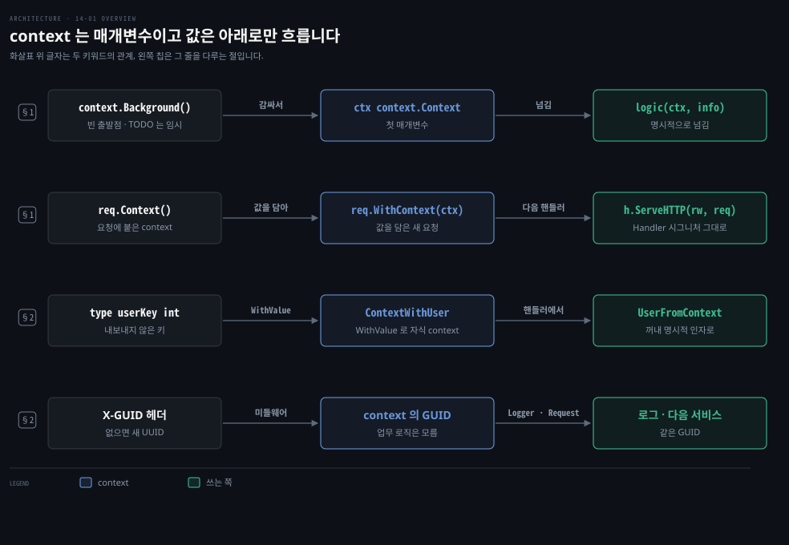
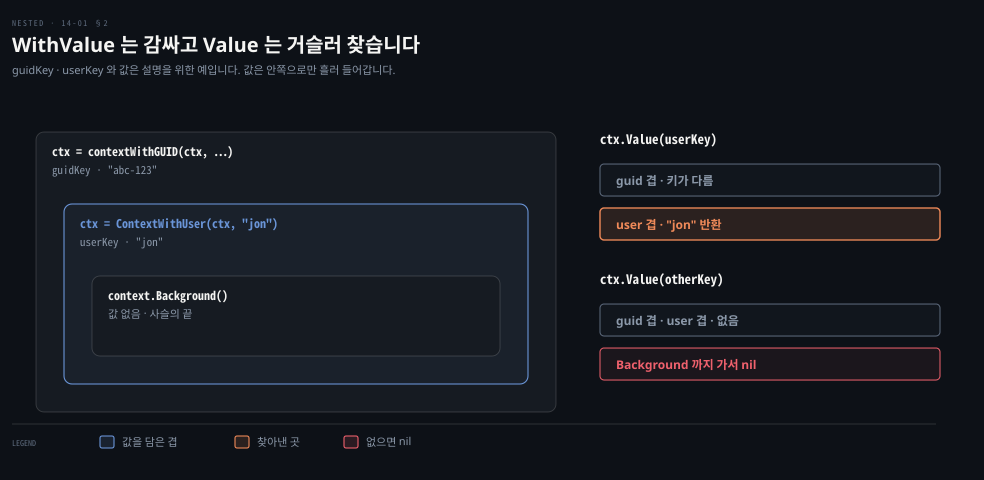
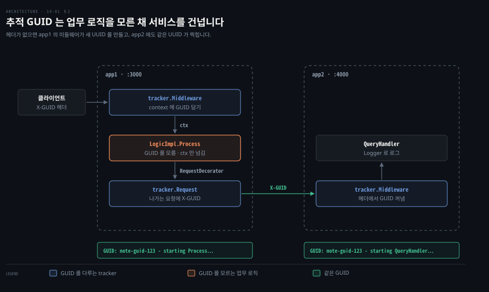

# context 는 첫 매개변수로 넘기고 값은 내보내지 않은 키로 담습니다

---

> Learning Go 14장 앞 부분입니다. 요청마다 따라다니는 메타데이터를 다루는 context 가 무엇인지, 함수와 HTTP 핸들러에 어떻게 넘기는지, 그리고 context 에 값을 담고 꺼내는 법과 그 값을 언제 context 에 남겨 두는지를 다룹니다.

## 핵심 요약

> 이 편이 매달린 하나의 생각은 context 가 언어 기능이 아니라 평범한 매개변수이고, 값은 아래 계층으로만 흘려보낸다는 것입니다.

context 는 `context.Context` 인터페이스를 만족하는 값이고 관례상 함수의 첫 매개변수 `ctx` 로 넘깁니다. 시작점이 없으면 `context.Background` 로 빈 context 를 만듭니다. 무언가를 더할 때마다 부모를 감싼 자식 context 가 생깁니다. HTTP 핸들러는 시그니처를 바꿀 수 없어서 `req.Context` 로 꺼내고 `req.WithContext` 로 새 요청에 붙입니다.

값은 `context.WithValue` 로 담고 `Value` 로 꺼냅니다. 키는 다른 패키지와 겹치지 않도록 내보내지 않은 타입으로 만들고 `ContextWithUser`·`UserFromContext` 같은 함수로 감쌉니다. 업무 로직에 필요한 값은 핸들러에서 꺼내 명시적인 인자로 넘기고 추적 GUID 처럼 관리용 정보는 context 에 남겨 둡니다.


## 학습 목표

> 이 편을 읽고 나면 아래 다섯 가지를 스스로 해낼 수 있습니다.

1. Go 가 스레드 로컬 대신 context 를 명시적인 첫 매개변수로 넘기는 이유를 말할 수 있습니다.
2. HTTP 미들웨어와 핸들러에서 `req.Context`·`req.WithContext`·`http.NewRequestWithContext` 로 context 를 잇는 코드를 쓸 수 있습니다.
3. `context.WithValue` 가 부모를 감싼 자식을 만들고 `Value` 가 사슬을 거슬러 찾는다는 것을 설명할 수 있습니다.
4. 키를 내보내지 않은 타입으로 만드는 두 방법과, 문자열 키가 위험한 이유를 말할 수 있습니다.
5. 어떤 값은 명시적 인자로 꺼내 넘기고 어떤 값은 context 에 남겨 두는지 가를 수 있습니다.

아래는 이 편의 키워드를 이은 개념도입니다. 첫 줄은 빈 context 에서 시작해 첫 매개변수로 넘기는 흐름입니다. 둘째 줄은 HTTP 요청에 붙은 context 를 미들웨어가 감싸 핸들러로 넘기는 흐름입니다. 셋째 줄은 내보내지 않은 키로 값을 담고 꺼내는 흐름입니다. 넷째 줄은 추적 GUID 가 업무 로직을 모른 채 지나가는 흐름입니다. 왼쪽 칩이 그 줄을 다루는 절입니다.




## 1. context 는 요청의 메타데이터를 첫 매개변수로 넘깁니다

> context 는 `context` 패키지의 `Context` 인터페이스를 만족하는 값일 뿐이고, 관례상 함수의 첫 매개변수 `ctx` 로 넘깁니다. HTTP 쪽은 `http.Request` 에 더해진 `Context`·`WithContext` 메서드로 요청에 붙여 나릅니다.

서버는 요청 하나하나에 딸린 메타데이터를 다뤄야 합니다. 원문은 이것을 두 갈래로 나눕니다. 하나는 요청을 제대로 처리하는 데 필요한 정보로, 여러 마이크로서비스를 거치는 요청 사슬을 식별하는 추적 ID 가 그 예입니다. 다른 하나는 처리를 언제 멈출지에 대한 정보로, 다른 서비스 호출이 너무 오래 걸리면 끊는 타이머가 그 예입니다.

많은 언어는 이런 정보를 스레드 로컬 변수에 둡니다. 운영체제 실행 스레드 하나에 데이터를 묶어 두는 방식입니다. 원문은 이것이 Go 에서 통하지 않는다고 말합니다. 고루틴에는 값을 찾을 때 쓸 고유한 식별자가 없기 때문입니다. 더 중요한 이유로 원문은 스레드 로컬이 마법처럼 느껴진다고 말합니다. 값이 한 곳에서 들어가 전혀 다른 곳에서 튀어나옵니다.

Spring 에서 `SecurityContextHolder` 나 MDC 가 스레드 로컬로 사용자와 추적 ID 를 나르는 것이 바로 이 모양입니다. 요청을 다른 스레드 풀로 넘기면 값이 따라가지 않아 따로 복사해야 하는 것도 같은 뿌리입니다. 이 비교는 원문 밖입니다.

### context 는 언어 기능이 아니라 매개변수입니다

Go 는 새 언어 기능을 더하지 않았습니다. context 는 `context` 패키지에 정의된 `Context` 인터페이스를 만족하는 인스턴스일 뿐입니다. 관용적인 Go 는 함수 매개변수로 데이터를 명시적으로 넘기는 것을 권하는데 context 도 그저 또 하나의 매개변수입니다.

함수의 마지막 반환 값이 `error` 라는 관례(09-01 §1)처럼, context 는 함수의 첫 매개변수로 명시적으로 넘긴다는 관례가 있습니다. 매개변수 이름은 보통 `ctx` 입니다.

```go
func logic(ctx context.Context, info string) (string, error) {
	// do some interesting stuff here
	return "", nil
}
```

명령줄 프로그램의 시작점처럼 기존 context 가 없으면 `context.Background` 로 빈 context 를 만듭니다. 원문은 이 함수가 `context.Context` 인터페이스 타입을 돌려준다며 구체 타입을 돌려주라는 보통의 관례(07-03 §3)에서 벗어난 예외라고 짚습니다. 빈 context 를 출발점으로 삼아 메타데이터를 더할 때마다 `context` 패키지의 팩토리 함수로 기존 context 를 감쌉니다.

원문의 메모는 빈 context 를 만드는 함수가 하나 더 있다고 말합니다. `context.TODO` 는 개발 중에 잠시 쓰는 자리 표시입니다. context 가 어디서 올지, 어떻게 쓰일지 아직 모를 때 넣어 두고 운영 코드에는 남기지 않습니다.

### HTTP 서버는 요청에 붙은 context 를 씁니다

HTTP 서버에서는 context 를 얻고 미들웨어를 거쳐 핸들러까지 나르는 모양이 조금 다릅니다. 원문은 context 가 `net/http` 패키지보다 한참 뒤에 Go API 에 들어왔다고 말합니다. 호환성 약속 때문에 `http.Handler` 인터페이스에 `context.Context` 매개변수를 더할 수 없었습니다.

호환성 약속은 기존 타입에 새 메서드를 더하는 것은 허락합니다. 그래서 Go 팀은 `http.Request` 에 메서드 둘을 더했습니다. `Context` 는 요청에 딸린 `context.Context` 를 돌려줍니다. `WithContext` 는 기존 요청의 상태에 새 context 를 합쳐 새 `*http.Request` 를 만들어 돌려줍니다. 미들웨어의 일반 모양은 이렇습니다.

```go
func Middleware(handler http.Handler) http.Handler {
	return http.HandlerFunc(func(rw http.ResponseWriter, req *http.Request) {
		ctx := req.Context()
		// wrap the context with stuff -- we'll see how soon!
		req = req.WithContext(ctx)
		handler.ServeHTTP(rw, req)
	})
}
```

원문 PDF 는 첫 줄의 `func` 와 둘째 줄 끝의 여는 중괄호가 판면에서 잘렸습니다. 위 코드는 저장소의 context_patterns 와 대조해 채운 것입니다. 미들웨어는 먼저 `Context` 로 요청의 context 를 꺼내고 값을 담은 뒤 `WithContext` 로 새 요청을 만들어 다음 핸들러에 넘깁니다. 미들웨어 모양 자체는 13-04 §3 에서 봤습니다.

핸들러는 요청에서 context 를 꺼내 업무 로직의 첫 인자로 넘깁니다.

```go
func handler(rw http.ResponseWriter, req *http.Request) {
	ctx := req.Context()
	err := req.ParseForm()
	if err != nil {
		rw.WriteHeader(http.StatusInternalServerError)
		rw.Write([]byte(err.Error()))
		return
	}
	data := req.FormValue("data")
	result, err := logic(ctx, data)
	if err != nil {
		rw.WriteHeader(http.StatusInternalServerError)
		rw.Write([]byte(err.Error()))
		return
	}
	rw.Write([]byte(result))
}
```

다른 HTTP 서비스를 부를 때는 `http.NewRequestWithContext` 로 기존 context 를 담은 요청을 만듭니다(13-04 §1). 그러면 뒤에서 볼 취소와 시간 제한이 나가는 호출에도 전해집니다.

```go
func (sc ServiceCaller) callAnotherService(ctx context.Context, data string) (string, error) {
	req, err := http.NewRequestWithContext(ctx, http.MethodGet,
		"http://example.com?data="+data, nil)
	if err != nil {
		return "", err
	}
	resp, err := sc.client.Do(req)
	// ... 상태 코드 확인과 본문 처리
}
```


## 2. 값은 내보내지 않은 키로 담고 ContextWith·FromContext 로 다룹니다

> `context.WithValue` 는 키·값 쌍을 담은 자식 context 를 만들고, `Value` 는 자식에서 부모 쪽으로 거슬러 찾습니다. 키는 다른 패키지와 겹치지 않게 내보내지 않은 타입으로 만들고, 넣고 꺼내는 함수로 감쌉니다.

원문은 기본적으로 데이터를 명시적인 매개변수로 넘기라고 말합니다. 함수가 어떤 데이터에 기대면 무엇이 필요하고 어디서 오는지 분명해야 합니다. 그런데 명시적으로 넘길 수 없는 경우가 있습니다. HTTP 핸들러는 요청과 응답 두 매개변수로 모양이 정해져 있습니다. 미들웨어가 핸들러에게 값을 건네려면 어디에 실어야 할까요?

답이 context 입니다. 원문은 JWT(JSON Web Token)에서 꺼낸 사용자나, 요청마다 만들어 여러 미들웨어와 핸들러와 업무 로직을 거쳐 넘기는 GUID 를 예로 듭니다.

### WithValue 는 부모를 감싼 자식을 만들고 Value 는 거슬러 찾습니다

값을 담는 팩토리 함수는 `context.WithValue` 입니다. context, 값을 찾을 키, 값 세 가지를 받고 키와 값은 `any` 타입입니다. 돌려받는 context 는 넘긴 context 와 같은 것이 아닙니다. 키·값 쌍을 담고 넘긴 부모를 감싼 자식 context 입니다.

원문의 메모는 이 감싸기 모양이 여러 번 나온다고 말합니다. context 는 불변 인스턴스로 다루므로 정보를 더할 때는 늘 부모를 자식으로 감쌉니다. 그래서 context 는 정보를 더 깊은 계층으로 넘기는 데만 쓰고 깊은 계층에서 위로 꺼내 올리는 데는 쓰지 않습니다.

꺼낼 때는 `context.Context` 의 `Value` 메서드를 씁니다. 키를 받아 그 context 와 부모들에서 값을 찾고 없으면 `nil` 을 돌려줍니다. 돌려받는 값도 `any` 라서 comma ok 관용구(07-04 §1)로 알맞은 타입으로 단언합니다.

```go
ctx := context.Background()
if myVal, ok := ctx.Value(myKey).(int); !ok {
	fmt.Println("no value")
} else {
	fmt.Println("value:", myVal)
}
```



원문의 메모는 context 사슬에서 값을 찾는 것이 선형 탐색이라고 짚습니다. 값이 몇 개일 때는 성능 문제가 없지만 요청 하나에 값을 수십 개 담으면 느려집니다. 그런 사슬을 만들고 있다면 프로그램을 리팩터링해야 할 가능성이 크다고 원문은 말합니다.

### 키는 내보내지 않은 타입으로 만듭니다

값의 타입은 무엇이든 되지만 키를 고르는 일은 중요합니다. map 의 키처럼 context 값의 키도 비교할 수 있어야 합니다. 원문은 `"id"` 같은 문자열을 그냥 쓰지 말라고 말합니다. `string` 이나 다른 미리 선언된 타입, 내보낸 타입을 키로 쓰면 서로 다른 패키지가 같은 키를 만들 수 있습니다. 한 패키지가 쓴 값이 다른 패키지의 값을 가리거나 남이 쓴 값을 읽게 되는 문제가 생깁니다. 이런 문제는 디버깅하기 어렵습니다.

이 노트를 쓰면서 두 패키지를 흉내 내 같은 문자열 키 `"id"` 로 차례로 값을 담았습니다. `Value("id")` 는 나중에 담은 `from pkg B` 를 돌려줬고 먼저 담은 값은 가려졌습니다. `go vet` 은 이것을 잡지 않았지만 11-02 §2 의 `staticcheck` 은 SA1029 `should not use built-in type string as key for value` 로 알려 줬습니다. 이 재현은 원문 밖입니다.

키가 유일하고 비교 가능하도록 보장하는 패턴은 둘입니다. 첫째는 `int` 를 바탕으로 내보내지 않은 새 타입을 만들고 그 타입의 내보내지 않은 상수를 선언하는 것입니다.

```go
type userKey int

const (
	_ userKey = iota
	key
)
```

타입과 상수가 모두 내보내지 않았으니 패키지 밖의 코드는 충돌하는 키로 값을 넣을 수 없습니다. 값을 여러 개 담아야 하면 같은 타입으로 키를 값마다 하나씩 정의합니다. 상수의 값은 키를 가르는 데만 쓰이니 07-02 §2 의 `iota` 가 딱 맞는 자리라고 원문은 말합니다.

다음으로 값을 넣고 꺼내는 API 를 만듭니다. 패키지 밖에서 읽고 써야 할 때만 공개합니다. 원문의 이름 관례는 값을 담은 context 를 만드는 함수는 `ContextWith` 로 시작하고 값을 꺼내는 함수는 `FromContext` 로 끝나는 것입니다.

```go
func ContextWithUser(ctx context.Context, user string) context.Context {
	return context.WithValue(ctx, key, user)
}

func UserFromContext(ctx context.Context) (string, bool) {
	user, ok := ctx.Value(key).(string)
	return user, ok
}
```

둘째 패턴은 빈 struct 로 내보내지 않은 키 타입을 만드는 것입니다. 그러면 두 함수는 `key` 대신 `userKey{}` 를 씁니다.

```go
type userKey struct{}

func ContextWithUser(ctx context.Context, user string) context.Context {
	return context.WithValue(ctx, userKey{}, user)
}
```

어느 쪽을 고를지에 대한 원문의 답은 이렇습니다. 서로 관련된 키가 여럿이면 `int` 와 `iota` 를 쓰고 키가 하나뿐이면 어느 쪽이든 괜찮습니다. 중요한 것은 키끼리 충돌할 수 없게 만드는 것입니다.

### 미들웨어가 담고 핸들러가 꺼내 명시적 인자로 넘깁니다

이제 이 코드를 씁니다. 원문의 미들웨어는 쿠키에서 사용자 ID 를 꺼냅니다. 원문은 주석으로 실제 구현이라면 사용자가 신원을 속이지 못하게 서명을 확인해야 한다고 적습니다.

```go
func extractUser(req *http.Request) (string, error) {
	userCookie, err := req.Cookie("identity")
	if err != nil {
		return "", err
	}
	return userCookie.Value, nil
}

func Middleware(h http.Handler) http.Handler {
	return http.HandlerFunc(func(rw http.ResponseWriter, req *http.Request) {
		user, err := extractUser(req)
		if err != nil {
			rw.WriteHeader(http.StatusUnauthorized)
			rw.Write([]byte("unauthorized"))
			return
		}
		ctx := req.Context()
		ctx = ContextWithUser(ctx, user)
		req = req.WithContext(ctx)
		h.ServeHTTP(rw, req)
	})
}
```

미들웨어는 먼저 사용자 값을 얻고 요청에서 context 를 꺼내 `ContextWithUser` 로 사용자를 담은 새 context 를 만듭니다. 원문은 context 를 감쌀 때 변수 이름 `ctx` 를 다시 쓰는 것이 관용적이라고 말합니다. 그다음 `WithContext` 로 새 요청을 만들어 다음 핸들러를 부릅니다.

대부분의 경우 값은 핸들러에서 꺼내 업무 로직에 명시적으로 넘깁니다. 원문은 context 를 API 를 몰래 우회하는 통로로 쓰지 말라고 말합니다.

```go
func (c Controller) DoLogic(rw http.ResponseWriter, req *http.Request) {
	ctx := req.Context()
	user, ok := identity.UserFromContext(ctx)
	if !ok {
		rw.WriteHeader(http.StatusInternalServerError)
		return
	}
	data := req.URL.Query().Get("data")
	result, err := c.Logic.BusinessLogic(ctx, user, data)
	if err != nil {
		rw.WriteHeader(http.StatusInternalServerError)
		rw.Write([]byte(err.Error()))
		return
	}
	rw.Write([]byte(result))
}
```

원문은 이것이 관심사 분리의 이점을 보여 준다고 말합니다. `Controller` 는 사용자가 어떻게 올라오는지 모릅니다. 실제 사용자 관리 시스템을 미들웨어로 구현해 끼워도 컨트롤러 코드는 바뀌지 않습니다.

저장소의 context_user 예제는 `/login?user=` 로 쿠키를 받고 `/business/` 로 업무 로직을 부릅니다. 쿠키 없이 부르니 `unauthorized` 와 401 이었고 `/login?user=jon` 뒤에 부르니 `Hello jon, thank you for sending me x` 가 돌아왔습니다.

### 추적 GUID 는 context 에 남겨 둡니다

어떤 값은 context 에 남겨 두는 편이 낫습니다. 원문의 예가 앞서 말한 추적 GUID 입니다. 이것은 애플리케이션 관리용 정보이지 업무 상태가 아닙니다. 명시적으로 넘기면 매개변수가 늘고 이 메타정보를 모르는 서드파티 라이브러리와 함께 쓸 수 없게 됩니다. context 에 두면 추적을 알 필요 없는 업무 로직을 보이지 않게 지나갑니다. 그러다 로그를 쓰거나 다른 서버에 연결할 때 꺼내 쓸 수 있습니다.

원문의 `tracker` 패키지는 들어오는 요청의 `X-GUID` 헤더에서 GUID 를 꺼내거나 새로 만들어 context 에 담습니다. `Logger` 는 context 에 GUID 가 있으면 로그 앞에 붙이고 `Request` 는 다른 서비스를 부를 요청에 같은 헤더를 붙입니다. 저장소 코드의 핵심만 옮깁니다.

```go
func Middleware(h http.Handler) http.Handler {
	return http.HandlerFunc(func(rw http.ResponseWriter, req *http.Request) {
		ctx := req.Context()
		if guid := req.Header.Get("X-GUID"); guid != "" {
			ctx = contextWithGUID(ctx, guid)
		} else {
			ctx = contextWithGUID(ctx, uuid.New().String())
		}
		req = req.WithContext(ctx)
		h.ServeHTTP(rw, req)
	})
}

func (Logger) Log(ctx context.Context, message string) {
	if guid, ok := guidFromContext(ctx); ok {
		message = fmt.Sprintf("GUID: %s - %s", guid, message)
	}
	fmt.Println(message)
}

func Request(req *http.Request) *http.Request {
	ctx := req.Context()
	if guid, ok := guidFromContext(ctx); ok {
		req.Header.Add("X-GUID", guid)
	}
	return req
}
```

업무 로직은 07-04 §4 의 암묵적 인터페이스로 의존성을 받아 추적 정보를 전혀 모르게 만듭니다. 로거를 나타내는 인터페이스와 요청 데코레이터 함수 타입을 선언하고 업무 로직 struct 가 그것들에 기대게 합니다.

```go
type Logger interface {
	Log(context.Context, string)
}

type RequestDecorator func(*http.Request) *http.Request

type LogicImpl struct {
	RequestDecorator RequestDecorator
	Logger           Logger
	Remote           string
}
```

`LogicImpl.Process` 는 `l.Logger.Log(ctx, ...)` 로 로그를 남기고 `http.NewRequestWithContext` 로 만든 요청을 `l.RequestDecorator` 로 꾸며 보냅니다. GUID 는 로거와 데코레이터로 흘러가지만 업무 로직은 그것을 모릅니다. 둘을 잇는다는 사실을 아는 곳은 의존성을 연결하는 `main` 한 곳뿐입니다.

```go
controller := Controller{
	Logic: LogicImpl{
		RequestDecorator: tracker.Request,
		Logger:           tracker.Logger{},
		Remote:           "http://localhost:4000",
	},
}
```



저장소의 context_guid 는 app1(3000번 포트)이 app2(4000번 포트)를 부르는 두 서비스입니다. 이 노트를 쓰면서 `X-GUID: note-guid-123` 헤더를 붙여 app1 의 `/first` 를 부르니 두 서비스 로그에 같은 `GUID: note-guid-123` 이 찍혔습니다. 헤더 없이 부르니 app1 이 새 UUID 를 만들었고 app2 로그에도 같은 UUID 가 찍혔습니다.

원문의 팁은 이렇게 정리됩니다. 표준 API 를 거쳐 값을 넘길 때는 context 를 씁니다. 업무 로직을 처리하는 데 필요한 값은 context 에서 꺼내 명시적인 매개변수로 옮깁니다. 시스템 유지보수 정보는 context 에서 바로 꺼내 써도 됩니다.


## 핵심 개념 체크리스트

목표 번호 순서대로 짝지었습니다.

- [ ] (목표 1) 고루틴에 스레드 로컬을 쓸 수 없는 이유를 원문의 두 근거로 말할 수 있습니까?
- [ ] (목표 2) 미들웨어에서 담은 값을 다음 핸들러가 보게 하려면 `req` 에 무엇을 해야 합니까?
- [ ] (목표 3) 자식 context 에 담은 값을 부모 context 의 `Value` 로 찾을 수 있습니까?
- [ ] (목표 4) 두 패키지가 모두 `"id"` 문자열 키로 값을 담으면 어떤 문제가 생기고, 무엇으로 막습니까?
- [ ] (목표 5) 로그인한 사용자와 추적 GUID 가운데 업무 로직에 명시적으로 넘길 것은 무엇이고, 그 이유는 무엇입니까?


## 관련 문서

- [14-02 취소할 수 있는 context 는 cancel 을 꼭 부르고 Done 채널로 멈추며 Cause 로 이유를 남깁니다](./14-02.%EC%B7%A8%EC%86%8C%ED%95%A0%20%EC%88%98%20%EC%9E%88%EB%8A%94%20context%20%EB%8A%94%20cancel%20%EC%9D%84%20%EA%BC%AD%20%EB%B6%80%EB%A5%B4%EA%B3%A0%20Done%20%EC%B1%84%EB%84%90%EB%A1%9C%20%EB%A9%88%EC%B6%94%EB%A9%B0%20Cause%20%EB%A1%9C%20%EC%9D%B4%EC%9C%A0%EB%A5%BC%20%EB%82%A8%EA%B9%81%EB%8B%88%EB%8B%A4.md) — 14장 둘째. 취소
- [13-04 net/http 는 타임아웃을 직접 정하고 미들웨어는 Handler 를 감싸며 slog 로 구조화 로그를 남깁니다](./13-04.net-http%20%EB%8A%94%20%ED%83%80%EC%9E%84%EC%95%84%EC%9B%83%EC%9D%84%20%EC%A7%81%EC%A0%91%20%EC%A0%95%ED%95%98%EA%B3%A0%20%EB%AF%B8%EB%93%A4%EC%9B%A8%EC%96%B4%EB%8A%94%20Handler%20%EB%A5%BC%20%EA%B0%90%EC%8B%B8%EB%A9%B0%20slog%20%EB%A1%9C%20%EA%B5%AC%EC%A1%B0%ED%99%94%20%EB%A1%9C%EA%B7%B8%EB%A5%BC%20%EB%82%A8%EA%B9%81%EB%8B%88%EB%8B%A4.md) — 13장. 미들웨어
- [07-04 타입 단언은 아껴 쓰고 암묵 인터페이스로 의존성을 주입합니다](./07-04.%ED%83%80%EC%9E%85%20%EB%8B%A8%EC%96%B8%EC%9D%80%20%EC%95%84%EA%BB%B4%20%EC%93%B0%EA%B3%A0%20%EC%95%94%EB%AC%B5%20%EC%9D%B8%ED%84%B0%ED%8E%98%EC%9D%B4%EC%8A%A4%EB%A1%9C%20%EC%9D%98%EC%A1%B4%EC%84%B1%EC%9D%84%20%EC%A3%BC%EC%9E%85%ED%95%A9%EB%8B%88%EB%8B%A4.md) — 7장. comma ok 와 의존성 주입
- [07-02 타입 선언과 임베딩은 상속이 아니라 이름 붙이기와 승격입니다](./07-02.%ED%83%80%EC%9E%85%20%EC%84%A0%EC%96%B8%EA%B3%BC%20%EC%9E%84%EB%B2%A0%EB%94%A9%EC%9D%80%20%EC%83%81%EC%86%8D%EC%9D%B4%20%EC%95%84%EB%8B%88%EB%9D%BC%20%EC%9D%B4%EB%A6%84%20%EB%B6%99%EC%9D%B4%EA%B8%B0%EC%99%80%20%EC%8A%B9%EA%B2%A9%EC%9E%85%EB%8B%88%EB%8B%A4.md) — 7장. iota
- [Learning Go 2판 — 정독 인덱스](./README.md) — 16장 전체 지도


## 참고 자료

- 원본: 《Learning Go, 2nd Edition》 (Jon Bodner, O'Reilly)
- 다룬 범위: Chapter 14 도입부터 "Values" 끝까지
- 원서 예제 저장소: [learning-go-book-2e/ch14](https://github.com/learning-go-book-2e/ch14) — 이 노트는 Go 모듈 프록시에서 받은 2024-07-02 커밋으로 돌렸습니다
- [context 패키지](https://pkg.go.dev/context)
- [staticcheck SA1029](https://staticcheck.dev/docs/checks/#SA1029) — 내장 타입 키 경고
