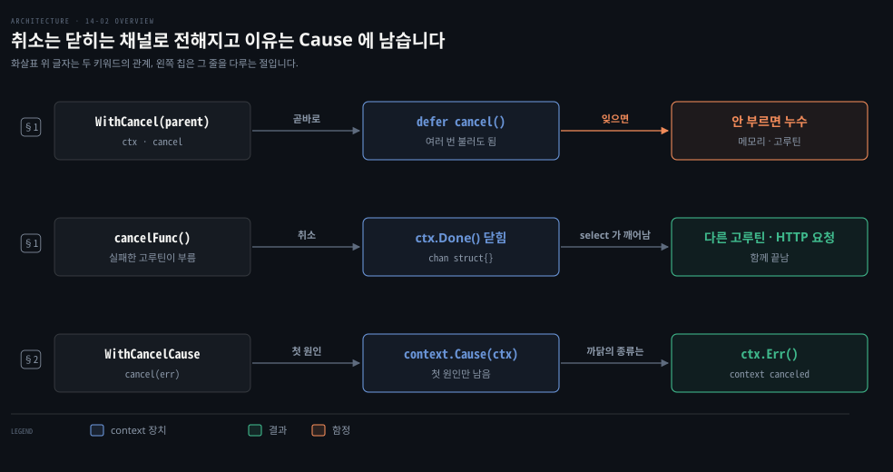
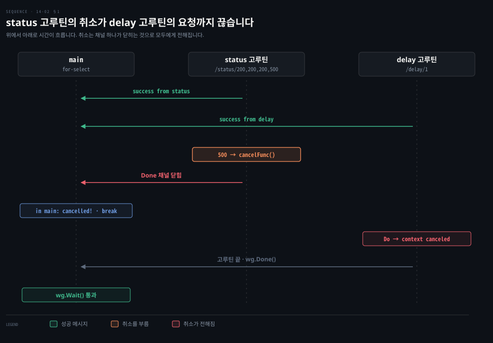
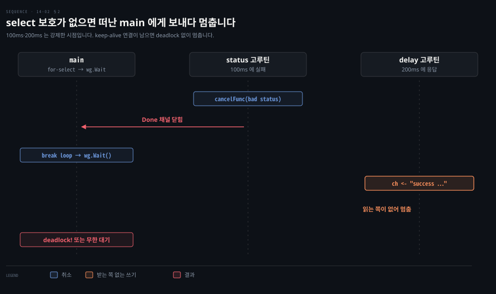

# 취소할 수 있는 context 는 cancel 을 꼭 부르고 Done 채널로 멈추며 Cause 로 이유를 남깁니다

---

> Learning Go 14장 가운데로, context 의 둘째 쓰임인 취소를 다룹니다. `context.WithCancel` 로 취소할 수 있는 context 를 만들고, `Done` 채널로 취소를 알아채며, `WithCancelCause` 와 `context.Cause` 로 취소한 이유를 남기는 법을 봅니다.

## 핵심 요약

> 이 편이 매달린 하나의 생각은 취소가 닫히는 채널 하나로 전해지고, 취소 함수는 무슨 일이 있어도 한 번은 불러야 한다는 것입니다.

`context.WithCancel` 은 자식 context 와 `CancelFunc` 를 돌려줍니다. 취소 함수를 부르지 않으면 메모리와 고루틴이 새므로 만들자마자 `defer` 로 부릅니다. 여러 번 불러도 괜찮습니다. 취소는 `Done` 이 돌려주는 `chan struct{}` 가 닫히는 것으로 전해지고, 취소할 수 없는 context 의 `Done` 은 `nil` 이라 `select` 밖에서 읽으면 영원히 멈춥니다.

`WithCancelCause` 의 취소 함수는 오류를 받고, `context.Cause` 는 처음 넘긴 오류를 돌려줍니다. Go 표준 HTTP 클라이언트는 취소를 따르므로 요청 중이던 고루틴도 끝납니다. 이 노트의 go1.25.1 에서는 그 오류 문구에 취소 원인이 그대로 실립니다.


## 학습 목표

> 이 편을 읽고 나면 아래 다섯 가지를 스스로 해낼 수 있습니다.

1. `context.WithCancel` 이 돌려주는 두 값과, 취소 함수를 반드시 불러야 하는 이유를 말할 수 있습니다.
2. `Done` 채널로 취소를 알아채는 `select` 를 쓰고, 취소할 수 없는 context 의 `Done` 이 `nil` 이라 생기는 함정을 말할 수 있습니다.
3. httpbin 예제에서 한 고루틴의 실패가 다른 고루틴의 HTTP 요청까지 끝내는 과정을 설명할 수 있습니다.
4. `WithCancelCause` 와 `context.Cause` 로 취소 이유를 남기고, 두 번째 원인이 첫 번째를 덮지 않는다는 것을 말할 수 있습니다.
5. `Cause` 가 메서드가 아니라 함수인 이유를 API 진화의 관점에서 설명할 수 있습니다.

아래는 이 편의 키워드를 이은 개념도입니다. 첫 줄은 취소할 수 있는 context 를 만들고 취소 함수를 `defer` 로 거는 흐름입니다. 둘째 줄은 취소가 `Done` 채널을 닫아 기다리던 쪽에 전해지는 흐름입니다. 셋째 줄은 취소 원인을 넘기고 `Cause` 로 꺼내는 흐름입니다. 왼쪽 칩이 그 줄을 다루는 절입니다.




## 1. WithCancel 로 취소할 수 있는 context 를 만들고 Done 채널로 알아챕니다

> `context.WithCancel` 은 자식 context 와 취소 함수를 돌려주고, 취소 함수는 `defer` 로 반드시 부릅니다. 취소되면 `Done` 이 돌려준 채널이 닫혀, 그 채널을 기다리던 `select` 가 곧바로 깨어납니다.

요청 하나가 고루틴 여러 개를 띄워 각각 다른 HTTP 서비스를 부른다고 해 봅시다. 한 서비스가 오류를 돌려줘 올바른 결과를 만들 수 없게 되면, 나머지 고루틴을 계속 돌릴 이유가 없습니다. 이미 소용없어진 일을 어떻게 멈추게 할까요? Go 에서는 이것을 **취소**(cancellation)라고 부르고, context 가 그 장치를 줍니다. 원문은 12-02 §4 의 「context 로 고루틴에 멈추라고 알립니다」에서 이것을 잠깐 다뤘다고 말합니다.

### 취소 함수는 반드시 부릅니다

취소할 수 있는 context 는 `context.WithCancel` 로 만듭니다. `context.Context` 를 받아 `context.Context` 와 `context.CancelFunc` 를 돌려줍니다. 14-01 §2 의 `WithValue` 처럼 돌려받은 context 는 넘긴 context 의 자식입니다. `CancelFunc` 는 매개변수가 없는 함수로, 부르면 context 를 취소해 취소를 지켜보는 모든 코드에 멈출 때라고 알립니다.

취소 함수가 딸린 context 를 만들었다면, 처리가 오류로 끝나든 아니든 끝날 때 반드시 그 취소 함수를 불러야 합니다. 원문은 부르지 않으면 프로그램이 자원(메모리와 고루틴)을 흘려 결국 느려지거나 멈춘다고 말합니다. 여러 번 불러도 오류는 없고, 첫 호출 뒤의 호출은 아무 일도 하지 않습니다.

확실히 부르는 가장 쉬운 방법은 취소 함수를 돌려받자마자 `defer` 로 거는 것입니다.

```go
ctx, cancelFunc := context.WithCancel(context.Background())
defer cancelFunc()
```

### 취소는 Done 채널이 닫히는 것으로 전해집니다

그러면 취소는 어떻게 알아챌까요? `context.Context` 인터페이스의 `Done` 메서드는 `struct{}` 타입의 채널을 돌려줍니다. 원문은 빈 struct 가 메모리를 쓰지 않아 이 타입을 골랐다고 말합니다. 취소 함수가 불리면 이 채널이 닫힙니다. 12-01 §3 에서 본 대로 닫힌 채널은 읽으려 하면 언제나 곧바로 제로 값을 돌려줍니다.

원문의 경고도 있습니다. 취소할 수 없는 context 에 `Done` 을 부르면 `nil` 이 돌아옵니다. 12-03 §3 에서 본 대로 `nil` 채널 읽기는 영원히 돌아오지 않습니다. `select` 의 `case` 안이 아닌 곳에서 읽으면 프로그램이 멈춥니다. 이 노트에서 `context.Background().Done() == nil` 은 `true` 였습니다.

### httpbin 예제 — 한 고루틴의 실패가 다른 고루틴의 요청을 끊습니다

원문은 여러 HTTP 엔드포인트에서 데이터를 모으다가 하나라도 실패하면 모두 멈추는 프로그램으로 이것을 보입니다. httpbin.org 는 여러 상황에 애플리케이션이 어떻게 반응하는지 시험하라고 HTTP 요청을 받아 주는 서비스입니다. 원문은 응답을 정한 초만큼 늦추는 엔드포인트와, 보낸 상태 코드 가운데 하나를 돌려주는 엔드포인트를 씁니다.

먼저 취소할 수 있는 context, 고루틴이 데이터를 돌려보낼 채널, 모든 고루틴이 끝나기를 기다릴 `sync.WaitGroup`(12-03 §5)을 만듭니다.

```go
ctx, cancelFunc := context.WithCancel(context.Background())
defer cancelFunc()
ch := make(chan string)
var wg sync.WaitGroup
wg.Add(2)
```

다음으로 고루틴 둘을 띄웁니다. 하나는 무작위로 나쁜 상태를 돌려주는 URL 을 부르고, 다른 하나는 1초 늦게 정해진 JSON 을 돌려주는 URL 을 부릅니다.

```go
go func() {
	defer wg.Done()
	for {
		// return one of these status code at random
		resp, err := makeRequest(ctx,
			"http://httpbin.org/status/200,200,200,500")
		if err != nil {
			fmt.Println("error in status goroutine:", err)
			cancelFunc()
			return
		}
		if resp.StatusCode == http.StatusInternalServerError {
			fmt.Println("bad status, exiting")
			cancelFunc()
			return
		}
		select {
		case ch <- "success from status":
		case <-ctx.Done():
		}
		time.Sleep(1 * time.Second)
	}
}()
```

`makeRequest` 는 넘긴 context 와 URL 로 HTTP 요청을 보내는 도우미입니다. 상태가 OK 면 채널에 메시지를 쓰고 1초 잡니다. 오류가 나거나 나쁜 상태를 받으면 `cancelFunc` 를 부르고 고루틴을 끝냅니다. 1초 지연을 부르는 고루틴도 비슷합니다. 그쪽은 성공하면 응답의 `date` 헤더를 붙여 채널에 씁니다.

마지막으로 `main` 은 for-select 로 채널을 읽으며 취소를 기다립니다.

```go
loop:
	for {
		select {
		case s := <-ch:
			fmt.Println("in main:", s)
		case <-ctx.Done():
			fmt.Println("in main: cancelled!")
			break loop
		}
	}
	wg.Wait()
```

`select` 의 한 `case` 는 메시지 채널을 읽고, 다른 `case` 는 done 채널이 닫히기를 기다립니다. 닫히면 루프를 빠져나와 고루틴들이 끝나기를 기다립니다. 결과는 무작위라 여러 번 돌려 보라고 원문은 말합니다. 이 노트의 한 번은 이렇게 끝났습니다.

```bash
in main: success from status
in main: success from delay: Mon, 28 Sep 2026 01:52:57 GMT
in main: success from status
in main: success from delay: Mon, 28 Sep 2026 01:52:58 GMT
bad status, exiting
in main: cancelled!
error in delay goroutine: Get "http://httpbin.org/delay/1": context canceled
```



원문은 두 가지를 짚습니다. 첫째, `cancelFunc` 를 여러 번 부르지만 앞서 말한 대로 괜찮습니다. 둘째, 취소가 걸린 뒤 delay 고루틴에서 오류가 났습니다. Go 표준 라이브러리의 HTTP 클라이언트가 취소를 따르기 때문입니다. 요청을 취소할 수 있는 context 로 만들었으니 취소되자 요청도 끝났습니다. 그래서 고루틴이 오류 경로로 들어가 새지 않고 끝납니다.


## 2. WithCancelCause 와 Cause 로 취소한 이유를 남깁니다

> `context.WithCancelCause` 의 취소 함수는 오류를 받고, `context.Cause` 는 처음 넘긴 오류를 돌려줍니다. `Cause` 가 메서드가 아니라 함수인 것은 Go 1.20 에 더해진 기능이 기존 구현을 깨지 않게 하려는 선택입니다.

앞의 예제는 취소됐다는 사실만 알려 줍니다. 무엇 때문에 취소됐는지는 어떻게 알리고 보고할까요? `WithCancel` 의 다른 판인 `WithCancelCause` 는 오류를 매개변수로 받는 취소 함수를 돌려줍니다. `context` 패키지의 `Cause` 함수는 취소 함수의 첫 호출에 넘긴 오류를 돌려줍니다.

### Cause 는 메서드가 아니라 함수입니다

원문의 메모는 `Cause` 가 `context.Context` 의 메서드가 아니라 `context` 패키지의 함수인 이유를 설명합니다. 취소로 오류를 돌려주는 기능은 Go 1.20 에 context 가 처음 나오고 한참 뒤에 더해졌습니다. `context.Context` 인터페이스에 새 메서드를 더하면 그 인터페이스를 구현한 서드파티 코드가 모두 깨집니다.

새 메서드를 담은 새 인터페이스를 정의하는 길도 있었습니다. 하지만 기존 코드는 이미 곳곳에서 `context.Context` 를 넘기고 있어, 새 인터페이스로 바꾸려면 타입 단언이나 타입 스위치가 필요합니다. 함수를 더하는 것이 가장 단순한 길이라고 원문은 말합니다. API 를 진화시키는 방법은 여럿이고 사용자에게 영향이 가장 적은 것을 고르라고 합니다. 13-04 §4 의 `ResponseController` 가 인터페이스 대신 구체 타입으로 기능을 더한 것과 같은 고민입니다. 이 연결은 노트의 풀이입니다.

### 원인을 넘기고 Cause 로 꺼냅니다

원문은 프로그램을 고쳐 오류를 붙잡습니다. 먼저 context 를 만드는 부분을 바꿉니다. 취소 함수가 오류를 받으므로 `defer` 에서는 `nil` 을 넘깁니다.

```go
ctx, cancelFunc := context.WithCancelCause(context.Background())
defer cancelFunc(nil)
```

status 고루틴의 for 루프 본문은 이렇게 바뀝니다. `fmt.Println` 을 걷어 내고 오류를 `cancelFunc` 에 넘깁니다.

```go
resp, err := makeRequest(ctx, "http://httpbin.org/status/200,200,200,500")
if err != nil {
	cancelFunc(fmt.Errorf("in status goroutine: %w", err))
	return
}
if resp.StatusCode == http.StatusInternalServerError {
	cancelFunc(errors.New("bad status"))
	return
}
ch <- "success from status"
time.Sleep(1 * time.Second)
```

delay 고루틴은 오류가 여전히 생겨 `cancelFunc` 에 넘겨진다는 것을 보이려고 `fmt.Println` 을 남겨 둡니다. `main` 은 처음 취소를 알아챘을 때와 고루틴을 모두 기다린 뒤에 `context.Cause` 를 찍습니다.

```go
		case <-ctx.Done():
			fmt.Println("in main: cancelled with error", context.Cause(ctx))
			break loop
		}
	}
	wg.Wait()
	fmt.Println("context cause:", context.Cause(ctx))
```

원문의 출력은 이렇습니다.

```bash
in main: success from status
in main: success from delay: Thu, 16 Feb 2023 04:11:49 GMT
in main: cancelled with error bad status
in delay goroutine: Get "http://httpbin.org/delay/1": context canceled
context cause: bad status
```

status 고루틴의 오류는 처음 취소를 알아챘을 때와 delay 고루틴을 기다린 뒤 두 번 찍힙니다. delay 고루틴도 오류를 넘겨 `cancelFunc` 를 불렀지만 그 오류는 처음 취소 원인을 덮어쓰지 않습니다. 이 노트에서 `first`·`second` 를 차례로 넘기니 `Cause` 는 `first`, `Err` 는 `context canceled` 였습니다.

> **원문 정오**: 원문은 오류가 "cancellation is initially detected in the switch statement" 때 찍힌다고 적었습니다. 바로 위 코드에서 취소를 알아채는 것은 `switch` 가 아니라 `select` 문의 `case <-ctx.Done()` 입니다. 책 16개 장 PDF 전체에서 이 문구는 이 한 곳에만 나옵니다.

### Go 1.23 부터 HTTP 오류에 취소 원인이 실립니다

원문 밖 보충입니다. 이 노트의 go1.25.1 에서 cancel_error_http 를 돌리니 delay 고루틴의 줄이 원문과 달랐습니다. `in delay goroutine: Get "http://httpbin.org/delay/1": bad status` 가 찍혔습니다. 원문의 `context canceled` 자리에 취소 원인이 들어간 것입니다.

로컬 httptest 서버로 같은 상황을 만들어 보니 go1.23.0 과 go1.25.1 모두 `bad status` 였습니다. 이때 `errors.Is(err, context.Canceled)` 는 `false` 였습니다. 받아 둔 툴체인 소스를 보니 `net/http/transport.go` 에서 `context.Cause` 를 쓰는 곳이 go1.22.12 에는 0곳, go1.23.0 에는 5곳이었습니다.

그래서 `WithCancelCause` 로 취소하고 HTTP 오류를 `errors.Is(err, context.Canceled)` 로 가르던 코드는 Go 1.23 부터 기대와 다르게 동작합니다. 취소 여부는 요청의 오류보다 `ctx.Err()` 로 확인하는 편이 안전합니다. go1.21·go1.22 바이너리는 이 macOS 에서 실행되지 않아, 옛 버전 쪽은 소스 비교로만 확인했습니다.

### select 보호를 뺀 판은 드물게 멈출 수 있습니다

원문 밖 보충입니다. 원문은 이 판에서 고루틴이 채널에 쓰는 부분을 `ch <- "success from status"` 로 바꿨습니다. 첫 판의 `select { case ch <- ...: case <-ctx.Done(): }` 보호가 빠진 것입니다. 응답을 이미 받은 고루틴이 채널에 쓰려는 순간 `main` 이 취소를 보고 루프를 떠났다면, 그 쓰기를 받아 줄 쪽이 없습니다.

이 노트를 쓰면서 이 순서를 시간으로 강제한 작은 프로그램을 돌렸습니다. status 쪽은 100ms 뒤 취소하고, delay 쪽은 200ms 뒤 채널에 쓰게 했습니다. `in main: cancelled with error bad status` 다음에 `fatal error: all goroutines are asleep - deadlock!` 이 났습니다. 실제 네트워크에서는 요청이 취소되면 대부분 오류 경로로 빠지므로 창은 좁습니다.

창에 걸렸을 때 더 나쁜 쪽은 오류 없이 멈추는 경우입니다. 로컬 HTTP 서버를 두고 기본 `http.DefaultClient` 로 같은 순서를 만들자 `deadlock!` 없이 5초 제한이 끝날 때까지 멈춰 있었습니다. 요청을 마친 연결이 keep-alive 로 남아 그 연결의 고루틴이 네트워크를 기다리므로 런타임은 모든 고루틴이 잠들었다고 보지 않습니다. `DisableKeepAlives` 를 켜자 다시 `deadlock!` 으로 끝났습니다. 12-02 §4 대로 고루틴이 반드시 끝나게 하려면 첫 판의 `select` 보호를 남기는 편이 맞습니다.



### Go 1.21 의 AfterFunc 와 WithoutCancel

원문 밖 보충입니다. go1.25.1 의 `api/go1.21.txt` 에는 원문이 다루지 않은 context 함수 둘이 더 있습니다. `context.AfterFunc(ctx, f)` 는 ctx 가 취소되면 `f` 를 별도 고루틴에서 부르게 등록하고, 등록을 거두는 `stop` 함수를 돌려줍니다. `context.WithoutCancel(ctx)` 는 부모의 값은 그대로 보이면서 부모가 취소돼도 취소되지 않는 context 를 만듭니다.

이 노트에서 부모를 취소하니 `AfterFunc` 에 건 함수가 불렸습니다. `WithoutCancel` 로 만든 context 는 `Err` 가 `nil`, `Done` 이 `nil` 이었습니다. 요청이 끝나도 이어 가야 하는 뒷정리 작업에 요청의 추적 값만 넘기고 싶을 때 맞는 함수입니다. 이 쓰임은 노트의 풀이입니다.


## 핵심 개념 체크리스트

목표 번호 순서대로 짝지었습니다.

- [ ] (목표 1) `WithCancel` 로 만든 context 의 취소 함수를 부르지 않으면 무엇이 샙니까?
- [ ] (목표 2) `context.Background().Done()` 을 `select` 밖에서 읽으면 무슨 일이 일어납니까?
- [ ] (목표 3) status 고루틴이 `cancelFunc` 를 부른 뒤 delay 고루틴의 `makeRequest` 가 오류를 돌려주는 이유를 말할 수 있습니까?
- [ ] (목표 4) 두 고루틴이 서로 다른 오류로 취소 함수를 부르면 `context.Cause` 는 무엇을 돌려줍니까?
- [ ] (목표 5) `Cause` 를 `context.Context` 의 메서드로 더하지 않은 이유를 말할 수 있습니까?


## 관련 문서

- [14-01 context 는 첫 매개변수로 넘기고 값은 내보내지 않은 키로 담습니다](./14-01.context%20%EB%8A%94%20%EC%B2%AB%20%EB%A7%A4%EA%B0%9C%EB%B3%80%EC%88%98%EB%A1%9C%20%EB%84%98%EA%B8%B0%EA%B3%A0%20%EA%B0%92%EC%9D%80%20%EB%82%B4%EB%B3%B4%EB%82%B4%EC%A7%80%20%EC%95%8A%EC%9D%80%20%ED%82%A4%EB%A1%9C%20%EB%8B%B4%EC%8A%B5%EB%8B%88%EB%8B%A4.md) — 14장 앞. context 와 값
- [14-03 WithTimeout 은 요청 시간을 제한하고 자식은 부모 기한을 넘지 못하며 긴 계산은 스스로 취소를 확인합니다](./14-03.WithTimeout%20%EC%9D%80%20%EC%9A%94%EC%B2%AD%20%EC%8B%9C%EA%B0%84%EC%9D%84%20%EC%A0%9C%ED%95%9C%ED%95%98%EA%B3%A0%20%EC%9E%90%EC%8B%9D%EC%9D%80%20%EB%B6%80%EB%AA%A8%20%EA%B8%B0%ED%95%9C%EC%9D%84%20%EB%84%98%EC%A7%80%20%EB%AA%BB%ED%95%98%EB%A9%B0%20%EA%B8%B4%20%EA%B3%84%EC%82%B0%EC%9D%80%20%EC%8A%A4%EC%8A%A4%EB%A1%9C%20%EC%B7%A8%EC%86%8C%EB%A5%BC%20%ED%99%95%EC%9D%B8%ED%95%A9%EB%8B%88%EB%8B%A4.md) — 14장 끝. 시간 제한
- [12-02 select 는 준비된 case 를 무작위로 고르고 고루틴은 반드시 끝나게 만듭니다](./12-02.select%20%EB%8A%94%20%EC%A4%80%EB%B9%84%EB%90%9C%20case%20%EB%A5%BC%20%EB%AC%B4%EC%9E%91%EC%9C%84%EB%A1%9C%20%EA%B3%A0%EB%A5%B4%EA%B3%A0%20%EA%B3%A0%EB%A3%A8%ED%8B%B4%EC%9D%80%20%EB%B0%98%EB%93%9C%EC%8B%9C%20%EB%81%9D%EB%82%98%EA%B2%8C%20%EB%A7%8C%EB%93%AD%EB%8B%88%EB%8B%A4.md) — 12장. select 와 고루틴 누수
- [12-03 버퍼 채널은 개수를 알 때 쓰고 WaitGroup 과 Once 가 기다림과 한 번 실행을 맡습니다](./12-03.%EB%B2%84%ED%8D%BC%20%EC%B1%84%EB%84%90%EC%9D%80%20%EA%B0%9C%EC%88%98%EB%A5%BC%20%EC%95%8C%20%EB%95%8C%20%EC%93%B0%EA%B3%A0%20WaitGroup%20%EA%B3%BC%20Once%20%EA%B0%80%20%EA%B8%B0%EB%8B%A4%EB%A6%BC%EA%B3%BC%20%ED%95%9C%20%EB%B2%88%20%EC%8B%A4%ED%96%89%EC%9D%84%20%EB%A7%A1%EC%8A%B5%EB%8B%88%EB%8B%A4.md) — 12장. nil 채널과 WaitGroup
- [Learning Go 2판 — 정독 인덱스](./README.md) — 16장 전체 지도


## 참고 자료

- 원본: 《Learning Go, 2nd Edition》 (Jon Bodner, O'Reilly)
- 다룬 범위: Chapter 14 "Cancellation"
- 원서 예제 저장소: [learning-go-book-2e/ch14](https://github.com/learning-go-book-2e/ch14)
- [context 패키지](https://pkg.go.dev/context) — AfterFunc·WithoutCancel·WithCancelCause
- [httpbin.org](http://httpbin.org) — 원문이 쓴 시험용 HTTP 서비스
