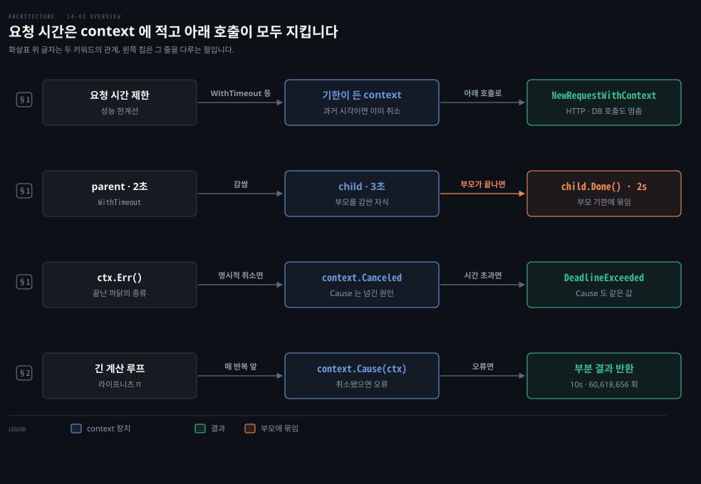
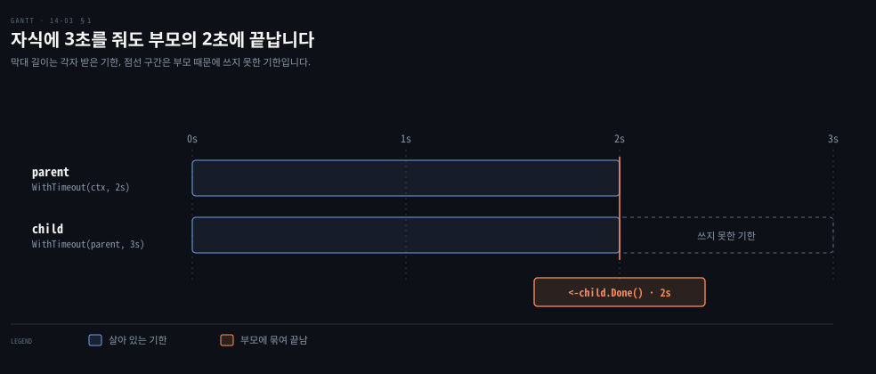
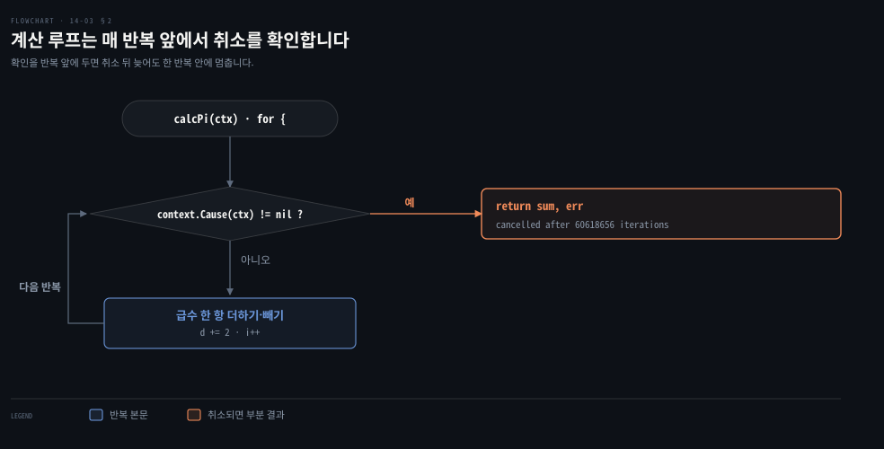

# WithTimeout 은 요청 시간을 제한하고 자식은 부모 기한을 넘지 못하며 긴 계산은 스스로 취소를 확인합니다

---

> Learning Go 14장 끝입니다. 서버가 부하를 다스리는 방법 가운데 요청 시간 제한을 맡는 `context.WithTimeout`·`WithDeadline`, 부모와 자식 기한의 관계, 취소 까닭을 알려 주는 `Err`, 그리고 직접 짠 오래 도는 코드가 취소를 확인하는 법을 다루고 장 끝 연습 문제를 풉니다.

## 핵심 요약

> 이 편이 매달린 하나의 생각은 요청마다 쓸 수 있는 시간을 context 에 적어 두면 그 아래의 모든 호출이 같은 기한을 지킨다는 것입니다.

`context.WithTimeout` 은 기간을, `context.WithDeadline` 은 시각을 받아 그때 스스로 취소되는 context 와 취소 함수를 돌려줍니다. 과거 시각을 주면 처음부터 취소된 채 만들어집니다. 자식에 부모보다 긴 기한을 줘도 부모가 끝나면 자식도 끝납니다. `Err` 는 취소 함수로 끝났으면 `context.Canceled`, 시간이 다 됐으면 `context.DeadlineExceeded` 를 돌려줍니다.

직접 짠 코드는 대개 취소를 신경 쓸 만큼 오래 돌지 않습니다. HTTP·데이터베이스 호출에 context 를 넘기면 그쪽이 알아서 멈춥니다. 채널을 `select` 로 다루는 함수는 `Done` 을 보는 `case` 를 두고, 오래 도는 계산은 틈틈이 `context.Cause` 로 취소를 확인합니다.


## 학습 목표

> 이 편을 읽고 나면 아래 다섯 가지를 스스로 해낼 수 있습니다.

1. 서버가 부하를 다스리는 네 방법과, 그 가운데 context 가 맡는 것을 말할 수 있습니다.
2. `WithTimeout`·`WithDeadline` 으로 시간 제한 context 를 만들고, 과거 시각을 줄 때와 `Deadline` 메서드의 동작을 말할 수 있습니다.
3. 부모 2초·자식 3초 context 의 자식이 언제 끝나는지와 그 이유를 설명할 수 있습니다.
4. `Err` 가 돌려주는 두 센티널 오류와, 시간 초과일 때 `Cause` 가 무엇을 돌려주는지 가를 수 있습니다.
5. 오래 도는 함수에 취소 확인을 넣고, 요청 시간을 제한하는 미들웨어를 쓸 수 있습니다.

아래는 이 편의 키워드를 이은 개념도입니다. 첫 줄은 요청 시간을 context 로 제한하는 흐름입니다. 둘째 줄은 자식 기한이 부모 기한에 묶이는 관계입니다. 셋째 줄은 끝난 까닭을 `Err` 와 `Cause` 로 가르는 흐름입니다. 넷째 줄은 오래 도는 계산이 스스로 취소를 확인하는 흐름입니다. 왼쪽 칩이 그 줄을 다루는 절입니다.




## 1. WithTimeout 과 WithDeadline 으로 요청이 쓸 시간을 제한합니다

> 서버는 공유 자원이라 요청마다 쓸 시간을 스스로 제한해야 합니다. `WithTimeout`·`WithDeadline` 이 그 기한을 담은 context 를 만들고, 자식 context 의 기한은 부모 기한을 넘지 못합니다.

원문은 초보 프로그래머가 서버는 받을 수 있는 만큼 요청을 받아, 각 클라이언트에 결과를 돌려줄 때까지 할 수 있는 만큼 오래 붙잡고 있어야 한다고 생각하기 쉽다고 말합니다. 문제는 이 방식이 규모를 버티지 못한다는 것입니다. 서버는 공유 자원입니다. 사용자마다 최대한 많이 얻어 가려 할 뿐 다른 사용자는 신경 쓰지 않습니다. 모두에게 공정한 시간을 주도록 스스로를 다스리는 것은 공유 자원의 책임입니다.

### 서버가 부하를 다스리는 네 방법

원문은 서버가 부하를 다스리려고 할 수 있는 일을 넷으로 꼽습니다.

| 방법 | Go 의 도구 |
|---|---|
| 동시에 도는 요청 수를 제한합니다 | 고루틴 수를 제한합니다(12-03 §2 백프레셔) |
| 실행을 기다리는 요청 수를 제한합니다 | 버퍼 있는 채널로 대기열 크기를 정합니다(12-03 §1) |
| 요청 하나가 도는 시간을 제한합니다 | context 의 기한 — 이 절 |
| 요청 하나가 쓰는 자원을 제한합니다 | 직접 짜야 합니다 |

원문의 메모는 마지막 칸을 풀어 줍니다. `GOMEMLIMIT`(06-03 §3)는 Go 프로그램 전체의 메모리를 느슨하게 제한할 뿐입니다. 요청 하나가 쓰는 메모리나 디스크를 제한하려면 그 코드를 직접 써야 하고, 이 책의 범위를 넘는다고 원문은 말합니다.

애플리케이션을 만들 때는 성능 한계선을 알아야 합니다. 사용자가 불만을 느끼기 전에 요청이 끝나야 하는 시간입니다. 요청이 돌 수 있는 최대 시간을 안다면 context 로 그것을 강제할 수 있습니다.

### 기간으로도 시각으로도 기한을 정합니다

시간 제한 context 를 만드는 함수는 둘입니다. `context.WithTimeout` 은 기존 context 와, 자동으로 취소될 때까지의 기간인 `time.Duration`(13-02 §1)을 받습니다. 그 기간이 지나면 스스로 취소되는 context 와 곧바로 취소하는 취소 함수를 돌려줍니다. `context.WithDeadline` 은 기존 context 와 자동으로 취소될 시각인 `time.Time` 을 받고, 같은 두 값을 돌려줍니다.

원문의 팁대로 `WithDeadline` 에 과거 시각을 넘기면 context 는 이미 취소된 채 만들어집니다. 이 노트에서 1초 전 시각을 주니 `Err` 가 곧바로 `context deadline exceeded` 였습니다. `WithCancel`·`WithCancelCause` 의 취소 함수처럼(14-02 §1), 이 두 함수가 돌려준 취소 함수도 적어도 한 번은 불러야 합니다.

context 가 언제 스스로 취소될지 알고 싶으면 `context.Context` 의 `Deadline` 메서드를 씁니다. 그 시각인 `time.Time` 과, 시간 제한이 걸렸는지 알리는 `bool` 을 돌려줍니다. 원문은 map 이나 채널을 읽을 때의 comma ok 관용구와 닮은 모양이라고 말합니다. 이 노트에서 `context.Background()` 의 `Deadline` 은 제로 시각과 `false` 였습니다.

### 자식 context 의 기한은 부모 기한을 넘지 못합니다

요청 전체에 시간 제한을 걸었다면 그 시간을 다시 나누고 싶을 수 있습니다. 다른 서비스를 부를 때 네트워크 호출에 쓸 시간을 제한해, 나머지 처리나 다른 호출에 쓸 시간을 남겨 두는 경우입니다. 호출 하나의 시간은 부모 context 를 `WithTimeout` 이나 `WithDeadline` 으로 감싼 자식 context 로 제한합니다.

자식에 건 시간 제한은 부모의 시간 제한에 묶입니다. 부모가 2초 뒤 끝난다면 자식에 3초를 줘도, 2초 뒤 부모가 끝날 때 자식도 끝납니다. 원문은 짧은 프로그램으로 이것을 보입니다.

```go
ctx := context.Background()
parent, cancel := context.WithTimeout(ctx, 2*time.Second)
defer cancel()
child, cancel2 := context.WithTimeout(parent, 3*time.Second)
defer cancel2()
start := time.Now()
<-child.Done()
end := time.Now()
fmt.Println(end.Sub(start).Truncate(time.Second))
```

원문 PDF 는 둘째 줄의 `parent, cancel :=` 가 판면에서 어긋나 찍혔고, 위는 저장소의 nested_timers 와 대조한 것입니다. 자식 context 의 `Done` 채널을 기다리면 원문과 이 노트 모두 `2s` 가 찍힙니다.



### Err 가 끝난 까닭을, Cause 가 그 이유를 알려 줍니다

시간 제한이 걸린 context 는 시간이 다 돼서도, 취소 함수를 불러서도 끝날 수 있습니다. 어느 쪽이었는지는 어떻게 알까요? `Err` 메서드는 context 가 아직 살아 있으면 `nil` 을, 끝났으면 센티널 오류(09-01 §3) 둘 가운데 하나를 돌려줍니다. 명시적으로 취소했으면 `context.Canceled`, 시간이 다 돼 취소됐으면 `context.DeadlineExceeded` 입니다.

원문은 14-02 의 httpbin 프로그램에 시간 제한을 하나 더 겁니다. 3초 시간 제한 context 를 `WithCancelCause` 로 감쌉니다.

```go
ctx, cancelFuncParent := context.WithTimeout(context.Background(), 3*time.Second)
defer cancelFuncParent()
ctx, cancelFunc := context.WithCancelCause(ctx)
defer cancelFunc(nil)
```

원문의 메모대로 취소 원인을 돌려받고 싶다면 `WithTimeout`·`WithDeadline` 으로 만든 context 를 `WithCancelCause` 로 감싸야 합니다. 자원이 새지 않게 두 취소 함수를 모두 `defer` 로 부릅니다. 시간 초과일 때 직접 정한 센티널 오류를 원인으로 돌려주고 싶다면 `WithTimeoutCause`·`WithDeadlineCause` 를 대신 씁니다. 이 노트에서 `WithTimeoutCause` 에 `too slow` 를 주니 `Cause` 는 `too slow`, `Err` 는 `context deadline exceeded` 였습니다.

이제 프로그램은 500 상태를 받거나 3초 안에 500 을 받지 못하면 끝납니다. 취소될 때 `Cause` 와 `Err` 를 함께 찍습니다. 시간이 다 된 경우의 이 노트 출력입니다.

```bash
in main: success from status
in main: success from delay: Mon, 28 Sep 2026 01:53:04 GMT
in main: success from status
in main: success from delay: Mon, 28 Sep 2026 01:53:05 GMT
in delay goroutine: Get "http://httpbin.org/delay/1": context deadline exceeded
in main: cancelled with cause: context deadline exceeded err: context deadline exceeded
context cause: context deadline exceeded
```

시간이 다 되면 `Cause` 와 `Err` 가 같은 `context.DeadlineExceeded` 를 돌려줍니다. 원문의 다른 경우처럼 3초 안에 나쁜 상태를 받으면 `Cause` 는 `bad status`, `Err` 는 `context canceled` 입니다. 두 경우를 나란히 놓으면 이렇습니다.

| 끝난 까닭 | `Err` 가 돌려준 값 | `Cause` 가 돌려준 값 |
|---|---|---|
| 3초 시간 제한이 다 됨 | `context deadline exceeded` | `context deadline exceeded` |
| status 고루틴이 `cancelFunc(errors.New("bad status"))` | `context canceled` | `bad status` |


## 2. 오래 도는 코드는 스스로 취소를 확인합니다

> 직접 짠 코드는 대개 취소를 챙길 만큼 오래 돌지 않고, HTTP·데이터베이스 호출에 context 를 넘기면 그쪽이 멈춥니다. 채널을 `select` 로 다루는 함수와 오래 도는 계산만 스스로 취소를 확인합니다.

원문은 대부분의 경우 자기 코드 안에서 시간 제한이나 취소를 걱정할 필요가 없다고 말합니다. 그만큼 오래 돌지 않기 때문입니다. 다른 HTTP 서비스나 데이터베이스를 부를 때는 context 를 넘기면 됩니다. 그 라이브러리들이 context 로 취소를 제대로 처리합니다. 그렇다면 직접 챙겨야 하는 경우는 언제일까요? 원문은 둘을 꼽습니다.

첫째는 `select` 로 채널을 읽거나 쓰는 함수입니다. 14-02 §1 에서 본 대로 context 의 `Done` 이 돌려준 채널을 보는 `case` 를 넣습니다. 그러면 고루틴들이 취소를 제대로 처리하지 않더라도 이 함수는 취소될 때 빠져나옵니다.

둘째는 context 취소로 중간에 멈춰야 할 만큼 오래 도는 코드입니다. 이때는 틈틈이 `context.Cause` 로 context 의 상태를 확인합니다. context 가 취소됐으면 `context.Cause` 가 오류를 돌려줍니다.

```go
func longRunningComputation(ctx context.Context, data string) (string, error) {
	for {
		// do some processing
		// insert this if statement periodically
		// to check if the context has been cancelled
		if err := context.Cause(ctx); err != nil {
			// return a partial value if it makes sense,
			// or a default one if it doesn't
			return "", err
		}
		// do some more processing and loop again
	}
}
```

원문의 예는 비효율적인 라이프니츠 급수로 π 를 계산하는 함수입니다. 매 반복 앞에서 `context.Cause` 를 확인하므로 context 취소로 얼마나 오래 돌지 정할 수 있습니다.

```go
for {
	if err := context.Cause(ctx); err != nil {
		fmt.Println("cancelled after", i, "iterations")
		return sum.Text('g', 100), err
	}
	var diff big.Float
	diff.SetInt64(4)
	diff.Quo(&diff, &d)
	if i%2 == 0 {
		sum.Add(&sum, &diff)
	} else {
		sum.Sub(&sum, &diff)
	}
	d.Add(&d, two)
	i++
}
```



저장소의 own_cancellation 은 시간 제한을 1·2·5·10초로 바꿔 네 번 계산합니다. 이 노트에서 반복 횟수는 6,147,912·12,579,951·29,029,893·60,618,656 이었습니다. 걸린 시간은 각각 1.000174s·2.001024792s·5.001040041s·10.000877s 였고, 매번 오류는 `context deadline exceeded` 였습니다. 반복 횟수는 기계 부하에 따라 실행마다 달라서, 다시 돌리니 10초에 64,363,815번이었습니다.

10초 동안 돌린 값도 `3.14159263…` 이라 소수 여덟째 자리부터 어긋납니다. 원문이 비효율적인 알고리즘이라 부른 까닭이 숫자로 드러납니다.


## 연습 문제

> 원문 연습 문제 셋은 시간 제한 미들웨어, 2초 안에 난수를 더하는 프로그램, context 에 로그 레벨을 담는 미들웨어입니다. 이 노트는 원서 예제 저장소의 풀이를 go1.25.1 에서 돌렸고, 8080 포트를 OrbStack 이 쓰고 있어 서버 풀이는 18190·18191 로 바꿨습니다.

### 1. 시간 제한을 거는 미들웨어

첫 문제는 요청이 돌 수 있는 밀리초를 매개변수 하나로 받아 `func(http.Handler) http.Handler` 를 돌려주는, 시간 제한 context 를 만드는 미들웨어 생성 함수입니다. 13-04 §3 의 `TerribleSecurityProvider` 처럼 설정을 받는 미들웨어 모양입니다.

```go
func Timeout(ms int) func(h http.Handler) http.Handler {
	return func(h http.Handler) http.Handler {
		return http.HandlerFunc(func(w http.ResponseWriter, r *http.Request) {
			ctx := r.Context()
			ctx, cancelFunc := context.WithTimeout(ctx, time.Duration(ms)*time.Millisecond)
			defer cancelFunc()
			r = r.WithContext(ctx)
			h.ServeHTTP(w, r)
		})
	}
}
```

풀이의 핸들러는 0~200ms 를 무작위로 기다리고, 100ms 시간 제한에 걸리면 `errors.Is(err, context.DeadlineExceeded)` 로 가려 504 를 돌려줍니다. 여섯 번 부르니 504 가 다섯 번, 200 이 한 번이었습니다.

이 노트를 쓰면서 풀이를 `:8080` 그대로 돌리니 아무것도 찍지 않고 곧바로 exit 0 으로 끝났습니다. OrbStack 이 8080 을 쓰고 있어 `ListenAndServe` 가 오류를 돌려줬는데, 풀이가 그 반환 값을 버리기 때문입니다. 13-04 §2 의 서버 예제처럼 `ErrServerClosed` 가 아닌 오류는 확인해야 이런 실패가 드러납니다. 이 지적은 노트의 것입니다.

### 2. 1234 가 나오거나 2초가 지날 때까지 더하기

둘째 문제는 0 이상 100,000,000 미만의 난수를 더하다가 1234 가 나오거나 2초가 지나면 멈추고 합과 반복 횟수와 멈춘 까닭을 찍는 프로그램입니다. 풀이는 2초 `WithTimeout` context 를 만들고 매 반복 앞에서 `select` 의 `default` 로 `ctx.Done()` 을 막히지 않게 확인합니다.

```go
for {
	select {
	case <-ctx.Done():
		fmt.Println("total:", total, "number of iterations:", count, ctx.Err())
		return
	default:
	}
	newNum := rand.Intn(100_000_000)
	if newNum == 1_234 {
		fmt.Println("total:", total, "number of iterations:", count, "got 1,234")
		return
	}
	total += newNum
	count++
}
```

이 노트의 한 번은 19,650,055 번째에서 `got 1,234` 로 끝났습니다. 1234 가 나올 확률은 반복마다 1억분의 1이라, 2초 안에 나올지는 실행마다 다릅니다.

### 3. context 에 로그 레벨을 담습니다

셋째 문제는 바탕 타입이 `string` 인 `Level` 과 두 상수 `Debug`·`Info` 를 정의하고 로그 레벨을 context 에 담고 꺼내는 함수를 만드는 것입니다. 미들웨어는 쿼리 매개변수 `log_level` 에서 레벨을 꺼내 담습니다. 로그 함수는 context 에서 레벨을 꺼내 메시지를 찍을지 정합니다. 레벨이 없거나 올바른 값이 아니면 아무것도 찍지 않아야 합니다.

풀이는 14-01 §2 의 `iota` 키와 `ContextWith`·`FromContext` 이름 관례를 그대로 씁니다.

```go
type logKey int

const (
	_ logKey = iota
	key
)

func ContextWithLevel(ctx context.Context, level Level) context.Context {
	return context.WithValue(ctx, key, level)
}

func LevelFromContext(ctx context.Context) (Level, bool) {
	level, ok := ctx.Value(key).(Level)
	return level, ok
}
```

미들웨어는 올바르지 않은 값도 그대로 `Level` 로 담습니다. 대신 `Log` 가 `Debug`·`Info` 와 같을 때만 찍으므로 결과는 조건과 맞습니다. `log_level=debug` 는 두 줄, `info` 는 info 한 줄을 찍었고, `trace` 와 빈 값은 아무것도 찍지 않았습니다.

원문은 장을 맺으며 context 로 요청 메타데이터를 다루는 법을 배웠다고 정리합니다. 이제 시간 제한과 명시적 취소, 값 넘기기를 할 줄 알고, 각각을 언제 써야 하는지 안다고 말합니다. 다음 장은 Go 에 내장된 테스트 프레임워크로 버그를 찾고 성능 문제를 진단하는 법을 다룹니다.


## 핵심 개념 체크리스트

목표 번호 순서대로 짝지었습니다.

- [ ] (목표 1) 서버가 부하를 다스리는 네 방법 가운데 Go 가 도구를 주지 않는 것은 무엇입니까?
- [ ] (목표 2) `WithDeadline` 에 1초 전 시각을 주면 만들어진 context 의 `Err` 는 무엇입니까?
- [ ] (목표 3) 부모 2초·자식 3초 context 의 `child.Done()` 을 기다리면 몇 초 뒤 풀립니까?
- [ ] (목표 4) 시간 제한 context 를 `WithCancelCause` 로 감싸고 `cancelFunc(errors.New("bad status"))` 로 끝냈을 때 `Err` 와 `Cause` 는 각각 무엇입니까?
- [ ] (목표 5) 오래 도는 계산 루프의 어디에 `context.Cause` 확인을 넣습니까?


## 관련 문서

- [14-02 취소할 수 있는 context 는 cancel 을 꼭 부르고 Done 채널로 멈추며 Cause 로 이유를 남깁니다](./14-02.%EC%B7%A8%EC%86%8C%ED%95%A0%20%EC%88%98%20%EC%9E%88%EB%8A%94%20context%20%EB%8A%94%20cancel%20%EC%9D%84%20%EA%BC%AD%20%EB%B6%80%EB%A5%B4%EA%B3%A0%20Done%20%EC%B1%84%EB%84%90%EB%A1%9C%20%EB%A9%88%EC%B6%94%EB%A9%B0%20Cause%20%EB%A1%9C%20%EC%9D%B4%EC%9C%A0%EB%A5%BC%20%EB%82%A8%EA%B9%81%EB%8B%88%EB%8B%A4.md) — 14장 가운데. 취소와 Cause
- [12-03 버퍼 채널은 개수를 알 때 쓰고 WaitGroup 과 Once 가 기다림과 한 번 실행을 맡습니다](./12-03.%EB%B2%84%ED%8D%BC%20%EC%B1%84%EB%84%90%EC%9D%80%20%EA%B0%9C%EC%88%98%EB%A5%BC%20%EC%95%8C%20%EB%95%8C%20%EC%93%B0%EA%B3%A0%20WaitGroup%20%EA%B3%BC%20Once%20%EA%B0%80%20%EA%B8%B0%EB%8B%A4%EB%A6%BC%EA%B3%BC%20%ED%95%9C%20%EB%B2%88%20%EC%8B%A4%ED%96%89%EC%9D%84%20%EB%A7%A1%EC%8A%B5%EB%8B%88%EB%8B%A4.md) — 12장. 대기열과 시간 제한
- [06-03 값을 스택에 두면 가비지가 줄고 GOGC 와 GOMEMLIMIT 가 힙을 조절합니다](./06-03.%EA%B0%92%EC%9D%84%20%EC%8A%A4%ED%83%9D%EC%97%90%20%EB%91%90%EB%A9%B4%20%EA%B0%80%EB%B9%84%EC%A7%80%EA%B0%80%20%EC%A4%84%EA%B3%A0%20GOGC%20%EC%99%80%20GOMEMLIMIT%20%EA%B0%80%20%ED%9E%99%EC%9D%84%20%EC%A1%B0%EC%A0%88%ED%95%A9%EB%8B%88%EB%8B%A4.md) — 6장. GOMEMLIMIT
- [13-04 net/http 는 타임아웃을 직접 정하고 미들웨어는 Handler 를 감싸며 slog 로 구조화 로그를 남깁니다](./13-04.net-http%20%EB%8A%94%20%ED%83%80%EC%9E%84%EC%95%84%EC%9B%83%EC%9D%84%20%EC%A7%81%EC%A0%91%20%EC%A0%95%ED%95%98%EA%B3%A0%20%EB%AF%B8%EB%93%A4%EC%9B%A8%EC%96%B4%EB%8A%94%20Handler%20%EB%A5%BC%20%EA%B0%90%EC%8B%B8%EB%A9%B0%20slog%20%EB%A1%9C%20%EA%B5%AC%EC%A1%B0%ED%99%94%20%EB%A1%9C%EA%B7%B8%EB%A5%BC%20%EB%82%A8%EA%B9%81%EB%8B%88%EB%8B%A4.md) — 13장. 설정을 받는 미들웨어
- [Learning Go 2판 — 정독 인덱스](./README.md) — 16장 전체 지도


## 참고 자료

- 원본: 《Learning Go, 2nd Edition》 (Jon Bodner, O'Reilly)
- 다룬 범위: Chapter 14 "Contexts with Deadlines" 부터 장 끝까지, 연습 문제 1~3
- 원서 예제 저장소: [learning-go-book-2e/ch14](https://github.com/learning-go-book-2e/ch14)
- [context 패키지](https://pkg.go.dev/context) — WithTimeout·WithDeadline·WithTimeoutCause
