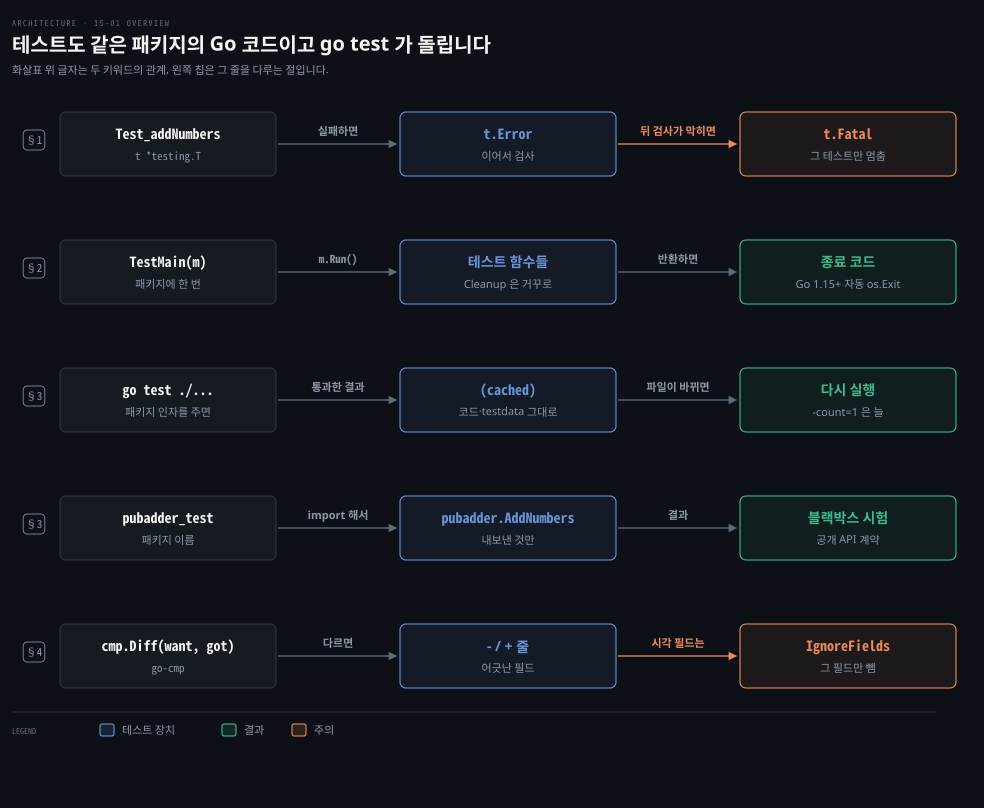
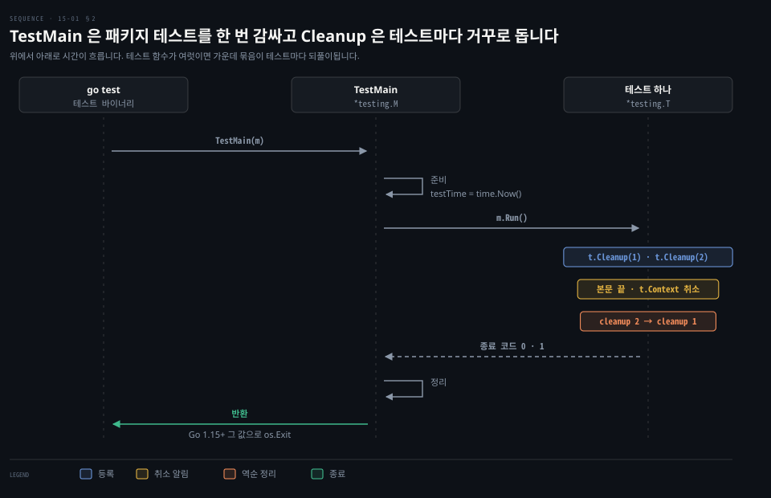

# go test 는 같은 패키지의 _test.go 를 돌리고 Cleanup 과 go-cmp 가 정리와 비교를 돕습니다

---

> Learning Go 15장 앞부분입니다. Go 가 테스트를 표준 라이브러리 `testing` 과 `go test` 도구로 나눠 지원하는 방식과 실패를 알리는 메서드, 테스트 전후의 준비와 정리, 환경 변수·testdata·결과 캐시, 공개 API 만 시험하는 패키지 이름 규칙, 그리고 go-cmp 로 결과를 비교하는 법을 다룹니다.

## 핵심 요약

> 이 편이 매달린 하나의 생각은 테스트도 보통 Go 코드라서 같은 패키지 안에 두고 같은 도구로 돌린다는 것입니다.

테스트는 `_test.go` 로 끝나는 파일에 `Test` 로 시작하는 함수로 쓰며 `go test` 가 찾아 돌립니다. 검사는 평범한 `if` 문으로 하고 어긋나면 `t.Error` 로 알리거나 `t.Fatal` 로 그 테스트를 멈춥니다. 패키지 전체의 준비는 `TestMain` 이 맡습니다. 테스트 하나가 만든 자원은 `t.Cleanup`·`t.TempDir`·`t.Setenv` 가 테스트 끝에 되돌립니다.

구조체처럼 필드가 많은 값은 go-cmp 의 `cmp.Diff` 로 비교하면 어긋난 필드만 골라 보여 줍니다. 패키지 이름에 `_test` 를 붙이면 내보낸 것만 쓸 수 있어 공개 API 를 바깥에서 시험하게 됩니다.


## 학습 목표

> 이 편을 읽고 나면 아래 다섯 가지를 스스로 해낼 수 있습니다.

1. 테스트 파일과 테스트 함수의 이름 규칙을 말하고 `Error` 와 `Fatal` 가운데 무엇을 쓸지 고를 수 있습니다.
2. `TestMain` 이 언제 몇 번 도는지와 `m.Run` 의 결과가 종료 코드가 되는 과정을 설명할 수 있습니다.
3. `t.Cleanup`·`t.TempDir`·`t.Setenv` 가 무엇을 언제 되돌리는지와, testdata 와 결과 캐시가 테스트를 어떻게 다루는지 말할 수 있습니다.
4. 패키지 이름에 `_test` 를 붙인 테스트가 무엇을 할 수 없게 되는지와 그것이 왜 쓸모 있는지 말할 수 있습니다.
5. go-cmp 로 구조체 두 개를 비교하고 실행마다 달라지는 필드를 비교에서 뺄 수 있습니다.

아래는 이 편의 키워드를 이은 개념도입니다. 첫 줄은 테스트 함수가 실패를 알리는 두 방법입니다. 둘째 줄은 `TestMain` 이 패키지 테스트를 감싸 돌리는 흐름입니다. 셋째 줄은 결과 캐시이고 넷째 줄은 공개 API 만 시험하는 외부 테스트 패키지입니다. 다섯째 줄은 go-cmp 로 비교하는 흐름입니다. 왼쪽 칩이 그 줄을 다루는 절입니다.




## 1. 테스트는 같은 패키지의 _test.go 에 두고 go test 가 돌립니다

> 코드를 고칠 때마다 손으로 확인하면 빠뜨립니다. Go 는 테스트를 쓰는 라이브러리 `testing` 과 테스트를 돌리는 도구 `go test` 를 함께 주고, 테스트를 제품 코드와 같은 디렉터리·같은 패키지에 둡니다.

손으로 하는 확인은 코드를 고칠 때마다 되풀이해야 하고 되풀이할수록 빠뜨립니다. 테스트 자동화가 풀려는 문제가 이것입니다. 원문은 2000년대 이후 자동화 테스트가 퍼진 것이 다른 어떤 소프트웨어 공학 기법보다 코드 품질을 끌어올렸을 것이라고 말합니다. Go 는 품질을 중시하는 언어답게 테스트 지원을 표준 라이브러리에 넣었습니다. `testing` 패키지가 테스트를 쓰는 타입과 함수를 주고 Go 와 함께 오는 `go test` 가 테스트를 돌려 결과를 보고합니다.

다른 여러 언어와 달리 Go 는 테스트를 제품 코드와 같은 디렉터리, 같은 패키지에 둡니다. 같은 패키지라서 내보내지 않은 함수와 변수도 시험할 수 있습니다. 공개 API 만 시험하는 방법은 §3 에서 봅니다.

### 첫 테스트가 addNumbers 의 버그를 잡습니다

원서 저장소의 `adder` 패키지에는 두 수를 더한다는 함수가 있습니다.

```go
func addNumbers(x, y int) int {
	return x + x
}
```

테스트는 `adder_test.go` 에 있습니다.

```go
func Test_addNumbers(t *testing.T) {
	result := addNumbers(2, 3)
	if result != 5 {
		t.Error("incorrect result: expected 5, got", result)
	}
}
```

테스트는 이름이 `_test.go` 로 끝나는 파일에 씁니다. `foo.go` 를 시험하면 `foo_test.go` 에 둡니다. 테스트 함수는 `Test` 로 시작하고 `*testing.T` 매개변수 하나를 받으며 값을 돌려주지 않습니다. 매개변수 이름은 관례로 `t` 입니다.

함수 하나를 시험하는 테스트는 `Test` 뒤에 함수 이름을 붙입니다. 내보내지 않은 함수면 사이에 밑줄을 넣는 사람도 있다고 원문은 말합니다.

시험할 코드를 부르고 결과를 확인하는 것은 보통 Go 코드입니다. 전용 단언 문법이 없고 `if` 로 비교한 뒤 `t.Error` 로 실패를 알립니다. `t.Error` 는 `fmt.Print` 처럼 쉼표로 나눈 값들을 이어 메시지를 만듭니다. `go build` 가 바이너리를 만들고 `go run` 이 프로그램을 돌리듯 `go test` 는 현재 디렉터리의 테스트 함수를 돌립니다. 이 노트의 go1.27.1 에서도 원문과 같은 실패가 났습니다.

```bash
go test
--- FAIL: Test_addNumbers (0.00s)
    adder_test.go:8: incorrect result: expected 5, got 4
FAIL
exit status 1
FAIL	github.com/learning-go-book-2e/ch15/sample_code/adder	0.229s
```

`x + x` 를 `x + y` 로 고치면 통과합니다. 패키지 자리에 `./...` 를 주면 현재 디렉터리와 그 아래 모든 디렉터리의 테스트를 돌리고 `-v` 를 더하면 테스트마다 결과를 자세히 찍습니다.

이 노트를 쓰면서 JUnit 과 견줘 보았습니다. JUnit 은 테스트를 `src/test` 라는 다른 소스 트리에 두지만 Go 는 같은 디렉터리에 둡니다. 검사 방식도 다릅니다. JUnit 에는 `assertEquals` 같은 단언 메서드가 있는데 Go 표준 라이브러리에는 단언 함수가 없습니다. 이 비교는 원문 밖입니다.

### Error 는 이어서 검사하고 Fatal 은 그 테스트만 멈춥니다

실패를 알리는 메서드는 둘씩 짝을 이룹니다. `Error` 는 값 목록으로 메시지를 만들고 `Errorf` 는 `Printf` 형식 문자열을 받습니다.

```go
t.Errorf("incorrect result: expected %d, got %d", 5, result)
```

`Error`·`Errorf` 는 테스트를 실패로 표시하지만 함수는 계속 돕니다. 실패하자마자 멈추려면 `Fatal`·`Fatalf` 를 씁니다. 메시지를 만드는 법은 각각 `Error`·`Errorf` 와 같고 메시지를 남긴 뒤 그 테스트 함수를 곧바로 끝냅니다. 멈추는 것은 지금 테스트 함수 하나뿐이고 남은 테스트 함수는 그대로 돕니다.

원문의 기준은 이렇습니다. 앞 검사가 실패하면 뒤 검사가 반드시 실패하거나 패닉을 낼 때는 `Fatal` 을 씁니다. 파일을 열지 못했는데 그 파일을 읽는 검사를 이어 갈 수는 없기 때문입니다. 구조체의 필드를 하나씩 확인하듯 서로 독립된 항목을 검사하면 `Error` 를 써서 문제를 한 번에 모두 보고합니다. 그래야 테스트를 여러 번 다시 돌리지 않고 여러 문제를 함께 고칠 수 있습니다.


## 2. TestMain 과 Cleanup 으로 준비와 정리를 맡깁니다

> 테스트가 쓸 상태를 테스트마다 만들고 지우면 코드가 반복되고, 지우는 것을 잊으면 흔적이 남습니다. 패키지 전체의 준비는 `TestMain` 이 한 번 맡고, 테스트 하나가 만든 자원은 `t.Cleanup` 에 등록해 테스트 끝에 되돌립니다.

### TestMain 은 패키지에 한 번 돌고 m.Run 의 결과로 끝납니다

패키지에 `TestMain` 이라는 함수가 있으면 `go test` 는 테스트 함수 대신 그것을 부릅니다. `TestMain` 은 `*testing.M` 을 받아 필요한 상태를 준비하고 `m.Run()` 으로 패키지의 테스트 함수를 돌립니다. `Run` 은 종료 코드를 돌려주며 0 은 모든 테스트가 통과했다는 뜻입니다.

```go
var testTime time.Time

func TestMain(m *testing.M) {
	fmt.Println("Set up stuff for tests here")
	testTime = time.Now()
	exitVal := m.Run()
	fmt.Println("Clean up stuff after tests here")
	os.Exit(exitVal)
}

func TestFirst(t *testing.T) {
	fmt.Println("TestFirst uses stuff set up in TestMain", testTime)
}
```

두 테스트 함수가 쓰는 패키지 변수 `testTime` 을 `TestMain` 이 채웁니다. 이 노트에서 돌리니 준비 문구가 한 번, 테스트 둘이 같은 시각을 찍은 뒤 정리 문구가 한 번 나왔습니다.

```bash
go test
Set up stuff for tests here
TestFirst uses stuff set up in TestMain 2026-09-28 16:02:23.656031 +0900 KST m=+0.000347376
TestSecond also uses stuff set up in TestMain 2026-09-28 16:02:23.656031 +0900 KST m=+0.000347376
PASS
Clean up stuff after tests here
ok  	github.com/learning-go-book-2e/ch15/sample_code/testmain	0.200s
```

원문의 메모대로 `TestMain` 은 테스트마다가 아니라 한 번 불리고 한 패키지에 하나만 둘 수 있습니다. 원문은 쓰임새를 둘로 꼽습니다. 데이터베이스 같은 외부 저장소에 데이터를 마련할 때와, 시험할 코드가 초기화가 필요한 패키지 변수에 기댈 때입니다. 두 번째 이유라면 패키지 변수를 없애도록 코드를 고치라고 원문은 덧붙입니다.

아래 도식은 `TestMain` 한 번과 테스트 하나의 정리 순서를 시간순으로 그린 것입니다. 테스트 하나 안의 정리 순서는 바로 아래 `Cleanup` 에서 다룹니다.



> **원문 정오**: 원문은 `TestMain` 이 `Run` 이 돌려준 종료 코드로 `os.Exit` 를 "must call" 한다고 적었습니다. Go 1.15 릴리스 노트는 `TestMain` 이 더 이상 `os.Exit` 를 부르지 않아도 되며, 반환하면 테스트 바이너리가 `m.Run` 의 값으로 `os.Exit` 를 부른다고 밝힙니다. 이 노트에서 `os.Exit` 없는 `TestMain` 에 실패하는 테스트를 두니 `FAIL` 과 exit 1 로 끝났습니다. 책 16개 장 PDF 전체에서 이 문구는 이 한 곳에만 나옵니다.

### Cleanup 은 도우미 함수가 정리를 등록하게 합니다

`t.Cleanup` 은 테스트 하나를 위해 만든 임시 자원을 치웁니다. 입력도 반환 값도 없는 함수 하나를 받아 두고, 테스트가 끝나면 부릅니다. 단순한 테스트라면 `defer` 로도 됩니다. 문제는 준비를 도우미 함수가 맡을 때입니다. 도우미 안의 `defer` 는 도우미가 끝날 때 돌아 버리므로 정리는 테스트가 끝날 때까지 미뤄야 합니다.

```go
// createFile is a helper function called from multiple tests
func createFile(t *testing.T) (_ string, err error) {
	f, err := os.Create("tempFile")
	if err != nil {
		return "", err
	}
	defer func() {
		err = errors.Join(err, f.Close())
	}()
	// write some data to f
	t.Cleanup(func() {
		os.Remove(f.Name())
	})
	return f.Name(), nil
}
```

`Cleanup` 은 여러 번 불러도 되고 `defer` 처럼 나중에 등록한 함수부터 거꾸로 불립니다. 이 노트에서 `cleanup 1`·`cleanup 2` 를 차례로 등록하니 `cleanup 2`, `cleanup 1` 순서로 찍혔습니다.

임시 파일이라면 정리 코드를 쓸 필요도 없습니다. `t.TempDir` 은 부를 때마다 새 임시 디렉터리를 만들어 전체 경로를 돌려주고, 테스트가 끝나면 그 디렉터리와 내용을 지우는 정리 함수를 `Cleanup` 으로 등록합니다. 이 노트에서 한 테스트가 받은 디렉터리를 다음 테스트에서 `os.Stat` 으로 확인하니 이미 없었습니다.

```go
func TestFileProcessing(t *testing.T) {
	tempDir := t.TempDir()
	fName, err := createFile(tempDir)
	if err != nil {
		t.Fatal(err)
	}
	// do testing, don't worry about cleanup
}
```

원문 밖 보충입니다. Go 1.24 는 `t.Context()` 를 더했습니다. 돌려주는 context 는 테스트가 끝난 뒤 정리 함수들이 돌기 전에 취소됩니다(14-01 §1). 이 노트에서 테스트 안에서는 `Err` 가 `nil`, 정리 함수 안에서는 `context canceled` 였습니다. 테스트가 띄운 고루틴을 멈추게 할 때 `context.Background()` 대신 쓰기 좋습니다. 같은 릴리스의 `t.Chdir` 는 테스트 동안만 작업 디렉터리를 바꿉니다.

### Setenv 는 환경 변수를 바꾸고 테스트가 끝나면 되돌립니다

환경 변수로 애플리케이션을 설정하는 것은 흔하고 좋은 관행이라고 원문은 말합니다. 그 파싱 코드를 시험하려고 `os.Setenv` 를 직접 부르면 다른 테스트에 값이 남습니다. `t.Setenv` 는 테스트 동안 값을 정하고 안에서 `Cleanup` 을 불러 테스트가 끝나면 이전 상태로 되돌립니다.

```go
func TestEnvVarProcess(t *testing.T) {
	t.Setenv("OUTPUT_FORMAT", "JSON")
	cfg := ProcessEnvVars()
	if cfg.OutputFormat != "JSON" {
		t.Error("OutputFormat not set correctly")
	}
	// value of OUTPUT_FORMAT is reset when the test function exits
}
```

환경 변수는 프로세스 전체가 나눠 쓰므로 병렬 테스트와 함께 쓸 수 없습니다(15-02 §2). 이 노트에서 `t.Parallel()` 뒤에 `t.Setenv` 를 불렀습니다. 그러자 `test using t.Setenv, t.Chdir, or cryptotest.SetGlobalRandom can not use t.Parallel` 패닉이 났습니다.

원문의 메모는 설계 쪽 조언입니다. 환경 변수로 설정하더라도 코드 대부분은 환경 변수를 몰라야 합니다. `main` 에서 일을 시작하기 전에 값을 설정 구조체로 옮겨 두면, 코드가 어떻게 설정되는지가 무엇을 하는지와 떨어져 재사용과 테스트가 쉬워집니다. 직접 짜기보다 Viper·envconfig 같은 설정 라이브러리를 고려하고 개발용 `.env` 파일에는 GoDotEnv 를 보라고 권합니다.


## 3. testdata 는 상대 경로로 읽고, 통과한 결과는 캐시되며, _test 패키지는 공개 API 만 봅니다

> 테스트가 쓸 샘플 파일을 어디 둘지, 바뀌지 않은 테스트를 매번 다시 돌려야 할지, 내부 구현이 아니라 약속한 API 를 시험하고 있는지는 테스트가 늘수록 문제가 됩니다. Go 는 세 가지 모두에 이름과 도구의 규칙으로 답합니다.

### testdata 디렉터리는 상대 경로로 읽습니다

`go test` 는 소스 트리를 돌며 각 패키지 디렉터리를 현재 작업 디렉터리로 삼습니다. 그래서 패키지의 샘플 데이터는 `testdata` 라는 하위 디렉터리에 두고 상대 경로로 읽습니다. Go 는 이 이름을 테스트 파일을 두는 자리로 남겨 둡니다. 원서 저장소의 `text` 패키지가 `testdata/sample1.txt` 를 읽어 글자 수를 셉니다.

```go
total, err := CountCharacters("testdata/sample1.txt")
```

### 통과한 결과는 캐시되고 -count=1 이 다시 돌립니다

원문은 10장에서 본 컴파일 캐시처럼 Go 가 여러 패키지의 테스트를 돌릴 때 통과했고 코드가 그대로인 패키지의 결과를 캐시한다고 말합니다. 패키지나 testdata 의 파일이 바뀌면 다시 컴파일해 돌리고 `-count=1` 을 주면 늘 다시 돕니다.

이 노트에서 `go test ./sample_code/text ./sample_code/pubadder` 를 두 번 돌리니 둘째에는 두 패키지 모두 `(cached)` 였습니다. `testdata/sample1.txt` 에 한 줄을 더하자 `text` 만 다시 돌아 `Expected 35, got 37` 로 실패했고 `pubadder` 는 여전히 `(cached)` 였습니다.

패키지 인자 없이 디렉터리 안에서 `go test` 만 치면 캐시를 쓰지 않고 매번 돌았습니다. 그런데 `go test .` 처럼 패키지를 하나만 줘도 `(cached)` 였습니다. `go help test` 는 앞의 것을 local directory mode, 패키지 인자를 준 것을 package list mode 라 부르고 결과 캐시는 package list mode 에서만 쓴다고 밝힙니다. 원문의 "여러 패키지"는 이 조건을 느슨하게 옮긴 말입니다. 이 확인은 원문 밖입니다.

### 패키지 이름에 _test 를 붙이면 공개 API 만 시험합니다

같은 패키지 테스트는 내보내지 않은 함수까지 부를 수 있어 편하지만 그만큼 내부 구현에 묶입니다. 공개 API 만 시험하려면 테스트 파일은 같은 디렉터리에 두고 패키지 이름을 `패키지이름_test` 로 씁니다. 원서 저장소의 `pubadder` 패키지가 내보낸 `AddNumbers` 를 이렇게 시험합니다.

```go
package pubadder_test

import (
	"github.com/learning-go-book-2e/ch15/sample_code/pubadder"
	"testing"
)

func TestAddNumbers(t *testing.T) {
	result := pubadder.AddNumbers(2, 3)
	if result != 5 {
		t.Error("incorrect result: expected 5, got", result)
	}
}
```

같은 디렉터리에 있어도 다른 패키지이므로 `pubadder` 를 가져와야 하고 함수는 `pubadder.AddNumbers` 로 부릅니다. 원문의 팁대로 손으로 따라 치려면 `module github.com/learning-go-book-2e/ch15` 을 선언한 go.mod 가 필요합니다.

`_test` 접미사의 이점은 시험하는 패키지를 블랙박스로 다루게 한다는 것입니다. 내보낸 함수·메서드·타입·상수·변수로만 다룰 수 있으니 테스트가 사용자가 실제로 쓰는 계약을 시험합니다. 한 디렉터리 안에 두 패키지 이름의 테스트 파일을 섞어 둘 수도 있습니다.


## 4. go-cmp 로 복합 값을 비교합니다

> 필드가 많은 구조체를 `if` 로 하나씩 비교하면 길어지고, `reflect.DeepEqual` 은 같은지 다른지만 알려 줍니다. Google 의 go-cmp 는 두 값을 비교해 어긋난 곳을 설명하는 문자열을 돌려줍니다.

### cmp.Diff 는 어긋난 필드를 - 와 + 로 보여 줍니다

원서 저장소의 `cmp` 패키지에는 구조체 하나와 그 팩토리 함수가 있습니다. 구조체는 이름·나이와 만든 시각을 담습니다.

```go
type Person struct {
	Name      string
	Age       int
	DateAdded time.Time
}

func CreatePerson(name string, age int) Person {
	return Person{
		Name:      name,
		Age:       age,
		DateAdded: time.Now(),
	}
}
```

테스트는 `github.com/google/go-cmp/cmp` 를 가져와 기대값과 결과를 `cmp.Diff` 에 넘깁니다. 두 값이 같으면 빈 문자열, 다르면 차이를 설명하는 문자열이 돌아옵니다.

```go
func TestCreatePerson(t *testing.T) {
	expected := Person{
		Name: "Dennis",
		Age:  37,
	}
	result := CreatePerson("Dennis", 37)
	if diff := cmp.Diff(expected, result); diff != "" {
		t.Error(diff)
	}
}
```

이 노트에서 돌리니 `-` 줄이 기대값, `+` 줄이 결과인 차이가 나왔습니다. 만든 시각은 함수가 정하므로 기대값에 맞출 수 없습니다.

```bash
--- FAIL: TestCreatePerson (0.00s)
    cmp_test.go:16:   cmp.Person{
          	Name:      "Dennis",
          	Age:       37,
        - 	DateAdded: s"0001-01-01 00:00:00 +0000 UTC",
        + 	DateAdded: s"2026-09-28 15:43:08.715105 +0900 KST m=+0.001010584",
          }
```

원서 출력의 파일 이름은 `ch13_cmp_test.go` 이고 2판 저장소의 파일은 `cmp_test.go` 입니다. 테스트 장이 13장이던 초판의 출력이 남은 것으로 보입니다.

### Comparer 로 비교 규칙을 바꿉니다

`DateAdded` 를 무시하려면 비교 함수를 만들어 넘깁니다. `cmp.Comparer` 에 같은 타입 매개변수 둘을 받아 `bool` 을 돌려주는 함수를 줍니다.

```go
comparer := cmp.Comparer(func(x, y Person) bool {
	return x.Name == y.Name && x.Age == y.Age
})
if diff := cmp.Diff(expected, result, comparer); diff != "" {
	t.Error(diff)
}
```

넘기는 함수는 세 조건을 지켜야 합니다. 대칭이어서 매개변수 순서가 결과를 바꾸지 않아야 하고 결정적이어서 같은 입력에 늘 같은 값을 돌려줘야 합니다. 마지막 조건은 순수성으로, 매개변수를 바꾸지 않아야 합니다.

> **원문 정오**: 원문은 `cmp.Comparer` 로 "customer comparator" 를 만든다고 적었습니다. 사용자 정의 비교 함수를 뜻하므로 "custom comparator" 가 맞습니다. 책 16개 장 PDF 전체에서 "customer com" 은 이 한 곳에만 나옵니다.

### IgnoreFields 는 어긋난 필드를 짚어 줍니다

원문 밖 보충입니다. `Comparer` 는 타입 전체의 비교를 통째로 바꾸므로 어긋나면 어느 필드가 틀렸는지 말하지 못합니다. go-cmp 의 `cmpopts.IgnoreFields(Person{}, "DateAdded")` 는 그 필드만 빼고 나머지는 원래대로 비교합니다. 이 노트에서 나이를 38 로 틀리게 두고 둘을 견줬습니다.

```bash
# cmpopts.IgnoreFields
  cmp.Person{
  	Name: "Dennis",
- 	Age:  38,
+ 	Age:  37,
  	... // 1 ignored field
  }

# cmp.Comparer
  cmp.Person(
- 	{Name: "Dennis", Age: 38},
+ 	{
+ 		Name:      "Dennis",
+ 		Age:       37,
+ 		DateAdded: s"2026-09-28 15:59:55.759563 +0900 KST m=+0.002713876",
+ 	},
  )
```

`IgnoreFields` 는 `Age` 한 줄을 짚었고 `Comparer` 는 두 값 전체를 늘어놓았습니다. 필드를 빼는 것이 목적이면 `IgnoreFields` 가 실패 메시지를 읽기 쉽게 합니다. 이 판단은 노트의 것입니다. JUnit 에서 AssertJ 의 `usingRecursiveComparison().ignoringFields(...)` 가 같은 자리를 채웁니다.


## 핵심 개념 체크리스트

목표 번호 순서대로 짝지었습니다.

- [ ] (목표 1) 파일 열기에 실패한 뒤 그 파일을 읽는 검사가 이어진다면 `Error` 와 `Fatal` 가운데 무엇을 쓰고, 그 이유는 무엇입니까?
- [ ] (목표 2) 테스트 함수가 셋인 패키지에서 `TestMain` 은 몇 번 불리고, `os.Exit` 를 부르지 않고 반환하면 종료 코드는 어떻게 정해집니까?
- [ ] (목표 3) 도우미 함수 안에서 `defer` 대신 `t.Cleanup` 으로 정리를 등록해야 하는 이유와, `t.Setenv` 를 병렬 테스트에서 쓸 수 없는 이유를 말할 수 있습니까?
- [ ] (목표 4) `package pubadder_test` 로 쓴 테스트에서 내보내지 않은 `addNumbers` 를 부르면 어떻게 됩니까?
- [ ] (목표 5) `CreatePerson` 의 결과를 기대값과 비교할 때 `DateAdded` 를 빼는 방법 두 가지와, 실패 메시지가 어떻게 다른지 말할 수 있습니까?


## 관련 문서

- [15-02 테이블 테스트는 t.Run 으로 하위 테스트를 나누고 커버리지를 다 채워도 버그는 남습니다](./15-02.%ED%85%8C%EC%9D%B4%EB%B8%94%20%ED%85%8C%EC%8A%A4%ED%8A%B8%EB%8A%94%20t.Run%20%EC%9C%BC%EB%A1%9C%20%ED%95%98%EC%9C%84%20%ED%85%8C%EC%8A%A4%ED%8A%B8%EB%A5%BC%20%EB%82%98%EB%88%84%EA%B3%A0%20%EC%BB%A4%EB%B2%84%EB%A6%AC%EC%A7%80%EB%A5%BC%20%EB%8B%A4%20%EC%B1%84%EC%9B%8C%EB%8F%84%20%EB%B2%84%EA%B7%B8%EB%8A%94%20%EB%82%A8%EC%8A%B5%EB%8B%88%EB%8B%A4.md) — 15장 다음. 테이블 테스트·병렬·커버리지
- [07-04 타입 단언은 아껴 쓰고 암묵 인터페이스로 의존성을 주입합니다](./07-04.%ED%83%80%EC%9E%85%20%EB%8B%A8%EC%96%B8%EC%9D%80%20%EC%95%84%EA%BB%B4%20%EC%93%B0%EA%B3%A0%20%EC%95%94%EB%AC%B5%20%EC%9D%B8%ED%84%B0%ED%8E%98%EC%9D%B4%EC%8A%A4%EB%A1%9C%20%EC%9D%98%EC%A1%B4%EC%84%B1%EC%9D%84%20%EC%A3%BC%EC%9E%85%ED%95%A9%EB%8B%88%EB%8B%A4.md) — 7장. 테스트하기 쉬운 코드의 바탕
- [10-01 모듈은 go.mod 로 한 단위가 되고 go 지시어가 빌드할 Go 버전을 정합니다](./10-01.%EB%AA%A8%EB%93%88%EC%9D%80%20go.mod%20%EB%A1%9C%20%ED%95%9C%20%EB%8B%A8%EC%9C%84%EA%B0%80%20%EB%90%98%EA%B3%A0%20go%20%EC%A7%80%EC%8B%9C%EC%96%B4%EA%B0%80%20%EB%B9%8C%EB%93%9C%ED%95%A0%20Go%20%EB%B2%84%EC%A0%84%EC%9D%84%20%EC%A0%95%ED%95%A9%EB%8B%88%EB%8B%A4.md) — 10장. 모듈 경로와 go.mod
- [14-01 context 는 첫 매개변수로 넘기고 값은 내보내지 않은 키로 담습니다](./14-01.context%20%EB%8A%94%20%EC%B2%AB%20%EB%A7%A4%EA%B0%9C%EB%B3%80%EC%88%98%EB%A1%9C%20%EB%84%98%EA%B8%B0%EA%B3%A0%20%EA%B0%92%EC%9D%80%20%EB%82%B4%EB%B3%B4%EB%82%B4%EC%A7%80%20%EC%95%8A%EC%9D%80%20%ED%82%A4%EB%A1%9C%20%EB%8B%B4%EC%8A%B5%EB%8B%88%EB%8B%A4.md) — 14장. t.Context 가 돌려주는 context
- [Learning Go 2판 — 정독 인덱스](./README.md) — 16장 전체 지도


## 참고 자료

- 원본: 《Learning Go, 2nd Edition》 (Jon Bodner, O'Reilly)
- 다룬 범위: Chapter 15 "Understanding the Basics of Testing" ~ "Using go-cmp to Compare Test Results"
- 원서 예제 저장소: [learning-go-book-2e/ch15](https://github.com/learning-go-book-2e/ch15)
- [testing 패키지](https://pkg.go.dev/testing) — TestMain·Cleanup·TempDir·Setenv·Context
- [Go 1.15 릴리스 노트](https://go.dev/doc/go1.15) — TestMain 이 os.Exit 를 부르지 않아도 됨
- [Go 1.24 릴리스 노트](https://go.dev/doc/go1.24) — T.Context·T.Chdir
- [go-cmp](https://github.com/google/go-cmp) · [cmpopts](https://pkg.go.dev/github.com/google/go-cmp/cmp/cmpopts) — Diff·Comparer·IgnoreFields
