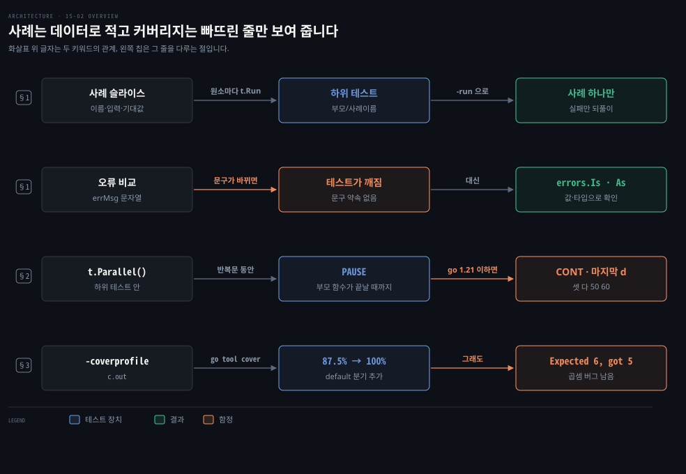
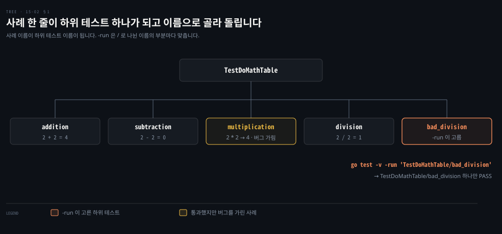
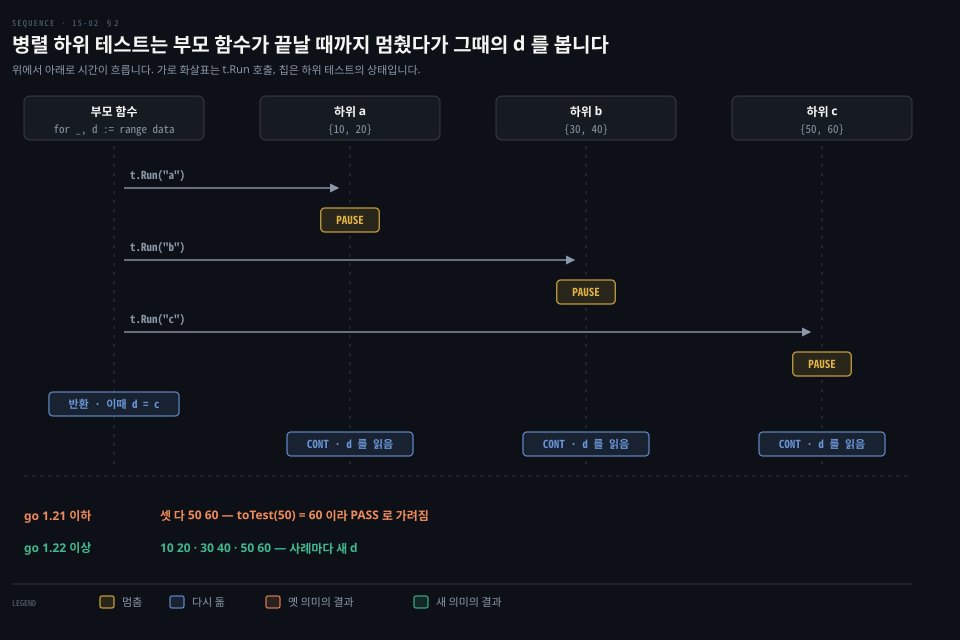

# 테이블 테스트는 t.Run 으로 하위 테스트를 나누고 커버리지를 다 채워도 버그는 남습니다

---

> Learning Go 15장의 둘째 부분입니다. 같은 검사를 입력만 바꿔 되풀이하는 테이블 테스트와 `t.Run` 하위 테스트, 테스트를 동시에 돌리는 `t.Parallel` 과 그때 루프 변수가 일으키는 함정, 그리고 코드 커버리지로 빠뜨린 경로를 찾되 커버리지를 믿지 말아야 하는 이유를 다룹니다.

## 핵심 요약

> 이 편이 매달린 하나의 생각은 테스트 사례를 코드가 아니라 데이터로 적으면 사례를 늘리기 쉬워지지만, 사례를 고르는 눈은 여전히 사람이 맡는다는 것입니다.

테이블 테스트는 이름·입력·기대값을 담은 익명 구조체 슬라이스를 돌며 `t.Run` 으로 사례마다 하위 테스트를 만듭니다. 하위 테스트는 이름이 붙어 따로 보고되고 `-run` 으로 하나만 골라 돌릴 수 있습니다. `t.Parallel` 은 병렬로 표시한 테스트끼리 함께 돌립니다. Go 1.21 이하 의미로 병렬 테이블 테스트를 돌리면 모든 하위 테스트가 마지막 사례만 봅니다.

커버리지는 테스트가 한 번도 지나가지 않은 줄을 보여 줍니다. 그러나 모든 줄을 지나갔다고 모든 입력이 맞는 것은 아닙니다. 이 편의 곱셈 버그는 커버리지 100% 에서도 살아남았습니다.


## 학습 목표

> 이 편을 읽고 나면 아래 다섯 가지를 스스로 해낼 수 있습니다.

1. 되풀이되는 검사를 테이블 테스트로 바꾸고, 하위 테스트 하나만 골라 돌릴 수 있습니다.
2. 오류 메시지를 문자열로 비교하는 테스트가 깨지기 쉬운 이유와 그 대안을 말할 수 있습니다.
3. `t.Parallel` 을 붙여도 되는 테스트와 붙이면 안 되는 테스트를 가를 수 있습니다.
4. Go 1.21 이하 의미에서 병렬 테이블 테스트가 마지막 사례만 시험하는 이유와, 그 버그가 통과로 가려질 수 있다는 것을 설명할 수 있습니다.
5. 커버리지로 빠뜨린 경로를 찾고, 커버리지 100% 인데도 남는 버그의 예를 들 수 있습니다.

아래는 이 편의 키워드를 이은 개념도입니다. 첫 줄은 사례 목록이 하위 테스트가 되는 흐름입니다. 둘째 줄은 오류를 비교하는 두 방법입니다. 셋째 줄은 병렬 하위 테스트가 멈췄다가 다시 도는 순서이고, 넷째 줄은 커버리지가 보여 주는 것과 보여 주지 못하는 것입니다. 왼쪽 칩이 그 줄을 다루는 절입니다.




## 1. 테이블 테스트는 사례를 데이터로 적고 t.Run 으로 하위 테스트를 만듭니다

> 함수 하나를 확인하려면 사례가 여럿 필요한데, 사례마다 호출·비교·보고 코드를 복사하면 테스트가 길어지고 사례를 더하기 귀찮아집니다. 사례를 슬라이스의 원소로 적고 같은 검사 코드를 돌리면, 사례를 늘리는 일이 한 줄을 더하는 일이 됩니다.

함수 하나를 제대로 확인하려면 입력을 바꿔 가며 여러 번 시험해야 합니다. 원서 저장소의 `table` 패키지에 연산자 문자열을 받아 계산하는 함수가 있습니다.

```go
func DoMath(num1, num2 int, op string) (int, error) {
	switch op {
	case "+":
		return num1 + num2, nil
	case "-":
		return num1 - num2, nil
	case "*":
		return num1 + num2, nil
	case "/":
		if num2 == 0 {
			return 0, errors.New("division by zero")
		}
		return num1 / num2, nil
	default:
		return 0, fmt.Errorf("unknown operator %s", op)
	}
}
```

분기마다 올바른 입력과 오류를 내는 입력을 시험해야 합니다. 사례마다 코드를 복사하면 이렇게 됩니다.

```go
func TestDoMath(t *testing.T) {
	result, err := DoMath(2, 2, "+")
	if result != 4 {
		t.Error("Should have been 4, got", result)
	}
	if err != nil {
		t.Error("Should have been nil error, got", err)
	}
	result2, err2 := DoMath(2, 2, "-")
	if result2 != 0 {
		t.Error("Should have been 0, got", result2)
	}
	if err2 != nil {
		t.Error("Should have been nil error, got", err2)
	}
	// and so on...
}
```

### 사례는 익명 구조체 슬라이스에 적습니다

테이블 테스트는 먼저 익명 구조체의 슬라이스를 선언합니다. 구조체 필드는 사례 이름, 입력 매개변수, 기대 반환 값이고 원소 하나가 사례 하나입니다.

```go
data := []struct {
	name     string
	num1     int
	num2     int
	op       string
	expected int
	errMsg   string
}{
	{"addition", 2, 2, "+", 4, ""},
	{"subtraction", 2, 2, "-", 0, ""},
	{"multiplication", 2, 2, "*", 4, ""},
	{"division", 2, 2, "/", 1, ""},
	{"bad_division", 2, 0, "/", 0, `division by zero`},
}
```

그다음 `data` 를 돌며 원소마다 `t.Run` 을 부릅니다. `t.Run` 은 하위 테스트 이름과 `*testing.T` 하나를 받는 함수를 받습니다. 함수 안에서는 지금 원소의 필드로 `DoMath` 를 부르고 같은 검사를 되풀이합니다.

```go
for _, d := range data {
	t.Run(d.name, func(t *testing.T) {
		result, err := DoMath(d.num1, d.num2, d.op)
		if result != d.expected {
			t.Errorf("Expected %d, got %d", d.expected, result)
		}
		var errMsg string
		if err != nil {
			errMsg = err.Error()
		}
		if errMsg != d.errMsg {
			t.Errorf("Expected error message `%s`, got `%s`",
				d.errMsg, errMsg)
		}
	})
}
```

### 하위 테스트는 이름으로 보고되고 이름으로 골라 돌립니다

`-v` 로 돌리면 하위 테스트마다 `부모/사례이름` 으로 결과가 찍힙니다. 이 노트의 go1.27.1 출력입니다.

```bash
go test -v
=== RUN   TestDoMathTable
=== RUN   TestDoMathTable/addition
...
--- PASS: TestDoMathTable (0.00s)
    --- PASS: TestDoMathTable/addition (0.00s)
    --- PASS: TestDoMathTable/subtraction (0.00s)
    --- PASS: TestDoMathTable/multiplication (0.00s)
    --- PASS: TestDoMathTable/division (0.00s)
    --- PASS: TestDoMathTable/bad_division (0.00s)
```

원문 밖 보충입니다. `-run` 은 `/` 로 나뉜 이름의 각 부분을 따로 맞춥니다. 이 노트에서 `go test -v -run 'TestDoMathTable/bad_division'` 을 치니 그 사례 하나만 돌았습니다. 실패한 사례만 되풀이해 고칠 때 씁니다. 아래 도식은 사례 목록이 하위 테스트가 되고 이름으로 골라지는 모양입니다.



`multiplication` 사례는 곱셈 분기가 더하기를 하는데도 통과했습니다. 2+2 와 2×2 가 둘 다 4이기 때문입니다. 표가 사례를 늘리기 쉽게 해 줘도, 버그를 드러낼 입력을 고르는 일은 여전히 사람이 합니다. 이 관찰은 노트의 것이고, 원문은 §3 에서 이 버그를 다른 방식으로 드러냅니다.

### 오류 메시지 비교는 깨지기 쉽습니다

원문의 팁은 오류 메시지를 비교하는 테스트가 약하다고 경고합니다. 메시지 문구에는 호환성 약속이 없을 수 있어서, 문구만 다듬어도 테스트가 깨집니다. `DoMath` 는 `errors.New`·`fmt.Errorf` 로 오류를 만들어 메시지를 비교할 수밖에 없습니다. 사용자 정의 오류 타입이나 이름 붙은 센티널 오류라면 `errors.Is`·`errors.As`(09-02 §3)로 올바른 오류가 왔는지 확인하라고 원문은 권합니다. 15-04 §3 에서 이 경고가 실제로 들어맞은 통합 테스트를 봅니다.


## 2. t.Parallel 은 병렬로 표시한 테스트끼리 함께 돌립니다

> 단위 테스트는 기본으로 하나씩 차례로 돌아서 테스트가 많아지면 느려집니다. 단위 테스트는 서로 독립이어야 하므로 동시에 돌리기 좋은 후보이고, 첫 줄에 `t.Parallel()` 을 부르면 병렬로 표시한 다른 테스트와 함께 돕니다.

```go
func TestMyCode(t *testing.T) {
	t.Parallel()
	// rest of test goes here
}
```

이점은 오래 걸리는 테스트 묶음이 빨라진다는 것입니다. 단점도 있습니다. 여러 테스트가 같은 공유 가변 상태에 기대면 결과가 들쭉날쭉하므로 병렬로 표시하지 말아야 합니다. 원문은 여기서 "그렇게 경고했으니 여러분의 애플리케이션에는 공유 가변 상태가 없겠지요?"라고 농담처럼 덧붙입니다. 또 병렬로 표시한 테스트에서 `Setenv` 를 부르면 패닉이 납니다(15-01 §2).

### Go 1.21 이하 의미에서는 병렬 하위 테스트가 마지막 사례만 봅니다

테이블 테스트를 병렬로 돌릴 때는 12-02 §3 에서 본 고루틴과 루프 변수 문제가 그대로 생깁니다. Go 1.21 이하, 또는 Go 1.22 이상이라도 go.mod 의 `go` 지시어가 1.21 이하면(10-01 §3) 모든 하위 테스트가 변수 `d` 하나를 함께 가리킵니다.

```go
func TestParallelTable(t *testing.T) {
	data := []struct {
		name   string
		input  int
		output int
	}{
		{"a", 10, 20},
		{"b", 30, 40},
		{"c", 50, 60},
	}
	for _, d := range data {
		t.Run(d.name, func(t *testing.T) {
			t.Parallel()
			fmt.Println(d.input, d.output)
			out := toTest(d.input)
			if out != d.output {
				t.Error("didn't match", out, d.output)
			}
		})
	}
}
```

원서 저장소의 go.mod 는 `go 1.19` 입니다. 이 노트에서 `-v` 로 돌리니 세 하위 테스트가 모두 `50 60` 을 찍었습니다.

```bash
go test -v -run TestParallelTable
=== RUN   TestParallelTable
=== RUN   TestParallelTable/a
=== PAUSE TestParallelTable/a
=== RUN   TestParallelTable/b
=== PAUSE TestParallelTable/b
=== RUN   TestParallelTable/c
=== PAUSE TestParallelTable/c
=== CONT  TestParallelTable/a
50 60
=== CONT  TestParallelTable/b
50 60
=== CONT  TestParallelTable/c
50 60
--- PASS: TestParallelTable (0.00s)
```

`PAUSE`·`CONT` 줄이 까닭을 보여 줍니다. testing 문서대로 `t.Run` 은 하위 테스트 함수가 끝나거나 `t.Parallel` 을 부를 때까지 기다립니다. 하위 테스트가 `t.Parallel` 을 부르면 그 자리에서 멈추고 `t.Run` 이 돌아와 반복문이 다음 사례로 갑니다. 세 하위 테스트는 부모 테스트 함수가 반환한 뒤에야 다시 돕니다. 이 예제는 반복문이 함수의 끝이라 그때 `d` 는 마지막 사례입니다. 이 노트에서 반복문 뒤에 200ms 를 기다렸다가 변수를 바꾸는 코드를 두니, 하위 테스트들은 바뀐 값을 봤습니다. 이 설명과 실험은 원문 밖입니다.



### 버그가 있어도 통과할 수 있고 go test 의 vet 은 잡지 않습니다

위 출력의 마지막 줄은 `PASS` 입니다. 같은 사례를 세 번 시험했는데 통과한 것은 `toTest` 가 `i + 10` 이라 마지막 사례의 기대값과 맞았기 때문입니다. 원문은 "마지막 값을 세 번 시험한다"고만 적었습니다. 이 노트에서 돌려 보니 테스트 결과만 봐서는 이 버그를 알아챌 수 없었습니다.

원문은 이 문제가 흔해서 Go 1.20 이 `go vet` 에 검사를 더했다고 말합니다. 이 노트에서 `go vet` 을 돌리니 `d` 를 쓰는 줄마다 `loop variable d captured by func literal` 이 나왔습니다. 다만 `go test` 가 스스로 돌리는 vet 은 `go help test` 가 밝힌 대로 확신이 높은 일부 검사뿐입니다. 이 목록에 루프 변수 검사는 없어서 `go test` 는 조용히 통과했고, `go test -vet=all` 을 주자 같은 경고를 내고 멈췄습니다.

고치는 길은 둘입니다. Go 1.22 이상에서 `go` 지시어를 1.22 이상으로 두면 반복마다 새 `d` 가 생깁니다. 이 노트에서 go.mod 를 `go 1.25` 로 바꾼 사본은 `10 20`·`30 40`·`50 60` 을 찍었습니다. Go 1.22 를 쓸 수 없으면 `t.Run` 앞에서 `d` 를 가립니다.

```go
for _, d := range data {
	d := d // THIS IS THE LINE THAT SHADOWS d!
	t.Run(d.name, func(t *testing.T) {
		t.Parallel()
		// 이하 같음
	})
}
```


## 3. 커버리지는 빠뜨린 경로를 보여 주지만 버그가 없다는 증거는 아닙니다

> 사례를 여럿 적어도 어느 분기를 한 번도 지나지 않았는지는 눈으로 찾기 어렵습니다. 코드 커버리지는 테스트가 지나간 줄과 지나가지 않은 줄을 보여 주지만, 모든 줄을 지나갔다고 모든 입력이 맞는 것은 아닙니다.

### -cover 와 go tool cover 로 지나가지 않은 줄을 찾습니다

`go test` 에 `-cover` 를 주면 커버리지를 계산해 요약을 찍습니다. `-coverprofile` 을 더하면 그 정보를 파일로 남깁니다.

```bash
go test -v -cover -coverprofile=c.out
```

`table` 패키지에서 돌리니 원문과 같이 `coverage: 87.5% of statements` 였습니다. 무엇을 빠뜨렸는지는 Go 에 딸린 cover 도구가 소스를 HTML 로 칠해 보여 줍니다.

```bash
go tool cover -html=c.out
```

브라우저가 열리면 왼쪽 위 상자에서 파일을 고릅니다. 시험할 수 없는 줄은 회색, 테스트가 지나간 줄은 초록, 지나가지 않은 줄은 빨강입니다. 원문은 색에만 기대는 표시가 인쇄본 독자와 적록 색각 이상이 있는 독자에게 아쉽다며, 색이 보이지 않으면 밝은 회색이 지나간 줄이라고 알려 줍니다. 이 노트를 쓰면서 쓴 `go tool cover -func=c.out` 은 색 없이 함수별 비율을 글로 찍습니다.

```bash
go tool cover -func=c.out
github.com/learning-go-book-2e/ch15/sample_code/table/table.go:8:	DoMath		87.5%
total:									(statements)	87.5%
```

빠진 것은 모르는 연산자가 들어오는 `default` 분기였습니다. 사례를 하나 더합니다.

```go
{"bad_op", 2, 2, "?", 0, `unknown operator ?`},
```

이 노트에서 다시 돌리니 `coverage: 100.0% of statements` 였습니다.

### 커버리지 100% 에서도 곱셈 버그는 남아 있었습니다

원문은 커버리지가 100% 인데 코드에 버그가 있다고 말하고, 알아챘느냐고 묻습니다. 사례를 하나 더 넣어 봅니다.

```go
{"another_mult", 2, 3, "*", 6, ""},
```

이 노트에서도 원문과 같은 줄에서 실패했습니다.

```bash
--- FAIL: TestDoMathTable/another_mult (0.00s)
    table_test.go:57: Expected 6, got 5
coverage: 100.0% of statements
```

곱셈 분기가 두 수를 더하고 있었습니다. 원문은 복사해 붙여 넣는 코딩의 위험이라고 짚습니다. `+` 를 `*` 로 고치자 다시 통과했고 커버리지는 그대로 100% 였습니다. 커버리지는 곱셈 분기를 지나갔다는 사실만 셌고, 2와 2 로는 더하기와 곱하기가 같은 답을 내서 틀린 계산이 드러나지 않았습니다. §1 에서 본 `multiplication` 사례가 바로 그 입력입니다.

원문의 경고는 한 줄로 끝납니다. 코드 커버리지는 필요하지만 충분하지 않습니다. 커버리지 100% 여도 버그는 있을 수 있습니다. 원문은 이어지는 퍼징(15-03 §1)을 이 한계를 메우는 도구로 소개합니다.


## 핵심 개념 체크리스트

목표 번호 순서대로 짝지었습니다.

- [ ] (목표 1) `TestDoMathTable` 의 `bad_division` 사례 하나만 돌리는 명령을 쓸 수 있습니까?
- [ ] (목표 2) 오류 메시지 문자열 대신 무엇으로 오류를 확인하면 문구가 바뀌어도 테스트가 깨지지 않습니까?
- [ ] (목표 3) 두 테스트가 같은 패키지 변수를 바꾼다면 둘에 `t.Parallel` 을 붙여도 됩니까? 그 이유는 무엇입니까?
- [ ] (목표 4) `go 1.19` 모듈에서 병렬 하위 테스트 셋이 모두 `50 60` 을 본 이유를 `PAUSE`·`CONT` 순서로 말할 수 있습니까?
- [ ] (목표 5) 커버리지 100% 인 `DoMath` 에 남아 있던 버그는 무엇이고, 왜 `multiplication` 사례로는 드러나지 않았습니까?


## 관련 문서

- [15-01 go test 는 같은 패키지의 _test.go 를 돌리고 Cleanup 과 go-cmp 가 정리와 비교를 돕습니다](./15-01.go%20test%20%EB%8A%94%20%EA%B0%99%EC%9D%80%20%ED%8C%A8%ED%82%A4%EC%A7%80%EC%9D%98%20_test.go%20%EB%A5%BC%20%EB%8F%8C%EB%A6%AC%EA%B3%A0%20Cleanup%20%EA%B3%BC%20go-cmp%20%EA%B0%80%20%EC%A0%95%EB%A6%AC%EC%99%80%20%EB%B9%84%EA%B5%90%EB%A5%BC%20%EB%8F%95%EC%8A%B5%EB%8B%88%EB%8B%A4.md) — 15장 앞. 테스트 기초
- [15-03 퍼징은 시드를 비틀어 놓친 입력을 찾고 벤치마크는 b.Loop 로 한 번의 비용을 잽니다](./15-03.%ED%8D%BC%EC%A7%95%EC%9D%80%20%EC%8B%9C%EB%93%9C%EB%A5%BC%20%EB%B9%84%ED%8B%80%EC%96%B4%20%EB%86%93%EC%B9%9C%20%EC%9E%85%EB%A0%A5%EC%9D%84%20%EC%B0%BE%EA%B3%A0%20%EB%B2%A4%EC%B9%98%EB%A7%88%ED%81%AC%EB%8A%94%20b.Loop%20%EB%A1%9C%20%ED%95%9C%20%EB%B2%88%EC%9D%98%20%EB%B9%84%EC%9A%A9%EC%9D%84%20%EC%9E%BD%EB%8B%88%EB%8B%A4.md) — 15장 다음. 퍼징·벤치마크
- [12-02 select 는 준비된 case 를 무작위로 고르고 고루틴은 반드시 끝나게 만듭니다](./12-02.select%20%EB%8A%94%20%EC%A4%80%EB%B9%84%EB%90%9C%20case%20%EB%A5%BC%20%EB%AC%B4%EC%9E%91%EC%9C%84%EB%A1%9C%20%EA%B3%A0%EB%A5%B4%EA%B3%A0%20%EA%B3%A0%EB%A3%A8%ED%8B%B4%EC%9D%80%20%EB%B0%98%EB%93%9C%EC%8B%9C%20%EB%81%9D%EB%82%98%EA%B2%8C%20%EB%A7%8C%EB%93%AD%EB%8B%88%EB%8B%A4.md) — 12장. 고루틴과 루프 변수
- [10-01 모듈은 go.mod 로 한 단위가 되고 go 지시어가 빌드할 Go 버전을 정합니다](./10-01.%EB%AA%A8%EB%93%88%EC%9D%80%20go.mod%20%EB%A1%9C%20%ED%95%9C%20%EB%8B%A8%EC%9C%84%EA%B0%80%20%EB%90%98%EA%B3%A0%20go%20%EC%A7%80%EC%8B%9C%EC%96%B4%EA%B0%80%20%EB%B9%8C%EB%93%9C%ED%95%A0%20Go%20%EB%B2%84%EC%A0%84%EC%9D%84%20%EC%A0%95%ED%95%A9%EB%8B%88%EB%8B%A4.md) — 10장. go 지시어와 루프 변수 의미
- [09-02 오류를 감싸면 트리가 되고 errors.Is 와 As 가 그 안을 찾습니다](./09-02.%EC%98%A4%EB%A5%98%EB%A5%BC%20%EA%B0%90%EC%8B%B8%EB%A9%B4%20%ED%8A%B8%EB%A6%AC%EA%B0%80%20%EB%90%98%EA%B3%A0%20errors.Is%20%EC%99%80%20As%20%EA%B0%80%20%EA%B7%B8%20%EC%95%88%EC%9D%84%20%EC%B0%BE%EC%8A%B5%EB%8B%88%EB%8B%A4.md) — 9장. 메시지 대신 오류 값으로 확인하기
- [Learning Go 2판 — 정독 인덱스](./README.md) — 16장 전체 지도


## 참고 자료

- 원본: 《Learning Go, 2nd Edition》 (Jon Bodner, O'Reilly)
- 다룬 범위: Chapter 15 "Running Table Tests" ~ "Checking Your Code Coverage"
- 원서 예제 저장소: [learning-go-book-2e/ch15](https://github.com/learning-go-book-2e/ch15)
- [testing 패키지](https://pkg.go.dev/testing) — T.Run·T.Parallel
- [cmd/go — go test](https://pkg.go.dev/cmd/go#hdr-Test_packages) — go test 가 돌리는 vet 검사 목록
- [cmd/cover](https://pkg.go.dev/cmd/cover) — go tool cover 의 -html·-func
