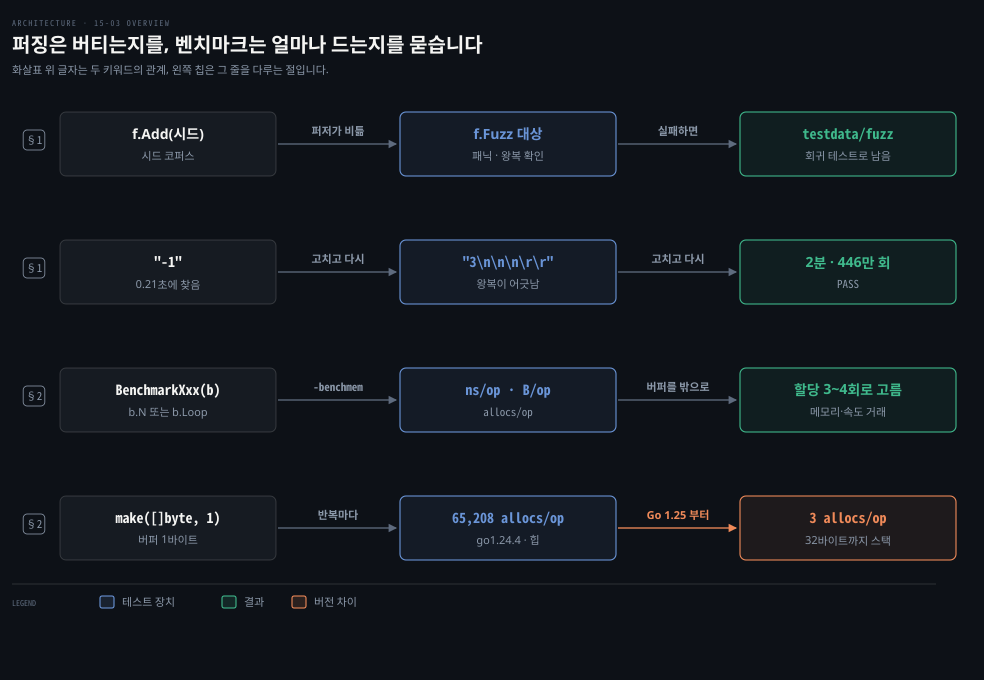
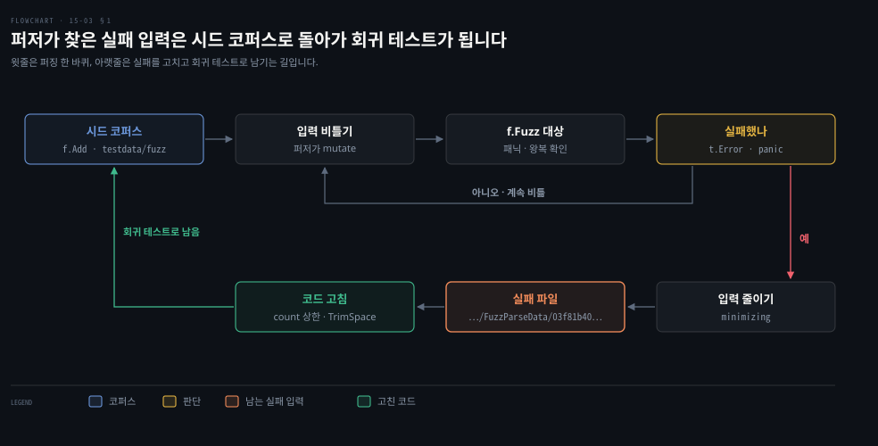
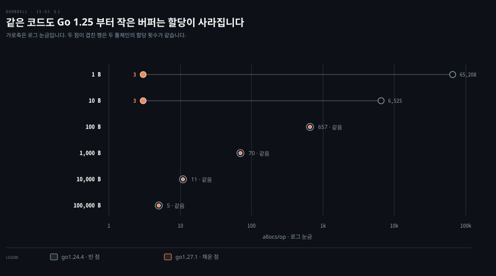

# 퍼징은 시드를 비틀어 놓친 입력을 찾고 벤치마크는 b.Loop 로 한 번의 비용을 잽니다

---

> Learning Go 15장의 셋째 부분입니다. 단위 테스트가 생각하지 못한 입력을 퍼저로 찾는 법과 코드 한 번의 시간·메모리를 벤치마크로 재는 법을 다루며, 원서 이후 바뀐 `rand.Seed`·스택 할당·`b.Loop` 도 함께 봅니다.

## 핵심 요약

> 이 편이 매달린 하나의 생각은 테스트가 "맞는가"를 묻는다면 퍼징은 "무엇이 들어와도 버티는가"를, 벤치마크는 "얼마나 드는가"를 묻는다는 것입니다.

퍼즈 테스트는 `Fuzz` 로 시작하고 `*testing.F` 를 받습니다. `f.Add` 로 넣은 시드를 퍼저가 비틀어 입력을 만들고 어떤 입력에도 참이어야 하는 조건을 확인합니다. 실패한 입력은 `testdata/fuzz` 에 남아 이후 `go test` 때마다 도는 회귀 테스트가 됩니다.

벤치마크는 `Benchmark` 로 시작하고 `*testing.B` 를 받아 같은 일을 여러 번 돌려 한 번의 평균 비용을 잽니다. 원서의 `for i := 0; i < b.N; i++` 모양은 Go 1.24 의 `for b.Loop()` 로 바꿀 수 있습니다. 같은 벤치마크라도 Go 버전에 따라 할당 수가 크게 달라지기도 해서 숫자는 버전과 함께 읽어야 합니다.


## 학습 목표

> 이 편을 읽고 나면 아래 다섯 가지를 스스로 해낼 수 있습니다.

1. 퍼즈 테스트의 모양과 `f.Add` 에 넣을 수 있는 타입, 퍼즈 대상 함수의 매개변수 규칙을 말할 수 있습니다.
2. 출력을 알 수 없는 무작위 입력에 대해 무엇을 확인할지 정하고, 퍼저가 찾은 실패 입력이 회귀 테스트가 되는 과정을 설명할 수 있습니다.
3. 벤치마크를 쓰고 `-bench`·`-benchmem` 출력의 다섯 열을 읽을 수 있습니다.
4. 버퍼 크기와 할당 위치가 벤치마크 수치를 어떻게 바꾸는지와, 같은 코드의 할당 수가 Go 1.25 에서 달라진 까닭을 말할 수 있습니다.
5. `b.N` 루프와 `b.Loop` 의 차이를 말하고, 원서 벤치마크 데이터가 Go 1.24 이상 `go` 지시어에서 달라지는 이유를 설명할 수 있습니다.

아래는 이 편의 키워드를 이은 개념도입니다. 첫 두 줄은 퍼징이 입력을 만들고 실패를 회귀 테스트로 남기는 흐름입니다. 셋째 줄은 벤치마크가 한 번의 비용을 재는 흐름이고 넷째 줄은 같은 벤치마크의 할당 수를 바꾼 Go 1.25 의 변화입니다. 왼쪽 칩이 그 줄을 다루는 절입니다.




## 1. 퍼징은 시드를 비틀어 단위 테스트가 놓친 입력을 찾습니다

> 사양을 아무리 잘 정해도 예상과 다른 입력은 결국 들어오고 단위 테스트로는 모든 경우를 떠올릴 수 없습니다. 퍼징은 무작위로 만든 입력을 코드에 넣어 예상하지 못한 입력을 제대로 다루는지 확인합니다.

원문은 이상한 입력이 악의에서만 오지 않는다고 말합니다. 데이터는 전송 중에도, 저장소에서도, 메모리에서도 깨질 수 있습니다. 데이터를 처리하는 프로그램에 버그가 있기도 하고 형식 사양의 모서리 사례는 개발자마다 다르게 해석합니다. 15-02 §3 에서 본 대로 커버리지 100% 도 버그가 없다는 보증이 아닙니다. 그래서 생각하지 못한 방식으로 프로그램을 깨뜨릴 데이터를 만들어 단위 테스트를 보완해야 합니다.

### 커버리지 100% 인 ParseData

예제는 문자열 목록을 담은 데이터를 읽는 함수입니다. 메모리를 한 번에 잡으려고 첫 줄에 문자열 개수를 적고 이어지는 줄에 문자열을 하나씩 적습니다. 코드는 원서가 링크한 별도 저장소 `file_parser` 에 있습니다.

```go
func ParseData(r io.Reader) ([]string, error) {
	s := bufio.NewScanner(r)
	if !s.Scan() {
		return nil, errors.New("empty")
	}
	countStr := s.Text()
	count, err := strconv.Atoi(countStr)
	if err != nil {
		return nil, err
	}
	out := make([]string, 0, count)
	for i := 0; i < count; i++ {
		hasLine := s.Scan()
		if !hasLine {
			return nil, errors.New("too few lines")
		}
		line := s.Text()
		out = append(out, line)
	}
	return out, nil
}
```

`bufio.Scanner`(13-01) 로 한 줄씩 읽다가 읽을 것이 없으면 오류를 돌려줍니다. 첫 줄을 `int` 로 바꾸지 못해도 오류입니다. 개수만큼 용량을 잡은 슬라이스에 줄을 담으며 줄이 모자라면 오류를 돌려줍니다. 저장소에는 정상 입력·빈 입력·0개·숫자 아님·줄 모자람 다섯 사례를 담은 테이블 테스트가 있습니다. 원문은 이 테스트가 `ParseData` 의 줄 커버리지 100% 라고 말합니다.

### 퍼즈 테스트는 f.Add 로 시드를 넣고 f.Fuzz 로 대상을 돌립니다

퍼즈 테스트는 단위 테스트와 비슷하게 생겼습니다. 이름이 `Fuzz` 로 시작하고 매개변수는 `*testing.F` 하나이며 값을 돌려주지 않습니다.

```go
func FuzzParseData(f *testing.F) {
	testcases := [][]byte{
		[]byte("3\nhello\ngoodbye\ngreetings\n"),
		[]byte("0\n"),
	}
	for _, tc := range testcases {
		f.Add(tc)
	}
	f.Fuzz(func(t *testing.T, in []byte) {
		r := bytes.NewReader(in)
		out, err := ParseData(r)
		if err != nil {
			t.Skip("handled error")
		}
		roundTrip := ToData(out)
		rtr := bytes.NewReader(roundTrip)
		out2, err := ParseData(rtr)
		if diff := cmp.Diff(out, out2); diff != "" {
			t.Error(diff)
		}
	})
}
```

먼저 시드 코퍼스를 넣습니다. 시드는 성공하든 오류를 내든 패닉을 내든 상관없습니다. 그 입력에서 프로그램이 어떻게 동작하는지 알고 퍼즈 테스트가 그 동작을 감안하고 있으면 됩니다. 퍼저는 이 시드를 비틀어 나쁜 입력을 만듭니다. 시드 한 건의 필드 타입은 지금 이렇게 제한됩니다.

- 모든 정수 타입(부호 없는 타입, `rune`, `byte` 포함)
- 모든 부동소수점 타입
- `bool`
- `string`
- `[]byte`

시드 한 건은 `f.Add` 에 넘깁니다. 대상 함수가 `int` 와 `string` 을 받는다면 `f.Add(1, "some text")` 처럼 씁니다. 허용되지 않는 타입을 넘기면 런타임 오류입니다.

다음으로 `f.Fuzz` 에 대상 함수를 넘깁니다. 대상 함수의 첫 매개변수는 `*testing.T` 이고 나머지는 `f.Add` 에 넘긴 값의 타입·순서·개수와 정확히 같아야 합니다. 퍼저가 만들 데이터의 타입도 이것으로 정해집니다. 컴파일러가 이 약속을 강제할 수 없어서 어기면 런타임 오류입니다.

마지막으로 무엇을 확인할지 정합니다. 입력이 무작위라 출력을 미리 알 수 없으므로 어떤 입력에도 참이어야 하는 조건을 확인합니다. `ParseData` 라면 둘입니다. 나쁜 입력에 오류를 돌려주는가, 아니면 패닉을 내는가. 파싱한 문자열을 `ToData` 로 다시 바이트로 바꿔 파싱하면 같은 결과가 나오는가. 원문의 메모대로 퍼징은 자원을 많이 씁니다. 수 GB 메모리를 잡으려 하거나 디스크에 수 GB 를 쓸 수 있습니다.

### 퍼저가 찾은 입력은 testdata 에 남아 회귀 테스트가 됩니다

`go test -fuzz=FuzzParseData` 로 퍼징을 시작합니다. `-fuzz` 가 없으면 퍼즈 테스트는 시드 코퍼스로만 도는 단위 테스트로 다뤄집니다. 한 번에 퍼징할 수 있는 퍼즈 테스트는 하나입니다.

실패하면 퍼저는 입력을 줄여(minimizing) `testdata/fuzz/FuzzParseData/` 아래 파일로 씁니다. 그 파일은 시드 코퍼스의 새 원소가 되어 회귀 테스트로 쓰입니다. 이후 `FuzzParseData` 가 돌 때마다 함께 돕니다. 파일의 첫 줄은 퍼즈 테스트 데이터라는 머리글이고 이어서 입력이 옵니다.

```bash
cat testdata/fuzz/FuzzParseData/03f81b404ad91d09
go test fuzz v1
[]byte("-1")
```

원문은 세 번 실패를 만나고 그때마다 코드를 고칩니다. 이 노트는 저장소의 원래 `ParseData` 를 복사해 go1.27.1 에서 워커 2개로 다시 퍼징했습니다. 아래 표는 원문의 순서와 이 노트의 순서를 나란히 놓았습니다. 퍼저가 무작위라 순서와 입력이 다를 수 있다고 원문도 미리 적어 두었습니다.

| 차례 | 원문이 만난 입력 | 이 노트가 만난 입력 | 고친 코드 |
|---|---|---|---|
| 1 | `"300000000000"` — `signal: killed` | `"-1"` — `makeslice: cap out of range` 패닉(0.21초) | `count > 1000` 이면 `too many` |
| 2 | `"-1"` — 같은 패닉 | 1번 고침에서 함께 막힘 | `count < 0` 이면 `no negative numbers` |
| 3 | `"1\n\r\r"` — 왕복 결과가 어긋남 | `"3\n\n\n\r\r"` — 왕복 결과가 어긋남 | 줄을 `TrimSpace` 해 비었으면 `blank line` |
| 끝 | 2분 뒤 Ctrl-C 로 멈춤 | 2분(`-fuzztime=120s`) 동안 4,460,630회 실행, `PASS` | — |

원문은 첫 입력에서 3천억 개 문자열을 담을 용량을 잡으려다 프로세스가 죽었습니다. 이 맥에서는 저장소에 남은 그 입력을 따로 돌리니 최대 상주 메모리 2.2GB, 2.8초로 끝났습니다. 줄이 모자라 오류가 났고 퍼즈 대상은 건너뛰었습니다. 거대한 할당이 곧바로 죽는지는 운영체제와 메모리에 달린 셈입니다. 그래도 입력 하나가 수 GB 를 잡는 코드는 서버에서 버틸 수 없으니 상한 검사는 필요합니다. 이 판단은 노트의 것입니다.

실패 파일 이름도 다릅니다. 원문 출력은 64자리 16진수이고 이 노트에서는 `03f81b404ad91d09` 처럼 16자리였습니다. go1.21.13 부터 go1.27.1 까지 툴체인 소스의 `internal/fuzz` 는 SHA-256 값의 앞 16자리로 이름을 짓습니다. 실패한 입력 하나만 다시 돌리려면 출력이 알려 주는 대로 `go test -run=FuzzParseData/03f81b404ad91d09` 를 칩니다.

아래 도식은 시드에서 실패 입력이 회귀 테스트로 남기까지의 고리입니다.



원문은 퍼저가 더 찾지 못했다고 코드에 버그가 없는 것은 아니라고 맺습니다. 다만 퍼징은 원래 코드의 큰 빈틈 몇을 자동으로 찾아 주었습니다. 퍼즈 테스트는 단위 테스트와 조금 다른 사고방식이 필요하지만 익숙해지면 예상 밖 사용자 입력을 확인하는 필수 도구가 됩니다.

### \r 두 개가 왕복에서 어긋나는 까닭

원문 밖 보충입니다. 원문은 `\r` 만 있는 빈 줄이 문제라고만 말합니다. `bufio.ScanLines` 문서는 줄 끝 표시를 "선택적인 `\r` 하나와 반드시 있는 `\n` 하나"로 정의합니다. 문서에는 없지만 `scan.go` 소스를 보면 `\n` 없이 입력이 끝난 마지막 줄도 `dropCR` 로 끝의 `\r` 하나를 떼어 돌려줍니다.

원문의 `"1\n\r\r"` 은 마지막 줄 `\r\r` 에서 `\r` 하나만 떼어 `"\r"` 을 돌려줍니다. `ToData` 가 이것을 `"1\n\r\n"` 으로 쓰면 다시 읽을 때는 `\r\n` 이 줄 끝이 되어 빈 문자열이 나옵니다. 그래서 `cmp.Diff` 가 `"\r"` 과 `""` 의 차이를 보고했습니다.


## 2. 벤치마크는 같은 일을 여러 번 돌려 한 번의 비용을 잽니다

> 코드가 얼마나 빠른지 눈대중이나 한 번의 시간 측정으로 판단하면 틀리기 쉽습니다. Go 의 테스트 프레임워크에는 벤치마크 지원이 있어, 같은 일을 충분히 여러 번 돌려 한 번에 드는 시간과 메모리를 잽니다.

어느 버퍼 크기가 빠른지 모르는 채로 코드를 고치면 느린 쪽을 고를 수도 있습니다. 그 전에 원문의 메모는 최적화가 정말 필요한지부터 확인하라고 합니다. 프로그램이 이미 응답성 요구를 맞추고 메모리도 허용 범위라면 그 시간은 기능과 버그 수정에 쓰는 편이 낫습니다. 무엇이 "충분히 빠른지"는 업무 요구가 정합니다.

### FileLen 과 데이터 파일

예제는 파일의 글자 수를 세는 함수입니다. 읽기 버퍼 크기를 매개변수로 받아 어떤 크기가 좋은지 재 보려는 것입니다.

```go
func FileLen(f string, bufsize int) (int, error) {
	file, err := os.Open(f)
	if err != nil {
		return 0, err
	}
	defer file.Close()
	count := 0
	for {
		buf := make([]byte, bufsize)
		num, err := file.Read(buf)
		count += num
		if err != nil {
			break
		}
	}
	return count, nil
}
```

`TestFileLen` 은 `testdata/data.txt` 의 길이가 65,204 인지 확인합니다. 저장소에 이 파일은 없습니다. 테스트 파일의 `TestMain`(15-01 §2)이 `rand.Seed(1)` 로 시드를 고정한 뒤 1만 개 단어를 만들어 매번 같은 파일을 씁니다.

### Go 1.24 이상 go 지시어에서는 rand.Seed 가 아무 일도 하지 않습니다

원문 밖 보충입니다. Go 1.24 릴리스 노트는 폐기 예정인 최상위 `rand.Seed` 호출이 더 이상 효과가 없다고 밝힙니다. 옛 동작은 `GODEBUG` 설정 `randseednop=0` 으로 되돌립니다. 저장소 go.mod 는 `go 1.19` 라 GODEBUG 기본값도 옛것을 따라(10-01 §3) go1.27.1 에서도 통과했습니다.

이 노트에서 같은 코드를 `go 1.25` 모듈로 옮기니 `TestFileLen` 이 `Expected 65204, got 65007` 로 실패했습니다. 시드가 무시돼 파일 내용이 실행마다 달라진 것입니다. 재현할 수 있는 난수가 필요하면 `rand.New(rand.NewSource(1))` 처럼 생성기를 따로 만들어 씁니다.

### b.N 번 도는 루프와 결과를 받아 두는 변수

벤치마크는 테스트 파일에 있는 함수로, 이름이 `Benchmark` 로 시작하고 `*testing.B` 하나를 받습니다. 이 타입은 `*testing.T` 의 기능에 벤치마크 지원을 더한 것입니다.

```go
var blackhole int

func BenchmarkFileLen1(b *testing.B) {
	for i := 0; i < b.N; i++ {
		result, err := FileLen("testdata/data.txt", 1)
		if err != nil {
			b.Fatal(err)
		}
		blackhole = result
	}
}
```

원문은 모든 Go 벤치마크에 0부터 `b.N` 까지 도는 루프가 있어야 한다고 말합니다. 프레임워크는 시간 결과가 믿을 만해질 때까지 `N` 을 키워 가며 벤치마크 함수를 거듭 부릅니다. 패키지 변수 `blackhole` 은 결과를 받아 두어 컴파일러가 영리하게 `FileLen` 호출을 없애 버리지 못하게 합니다.

`go test` 에 `-bench` 를 주면 벤치마크가 돕니다. 값은 돌릴 벤치마크 이름의 정규식이고 `-bench=.` 은 전부입니다. `-benchmem` 은 메모리 할당 정보를 더합니다. 테스트가 벤치마크보다 먼저 돌아서 테스트가 통과해야만 벤치마크를 잴 수 있습니다.

### 출력의 다섯 열

`-benchmem` 을 준 출력은 다섯 열입니다. 아래 표의 첫 열은 열의 위치, 둘째 열은 그 열이 뜻하는 것, 셋째 열은 이 노트의 go1.24.4 에서 `BenchmarkFileLen1` 을 돌린 값입니다.

| 열 | 뜻 | go1.24.4 값 |
|---|---|---|
| 1 | 벤치마크 이름, 하이픈, 그때의 `GOMAXPROCS` | `BenchmarkFileLen1-8` |
| 2 | 안정된 결과를 얻으려고 돌린 횟수 | `43` |
| 3 | 한 번 도는 데 걸린 나노초 | `31090529 ns/op` |
| 4 | 한 번 도는 동안 할당한 바이트 | `65333 B/op` |
| 5 | 한 번 도는 동안 힙에서 할당한 횟수 | `65208 allocs/op` |

원문 출력에는 `GOMAXPROCS` 12 인 `-12` 가 붙었고 이 맥은 `-8` 입니다. 할당 횟수는 할당한 바이트 수보다 클 수 없습니다.

### 버퍼 크기를 바꿔 가며 재면 할당 수가 크기를 따라갑니다

`b.Run` 은 테이블 테스트의 `t.Run`(15-02 §1)처럼 입력만 다른 하위 벤치마크를 만듭니다.

```go
func BenchmarkFileLen(b *testing.B) {
	for _, v := range []int{1, 10, 100, 1000, 10000, 100000} {
		b.Run(fmt.Sprintf("FileLen-%d", v), func(b *testing.B) {
			for i := 0; i < b.N; i++ {
				result, err := FileLen("testdata/data.txt", v)
				if err != nil {
					b.Fatal(err)
				}
				blackhole = result
			}
		})
	}
}
```

아래 표는 버퍼 크기마다 한 번에 드는 시간과 할당 횟수입니다. 첫 열은 버퍼 바이트 수입니다. 이어지는 열은 원문, 이 노트의 go1.24.4, go1.27.1 순서로 시간과 할당을 짝지어 놓았습니다. 시간은 한 번당 나노초(`ns/op`), 할당은 한 번당 힙 할당 횟수(`allocs/op`)입니다. 시간은 실행마다 몇 %씩 흔들리는 한 번 측정값입니다.

| 버퍼 | 원문 시간 | 원문 할당 | go1.24.4 시간 | go1.24.4 할당 | go1.27.1 시간 | go1.27.1 할당 |
|---|---|---|---|---|---|---|
| 1 | 47,828,842 | 65,208 | 29,102,888 | 65,208 | 24,816,143 | 3 |
| 10 | 5,136,839 | 6,525 | 3,260,097 | 6,525 | 2,508,003 | 3 |
| 100 | 509,619 | 657 | 409,710 | 657 | 346,335 | 657 |
| 1,000 | 71,281 | 70 | 71,113 | 70 | 75,477 | 70 |
| 10,000 | 26,600 | 11 | 43,808 | 11 | 47,092 | 11 |
| 100,000 | 30,473 | 5 | 44,282 | 5 | 63,439 | 5 |

원문은 버퍼가 클수록 할당이 줄어 빨라지다가 버퍼가 파일보다 커지면 남는 할당이 오히려 느리게 만든다고 풉니다. 이 크기의 파일이라면 10,000 바이트 버퍼가 가장 낫다고 결론짓습니다. go1.24.4 의 할당 횟수는 원문과 여섯 칸 모두 같았습니다.

### Go 1.25 부터 작은 버퍼는 스택에 놓입니다

원문 밖 보충입니다. go1.27.1 에서는 1·10바이트 버퍼의 할당이 65,208회·6,525회에서 3회로 줄었습니다. go1.25.1 도 3회였습니다. Go 1.25 릴리스 노트는 컴파일러가 슬라이스의 뒷받침 배열을 더 많은 경우에 스택에 둘 수 있게 됐다고 밝힙니다. 크기가 변수인 `make([]byte, bufsize)` 도 작으면 힙으로 탈출하지 않습니다(06-03 §1).

이 노트에서 3,200바이트 파일로 경계를 재 보니 32바이트 버퍼까지는 할당이 3회였습니다. 33바이트부터는 읽을 때마다 힙에 할당해 101회가 됐습니다. `-gcflags=-m` 은 `make([]byte, bufsize) does not escape` 라고 알렸습니다. 같은 벤치마크라도 Go 버전이 바뀌면 할당 수가 달라지니 벤치마크 숫자는 툴체인 버전과 함께 적어야 합니다. 아래 도식은 버퍼 크기별 할당 횟수를 두 툴체인으로 견줍니다.



### 버퍼를 한 번만 만들면 할당이 고르게 줄어듭니다

원문은 수치를 더 낫게 할 방법을 짚습니다. 파일에서 다음 조각을 읽을 때마다 버퍼를 새로 만들 필요가 없습니다. `make` 를 `for` 앞으로 옮기면 원문도 이 노트도 할당이 크기와 상관없이 몇 번으로 고르게 줄었습니다. 원문과 go1.24.4 는 모든 크기에서 4회였습니다. go1.27.1 은 1·10바이트에서 3회, 나머지는 4회였습니다. 이제 원문 말대로 거래를 할 수 있습니다. 메모리가 빠듯하면 작은 버퍼로 메모리를 아끼는 대신 속도를 내줍니다.

원문의 곁글은 벤치마크로 문제를 확인한 다음 단계가 프로파일링이라고 말합니다. Go 에는 실행 중인 프로그램의 CPU·메모리 사용을 모으고 시각화하는 도구가 있고 원격으로 모으는 웹 엔드포인트도 열 수 있습니다. 원문은 이 책의 범위를 넘는다며 Julia Evans 의 글 "Profiling Go Programs with pprof" 를 출발점으로 권합니다.

### Go 1.24 의 b.Loop 는 b.N 루프와 결과 변수를 대신합니다

원문 밖 보충입니다. Go 1.24 는 `testing.B.Loop` 를 더했고 릴리스 노트는 이점을 둘로 꼽습니다. 벤치마크 함수가 `-count` 마다 정확히 한 번만 불려 비싼 준비와 정리가 한 번만 돕니다. 루프 본문의 함수 인자와 결과를 살려 두어 컴파일러가 본문을 통째로 없애지 못하게 합니다. Go 1.26 은 `b.Loop` 가 본문의 인라인을 막던 문제를 고쳤습니다. 릴리스 노트는 이제 모든 벤치마크를 `b.N` 모양에서 옮겨도 탈이 없을 것으로 본다고 적었습니다.

```go
func BenchmarkFileLen1(b *testing.B) {
	for b.Loop() {
		if _, err := FileLen("testdata/data.txt", 1); err != nil {
			b.Fatal(err)
		}
	}
}
```

이 노트에서 인자가 상수인 작은 함수 `bits.OnesCount64(0xdeadbeef) * 3` 으로 세 모양을 견줬습니다.

| 모양 | ns/op |
|---|---|
| `b.N` 루프, 결과 버림 | 0.32 |
| `b.N` 루프, 결과를 `blackhole` 에 받음 | 0.28 |
| `b.Loop` | 2.15 |

`blackhole` 에 결과를 받아도 0.28ns 가 나왔습니다. 인자가 상수라 컴파일러가 결과를 미리 계산해 두었습니다. `blackhole` 은 결과를 버리지 못하게 할 뿐 계산 자체를 미리 하는 것까지는 막지 못했습니다. `b.Loop` 만 인자를 살려 실제 계산 시간을 쟀습니다. 이 해석은 이 실험에 한한 노트의 것입니다. 부작용 없는 반복문이 든 함수로 잰 실험에서는 세 모양이 같은 값을 냈습니다.


## 핵심 개념 체크리스트

목표 번호 순서대로 짝지었습니다.

- [ ] (목표 1) 대상 함수가 `func(t *testing.T, n int, s string)` 이면 `f.Add` 는 어떻게 부르고, `time.Time` 을 시드로 넣으면 어떻게 됩니까?
- [ ] (목표 2) `ParseData` 퍼즈 테스트가 확인하는 두 조건은 무엇이고, 퍼저가 찾은 `"-1"` 은 그 뒤 어디에 남아 언제 돕니까?
- [ ] (목표 3) `BenchmarkFileLen1-8  43  31090529 ns/op  65333 B/op  65208 allocs/op` 의 다섯 값을 각각 읽을 수 있습니까?
- [ ] (목표 4) 버퍼 1바이트 벤치마크의 할당이 go1.24.4 에서 65,208회, go1.27.1 에서 3회인 까닭은 무엇입니까?
- [ ] (목표 5) 원서 벤치마크 저장소를 `go 1.25` 모듈로 옮기면 `TestFileLen` 이 실패하는 이유와, `b.Loop` 가 `blackhole` 보다 나은 점을 말할 수 있습니까?


## 관련 문서

- [15-02 테이블 테스트는 t.Run 으로 하위 테스트를 나누고 커버리지를 다 채워도 버그는 남습니다](./15-02.%ED%85%8C%EC%9D%B4%EB%B8%94%20%ED%85%8C%EC%8A%A4%ED%8A%B8%EB%8A%94%20t.Run%20%EC%9C%BC%EB%A1%9C%20%ED%95%98%EC%9C%84%20%ED%85%8C%EC%8A%A4%ED%8A%B8%EB%A5%BC%20%EB%82%98%EB%88%84%EA%B3%A0%20%EC%BB%A4%EB%B2%84%EB%A6%AC%EC%A7%80%EB%A5%BC%20%EB%8B%A4%20%EC%B1%84%EC%9B%8C%EB%8F%84%20%EB%B2%84%EA%B7%B8%EB%8A%94%20%EB%82%A8%EC%8A%B5%EB%8B%88%EB%8B%A4.md) — 15장 앞. 커버리지의 한계
- [15-04 의존성은 인터페이스 스텁으로 바꾸고 httptest 와 빌드 태그와 -race 로 경계와 동시성을 시험합니다](./15-04.%EC%9D%98%EC%A1%B4%EC%84%B1%EC%9D%80%20%EC%9D%B8%ED%84%B0%ED%8E%98%EC%9D%B4%EC%8A%A4%20%EC%8A%A4%ED%85%81%EC%9C%BC%EB%A1%9C%20%EB%B0%94%EA%BE%B8%EA%B3%A0%20httptest%20%EC%99%80%20%EB%B9%8C%EB%93%9C%20%ED%83%9C%EA%B7%B8%EC%99%80%20-race%20%EB%A1%9C%20%EA%B2%BD%EA%B3%84%EC%99%80%20%EB%8F%99%EC%8B%9C%EC%84%B1%EC%9D%84%20%EC%8B%9C%ED%97%98%ED%95%A9%EB%8B%88%EB%8B%A4.md) — 15장 끝. 스텁·통합 테스트·레이스·연습 문제
- [13-01 io.Reader 는 버퍼를 받아 채우고 작은 인터페이스를 겹쳐 기능을 더합니다](./13-01.io.Reader%20%EB%8A%94%20%EB%B2%84%ED%8D%BC%EB%A5%BC%20%EB%B0%9B%EC%95%84%20%EC%B1%84%EC%9A%B0%EA%B3%A0%20%EC%9E%91%EC%9D%80%20%EC%9D%B8%ED%84%B0%ED%8E%98%EC%9D%B4%EC%8A%A4%EB%A5%BC%20%EA%B2%B9%EC%B3%90%20%EA%B8%B0%EB%8A%A5%EC%9D%84%20%EB%8D%94%ED%95%A9%EB%8B%88%EB%8B%A4.md) — 13장. Read 와 버퍼
- [06-03 값을 스택에 두면 가비지가 줄고 GOGC 와 GOMEMLIMIT 가 힙을 조절합니다](./06-03.%EA%B0%92%EC%9D%84%20%EC%8A%A4%ED%83%9D%EC%97%90%20%EB%91%90%EB%A9%B4%20%EA%B0%80%EB%B9%84%EC%A7%80%EA%B0%80%20%EC%A4%84%EA%B3%A0%20GOGC%20%EC%99%80%20GOMEMLIMIT%20%EA%B0%80%20%ED%9E%99%EC%9D%84%20%EC%A1%B0%EC%A0%88%ED%95%A9%EB%8B%88%EB%8B%A4.md) — 6장. 힙으로 탈출
- [10-01 모듈은 go.mod 로 한 단위가 되고 go 지시어가 빌드할 Go 버전을 정합니다](./10-01.%EB%AA%A8%EB%93%88%EC%9D%80%20go.mod%20%EB%A1%9C%20%ED%95%9C%20%EB%8B%A8%EC%9C%84%EA%B0%80%20%EB%90%98%EA%B3%A0%20go%20%EC%A7%80%EC%8B%9C%EC%96%B4%EA%B0%80%20%EB%B9%8C%EB%93%9C%ED%95%A0%20Go%20%EB%B2%84%EC%A0%84%EC%9D%84%20%EC%A0%95%ED%95%A9%EB%8B%88%EB%8B%A4.md) — 10장. go 지시어와 GODEBUG 기본값
- [Learning Go 2판 — 정독 인덱스](./README.md) — 16장 전체 지도


## 참고 자료

- 원본: 《Learning Go, 2nd Edition》 (Jon Bodner, O'Reilly)
- 다룬 범위: Chapter 15 "Fuzzing" ~ "Using Benchmarks"
- 퍼징 예제 저장소: [learning-go-book-2e/file_parser](https://github.com/learning-go-book-2e/file_parser) · 벤치마크 예제: [learning-go-book-2e/ch15](https://github.com/learning-go-book-2e/ch15)
- [Go Fuzzing](https://go.dev/doc/security/fuzz/) — 퍼징 공식 안내
- [Go 1.24 릴리스 노트](https://go.dev/doc/go1.24) — B.Loop, math/rand 의 Seed 무효화
- [Go 1.25 릴리스 노트](https://go.dev/doc/go1.25) — 슬라이스 뒷받침 배열의 스택 할당
- [Go 1.26 릴리스 노트](https://go.dev/doc/go1.26) — B.Loop 의 인라인 문제 수정
- [Profiling Go programs with pprof](https://jvns.ca/blog/2017/09/24/profiling-go-with-pprof/) — 원문이 권한 프로파일링 입문 글
