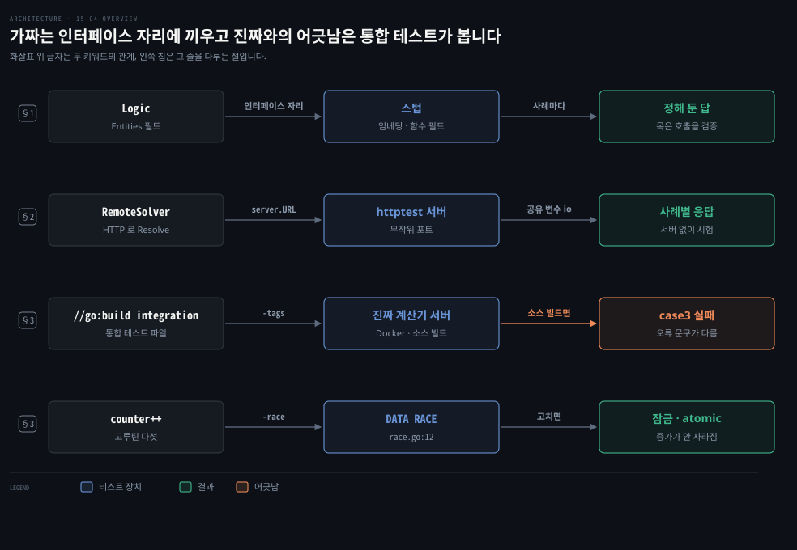
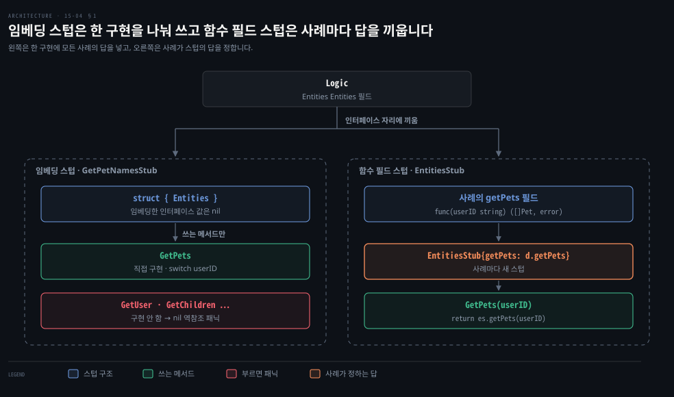
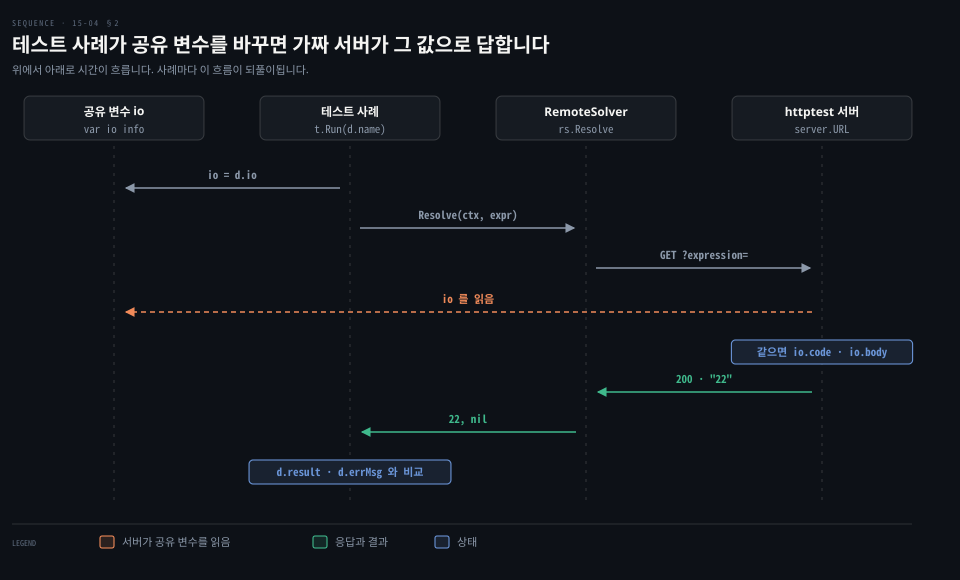
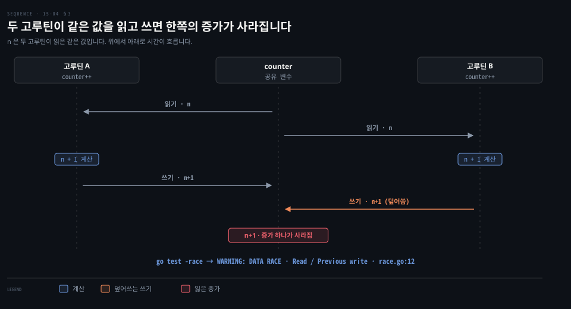

# 의존성은 인터페이스 스텁으로 바꾸고 httptest 와 빌드 태그와 -race 로 경계와 동시성을 시험합니다

---

> Learning Go 15장 끝입니다. 다른 코드에 기대는 코드를 스텁으로 떼어 시험하는 두 방법과, HTTP 서비스를 부르는 코드를 `httptest` 로 시험하는 법, 통합 테스트를 빌드 태그로 묶는 법, 데이터 레이스를 `-race` 로 찾는 법을 다루고 장 끝 연습 문제를 풉니다.

## 핵심 요약

> 이 편이 매달린 하나의 생각은 의존성을 인터페이스로 받아 두면 테스트에서 그 자리에 무엇이든 끼울 수 있고, 끼운 가짜가 진짜와 어긋나는지는 통합 테스트가 따로 확인한다는 것입니다.

인터페이스가 크면 구조체에 그 인터페이스를 임베딩해 필요한 메서드만 구현하거나 메서드마다 함수 필드를 두어 테스트 사례가 동작을 정하게 합니다. HTTP 를 부르는 코드는 `httptest.NewServer` 가 띄운 가짜 서버로 시험합니다. 진짜 서비스와 붙는 통합 테스트는 `//go:build integration` 으로 따로 묶습니다.

`go test -race` 는 여러 고루틴이 잠금 없이 같은 변수를 건드리는 곳을 찾아 줍니다. 모든 레이스를 찾는다는 보장은 없지만 찾은 곳은 반드시 고쳐야 합니다.


## 학습 목표

> 이 편을 읽고 나면 아래 다섯 가지를 스스로 해낼 수 있습니다.

1. 큰 인터페이스를 스텁으로 바꾸는 두 방법, 곧 인터페이스 임베딩과 함수 필드를 쓰고 각각의 한계를 말할 수 있습니다.
2. 스텁과 목(mock)의 차이를 구분합니다.
3. `httptest.NewServer` 로 HTTP 서비스를 부르는 코드를 서버 없이 시험합니다.
4. 통합 테스트를 빌드 태그·환경 변수·`-short` 로 나누는 방법의 장단점을 말하고 통합 테스트가 단위 테스트로는 못 잡는 것을 예로 들 수 있습니다.
5. `-race` 로 데이터 레이스를 찾고 연습 문제 앱의 버그를 테스트·퍼징·레이스 검출로 찾아 고칠 수 있습니다.

아래는 이 편의 키워드를 이은 개념도입니다. 첫 줄은 의존성을 인터페이스로 받아 스텁을 끼우는 흐름입니다. 둘째 줄은 HTTP 의존성을 가짜 서버로 바꾸는 흐름이고 셋째 줄은 진짜 서비스와 붙는 통합 테스트를 따로 묶는 흐름입니다. 넷째 줄은 레이스 검출기가 동시성 버그를 찾는 흐름입니다. 왼쪽 칩이 그 줄을 다루는 절입니다.




## 1. 스텁은 인터페이스 자리에 정해 둔 답을 돌려주는 가짜를 끼웁니다

> 지금까지 시험한 함수는 다른 코드에 기대지 않았지만 실제 코드는 대부분 의존성으로 가득합니다. 의존성이 진짜 계산기 서버나 데이터베이스라면 테스트마다 그것을 띄울 수 없으므로, 그 자리에 정해 둔 답을 돌려주는 가짜를 끼워야 합니다.

구체 타입에 직접 기대는 코드는 테스트에서 그 의존성을 바꿔 끼울 수 없습니다. 7장에서 본 대로 Go 는 함수 호출을 두 방식으로 추상화합니다. 함수 타입을 정의하거나(07-04 §3) 인터페이스를 정의합니다(07-04 §4). 이 추상화는 모듈화된 제품 코드뿐 아니라 단위 테스트도 쉽게 해 줍니다. 원문의 팁은 한 줄입니다. 코드가 추상화에 기대면 단위 테스트를 쓰기 쉽습니다.

### 작은 인터페이스는 스텁 구조체 하나로 대신합니다

원서 저장소의 `solver` 패키지에서 `Processor` 는 수식을 푸는 `MathSolver` 인터페이스를 필드로 가집니다.

```go
type Processor struct {
	Solver MathSolver
}

type MathSolver interface {
	Resolve(ctx context.Context, expression string) (float64, error)
}
```

`Processor.ProcessExpression` 은 `io.Reader` 에서 수식 한 줄을 읽어 `p.Solver.Resolve` 에 넘깁니다. 이 메서드를 시험하는 데 진짜 계산기는 필요 없습니다. 정해진 수식에 정해진 답을 돌려주는 구현이면 됩니다.

```go
type MathSolverStub struct{}

func (ms MathSolverStub) Resolve(ctx context.Context, expr string) (float64, error) {
	switch expr {
	case "2 + 2 * 10":
		return 22, nil
	case "( 2 + 2 ) * 10":
		return 40, nil
	case "( 2 + 2 * 10":
		return 0, errors.New("invalid expression: ( 2 + 2 * 10")
	}
	return 0, nil
}
```

테스트는 `Processor{MathSolverStub{}}` 를 만들어 세 줄짜리 입력을 차례로 처리하고 결과를 확인합니다. 이 노트의 go1.27.1 에서 `TestProcessor_ProcessExpressions` 는 통과했습니다.

### 큰 인터페이스는 임베딩해서 쓰는 메서드만 구현합니다

인터페이스가 메서드를 많이 가지면 스텁이 그 메서드를 모두 구현해야 합니다. 원서 저장소의 `stub` 패키지는 메서드가 다섯인 인터페이스를 씁니다.

```go
type Entities interface {
	GetUser(id string) (User, error)
	GetPets(userID string) ([]Pet, error)
	GetChildren(userID string) ([]Person, error)
	GetFriends(userID string) ([]Person, error)
	SaveUser(user User) error
}

type Logic struct {
	Entities Entities
}

func (l Logic) GetPetNames(userId string) ([]string, error) {
	pets, err := l.Entities.GetPets(userId)
	if err != nil {
		return nil, err
	}
	out := make([]string, len(pets))
	for _, p := range pets {
		out = append(out, p.Name)
	}
	return out, nil
}
```

`GetPetNames` 는 다섯 메서드 가운데 `GetPets` 만 씁니다. 첫 번째 방법은 구조체에 인터페이스를 임베딩하는 것입니다(07-02 §3). 임베딩하면 인터페이스의 메서드가 모두 구조체의 메서드로 정의됩니다. 지금 테스트에 필요한 메서드만 직접 구현하면 됩니다.

```go
type GetPetNamesStub struct {
	Entities
}

func (ps GetPetNamesStub) GetPets(userID string) ([]Pet, error) {
	switch userID {
	case "1":
		return []Pet{{Name: "Bubbles"}}, nil
	case "2":
		return []Pet{{Name: "Stampy"}, {Name: "Snowball II"}}, nil
	default:
		return nil, fmt.Errorf("invalid id: %s", userID)
	}
}
```

원문의 경고대로 임베딩한 인터페이스 필드는 `nil` 이라서 구현하지 않은 메서드를 부르면 패닉이 납니다. 이 노트에서 `GetUser` 를 부르니 `invalid memory address or nil pointer dereference` 패닉이 났습니다.

원문은 `GetPetNames` 에 버그가 있다고 귀띔만 합니다. 이 노트에서 돌리니 `case1` 이 `[]string{"", "Bubbles"}` 를 돌려받아 실패했습니다. `make([]string, len(pets))` 가 길이를 이미 채운 슬라이스를 만들고 `append` 가 그 뒤에 이어 붙였기 때문입니다. `make([]string, 0, len(pets))` 로 고치면 됩니다.

> **원문 정오**: 원문의 첫 스텁 테스트는 `case3` 에 `"3"` 과 `nil` 을 두고, 오류가 나면 조건 없이 `t.Error(err)` 를 부릅니다. 스텁은 `"3"` 에 `invalid id: 3` 오류를 돌려주므로, 위 버그를 고친 뒤에도 이 노트에서 `case3` 은 `stub_test.go:41: invalid id: 3` 으로 실패했습니다. 저장소의 같은 테스트는 `if err != nil && d.userID != "3"` 으로 그 사례를 빼 두었습니다. 원문의 테스트 코드와 저장소가 갈리는 곳이고, 책 PDF 에서 이 테스트는 이 장에만 있습니다.

### 함수 필드 스텁은 사례마다 동작을 바꿉니다

임베딩 방식은 한 테스트에서 메서드 한둘만 쓸 때 잘 맞습니다. 같은 메서드를 여러 테스트에서 다른 입력·출력으로 불러야 하면 가능한 답을 한 구현에 다 넣거나 테스트마다 구조체를 새로 만들어야 합니다. 원문은 이것이 금세 이해하기도 유지하기도 어려워진다고 말합니다.

더 나은 방법은 메서드 호출을 함수 필드로 넘기는 스텁입니다. `Entities` 의 메서드마다 같은 시그니처의 함수 필드를 두고 각 메서드는 그 필드를 부릅니다.

```go
type EntitiesStub struct {
	getUser     func(id string) (User, error)
	getPets     func(userID string) ([]Pet, error)
	getChildren func(userID string) ([]Person, error)
	getFriends  func(userID string) ([]Person, error)
	saveUser    func(user User) error
}

func (es EntitiesStub) GetPets(userID string) ([]Pet, error) {
	return es.getPets(userID)
}
```

테이블 테스트의 사례 구조체에 함수 타입 필드를 더해 사례마다 `GetPets` 가 돌려줄 값을 적습니다.

```go
data := []struct {
	name     string
	getPets  func(userID string) ([]Pet, error)
	userID   string
	petNames []string
	errMsg   string
}{
	{"case1", func(userID string) ([]Pet, error) {
		return []Pet{{Name: "Bubbles"}}, nil
	}, "1", []string{"Bubbles"}, ""},
	{"case2", func(userID string) ([]Pet, error) {
		return nil, errors.New("invalid id: 3")
	}, "3", nil, "invalid id: 3"},
}
l := Logic{}
for _, d := range data {
	t.Run(d.name, func(t *testing.T) {
		l.Entities = EntitiesStub{getPets: d.getPets}
		// 이하 비교
	})
}
```

사례마다 새 `EntitiesStub` 을 만들고 그 사례의 `getPets` 를 넣습니다. 스텁이 무엇을 돌려줄지가 사례 옆에 바로 보여서 사례별 동작이 한눈에 들어옵니다. 저장소판은 `case3` 까지 셋입니다. `make` 버그를 고치니 셋 다 통과했습니다. 아래 도식은 두 스텁 모양을 나란히 놓았습니다.



### 스텁은 답을 돌려주고 목은 호출을 검증합니다

원문의 곁글은 두 말이 흔히 섞여 쓰이지만 다른 개념이라고 말합니다. Martin Fowler 의 글을 빌리면 스텁은 주어진 입력에 미리 정한 값을 돌려줍니다. 목은 호출이 기대한 순서와 입력으로 일어났는지 검증합니다. 이 편의 예제는 모두 스텁입니다. 목은 손으로 짤 수도 서드파티 라이브러리로 만들 수도 있습니다. 원문은 Google 의 gomock 과 Stretchr 의 testify 를 꼽습니다.

원문 밖 보충입니다. 원문이 링크한 `golang/mock` 저장소는 2023년 6월부터 유지보수되지 않습니다. README 첫머리가 유지보수되는 포크 `go.uber.org/mock` 을 쓰라고 안내하고 GitHub 에서 보관(archived) 상태입니다. testify 는 2026년 9월에도 갱신되고 있었습니다. Spring 쪽에 견주면 함수 필드 스텁은 Mockito 의 `when(...).thenReturn(...)` 로 사례마다 답을 정하는 일에, 목의 호출 검증은 `verify(...)` 에 가깝습니다. 이 비교도 원문 밖입니다.


## 2. httptest 는 HTTP 서비스를 부르는 코드를 가짜 서버로 시험합니다

> HTTP 서비스를 부르는 함수는 예전에는 그 서비스의 시험용 인스턴스를 띄워야 하는 통합 테스트가 됐습니다. 표준 라이브러리 `net/http/httptest` 는 테스트 안에 가짜 HTTP 서버를 띄워, 네트워크 너머의 서비스를 스텁으로 바꿉니다.

HTTP 클라이언트 코드는 인터페이스 스텁만으로는 시험이 끝나지 않습니다. 요청을 만들고 상태 코드와 본문을 해석하는 부분이 바로 시험해야 할 코드이기 때문입니다. `solver` 패키지의 `RemoteSolver` 는 `MathSolver` 를 HTTP 로 구현합니다. 수식을 쿼리 매개변수로 붙여 GET 요청을 보냅니다(14-01 §1 의 `NewRequestWithContext`). 200 이 아니면 본문을 오류 메시지로, 200 이면 본문을 `float64` 로 바꿔 돌려줍니다.

```go
type RemoteSolver struct {
	MathServerURL string
	Client        *http.Client
}

func (rs RemoteSolver) Resolve(ctx context.Context, expression string) (float64, error) {
	req, err := http.NewRequestWithContext(ctx, http.MethodGet,
		rs.MathServerURL+"?expression="+url.QueryEscape(expression),
		nil)
	if err != nil {
		return 0, err
	}
	resp, err := rs.Client.Do(req)
	if err != nil {
		return 0, err
	}
	defer resp.Body.Close()
	contents, err := io.ReadAll(resp.Body)
	if err != nil {
		return 0, err
	}
	if resp.StatusCode != http.StatusOK {
		return 0, errors.New(string(contents))
	}
	result, err := strconv.ParseFloat(string(contents), 64)
	if err != nil {
		return 0, err
	}
	return result, nil
}
```

### 가짜 서버와 테스트가 변수 하나를 나눠 씁니다

테스트는 먼저 입력과 기대 출력을 담는 타입 `info` 와, 지금 사례의 값을 담을 변수 `io` 를 선언합니다. 그다음 가짜 서버를 띄워 `RemoteSolver` 를 설정합니다.

```go
type info struct {
	expression string
	code       int
	body       string
}
var io info
server := httptest.NewServer(
	http.HandlerFunc(func(rw http.ResponseWriter, req *http.Request) {
		expression := req.URL.Query().Get("expression")
		if expression != io.expression {
			rw.WriteHeader(http.StatusBadRequest)
			rw.Write([]byte("invalid expression: " + io.expression))
			return
		}
		rw.WriteHeader(io.code)
		rw.Write([]byte(io.body))
	}))
defer server.Close()
rs := RemoteSolver{
	MathServerURL: server.URL,
	Client:        server.Client(),
}
```

`httptest.NewServer` 는 쓰지 않는 무작위 포트에 HTTP 서버를 띄웁니다. 요청을 처리할 `http.Handler` 를 넘깁니다. 서버이므로 테스트가 끝나면 닫습니다. 서버의 `URL` 필드에 주소가 있습니다. `Client()` 는 이 서버와 통신하도록 미리 설정한 `http.Client` 를 돌려줍니다. 둘을 `RemoteSolver` 에 넘기면 됩니다.

나머지는 여느 테이블 테스트와 같습니다. 사례마다 `io = d.io` 로 서버가 볼 값을 바꾸고 `rs.Resolve` 를 부른 뒤 결과와 오류 메시지를 비교합니다. 원문은 변수 `io` 가 가짜 서버의 클로저와 사례를 도는 클로저 둘에 붙잡혀 있다는 점을 짚습니다. 한쪽에서 쓰고 다른 쪽에서 읽는 것은 제품 코드라면 나쁜 생각이지만 함수 하나 안의 테스트 코드에서는 잘 통한다고 말합니다. 이 노트에서 세 사례는 모두 통과했습니다.



> **원문 정오**: 원문이 보인 사례 구조체는 `name`·`io`·`result` 세 필드뿐인데, 이어지는 루프는 `d.errMsg` 를 읽습니다. 그대로 옮기면 `d.errMsg undefined` 로 컴파일되지 않습니다. 저장소의 테스트에는 `errMsg string` 필드가 있습니다. 책 PDF 에서 `d.errMsg` 는 15장에만 나오고, 필드가 빠진 구조체는 이 한 곳입니다.


## 3. 통합 테스트는 빌드 태그로 묶고 레이스는 -race 로 찾습니다

> 가짜 서버로 시험해도 진짜 서비스의 API 를 제대로 이해했는지는 알 수 없습니다. 진짜 서비스에 붙는 통합 테스트가 따로 필요하지만, 느리고 환경이 있어야 돌므로 평소 단위 테스트와 떼어 둬야 합니다.

### //go:build integration 으로 통합 테스트를 따로 켭니다

원문은 통합 테스트를 다른 서비스에 연결하는 자동화 테스트라고 정의합니다. 서비스 API 에 대한 우리의 이해가 맞는지 확인해 준다는 것입니다. 문제는 묶는 법입니다. 지원 환경이 있을 때만 돌려야 하며 느려서 단위 테스트보다 드물게 돌립니다.

11-04 §3 의 빌드 태그는 주로 운영체제·CPU·Go 버전별 파일을 고르는 데 쓰지만 사용자 정의 태그로 통합 테스트를 언제 컴파일하고 돌릴지 정할 수도 있습니다. 원서 저장소의 `remote_solver_integration_test.go` 는 첫 줄에 태그를 두고 패키지 선언과 빈 줄로 떼어 둡니다.

```go
//go:build integration

package solver
```

원문은 `docker run -p 8080:8080 jonbodner/math-server` 로 계산기 서버를 띄운 뒤 태그를 주어 모든 테스트를 돌립니다.

```bash
go test -tags integration -v ./...
```

### 통합 테스트는 문구가 바뀐 서버를 바로 잡아냈습니다

이 노트의 맥에서는 8080 을 OrbStack 이 쓰고 있어 서버 포트를 바꾸고 테스트 파일의 주소도 맞췄습니다. 서버는 세 가지로 띄웠습니다. 태그 없이 돌리면 통합 테스트 파일은 컴파일되지 않아 단위 테스트 둘만 돌았습니다.

| 서버 | `( 2 + 2 * 10` 에 돌려준 본문 | 통합 테스트 결과 |
|---|---|---|
| Docker 이미지 `jonbodner/math-server`(2020-03-09 빌드) | `invalid expression: ( 2 + 2 * 10` | 셋 다 통과 |
| GitHub `math_server` 2020-03-04 커밋을 빌드 | `invalid expression ( 2 + 2 * 10: invalid operator: (` | `case3` 실패 |
| GitHub `math_server` 2026-04-11 커밋("update for latest version of Go")을 빌드 | `invalid expression: "( 2 + 2 * 10": invalid operator: "("` | `case3` 실패 |

저장소의 통합 테스트는 원서가 안내한 Docker 이미지의 문구와만 맞았습니다. 같은 서비스라도 소스를 빌드한 서버는 문구가 달라 오류 메시지를 문자열로 비교한 사례가 깨졌습니다. 15-02 §1 의 팁이 경고한 일이 실제 서비스에서 일어났습니다. 단위 테스트의 가짜 서버는 이 어긋남을 알려 주지 못합니다. 통합 테스트가 "서비스 API 에 대한 이해"를 확인한다는 원문의 말이 이 표에서 보입니다. 이 해석은 노트의 것입니다.

### 환경 변수로 묶자는 반론과 -short 플래그

원문은 빌드 태그 대신 환경 변수로 통합 테스트를 묶는 사람들도 있다고 소개합니다. Peter Bourgon 은 "Don't Use Build Tags for Integration Tests" 라는 글에서 통합 테스트를 돌리려면 어떤 태그를 켜야 하는지 알아내기 어렵다고 주장합니다. 테스트마다 환경 변수를 확인하고 없으면 돌리는 법을 적은 메시지로 `t.Skip` 을 부르면 무엇이 건너뛰어졌고 어떻게 돌리는지가 드러납니다. 원문은 장황함과 발견 가능성 사이의 거래이니 어느 쪽을 써도 좋다고 맺습니다.

원문의 곁글은 `-short` 플래그로 묶는 방법도 다룹니다. 오래 걸리는 테스트 첫머리에 이렇게 두고 짧은 테스트만 돌릴 때 `go test -short` 를 줍니다.

```go
if testing.Short() {
	t.Skip("skipping test in short mode.")
}
```

원문은 세 가지 문제를 듭니다. 단계가 짧은 것과 전부 둘뿐이라 빌드 태그처럼 필요한 서비스별로 나눌 수 없습니다. 빌드 태그는 의존성을 뜻하지만 `-short` 는 오래 걸리는 테스트를 빼고 싶다는 뜻이라 개념이 다릅니다. 짧은 테스트는 늘 돌려야 하니 긴 테스트를 빼는 플래그보다 넣는 플래그가 더 자연스럽다고 저자는 말합니다.

### -race 는 잠금 없이 같은 변수를 건드리는 곳을 찾습니다

동시성 지원이 언어에 있어도 버그는 생깁니다. 잠금 없이 두 고루틴이 같은 변수를 건드리기 쉽습니다. 컴퓨터 과학에서는 이것을 데이터 레이스라고 부릅니다. Go 에는 이런 버그를 찾는 레이스 검출기가 들어 있습니다. 모든 레이스를 찾는다는 보장은 없지만 찾은 곳에는 알맞은 잠금을 둬야 합니다(12-04 §2).

```go
func getCounter() int {
	var counter int
	var wg sync.WaitGroup
	wg.Add(5)
	for i := 0; i < 5; i++ {
		go func() {
			for i := 0; i < 1000; i++ {
				counter++
			}
			wg.Done()
		}()
	}
	wg.Wait()
	return counter
}
```

고루틴 다섯이 공유 변수 `counter` 를 1,000번씩 늘리니 5,000 이 나와야 합니다. 원문은 테스트가 가끔 통과하지만 대개 `unexpected counter: 3673` 같은 오류로 실패한다고 말합니다. 이 노트에서 열 번 돌리니 일곱 번 실패했고 값은 3,256 에서 4,322 사이였습니다. `counter++` 는 읽고 더하고 쓰는 세 단계라 두 고루틴이 같은 값을 읽으면 한쪽의 증가가 사라집니다.



`-race` 를 주면 검출기가 켜집니다. 이 노트의 출력은 원문과 같은 모양이었고 두 접근이 모두 `race.go:12` 의 `counter++` 임을 보여 줍니다. 이어서 고루틴을 만든 위치도 찍혔습니다. 원문이 옮긴 출력에는 이 부분이 없습니다.

```bash
go test -race
==================
WARNING: DATA RACE
Read at 0x00c000094178 by goroutine 11:
  github.com/learning-go-book-2e/ch15/sample_code/race.getCounter.func1()
      .../sample_code/race/race.go:12 +0x3c
Previous write at 0x00c000094178 by goroutine 7:
  github.com/learning-go-book-2e/ch15/sample_code/race.getCounter.func1()
      .../sample_code/race/race.go:12 +0x4c
Goroutine 11 (running) created at:
  github.com/learning-go-book-2e/ch15/sample_code/race.getCounter()
      .../sample_code/race/race.go:10 +0x74
```

원문의 경고는 "sleep" 을 넣어 접근 간격을 벌려 레이스를 고치려 하지 말라는 것입니다. 어떤 경우에는 문제가 사라지는 듯해도 코드는 여전히 틀렸고 언젠가 실패합니다. `-race` 는 테스트뿐 아니라 빌드에도 줄 수 있어서 테스트가 없는 코드의 레이스도 실행 중에 콘솔로 알립니다.

늘 켜 두지 않는 까닭은 비용입니다. 원문은 `-race` 바이너리가 약 10배 느리다고 말합니다. race detector 공식 문서는 보통 프로그램에서 메모리는 5~10배, 실행 시간은 2~20배 늘 수 있다고 적습니다. 1초짜리 테스트 묶음에는 문제가 없지만 몇 분 걸리는 묶음이 10배 느려지면 생산성이 떨어집니다.

### 시간과 고루틴을 다루는 테스트는 synctest 로 가짜 시계를 씁니다

원문 밖 보충입니다. Go 1.25 는 `testing/synctest` 를 정식 패키지로 들였습니다(1.24 에서는 실험 기능). `synctest.Test` 안의 고루틴은 격리된 "거품" 안에서 돌고 `time` 함수는 가짜 시계를 씁니다. 거품 안의 모든 고루틴이 막히면 시계가 다음 사건까지 곧바로 건너뜁니다.

```go
func TestTimeoutFake(t *testing.T) {
	synctest.Test(t, func(t *testing.T) {
		ctx, cancel := context.WithTimeout(t.Context(), 5*time.Second)
		defer cancel()
		time.Sleep(4999 * time.Millisecond)
		synctest.Wait()
		if ctx.Err() != nil {
			t.Fatal("canceled too early")
		}
		time.Sleep(time.Millisecond)
		synctest.Wait()
		if ctx.Err() != context.DeadlineExceeded {
			t.Fatal("not canceled after deadline:", ctx.Err())
		}
	})
}
```

이 노트에서 5초 기한(14-03 §1)을 시험한 이 테스트는 가짜 시계로 5초가 흐른 뒤 통과했고 실제로는 `0.00s` 가 걸렸습니다. Go 1.27 은 `time.Sleep` 과 `synctest.Wait` 를 묶은 `synctest.Sleep` 을 더했습니다. `httptest.NewTestServer` 도 더했는데 메모리 안의 가짜 네트워크로 도는 서버를 만들어 주어 synctest 와 함께 쓰기 좋습니다.


## 연습 문제

> 원문 연습 문제 셋은 원서가 링크한 Simple Web App 을 단위 테스트·레이스 검출기·퍼즈 테스트로 차례로 파고들어 버그를 고치는 것입니다. 원서 저장소에 풀이가 없어 아래는 모두 이 노트의 풀이이고 go1.27.1 에서 돌렸습니다.

앱은 POST 로 받은 네 줄 입력(ID, 연산자, 두 정수)을 버퍼 100 인 채널에 넣습니다(12-03 §1). 고루틴이 계산해 결과를 파일에 씁니다. 채널이 차면 503 으로 거절합니다. 핵심은 입력을 파싱하는 `parser`, 계산하는 `DataProcessor`, 결과를 쓰는 `WriteData`, HTTP 핸들러를 만드는 `NewController` 넷입니다.

### 1. 단위 테스트로 커버리지를 채웁니다

네 함수마다 테이블 테스트를 썼습니다. `parser` 는 정상 입력과 두 숫자가 틀린 경우를 봅니다. `DataProcessor` 는 네 연산자와 모르는 연산자·숫자 아닌 입력을 채널에 넣고 결과 목록을 `cmp.Diff` 로 비교합니다. `NewController` 는 `httptest.NewRecorder` 로 응답을 받아 202·503·400 세 경우를 봅니다. 400 은 읽기에 늘 실패하는 `io.Reader` 를 본문으로 넣어 만듭니다.

```go
func TestNewController(t *testing.T) {
	out := make(chan []byte, 1)
	h := NewController(out)
	data := []struct {
		name string
		body func() *http.Request
		code int
		resp string
	}{
		{"accepted", func() *http.Request {
			return httptest.NewRequest(http.MethodPost, "/", strings.NewReader("A\n+\n1\n2"))
		}, http.StatusAccepted, "OK: 1"},
		{"busy", func() *http.Request {
			return httptest.NewRequest(http.MethodPost, "/", strings.NewReader("B\n+\n1\n2"))
		}, http.StatusServiceUnavailable, "Too Busy: 1"},
		{"bad_body", func() *http.Request {
			return httptest.NewRequest(http.MethodPost, "/", errReader{})
		}, http.StatusBadRequest, "Bad Input"},
	}
	for _, d := range data {
		t.Run(d.name, func(t *testing.T) {
			rec := httptest.NewRecorder()
			h.ServeHTTP(rec, d.body())
			if rec.Code != d.code || rec.Body.String() != d.resp {
				t.Errorf("expected %d %q, got %d %q", d.code, d.resp, rec.Code, rec.Body.String())
			}
		})
	}
}
```

채널 버퍼를 1 로 줘서 둘째 요청이 503 이 되게 했습니다. 원본 코드에서 이 테스트들은 통과했고 커버리지는 83.1% 였습니다. 남은 것은 서버를 띄우는 `main` 입니다. 0으로 나누는 사례를 더하자 `DataProcessor` 가 `integer divide by zero` 패닉을 냈습니다. 실제 서버라면 처리 고루틴이 죽으면서 프로세스 전체가 끝납니다(09-03 §1). `/` 분기에서 `Val2` 가 0 이면 그 입력을 건너뛰도록 고쳤습니다.

### 2. 레이스 검출기로 카운터 경쟁을 찾습니다

핸들러 클로저는 `numSent`·`numRejected` 를 늘립니다. `net/http` 서버는 요청마다 고루틴을 띄우므로 이 두 변수를 여러 고루틴이 잠금 없이 건드립니다. 요청 50개를 고루틴으로 동시에 보내는 테스트를 `-race` 로 돌리니 `DataProcessor.go:88` 의 증가와 `DataProcessor.go:109` 의 읽기에서 `WARNING: DATA RACE` 가 났습니다.

두 카운터를 `sync/atomic` 의 `atomic.Int64` 로 바꿔 고쳤습니다. 12-04 §3 에서 본 대로 `atomic` 은 대개 필요 없지만 서로 관계없는 카운터 하나씩을 늘리는 이 경우에는 뮤텍스보다 단순합니다. `Add` 가 돌려준 값을 응답에 그대로 써서 읽기도 경쟁 없이 합니다.

```go
var numSent atomic.Int64
var numRejected atomic.Int64
// 핸들러 안
sent := numSent.Add(1)
// ...
w.Write([]byte("OK: " + strconv.FormatInt(sent, 10)))
```

### 3. parser 를 퍼징하면 네 줄이 안 되는 입력에서 패닉이 납니다

`parser` 는 입력을 `\n` 으로 나눈 뒤 길이를 확인하지 않고 `lines[0]` 부터 `lines[3]` 까지 읽습니다. README 의 두 예제 입력을 시드로 넣은 퍼즈 테스트를 돌리니 0.02초 만에 입력 `"0"` 에서 `index out of range [1] with length 1` 패닉을 찾았습니다. 줄이 넷보다 적으면 `too few lines` 오류를 돌려주게 고쳤습니다.

```go
lines := bytes.Split(data, []byte("\n"))
if len(lines) < 4 {
	return Input{}, errors.New("too few lines")
}
```

세 가지를 고친 뒤 `parser`·`DataProcessor`·`WriteData`·`NewController` 의 커버리지는 모두 100% 였고 전체는 `main` 을 빼지 못해 82.8% 였습니다. `-race` 로 돌린 전체 테스트와 90초 퍼징도 통과했습니다.


## 핵심 개념 체크리스트

목표 번호 순서대로 짝지었습니다.

- [ ] (목표 1) `GetPetNamesStub` 으로 `GetUser` 를 부르면 무슨 일이 일어나고, 함수 필드 스텁은 임베딩 스텁의 어떤 불편을 없앱니까?
- [ ] (목표 2) 호출 순서와 인자를 검증하는 가짜는 스텁입니까, 목입니까?
- [ ] (목표 3) `httptest.NewServer` 가 돌려준 서버의 두 값 가운데 무엇을 `RemoteSolver` 에 넘기고, 테스트가 끝나면 무엇을 해야 합니까?
- [ ] (목표 4) 단위 테스트는 통과했는데 통합 테스트의 `case3` 만 실패한 서버가 있었다면, 그 실패가 알려 주는 것은 무엇입니까?
- [ ] (목표 5) `counter++` 를 다섯 고루틴이 나눠 할 때 증가가 사라지는 이유와, 연습 문제 앱의 카운터 경쟁을 고친 방법을 말할 수 있습니까?


## 관련 문서

- [15-03 퍼징은 시드를 비틀어 놓친 입력을 찾고 벤치마크는 b.Loop 로 한 번의 비용을 잽니다](./15-03.%ED%8D%BC%EC%A7%95%EC%9D%80%20%EC%8B%9C%EB%93%9C%EB%A5%BC%20%EB%B9%84%ED%8B%80%EC%96%B4%20%EB%86%93%EC%B9%9C%20%EC%9E%85%EB%A0%A5%EC%9D%84%20%EC%B0%BE%EA%B3%A0%20%EB%B2%A4%EC%B9%98%EB%A7%88%ED%81%AC%EB%8A%94%20b.Loop%20%EB%A1%9C%20%ED%95%9C%20%EB%B2%88%EC%9D%98%20%EB%B9%84%EC%9A%A9%EC%9D%84%20%EC%9E%BD%EB%8B%88%EB%8B%A4.md) — 15장 앞. 퍼징·벤치마크
- [07-04 타입 단언은 아껴 쓰고 암묵 인터페이스로 의존성을 주입합니다](./07-04.%ED%83%80%EC%9E%85%20%EB%8B%A8%EC%96%B8%EC%9D%80%20%EC%95%84%EA%BB%B4%20%EC%93%B0%EA%B3%A0%20%EC%95%94%EB%AC%B5%20%EC%9D%B8%ED%84%B0%ED%8E%98%EC%9D%B4%EC%8A%A4%EB%A1%9C%20%EC%9D%98%EC%A1%B4%EC%84%B1%EC%9D%84%20%EC%A3%BC%EC%9E%85%ED%95%A9%EB%8B%88%EB%8B%A4.md) — 7장. 함수 타입과 암묵 인터페이스로 의존성 주입
- [11-04 Go 바이너리는 빌드 정보를 품고 GOOS·GOARCH 와 빌드 태그로 대상을 가립니다](./11-04.Go%20%EB%B0%94%EC%9D%B4%EB%84%88%EB%A6%AC%EB%8A%94%20%EB%B9%8C%EB%93%9C%20%EC%A0%95%EB%B3%B4%EB%A5%BC%20%ED%92%88%EA%B3%A0%20GOOS%C2%B7GOARCH%20%EC%99%80%20%EB%B9%8C%EB%93%9C%20%ED%83%9C%EA%B7%B8%EB%A1%9C%20%EB%8C%80%EC%83%81%EC%9D%84%20%EA%B0%80%EB%A6%BD%EB%8B%88%EB%8B%A4.md) — 11장. 빌드 태그
- [12-04 채널로 파이프라인을 짜고 공유 필드는 뮤텍스로 지킵니다](./12-04.%EC%B1%84%EB%84%90%EB%A1%9C%20%ED%8C%8C%EC%9D%B4%ED%94%84%EB%9D%BC%EC%9D%B8%EC%9D%84%20%EC%A7%9C%EA%B3%A0%20%EA%B3%B5%EC%9C%A0%20%ED%95%84%EB%93%9C%EB%8A%94%20%EB%AE%A4%ED%85%8D%EC%8A%A4%EB%A1%9C%20%EC%A7%80%ED%82%B5%EB%8B%88%EB%8B%A4.md) — 12장. 뮤텍스와 atomic
- [14-03 WithTimeout 은 요청 시간을 제한하고 자식은 부모 기한을 넘지 못하며 긴 계산은 스스로 취소를 확인합니다](./14-03.WithTimeout%20%EC%9D%80%20%EC%9A%94%EC%B2%AD%20%EC%8B%9C%EA%B0%84%EC%9D%84%20%EC%A0%9C%ED%95%9C%ED%95%98%EA%B3%A0%20%EC%9E%90%EC%8B%9D%EC%9D%80%20%EB%B6%80%EB%AA%A8%20%EA%B8%B0%ED%95%9C%EC%9D%84%20%EB%84%98%EC%A7%80%20%EB%AA%BB%ED%95%98%EB%A9%B0%20%EA%B8%B4%20%EA%B3%84%EC%82%B0%EC%9D%80%20%EC%8A%A4%EC%8A%A4%EB%A1%9C%20%EC%B7%A8%EC%86%8C%EB%A5%BC%20%ED%99%95%EC%9D%B8%ED%95%A9%EB%8B%88%EB%8B%A4.md) — 14장. 시간 제한 context
- [Learning Go 2판 — 정독 인덱스](./README.md) — 16장 전체 지도


## 참고 자료

- 원본: 《Learning Go, 2nd Edition》 (Jon Bodner, O'Reilly)
- 다룬 범위: Chapter 15 "Using Stubs in Go" ~ "Wrapping Up", 연습 문제 1~3
- 원서 예제 저장소: [learning-go-book-2e/ch15](https://github.com/learning-go-book-2e/ch15) · 연습 문제 앱: [learning-go-book-2e/simplewebapp](https://github.com/learning-go-book-2e/simplewebapp) · 계산기 서버: [jonbodner/math_server](https://github.com/jonbodner/math_server)
- [Mocks Aren't Stubs](https://martinfowler.com/articles/mocksArentStubs.html) — Martin Fowler
- [golang/mock](https://github.com/golang/mock) (보관됨) · [go.uber.org/mock](https://github.com/uber-go/mock) · [testify](https://github.com/stretchr/testify)
- [net/http/httptest](https://pkg.go.dev/net/http/httptest) — NewServer·NewRecorder·NewTestServer
- [Don't use build tags for integration tests](https://peter.bourgon.org/blog/2021/04/02/dont-use-build-tags-for-integration-tests.html) — Peter Bourgon
- [Data Race Detector](https://go.dev/doc/articles/race_detector) — 실행 비용
- [testing/synctest](https://pkg.go.dev/testing/synctest) · [Go 1.25 릴리스 노트](https://go.dev/doc/go1.25) · [Go 1.27 릴리스 노트](https://go.dev/doc/go1.27)
