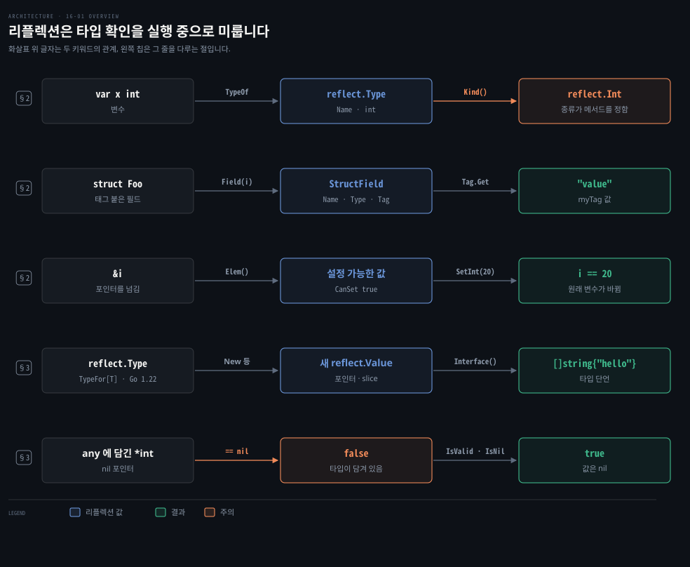
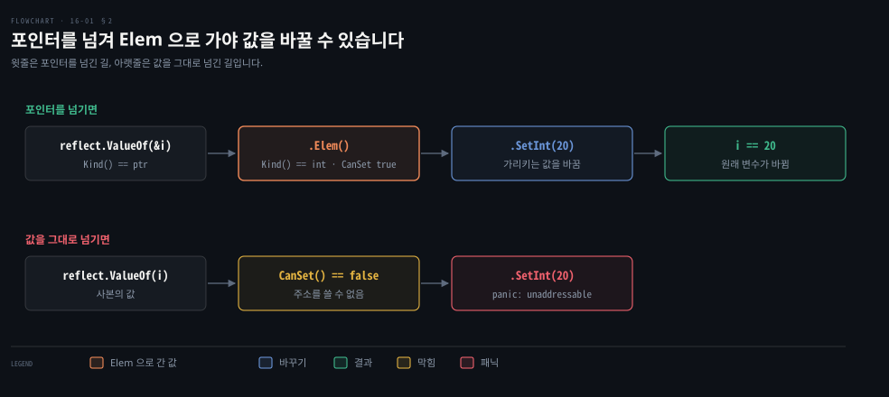

# 리플렉션은 실행 중에 타입과 값을 다루고 Kind 에 맞지 않는 메서드는 패닉을 냅니다

---

> Learning Go 16장 앞부분입니다. 컴파일할 때 모르는 타입의 데이터를 실행 중에 살피고 바꾸는 `reflect` 패키지의 타입·종류·값 세 개념과 값을 읽고 쓰고 만드는 법, 인터페이스 속 `nil` 을 가리는 법을 봅니다.

## 핵심 요약

> 이 편이 매달린 하나의 생각은 리플렉션이 컴파일러가 해 주던 타입 확인을 실행 중으로 미루는 대신, 틀리면 컴파일 오류가 아니라 패닉으로 알게 된다는 것입니다.

`reflect.TypeOf` 는 변수의 타입을 `reflect.Type` 으로, `reflect.ValueOf` 는 값을 `reflect.Value` 로 돌려줍니다. 타입이 무엇으로 이뤄졌는지는 `Kind` 가 알려 주고, 많은 메서드는 맞는 `Kind` 에서만 쓸 수 있으며 아니면 패닉을 냅니다. 값을 바꾸려면 포인터를 넘기고 `Elem` 으로 가리키는 값에 가서 `SetInt` 같은 메서드를 부릅니다.

`reflect.New` 와 `MakeSlice`·`MakeMap` 은 `new`·`make` 에 해당합니다. 인터페이스에 담긴 값이 `nil` 인지는 `IsValid` 와 `IsNil` 로 확인합니다.


## 학습 목표

> 이 편을 읽고 나면 아래 다섯 가지를 스스로 해낼 수 있습니다.

1. 표준 라이브러리가 리플렉션을 쓰는 자리를 들고 리플렉션을 쓰면 무엇을 잃는지 말할 수 있습니다.
2. 타입(type)과 종류(kind)를 가르고 종류에 맞지 않는 메서드를 부르면 어떻게 되는지 말할 수 있습니다.
3. `reflect.StructField` 로 필드 이름·타입·구조체 태그를 읽을 수 있습니다.
4. 리플렉션으로 변수의 값을 바꾸는 세 단계와 포인터가 필요한 이유를 설명할 수 있습니다.
5. `reflect.New`·`MakeSlice` 로 값을 만들고 인터페이스에 담긴 `nil` 을 `IsValid`·`IsNil` 로 가릴 수 있습니다.

아래는 이 편의 키워드를 이은 개념도입니다. 첫 줄은 변수에서 타입과 종류를 얻는 흐름입니다. 둘째 줄은 구조체의 필드와 태그를 읽는 흐름이고, 셋째 줄은 포인터로 값을 바꾸는 흐름입니다. 넷째 줄은 새 값을 만드는 흐름입니다. 다섯째 줄은 인터페이스의 `nil` 을 가리는 흐름입니다. 왼쪽 칩이 그 줄을 다루는 절입니다.




## 1. 리플렉션은 컴파일할 때 없던 타입 정보를 실행 중에 다룹니다

> 파일이나 네트워크에서 들어온 데이터처럼 프로그램을 쓸 때 몰랐던 정보를 다뤄야 하면 정적 타입 언어의 컴파일 시점 정보만으로는 부족합니다. 리플렉션은 실행 중에 타입을 살피고 변수·함수·구조체를 살피고 바꾸고 만들게 해 줍니다.

Go 의 안전장치만으로는 풀 수 없는 문제가 있습니다. 원문은 이 장을 옛 지도의 가장자리에 그려 넣던 용에 빗댑니다. 앞 장들은 Go 가 타입이 있는 변수와 가비지 컬렉션으로 안전한 언어라고 강조했습니다. 대부분의 코드에서 그 말은 맞지만 탈출구가 있습니다. 컴파일할 때 타입을 알 수 없으면 `reflect` 를, 메모리 배치를 활용해야 하면 `unsafe` 를, C 라이브러리에만 있는 기능이 필요하면 `cgo` 를 씁니다. 입문서에 이런 내용을 넣은 이유를 원문은 둘로 듭니다. 이해하지 못한 기법을 복사해 붙이기 전에 알아 두는 편이 낫고 무엇보다 재미있기 때문입니다.

### 표준 라이브러리는 바깥과 데이터를 주고받는 경계에서 리플렉션을 씁니다

원문은 표준 라이브러리에서 리플렉션을 쓰는 자리를 이렇게 꼽습니다.

- `database/sql` 이 레코드를 보내고 읽을 때
- `text/template`·`html/template` 이 템플릿에 넘긴 값을 처리할 때
- `fmt.Println` 과 그 친구들이 인자의 타입을 알아낼 때
- `errors.Is`·`errors.As` 를 구현할 때
- `sort.Slice`·`sort.SliceStable`·`sort.SliceIsSorted` 가 어떤 slice 든 정렬할 때
- JSON·XML 같은 인코딩 패키지가 구조체 태그를 읽고 필드를 읽고 쓸 때(13-03 §1)

공통점은 프로그램 안으로 들어오거나 밖으로 나가는 데이터를 다룬다는 것입니다. 리플렉션은 대개 프로그램과 바깥 세계의 경계에서 쓰입니다.

대가도 있습니다. 같은 일을 리플렉션 없이 할 때보다 꽤 느립니다(16-02 §3). 더 중요한 것은 코드가 약해지고 장황해진다는 점입니다. `reflect` 의 많은 함수와 메서드는 틀린 종류의 데이터를 받으면 패닉을 냅니다. 원문은 나중에 읽을 사람, 곧 미래의 자신을 위해 무엇을 하는지 주석을 남기라고 권합니다.

원문의 메모는 표준 라이브러리의 또 다른 쓰임으로 테스트를 듭니다. `reflect.DeepEqual` 은 `==` 로 비교할 수 없는 slice 와 map 까지 "깊이" 비교합니다. 다만 Go 1.21 부터는 slice 와 map 에 `slices.Equal`·`maps.Equal`(03-01 §2)을 쓰는 편이 더 빠르다고 원문은 덧붙입니다.


## 2. 타입과 종류와 값 — 종류에 맞지 않는 메서드는 패닉을 냅니다

> 리플렉션의 메서드는 대부분 특정한 모양의 타입에서만 뜻이 있어서, 함수가 아닌 타입에 매개변수 개수를 물으면 패닉이 납니다. 그래서 리플렉션은 타입·종류·값 세 개념으로 짜여 있고 종류를 먼저 확인한 뒤 맞는 메서드를 부릅니다.

### TypeOf 는 타입을, Kind 는 그 타입이 무엇으로 이뤄졌는지를 알려 줍니다

`reflect.TypeOf` 는 넘긴 변수의 타입을 나타내는 `reflect.Type` 을 돌려줍니다. `Name` 메서드는 타입 이름을 돌려주는데 slice 나 포인터처럼 이름이 없는 타입이면 빈 문자열입니다.

```go
var x int
xt := reflect.TypeOf(x)
fmt.Println(xt.Name()) // returns int
f := Foo{}
ft := reflect.TypeOf(f)
fmt.Println(ft.Name()) // returns Foo
xpt := reflect.TypeOf(&x)
fmt.Println(xpt.Name()) // returns an empty string
```

`Kind` 메서드는 `reflect.Kind` 상수를 돌려줍니다. 타입이 slice·map·포인터·구조체·인터페이스·문자열·배열·함수·정수 같은 기본 타입 가운데 무엇으로 이뤄졌는지를 말합니다. 원문이 주는 규칙은 하나입니다. `Foo` 라는 구조체를 정의했다면 종류는 `reflect.Struct`, 타입은 `Foo` 입니다.

종류가 중요한 이유는 `reflect` 가 쓰는 사람이 무엇을 하는지 안다고 가정하기 때문입니다. `reflect.Type` 의 `NumIn` 은 함수 타입이면 입력 매개변수 개수를 돌려주지만 함수가 아니면 프로그램을 패닉으로 멈춥니다. 원문의 경고대로 메서드를 부르기 전에 종류를 보고 어떤 메서드가 되는지 가려야 합니다. 이 노트의 go1.27.1 에서 받은 패닉 메시지입니다.

```bash
NumIn on int: panic: reflect: NumIn of non-func type int
IsNil on int: panic: reflect: call of reflect.Value.IsNil on int Value
```

다른 타입을 품는 타입에는 `Elem` 을 씁니다. 포인터 타입의 `Elem` 은 가리키는 타입을 돌려주고 slice·map·채널·배열에도 쓸 수 있습니다.

```go
var x int
xpt := reflect.TypeOf(&x)
fmt.Println(xpt.Name())        // returns an empty string
fmt.Println(xpt.Kind())        // returns reflect.Pointer
fmt.Println(xpt.Elem().Name()) // returns "int"
fmt.Println(xpt.Elem().Kind()) // returns reflect.Int
```

원문 밖 보충입니다. 주석의 "returns reflect.Pointer" 는 돌려주는 상수를 말합니다. `fmt.Println` 으로 찍으면 `Kind` 의 `String` 메서드가 불려서 이 노트의 go1.27.1 에서는 `ptr` 이 나왔습니다. `== reflect.Pointer` 비교는 `true` 였습니다.

### StructField 로 필드 이름과 타입과 태그를 읽습니다

구조체에는 필드용 메서드가 있습니다. `NumField` 로 필드 개수를 얻고 `Field(i)` 로 i 번째 필드의 `reflect.StructField` 를 얻습니다. 여기에 이름·순서·타입·구조체 태그가 들어 있습니다.

```go
type Foo struct {
	A int    `myTag:"value"`
	B string `myTag:"value2"`
}

var f Foo
ft := reflect.TypeOf(f)
for i := 0; i < ft.NumField(); i++ {
	curField := ft.Field(i)
	fmt.Println(curField.Name, curField.Type.Name(),
		curField.Tag.Get("myTag"))
}
```

이 노트의 go1.27.1 에서도 원문과 같이 `A int value`, `B string value2` 가 찍혔습니다. 13-03 §1 의 `json` 태그도 인코딩 패키지가 이렇게 읽습니다.

원문 밖 보충입니다. Go 1.26 은 `Type.Fields`·`Type.Methods`·`Type.Ins`·`Type.Outs` 반복자를 더했습니다. 이 노트에서 `for f := range reflect.TypeFor[Foo]().Fields()` 로 같은 두 줄을 얻었습니다. 인덱스 루프 없이 range-over-func(08-03 §1)로 필드를 돕니다.

### ValueOf 로 값을 읽고 Interface 와 타입 단언으로 되돌립니다

`reflect.ValueOf` 는 변수의 값을 나타내는 `reflect.Value` 를 돌려줍니다. 모든 변수에는 타입이 있으니 `reflect.Value` 에도 `Type` 메서드가 있고 `reflect.Type` 처럼 `Kind` 메서드도 있습니다.

`Interface` 메서드는 값을 `any` 로 돌려줍니다. 쓸 수 있는 타입으로 되돌리려면 타입 단언을 합니다.

```go
s := []string{"a", "b", "c"}
sv := reflect.ValueOf(s)        // sv is of type reflect.Value
s2 := sv.Interface().([]string) // s2 is of type []string
```

`Interface` 는 어떤 종류의 값에도 쓸 수 있습니다. 값이 기본 타입이면 `Bool`·`Complex`·`Int`·`Uint`·`Float`·`String` 을, 바이트 slice 면 `Bytes` 를 쓸 수도 있습니다. 타입이 맞지 않으면 패닉이 납니다. 확신이 없으면 `CanInt`·`CanUint`·`CanFloat`·`CanComplex` 로 수 타입인지, `CanConvert` 로 다른 타입인지 먼저 확인합니다.

### 값을 바꾸려면 포인터를 넘기고 Elem 에서 Set 합니다

리플렉션으로 변수의 값을 바꾸는 일은 세 단계입니다. 먼저 변수의 포인터를 `reflect.ValueOf` 에 넘깁니다. 다음으로 `Elem` 으로 포인터가 가리키는 값에 갑니다. 마지막으로 `SetBool`·`SetInt`·`SetFloat`·`SetString`·`SetUint` 같은 메서드로 값을 정합니다. 그 밖의 타입은 `reflect.Value` 를 받는 `Set` 을 씁니다.

```go
i := 10
iv := reflect.ValueOf(&i)
ivv := iv.Elem()
ivv.SetInt(20)
fmt.Println(i) // prints 20
```

포인터가 필요한 이유는 `reflect.ValueOf` 도 여느 함수와 같기 때문입니다. 06-02 §1 에서 본 대로 매개변수를 바꾸겠다는 뜻은 포인터 타입으로 드러냅니다. 원문은 아래 두 함수가 같은 과정을 밟는다고 보여 줍니다.

```go
func changeInt(i *int) {
	*i = 20
}

func changeIntReflect(i *int) {
	iv := reflect.ValueOf(i)
	iv.Elem().SetInt(20)
}
```

원문의 팁대로 포인터 없이 넘긴 값도 읽을 수는 있지만 바꾸는 메서드를 부르면 패닉이 납니다. `CanSet` 이 미리 알려 줍니다. 이 노트에서 `reflect.ValueOf(x).CanSet()` 은 `false`, `reflect.ValueOf(&x).Elem().CanSet()` 은 `true` 였습니다. 그대로 `SetInt` 를 부르니 `reflect.Value.SetInt using unaddressable value` 패닉이 났습니다. 타입이 틀린 `SetString` 은 `call of reflect.Value.SetString on int Value` 패닉이었습니다.

아래 도식은 변수 하나에서 타입과 값을 얻고 포인터를 거쳐 값을 바꾸기까지의 길입니다.




## 3. reflect.New 와 Make 함수로 새 값을 만들고 IsNil 로 인터페이스 속 nil 을 가립니다

> 컴파일할 때 모르는 타입이면 `var` 나 `make` 로 그 타입의 값을 만들 수 없습니다. `reflect` 에는 `new`·`make` 에 해당하는 함수가 있고, 인터페이스에 담긴 포인터가 `nil` 인지도 리플렉션으로 확인할 수 있습니다.

### reflect.New 는 new 를, MakeSlice·MakeMap·MakeChan 은 make 를 대신합니다

`reflect.New` 는 `new` 의 리플렉션판입니다. `reflect.Type` 을 받아 그 타입의 새 제로 값을 가리키는 포인터를 `reflect.Value` 로 돌려줍니다. 원문은 이것을 "reflect.Value 를 가리키는 포인터인 reflect.Value" 라고 적었는데 정확히는 새 값을 가리키는 포인터입니다. 이 노트에서 `reflect.New(reflect.TypeFor[int]())` 의 종류는 `ptr`, `Elem` 의 종류는 `int`, 값은 `0` 이었습니다. 이 풀이는 노트의 것입니다.

`make` 에 해당하는 함수는 넷입니다. 모두 담긴 타입이 아니라 복합 타입 자체의 `reflect.Type` 을 받습니다.

```go
func MakeChan(typ Type, buffer int) Value
func MakeMap(typ Type) Value
func MakeMapWithSize(typ Type, n int) Value
func MakeSlice(typ Type, len, cap int) Value
```

### 값이 없을 때 타입을 얻는 요령과 Go 1.22 의 TypeFor

원문은 `reflect.Type` 을 만들려면 늘 값에서 시작해야 한다고 말하고 값이 없을 때 쓰는 요령을 보여 줍니다.

```go
var stringType = reflect.TypeOf((*string)(nil)).Elem()
var stringSliceType = reflect.TypeOf([]string(nil))
```

첫 줄은 `nil` 을 `*string` 으로 바꾸고 그 포인터 타입의 `reflect.Type` 을 얻은 뒤 `Elem` 으로 바탕 타입을 꺼냅니다. `*string` 을 괄호로 감싸지 않으면 컴파일러가 `nil` 을 `string` 으로 바꾸는 것으로 읽어 오류가 납니다. slice 는 `nil` 이 올바른 값이라 둘째 줄처럼 간단합니다.

```go
ssv := reflect.MakeSlice(stringSliceType, 0, 10)
sv := reflect.New(stringType).Elem()
sv.SetString("hello")
ssv = reflect.Append(ssv, sv)
ss := ssv.Interface().([]string)
fmt.Println(ss) // prints [hello]
```

이 노트의 go1.27.1 에서도 `[hello]` 가 찍혔습니다.

원문 밖 보충입니다. Go 1.22 는 제네릭 함수 `reflect.TypeFor[T]()` 를 더해서 이제 값 없이도 타입을 얻습니다. 이 노트에서 `reflect.TypeFor[string]()` 은 위 요령으로 얻은 `stringType` 과 `==` 로 같았습니다.

### IsValid 와 IsNil 로 인터페이스에 담긴 nil 을 가립니다

07-03 §4 에서 본 대로 구체 타입의 `nil` 을 인터페이스 변수에 넣으면 그 인터페이스는 `nil` 이 아닙니다. 타입이 함께 담기기 때문입니다. 담긴 값이 `nil` 인지는 리플렉션의 `IsValid` 와 `IsNil` 로 확인합니다.

```go
func hasNoValue(i any) bool {
	iv := reflect.ValueOf(i)
	if !iv.IsValid() {
		return true
	}
	switch iv.Kind() {
	case reflect.Pointer, reflect.Slice, reflect.Map, reflect.Func,
		reflect.Interface:
		return iv.IsNil()
	default:
		return false
	}
}
```

`IsValid` 는 `reflect.Value` 가 `nil` 인터페이스가 아닌 무언가를 담고 있으면 `true` 입니다. `IsValid` 가 `false` 인 값에 다른 메서드를 부르면 패닉이 나서 이것을 먼저 확인합니다. `IsNil` 은 값이 `nil` 이면 `true` 인데 `nil` 이 될 수 있는 종류에서만 부를 수 있습니다. 그래서 `switch` 로 종류를 먼저 거릅니다.

원서 저장소 `no_value` 의 다섯 줄은 이 노트의 go1.27.1 에서 주석과 같이 나왔습니다. 아래 표의 첫 열은 인터페이스에 넣은 값, 둘째 열은 `== nil` 비교, 셋째 열은 `hasNoValue` 결과입니다.

| 넣은 값 | `== nil` 비교 | `hasNoValue` 결과 |
|---|---|---|
| 아무것도 넣지 않은 `interface{}` | `true` | `true` |
| `nil` 인 `*int` 그대로 | `true` | `true` |
| `nil` 인 `*int` 를 담은 `interface{}` | `false` | `true` |
| `int` 제로 값 | — | `false` |
| `int` 제로 값을 담은 `interface{}` | `false` | `false` |

셋째 줄이 핵심입니다. `== nil` 은 `false` 인데 담긴 포인터는 `nil` 입니다. 원문은 이렇게 가려낼 수는 있어도, 인터페이스에 담긴 값이 `nil` 이어도 올바로 동작하는 코드를 먼저 쓰라고 당부합니다. 이 함수는 다른 방법이 없을 때를 위해 남겨 둡니다.


## 핵심 개념 체크리스트

목표 번호 순서대로 짝지었습니다.

- [ ] (목표 1) 표준 라이브러리의 리플렉션 쓰임새가 공통으로 서 있는 자리는 어디이고 리플렉션을 쓰면 무엇을 잃습니까?
- [ ] (목표 2) `type Foo struct{...}` 의 타입과 종류는 각각 무엇이고 `int` 의 `reflect.Type` 에 `NumIn` 을 부르면 어떻게 됩니까?
- [ ] (목표 3) 구조체의 두 번째 필드에 붙은 `myTag` 태그 값을 리플렉션으로 읽는 코드를 쓸 수 있습니까?
- [ ] (목표 4) `reflect.ValueOf(x).SetInt(20)` 이 패닉을 내는 이유와, 값을 바꾸는 세 단계를 말할 수 있습니까?
- [ ] (목표 5) `nil` 인 `*int` 를 담은 인터페이스에서 `== nil` 과 `hasNoValue` 가 각각 무엇을 돌려주고 왜 다릅니까?


## 관련 문서

- [16-02 리플렉션은 데이터 경계에서만 쓰고 제네릭으로 되는 일은 제네릭에 맡깁니다](./16-02.%EB%A6%AC%ED%94%8C%EB%A0%89%EC%85%98%EC%9D%80%20%EB%8D%B0%EC%9D%B4%ED%84%B0%20%EA%B2%BD%EA%B3%84%EC%97%90%EC%84%9C%EB%A7%8C%20%EC%93%B0%EA%B3%A0%20%EC%A0%9C%EB%84%A4%EB%A6%AD%EC%9C%BC%EB%A1%9C%20%EB%90%98%EB%8A%94%20%EC%9D%BC%EC%9D%80%20%EC%A0%9C%EB%84%A4%EB%A6%AD%EC%97%90%20%EB%A7%A1%EA%B9%81%EB%8B%88%EB%8B%A4.md) — 16장 다음. 마샬러·함수 생성·성능
- [07-03 인터페이스는 암묵적으로 만족되고 nil 은 타입과 값이 모두 비어야 합니다](./07-03.%EC%9D%B8%ED%84%B0%ED%8E%98%EC%9D%B4%EC%8A%A4%EB%8A%94%20%EC%95%94%EB%AC%B5%EC%A0%81%EC%9C%BC%EB%A1%9C%20%EB%A7%8C%EC%A1%B1%EB%90%98%EA%B3%A0%20nil%20%EC%9D%80%20%ED%83%80%EC%9E%85%EA%B3%BC%20%EA%B0%92%EC%9D%B4%20%EB%AA%A8%EB%91%90%20%EB%B9%84%EC%96%B4%EC%95%BC%20%ED%95%A9%EB%8B%88%EB%8B%A4.md) — 7장. 인터페이스와 nil
- [06-02 포인터 매개변수는 바꿔도 된다는 표시이고 slice 는 길이까지 복사됩니다](./06-02.%ED%8F%AC%EC%9D%B8%ED%84%B0%20%EB%A7%A4%EA%B0%9C%EB%B3%80%EC%88%98%EB%8A%94%20%EB%B0%94%EA%BF%94%EB%8F%84%20%EB%90%9C%EB%8B%A4%EB%8A%94%20%ED%91%9C%EC%8B%9C%EC%9D%B4%EA%B3%A0%20slice%20%EB%8A%94%20%EA%B8%B8%EC%9D%B4%EA%B9%8C%EC%A7%80%20%EB%B3%B5%EC%82%AC%EB%90%A9%EB%8B%88%EB%8B%A4.md) — 6장. 포인터로 바꿀 수 있음을 표시하기
- [13-03 encoding/json 은 구조체 태그로 이름을 정하고 Decoder 와 Encoder 로 스트림을 다룹니다](./13-03.encoding-json%20%EC%9D%80%20%EA%B5%AC%EC%A1%B0%EC%B2%B4%20%ED%83%9C%EA%B7%B8%EB%A1%9C%20%EC%9D%B4%EB%A6%84%EC%9D%84%20%EC%A0%95%ED%95%98%EA%B3%A0%20Decoder%20%EC%99%80%20Encoder%20%EB%A1%9C%20%EC%8A%A4%ED%8A%B8%EB%A6%BC%EC%9D%84%20%EB%8B%A4%EB%A3%B9%EB%8B%88%EB%8B%A4.md) — 13장. 구조체 태그
- [Learning Go 2판 — 정독 인덱스](./README.md) — 16장 전체 지도


## 참고 자료

- 원본: 《Learning Go, 2nd Edition》 (Jon Bodner, O'Reilly)
- 다룬 범위: Chapter 16 도입 ~ "Use Reflection to Check If an Interface's Value Is nil"
- 원서 예제 저장소: [learning-go-book-2e/ch16](https://github.com/learning-go-book-2e/ch16)
- [reflect 패키지](https://pkg.go.dev/reflect) — Type·Value·Kind·New·TypeFor
- [Go 1.22 릴리스 노트](https://go.dev/doc/go1.22) — reflect.TypeFor
- [Go 1.26 릴리스 노트](https://go.dev/doc/go1.26) — Type.Fields 등 반복자
