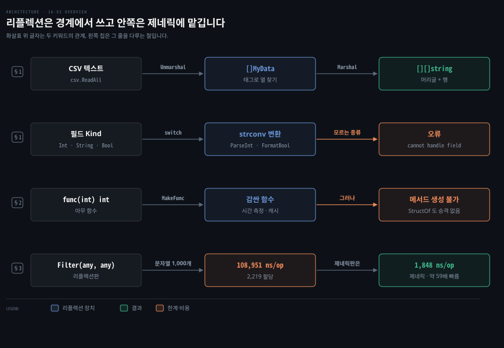
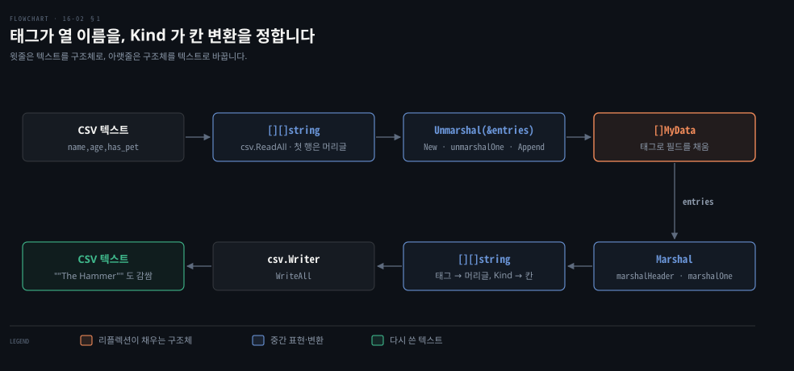
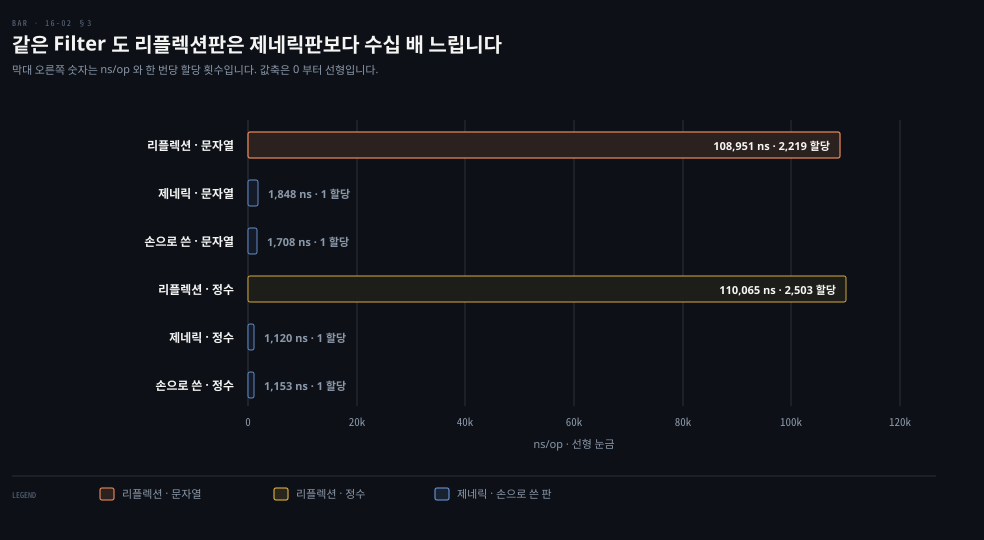

# 리플렉션은 데이터 경계에서만 쓰고 제네릭으로 되는 일은 제네릭에 맡깁니다

---

> Learning Go 16장의 둘째 부분입니다. 리플렉션으로 CSV 마샬러와 실행 중에 만드는 함수·구조체 타입을 보고, 메서드는 만들지 못한다는 한계와 제네릭보다 수십 배 느리다는 비용을 잽니다.

## 핵심 요약

> 이 편이 매달린 하나의 생각은 리플렉션이 모르는 타입의 데이터를 바깥과 주고받는 경계에서 빛나고, 그 밖에서는 느리고 약한 코드를 남긴다는 것입니다.

CSV 마샬러는 구조체 태그로 열 이름을 읽은 뒤 필드의 `Kind` 를 보고 문자열과 값 사이를 바꿉니다. `reflect.MakeFunc` 는 어떤 함수든 감싸는 새 함수를 만들고 `reflect.StructOf` 는 실행 중에 구조체 타입을 만듭니다. 그러나 리플렉션으로 메서드를 더할 수는 없어서 인터페이스를 구현하는 새 타입도 만들 수 없습니다.

리플렉션으로 짠 `Filter` 는 이 노트의 go1.27.1 에서 제네릭판보다 문자열은 약 59배, 정수는 약 98배 느렸고 호출마다 2천 번 넘게 할당했습니다. 제네릭으로 되는 일은 제네릭으로 합니다.


## 학습 목표

> 이 편을 읽고 나면 아래 다섯 가지를 스스로 해낼 수 있습니다.

1. 구조체 태그와 `Kind` 로 slice 의 구조체를 문자열 표로, 표를 구조체로 바꾸는 마샬러의 흐름을 설명할 수 있습니다.
2. `Unmarshal` 이 slice 의 포인터를 받아야 하는 이유와 `reflect.New`·`reflect.Append`·`Set` 이 하는 일을 말할 수 있습니다.
3. `reflect.MakeFunc` 로 함수를 감싸는 코드를 쓰고 그 비용을 감수할 만한 경우를 가릴 수 있습니다.
4. `reflect.StructOf` 의 쓰임과, 리플렉션이 메서드를 만들 수 없어서 생기는 한계를 짚을 수 있습니다.
5. 리플렉션·제네릭·손으로 쓴 `Filter` 의 성능과 안전성을 견줘 무엇을 고를지 판단할 수 있습니다.

아래는 이 편의 키워드를 이은 개념도입니다. CSV 마샬러의 두 방향이 위 두 줄을 차지합니다. 셋째 줄은 실행 중에 함수와 구조체를 만드는 흐름, 넷째 줄은 리플렉션과 제네릭의 비용을 견준 결과입니다. 왼쪽 칩이 그 줄을 다루는 절입니다.




## 1. 구조체 태그와 Kind 로 CSV 마샬러를 만듭니다

> 표준 라이브러리의 `encoding/csv` 는 CSV 를 문자열 slice 의 slice 로 읽고 쓸 뿐 구조체 필드에 옮겨 주지는 못합니다. 구조체 타입을 미리 알 수 없는 범용 마샬러는 필드를 실행 중에 찾아야 하므로 리플렉션이 필요합니다.

CSV 의 열과 구조체의 필드를 이어 줄 약속이 없으면 마샬러는 어느 열을 어느 필드에 넣을지 알 수 없습니다. 원문의 메모대로 여기 코드는 지원 타입을 줄인 것이고 완전한 코드는 원서 저장소 `sample_code/csv` 에 있습니다. 다른 마샬러처럼 필드를 데이터의 이름에 잇는 구조체 태그를 정합니다.

```go
type MyData struct {
	Name   string `csv:"name"`
	Age    int    `csv:"age"`
	HasPet bool   `csv:"has_pet"`
}
```

공개 API 는 두 함수이고 첫 행은 열 이름을 담은 머리글로 봅니다.

```go
// Unmarshal maps all of the rows of data in a slice of slice of strings
// into a slice of structs.
// The first row is assumed to be the header with the column names.
func Unmarshal(data [][]string, v any) error

// Marshal maps all of the structs in a slice of structs to a slice of slice
// of strings.
// The first row written is the header with the column names.
func Marshal(v any) ([][]string, error)
```

### Marshal 은 태그로 머리글을, Kind 로 각 칸을 만듭니다

`Marshal` 은 어떤 구조체의 slice 든 받으므로 매개변수가 `any` 입니다. 읽기만 하니 slice 의 포인터가 아니라 slice 를 받습니다.

```go
func Marshal(v any) ([][]string, error) {
	sliceVal := reflect.ValueOf(v)
	if sliceVal.Kind() != reflect.Slice {
		return nil, errors.New("must be a slice of structs")
	}
	structType := sliceVal.Type().Elem()
	if structType.Kind() != reflect.Struct {
		return nil, errors.New("must be a slice of structs")
	}
	var out [][]string
	header := marshalHeader(structType)
	out = append(out, header)
	for i := 0; i < sliceVal.Len(); i++ {
		row, err := marshalOne(sliceVal.Index(i))
		if err != nil {
			return nil, err
		}
		out = append(out, row)
	}
	return out, nil
}
```

`Type().Elem()` 으로 slice 원소의 타입을 얻어 `marshalHeader` 에 넘기고 원소마다 `marshalOne` 을 부릅니다. `marshalHeader` 는 필드를 돌며 `csv` 태그를 모읍니다.

```go
func marshalHeader(vt reflect.Type) []string {
	var row []string
	for i := 0; i < vt.NumField(); i++ {
		field := vt.Field(i)
		if curTag, ok := field.Tag.Lookup("csv"); ok {
			row = append(row, curTag)
		}
	}
	return row
}
```

`marshalOne` 은 필드마다 `Kind` 로 갈라 문자열로 바꿉니다. 모르는 종류면 오류를 돌려줍니다.

```go
func marshalOne(vv reflect.Value) ([]string, error) {
	var row []string
	vt := vv.Type()
	for i := 0; i < vv.NumField(); i++ {
		fieldVal := vv.Field(i)
		if _, ok := vt.Field(i).Tag.Lookup("csv"); !ok {
			continue
		}
		switch fieldVal.Kind() {
		case reflect.Int:
			row = append(row, strconv.FormatInt(fieldVal.Int(), 10))
		case reflect.String:
			row = append(row, fieldVal.String())
		case reflect.Bool:
			row = append(row, strconv.FormatBool(fieldVal.Bool()))
		default:
			return nil, fmt.Errorf("cannot handle field of kind %v",
				fieldVal.Kind())
		}
	}
	return row, nil
}
```

### Unmarshal 은 slice 의 포인터를 받아 새 구조체를 붙여 넣습니다

`Unmarshal` 은 넘겨받은 slice 를 바꾸므로 slice 의 포인터를 받아야 합니다(16-01 §2). 포인터인지, 가리키는 것이 slice 인지, 원소가 구조체인지 차례로 확인합니다. 그다음 머리글로 열 이름과 위치를 잇는 map 을 만들고 나머지 행마다 새 구조체 값을 채워 slice 에 붙입니다.

```go
func Unmarshal(data [][]string, v any) error {
	sliceValPointer := reflect.ValueOf(v)
	if sliceValPointer.Kind() != reflect.Pointer {
		return errors.New("must be a pointer to a slice of structs")
	}
	sliceVal := sliceValPointer.Elem()
	if sliceVal.Kind() != reflect.Slice {
		return errors.New("must be a pointer to a slice of structs")
	}
	structType := sliceVal.Type().Elem()
	if structType.Kind() != reflect.Struct {
		return errors.New("must be a pointer to a slice of structs")
	}
	// assume the first row is a header
	header := data[0]
	namePos := make(map[string]int, len(header))
	for i, name := range header {
		namePos[name] = i
	}
	for _, row := range data[1:] {
		newVal := reflect.New(structType).Elem()
		err := unmarshalOne(row, namePos, newVal)
		if err != nil {
			return err
		}
		sliceVal.Set(reflect.Append(sliceVal, newVal))
	}
	return nil
}
```

`reflect.New(structType).Elem()` 이 새 구조체 값을 만들고 `reflect.Append` 가 붙인 slice 를 `Set` 으로 원래 slice 에 되씁니다. `unmarshalOne` 은 필드마다 `csv` 태그로 열 위치를 찾아 문자열을 알맞은 타입으로 바꿔 넣습니다.

```go
func unmarshalOne(row []string, namePos map[string]int, vv reflect.Value) error {
	vt := vv.Type()
	for i := 0; i < vv.NumField(); i++ {
		typeField := vt.Field(i)
		pos, ok := namePos[typeField.Tag.Get("csv")]
		if !ok {
			continue
		}
		val := row[pos]
		field := vv.Field(i)
		switch field.Kind() {
		case reflect.Int:
			i, err := strconv.ParseInt(val, 10, 64)
			if err != nil {
				return err
			}
			field.SetInt(i)
		case reflect.String:
			field.SetString(val)
		case reflect.Bool:
			b, err := strconv.ParseBool(val)
			if err != nil {
				return err
			}
			field.SetBool(b)
		default:
			return fmt.Errorf("cannot handle field of kind %v",
				field.Kind())
		}
	}
	return nil
}
```

아래 도식은 두 방향을 한 장에 놓았습니다. CSV 텍스트가 구조체 slice 가 되는 길이 위에, 되돌아가는 길이 아래에 있습니다.



### 표준 라이브러리의 csv 와 잇습니다

마샬러를 `csv.NewReader`·`csv.NewWriter` 와 이으면 CSV 텍스트와 구조체 사이를 오갑니다. 원서 저장소판 `sample_code/csv` 는 `MyData` 의 필드 순서가 `Name`·`HasPet`·`Age` 라서 머리글도 그 순서로 나옵니다. 이 노트의 go1.27.1 출력입니다. 따옴표가 든 `"Fred ""The Hammer"" Smith"` 도 `csv` 패키지가 풀고 다시 감쌌습니다.

```bash
go run .
[{Jon true 100} {Fred "The Hammer" Smith false 42} {Martha true 37}]
name,has_pet,age
Jon,true,100
"Fred ""The Hammer"" Smith",false,42
Martha,true,37
```

원문의 예제는 `Unmarshal(allData, &entries)` 가 돌려준 오류를 버립니다. 짧게 보이려고 줄인 것이지만 실제 코드라면 확인해야 합니다. 이 지적은 노트의 것입니다.


## 2. 리플렉션으로 함수와 구조체는 만들 수 있지만 메서드는 만들 수 없습니다

> 여러 함수에 시간 측정 같은 공통 기능을 붙이려면 함수마다 같은 감싸기 코드를 써야 합니다. 리플렉션은 어떤 시그니처의 함수든 받아 같은 시그니처의 새 함수를 만들 수 있어서 이 반복을 없앱니다.

### MakeFunc 는 어떤 함수든 감싸는 새 함수를 만듭니다

원문은 넘겨받은 함수에 시간 측정을 더하는 팩토리 함수를 보여 줍니다.

```go
func MakeTimedFunction(f any) any {
	ft := reflect.TypeOf(f)
	fv := reflect.ValueOf(f)
	wrapperF := reflect.MakeFunc(ft, func(in []reflect.Value) []reflect.Value {
		start := time.Now()
		out := fv.Call(in)
		end := time.Now()
		fmt.Println(end.Sub(start))
		return out
	})
	return wrapperF.Interface()
}
```

`reflect.MakeFunc` 에 함수의 `reflect.Type` 과 클로저를 넘깁니다. 클로저는 시작 시각을 잡고 원래 함수를 리플렉션으로 부른 뒤 걸린 시간을 찍고 결과를 돌려줍니다. 돌려받은 `reflect.Value` 에 `Interface` 를 불러 반환하고 쓰는 쪽은 `MakeTimedFunction(timeMe).(func(int) int)` 처럼 타입 단언으로 원래 타입을 되찾습니다.

원서 저장소판은 함수 이름까지 찍습니다. 이 노트의 go1.27.1 에서 `calling main.timeMe took 1.000267875s`, `calling main.timeMeToo took 2.001089333s` 가 나왔습니다.

원문은 함수를 만들어 내는 기법이 영리하지만 조심하라고 말합니다. 생성된 함수를 쓰고 있다는 것과 무엇을 더하는지가 분명하지 않으면 데이터 흐름을 따라가기 어려워집니다. 게다가 리플렉션은 느리므로 감싼 코드가 네트워크 호출처럼 원래 느린 경우가 아니면 성능이 크게 떨어집니다. 원문은 이 규칙을 따르는 예로 저자의 SQL 매핑 라이브러리 Proteus 를 듭니다. SQL 쿼리와 함수 필드로 타입 안전한 데이터베이스 API 를 생성합니다.

### StructOf 는 실행 중에 구조체 타입을 만듭니다

`reflect.StructOf` 는 `reflect.StructField` 의 slice 를 받아 새 구조체 타입의 `reflect.Type` 을 돌려줍니다. 원문은 이 구조체를 `any` 변수에만 담을 수 있고 필드도 리플렉션으로만 읽고 쓸 수 있어서 대부분 학문적 흥미거리라고 말합니다.

원서 저장소의 `memoizer` 가 쓰임을 보여 줍니다. 감쌀 함수의 입력 매개변수들로 구조체 타입을 만들고 그 값을 결과 캐시 map 의 키로 씁니다. 구조체 필드가 모두 비교 가능해야 map 키가 되므로 매개변수가 비교 가능한지 먼저 확인합니다. 이 노트의 go1.27.1 에서 100ms 걸리는 `AddSlowly(1, 2)` 를 다섯 번 부르니 첫 호출만 약 101ms 였습니다. 나머지는 수 µs 였고 캐시가 2초 뒤 만료된 다음 호출은 다시 약 101ms 였습니다.

원문 밖 보충입니다. 저장소의 `Memoizer` 는 `func Memoizer[T any](f T, expiration time.Duration) (T, error)` 로 선언돼 있습니다. 감싼 함수를 원래 타입 `T` 로 돌려주므로 쓰는 쪽에 `MakeTimedFunction` 같은 타입 단언이 필요 없습니다. 안쪽은 리플렉션, 바깥 API 는 제네릭으로 짠 모양입니다(08-01 §3).

### 메서드는 만들 수 없어서 인터페이스를 구현하는 타입도 만들 수 없습니다

리플렉션으로 새 함수와 새 구조체 타입은 만들 수 있지만 타입에 메서드를 더할 방법은 없습니다. 그래서 리플렉션으로 인터페이스를 구현하는 새 타입을 만들 수 없습니다. go1.27.1 의 `go doc reflect.StructOf` 도 "임베딩한 필드의 승격 메서드를 지원하지 않는다" 고 밝힙니다.


## 3. 리플렉션은 제네릭보다 수십 배 느리고 잘못된 타입을 실행 중에야 알립니다

> 리플렉션은 경계에서 데이터를 바꿀 때는 꼭 필요하지만 그 밖에서는 공짜가 아닙니다. 원문은 08-01 §3 에서 제네릭으로 짠 `Filter` 를 리플렉션으로 다시 짜서 비용을 잽니다.

```go
func Filter(slice any, filter any) any {
	sv := reflect.ValueOf(slice)
	fv := reflect.ValueOf(filter)
	sliceLen := sv.Len()
	out := reflect.MakeSlice(sv.Type(), 0, sliceLen)
	for i := 0; i < sliceLen; i++ {
		curVal := sv.Index(i)
		values := fv.Call([]reflect.Value{curVal})
		if values[0].Bool() {
			out = reflect.Append(out, curVal)
		}
	}
	return out.Interface()
}
```

리플렉션판은 결과를 `any` 로 돌려주므로 쓰는 쪽이 타입 단언으로 되돌려야 합니다. 타입이 틀렸는지는 실행해 보기 전에 알 수 없습니다. 원문 예제의 출력은 `[Andrew Clara Hortense]`, `[20 50]` 입니다.

```go
names := []string{"Andrew", "Bob", "Clara", "Hortense"}
longNames := Filter(names, func(s string) bool {
	return len(s) > 3
}).([]string)
```

### 이 노트의 go1.27.1 에서 리플렉션판은 약 59배와 98배 느렸습니다

원문은 Go 1.20, Apple M1(16GB)에서 원소 1,000개인 문자열·정수 slice 를 걸렀습니다. 이 노트는 같은 저장소 벤치마크를 go1.27.1, Apple M3 에서 돌렸습니다. 아래 표는 구현마다 원문과 이 노트의 한 번당 나노초를 나란히 놓았습니다. 마지막 열의 한 번당 할당 횟수는 두 환경 모두 같게 나왔습니다.

| 구현 | 원문 ns/op | 이 노트 ns/op | 할당 횟수 |
|---|---|---|---|
| 리플렉션 · 문자열 | 203,962 | 108,951 | 2,219 |
| 제네릭 · 문자열 | 3,920 | 1,848 | 1 |
| 손으로 쓴 · 문자열 | 3,885 | 1,708 | 1 |
| 리플렉션 · 정수 | 204,530 | 110,065 | 2,503 |
| 제네릭 · 정수 | 2,698 | 1,120 | 1 |
| 손으로 쓴 · 정수 | 2,677 | 1,153 | 1 |

원문은 리플렉션이 문자열에서 50배 넘게, 정수에서 약 75배 느리다고 말합니다. 이 노트에서는 제네릭판 대비 문자열 약 59배, 정수 약 98배였습니다. 절대 시간은 기계가 빨라져 줄었지만 차이는 오히려 벌어졌습니다. 리플렉션판은 수천 번 할당해 가비지 컬렉터에 일을 더 줍니다. 제네릭판은 손으로 쓴 함수와 같은 성능을 내면서 타입마다 따로 쓸 필요가 없습니다.



### 더 큰 문제는 컴파일러가 잘못된 타입을 막지 못한다는 것입니다

원문은 성능보다 안전성을 더 큰 단점으로 꼽습니다. 리플렉션판은 `slice` 와 `filter` 에 틀린 타입을 넘겨도 컴파일러가 막지 못합니다. 몇천 나노초는 참을 수 있어도 틀린 타입이 들어오면 운영 중에 프로그램이 죽고 그 유지보수 비용은 받아들이기 어려울 수 있습니다.

그래도 제네릭으로 쓸 수 없는 일이 있습니다. CSV 마샬링과 메모이저는 개수도 타입도 모르는 값을 다뤄야 해서 리플렉션이 필요합니다. 원문의 결론은 리플렉션이 꼭 필요한지 확인한 뒤에 쓰라는 것입니다. Spring 에 견주면 이 경계는 Jackson·JPA 가 애노테이션과 리플렉션으로 객체를 채우는 자리이고 업무 코드는 그 결과를 제네릭 타입으로 받는 모양과 같습니다. 이 비교는 원문 밖입니다.


## 연습 문제 1 — 리플렉션으로 문자열 길이 검증기를 만듭니다

> 원문 연습 문제 1은 구조체의 문자열 필드 가운데 `minStrlen` 태그가 붙은 필드의 길이를 검사하는 `ValidateStringLength` 입니다. 태그 값보다 짧은 필드를 모두 모아 `errors.Join` 으로 돌려주고, 구조체가 아니면 오류를 돌려줍니다.

원서 저장소 `exercise_solutions/ex1` 의 풀이는 종류가 구조체인지 확인하고 필드를 돌며 문자열이고 태그가 있는 필드만 검사합니다.

```go
func ValidateStringLength(toCheck any) error {
	t := reflect.TypeOf(toCheck)
	if t.Kind() != reflect.Struct {
		return ErrNotStruct
	}
	var foundErrors []error
	v := reflect.ValueOf(toCheck)
	for i := 0; i < t.NumField(); i++ {
		curField := t.Field(i)
		if curField.Type.Kind() != reflect.String {
			continue
		}
		tagVal, ok := curField.Tag.Lookup("minStrlen")
		if !ok {
			continue
		}
		minStrlen, err := strconv.Atoi(tagVal)
		if err != nil {
			foundErrors = append(foundErrors, err)
			continue
		}
		fieldLen := len(v.Field(i).String())
		if fieldLen < minStrlen {
			foundErrors = append(foundErrors,
				fmt.Errorf("length of field %s was %d; expected at least %d",
					curField.Name, fieldLen, minStrlen))
		}
	}
	return errors.Join(foundErrors...)
}
```

이 노트의 go1.27.1 에서 `FirstName: "Jake"`(태그 5), `LastName: "Doe"`(태그 6)인 값을 넣으니 두 줄의 오류가 합쳐져 나왔습니다. 태그가 없는 `MiddleName` 과 정수 `Age` 는 건너뛰었습니다.

```bash
go run .
length of field FirstName was 4; expected at least 5
length of field LastName was 3; expected at least 6
```

원문 밖 보충입니다. 풀이는 `len` 으로 바이트 수를 셉니다. 이 노트에서 `len("한글")` 은 6, `len([]rune("한글"))` 은 2였습니다. 한글 이름을 검사한다면 `utf8.RuneCountInString` 으로 글자 수를 세야 뜻대로 동작합니다. 또 풀이는 구조체의 포인터를 넘기면 `ErrNotStruct` 를 돌려줍니다. 포인터도 받으려면 `Kind` 가 `Pointer` 일 때 `Elem` 으로 한 번 내려가면 됩니다. 두 지적은 노트의 것입니다.


## 핵심 개념 체크리스트

목표 번호 순서대로 짝지었습니다.

- [ ] (목표 1) `marshalOne` 이 필드를 문자열로 바꿀 때 무엇을 보고 변환 방법을 고릅니까?
- [ ] (목표 2) `Unmarshal` 에 slice 를 그대로 넘기면 어떤 오류가 나고, 새 행을 slice 에 붙이는 두 호출은 무엇입니까?
- [ ] (목표 3) `MakeTimedFunction` 이 돌려준 값을 원래 함수 타입으로 쓰려면 무엇을 해야 하고, 저장소의 `Memoizer` 는 그 단계를 어떻게 없앴습니까?
- [ ] (목표 4) 리플렉션으로 `io.Reader` 를 구현하는 새 타입을 만들 수 없는 이유는 무엇입니까?
- [ ] (목표 5) 리플렉션판 `Filter` 가 제네릭판보다 느린 것 말고 더 위험한 점은 무엇입니까?


## 관련 문서

- [16-01 리플렉션은 실행 중에 타입과 값을 다루고 Kind 에 맞지 않는 메서드는 패닉을 냅니다](./16-01.%EB%A6%AC%ED%94%8C%EB%A0%89%EC%85%98%EC%9D%80%20%EC%8B%A4%ED%96%89%20%EC%A4%91%EC%97%90%20%ED%83%80%EC%9E%85%EA%B3%BC%20%EA%B0%92%EC%9D%84%20%EB%8B%A4%EB%A3%A8%EA%B3%A0%20Kind%20%EC%97%90%20%EB%A7%9E%EC%A7%80%20%EC%95%8A%EB%8A%94%20%EB%A9%94%EC%84%9C%EB%93%9C%EB%8A%94%20%ED%8C%A8%EB%8B%89%EC%9D%84%20%EB%83%85%EB%8B%88%EB%8B%A4.md) — 16장 앞. 타입·종류·값
- [16-03 unsafe 는 메모리 배치를 드러내 바이트와 구조체를 곧바로 바꾸고 checkptr 이 오용을 잡습니다](./16-03.unsafe%20%EB%8A%94%20%EB%A9%94%EB%AA%A8%EB%A6%AC%20%EB%B0%B0%EC%B9%98%EB%A5%BC%20%EB%93%9C%EB%9F%AC%EB%82%B4%20%EB%B0%94%EC%9D%B4%ED%8A%B8%EC%99%80%20%EA%B5%AC%EC%A1%B0%EC%B2%B4%EB%A5%BC%20%EA%B3%A7%EB%B0%94%EB%A1%9C%20%EB%B0%94%EA%BE%B8%EA%B3%A0%20checkptr%20%EC%9D%B4%20%EC%98%A4%EC%9A%A9%EC%9D%84%20%EC%9E%A1%EC%8A%B5%EB%8B%88%EB%8B%A4.md) — 16장 다음. unsafe
- [08-01 제네릭은 타입 매개변수로 한 번 쓰고 컴파일 시점에 타입을 검사합니다](./08-01.%EC%A0%9C%EB%84%A4%EB%A6%AD%EC%9D%80%20%ED%83%80%EC%9E%85%20%EB%A7%A4%EA%B0%9C%EB%B3%80%EC%88%98%EB%A1%9C%20%ED%95%9C%20%EB%B2%88%20%EC%93%B0%EA%B3%A0%20%EC%BB%B4%ED%8C%8C%EC%9D%BC%20%EC%8B%9C%EC%A0%90%EC%97%90%20%ED%83%80%EC%9E%85%EC%9D%84%20%EA%B2%80%EC%82%AC%ED%95%A9%EB%8B%88%EB%8B%A4.md) — 8장. 제네릭 Filter
- [15-03 퍼징은 시드를 비틀어 놓친 입력을 찾고 벤치마크는 b.Loop 로 한 번의 비용을 잽니다](./15-03.%ED%8D%BC%EC%A7%95%EC%9D%80%20%EC%8B%9C%EB%93%9C%EB%A5%BC%20%EB%B9%84%ED%8B%80%EC%96%B4%20%EB%86%93%EC%B9%9C%20%EC%9E%85%EB%A0%A5%EC%9D%84%20%EC%B0%BE%EA%B3%A0%20%EB%B2%A4%EC%B9%98%EB%A7%88%ED%81%AC%EB%8A%94%20b.Loop%20%EB%A1%9C%20%ED%95%9C%20%EB%B2%88%EC%9D%98%20%EB%B9%84%EC%9A%A9%EC%9D%84%20%EC%9E%BD%EB%8B%88%EB%8B%A4.md) — 15장. 벤치마크 읽기
- [Learning Go 2판 — 정독 인덱스](./README.md) — 16장 전체 지도


## 참고 자료

- 원본: 《Learning Go, 2nd Edition》 (Jon Bodner, O'Reilly)
- 다룬 범위: Chapter 16 "Use Reflection to Write a Data Marshaler" ~ "Use Reflection Only if It's Worthwhile", 연습 문제 1
- 원서 예제 저장소: [learning-go-book-2e/ch16](https://github.com/learning-go-book-2e/ch16)
- [reflect 패키지](https://pkg.go.dev/reflect) — MakeFunc·StructOf·Append
- [encoding/csv](https://pkg.go.dev/encoding/csv)
