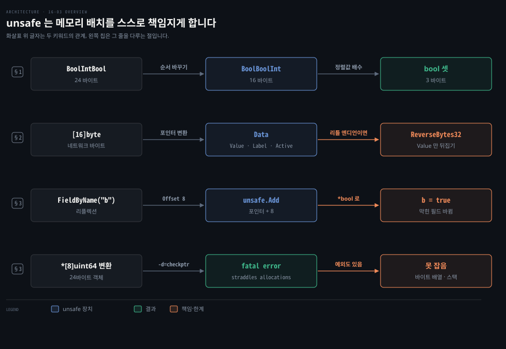
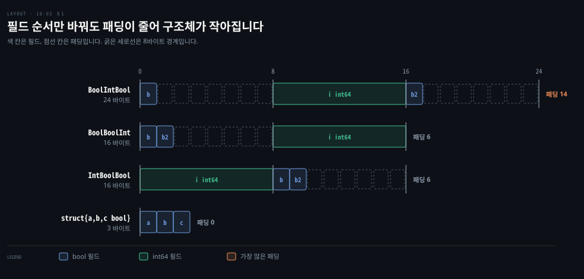
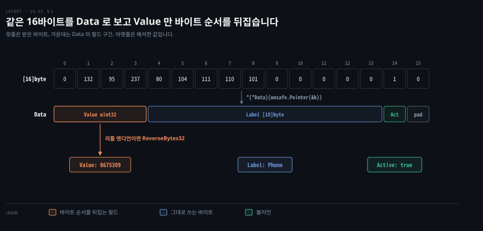
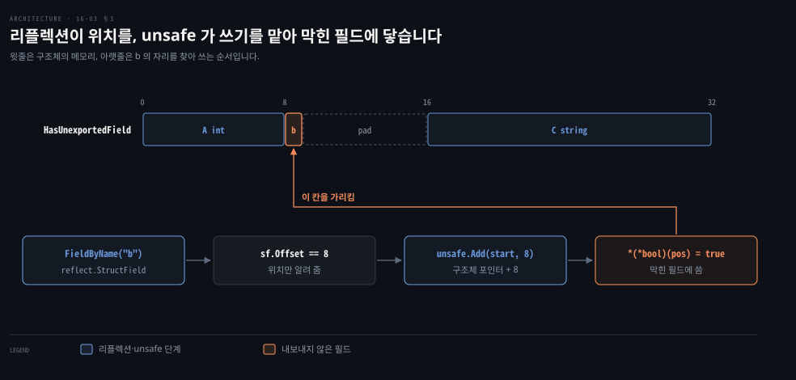

# unsafe 는 메모리 배치를 드러내 바이트와 구조체를 곧바로 바꾸고 checkptr 이 오용을 잡습니다

---

> Learning Go 16장의 셋째 부분으로, `reflect` 가 타입과 값을 다룬다면 `unsafe` 는 메모리를 다룹니다. 필드 순서가 구조체 크기를 바꾸는 까닭, 바이트를 구조체로 곧바로 바꾸는 법, 내보내지 않은 필드에 닿는 법과 오용을 잡는 checkptr 을 봅니다.

## 핵심 요약

> 이 편이 매달린 하나의 생각은 `unsafe` 가 타입 시스템을 건너뛰는 대신 메모리 배치와 바이트 순서를 전부 스스로 책임지게 한다는 것입니다.

`unsafe.Sizeof`·`Offsetof` 는 값의 크기와 필드 위치를 컴파일할 때 알려 줍니다. 컴파일러는 필드마다 정렬 패딩을 넣으므로 필드 순서만 바꿔도 구조체가 작아질 수 있습니다. `unsafe.Pointer` 는 어떤 포인터로든 바뀌므로 바이트 배열을 구조체로 곧바로 읽을 수 있습니다. 다만 네트워크 바이트 순서와 CPU 바이트 순서가 다르면 직접 뒤집어야 합니다.

리플렉션으로 얻은 필드 오프셋과 `unsafe.Add` 를 합치면 다른 패키지의 내보내지 않은 필드도 바꿀 수 있습니다. `-gcflags=-d=checkptr` 나 `-race` 는 실행 중에 일부 오용을 잡지만 모두 잡지는 못합니다.


## 학습 목표

> 이 편을 읽고 나면 아래 다섯 가지를 스스로 해낼 수 있습니다.

1. `unsafe` 를 쓰는 두 가지 동기와 흔한 두 가지 사용 모양을 말할 수 있습니다.
2. slice·문자열·map·배열·구조체의 `Sizeof` 를 설명하고, 필드 순서가 구조체 크기를 바꾸는 이유를 정렬로 설명할 수 있습니다.
3. 바이트 배열을 `unsafe.Pointer` 로 구조체로 바꾸고, 바이트 순서를 맞출 수 있습니다.
4. 안전한 변환과 `unsafe` 변환의 성능 차이를 읽고, `unsafe` 를 쓸 만한 경우를 판단할 수 있습니다.
5. 리플렉션과 `unsafe` 로 내보내지 않은 필드에 닿는 법과 checkptr 이 잡는 것·못 잡는 것을 말할 수 있습니다.

아래는 이 편의 키워드를 이은 개념도입니다. 첫 줄은 구조체 크기를 재고 줄이는 흐름입니다. 둘째 줄은 바이트를 구조체로 바꾸는 흐름이고, 셋째 줄은 내보내지 않은 필드에 닿는 흐름입니다. 넷째 줄은 오용을 실행 중에 잡는 흐름입니다. 왼쪽 칩이 그 줄을 다루는 절입니다.




## 1. unsafe 는 바깥의 바이너리 데이터를 다루려고 존재하고 Sizeof·Offsetof 가 배치를 알려 줍니다

> 메모리 안전을 중시하는 Go 에도 운영체제·네트워크와 바이너리 데이터를 주고받으려면 `unsafe` 가 필요합니다. 바이트를 옮기려면 데이터의 크기와 위치를 알아야 하므로 `Sizeof`·`Offsetof` 부터 봅니다.

`unsafe` 패키지는 작고 이상합니다. 함수 몇 개와 타입 하나를 두는데, 다른 패키지의 함수·타입처럼 동작하지 않습니다. 원문은 Diego Elias Costa 등이 2020년에 쓴 논문 "Breaking Type-Safety in Go" 를 인용합니다. 인기 있는 Go 오픈 소스 프로젝트 2,438개를 조사한 결과는 이렇습니다.

- 조사한 프로젝트의 24% 가 코드베이스에서 `unsafe` 를 적어도 한 번 씁니다.
- 대부분은 운영체제·C 코드와 잇기 위해 씁니다.
- 더 효율적인 코드를 쓰려고 쓰는 경우도 잦습니다.

가장 많은 쓰임은 시스템과의 상호 운용입니다. 표준 라이브러리도 `syscall` 패키지나 더 높은 수준의 `sys` 패키지에서 운영체제와 데이터를 주고받을 때 `unsafe` 를 씁니다. 원문은 이 쓰임을 다룬 Matt Layher 의 글을 권합니다.

### unsafe.Pointer 는 어떤 포인터와도 오가고 uintptr 로 산술을 합니다

`unsafe.Pointer` 는 한 가지 목적만을 위한 타입입니다. 어떤 타입의 포인터든 `unsafe.Pointer` 로, 또 그 반대로 바꿀 수 있습니다. `uintptr` 이라는 특별한 정수 타입과도 오갈 수 있어서 C·C++ 처럼 포인터 산술을 할 수 있습니다.

원문은 `unsafe` 코드의 흔한 모양을 둘로 나눕니다. 하나는 보통은 바꿀 수 없는 두 타입 사이를 `unsafe.Pointer` 를 사이에 둔 연속 변환으로 바꾸는 것입니다. 다른 하나에서는 변수를 `unsafe.Pointer` 로, 그것을 다시 포인터로 바꾼 뒤 바탕 바이트를 복사하거나 고칩니다. 둘 다 데이터의 크기와 위치를 알아야 합니다.

### Sizeof 는 참조 타입의 머리 크기만 셉니다

`Sizeof` 는 넘긴 값의 크기를 바이트로 돌려줍니다. 수 타입은 뻔해서 `int16` 은 2바이트, `byte` 는 1바이트입니다. 포인터는 가리키는 데이터가 아니라 포인터를 담는 크기이고 64비트 시스템에서는 대개 8바이트입니다.

그래서 slice 는 무엇을 담든 64비트에서 24바이트입니다. 길이와 용량 두 `int` 와 데이터 포인터로 이뤄졌기 때문입니다(06-02 §3). 문자열은 길이 `int` 와 내용 포인터라 16바이트이고 map 은 런타임 안의 복잡한 자료구조를 가리키는 포인터라 8바이트입니다. 배열은 값 타입이라 길이와 원소 크기를 곱한 크기입니다.

### 컴파일러는 정렬을 맞추려고 필드 사이와 끝에 패딩을 넣습니다

구조체의 크기는 필드 크기의 합에 정렬 조정을 더한 것입니다. 컴퓨터는 일정한 크기의 덩어리로 읽고 쓰기를 좋아하고 값 하나가 두 덩어리에 걸치는 것은 싫어합니다. 그래서 컴파일러는 필드가 제자리에 오도록 필드 사이에 패딩을 넣고 구조체 전체의 정렬을 맞추려고 끝에도 패딩을 넣습니다. `Offsetof` 는 필드가 구조체 안 몇 바이트째에 있는지 알려 줍니다.

```go
type BoolInt struct {
	b bool
	i int64
}

type IntBool struct {
	i int64
	b bool
}

fmt.Println(unsafe.Sizeof(BoolInt{}),
	unsafe.Offsetof(BoolInt{}.b),
	unsafe.Offsetof(BoolInt{}.i))
fmt.Println(unsafe.Sizeof(IntBool{}),
	unsafe.Offsetof(IntBool{}.i),
	unsafe.Offsetof(IntBool{}.b))
```

둘 다 `16 0 8` 입니다. `bool` 이 앞이면 `b` 와 `i` 사이에 7바이트 패딩이 들어갑니다. `int64` 가 앞이면 `b` 뒤에 7바이트 패딩이 들어가 크기가 8의 배수가 됩니다. 필드가 셋이면 순서가 크기를 바꿉니다.

```go
type BoolIntBool struct {
	b  bool
	i  int64
	b2 bool
}

type BoolBoolInt struct {
	b  bool
	b2 bool
	i  int64
}

type IntBoolBool struct {
	i  int64
	b  bool
	b2 bool
}
```

이 노트의 go1.27.1 에서도 원문과 같이 `24 0 8 16`, `16 0 1 8`, `16 0 8 9` 가 나왔습니다. `int64` 가 두 `bool` 사이에 있으면 `bool` 마다 8바이트로 채워져 24바이트가 되고 `bool` 둘을 모으면 16바이트입니다. 아래 도식은 세 구조체의 바이트 배치를 8바이트 칸 위에 그렸습니다.



> **원문 정오**: 원문은 "64비트 시스템에서는 구조체 크기가 8바이트의 배수가 되도록 끝에 패딩을 넣는다" 고 일반화했습니다. 실제로는 구조체의 크기가 필드 가운데 가장 큰 정렬값의 배수가 됩니다. 이 노트의 go1.27.1 에서 `struct{ a, b, c bool }` 은 3바이트였습니다. `struct{ i int32; b bool }` 은 8바이트였는데, 8의 배수여서가 아니라 정렬값 4의 배수여서입니다(`Alignof` 4). 원문의 예들은 `int64` 가 있거나 `Data` 처럼 크기가 8의 배수로 떨어져서 두 규칙이 같은 답을 냈습니다. 책 16개 장 PDF 에서 이 문구는 이 장에만 나옵니다.

원문은 이 정보가 대개 학문적 흥미거리지만 두 경우에 쓸모 있다고 말합니다. 많은 데이터를 다루는 프로그램에서는 자주 쓰는 구조체의 필드 순서만 바꿔 메모리를 크게 아낄 수 있습니다. 그리고 바이트 열을 구조체로 곧바로 옮길 때 배치를 알아야 합니다.

### 연습 문제 2 — 필드 순서를 바꿔 OrderInfo 를 줄입니다

원문 연습 문제 2는 원서 저장소 `sample_code/orders` 의 `OrderInfo` 크기와 오프셋을 찍게 합니다. 이어서 같은 필드를 메모리를 가장 적게 쓰는 순서로 바꿔 `SmallOrderInfo` 를 만들게 합니다. 저장소 풀이를 이 노트의 go1.27.1 에서 돌리니 `OrderInfo` 는 56바이트였고 오프셋은 차례로 0·8·16·24·48 이었습니다.

```go
// OrderInfo has a total size of 56 bytes:
type OrderInfo struct {
	OrderCode   rune     // 4 bytes, plus 4 for padding
	Amount      int      // 8 bytes, no padding
	OrderNumber uint16   // 2 bytes, plus 6 for padding
	Items       []string // 24 bytes, no padding
	IsReady     bool     // 1 byte, plus 7 for padding
}

// SmallOrderInfo has a total size of 40 bytes:
type SmallOrderInfo struct {
	IsReady     bool     // 1 byte, plus 1 byte of padding
	OrderNumber uint16   // 2 bytes, no padding
	OrderCode   rune     // 4 bytes, no padding
	Amount      int      // 8 bytes, no padding
	Items       []string // 24 bytes, no padding
}
```

풀이는 작은 필드를 앞으로 모아 패딩을 1바이트로 줄였습니다. 이 노트에서 `unsafe.Sizeof(SmallOrderInfo{})` 는 주석대로 40이었습니다. 큰 정렬값부터 내림차순으로 늘어놓아도 이 노트에서 같은 40바이트였습니다. 핵심은 작은 필드를 한데 모아 8바이트 칸을 채우는 것입니다. 이 풀이는 노트의 것입니다.


## 2. unsafe.Pointer 로 바이트를 구조체로 곧바로 바꾸고 바이트 순서는 직접 맞춥니다

> 네트워크에서 읽은 바이트를 구조체에 옮기려면 필드마다 잘라 해석해야 합니다. 배치가 같다면 `unsafe.Pointer` 로 바이트 배열을 통째로 구조체로 보면 되지만, 그러면 바이트 순서와 패딩을 컴파일러 대신 사람이 맞춰야 합니다.

필드마다 잘라 옮기지 않고 바이트를 통째로 구조체로 옮기고 싶다면 메모리 배치가 정확히 같아야 합니다. 원문은 꾸며 낸 전송 프로토콜을 예로 듭니다. 16바이트에 네 부분이 담깁니다.

- Value: 4바이트, 부호 없는 빅 엔디언 32비트 정수
- Label: 10바이트, 값의 ASCII 이름
- Active: 1바이트, 활성 여부를 나타내는 불리언
- Padding: 1바이트, 전체를 16바이트에 맞추기 위한 것

원문의 메모대로 네트워크 데이터는 보통 빅 엔디언, 곧 가장 큰 자리 바이트부터 보냅니다. 이것을 네트워크 바이트 순서라고 부릅니다. 오늘날 CPU 는 대부분 리틀 엔디언이라 읽고 쓸 때 조심해야 합니다.

메모리 배치가 프로토콜과 같은 구조체를 정의합니다.

```go
type Data struct {
	Value  uint32   // 4 bytes
	Label  [10]byte // 10 bytes
	Active bool     // 1 byte
	// Go pads this with 1 byte to make it align
}

const dataSize = unsafe.Sizeof(Data{}) // sets dataSize to 16
```

원문은 `unsafe.Sizeof`·`Offsetof` 를 `const` 식에 쓸 수 있다는 점을 짚습니다. 데이터 구조의 크기와 배치는 컴파일할 때 정해지므로 결과도 상수식처럼 컴파일 시점에 계산됩니다.

### 안전한 변환과 unsafe 변환

네트워크에서 `[0 132 95 237 80 104 111 110 101 0 0 0 0 0 1 0]` 을 읽었다고 합시다. 안전한 Go 코드로는 필드마다 잘라 옮깁니다.

```go
func DataFromBytes(b [dataSize]byte) Data {
	d := Data{}
	d.Value = binary.BigEndian.Uint32(b[:4])
	copy(d.Label[:], b[4:14])
	d.Active = b[14] != 0
	return d
}
```

`unsafe.Pointer` 를 쓰면 배열의 주소를 `*Data` 로 보고 역참조합니다. `(*Data)` 는 연산 순서 때문에 괄호로 감쌉니다. 리틀 엔디언 기계라면 `Value` 의 바이트를 뒤집습니다.

```go
func DataFromBytesUnsafe(b [dataSize]byte) Data {
	data := *(*Data)(unsafe.Pointer(&b))
	if isLE {
		data.Value = bits.ReverseBytes32(data.Value)
	}
	return data
}
```

원문의 메모는 매개변수를 slice 가 아니라 배열로 받은 이유를 풉니다. 배열은 구조체처럼 값 타입이라 바이트가 그 자리에 있어서 곧바로 구조체로 볼 수 있습니다. slice 는 길이·용량·데이터 포인터 셋이라 그대로 볼 수 없습니다. 이 노트의 go1.27.1 에서 위 바이트는 `{Value:8675309, Label:Phone     , Active: true}` 로 읽혔고 되돌리니 같은 16바이트가 나왔습니다.

아래 도식은 16바이트가 `Data` 의 필드에 어떻게 겹치는지와 리틀 엔디언 기계에서 `Value` 를 뒤집는 자리를 그렸습니다.



### 리틀 엔디언 확인은 init 으로 하고 Go 1.21 부터는 NativeEndian 이 있습니다

원문은 리틀 엔디언인지 `init` 에서 한 번 확인합니다. 10-02 §5 에서 본 대로 `init` 은 피해야 하지만 사실상 바뀌지 않는 패키지 값을 초기화할 때는 괜찮습니다. CPU 의 바이트 순서가 바로 그런 값입니다.

```go
var isLE bool

func init() {
	var x uint16 = 0xFF00
	xb := *(*[2]byte)(unsafe.Pointer(&x))
	isLE = (xb[0] == 0x00)
}
```

리틀 엔디언이면 `x` 는 메모리에 `[00 FF]` 로 놓이고 빅 엔디언이면 `[FF 00]` 으로 놓이므로 첫 바이트로 판단합니다.

원문 밖 보충입니다. Go 1.21 은 `encoding/binary.NativeEndian` 을 더했습니다. 이 노트에서 `binary.NativeEndian.PutUint16(b, 0xFF00)` 은 `[0 255]` 를 써서 같은 판단을 `unsafe` 없이 할 수 있었습니다. 바이트 순서를 모르는 채 네이티브 순서로 읽고 쓰는 일이라면 `unsafe` 도 `init` 도 필요 없습니다.

### slice 는 unsafe.Slice 와 SliceData 로 다룹니다

구조체를 네트워크에 쓸 때도 안전한 코드(`binary.BigEndian.PutUint32` 와 `copy`)와 `unsafe` 코드 둘 다 가능합니다. 바이트가 slice 에 있으면 Go 1.17 의 `unsafe.Slice` 와 Go 1.20 의 `unsafe.SliceData` 를 씁니다.

```go
func BytesFromDataUnsafeSlice(d Data) []byte {
	if isLE {
		d.Value = bits.ReverseBytes32(d.Value)
	}
	bs := unsafe.Slice((*byte)(unsafe.Pointer(&d)), dataSize)
	return bs
}

func DataFromBytesUnsafeSlice(b []byte) Data {
	data := *(*Data)((unsafe.Pointer)(unsafe.SliceData(b)))
	if isLE {
		data.Value = bits.ReverseBytes32(data.Value)
	}
	return data
}
```

`unsafe.Slice` 의 첫 인자는 두 번 바꿉니다. `Data` 의 포인터를 `unsafe.Pointer` 로, 그것을 slice 원소 타입의 포인터 `*byte` 로 바꿉니다. 둘째 인자는 길이입니다. `unsafe.SliceData` 는 slice 를 받아 원소 타입의 포인터, 여기서는 `*byte` 를 돌려줍니다. `unsafe.Pointer` 를 다리로 삼아 `*byte` 를 `*Data` 로 바꿉니다.

### unsafe 변환은 약 2배 빠르고 구조체를 slice 로 돌려줄 때만 할당합니다

원문은 Apple M1 에서 잰 값을 보입니다. 이 노트는 같은 벤치마크를 go1.27.1, Apple M3 에서 돌렸습니다. 아래 표의 첫 열은 함수, 이어서 원문과 이 노트의 한 번당 나노초와 한 번당 할당 횟수입니다.

| 함수 | 원문 ns/op | 이 노트 ns/op | 할당 |
|---|---|---|---|
| BytesFromData | 2.185 | 1.430 | 0 |
| BytesFromDataUnsafe | 0.8418 | 0.7513 | 0 |
| BytesFromDataUnsafeSlice | 13.14 | 5.842 | 1 (16 B) |
| DataFromBytes | 2.186 | 1.428 | 0 |
| DataFromBytesUnsafe | 1.160 | 0.9973 | 0 |
| DataFromBytesUnsafeSlice | 0.9617 | 0.8572 | 0 |

원문은 두 가지를 짚습니다. 구조체를 slice 로 바꾸는 쪽이 가장 느리고 유일하게 할당합니다. 돌려준 slice 가 함수의 지역 변수 `d` 를 가리키므로 `d` 가 힙으로 탈출하기 때문입니다(06-03 §1). slice 를 구조체로 바꾸는 쪽은 아주 빠릅니다.

원문은 배열로 다루면 `unsafe` 가 약 2~2.5배 빠르다고 말합니다. 원문 표의 값으로 셈하면 1.9~2.6배이고, 이 노트에서는 약 1.4~1.9배였습니다. 원문은 이런 변환이 아주 많거나 크고 복잡한 구조를 옮길 때가 아니면 안전한 코드를 쓰라고 결론짓습니다.


## 3. 리플렉션과 unsafe 로 내보내지 않은 필드에 닿고 checkptr 로 오용을 찾습니다

> 다른 패키지의 내보내지 않은 필드는 컴파일러가 막아 읽을 수도 쓸 수도 없습니다. 리플렉션이 위치를, `unsafe` 가 쓰기를 맡으면 막힌 필드에 닿지만 원문은 이것을 최후의 수단으로만 쓰라고 말합니다.

한 패키지에 내보내지 않은 필드가 있는 구조체를 정의합니다.

```go
type HasUnexportedField struct {
	A int
	b bool
	C string
}
```

다른 패키지에서는 `b` 에 닿을 수 없고 `unsafe.Offsetof(huf.b)` 도 컴파일되지 않습니다. 그러나 `reflect.Type` 의 `FieldByName` 은 내보내지 않은 필드의 `reflect.StructField` 도 돌려주고, 여기에 오프셋이 들어 있습니다.

```go
func SetBUnsafe(huf *one_package.HasUnexportedField) {
	sf, _ := reflect.TypeOf(huf).Elem().FieldByName("b")
	offset := sf.Offset
	start := unsafe.Pointer(huf)
	pos := unsafe.Add(start, offset)
	b := (*bool)(pos)
	fmt.Println(*b) // read the value
	*b = true       // write the value
}
```

`huf` 를 `unsafe.Pointer` 로 바꾸고 `unsafe.Add` 로 오프셋을 더해 `b` 의 자리를 찾은 뒤 `*bool` 로 바꿉니다. 이 노트의 go1.27.1 에서 원서 저장소판을 돌리니 구조체 크기 32, `A` 오프셋 0, `C` 오프셋 16, `b` 오프셋 8 이 찍혔습니다. 값은 `{10 false hello}` 에서 `{10 true hello}` 로 바뀌었습니다.



### checkptr 은 실행 중에 일부 오용을 잡습니다

원문은 Go 가 도구를 중시하는 언어라며 `-gcflags=-d=checkptr` 로 실행 중 검사를 더하라고 권합니다. 레이스 검출기처럼 모든 문제를 찾는다는 보장은 없고 프로그램을 느리게 합니다. 그래도 테스트할 때 쓰기 좋은 습관입니다. 원문의 경고대로 무엇을 하는지 알고 성능 향상이 꼭 필요할 때가 아니면 `unsafe` 를 피합니다.

원문 밖 보충입니다. 이 노트에서 24바이트 객체의 포인터를 `*[8]uint64`(64바이트)로 바꾸는 코드를 돌렸습니다. 플래그 없이는 조용히 돌았습니다. `-gcflags=all=-d=checkptr` 와 `-race` 에서는 둘 다 `fatal error: checkptr: converted pointer straddles multiple allocations` 로 멈췄습니다. go1.27.1 소스(`cmd/compile/internal/base/flag.go`)의 주석대로 `-race`·`-msan`·`-asan` 은 checkptr 을 함께 켭니다.

못 잡는 경우도 확인했습니다.

같은 변환을 `*[64]byte` 로 하면 잡지 않았습니다. 컴파일러가 정렬이 1인 원소로 보는 변환은 검사를 넣지 않기 때문입니다(`ssagen/ssa.go` 의 `checkPtrAlignment`).

정렬이 맞지 않는 주소를 `*uint64` 로 바꾸는 것도 잡지 않았습니다. `runtime/checkptr.go` 는 가리키는 타입에 포인터가 있을 때만 정렬을 검사합니다. 스택에 둔 24바이트 배열을 `*[8]uint64` 로 보는 변환도 조용히 지나갔습니다. `checkptrBase` 가 스택 전체를 가짜 주소 하나로 보고 스택 객체끼리는 가르지 않기 때문입니다. checkptr 이 조용하다고 안전한 코드는 아닙니다. 이 판단은 노트의 것입니다.


## 핵심 개념 체크리스트

목표 번호 순서대로 짝지었습니다.

- [ ] (목표 1) 원문이 인용한 조사에서 `unsafe` 를 쓰는 가장 큰 이유는 무엇이고, `unsafe` 코드의 흔한 두 모양은 무엇입니까?
- [ ] (목표 2) `BoolIntBool` 이 24바이트이고 `BoolBoolInt` 가 16바이트인 이유와, `struct{ a, b, c bool }` 의 크기를 말할 수 있습니까?
- [ ] (목표 3) `DataFromBytesUnsafe` 가 배열을 받는 이유와 리틀 엔디언 기계에서 `Value` 에 해야 하는 일은 무엇입니까?
- [ ] (목표 4) `BytesFromDataUnsafeSlice` 만 할당이 1회 생기는 이유는 무엇입니까?
- [ ] (목표 5) 내보내지 않은 필드 `b` 에 쓰려면 무엇에서 오프셋을 얻고, checkptr 이 잡지 못하는 경우를 하나 들 수 있습니까?


## 관련 문서

- [16-02 리플렉션은 데이터 경계에서만 쓰고 제네릭으로 되는 일은 제네릭에 맡깁니다](./16-02.%EB%A6%AC%ED%94%8C%EB%A0%89%EC%85%98%EC%9D%80%20%EB%8D%B0%EC%9D%B4%ED%84%B0%20%EA%B2%BD%EA%B3%84%EC%97%90%EC%84%9C%EB%A7%8C%20%EC%93%B0%EA%B3%A0%20%EC%A0%9C%EB%84%A4%EB%A6%AD%EC%9C%BC%EB%A1%9C%20%EB%90%98%EB%8A%94%20%EC%9D%BC%EC%9D%80%20%EC%A0%9C%EB%84%A4%EB%A6%AD%EC%97%90%20%EB%A7%A1%EA%B9%81%EB%8B%88%EB%8B%A4.md) — 16장 앞. 리플렉션 활용과 비용
- [16-04 cgo 는 C 라이브러리를 잇는 다리이지 성능을 얻는 도구가 아닙니다](./16-04.cgo%20%EB%8A%94%20C%20%EB%9D%BC%EC%9D%B4%EB%B8%8C%EB%9F%AC%EB%A6%AC%EB%A5%BC%20%EC%9E%87%EB%8A%94%20%EB%8B%A4%EB%A6%AC%EC%9D%B4%EC%A7%80%20%EC%84%B1%EB%8A%A5%EC%9D%84%20%EC%96%BB%EB%8A%94%20%EB%8F%84%EA%B5%AC%EA%B0%80%20%EC%95%84%EB%8B%99%EB%8B%88%EB%8B%A4.md) — 16장 끝. cgo 와 책 맺음
- [06-02 포인터 매개변수는 바꿔도 된다는 표시이고 slice 는 길이까지 복사됩니다](./06-02.%ED%8F%AC%EC%9D%B8%ED%84%B0%20%EB%A7%A4%EA%B0%9C%EB%B3%80%EC%88%98%EB%8A%94%20%EB%B0%94%EA%BF%94%EB%8F%84%20%EB%90%9C%EB%8B%A4%EB%8A%94%20%ED%91%9C%EC%8B%9C%EC%9D%B4%EA%B3%A0%20slice%20%EB%8A%94%20%EA%B8%B8%EC%9D%B4%EA%B9%8C%EC%A7%80%20%EB%B3%B5%EC%82%AC%EB%90%A9%EB%8B%88%EB%8B%A4.md) — 6장. slice 의 세 필드
- [10-02 패키지는 대문자로 내보내고 이름으로 기능을 말하며 internal 로 감춥니다](./10-02.%ED%8C%A8%ED%82%A4%EC%A7%80%EB%8A%94%20%EB%8C%80%EB%AC%B8%EC%9E%90%EB%A1%9C%20%EB%82%B4%EB%B3%B4%EB%82%B4%EA%B3%A0%20%EC%9D%B4%EB%A6%84%EC%9C%BC%EB%A1%9C%20%EA%B8%B0%EB%8A%A5%EC%9D%84%20%EB%A7%90%ED%95%98%EB%A9%B0%20internal%20%EB%A1%9C%20%EA%B0%90%EC%B6%A5%EB%8B%88%EB%8B%A4.md) — 10장. 내보내기와 init
- [15-04 의존성은 인터페이스 스텁으로 바꾸고 httptest 와 빌드 태그와 -race 로 경계와 동시성을 시험합니다](./15-04.%EC%9D%98%EC%A1%B4%EC%84%B1%EC%9D%80%20%EC%9D%B8%ED%84%B0%ED%8E%98%EC%9D%B4%EC%8A%A4%20%EC%8A%A4%ED%85%81%EC%9C%BC%EB%A1%9C%20%EB%B0%94%EA%BE%B8%EA%B3%A0%20httptest%20%EC%99%80%20%EB%B9%8C%EB%93%9C%20%ED%83%9C%EA%B7%B8%EC%99%80%20-race%20%EB%A1%9C%20%EA%B2%BD%EA%B3%84%EC%99%80%20%EB%8F%99%EC%8B%9C%EC%84%B1%EC%9D%84%20%EC%8B%9C%ED%97%98%ED%95%A9%EB%8B%88%EB%8B%A4.md) — 15장. -race
- [Learning Go 2판 — 정독 인덱스](./README.md) — 16장 전체 지도


## 참고 자료

- 원본: 《Learning Go, 2nd Edition》 (Jon Bodner, O'Reilly)
- 다룬 범위: Chapter 16 "unsafe Is Unsafe" ~ "Using unsafe Tools", 연습 문제 2
- 원서 예제 저장소: [learning-go-book-2e/ch16](https://github.com/learning-go-book-2e/ch16)
- [unsafe 패키지](https://pkg.go.dev/unsafe) — Pointer 변환 규칙·Sizeof·Offsetof·Add·Slice·SliceData
- [encoding/binary](https://pkg.go.dev/encoding/binary) — BigEndian·NativeEndian
- Diego Elias Costa et al., "Breaking Type-Safety in Go: An Empirical Study on the Usage of the unsafe Package" (2020) — 원문이 인용한 조사
