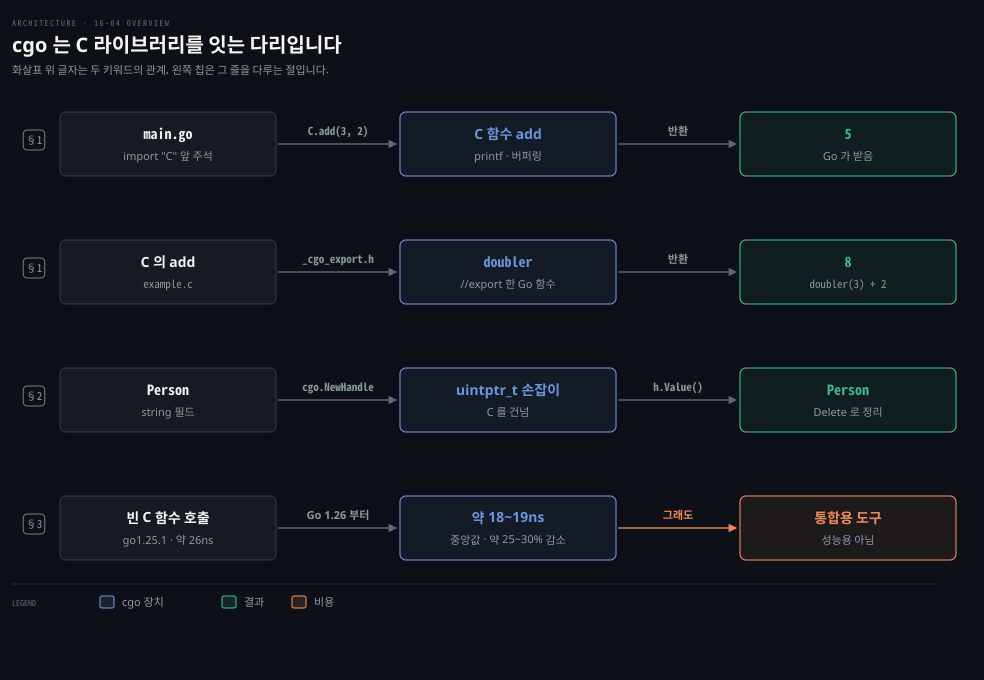
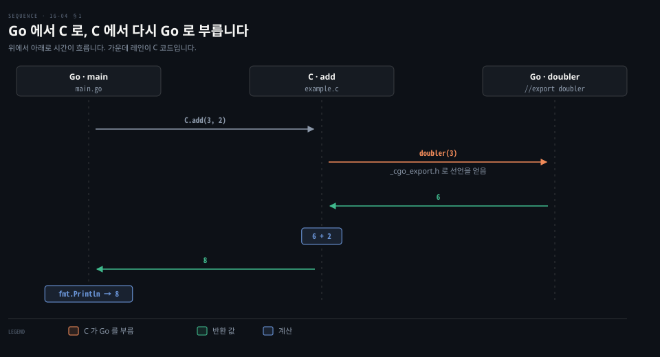
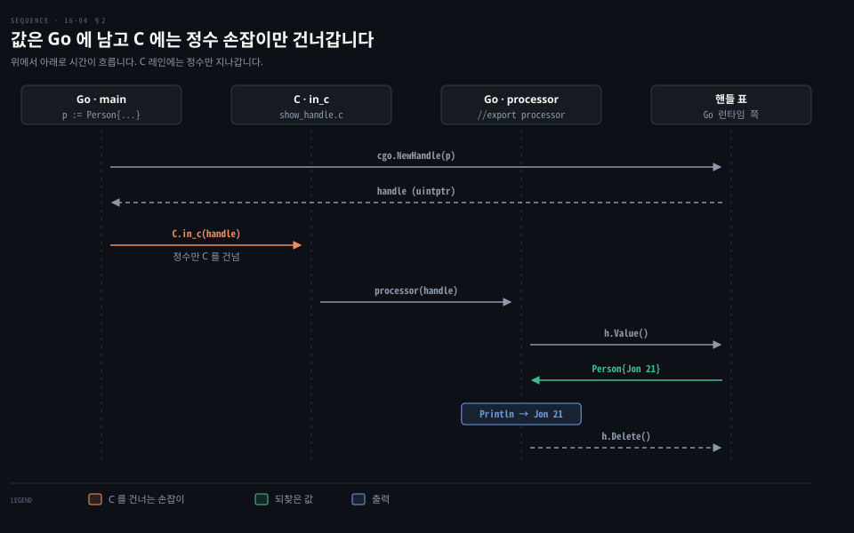
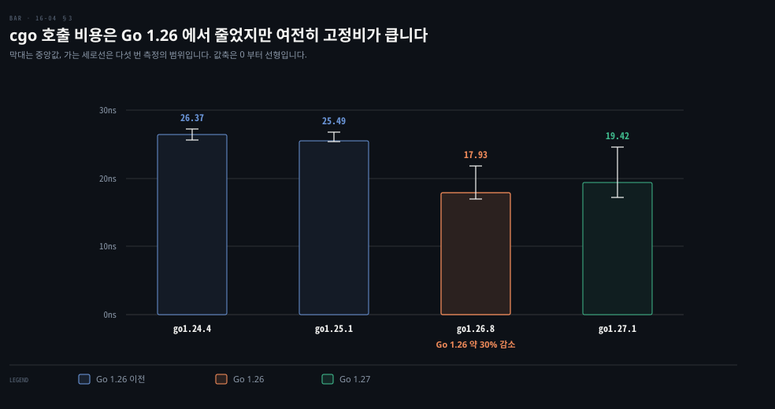

# cgo 는 C 라이브러리를 잇는 다리이지 성능을 얻는 도구가 아닙니다

---

> Learning Go 16장 끝이자 책의 마지막 편으로, Go 와 C 가 서로를 부르는 cgo 의 기본과 포인터 규칙·제한, cgo 가 빠르지 않은 까닭을 다룹니다. 연습 문제를 풀고 책의 맺음말로 마칩니다.

## 핵심 요약

> 이 편이 매달린 하나의 생각은 cgo 가 대신할 Go 코드가 없는 C 라이브러리를 쓰기 위한 통로이고, 빠르게 하려고 C 로 내려가는 길이 아니라는 것입니다.

`import "C"` 바로 위 주석에 C 코드를 쓰거나 헤더를 포함하면 그 이름이 `C.` 로 Go 코드에 드러납니다. Go 함수는 `//export` 로 C 에 내보냅니다. Go 는 가비지 컬렉션을 하고 C 는 하지 않아서, 포인터를 품은 값은 C 에 그대로 넘길 수 없습니다. 이럴 때는 `cgo.Handle` 로 감싸 정수로 넘깁니다.

cgo 호출에는 고정 비용이 있습니다. 이 노트의 맥에서 빈 C 함수 한 번 부르기가 다섯 번 측정의 중앙값으로 go1.25.1 에서 약 26ns, Go 1.26 부터 약 18~19ns 였습니다. 그래서 cgo 는 꼭 써야 하는 C 라이브러리가 있고 Go 로 된 대체가 없을 때만 씁니다.


## 학습 목표

> 이 편을 읽고 나면 아래 다섯 가지를 스스로 해낼 수 있습니다.

1. `import "C"` 앞 주석의 C 코드·헤더가 Go 에 어떻게 드러나는지 설명하고 C 함수를 부를 수 있습니다.
2. `//export` 로 Go 함수를 C 에 내보낼 때 생기는 제약과 `_cgo_export.h` 의 역할을 말할 수 있습니다.
3. Go 와 C 사이의 포인터 규칙을 말하고, 포인터를 품은 값을 `cgo.Handle` 로 넘길 수 있습니다.
4. cgo 로 할 수 없는 일 셋과, cgo 가 성능 도구가 아닌 이유를 수치로 말할 수 있습니다.
5. cgo 를 쓰기 전에 무엇을 먼저 찾아볼지 판단할 수 있습니다.

아래는 이 편의 키워드를 이은 개념도입니다. 첫 줄은 Go 에서 C 를 부르는 흐름이고, 둘째 줄은 C 에서 Go 를 부르는 흐름입니다. 셋째 줄은 포인터를 품은 값을 넘기는 흐름입니다. 넷째 줄은 cgo 호출의 비용입니다. 왼쪽 칩이 그 줄을 다루는 절입니다.




## 1. import "C" 앞 주석의 C 코드가 C 가상 패키지가 됩니다

> 운영체제와 수많은 라이브러리가 C 로 쓰여 있어서, 그 기능을 Go 로 다시 쓸 수 없다면 C 를 불러야 합니다. 거의 모든 언어가 C 라이브러리와 잇는 외부 함수 인터페이스(FFI)를 두고, Go 에서는 그것을 cgo 라고 부릅니다.

운영체제와 많은 라이브러리는 C 로 쓰여 있고, 그 기능을 전부 Go 로 다시 쓸 수는 없습니다. 원문은 reflect 와 unsafe 처럼 cgo 도 Go 프로그램과 바깥 세계의 경계에서 가장 쓸모 있다고 말합니다. 리플렉션은 바깥의 텍스트 데이터와, `unsafe` 는 운영체제·네트워크 데이터와, cgo 는 C 라이브러리와 잇습니다. 50년 가까이 된 C 는 여전히 프로그래밍 언어의 공용어입니다. 명시를 좋아하는 Go 개발자는 다른 언어의 자동 동작을 "마법" 이라 놀리곤 하는데, cgo 는 조금 마법처럼 느껴진다고 원문은 덧붙입니다.

### 주석 속 C 함수와 헤더의 함수가 모두 C. 으로 불립니다

원서 저장소 `sample_code/call_c_from_go` 의 `main.go` 입니다.

```go
package main

import "fmt"

/*
#cgo LDFLAGS: -lm
#include <stdio.h>
#include <math.h>
#include "mylib.h"

int add(int a, int b) {
    int sum = a + b;
    printf("a: %d, b: %d, sum %d\n", a, b, sum);
    return sum;
}
*/
import "C"

func main() {
	sum := C.add(3, 2)
	fmt.Println(sum)
	fmt.Println(C.sqrt(100))
	fmt.Println(C.multiply(10, 20))
}
```

같은 디렉터리의 `mylib.h` 는 `int multiply(int a, int b);` 를 선언하고, `mylib.c` 가 그것을 구현합니다. C 컴파일러가 있으면 `go build` 로 끝납니다.

표준 라이브러리에 `C` 라는 진짜 패키지는 없습니다. `C` 는 바로 앞 주석의 C 코드에서 이름을 얻어 자동으로 생기는 가상 패키지입니다. 주석에 선언한 `add` 는 `C.add` 로, 헤더로 들여온 `math.h` 의 `sqrt` 와 `mylib.h` 의 `multiply` 도 `C.sqrt`·`C.multiply` 로 부릅니다. 이 밖에도 C 기본 타입을 나타내는 `C.int`·`C.char` 같은 타입과, Go 문자열을 C 문자열로 바꾸는 `C.CString` 같은 함수가 있습니다.

### C 의 printf 는 출력이 파이프면 프로그램이 끝날 때 찍힙니다

원문 밖 보충입니다. 원문 출력은 C 의 `printf` 줄 `a: 3, b: 2, sum 5` 가 맨 먼저 나옵니다. 이 노트의 go1.27.1 에서 터미널에서 돌리니 원문과 같았습니다. 출력을 파이프로 받으니 `5`, `10`, `200` 뒤에 `printf` 줄이 맨 끝에 찍혔습니다.

```bash
./call_c_from_go | cat
5
10
200
a: 3, b: 2, sum 5
```

C 의 표준 출력은 터미널이면 줄 단위로, 파이프나 파일이면 블록 단위로 버퍼링됩니다. 그래서 파이프로 받으면 C 쪽 출력이 버퍼에 머물렀다가 프로그램이 끝날 때 한꺼번에 나옵니다. Go 의 `fmt.Println` 은 버퍼 없이 바로 쓰므로 두 언어의 출력 순서가 뒤바뀝니다. 로그를 파일로 모을 때 순서가 섞여 보이면 이것을 의심할 만합니다. 이 풀이는 노트의 것입니다.

### //export 로 Go 함수를 C 에 내보냅니다

C 에서 Go 함수를 부르려면 함수 앞에 `//export` 주석을 답니다. 원서 저장소 `sample_code/call_go_from_c` 는 `doubler` 를 내보냅니다.

```go
//export doubler
func doubler(i int) int {
	return i * 2
}
```

Go 함수를 내보내면 `import "C"` 앞 주석에 C 코드를 바로 쓸 수 없고 함수 선언만 둘 수 있습니다. go1.27.1 의 cgo 문서도 이 경우 주석이 두 C 출력 파일에 복사되므로 정의 없이 선언만 담아야 한다고 밝힙니다.

```go
/*
	extern int add(int a, int b);
*/
import "C"
```

C 코드는 같은 디렉터리의 `.c` 파일에 두고, cgo 가 만드는 헤더 `_cgo_export.h` 를 포함하면 내보낸 Go 함수를 부를 수 있습니다.

```c
#include "_cgo_export.h"

int add(int a, int b) {
    int doubleA = doubler(a);
    int sum = doubleA + b;
    return sum;
}
```

`main` 이 `C.add(3, 2)` 를 부르면 C 의 `add` 가 Go 의 `doubler(3)` 을 불러 6 을 얻고 2 를 더해, 이 노트에서도 `8` 이 찍혔습니다. 아래 도식은 두 방향의 호출을 한 장에 그렸습니다.



> **원문 정오**: 원문 본문은 C 코드가 포함할 헤더를 "cgo_export.h" 라고 적었지만, 바로 아래 예제 코드와 원서 저장소는 `_cgo_export.h` 를 씁니다. 밑줄 없는 이름으로는 헤더를 찾지 못합니다. 책 16개 장 PDF 에서 밑줄 없는 "cgo_export.h" 는 이 한 곳에만 나옵니다.


## 2. Go 포인터는 C 에 붙잡혀 둘 수 없어서 포인터를 품은 값은 Handle 로 넘깁니다

> 가비지 컬렉션을 하지 않는 C 가 Go 메모리를 가리키는 포인터를 쥔 사이에 가비지 컬렉터가 그 메모리를 옮기거나 거두면 C 는 엉뚱한 곳을 읽게 됩니다. 그래서 cgo 에는 C 로 넘길 수 있는 포인터에 규칙이 있습니다.

원문은 규칙을 둘로 요약합니다. 포인터 하나는 C 로 넘길 수 있지만 포인터를 품은 값은 곧바로 넘길 수 없습니다. 문자열·slice·함수는 모두 포인터로 구현되므로 이런 필드가 든 구조체도 넘길 수 없습니다. 또 C 함수는 함수가 끝난 뒤까지 Go 포인터의 사본을 보관할 수 없습니다. 원문은 규칙을 어기면 컴파일되고 돌아가다가, 가리키던 메모리가 수거된 뒤 실행 중에 깨지거나 잘못 동작할 수 있다고 경고합니다.

### 기본으로 켜진 cgocheck 가 넘기는 순간의 위반은 잡습니다

원문 밖 보충입니다. 이 노트에서 `Name string` 필드가 있는 구조체의 포인터를 `unsafe.Pointer` 로 C 에 넘겼습니다. 이름을 `strings.Repeat` 로 힙에 만들자 기본 설정에서 곧바로 `runtime error: argument of cgo function has Go pointer to unpinned Go pointer` 패닉이 났습니다. `GODEBUG=cgocheck=0` 으로 검사를 끄자 조용히 넘어갔습니다.

이름을 문자열 리터럴 `"Jon"` 으로 두었을 때는 기본 설정에서도 통과했습니다. 리터럴은 가비지 컬렉터가 관리하는 힙이 아니라 읽기 전용 데이터에 놓여서 검사 대상이 아니었습니다. 넘기는 순간의 위반은 이렇게 실행 중에 드러나지만, C 가 포인터를 보관했다가 나중에 쓰는 위반은 이 검사로 잡히지 않습니다. 원문의 경고는 그쪽을 두고 한 말로 읽는 것이 맞습니다. 이 판단은 노트의 것입니다.

### cgo.Handle 은 값을 정수 손잡이로 바꿔 C 를 거쳐 되돌려 받게 합니다

포인터를 품은 값을 Go 에서 C 로, 다시 Go 로 넘겨야 하면 `cgo.Handle` 로 감쌉니다. 원서 저장소 `sample_code/handle` 입니다.

```go
package main

/*
#include <stdint.h>
extern void in_c(uintptr_t handle);
*/
import "C"

import (
	"fmt"
	"runtime/cgo"
)

type Person struct {
	Name string
	Age  int
}

func main() {
	p := Person{
		Name: "Jon",
		Age:  21,
	}
	C.in_c(C.uintptr_t(cgo.NewHandle(p)))
}

//export processor
func processor(handle C.uintptr_t) {
	h := cgo.Handle(handle)
	p := h.Value().(Person)
	fmt.Println(p.Name, p.Age)
	h.Delete()
}
```

C 쪽은 받은 손잡이를 그대로 Go 의 `processor` 에 돌려줍니다.

```c
#include <stdint.h>
#include "_cgo_export.h"

void in_c(uintptr_t handle) {
    processor(handle);
}
```

`Person` 에는 포인터를 품은 `string` 필드가 있어 C 로 그대로 넘길 수 없습니다. `cgo.NewHandle(p)` 는 `p` 를 Go 쪽에 보관하고 정수 손잡이를 돌려줍니다. 이것을 Go 의 `uintptr` 에 해당하는 C 타입 `C.uintptr_t` 로 바꿔 `in_c` 에 넘깁니다. `processor` 는 손잡이를 `cgo.Handle` 로 되돌리고 `Value` 와 타입 단언으로 `Person` 을 꺼낸 뒤, 다 쓰면 `Delete` 로 지웁니다. 이 노트의 go1.27.1 에서 `Jon 21` 이 찍혔습니다.



> **원문 정오**: 원문 본문은 `in_c` 가 부르는 Go 함수를 "process" 라고 적었지만, 코드와 원서 저장소의 함수 이름은 `processor` 입니다. 같은 문단의 앞 문장도 `processor` 라고 적었습니다. 책 16개 장 PDF 에서 "Go function process" 는 이 한 곳에만 나옵니다.

원문 밖 보충입니다. Go 1.21 은 `runtime.Pinner` 를 더했습니다. 문서는 C 에 명시적으로 넘기지 않은 Go 포인터, 예컨대 C 로 넘긴 구조체 안의 포인터를 C 가 안전하게 쓰게 해 준다고 설명합니다. 또 cgo 호출이 끝난 뒤에도 C 메모리가 그 포인터를 쥐고 있게 해 준다고 적습니다. 위 패닉 메시지의 "unpinned" 가 이 기능을 가리킵니다. 값을 통째로 Go 에 두고 싶으면 `cgo.Handle`, 메모리를 C 와 나눠 쓰고 싶으면 `Pinner` 를 고려합니다.

### cgo 로는 가변 인자 함수와 C 함수 포인터를 부를 수 없습니다

원문은 제한을 셋 더 듭니다. `printf` 같은 가변 인자 C 함수는 cgo 로 부를 수 없습니다. C 의 union 타입은 바이트 배열로 바뀝니다. C 함수 포인터는 부를 수 없지만 Go 변수에 담아 C 함수에 다시 넘길 수는 있습니다. go1.27.1 의 cgo 문서도 셋 모두를 같은 뜻으로 적습니다.


## 3. cgo 호출에는 고정 비용이 있어서 성능을 위해 쓰는 도구가 아닙니다

> Python·Ruby 개발자는 성능이 중요한 부분을 C 로 쓰고, NumPy 가 빠른 것도 감싼 C 라이브러리 덕입니다. 그러나 Go 는 이미 그 언어들보다 여러 배 빨라서 C 로 다시 쓸 필요가 적고, cgo 로 빠르게 만들기는 오히려 어렵습니다.

원문은 처리 모델과 메모리 모델이 달라서 Go 에서 C 함수를 부르는 것이 C 에서 C 함수를 부를 때보다 대략 29배 느리다고 말합니다. 2018년 Capital Go 에서 Filippo Valsorda 가 "Why cgo is slow" 라는 발표로 cgo 가 느린 까닭과 앞으로도 크게 빨라지지 않을 까닭을 설명했다고 소개합니다. 녹화는 없고 슬라이드만 남았습니다. Shane Hansen 은 글 "CGO Performance in Go 1.21" 에서 Intel Core i7-12700H 기준 cgo 호출 비용을 약 40ns 로 쟀습니다.

### 이 노트에서 빈 C 함수 호출은 go1.25.1 에서 약 26ns, Go 1.26 부터 약 18~19ns 였습니다

원문 밖 보충입니다. Go 1.26 릴리스 노트는 cgo 호출의 기본 런타임 비용이 약 30% 줄었다고 밝힙니다. 이 노트에서 인자를 그대로 돌려주는 C 함수를 `b.Loop`(15-03 §2)로 다섯 번씩 쟀습니다. 아래 표의 첫 열은 툴체인, 둘째 열은 한 번 호출에 든 나노초의 다섯 번 측정 범위, 셋째 열은 그 중앙값입니다.

| 툴체인 | 측정 범위(ns) | 중앙값(ns) |
|---|---|---|
| go1.24.4 | 25.65 ~ 27.18 | 26.37 |
| go1.25.1 | 25.42 ~ 26.78 | 25.49 |
| go1.26.8 | 16.96 ~ 21.85 | 17.93 |
| go1.27.1 | 17.15 ~ 24.63 | 19.42 |

1.26 에서 중앙값이 25~26ns 에서 18~19ns 로 내려가 약 25~30% 줄었고, 릴리스 노트의 약 30% 와 크게 어긋나지 않았습니다. 1.26·1.27 은 측정마다 흔들림이 컸습니다. 그래도 수 나노초면 끝나는 Go 함수 호출에 비하면 여전히 큰 비용입니다. 작은 일을 잘게 쪼개 C 로 여러 번 부르면 호출 비용이 이득을 삼킵니다.



### cgo 를 쓰기 전에 Go 대체와 기존 래퍼부터 찾습니다

원문의 팁은 이렇습니다. cgo 는 빠르지 않고 복잡한 프로그램에서 쓰기도 어려우니, C 라이브러리를 꼭 써야 하고 알맞은 Go 대체가 없을 때만 씁니다. 직접 짜기 전에 서드파티 모듈이 이미 래퍼를 주는지 봅니다. 원문은 SQLite 를 Go 에 넣을 때와 ImageMagick 을 쓸 때 볼 GitHub 저장소를 예로 듭니다. 래퍼가 없는 사내·서드파티 C 라이브러리라면 Go 문서의 cgo 안내와 Tobias Grieger 의 글 "The Cost and Complexity of Cgo" 를 읽으라고 권합니다.

Spring 쪽에 견주면 cgo 는 JNI 나 Java 22 의 FFM API 와 같은 자리입니다. 네이티브 호출에 고정 비용이 있고 메모리 관리 규칙이 달라서, 성능보다 통합을 위해 쓴다는 결론도 같습니다. 이 비교는 원문 밖입니다.


## 연습 문제 3 — mini_calc 를 cgo 로 부릅니다

> 원문 연습 문제 3은 원서 저장소 `sample_code/mini_calc` 의 C 코드를 자기 모듈에 복사해 cgo 로 부르는 것입니다. `mini_calc(char *op, int a, int b)` 는 연산자 문자열에 따라 사칙연산을 하고, 0으로 나누면 0을 돌려줍니다.

원서 저장소 `exercise_solutions/ex3` 의 풀이는 명령줄 인자 셋을 받아 정수 둘을 바꾸고, 연산자를 `C.CString` 으로 C 문자열로 바꿔 넘깁니다.

```go
/*
   extern int mini_calc(char *op, int a, int b);
*/
import "C"

// main 안
result := C.mini_calc(C.CString(op), C.int(arg1), C.int(arg2))
fmt.Println(result)
```

이 노트의 go1.27.1 에서 `go run . 3 + 2` 는 `5`, `go run . 10 / 0` 은 `0` 이었습니다. 인자가 모자라면 `Need at least 3 args: int op int` 를 찍고 끝났습니다.

원문 밖 보충입니다. 풀이는 `C.CString` 이 만든 문자열을 풀지 않습니다. go1.27.1 의 cgo 문서는 `C.CString` 이 C 힙에 `malloc` 으로 문자열을 만들며 호출한 쪽이 `C.free` 로 풀어야 한다고 적습니다. `C.free` 를 쓰려면 `stdlib.h` 를 포함해야 한다는 말도 덧붙입니다. 한 번 돌고 끝나는 명령줄 도구라 새는 양이 작지만, 서버처럼 오래 도는 코드라면 이렇게 씁니다.

```go
/*
#include <stdlib.h>
extern int mini_calc(char *op, int a, int b);
*/
import "C"
import "unsafe"

// main 안
cop := C.CString(op)
defer C.free(unsafe.Pointer(cop))
result := C.mini_calc(cop, C.int(arg1), C.int(arg2))
```


## 4. 맺음말 — 제대로 쓴 Go 는 지루합니다

> 이 장은 Go 를 지루하고 타입 안전하고 메모리 안전한 언어로 만드는 규칙을 깨는 도구들을 다뤘습니다. 원문은 규칙을 깨고 싶어지는 이유와, 대개는 깨지 말아야 하는 이유를 함께 배웠다고 정리합니다.

원문은 서문의 말로 책을 닫습니다. "제대로 쓴 Go 는 지루하다. 잘 쓴 Go 프로그램은 단순하고 가끔은 조금 반복적이다." 저자는 이제 그것이 왜 더 나은 소프트웨어 공학으로 이어지는지 보이기를 바란다고 말합니다.

관용적인 Go 는 시간이 흐르고 팀이 바뀌어도 소프트웨어를 유지하기 쉽게 하는 도구·관행·패턴의 묶음입니다. 다른 언어의 문화도 유지보수를 중시하지만 우선순위가 가장 높지는 않을 수 있습니다. 성능이나 새 기능이나 간결한 문법을 앞세우기도 합니다. 원문은 그런 거래에도 자리가 있다고 인정하면서, 오래가는 소프트웨어에 집중하는 Go 의 방식이 결국 이길 것이라고 내다봅니다. 그리고 다음 50년의 컴퓨팅을 위한 소프트웨어를 만들 독자에게 행운을 빌며 끝맺습니다.

이 노트 묶음으로 보면 16장의 세 도구는 모두 경계에서 쓰였습니다. 리플렉션은 바깥의 텍스트 데이터와, `unsafe` 는 바이너리 데이터와, cgo 는 C 라이브러리와 잇습니다. 1장부터 쌓은 명시적 오류·작은 인터페이스·context·테스트 관습은 그 경계 안쪽을 지루하고 읽기 쉽게 지키는 장치였습니다. 이 정리는 노트의 것입니다.


## 핵심 개념 체크리스트

목표 번호 순서대로 짝지었습니다.

- [ ] (목표 1) `import "C"` 앞 주석에 선언한 `add` 와 `math.h` 의 `sqrt` 를 Go 에서 각각 어떻게 부릅니까?
- [ ] (목표 2) `//export` 를 쓴 파일의 `import "C"` 앞 주석에는 무엇만 둘 수 있고, C 파일은 어떤 헤더를 포함해야 합니까?
- [ ] (목표 3) `string` 필드가 있는 구조체를 C 를 거쳐 Go 로 되돌려 받으려면 무엇으로 감싸고, 다 쓴 뒤 무엇을 부릅니까?
- [ ] (목표 4) cgo 로 부를 수 없는 C 함수 두 종류와, 이 노트가 잰 Go 1.26 전후의 cgo 호출 비용을 말할 수 있습니까?
- [ ] (목표 5) C 라이브러리를 써야 할 때 cgo 를 직접 짜기 전에 무엇을 먼저 찾아봅니까?


## 관련 문서

- [16-03 unsafe 는 메모리 배치를 드러내 바이트와 구조체를 곧바로 바꾸고 checkptr 이 오용을 잡습니다](./16-03.unsafe%20%EB%8A%94%20%EB%A9%94%EB%AA%A8%EB%A6%AC%20%EB%B0%B0%EC%B9%98%EB%A5%BC%20%EB%93%9C%EB%9F%AC%EB%82%B4%20%EB%B0%94%EC%9D%B4%ED%8A%B8%EC%99%80%20%EA%B5%AC%EC%A1%B0%EC%B2%B4%EB%A5%BC%20%EA%B3%A7%EB%B0%94%EB%A1%9C%20%EB%B0%94%EA%BE%B8%EA%B3%A0%20checkptr%20%EC%9D%B4%20%EC%98%A4%EC%9A%A9%EC%9D%84%20%EC%9E%A1%EC%8A%B5%EB%8B%88%EB%8B%A4.md) — 16장 앞. unsafe
- [16-01 리플렉션은 실행 중에 타입과 값을 다루고 Kind 에 맞지 않는 메서드는 패닉을 냅니다](./16-01.%EB%A6%AC%ED%94%8C%EB%A0%89%EC%85%98%EC%9D%80%20%EC%8B%A4%ED%96%89%20%EC%A4%91%EC%97%90%20%ED%83%80%EC%9E%85%EA%B3%BC%20%EA%B0%92%EC%9D%84%20%EB%8B%A4%EB%A3%A8%EA%B3%A0%20Kind%20%EC%97%90%20%EB%A7%9E%EC%A7%80%20%EC%95%8A%EB%8A%94%20%EB%A9%94%EC%84%9C%EB%93%9C%EB%8A%94%20%ED%8C%A8%EB%8B%89%EC%9D%84%20%EB%83%85%EB%8B%88%EB%8B%A4.md) — 16장 처음. 리플렉션
- [15-03 퍼징은 시드를 비틀어 놓친 입력을 찾고 벤치마크는 b.Loop 로 한 번의 비용을 잽니다](./15-03.%ED%8D%BC%EC%A7%95%EC%9D%80%20%EC%8B%9C%EB%93%9C%EB%A5%BC%20%EB%B9%84%ED%8B%80%EC%96%B4%20%EB%86%93%EC%B9%9C%20%EC%9E%85%EB%A0%A5%EC%9D%84%20%EC%B0%BE%EA%B3%A0%20%EB%B2%A4%EC%B9%98%EB%A7%88%ED%81%AC%EB%8A%94%20b.Loop%20%EB%A1%9C%20%ED%95%9C%20%EB%B2%88%EC%9D%98%20%EB%B9%84%EC%9A%A9%EC%9D%84%20%EC%9E%BD%EB%8B%88%EB%8B%A4.md) — 15장. b.Loop 벤치마크
- [01-01 go 명령 하나로 만들고 다듬고 검사합니다](./01-01.go%20%EB%AA%85%EB%A0%B9%20%ED%95%98%EB%82%98%EB%A1%9C%20%EB%A7%8C%EB%93%A4%EA%B3%A0%20%EB%8B%A4%EB%93%AC%EA%B3%A0%20%EA%B2%80%EC%82%AC%ED%95%A9%EB%8B%88%EB%8B%A4.md) — 1장. 책의 처음
- [Learning Go 2판 — 정독 인덱스](./README.md) — 16장 전체 지도


## 참고 자료

- 원본: 《Learning Go, 2nd Edition》 (Jon Bodner, O'Reilly)
- 다룬 범위: Chapter 16 "Cgo Is for Integration, Not Performance" ~ "Wrapping Up", 연습 문제 3
- 원서 예제 저장소: [learning-go-book-2e/ch16](https://github.com/learning-go-book-2e/ch16)
- [cmd/cgo](https://pkg.go.dev/cmd/cgo) — export·CString·포인터 규칙·제한
- [runtime/cgo.Handle](https://pkg.go.dev/runtime/cgo#Handle) · [runtime.Pinner](https://pkg.go.dev/runtime#Pinner)
- [Go 1.26 릴리스 노트](https://go.dev/doc/go1.26) — cgo 호출 비용 약 30% 감소
