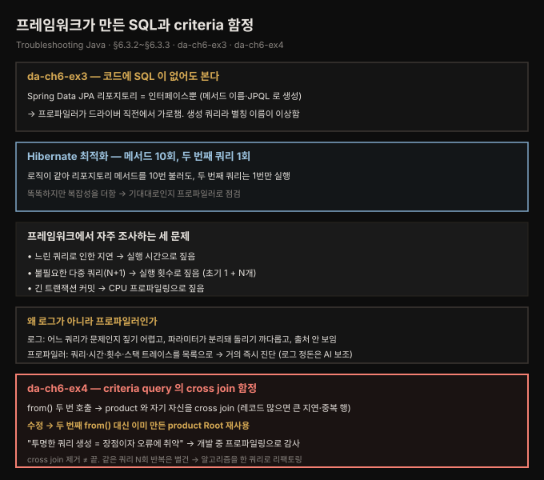
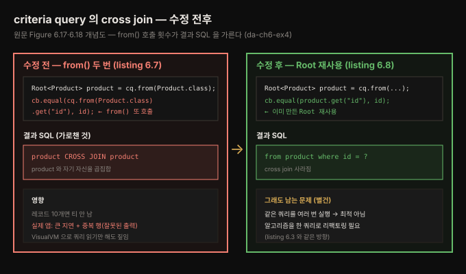

# 프레임워크가 만든 SQL과 criteria 함정
---
> 프레임워크가 무대 뒤에서 SQL을 생성하면 코드에 쿼리가 안 보이지만, 프로파일러는 드라이버 직전에서 그것을 그대로 가로챕니다.
>
> 그래서 Hibernate의 N+1, criteria query의 잘못된 cross join 같은, 코드만 봐서는 안 보이는 함정을 눈으로 잡아낼 수 있습니다

이 편은 한 걸음 더 나아가 *프레임워크가 생성한* 쿼리를 다룹니다. 먼저 Spring Data JPA·Hibernate가 메서드 이름·JPQL로 만든 쿼리를 프로파일러로 끌어내고(§6.3.2), 이어 criteria query가 코드로 만든 쿼리에서 잘못된 cross join을 잡아냅니다(§6.3.3). 핵심 교훈은 같습니다 — 프레임워크가 쿼리를 투명하게 만들수록 오류가 숨기 쉬워지므로, 프로파일러로 *감사(auditing)*하는 습관이 안전장치가 됩니다.





## 1. VisualVM 실습가이드 — 생성 SQL을 먼저 눈으로 본다
> 이 절의 목표는 코드를 먼저 고치는 것이 아니라, VisualVM JDBC 프로파일러에서 Spring Data JPA가 만든 SQL과 criteria query가 만든 cross join을 증거로 확인하는 것입니다

이번 실습은 VisualVM의 **Profiler > JDBC** 화면에서 다음 세 가지 증거를 잡으면 성공입니다:

1. Spring Data JPA 리포지토리에는 SQL 문자열이 없는데도 VisualVM에는 실제 SQL이 보입니다.
2. `/products`를 여러 번 호출하면 `purchase` 조회와 `product` 조회의 실행 횟수가 서로 다르게 누적됩니다.
3. criteria query에서 `from()`을 두 번 쓰면 생성 SQL에 `cross join`이 나타납니다.

### 1.1 실습 순서

VisualVM은 현재 공식 페이지 기준으로 standalone 도구로 배포됩니다. macOS에서는 `.dmg`를 설치하거나 zip을 풀어 실행하면 되고, zip 방식이면 `visualvm/bin/visualvm`을 실행합니다. VisualVM이 다른 JDK를 잡아 실행에 실패하면 다음처럼 JDK 경로를 명시합니다:

```bash
visualvm/bin/visualvm --jdkhome "$JAVA_HOME"
```

로컬 실습 코드는 책 노트의 장 번호와 폴더명이 일부 다릅니다. 생성 SQL 관찰은 `_practice/tsj/da-ch7-ex3`에서 Spring Data JPA 예제로 확인하고, criteria query 흐름은 `_practice/tsj/da-ch7-ex4`에서 확인합니다. 먼저 Spring Data JPA 예제를 실행합니다:

```bash
cd ~/Library/CloudStorage/GoogleDrive-tscofet@gmail.com/내\ 드라이브/study/runners-high/write/01_language/book/Inside the Java Virtual Machine JVM Advanced Features and Best Practices/_practice/tsj/da-ch7-ex3
mvn spring-boot:run
```

앱이 뜨면 VisualVM 왼쪽 **Applications**에서 실행 중인 Spring Boot 프로세스를 선택합니다. **Profiler** 탭으로 이동해 **JDBC** 버튼을 누른 뒤, 별도 터미널에서 엔드포인트를 세 번 호출합니다:

```bash
for i in {1..3}; do curl http://localhost:8080/products; echo; done
```

세 번 호출하는 이유는 횟수 비율을 더 또렷하게 보기 위해서입니다. 한 번만 호출해도 N+1은 보이지만, 세 번 호출하면 `purchase` 쿼리 3회와 `product` 쿼리 30회가 나뉘어 보여 반복 조회 구조가 숫자로 드러납니다.

### 1.2 화면에서 볼 것

VisualVM에서 볼 화면은 **Profiler > JDBC** 하나입니다. 여기서 행을 하나씩 눌러 SQL과 스택을 펼쳐 보면 됩니다.

| 위치 | 보는 값 | 의미 | 통과 기준 |
|------|---------|------|-----------|
| SQL Query 목록 | `select ... from purchase` | 구매 목록을 먼저 가져오는 초기 쿼리 | `/products` 요청당 1회 증가 |
| SQL Query 목록 | `select ... from product ... where id=?` | 구매 레코드의 product id로 제품을 다시 조회하는 쿼리 | `/products` 요청당 10회 증가 |
| Invocations 컬럼 | 쿼리별 호출 횟수 | 코드 호출 횟수가 아니라 DB로 실제 보낸 SQL 횟수 | 3회 호출 시 `purchase` 3, `product` 30 |
| SQL 행 펼침 | Java stack trace | 어느 앱 코드가 이 SQL을 보냈는지 | `PurchaseService.getProductNamesForPurchases()`가 보임 |
| criteria 실습 SQL | `cross join` 또는 `product` 테이블 2회 등장 | `cq.from(Product.class)`를 두 번 부른 결과 | 나쁜 줄로 바꾸면 보이고, 좋은 줄로 되돌리면 사라짐 |

여기서 가장 중요한 값은 **Invocations**입니다. 느린 쿼리 하나를 찾는 실습이 아니라, 프레임워크가 실제 DB에 몇 번 왕복했는지를 세는 실습이기 때문입니다. SQL 행을 펼쳐 스택까지 보면 "이 SQL이 어느 서비스 메서드에서 나왔는가"도 연결됩니다.

`da-ch7-ex3`에서 봐야 할 것은 SQL 텍스트의 예쁜 모양이 아니라 실행 횟수입니다. 로컬 실측에서는 `/products`를 3번 호출했을 때 `purchase` 쿼리는 3회, `product` 쿼리는 30회 실행되었습니다. 호출당 구매 목록 조회 1회와 제품 상세 조회 10회가 나온 셈입니다. 코드에는 `findById()` 호출이 루프 안에 있고, VisualVM의 **Invocations** 값은 그 루프가 실제 DB 왕복으로 번졌는지를 보여 줍니다. 이 차이가 "코드를 읽은 예상"과 "런타임에서 실제로 보낸 SQL"을 구분하는 지점입니다.

### 1.3 실제 문제 코드

VisualVM에서 `product` 쿼리가 30회 보인 원인은 `_practice/tsj/da-ch7-ex3/src/main/java/com/example/services/PurchaseService.java`의 `getProductNamesForPurchases()`입니다. 실제 문제 지점은 27~30행입니다. `purchaseRepository.findAll()`로 구매 목록을 먼저 가져온 뒤, 구매 레코드마다 `productRepository.findById()`를 다시 호출합니다:

```java
public Set<String> getProductNamesForPurchases() {
  Set<String> productNames = new HashSet<>();
  List<Purchase> purchases = purchaseRepository.findAll();     // 요청당 1회: purchase 조회
  for (Purchase p : purchases) {
    Product product = productRepository.findById(p.getProduct()).orElse(null);  // 구매 10건이면 10회
    productNames.add(product.getName());
  }
  return productNames;
}
```

`ProductRepository` 자체에는 SQL이 없습니다. `_practice/tsj/da-ch7-ex3/src/main/java/com/example/repositories/ProductRepository.java` 6행은 `JpaRepository`를 상속한 인터페이스일 뿐입니다:

```java
public interface ProductRepository extends JpaRepository<Product, Integer> {
}
```

그래서 코드만 보면 SQL 텍스트가 안 보이지만, VisualVM에는 Hibernate가 만든 `select product0_... where product0_.id=?` 쿼리가 보입니다. 이 실습의 핵심은 `PurchaseService`의 루프가 프레임워크를 거쳐 실제 SQL 10회로 번역된다는 점입니다.

### 1.4 criteria query cross join 확인

criteria query 실습은 `da-ch7-ex4`에서 진행합니다. 현재 로컬 코드는 이미 수정된 상태라 `_practice/tsj/da-ch7-ex4/src/main/java/com/example/repositories/ProductRepository.java` 29행의 나쁜 줄이 주석 처리되어 있고, 30행의 좋은 줄이 활성화되어 있습니다. cross join을 직접 보고 싶으면 학습 목적으로만 아래 두 줄의 주석을 잠시 바꿉니다:

```java
// 나쁜 형태: from()을 두 번 호출해 product와 product를 cross join한다
Predicate idPredicate = cb.equal(cq.from(Product.class).get("id"), id);

// 좋은 형태: 이미 만든 Root를 재사용한다
Predicate idPredicate = cb.equal(product.get("id"), id);
```

나쁜 형태로 실행한 뒤 VisualVM JDBC 결과에서 `cross join` 또는 같은 `product` 테이블이 두 번 등장하는 SQL을 찾습니다. 확인이 끝나면 좋은 형태로 되돌립니다. 이 실습의 학습 포인트는 "VisualVM이 cross join을 고쳐 준다"가 아니라, Java criteria 코드 한 줄이 DB에는 완전히 다른 조인 형태로 번역된다는 사실을 눈으로 확인하는 것입니다.

실습을 마친 뒤에는 세 문장으로 자답합니다. `JpaRepository` 인터페이스만 봤을 때는 어떤 SQL이 나갈지 왜 확신하기 어렵습니까? `Invocations`는 코드 호출 횟수와 DB 왕복 횟수 중 무엇에 더 가깝습니까? `Root<Product> product`를 재사용하는 수정은 cross join 문제와 N회 반복 조회 문제 중 어느 쪽만 해결합니까?


## 2. Spring Data JPA가 만든 SQL과 N+1 실측
> Spring Data JPA 리포지토리는 인터페이스일 뿐이라 SQL이 코드에 없지만, VisualVM은 JDBC 드라이버 직전에서 실제 SQL과 실행 횟수를 보여 줍니다

`da-ch7-ex3`은 구매된 제품 이름을 돌려주는 Spring Data JPA 예제입니다. 리포지토리는 인터페이스만 있고 SQL 문자열은 없습니다. 이 상태에서 `/products`를 호출하면 Hibernate가 런타임에 SQL을 생성합니다:

```java
public interface ProductRepository extends JpaRepository<Product, Integer> {
}
```

실습에서 확인한 값은 명확합니다. `/products`를 3번 호출했더니 VisualVM JDBC 탭에 `purchase` 쿼리는 3회, `product` 쿼리는 30회로 찍혔습니다. 요청 한 번마다 구매 목록을 1번 가져오고, 그 구매 10건을 돌며 제품을 10번 다시 조회한 것입니다.

이 문제는 SQL이 리포지토리 파일에 없어서 더 잘 숨습니다. 코드를 읽을 때는 `findById()`라는 메서드 호출만 보이지만, VisualVM은 그것이 `select product0_... where product0_.id=?` 쿼리 10회로 바뀐다는 사실을 보여 줍니다. 그래서 이 절의 핵심은 "JPA가 쿼리를 만들어 준다"가 아니라, "쿼리를 만들어 주기 때문에 반복 실행도 코드 밖으로 숨는다"입니다.

프레임워크에서 주로 조사해야 하는 문제는 세 가지입니다:

- **느린 쿼리로 인한 지연** — 실행 시간을 보면 어느 SQL이 시간을 쓰는지 드러납니다.
- **프레임워크가 생성한 불필요한 다중 쿼리** — Invocations를 보면 N+1이 숫자로 드러납니다.
- **긴 트랜잭션 커밋** — SQL보다 커밋 구간이 문제일 때는 CPU 프로파일링과 트랜잭션 경계를 함께 봅니다.

> **N+1 쿼리 문제란?** 초기 쿼리 1개로 N개 레코드를 가져온 뒤, 각 레코드마다 별도 쿼리를 N번 더 보내는 문제입니다. 지금 실습에서는 `purchase` 조회 1회 뒤 `product` 조회 10회가 붙어, 요청당 11번 DB로 왕복합니다.


## 3. 왜 로그가 아니라 프로파일러인가
> 대부분 개발자는 로그나 디버거로 이런 문제를 조사하려 하지만, 로그는 어느 쿼리가 문제인지 짚기 어렵고 파라미터가 쿼리와 분리돼 있으며 어느 코드가 쿼리를 보냈는지도 안 보입니다 — 프로파일러는 쿼리·시간·횟수를 목록으로 줘 거의 즉시 문제를 짚습니다

대부분 개발자는 이런 문제를 로그나 디버거로 조사하려 하지만, 저자 경험상 둘 다 근본 원인을 짚는 최선은 아닙니다.

로그로 SQL 문제를 조사할 때 막히는 지점은 주로 세 가지입니다:

- **문제 쿼리 식별이 어렵습니다.** 실제 앱은 수십 개의 쿼리를 보내고, 그중 일부는 여러 번 실행되며, 대개 길고 파라미터가 많습니다.
- **쿼리를 그대로 재실행하기 어렵습니다.** 로그에서는 SQL 텍스트와 바인딩 파라미터가 분리되어 있어, DB 클라이언트에 붙여 넣기 전에 사람이 다시 조립해야 합니다.
- **호출 지점이 흐려집니다.** 로그만 보면 어느 서비스 메서드가 해당 쿼리를 보냈는지 바로 연결되지 않습니다.

프로파일러는 이 세 문제를 한 화면에서 줄입니다. SQL 텍스트, 실행 시간, 실행 횟수, 스택 트레이스를 함께 보여 주므로 `/products`에서 발생한 반복 조회처럼 횟수가 문제인 케이스를 빠르게 짚습니다.

앱이 Hibernate가 생성한 쿼리를 로그에 찍게 하려면 da-ch6-ex3의 application properties에 다음을 더합니다.

```properties
spring.jpa.show-sql=true
spring.jpa.properties.hibernate.format_sql=true
logging.level.org.hibernate.type.descriptor.sql=trace
```

기술 스택에 따라 로깅 설정은 달라집니다. 책 예제는 Spring Boot와 Hibernate를 씁니다.

```pseudocode
// listing 6.5 — Hibernate가 보내는 native 쿼리를 보여 주는 로그
Hibernate:
    select
        product0_.id as id1_0_0_,
        product0_.name as name2_0_0_
    from
        product product0_
    where
        product0_.id=?

... BasicBinder : binding parameter [1] as [INTEGER] - [1]        // 입력 파라미터 값
... BasicExtractor : extracted value ([name2_0_0_] : [VARCHAR]) - [Chocolate]   // 출력 값
```

로그는 쿼리와 그 입력·출력을 보여 주지만, 쿼리를 따로 돌리려면 파라미터 값을 쿼리에 *직접 묶어야* 합니다. 여러 쿼리가 찍히면 원하는 걸 찾기가 정말 번거롭습니다. 게다가 로그는 *어느 앱 코드가 쿼리를 돌렸는지*를 안 보여 줘 조사를 더 어렵게 합니다.

> **로그를 AI로 정돈하기.** 이해하기 어려운 쿼리 로그를 마주하면 AI가 판도를 바꿉니다. AI 비서는 쿼리를 더 읽기 좋은 형태로 다듬고 필요한 파라미터를 깔끔히 묶어 줍니다. 또 파라미터 값을 바꾼 대안 쿼리를 만들어, 테스트나 다양한 시나리오 탐색에 쓸 수 있습니다.


## 4. da-ch6-ex4 — criteria query가 만든 불필요한 cross join
> criteria query는 문자열 대신 Java 코드로 쿼리를 정의해 타입 안전·유연하지만 더 장황하고 실수 여지가 큽니다 — da-ch6-ex4는 from()을 두 번 불러 product 테이블과 자기 자신 사이에 cross join을 만들고, 프로파일러가 이 생성 쿼리를 가로채 문제를 드러냅니다

마지막으로 앱이 코드로 직접 만든 쿼리를 봅니다. da-ch6-ex4는 plain SQL이나 JPQL 대신 **criteria query**를 씁니다 — 쿼리를 문자열로 쓰지 않고 Java 코드로 *무엇을 원하는지* 정의하는 더 프로그래밍적인 방식입니다. 타입 안전과 유연함이 장점이지만, 실제 SQL이 어떻게 생겼는지 보기 어렵다는 단점이 있습니다. 그래서 프로파일러가 도움이 됩니다 — 실제 실행되는 SQL을 드러내 성능 문제가 어디서 오는지 이해하게 해 줍니다.

criteria query는 더 장황하고, 더 어렵다고 여겨지며, 실수할 여지가 큽니다. da-ch6-ex4 구현에는 실수가 하나 들어 있어, 실제 앱에서 큰 성능 문제를 일으킬 수 있습니다.

```java
// listing 6.7 — cross-join 문제의 원인
public class ProductRepository {

  private final EntityManager entityManager;
  // 생성자 생략

  public Product findById(int id) {
    CriteriaBuilder cb = entityManager.getCriteriaBuilder();
    CriteriaQuery<Product> cq = cb.createQuery(Product.class);

    Root<Product> product = cq.from(Product.class);   // from() 첫 호출
    cq.select(product);

    Predicate idPredicate = cb.equal(
      cq.from(Product.class).get("id"), id);          // from() 두 번째 호출 ← 실수
    cq.where(idPredicate);

    TypedQuery<Product> query = entityManager.createQuery(cq);
    return query.getSingleResult();
  }
}
```

JDBC 프로파일링으로 쿼리를 가로채면, `product` 테이블과 *자기 자신* 사이의 **cross join**이 들어 있는 게 보입니다. 큰 문제입니다. 테이블에 레코드가 10개뿐이라 여기서는 수상한 점이 안 보이지만, 레코드가 많은 실제 앱에서는 이 cross join이 큰 지연과 끝내는 잘못된 출력(중복 행)까지 일으킵니다. VisualVM으로 쿼리를 가로채 읽기만 해도 문제가 짚입니다.

저자는 JPA 구현(예: Hibernate)에 대해 이렇게 말합니다 — "좋은 점은 쿼리 생성을 투명하게 만들어 일을 줄인다는 것이고, 나쁜 점은 쿼리 생성을 투명하게 만들어 앱을 오류에 더 취약하게 한다는 것이다." 그래서 이런 프레임워크를 쓸 때는 개발 과정에서 쿼리를 프로파일링해 이런 문제를 미리 찾으라고 권합니다. 프로파일러 사용은 문제를 *찾기*보다 *감사(auditing)* 목적에 가깝지만, 좋은 안전장치입니다.

원인은 작지만 효과가 큰 실수입니다 — `from()` 메서드를 두 번 불러 Hibernate에 cross join을 지시한 것입니다.


## 5. 수정 — Root를 재사용하되, N회 반복은 별건
> from()을 두 번째로 부르는 대신 이미 만든 product 인스턴스를 쓰면 cross join이 사라지지만, 앱이 같은 쿼리를 여러 번 돌리는 문제는 그대로 남아 알고리즘 자체를 한 쿼리로 리팩토링해야 합니다

해결은 쉽습니다 — `from()`을 두 번째로 부르는 대신 이미 만든 `product` 인스턴스를 씁니다.

```java
// listing 6.8 — cross-join 문제 수정
public Product findById(int id) {
    CriteriaBuilder cb = entityManager.getCriteriaBuilder();
    CriteriaQuery<Product> cq = cb.createQuery(Product.class);

    Root<Product> product = cq.from(Product.class);
    cq.select(product);

    Predicate idPredicate = cb.equal(product.get("id"), id);   // 이미 있는 Root 객체 재사용
    cq.where(idPredicate);

    TypedQuery<Product> query = entityManager.createQuery(cq);
    return query.getSingleResult();
}
```

이 작은 변경 뒤에는 생성된 SQL에 불필요한 cross join이 더는 들어가지 않습니다. 다만 앱은 *여전히 같은 쿼리를 여러 번 실행*하는데, 이는 최적이 아닙니다. 데이터를 가져오는 알고리즘 자체를 — 앞서 da-ch6-ex2(listing 6.3)에서 본 것처럼 — 가능하면 쿼리 하나로 리팩토링해야 합니다. cross join 제거와 N회 반복 제거는 별개의 두 문제입니다.





## 6. 면접 한 줄 정리
> 프레임워크 생성 쿼리와 criteria 함정의 핵심을 한 문장으로 점검합니다

- **VisualVM 실습에서 무엇을 확인해야 하나?** Profiler 탭에서 **JDBC**를 선택하고 `/products`를 세 번 호출한 뒤 SQL 텍스트·Invocations·스택 트레이스를 봅니다. 정상 실측 포인트는 `purchase` 쿼리 3회, `product` 쿼리 30회입니다.
- **코드에 쿼리가 없는데 프로파일러가 어떻게 보나?** Spring Data JPA 리포지토리는 인터페이스뿐이라 SQL이 안 보이지만, 프로파일러가 JDBC 드라이버 *직전에서* 쿼리를 가로채므로 실제 쓰는 쿼리를 그대로 봅니다. 생성 쿼리는 별칭 이름이 이상합니다.
- **실제 문제 코드는 어디인가?** `_practice/tsj/da-ch7-ex3/src/main/java/com/example/services/PurchaseService.java`의 `for (Purchase p : purchases)` 루프입니다. 루프 안에서 `productRepository.findById(p.getProduct())`를 호출해 구매 10건마다 제품 조회 SQL을 다시 보냅니다.
- **N+1 쿼리 문제란?** 초기 쿼리 1개로 N개 레코드를 가져온 뒤, 각 레코드마다 별도 쿼리를 N번 더 보내는 것입니다. 쿼리 하나로 될 일을 1+N개로 실행해 큰 지연을 만듭니다.
- **왜 로그가 아니라 프로파일러인가?** 로그는 어느 쿼리가 문제인지 짚기 어렵고, 파라미터가 쿼리와 분리돼 그대로 돌리기 까다로우며, 어느 코드가 보냈는지도 안 보입니다. 프로파일러는 쿼리·시간·횟수·스택 트레이스를 목록으로 줍니다.
- **criteria query의 cross join은 왜 생겼나?** `from()`을 두 번 불러 Hibernate에 cross join을 지시한 실수입니다. 두 번째 `from()` 대신 이미 만든 `product` Root를 재사용하면 사라집니다.
- **cross join을 고치면 끝인가?** 아닙니다. 같은 쿼리를 N번 반복 실행하는 문제는 별건으로 남아, 알고리즘을 쿼리 하나로 리팩토링해야 합니다.


## 관련 문서
- [이 책 인덱스 (Troubleshooting Java MOC)](./README.md) — 장별 정독 노트 진척
- [instrumentation과 JDBC SQL 가로채기](./06-02.instrumentation과%20JDBC%20SQL%20가로채기.md) — 이 편의 전제. JDBC·native 쿼리를 가로채는 법과 N+1 진단
- [05_JVM 폴더 인덱스](../../README.md) — JVM 정독 노트 네 권의 상위 인덱스
