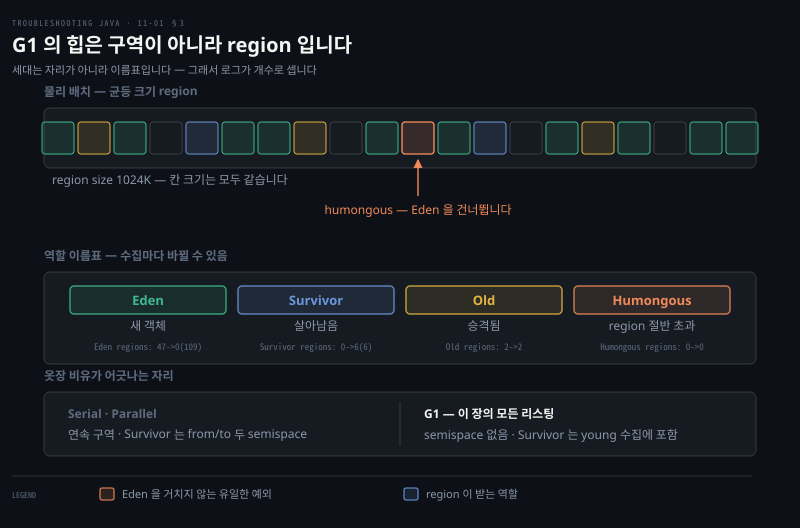
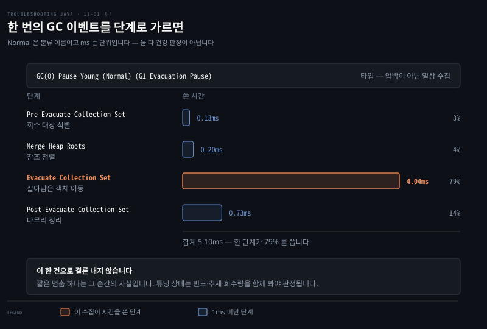

# GC 로그 활성화와 힙 구조
---
> GC 로그는 JVM의 메모리 일기라 모든 수집 이벤트를 기록하는데, 기본은 꺼져 있어 `-Xlog:gc*`로 켜고, 초기화 로그(GC 종류·JVM 버전·시스템·힙 할당)와 이벤트 로그(타입·단계별 시간)를 읽으면 Eden·Survivor·Old로 나뉜 힙에서 무슨 일이 벌어지는지 보입니다

이 노트는 『Troubleshooting Java』 11장의 도입부와 §11.1 을 정리합니다. 5~10장이 디버거·로그·프로파일러·덤프로 문제를 조사했다면, 11장은 JVM 의 메모리 관리 자체를 들여다보는 **GC 로그**를 다룹니다.

저자는 일화로 장을 엽니다. 한 개발자가 금요일 배포 뒤 주말 내내 느려진 사이트를 만났고, 메모리 스파이크와 CPU 99% 와 좀비 스레드가 나타났습니다. GC 로그를 열어 잘못 튜닝된 힙이 일으킨 과도한 full GC 와 stop-the-world 를 짚어 해결합니다.

GC 로그는 JVM 의 *메모리 일기*로 young 수집부터 전면 정리까지 모든 GC 이벤트를 기록합니다. 이 편에서는 로그를 켜고 그 구조와 힙 구조를 읽습니다. 파일 저장·로테이션은 다음 편(11-02), 실전 진단은 그 다음 편(11-03)으로 이어집니다.

> **정의 — 가비지 컬렉션(GC)**: 자바가 더는 쓰지 않는 객체를 메모리에서 자동으로 찾아 제거해 공간을 비우는 과정입니다.


켜면 성격이 다른 두 종류가 나옵니다.

| 종류 | 언제 | 무엇을 담나 |
|------|------|-----------|
| 초기화 로그 | 기동 시 한 번 | 컬렉터 종류·JVM 버전·CPU·메모리·힙 용량·워커 수 |
| 이벤트 로그 | 수집마다 반복 | 이벤트 타입·단계별 시간·수집 전후 힙과 region 변화 |


## 1. GC 로그 켜기 — 이벤트 로깅은 기본으로 안 나옵니다
> GC 로그는 크고 앱을 느리게 할 수 있어 기본으로 꺼져 있으니 느림·높은 CPU·메모리 문제를 조사할 때만 -Xlog:gc*로 켜는데, IDE Run 설정이나 java 명령에 VM 인자로 더합니다

GC는 자바 앱 성능에 핵심이지만, 그 동작은 가시성이 없으면 파악하기 어렵습니다. GC 로그는 메모리 할당·수집 멈춤·전체 힙 관리에 대한 통찰을 줘 병목을 진단하고 JVM을 튜닝하게 합니다.

기본적으로 GC **이벤트** 로깅은 나오지 않습니다. 실용적으로는 "안 켜면 안 보인다"가 맞습니다.

정확히 말하면 통합 로깅 자체가 꺼진 것은 아닙니다. JVM 은 기본으로 `-Xlog:all=warning:stderr` 상태라 warning 과 error 는 흘려보냅니다.

켜져 있지 않은 것은 정상 GC 이벤트가 찍히는 info 레벨입니다. 근거는 [JEP 158](https://openjdk.org/jeps/158) 입니다.

원서는 로그가 꽤 커서 앱을 느리게 하고 로그 파일을 군더더기로 채울 수 있다고 설명합니다. 느린 성능이나 높은 CPU, 메모리 문제를 조사할 때만 켜라는 권고입니다.

> 다만 이 권고는 `debug`·`trace` 를 상시 켤 때의 이야기입니다. `info` 는 이벤트당 한 줄 수준이라 운영에서 상시 켜 두는 것이 실무 표준입니다. 자세한 근거는 [11-02 §3](./11-02.GC%20로그%20파일%20저장과%20로테이션.md) 에 있습니다.

켜는 VM 인자는 이것입니다.

```pseudocode
-Xlog:gc*
```

IDE에서 돌리면 Run 설정에 이 VM 옵션을 더하고, 콘솔(보통 Docker 컨테이너 같은 실환경)에서 돌리면 명령에 더합니다.

```bash
java -Xlog:gc* -jar app.jar
```

예제 `da-ch11-ex1`은 5장과 비슷한 producer-consumer 멀티스레드 구조인데, GC 로그에 집중하도록 다른 앱 로그를 다 뺐습니다.


## 2. 초기화 로그 — 조사 전 첫 한눈
> 초기화 로그는 GC 종류(G1)·JVM 버전·시스템 자원(CPU·메모리)·힙 할당(region/min/initial/max)·GC 병렬 설정을 드러내, 문제를 더 파기 전 현재 실행의 기본 구성을 잡아 줍니다

앱을 켜면 먼저 **초기화 로그(initialization logs)**가 뜹니다 — GC 초기화의 핵심 파라미터를 드러냅니다.

```pseudocode
// listing 11.1 — 초기화 GC 로그(발췌)
[0.059s][info][gc     ] Using G1                 ← 어떤 GC 를 쓰는가
[0.065s][info][gc,init] Version: 22.0.1+8        ← JVM 버전
[0.065s][info][gc,init] CPUs: 8 total, 8 available   ← 시스템 자원
[0.065s][info][gc,init] Memory: 48899M
[0.065s][info][gc,init] Heap Region Size: 8M     ← 힙 할당 정보
[0.065s][info][gc,init] Heap Initial Capacity: 768M
[0.065s][info][gc,init] Heap Max Capacity: 12232M
[0.065s][info][gc,init] Parallel Workers: 8      ← GC 병렬 설정
[0.065s][info][gc,init] Concurrent Workers: 2
```

이 첫 개요가 문제를 더 파기 전 현재 실행의 기본 구성을 잡아 줍니다.

- **GC 종류·JVM 버전** — 메모리가 어떻게 관리될지 기대를 정합니다. 버전마다 할당·저장이 개선되고, GC 종류마다 객체 이동(evacuation) 방식이 달라, 지연·예기치 못한 동작을 미리 짐작하게 합니다.
- **시스템 정보** — 앱이 쓸 자원이 얼마인지 알려 줍니다. CPU·메모리가 부족하면 느려지거나 멈춤이 길어지거나 예측 불가하게 굽니다.
- **힙 정보** — 성능·메모리 문제 조사에 핵심입니다. 힙에 적은 메모리만 할당됐다면 GC 성능·메모리 문제를 의심하는 첫 단서입니다.

> **자원이 적을 때만 나오는 버그가 있습니다.** 저자는 멀티스레드 앱의 무작위 버그를 한참 좇다, CPU가 제한된 가상 환경에서 더 자주 터진다는 걸 깨달았습니다 — 멀티스레딩 로직이 생각만큼 똑똑하지 않았고, 낮은 처리력이 결함을 드러낸 것입니다. 힙 설정을 조이는 건 성능 개선뿐 아니라 앱의 회복력을 시험하는 방법이기도 합니다.


## 3. 힙 구조 — 옷장 비유와 G1 의 region
> 세대 개념은 옷장 비유로 잡되, G1 에서는 그 세대가 연속된 구역이 아니라 균등 크기 region 에 붙는 이름표라는 점이 다릅니다. 리스팅이 `Eden regions:` 로 세는 이유가 그것입니다

GC 로그를 더 파기 전에 메모리 구조를 짚습니다. JVM 힙을 옷을 넣는 옷장이라 상상하면, 막 던져 넣는 대신 옷이 머무는 기간에 따라 정리하는 체계가 있습니다.

- **Eden(새 옷 구역)** — 막 산 새 옷을 두는 곳입니다. 대부분의 새 객체가 여기서 시작합니다.
- **Survivor(아직 쓰는 구역)** — Eden 의 옷 중 GC 를 몇 번 살아남은 것이 옮겨 옵니다.
- **Old generation(오래 간직하는 옷)** — 충분히 오래 살아남아 장기 보관으로 넘어간 객체가 있습니다.

객체의 *나이*(살아남은 GC 사이클 수)에 따라 한 구역에서 다음 구역으로 승격(promote)됩니다.

### 비유가 어긋나는 자리 — G1 은 연속 구역이 아닙니다

옷장 비유는 세대 개념을 잡는 데는 좋지만 **Serial·Parallel 의 배치**를 그린 것입니다. 이 장의 모든 리스팅이 쓰는 G1 은 구조가 다릅니다.

| | Serial·Parallel | G1 |
|---|---|---|
| 힙 배치 | Eden·Survivor·Old 가 **연속된 구역** | 균등 크기 **region 집합** |
| 세대의 정체 | 고정된 영역 | region 에 붙는 **역할 이름표** |
| Survivor | from·to 두 semispace 를 오감 | semispace 가 없고 region 수가 변함 |
| 역할 변경 | 고정 | 수집마다 바뀔 수 있음 |

그래서 G1 에서는 "Survivor 에 작은 영역 둘이 있어 그 사이를 오간다"는 설명이 맞지 않습니다. from/to semispace 는 Serial·Parallel 의 것입니다.

리스팅 자체가 이를 드러냅니다. JDK 25 실측 출력입니다.

```pseudocode
[0.051s][debug][gc,heap] GC(0)   region size 1024K, 47 young (48128K), 0 survivors (0K)
[0.052s][info ][gc,heap] GC(0) Eden regions: 47->0(109)
[0.052s][info ][gc,heap] GC(0) Survivor regions: 0->6(6)
[0.052s][info ][gc,heap] GC(0) Old regions: 2->2
[0.052s][info ][gc,heap] GC(0) Humongous regions: 0->0
```

`region size 1024K` 가 먼저 나오고 그 뒤 세대별로 **region 개수**를 셉니다. 연속 구역이라면 개수로 세지 않습니다. 괄호 안 숫자는 남은 여유 region 이 아니라 **다음 수집까지의 목표 Eden region 수** 입니다.

한 가지 예외도 있습니다. region 절반을 넘는 humongous 객체는 Eden 을 거치지 않고 **humongous region 에 곧바로 할당**됩니다. "새 객체는 모두 Eden 에서 시작한다"가 G1 에서는 전부 참이 아닙니다.

### 청소 빈도

Eden 은 새 게 많이 드나들어 자주 비워지고, Old 는 드물게 정리됩니다. 다만 G1 에서 Survivor 는 별도 주기로 청소되는 것이 아니라 **young 수집에 Eden 과 함께 포함**됩니다. "Survivor 는 덜 자주 청소한다"는 서술은 이 점에서 부정확합니다.





## 4. GC 이벤트 로그 — 타입과 단계별 시간
> GC 이벤트 로그에서 가장 중요한 둘은 이벤트 타입과 각 단계에 쓴 시간입니다. G1 이 실제로 찍는 타입은 `Pause Young (Normal)`·`(Concurrent Start)`·`(Prepare Mixed)`·`(Mixed)`·`Pause Full` 이고, 단계 시간이 짧다는 것만으로 건강을 단정할 수는 없습니다



GC 이벤트는 성능 문제 조사에 결정적입니다. 가장 중요한 둘에 집중합니다.

- **GC 이벤트 타입** — 무엇을 어디까지 정리했는지 알려 줍니다. 통합 로깅에서 G1 이 찍는 타입은 `Pause Young (Normal)`·`Pause Young (Concurrent Start)`·`Pause Young (Prepare Mixed)`·`Pause Young (Mixed)`·`Pause Full` 입니다.

  > 원서가 쓴 "minor·full·mixed·emergency" 중 **emergency 는 JVM 이 찍는 이벤트 타입이 아닙니다.** JDK 25 의 `-Xlog:gc*` 출력과 태그 목록에 나오지 않습니다. "minor" 도 통합 로깅 어휘가 아니라 일반 용어이고, 로그에는 `Pause Young` 으로 적힙니다.
- **각 단계에 쓴 시간** — 총 GC 시간이 길거나 특정 단계가 유독 길면 병목의 강한 신호입니다.

```pseudocode
// listing 11.2 — 메모리 수집 GC 이벤트
[1.336s][gc,start] GC(0) Pause Young (Normal)(G1 Evacuation Pause)   ← 수집 시작·타입
[1.337s][gc,task]  GC(0) Using 8 workers of 8 for evacuation         ← GC 스레드 수
[1.342s][gc,phases] GC(0) Pre Evacuate Collection Set: 0.13ms        ← 회수 대상 식별
[1.342s][gc,phases] GC(0) Merge Heap Roots: 0.20ms                   ← 참조 정렬
[1.342s][gc,phases] GC(0) Evacuate Collection Set: 4.04ms            ← 이동/제거
[1.342s][gc,phases] GC(0) Post Evacuate Collection Set: 0.73ms       ← 마무리 정리
```

여기엔 걱정거리가 없습니다 — 타입이 `Normal`이라 메모리 압박이나 긴급 조건이 아닌 *일상적* 수집이고, 모든 단계 시간이 ms 단위라 짧아 문제를 배제합니다. GC가 눈에 띄는 지연 없이 효율적으로 돈다는 뜻입니다.

```pseudocode
// listing 11.3 — 수집 후 변화
[1.342s][gc,heap] GC(0) Eden regions: 4->0(5)        ← Eden 4개 사용 → 모두 비움 (가용 5)
[1.342s][gc,heap] GC(0) Survivor regions: 0->1(1)    ← Survivor 0 → 1 사용 (가용 1)
[1.342s][gc,heap] GC(0) Old regions: 0->0            ← Old 로 승격 없음
[1.342s][gc,heap] GC(0) Humongous regions: 0->0      ← 큰 객체(humongous) 수집 없음
```

> **세 listing 의 결론.** G1 GC 를 쓰고 힙 region 은 8MB, 최대 힙은 약 12GB 입니다. 1.336s 에 young 수집이 트리거됐고 Eden 을 전부 비운 뒤 Survivor region 하나를 썼습니다. 멈춤은 몇 ms 였습니다.
>
> 다만 이 한 건으로 "잘 튜닝됐다"고 결론짓지는 않습니다. 짧은 멈춤 하나는 그 순간의 사실일 뿐이고, 튜닝 상태는 빈도·추세·회수량을 함께 봐야 판단됩니다. humongous 는 region 절반을 넘는 초대형 객체입니다.


## 5. 면접 한 줄 정리
> GC 로그 활성화와 힙 구조의 핵심을 한 문장으로 점검합니다

- **GC 로그를 왜 기본으로 끄나?** 로그가 크고 앱을 느리게 할 수 있어, 느림·높은 CPU·메모리 문제를 조사할 때만 `-Xlog:gc*`로 켭니다.
- **초기화 로그가 주는 첫 단서는?** GC 종류(G1)·JVM 버전·시스템 자원·힙 할당(region/min/initial/max)·GC 병렬 설정 — 현재 실행의 기본 구성입니다.
- **힙의 세 구역은?** Eden(새 객체 시작), Survivor(GC 사이클 살아남은 것, 영역 둘), Old(오래 살아남아 승격된 것). Eden은 자주, Old는 드물게 청소합니다.
- **객체 나이란?** 살아남은 GC 사이클 수입니다. 충분히 살아남으면 Eden→Survivor→Old로 승격됩니다.
- **GC 이벤트에서 무엇을 보나?** 이벤트 타입과 각 단계 시간입니다. 다만 `Normal` 은 G1 의 young 수집 **분류 이름**이지 건강 판정이 아니고, ms 단위라는 것도 단위일 뿐입니다. 한 번의 짧은 멈춤으로 튜닝이 잘 됐다고 단정할 수 없고 빈도와 추세를 함께 봐야 합니다.
- **listing 11.3의 `Eden 4->0(5)`는?** 수집 전 Eden 4개 사용 → 모두 비움, 가용 5개라는 뜻입니다. Old `0->0`은 승격 없음입니다.


## 원서와 다르게 적은 곳

> 2026-09-09 에 JDK 25 로 실측하고 JEP·Oracle 문서와 대조해 넷을 고쳤습니다.

| 원서 서술 | 실제 | 근거 |
|----------|------|------|
| Survivor 에 작은 영역 둘이 있어 그 사이를 오간다 | from/to semispace 는 Serial·Parallel 의 것. G1 은 region 집합 | [Oracle G1 가이드](https://docs.oracle.com/en/java/javase/25/gctuning/garbage-first-g1-garbage-collector1.html) |
| 이벤트 타입에 emergency 가 있다 | 그런 타입이 없음. G1 은 `Pause Young (…)`·`Pause Full` | JDK 25 실측 |
| `Normal` 과 ms 단위라 잘 튜닝된 정상 수집 | `Normal` 은 분류 이름이고 ms 는 단위일 뿐. 한 번으로 단정 불가 | JDK 25 실측 |
| GC 로깅은 기본으로 꺼져 있다 | 통합 로깅은 항상 동작하고 warning·error 는 stderr 로 나감. 꺼진 것은 info | [JEP 158](https://openjdk.org/jeps/158) |

옷장 비유는 세대 개념 전달에는 남겨 두되, G1 에서 어긋나는 자리를 §3 에 표로 붙였습니다.


## 관련 문서
- [이 책 인덱스 (Troubleshooting Java MOC)](./README.md) — 장별 정독 노트 진척
- [OQL로 힙 덤프 쿼리하기](./10-03.OQL로%20힙%20덤프%20쿼리하기.md) — 10장 마지막 편. 힙 덤프(스냅숏)에 이어 GC 로그(시간에 걸친 일기)로 전환
- [GC 로그 파일 저장과 로테이션](./11-02.GC%20로그%20파일%20저장과%20로테이션.md) — 콘솔 대신 파일로 저장하고 로테이션·레벨로 관리하는 다음 편
