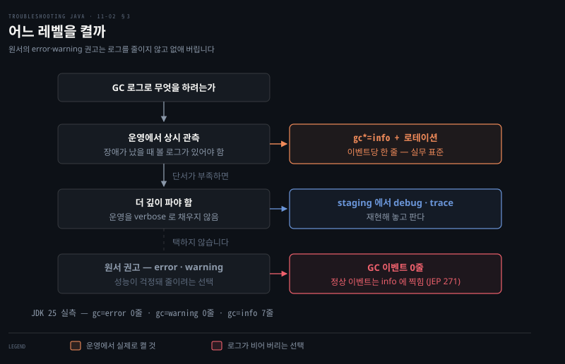

# GC 로그 파일 저장과 로테이션
---
> 콘솔 GC 로그는 학습용일 뿐 실환경에선 다른 로그와 섞이고 너무 커서, `file=`로 파일에 저장하고 time·uptime·level·tags 데코레이터로 형식을 갖춘 뒤 filecount·filesize로 로테이션합니다. 레벨은 운영에서도 info 를 씁니다 — error·warning 을 고르면 GC 로그가 비어 버립니다

이 노트는 『Troubleshooting Java』 11장의 §11.2와 §11.3을 정리합니다. 앞 편(11-01)이 GC 로그를 *켜고* 구조를 읽는 법이었다면, 이 편은 그 로그를 *파일에 저장하고 관리하는* 법입니다 — 실환경 트러블슈팅과 AI·GCeasy 같은 도구 분석의 토대입니다. 콘솔 로깅은 학습·빠른 디버깅엔 좋아도 실환경엔 멀어, 라이브 콘솔에서 다른 앱 로그와 섞이고 양이 많아 실시간 분석이 어렵습니다. 실전 진단 네 시나리오는 다음 편(11-03)으로 이어집니다.


`-Xlog` 인자는 콜론으로 나뉜 네 칸입니다. 각 칸이 무엇을 정하는지 알면 함정을 피할 수 있습니다.

| 칸 | 이름 | 정하는 것 | 예 |
|----|------|----------|-----|
| 1 | 선택 | 무엇을 찍을까 | `gc*=info` |
| 2 | 출력 | 어디에 쓸까 | `file=gc.log` |
| 3 | 데코레이터 | 각 줄에 무엇을 덧붙일까 | `time,uptime,level,tags` |
| 4 | 출력 옵션 | 파일을 어떻게 굴릴까 | `filecount=5,filesize=10M` |

세 번째 칸을 비우려면 콜론을 둘 써야 합니다. 하나만 쓰면 네 번째 칸의 값이 데코레이터로 해석돼 JVM 이 기동하지 않습니다.


## 1. 파일로 저장 — file=과 네 데코레이터
> GC 로그를 파일로 보내려면 -Xlog:gc*:file=<경로>:time,uptime,level,tags를 쓰는데, 네 데코레이터는 타임스탬프·JVM 가동시간·로그 레벨·태그를 메시지 형식에 더하며, JVM 프로세스에 그 디렉토리 쓰기 권한이 있어야 합니다

GC 로그를 특정 파일로 보내는 VM 인자는 이것입니다(JVM 프로세스에 그 디렉토리 *쓰기 권한*이 있어야 합니다).

```pseudocode
-Xlog:gc*:file=<file_path>:time,uptime,level,tags
```

`time`·`uptime`·`level`·`tags`는 로그 메시지 형식에 더할 데이터로, 보통 이 넷이 가장 유용하고 자주 쓰입니다.

- **time** — 각 항목에 타임스탬프를 더합니다.
- **uptime** — GC 이벤트가 일어난 JVM 가동 시간(초/ms)을 기록합니다.
- **level** — 로그 레벨(info·debug·trace 등)을 넣습니다(4장 로깅 레벨 참고).
- **tags** — 각 메시지에 연결된 태그(카테고리)를 보여 줍니다.

명령줄이나 IDE Run 설정에 더합니다.

```bash
java -Xlog:gc*:file=gc.log:time,uptime,level,tags -jar yourApp.jar
```

파일로 저장하면 보관·공유가 쉬울 뿐 아니라 전용 도구로 깊이 분석할 수 있습니다 — 저자는 파일을 **GCeasy.io**(GC 로그 조사 도구)에 올리거나, ChatGPT·Gemini 같은 AI 비서로 내용을 분석해 통찰과 트러블슈팅 전략을 얻습니다.

> **재시작 때 덮어쓰기 함정.** 한 주니어 개발자가 `/var/logs/gc.log`에 저장하도록 설정했는데, 로그 파일이 *재시작마다 덮어써져* 사라졌습니다. 파일명 끝에 타임스탬프를 더해 해결했지만 — *옛 로그*는 로테이션을 안 켜 영영 사라졌습니다. 교훈: 늘 로테이션을 설정하세요.


## 2. 로그 로테이션 — filecount과 filesize
> 한 파일이 무한정 자라지 않게 `filecount`로 보관할 회전 파일 수를, `filesize`로 파일별 크기 한도를 정합니다. 활성 파일은 인덱스가 없고 회전된 것만 `.0`·`.1` 을 받으므로 실제 파일 수는 `filecount + 1` 입니다

GC는 로그를 많이 만들어, 한 파일이 수 GB가 되면 저장·전송·분석이 번거롭습니다. 로그를 여러 파일로 쪼개 한 파일이 무한정 자라는 걸 막습니다 — **`filecount`**로 보관할 회전 파일 수를, **`filesize`**로 파일별 크기 한도를 정합니다.

```bash
java -Xlog:gc*:file=logs.txt:time,uptime,level,tags:filecount=5,filesize=10M -jar app.jar
```

**출력 옵션은 네 번째 필드입니다.** `-Xlog` 문법은 `-Xlog:<선택>:<출력>:<데코레이터>:<출력옵션>` 네 칸이고 `filecount`·`filesize`는 맨 뒤 칸에 놓입니다. 데코레이터를 생략할 때 콜론을 하나만 쓰면 JVM이 기동조차 하지 않습니다.

```bash
# ❌ JDK 25 실측 — Invalid decorator 'filecount=5'. 로 기동 실패
java -Xlog:gc*:file=gc.log:filecount=5,filesize=10M -jar app.jar

# ✅ 데코레이터를 비우려면 콜론 둘
java -Xlog:gc*:file=gc.log::filecount=5,filesize=10M -jar app.jar
```

한도(여기선 10M)에 닿으면 현재 파일이 회전하고 새 파일이 열립니다. **활성 파일은 인덱스가 없고, 회전된 파일만 `.0`부터 인덱스를 받습니다.** `filecount=5`는 회전본 다섯을 보관한다는 뜻이라 실제 파일은 활성 하나를 더해 여섯입니다. JDK 25에서 `filecount=3,filesize=8K`로 돌리면 `rot.log`와 `rot.log.0`이 생기는 것으로 확인했습니다.

`filecount=0`은 로테이션을 끕니다. 끄면 기존 파일을 덮어쓰므로, 로테이션을 켜 두는 것이 위 함정의 실제 해법입니다.

특정 시간대 로그가 필요하면 생성·수정 타임스탬프로 파일을 거를 수 있습니다 — Linux `find`나 Windows PowerShell `Get-ChildItem`으로요.


## 3. 로그 레벨 — 운영에서 error·warning 을 고르면 로그가 비어 버립니다
> 레벨은 error·warning·info·debug·trace 다섯이고 고른 레벨은 더 위험한 상위를 포함합니다. 다만 HotSpot 은 정상 GC 이벤트를 info 이상에서만 찍으므로, 운영에서 error·warning 을 고르면 GC 로그가 한 줄도 남지 않습니다

로그 양을 줄이는 또 한 방법은 특정 *심각도 레벨*만 저장하는 것입니다. GC 로그는 4장에서 다룬 표준 레벨을 쓰며, 위험도 내림차순은 이렇습니다.

- **Error** — 앱 안정성에 영향을 주는 치명적 실패만
- **Warning** — 오류로 이어질 수 있는 잠재 문제
- **Info** — GC 과정의 일반 운영 세부
- **Debug** — 트러블슈팅에 유용한 추가 진단 정보
- **Trace** — 가장 상세한 로그, GC 활동을 깊이 포착

레벨은 선택 필드에 `=`로 붙입니다.

```bash
java -Xlog:gc*=info:file=gc.log::filecount=5,filesize=10M -jar app.jar
```

각 레벨은 더 위험한 상위를 자동 포함합니다. `warning`을 켜면 `error`도 함께 잡힙니다.

### 원서의 운영 권고는 그대로 따르면 안 됩니다

원서는 "운영 환경에서는 늘 error·warning 만"이라고 적습니다. 성능 민감도를 이유로 들지만, HotSpot 에서 이 설정은 **로깅을 줄이는 것이 아니라 없애 버립니다.** JDK 25 로 실측했습니다.

| 설정 | GC 이벤트 출력 |
|------|--------------|
| `-Xlog:gc=error` | **0줄** |
| `-Xlog:gc=warning` | **0줄** |
| `-Xlog:gc=info` | 7줄 |

이유는 단순합니다. `Pause Young`·`Pause Full` 같은 **정상 GC 이벤트가 info 레벨로 찍히기** 때문입니다. JEP 271 이 정한 배치가 그렇습니다 — 주요 GC 이벤트는 info, verbose 는 debug, `Verbose` 플래그류 출력은 trace 입니다. error·warning 에는 정상 운영 중 남길 메시지가 사실상 없습니다.

그러므로 운영에서 error·warning 을 고르면 정작 장애가 났을 때 볼 로그가 없습니다. 이 장 전체의 목적과 정반대입니다.

### 실제로 쓸 기준

- **운영 환경** — `gc*=info` 를 켜고 로테이션을 겁니다. info 는 이벤트당 한 줄 수준이라 오버헤드가 작고, 이것이 실무 표준입니다. 원서가 걱정한 오버헤드는 `debug`·`trace` 를 상시 켤 때의 이야기입니다
- **더 깊은 조사가 필요하면** — 운영을 verbose 로 채우지 말고 staging 에서 재현하며 `debug`·`trace` 로 파고듭니다
- **레벨을 안 적으면** — 선택 필드에 `=레벨`을 생략하면 info 가 적용됩니다

> **오버헤드는 레벨보다 저장 위치가 더 큽니다.** GC 로그 쓰기는 STW 구간 안에서 일어나므로, 바쁜 디스크에 쓰면 그 대기가 멈춤 시간에 그대로 더해집니다. 이 경로는 [수거량에 비해 지나치게 긴 멈춤](../../../troubleshooting/runtime/2026-09-08_수거량에%20비해%20지나치게%20긴%20멈춤.md) 사례가 다룹니다.

핵심은 *상세함과 성능의 균형*인데, 그 균형점이 error·warning 이 아니라 **info** 입니다.





## 4. 면접 한 줄 정리
> GC 로그 파일 저장·로테이션·레벨의 핵심을 한 문장으로 점검합니다

- **왜 콘솔 대신 파일에 저장하나?** 실환경 콘솔에선 다른 앱 로그와 섞이고 양이 많아 실시간 분석이 어렵기 때문입니다. 파일은 수집·필터·분석이 쉽고 GCeasy·AI에 넘기기 좋습니다.
- **파일 저장 인자와 네 데코레이터는?** `-Xlog:gc*:file=<경로>:time,uptime,level,tags`입니다 — time(타임스탬프)·uptime(JVM 가동시간)·level(로그 레벨)·tags(카테고리). 디렉토리 쓰기 권한이 필요합니다.
- **로테이션은 어떻게?** `filecount`(보관할 회전 파일 수)·`filesize`(파일별 크기 한도)이고 **네 번째 필드**에 놓습니다. 데코레이터를 비우려면 콜론 둘(`file=gc.log::filecount=5`)을 써야 하고, 하나만 쓰면 JVM 이 기동하지 않습니다. 활성 파일은 인덱스가 없어 실제 파일 수는 `filecount + 1` 입니다. `filecount=0` 은 로테이션을 끕니다.
- **로그 레벨 다섯과 포함 관계는?** error·warning·info·debug·trace(위험도 내림차순). 각 레벨은 *더 위험한 상위를 자동 포함*합니다(warning 켜면 error도 잡힘).
- **환경별 권장 레벨은?** 운영에서도 **info** 입니다. 원서는 error·warning 을 권하지만 HotSpot 은 정상 GC 이벤트를 info 이상에서만 찍어, 그 설정은 로그를 줄이는 것이 아니라 **0줄로 만듭니다**(JDK 25 실측). 깊은 조사는 staging 에서 debug·trace 로 재현합니다.
- **재시작 덮어쓰기 함정은?** 로테이션이 꺼져 있으면(`filecount=0` 포함) 같은 파일명이 덮어써집니다 → 로테이션을 켜거나 파일명에 `%p`·`%t` 같은 치환자를 씁니다.


## 원서와 다르게 적은 곳

> 2026-09-09 에 JDK 25 로 실측하고 JEP·Oracle 문서와 대조해 세 곳을 고쳤습니다.

| 원서 서술 | 실제 | 근거 |
|----------|------|------|
| 운영은 error·warning 만 | 그 설정은 GC 로그가 0줄. 운영도 info | JDK 25 실측 · [JEP 271](https://openjdk.org/jeps/271) |
| `file=gc.log:filecount=5` | 콜론 하나면 `Invalid decorator` 로 기동 실패 | JDK 25 실측 |
| filecount 만큼 파일이 생기고 가장 오래된 것을 덮어씀 | 활성 파일은 인덱스가 없어 `filecount + 1` 개 | JDK 25 실측 |

원서 본문을 그대로 옮기지 않고 1차 자료로 확인한 것만 남깁니다. 확인 없이 옮긴 서술이 운영 지침이 되면 로그가 비는 사고로 이어집니다.


## 관련 문서
- [이 책 인덱스 (Troubleshooting Java MOC)](./README.md) — 장별 정독 노트 진척
- [GC 로그 활성화와 힙 구조](./11-01.GC%20로그%20활성화와%20힙%20구조.md) — 이 편의 전제. `-Xlog:gc*`로 켜고 초기화 로그·힙 구조를 읽는 단계
- [GC 로그로 문제 진단 네 시나리오](./11-03.GC%20로그로%20문제%20진단%20네%20시나리오.md) — 저장한 로그로 멈춤·누수·메모리 부족·병렬을 진단하는 다음 편
- [로그 영속화와 로깅 레벨](./04-02.로그%20영속화와%20로깅%20레벨.md) — 4장. GC 로그가 쓰는 표준 로깅 레벨의 원래 설명
