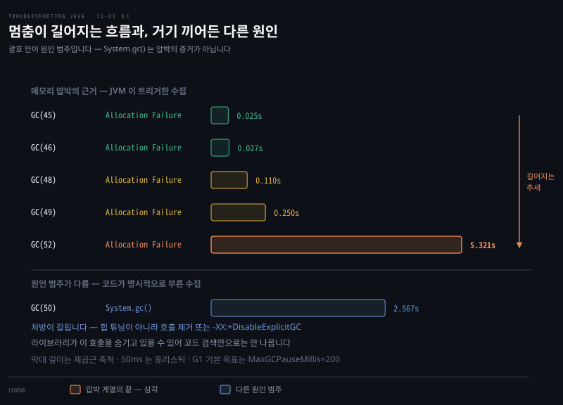
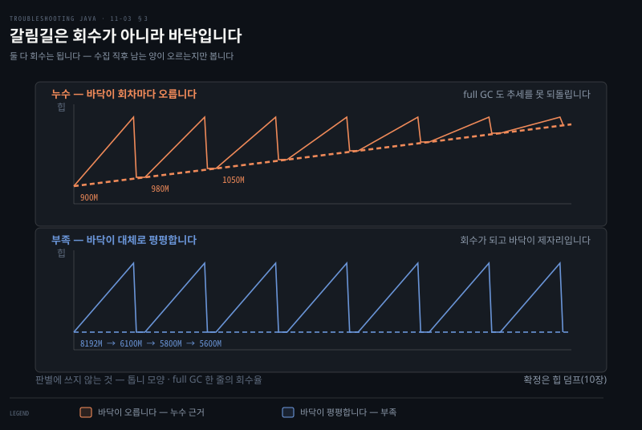
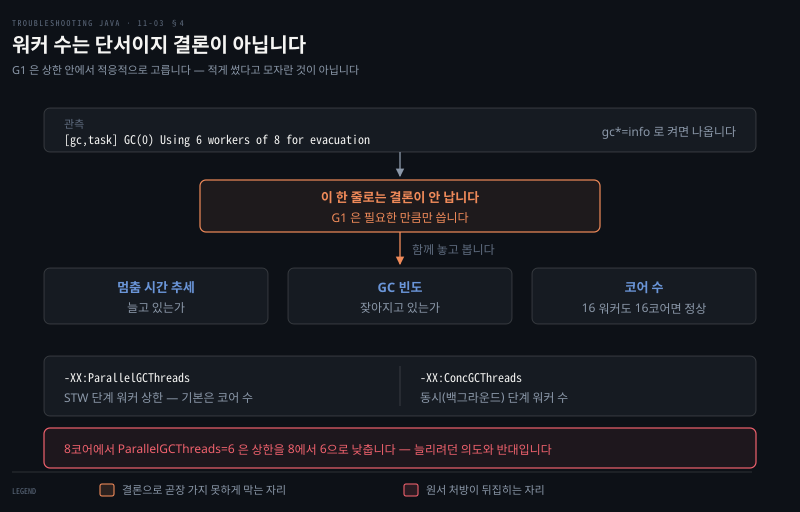

# GC 로그로 문제 진단 네 시나리오
---
> GC 로그는 네 실전 문제를 짚어 주는데 — 50ms 넘는 잦은 멈춤(성능 저하), full GC가 메모리를 거의 못 비움(누수), full GC가 잦지만 비우긴 함(메모리 부족), 워커 스레드 과소/과다(병렬 튜닝) — 각 패턴의 *멈춤 시간·빈도·회수량·STW*를 함께 읽어야 진짜 문제인지 가립니다

이 노트는 『Troubleshooting Java』 11장의 §11.4를 정리합니다. 앞 두 편이 GC 로그를 *켜고·저장하는* 법이었다면, 이 편은 그 로그로 *실전 문제를 진단하는* 네 시나리오입니다. 로그가 있는 것만으로는 부족하고, 효과적으로 검색해 드러나는 문제를 짚을 줄 알아야 합니다. 네 시나리오는 다음과 같습니다.

1. GC 멈춤으로 인한 성능 저하
2. 힙 사용 로그로 메모리 누수 식별
3. full GC 로 메모리 부족 식별
4. GC 병렬성 튜닝


네 시나리오가 읽는 신호는 같습니다. 멈춤 시간·GC 빈도·수집 전후 힙·STW 이벤트 넷이고, 갈라지는 것은 그 신호가 그리는 모양입니다.

| 시나리오 | 로그가 그리는 모양 | 이것만으로는 확정 안 됨 |
|---------|------------------|---------------------|
| 성능 저하 | 멈춤이 임계를 넘고 잦아짐 | 임계는 서비스 지연 목표가 정함. `System.gc()` 는 원인 범주가 다름 |
| 메모리 누수 | 회차마다 잔량이 오름 (900→980→1050) | 확정은 힙 덤프(10장) |
| 메모리 부족 | 회수는 되는데 바닥이 최대에 가까움 | 회수돼도 live set 이 자랄 수 있어 긴 구간을 봐야 함 |
| 병렬성 튜닝 | `Using N workers of M for evacuation` | G1 은 상한 안에서 적응적으로 고름. 워커 수는 단서일 뿐 |


## 1. 성능 저하 — GC 멈춤 시간
> GC 멈춤이 0~50ms면 정상이지만 50ms를 넘고 *잦으면* 성능 문제 신호인데, 멈춤 시간·빈도·GC 전후 힙 사용량·STW 넷을 함께 보고, 한두 예외가 아니라 일관되게 높은 멈춤이 반복돼야 진짜 문제로 봅니다



GC는 메모리 관리에 필수지만, 과도하거나 긴 멈춤은 성능을 크게 해쳐 눈에 띄는 지연을 만듭니다. 증상은 응답 시간 증가, 실제 일은 적은데 높은 CPU(5장 프로파일러로 관찰), 주기적 프리즈·지연 스파이크입니다. 멈춤 문제를 조사할 때 GC 로그에서 볼 핵심 넷입니다.

- **GC 멈춤 시간** — 각 GC 사이클이 쓴 시간
- **GC 빈도** — 짧은 간격의 잦은 minor·full GC는 누수나 나쁜 튜닝 신호
- **GC 전후 힙 사용량** — full GC가 메모리를 거의 못 비우면 객체가 예상보다 오래 머무는 것
- **Stop-the-world(STW) 이벤트** — 긴 STW는 GC가 앱 성능을 방해한다는 신호

> **50ms 는 원서의 휴리스틱이지 규격이 아닙니다.** 허용 가능한 멈춤은 서비스의 지연 목표가 정하고, G1 자신의 기본 목표는 `-XX:MaxGCPauseMillis=200` 입니다. 다만 임계를 어디에 두든 판단 방법은 같습니다. 한두 건의 예외가 아니라 *반복 패턴*인지 확인해야 하고, 일관되게 높은 멈춤이 잦은 GC 와 함께 나타나야 메모리 압박으로 읽습니다.

다음은 멈춤이 점점 악화되는 예입니다. 처음 몇은 25~27ms 로 정상입니다. 12:00:10 에 110ms 로 뛰며 초기 경고가 나타나고 12:00:20 에 250ms 로 악화됩니다.

그 뒤 full GC 가 둘 보입니다. 12:00:35 의 2.5초짜리와 12:01:10 의 5.3초짜리인데, 둘의 성격이 다릅니다. 아래에서 갈라 봅니다.

```pseudocode
GC(45) Pause Young (G1 Evacuation Pause) 0.025s   ← 정상
GC(46) Pause Young (G1 Evacuation Pause) 0.027s   ← 정상
GC(48) Pause Young (G1 Evacuation Pause) 0.110s   ← 초기 경고
GC(49) Pause Young (G1 Evacuation Pause) 0.250s   ← 악화(메모리 압박↑)
GC(50) Pause Full (System.gc())        2.567s     ← 원인이 다름 (아래)
GC(52) Pause Full (Allocation Failure) 5.321s     ← 심각
```

> **`System.gc()` 는 메모리 압박의 증거가 아닙니다.** 괄호 안이 GC 를 부른 이유인데, `Allocation Failure` 는 할당할 자리가 없어 JVM 이 트리거한 것이고 `System.gc()` 는 **코드가 명시적으로 부른 것**입니다. 원인 범주가 다릅니다.
>
> 그래서 처방도 갈립니다. `System.gc()` 로 인한 full GC 는 힙 튜닝이 아니라 그 호출을 없애거나 `-XX:+DisableExplicitGC` 로 막는 것이 답입니다. 어떤 라이브러리는 이 호출을 숨기고 있으므로 코드 검색만으로는 안 나올 수 있습니다.
>
> 위 시퀀스에서 압박의 근거로 읽을 것은 `Allocation Failure` 계열의 멈춤이 길어지는 흐름입니다.

멈춤이 성능을 해치면 조정안이 여럿입니다. 힙 크기를 `-Xmx` 로 조정하는 것이 먼저입니다. 객체 생성을 줄이거나 재사용하도록 앱 설계를 바꾸는 방법도 있습니다. 저지연이 필요하면 ZGC·Shenandoah 처럼 멈춤을 최소화하는 컬렉터를 검토합니다.

> 컬렉터 선택지는 JDK 버전에 걸립니다. CMS 는 [JEP 291](https://openjdk.org/jeps/291) 로 JDK 9 에서 deprecated 되고 [JEP 363](https://openjdk.org/jeps/363) 으로 JDK 14 에서 제거됐습니다. 이 장에 나오는 JDK 8 시대 로그 형식이 그 시절 것이라는 점과 함께 기억해 둘 부분입니다.


## 2. 메모리 누수 — 힙 사용 로그
> 힙 사용 로그는 시간에 걸친 메모리 소비를 보여 줘 점진적 증가 패턴으로 누수를 드러내는데, GC가 매 사이클 메모리를 점점 *덜* 비우고 full GC조차 거의 효과 없으면 누수이며, 정확한 원인은 힙 덤프(10장)로 짚습니다

메모리 누수는 미묘하지만 치명적이라 성능 저하·과도한 GC·끝내 OOM 크래시로 이어집니다. VisualVM·Eclipse MAT 같은 프로파일러도 강력하지만, 더 가볍고 연속적인 접근이 필요할 때 **힙 사용 로그**가 등장합니다 — 시간에 걸친 메모리 소비의 역사적 관점을 줘 누수를 가리키는 점진적 증가 패턴을 잡아냅니다.

저자가 든 일화에서, 한 엔지니어가 Kubernetes 파드가 계속 재시작하는 새벽에 GC 로그를 열어 이런 항목을 봅니다.

> **아래 예시는 JDK 8 시절 `-XX:+PrintGCDetails` 형식입니다.** `PSYoungGen` 은 Parallel Scavenge 라 G1 이 아니고, 현행 JDK 는 통합 로깅 형식으로 찍습니다. 지금 로그에서 `PSYoungGen` 을 찾으면 나오지 않으므로, 읽는 법만 가져오고 형식은 아래 대조표를 씁니다.

```pseudocode
[GC (Allocation Failure) [PSYoungGen: 512M->128M(1024M)] 1024M->900M(2048M), 0.250s]
[GC (Allocation Failure) [PSYoungGen: 640M->200M(1024M)] 1100M->980M(2048M), 0.270s]
[GC (Allocation Failure) [PSYoungGen: 700M->250M(1024M)] 1200M->1050M(2048M), 0.280s]
[Full GC (Ergonomics) ... 2048M->1148M(2048M), 1.200s]
```

"메모리 사용이 계속 자란다. 첫 GC 는 900MB 가 남았고, 둘째는 980MB, 셋째는 1050MB 다. 공간을 더 회수하기는커녕 매 사이클이 *더 많은 메모리를 남긴다*. 이건 정상 사용이 아니라 누수다." 그는 비워지지 않는 컬렉션에 세션 참조가 머무는 것을 찾아냅니다. 몇 시간 전 배포가 들여온 문제였고 릴리스를 롤백합니다.

> **원서 해석 한 곳을 고칩니다.** 원서는 마지막 줄을 두고 "full 수집을 했지만 그조차 거의 차이가 없다"고 읽습니다. 그런데 예시 숫자 `2048M->1148M` 은 **900MB, 약 44% 를 회수**합니다. 해석과 숫자가 어긋납니다.
>
> 이 예시에서 누수를 가리키는 근거는 full GC 의 무력함이 아니라 **회차마다 잔량이 오르는 추세**(900 → 980 → 1050)입니다. 그 추세만으로 충분하고, full GC 줄은 오히려 회수가 되고 있음을 보여 줍니다. 판단 근거를 잘못 짚으면 다음 사례에서 헛짚습니다.

**JDK 25 의 같은 상황은 이렇게 찍힙니다.**

```pseudocode
[0.052s][info][gc] GC(0) Pause Young (Normal) (G1 Evacuation Pause) 48M->6M(258M) 1.104ms
[0.084s][info][gc] GC(5) Pause Full (System.gc()) 93M->61M(210M) 2.278ms
```

`화살표 왼쪽->오른쪽(전체)` 로 읽는 방식은 같습니다. 달라진 것은 앞머리의 `[시각][레벨][태그]` 와 세대 이름이 빠지고 `Pause Young`·`Pause Full` 로 적힌다는 점입니다.

> **GC가 메모리를 못 비우는 게 핵심 경고입니다.** 로그를 열어 여러 GC 이벤트가 공간 회수에 거의 진전이 없으면 누수가 의심됩니다. *full GC조차 효과가 미미하면* 누수 의심을 더 굳힙니다. 정확한 원인은 **힙 덤프(10장)**로 짚고, 프로파일러가 있으면 메모리 할당 그래프(5장)로 확인합니다 — 정상은 peaks/valleys, 누수는 *계속 차오름*입니다.


## 3. 메모리 부족 — full GC가 잦지만 비우긴 함
> 누수와 부족은 회수 여부가 아니라 잔량의 추세로 갈립니다. 회수가 되고 바닥이 일정하면 부족 쪽이고, 바닥이 꾸준히 오르면 누수 쪽입니다. 다만 로그 몇 줄로는 어느 쪽도 확정되지 않아 긴 구간이나 힙 덤프가 필요합니다



메모리 부족은 *누수와 같지 않습니다*. 누수는 앱 로직 결함으로 객체가 계속 할당되되 *제대로 해제되지 않아*, 충분한 메모리가 있어도 참조가 무한정 머물러 힙이 고갈됩니다. 반면 메모리 부족은 앱이 워크로드를 처리할 메모리가 *그냥 모자란* 것입니다 — 부적절히 보유된 게 아니라 *할당 자체가 부족*합니다.

둘 다 GC 로그에 집중적인 GC 활동을 보여 구별이 까다롭지만, 원인이 다릅니다. 다음 예를 봅니다.

```pseudocode
[GC pause (G1 Evacuation Pause) (mixed), 0.015s]
[Full GC (Allocation Failure) 8192M->6100M(8192M), 2.345s]
[GC pause (G1 Evacuation Pause) (mixed), 0.019s]
[Full GC (Allocation Failure) 8192M->5800M(8192M), 2.678s]
[Full GC (Allocation Failure) 8192M->5600M(8192M), 2.789s]
```

여기선 GC 가 잦지만 멈춤이 과도하게 길지 않고 회수도 일어납니다(8192M→6100M→5800M→5600M). 힙 사용이 한 방향으로만 오르지 않는다는 점이 §2 의 누수 예시와 다릅니다.

> **"회수되니 누수가 아니다"로 단정하지 않습니다.** 회수가 되고 톱니 모양이 보여도 그 아래에서 live set 이 서서히 자랄 수 있습니다. 반대로 회수가 잘 안 되는 것이 정당한 live set 때문일 수도 있습니다. 로그 몇 줄로는 어느 쪽도 증명되지 않습니다.
>
> 이 예시도 그렇습니다. 8GB 힙에서 full GC 뒤 잔량이 5.6GB 아래로 내려가지 않는 것은 부족이 아니라 압박의 신호로도 읽힙니다. 확정하려면 더 긴 구간의 추세를 보거나 힙 덤프(10장)로 무엇이 남아 있는지 확인해야 합니다.

*높은 빈도 + full GC* 는 어느 쪽이든 걱정스러운 패턴이고, 힙이 워크로드에 부족한 경우가 그중 하나입니다.

확인은 메모리 소비 그래프로도 합니다 — 누수면 힙이 꽉 찰 때까지 *꾸준히 증가*, 메모리 부족이면 GC가 능동적으로 회수해 *peaks/valleys*를 보입니다. 다만 할당이 최대에 너무 가까우면 성능이 저하되고 OOM 위험이 커집니다.

> **-Xmx/-Xms는 단기 완화, 근본책은 따로입니다.** 힙을 키우면 GC 트리거 전 더 많은 객체를 다뤄 즉각 완화되지만, 수직 확장(힙 키우기)만으론 임시방편입니다. 근본적으로는 불필요한 할당을 줄이고 객체를 제대로 해제하도록 *로직을 최적화*하고, 길게는 *수평 확장*(워크로드를 여러 인스턴스에 분산)으로 갑니다.


## 4. GC 병렬성 튜닝 — 워커 수는 증거가 아니라 단서입니다
> `ParallelGCThreads` 는 STW 단계, `ConcGCThreads` 는 동시 단계의 워커 수를 정합니다. 다만 G1 은 워커를 적응적으로 고르므로 "8개 중 2개만 쓴다"는 관측 하나로 과소 할당을 단정할 수 없습니다

현대 GC 는 여러 스레드로 정리를 빠르게 하지만, 잘못 튜닝하면 CPU 를 낭비하거나 메모리를 방치합니다. HotSpot 의 서버급 기본 컬렉터인 G1 을 중심으로 두 설정이 스레드 수를 조절합니다.

```pseudocode
-XX:ParallelGCThreads=8     ← STW 단계(예: young evacuation) 워커 상한
-XX:ConcGCThreads=2         ← 동시(백그라운드, non-STW) 단계 워커 수
```

- `ParallelGCThreads` — 너무 낮으면 CPU 를 못 쓰고 멈춤이 길어지며, 너무 높으면 다른 작업이 쓸 CPU 를 먹습니다
- `ConcGCThreads` — 너무 낮으면 동시 단계가 못 따라가 STW 가 잦아지고, 너무 높으면 CPU 를 과소비합니다

JDK 25 에서 8코어 장비의 기본값은 `Parallel Workers: 8`, `Concurrent Workers: 2` 입니다. `-Xlog:gc+init=debug` 로 확인할 수 있습니다.

### 실제 로그는 이렇게 찍힙니다

원서는 `Parallel Time: 115.2 ms, Workers: 2 (out of 8 available)` 와 `[ParallelGC (workers: 16)]` 두 줄을 예시로 듭니다. **둘 다 현행 JDK 가 찍지 않는 형식입니다.** 전자는 JDK 8 시절 `PrintGCDetails` 의 G1 출력에 가깝고, 후자는 어느 버전에도 없습니다.

실제로 워커 수를 알려 주는 줄은 이것입니다(JDK 25 실측).

```pseudocode
[0.036s][info][gc,task] GC(0) Using 6 workers of 8 for evacuation
```

`-Xlog:gc*=info` 로 켜면 `gc,task` 태그로 나옵니다. 단계별 시간은 `gc,phases` 태그에 있습니다.

### "2개만 쓴다"가 과소 할당의 증거는 아닙니다

원서는 8개 중 2개만 쓰면 과소 활용이니 `ParallelGCThreads` 를 늘리라고 합니다. 여기에 문제가 둘 있습니다.

**첫째, G1 은 워커를 적응적으로 고릅니다.** 힙 상태와 처리할 region 양에 따라 상한 안에서 필요한 만큼만 씁니다. 2개를 썼다는 것은 그만큼이면 충분했다는 뜻일 수 있습니다. 이 한 줄로는 과소 할당이 증명되지 않습니다.

**둘째, 원서가 제시한 처방이 반대로 작동합니다.** 8코어에서 기본 상한이 8인데 `-XX:ParallelGCThreads=6` 을 주면 상한을 **8에서 6으로 낮춥니다.** 늘리려던 의도와 반대입니다.

마찬가지로 워커 16개가 보인다고 CPU 경합이 확정되지도 않습니다. 코어가 16개 이상인 장비라면 정상입니다. 경합을 의심하려면 워커 수가 아니라 **멈춤 시간이 늘어나는 추세와 시스템 CPU 사용률**을 함께 봐야 합니다.

정리하면 워커 수는 **단서**이지 결론이 아닙니다. 판단하려면 멈춤 시간·빈도·회수량·코어 수를 같이 놓아야 합니다.

> **GC 튜닝은 정밀 과학이 아닙니다.** 시간에 걸쳐 동작을 관찰해야 하고, 모니터링 없이 바꾸면 예기치 못한 문제가 납니다. 핵심은 작게 시작하고 관찰하고 조정하고 반복하는 것입니다.





## 5. 면접 한 줄 정리
> GC 로그 진단 네 시나리오의 핵심을 한 문장으로 점검합니다

- **GC 멈춤은 얼마부터 문제인가?** 절대 기준은 없고 서비스의 지연 목표가 정합니다. 원서가 든 50ms 는 휴리스틱이고, G1 자신의 기본 목표는 `-XX:MaxGCPauseMillis=200` 입니다. 멈춤 시간·빈도·GC 전후 힙·STW 넷을 함께 봅니다.
- **누수를 GC 로그에서 어떻게 아나?** 회차마다 **잔량이 오르는 추세**(900→980→1050)가 근거입니다. full GC 한 줄의 회수율이 아니라 추세를 봅니다. 정확한 원인은 힙 덤프(10장)로 확정합니다.
- **메모리 부족과 누수는 어떻게 구별하나?** 추세가 갈림길입니다. 부족은 회수 후 바닥이 일정한 peaks/valleys, 누수는 바닥이 꾸준히 오르는 모양입니다. 다만 로그 몇 줄로는 어느 쪽도 증명되지 않으므로 긴 구간을 보거나 힙 덤프로 확정합니다.
- **메모리 부족의 단기책과 근본책은?** `-Xmx` 로 최대 힙을 올리는 것이 즉효이고(`-Xms` 는 초기·최소값이라 상한을 바꾸지 않습니다), 할당 최적화와 수평 확장이 그다음입니다. 워크로드에 비해 힙이 정말 작았다면 힙 증설 자체가 근본 해결일 수도 있습니다.
- **GC 병렬성은 어떻게 튜닝하나?** 워커 수는 단서일 뿐입니다. G1 은 상한 안에서 적응적으로 고르므로 실제 사용 수가 적다는 것만으로 과소 할당이 아닙니다. 실측 줄은 `Using N workers of M for evacuation` 이고, 멈춤 추세와 코어 수를 함께 봐야 판단됩니다.
- **GC 튜닝의 원칙은?** 작게 시작 → 관찰 → 조정 → 반복. 모니터링 없이 스레드를 무작정 늘리지 않습니다.


## 원서와 다르게 적은 곳

> 2026-09-09 에 JDK 25 로 실측하고 JEP·Oracle 문서와 대조해 다섯을 고쳤습니다.

| 원서 서술 | 실제 | 근거 |
|----------|------|------|
| full GC 가 거의 못 비웠다 (`2048M->1148M`) | 900MB, 약 44% 를 회수. 누수 근거는 회차별 잔량 추세 | 산술 |
| 회수되고 톱니 모양이니 누수가 아니다 | 회수돼도 live set 이 자랄 수 있음. 로그 몇 줄로 증명 안 됨 | 논리 |
| `Parallel Time: … Workers: 2 (out of 8 available)` · `[ParallelGC (workers: 16)]` | 둘 다 현행 JDK 가 안 찍음. 실제는 `Using N workers of M for evacuation` | JDK 25 실측 |
| 8개 중 2개면 `ParallelGCThreads` 를 늘려라 | G1 은 적응적으로 고름. 8코어에서 `=6` 은 상한을 되레 낮춤 | JDK 25 실측 |
| `System.gc()` full GC 를 메모리 압박의 적신호로 | 명시적 호출이라 원인 범주가 다름. 처방도 다름 | 논리 |

JDK 8 시대 `PrintGCDetails` 예시는 지우지 않고 **형식이 다르다는 표시를 붙여** 남겼습니다. 읽는 법 자체는 지금도 유효하기 때문입니다.


## 관련 문서
- [이 책 인덱스 (Troubleshooting Java MOC)](./README.md) — 장별 정독 노트 진척
- [GC 로그 파일 저장과 로테이션](./11-02.GC%20로그%20파일%20저장과%20로테이션.md) — 이 편의 전제. 진단할 로그를 파일로 저장·관리하는 단계
- [힙 덤프 읽기 — referrers와 누수](./10-02.힙%20덤프%20읽기%20—%20referrers와%20누수.md) — 10장. 누수의 *정확한 원인*을 힙 덤프로 짚는 법(이 편 §2가 가리키는 곳)
- [05_JVM 폴더 인덱스](../../README.md) — JVM 정독 노트 네 권의 상위 인덱스
