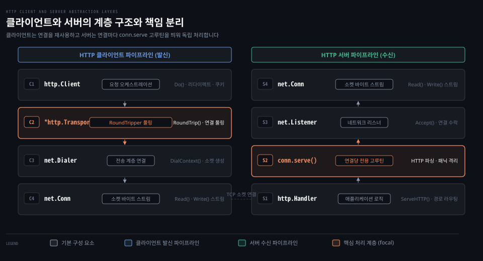

# Client·Transport·Server·Handler

---

> Go 의 net/http 패키지는 요청을 조합하고 전송하는 Client·Transport 발신 축과 연결을 수락해 처리하는 Server·Handler 수신 축이라는 두 개의 기둥으로 HTTP 프로토콜을 추상화합니다.

## 핵심 요약

> net/http 패키지는 요청 오케스트레이션을 맡는 Client·Transport 축과 연결 수락 및 요청 분배를 맡는 Server·Handler 축이라는 대칭 구조로 동작합니다. 하위 계층인 net 패키지의 Conn·Listener 소켓 추상화 위에 프로토콜 상태 관리와 고루틴 생명주기를 얹어 단순한 인터페이스 뒤로 복잡한 HTTP/1.1 및 HTTP/2 통신을 캡슐화합니다.

클라이언트 관점에서 `http.Client` 는 쿠키·리다이렉트·전체 타임아웃을 관리하며 단일 트랜잭션 전송은 `http.RoundTripper` 인터페이스를 만족하는 `*http.Transport` 에 위임합니다. `Transport` 는 하위 TCP 연결 풀을 캐싱하고 재사용하여 소켓 자원을 아낍니다.

서버 관점에서 `http.Server` 는 `net.Listener` 로부터 들어오는 TCP 소켓을 받아 연결마다 독립된 `conn.serve` 고루틴을 띄웁니다. 수신된 HTTP 요청은 `http.Handler` 인터페이스의 `ServeHTTP` 메서드로 전달되어 비즈니스 로직을 수행합니다. 두 축 모두 여러 고루틴에서 동시에 안전하게 호출되도록 설계되었습니다.


## 학습 목표

> 이 편을 읽고 나면 아래 다섯 가지를 스스로 해낼 수 있습니다.

1. `Client` 와 `RoundTripper`(`Transport`) 의 책임 경계와 동시성 안전성 계약을 설명할 수 있습니다.
2. `Server` 와 `Handler` 인터페이스의 역할 및 `conn.serve` 고루틴 디스패치 원리를 설명할 수 있습니다.
3. 클라이언트 `Client.Do` 호출부터 `Transport.RoundTrip` 및 `net.Conn` 으로 이어지는 발신 호출 경로를 추적할 수 있습니다.
4. 서버 `Server.Serve` 가 `net.Listener.Accept` 를 거쳐 `Handler.ServeHTTP` 로 진입하는 수신 호출 경로를 추적할 수 있습니다.
5. `Client` 와 `Transport` 인스턴스를 요청마다 새로 생성할 때 발생하는 연결 풀 파편화와 소켓 고갈 문제를 진단할 수 있습니다.


## 1. 클라이언트 파이프라인은 Client 와 Transport 로 역할을 나눕니다

> HTTP 요청 발신은 상위 정책을 조율하는 Client 와 단일 HTTP 왕복을 전담하는 RoundTripper(Transport) 로 나뉩니다.

아래 도식은 net/http 패키지의 클라이언트 발신 파이프라인과 서버 수신 파이프라인이 각각 하위 `net.Conn` 소켓 계층과 만나는 구조를 나타냅니다.



패키지 수준 함수인 `http.Get` 이나 `http.Post` 는 편리한 진입점이지만 내부적으로 기본 클라이언트 `DefaultClient` 를 거쳐 동작합니다. 세밀한 제어가 필요할 때 Go 는 `Client` 와 `Transport` 구조체를 분리하여 구성하도록 안내합니다.

### 공식 계약: Client 와 RoundTripper 의 분리와 재사용 원칙

패키지 개요 공식 문서는 제어가 필요한 경우 다음과 같이 [Client](https://pkg.go.dev/net/http#Client) 와 [Transport](https://pkg.go.dev/net/http#Transport) 를 생성하도록 규정합니다.

> "For control over HTTP client headers, redirect policy, and other settings, create a Client:"
>
> "For control over proxies, TLS configuration, keep-alives, compression, and other settings, create a Transport:"
>
> "Clients and Transports are safe for concurrent use by multiple goroutines and for efficiency should only be created once and re-used."
>
> — [net/http Package Overview](https://pkg.go.dev/net/http)

단일 HTTP 트랜잭션 실행은 [RoundTripper](https://pkg.go.dev/net/http#RoundTripper) 인터페이스로 추상화됩니다.

> "RoundTripper is an interface representing the ability to execute a single HTTP transaction, obtaining the Response for a given Request."
>
> "A RoundTripper must be safe for concurrent use by multiple goroutines."
>
> — [net/http RoundTripper](https://pkg.go.dev/net/http#RoundTripper)

`RoundTripper` 는 응답의 상태 코드를 해석하거나 리다이렉트·쿠키·인증과 같은 상위 프로토콜 절차를 처리하지 않습니다. 오직 단일 요청을 유선(wire)으로 보내고 응답을 받아오는 역할만 수행합니다. 리다이렉트 추적이나 쿠키 저장은 `Client` 계층의 고유 책임입니다.

호출자는 응답을 다 쓴 뒤 반드시 본문을 닫아야 합니다.

> "The caller must close the response body when finished with it:
> resp, err := http.Get("http://example.com/")
> if err != nil { /* handle error */ }
> defer resp.Body.Close()"
>
> — [net/http Package Overview](https://pkg.go.dev/net/http)

### 내부 동작: Client.Do 에서 Transport.RoundTrip 으로의 진입

클라이언트 요청의 진입점은 [`src/net/http/client.go:586`](https://github.com/golang/go/blob/go1.25.1/src/net/http/client.go#L586) 의 `Client.Do` 메서드입니다.

`Client.Do` 는 내부 `c.do(req)` 메서드를 호출하여 리다이렉트 루프를 시작합니다. 루프의 각 회차에서 [`src/net/http/client.go:174`](https://github.com/golang/go/blob/go1.25.1/src/net/http/client.go#L174) 의 `c.send` 및 `send` 함수가 호출됩니다.

`send` 함수([`src/net/http/client.go:211`](https://github.com/golang/go/blob/go1.25.1/src/net/http/client.go#L211))는 다음과 같은 초기화와 안전장치를 수행합니다.

1. 헤더가 nil 이면 원본 요청을 얕은 복사(`forkReq`)하고 `Header` 맵을 할당합니다.
2. URL 에 사용자 정보가 있으면 `Authorization` 기본 인증 헤더를 설정합니다.
3. 클라이언트 데드라인이 지정되어 있으면 `setRequestCancel` 을 통해 타이머와 컨텍스트 데드라인을 연결합니다.
4. `resp, err = rt.RoundTrip(req)` 를 호출하여 하위 `RoundTripper` 로 요청 처리를 넘깁니다.

기본적으로 `rt` 는 `*http.Transport` 타입인 `DefaultTransport` 입니다. `Transport` 는 내부 커넥션 풀에서 유휴 연결을 찾거나 새 TCP 소켓을 생성하여 데이터를 전송합니다. 구체적인 연결 풀 동작은 [02-01.Client·Transport](./02-01.Client·Transport.md) 편에서 상세히 다룹니다.

### 함정·관찰: 인스턴스 매번 생성에 따른 소켓 고갈

공식 문서가 명시하듯 `Client` 와 `Transport` 는 여러 고루틴이 공유하여 재사용하도록 설계되었습니다. 함수를 호출할 때마다 로컬 변수로 `client := &http.Client{Transport: &http.Transport{...}}` 를 새로 생성하면 치명적인 문제가 발생합니다.

각 `Transport` 는 독립된 TCP 커넥션 풀을 소유합니다. 새 인스턴스를 매번 만들면 앞선 요청에서 맺은 TCP 연결이 후속 요청에서 재사용되지 못하고 버려집니다. 그 결과 커널의 로컬 포트가 빠르게 소진되고 `TIME_WAIT` 소켓이 대량으로 누적됩니다.

외부 서비스와 통신할 때는 싱글톤이나 공유 패키지 변수로 `Client` 와 `Transport` 를 한 번만 생성하여 프로세스 수명 동안 재사용해야 합니다.


## 2. 서버 파이프라인은 Server 와 Handler 로 연결을 분배합니다

> HTTP 서버는 Listener 에서 TCP 소켓을 수락하는 Server 와 요청을 해석해 응답을 작성하는 Handler 로 나뉩니다.

클라이언트가 원격 서버로 능동적인 연결을 시도한다면 서버는 들어오는 수신 요청을 대기하고 수락해야 합니다. Go 표준 라이브러리는 [../net/02-02.Listen·ListenConfig·TCPListener.md](../net/02-02.Listen·ListenConfig·TCPListener.md) 편에서 다룬 `net.Listener` 추상화 위에 HTTP 서버 엔진을 구축했습니다.

### 공식 계약: Handler 인터페이스와 동시성 격리 보장

서버 측의 핵심 추상화는 [Handler](https://pkg.go.dev/net/http#Handler) 인터페이스입니다.

```go
type Handler interface {
    ServeHTTP(ResponseWriter, *Request)
}
```

공식 문서는 `Handler` 의 동작 계약을 다음과 같이 규정합니다.

> "A Handler responds to an HTTP request."
>
> "[Handler.ServeHTTP] should write reply headers and data to the ResponseWriter and then return. Returning signals that the request is finished; it is not valid to use the ResponseWriter or read from the [Request.Body] after or concurrently with the completion of the ServeHTTP call."
>
> "If ServeHTTP panics, the server (the caller of ServeHTTP) assumes that the effect of the panic was isolated to the active request. It recovers the panic, logs a stack trace to the server error log, and either closes the network connection or sends an HTTP/2 RST_STREAM, depending on the HTTP protocol."
>
> — [net/http Handler](https://pkg.go.dev/net/http#Handler)

`ServeHTTP` 가 반환되는 순간 해당 HTTP 요청의 처리는 공식적으로 종료됩니다. 반환 이후 또는 반환과 동시에 `ResponseWriter` 에 바이트를 쓰거나 `Request.Body` 를 읽는 행위는 규약 위반입니다.

또한 개별 핸들러 내부에서 패닉이 발생하더라도 서버 전체 프로세스가 종료되지 않습니다. 서버 엔진이 패닉을 복구(`recover`)하고 해당 연결만 끊거나 스트림을 재설정(RST_STREAM)하여 다른 요청에 영향을 주지 않도록 격리합니다.

가장 단순한 서버 구동 함수인 [ListenAndServe](https://pkg.go.dev/net/http#ListenAndServe) 는 주소와 핸들러를 받아 TCP 리스너를 열고 서버를 실행합니다.

> "ListenAndServe listens on the TCP network address addr and then calls Serve with handler to handle requests on incoming connections. Accepted connections are configured to enable TCP keep-alives."
>
> "ListenAndServe always returns a non-nil error."
>
> — [net/http ListenAndServe](https://pkg.go.dev/net/http#ListenAndServe)

더 정밀한 타임아웃과 버퍼 제어가 필요할 때는 [Server](https://pkg.go.dev/net/http#Server) 구조체를 직접 초기화하여 사용합니다.

### 내부 동작: Server.Serve 와 conn.serve 고루틴 디스패치

서버 실행의 핵심 루프는 [`src/net/http/server.go:3433`](https://github.com/golang/go/blob/go1.25.1/src/net/http/server.go#L3433) 의 `Server.Serve` 메서드에 있습니다.

```go
// src/net/http/server.go:3470
for {
    rw, err := l.Accept()
    if err != nil {
        // 일시적 네트워크 에러 시 지수 백오프 대기 후 재시도
        // ...
        return err
    }
    connCtx := ctx
    if cc := s.ConnContext; cc != nil {
        connCtx = cc(connCtx, rw)
    }
    tempDelay = 0
    c := s.newConn(rw)
    c.setState(c.rwc, StateNew, runHooks)
    go c.serve(connCtx);
}
```

1. `l.Accept()` 를 호출하여 커널 Accept 큐에 대기 중인 TCP 소켓(`net.Conn`)을 꺼냅니다. 연결 수락 메커니즘은 [../net/02-02.Listen·ListenConfig·TCPListener.md](../net/02-02.Listen·ListenConfig·TCPListener.md) 편을 참고합니다.
2. 수락된 소켓을 감싸는 내부 구조체 `c := s.newConn(rw)` 를 생성합니다.
3. `go c.serve(connCtx)` 문장을 통해 **새로운 고루틴을 즉시 생성**하여 연결 관리를 위임합니다.
4. `Serve` 루프는 지체 없이 다음 `Accept` 호출로 돌아가 대기합니다.

디스패치된 고루틴은 [`src/net/http/server.go:1930`](https://github.com/golang/go/blob/go1.25.1/src/net/http/server.go#L1930) 의 `conn.serve` 메서드를 실행합니다. `conn.serve` 는 연결에서 HTTP 요청 라인과 헤더를 파싱하고 `response` 구조체를 생성한 뒤 [`src/net/http/server.go:2109`](https://github.com/golang/go/blob/go1.25.1/src/net/http/server.go#L2109) 에서 비즈니스 핸들러를 호출합니다.

```go
// src/net/http/server.go:2109
serverHandler{c.server}.ServeHTTP(w, w.req)
```

`serverHandler` 는 `s.Handler` 가 nil 이면 기본 라우터인 `DefaultServeMux` 를 호출합니다. 핸들러 함수 실행이 끝나면 응답 버퍼를 플러시하고 HTTP keep-alive 조건이 충족되면 동일한 고루틴에서 다음 HTTP 요청을 대기합니다.

### 함정·관찰: ServeHTTP 반환 후의 비동기 자원 접근

핸들러 내부에서 무거운 작업을 별도 고루틴으로 넘길 때 자주 발생하는 실수가 있습니다.

```go
func handler(w http.ResponseWriter, r *http.Request) {
    go func() {
        // 버그: ServeHTTP 반환 후 w 에 쓰거나 r.Body 를 읽으려고 시도함
        data, _ := io.ReadAll(r.Body)
        w.Write(data)
    }()
}
```

`ServeHTTP` 가 반환되면 `conn.serve` 루프는 요청이 끝난 것으로 간주하고 내부 버퍼를 풀로 반환하며 `r.Body` 를 닫습니다. 백그라운드 고루틴이 나중에 `w` 나 `r.Body` 에 접근하면 `http: superfluous response.WriteHeader call` 경고가 발생하거나 닫힌 소켓 에러가 발생합니다.

비동기 작업이 필요하다면 `ServeHTTP` 가 반환되기 전에 `r.Body` 데이터를 미리 메모리로 읽어 복사해 두어야 하며 응답 쓰기는 핸들러가 반환되기 전에 동일 고루틴 흐름에서 완결해야 합니다. 상세한 미들웨어 구성 패턴은 [Learning Go 13-04](../../../book/lgo_learning-go/13-04.net-http%20%EB%8A%94%20%ED%83%80%EC%9E%84%EC%95%84%EC%9B%83%EC%9D%84%20%EC%A7%81%EC%A0%91%20%EC%A0%95%ED%95%98%EA%B3%A0%20%EB%AF%B8%EB%93%A4%EC%9B%A8%EC%96%B4%EB%8A%94%20Handler%20%EB%A5%BC%20%EA%B0%90%EC%8B%B8%EB%A9%B0%20slog%20%EB%A1%9C%20%EA%B5%AC%EC%A1%B0%ED%99%94%20%EB%A1%9C%EA%B7%B8%EB%A5%BC%20%EB%82%A8%EA%B9%81%EB%8B%88%EB%8B%A4.md) 편을 참고합니다.
