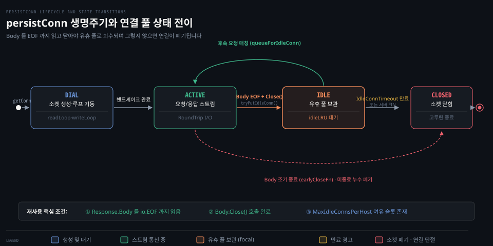

# Client·Transport

---

> Go 의 HTTP 클라이언트는 상위 트랜잭션 흐름을 관장하는 Client 와 TCP 지속 연결(keep-alive) 풀을 관리하는 Transport 로 계층을 분리해 소켓 자원을 보존합니다.

## 핵심 요약

> Client 와 Transport 는 HTTP 통신의 고수준 오케스트레이션과 저수준 커넥션 풀링을 분리하여 안전하고 효율적인 지속 연결을 보장합니다. Transport 는 내부에 호스트별 유휴 연결 큐와 전용 I/O 루프를 둔 persistConn 구조체를 유지하여 매 요청마다 TCP 핸드셰이크를 반복하는 비용을 제거합니다.

이 재사용 메커니즘이 원활히 동작하려면 호출자가 `Response.Body` 를 반드시 `io.EOF` 까지 모두 읽고 닫아야 합니다. 본문을 끝까지 소비하지 않으면 내부 `readLoop` 고루틴이 유휴 큐로 소켓을 회수하지 못하고 연결을 버립니다.

또한 기본 설정에서 호스트당 유휴 연결 한도(`DefaultMaxIdleConnsPerHost`)는 2개에 불과합니다. 높은 동시성을 요구하는 분산 환경에서는 이 한도를 적절히 늘리지 않으면 지속 연결이 즉시 파기되어 소켓 고갈이 일어납니다.


## 학습 목표

> 이 편을 읽고 나면 아래 다섯 가지를 스스로 해낼 수 있습니다.

1. `Client` 구조체와 `Transport` 구조체의 핵심 필드별 역할과 책임을 구분할 수 있습니다.
2. `Transport` 내부의 `getConn`, `queueForIdleConn`, `tryPutIdleConn` 커넥션 풀링 흐름을 설명할 수 있습니다.
3. `persistConn` 의 생명주기와 `readLoop`, `writeLoop` 고루틴의 동작 방식을 설명할 수 있습니다.
4. `Response.Body` 를 `io.EOF` 까지 다 읽고 닫아야만 소켓이 재사용되는 소스 코드 수준의 근거를 설명할 수 있습니다.
5. 기본값 `DefaultMaxIdleConnsPerHost = 2` 가 대규모 동시 요청 환경에서 유발하는 소켓 재연결 문제를 진단하고 튜닝할 수 있습니다.


## 1. Transport 는 커넥션 풀을 관리해 지속 연결을 유지합니다

> HTTP 요청마다 소켓을 열고 닫으면 핸드셰이크 지연과 포트 고갈이 발생하므로 Transport 가 연결 풀을 유지합니다.

아래 도식은 단일 TCP 연결을 추상화한 `persistConn` 이 생성되어 요청을 처리하고 유휴 풀에 보관되거나 폐기되는 전체 상태 전이를 나타냅니다.



HTTP/1.1 은 동일 호스트에 대한 반복 요청에서 연결을 끊지 않고 재사용하는 keep-alive 를 기본으로 지원합니다. Go 의 [Transport](https://pkg.go.dev/net/http#Transport) 는 이 지속 연결을 캐싱하여 다음 요청에 즉시 투입합니다.

### 공식 계약: 연결 풀 제어 필드와 기본값

[Client](https://pkg.go.dev/net/http#Client) 구조체는 상위 정책을 정의합니다.

```go
type Client struct {
    Transport     RoundTripper
    CheckRedirect func(req *Request, via []*Request) error
    Jar           CookieJar
    Timeout       time.Duration
}
```

실제 네트워크 연결의 수명과 풀링 설정은 [Transport](https://pkg.go.dev/net/http#Transport) 의 필드가 담당합니다.

```go
type Transport struct {
    DialContext           func(ctx context.Context, network, addr string) (net.Conn, error)
    DisableKeepAlives     bool
    MaxIdleConns          int
    MaxIdleConnsPerHost   int
    MaxConnsPerHost       int
    IdleConnTimeout       time.Duration
    ForceAttemptHTTP2     bool
    // ...
}
```

공식 문서는 연결 풀링의 동작 규칙을 다음과 같이 명시합니다.

> "By default, Transport caches connections for future re-use. This may leave many open connections when accessing many hosts. This behavior can be managed using Transport.CloseIdleConnections method and the [Transport.MaxIdleConnsPerHost] and [Transport.DisableKeepAlives] fields."
>
> — [net/http Transport](https://pkg.go.dev/net/http#Transport)

호스트당 보관할 수 있는 유휴 연결 수의 기본값은 [DefaultMaxIdleConnsPerHost](https://pkg.go.dev/net/http#DefaultMaxIdleConnsPerHost) 상수가 규정합니다.

```go
const DefaultMaxIdleConnsPerHost = 2
```

`MaxIdleConns` 는 전체 호스트를 통틀어 유지할 수 있는 유휴 연결의 총합입니다. 반면 `MaxIdleConnsPerHost` 는 특정 호스트(`host:port`) 단위로 남겨둘 유휴 연결의 최대치입니다. `MaxConnsPerHost` 는 유휴·활성 상태를 모두 합친 호스트당 최대 연결 한도이며 이 한도에 도달하면 신규 다이얼이 블로킹됩니다.

### 내부 동작: getConn 과 persistConn 고루틴 쌍

`Transport.RoundTrip` 이 호출되면 내부적으로 [`src/net/http/transport.go:1484`](https://github.com/golang/go/blob/go1.25.1/src/net/http/transport.go#L1484) 의 `getConn` 메서드를 실행합니다.

1. 먼저 [`src/net/http/transport.go:1148`](https://github.com/golang/go/blob/go1.25.1/src/net/http/transport.go#L1148) 의 `queueForIdleConn` 을 호출하여 내부 `idleConn` 맵에서 유휴 상태인 `persistConn` 을 조회합니다.
2. 캐시된 유휴 연결이 유효하면 해당 연결을 즉시 반환받아 재사용합니다.
3. 재사용 가능한 연결이 없으면 `t.dialConn` 을 호출하여 [../net/02-01.Dial·Dialer.md](../net/02-01.Dial·Dialer.md) 편의 다이얼러로 새 소켓을 엽니다.
4. 소켓이 열리면 [`src/net/http/transport.go:2065`](https://github.com/golang/go/blob/go1.25.1/src/net/http/transport.go#L2065) 의 `persistConn` 구조체를 생성하고 두 개의 전용 고루틴을 띄웁니다.
   - `go pconn.readLoop();` ([`src/net/http/transport.go:2239`](https://github.com/golang/go/blob/go1.25.1/src/net/http/transport.go#L2239)): 소켓에서 응답 헤더와 본문을 읽어 들입니다.
   - `go pconn.writeLoop();` ([`src/net/http/transport.go:2594`](https://github.com/golang/go/blob/go1.25.1/src/net/http/transport.go#L2594)): 요청 채널로부터 요청을 받아 소켓으로 전송합니다.

하나의 TCP 연결마다 읽기와 쓰기를 전담하는 고루틴 쌍이 독립적으로 루프를 돌며 HTTP 파이프라인 통신을 수행합니다.

### 함정·관찰: DefaultMaxIdleConnsPerHost=2 로 인한 소켓 폭증

`DefaultMaxIdleConnsPerHost` 의 기본값 2는 단일 클라이언트가 하나의 서버로 수십 개 이상의 동시 요청을 보낼 때 치명적인 성능 저하를 부릅니다.

예를 들어 특정 API 서버로 50개의 동시 요청이 발생하면 `Transport` 는 50개의 TCP 소켓을 생성합니다. 50개의 요청이 모두 완료되어 풀로 돌아갈 때 `MaxIdleConnsPerHost` 가 기본값인 2로 남아 있으면 단 2개의 연결만 유휴 큐에 보관되고 나머지 48개의 연결은 즉시 닫힙니다.

이어서 다음 50개의 요청이 들어오면 유휴 연결 2개만 재사용되고 나머지 48개는 다시 3-way 핸드셰이크를 거쳐 새로 맺어야 합니다. 이 과정이 반복되면 수많은 소켓이 `TIME_WAIT` 상태로 쌓여 커널 로컬 포트가 고갈되고 불필요한 네트워크 왕복 지연이 누적됩니다.

마이크로서비스 간 통신이나 백엔드 연동 클라이언트에서는 예상 동시성 수준에 맞춰 `MaxIdleConnsPerHost` 를 최소 동시 요청 수 이상으로 설정해야 합니다.


## 2. Response.Body 를 완전히 소비해야 연결이 풀로 반환됩니다

> HTTP/1.1 연결 재사용은 응답 바이트 스트림이 완전히 끝났음을 확인하는 절차에 종속됩니다.

소켓 스트림에서 이전 응답의 바이트가 남아 있는 상태에서 다음 요청을 전송하면 응답 데이터가 뒤섞이게 됩니다. 따라서 표준 라이브러리는 응답 본문이 끝까지 읽혔는지 엄격하게 검증합니다.

### 공식 계약: Body 종료와 지속 연결 재사용의 인과 관계

공식 문서 [Response](https://pkg.go.dev/net/http#Response) 는 본문 소비 의무를 명확히 선언합니다.

> "The http Client and Transport guarantee that Body is always non-nil, even on responses without a body or responses with a zero-length body. It is the caller's responsibility to close Body. The default HTTP client's Transport may not reuse HTTP/1.x "keep-alive" TCP connections if the Body is not read to completion and closed."
>
> — [net/http Response](https://pkg.go.dev/net/http#Response)

응답에 본문이 없거나 길이가 0이어도 `resp.Body` 는 항상 non-nil 이며 호출자가 반드시 닫아야 합니다. 본문을 끝까지 읽지 않고 닫으면 기본 `Transport` 는 지속 연결을 재사용하지 못합니다.

### 내부 동작: bodyEOFSignal 과 readLoop 의 회수 조건

표준 라이브러리는 이 규칙을 보장하기 위해 [`src/net/http/transport.go:2975`](https://github.com/golang/go/blob/go1.25.1/src/net/http/transport.go#L2975) 의 `bodyEOFSignal` 구조체를 사용합니다.

```go
// src/net/http/transport.go:2975
type bodyEOFSignal struct {
    body         io.ReadCloser
    mu           sync.Mutex
    closed       bool
    rerr         error
    fn           func(error) error
    earlyCloseFn func() error
}
```

`readLoop` 는 응답을 생성할 때 원본 본문을 `bodyEOFSignal` 로 감싸서 반환합니다([`src/net/http/transport.go:2355`](https://github.com/golang/go/blob/go1.25.1/src/net/http/transport.go#L2355)).

1. 호출자가 `resp.Body.Read` 를 반복하여 본문의 끝에 도달하면 `fn` 콜백이 실행되고 `waitForBodyRead <- true` 신호를 보냅니다.
2. 본문을 다 읽지 않은 채 `resp.Body.Close()` 를 호출하면 `earlyCloseFn` 이 실행되어 `waitForBodyRead <- false` 신호를 보냅니다.
3. `readLoop` 는 이 신호를 대기합니다([`src/net/http/transport.go:2395`](https://github.com/golang/go/blob/go1.25.1/src/net/http/transport.go#L2395)).

```go
// src/net/http/transport.go:2395
select {
case bodyEOF := <-waitForBodyRead:
    alive = alive &&
        bodyEOF &&
        !pc.sawEOF &&
        pc.wroteRequest() &&
        tryPutIdleConn(rc.treq)
    if bodyEOF {
        eofc <- struct{}{}
    }
case <-rc.treq.ctx.Done():
    alive = false
    pc.cancelRequest(context.Cause(rc.treq.ctx))
case <-pc.closech:
    alive = false
}
```

`bodyEOF` 가 `false` 이면 `alive` 변수가 `false` 가 됩니다. 그 결과 [`src/net/http/transport.go:1052`](https://github.com/golang/go/blob/go1.25.1/src/net/http/transport.go#L1052) 의 `tryPutIdleConn` 이 유휴 풀에 연결을 넣지 않거나 루프가 즉시 종료되어 소켓이 닫힙니다.

반대로 호출자가 `resp.Body.Close()` 를 아예 호출하지 않으면 `waitForBodyRead` 채널에서 신호가 오지 않아 `readLoop` 고루틴이 영구히 대기 상태에 갇힙니다. 연결도 유휴 풀로 돌아가지 못하고 누수됩니다.

### 함정·관찰: io.Copy 와 Discard 를 활용한 올바른 소비 패턴

응답 본문의 내용이 비즈니스 로직에 필요하지 않더라도 지속 연결을 재사용하려면 본문을 끝까지 비워야 합니다.

```go
resp, err := client.Get("https://api.example.com/health")
if err != nil {
    return err
}
// 올바른 소비 패턴: 잔여 본문을 모두 버리고 닫음
_, _ = io.Copy(io.Discard, resp.Body)
_ = resp.Body.Close()
```

본문을 읽지 않고 `resp.Body.Close()` 만 호출하면 `earlyCloseFn` 에 의해 TCP 연결이 즉시 파기됩니다. 반면 `io.Copy(io.Discard, resp.Body)` 로 잔여 바이트를 끝까지 읽어 내면 `io.EOF` 가 발생하여 `persistConn` 이 안전하게 유휴 풀로 회수됩니다.

연결이 제때 풀로 회수되지 않아 발생하는 FD 누수와 고루틴 정체 문제는 [gonet-lab 01-01](../../../../02_os/project/gonet-lab/01-01.%EC%A1%B0%EC%9A%A9%ED%95%9C%20%EC%97%B0%EA%B2%B0%EC%9D%B4%20%EC%84%9C%EB%B2%84%EB%A5%BC%20%EB%A9%88%EC%B6%98%EB%8B%A4%20-%20goroutine%C2%B7FD%C2%B7idle%20timeout.md) 편에서 다룬 관찰 결과와 일치합니다.
