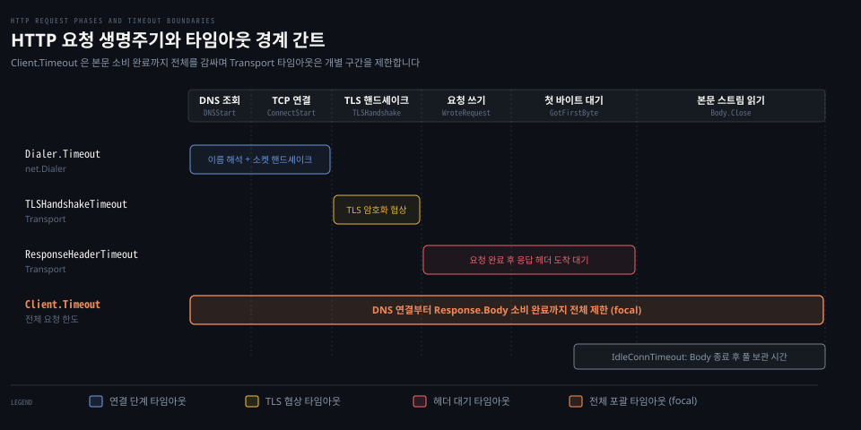

# Client.Timeout·Transport 타임아웃·httptrace

---

> Go 의 HTTP 클라이언트는 전체 트랜잭션을 포괄하는 Client.Timeout 과 네트워크 구간별 경계를 제어하는 Transport 타임아웃, 그리고 각 단계를 정밀하게 관측하는 httptrace 훅을 제공합니다.

## 핵심 요약

> Client.Timeout 은 요청 발신부터 응답 본문 소비 완료까지 전체 구간을 포괄하며, Transport 의 세부 타임아웃과 httptrace 훅은 개별 네트워크 단계를 정밀하게 감시하고 제한합니다. Client 수준의 한도는 단일 타이머로 리다이렉트와 본문 읽기까지 묶어 다루지만, 대용량 스트리밍 환경에서는 세부 구간 타임아웃을 분리 설정해야 연결 중단을 방지할 수 있습니다.

HTTP 요청은 DNS 조회·TCP 핸드셰이크·TLS 암호화 협상·요청 전송·서버 응답 대기·본문 수신이라는 여러 단계를 순차적으로 거칩니다. [../net/03-02.SetDeadline·SetReadDeadline·SetWriteDeadline.md](../net/03-02.SetDeadline·SetReadDeadline·SetWriteDeadline.md) 편에서 다룬 소켓 데드라인이 저수준 I/O 를 제어한다면, net/http 는 이 위에 프로토콜 특화 타임아웃 계층을 얹었습니다.

네트워크 장애가 발생했을 때 병목의 원인이 DNS 인지, TCP 연결 지연인지, 서버의 연산 지연인지 파악하려면 `httptrace.ClientTrace` 이벤트를 요청 컨텍스트에 주입하여 각 구간의 시각을 계측해야 합니다.


## 학습 목표

> 이 편을 읽고 나면 아래 다섯 가지를 스스로 해낼 수 있습니다.

1. `Client.Timeout` 이 감싸는 전체 시간 경계와 `Response.Body` 읽기 중단 동작을 설명할 수 있습니다.
2. `Transport` 의 세부 타임아웃 필드(`TLSHandshakeTimeout`, `ResponseHeaderTimeout`, `IdleConnTimeout`)의 적용 구간을 구분할 수 있습니다.
3. `client.go` 내부에서 `setRequestCancel` 함수가 `context.WithDeadline` 을 통해 요청을 취소하는 원리를 추적할 수 있습니다.
4. `httptrace.ClientTrace` 의 주요 훅(`GetConn`, `DNSStart`, `ConnectStart`, `GotFirstResponseByte`)을 등록해 구간 지연을 계측할 수 있습니다.
5. 대용량 스트리밍 수신 시 `Client.Timeout` 설정으로 인해 본문 다운로드가 조기 종료되는 함정을 방지할 수 있습니다.


## 1. Client.Timeout 은 본문 소비 완료까지 전체 구간을 제한합니다

> 단일 요청의 전체 수명을 제어하는 상위 타임아웃과 프로토콜 구간별 지연을 제어하는 하위 타임아웃은 범위가 다릅니다.

아래 도식은 HTTP 요청의 6단계 생명주기와 각 타임아웃 설정이 적용되는 유효 범위를 비교한 간트 차트입니다.



네트워크 프로그래밍에서 타임아웃의 범위를 잘못 설정하면 정상적인 데이터 수신이 중간에 취소되거나 반대로 장애 상황에서 스레드가 무한히 대기할 수 있습니다.

### 공식 계약: Client.Timeout 과 Transport 타임아웃 필드

공식 문서 [Client](https://pkg.go.dev/net/http#Client) 는 `Timeout` 필드의 동작 범위를 명확히 규정합니다.

> "Timeout specifies a time limit for requests made by this Client. The timeout includes connection time, any redirects, and reading the response body. The timer remains running after Get, Head, Post, or Do return and will interrupt reading of the Response.Body."
>
> "A Timeout of zero means no timeout."
>
> "The Client cancels requests to the underlying Transport as if the Request's Context ended."
>
> — [net/http Client](https://pkg.go.dev/net/http#Client)

`Client.Timeout` 은 연결 시간뿐 아니라 모든 리다이렉트와 `Response.Body` 를 읽는 시간까지 포함합니다. 함수가 반환된 후에도 타이머는 계속 흐르며 한도를 초과하면 본문 읽기를 강제로 중단시킵니다.

반면 [Transport](https://pkg.go.dev/net/http#Transport) 구조체는 네트워크 단계별로 특화된 세부 타임아웃 필드를 제공합니다.

- `DialContext`: [../net/02-01.Dial·Dialer.md](../net/02-01.Dial·Dialer.md) 편의 `net.Dialer.Timeout` 을 적용하여 DNS 해석과 TCP 연결 시간을 제한합니다.
- `TLSHandshakeTimeout`: TLS 핸드셰이크를 완료하는 데 허용되는 최대 대기 시간입니다.
- `ResponseHeaderTimeout`: 요청 전송(본문 포함)을 완료한 시점부터 서버의 첫 응답 헤더가 도착할 때까지의 대기 시간입니다. 응답 본문을 읽는 시간은 포함되지 않습니다.
- `ExpectContinueTimeout`: `Expect: 100-continue` 헤더를 보낸 후 서버의 승인을 기다리는 대기 시간입니다.
- `IdleConnTimeout`: 유휴 연결이 풀 안에서 닫히지 않고 대기할 수 있는 최대 보관 시간입니다.

요청 단위로 독립된 타임아웃을 부여할 때는 `http.NewRequestWithContext` 로 생성한 컨텍스트 데드라인을 사용합니다.

### 내부 동작: setRequestCancel 과 컨텍스트 데드라인의 결합

`Client.Do` 가 호출되면 [`src/net/http/client.go:351`](https://github.com/golang/go/blob/go1.25.1/src/net/http/client.go#L351) 의 `setRequestCancel` 함수가 실행됩니다.

```go
// src/net/http/client.go:351
func setRequestCancel(req *Request, rt RoundTripper, deadline time.Time) (stopTimer func(), didTimeout func() bool) {
    if deadline.IsZero() {
        return nop, alwaysFalse
    }
    oldCtx := req.Context()
    if timeBeforeContextDeadline(deadline, oldCtx) {
        var cancelCtx func()
        req.ctx, cancelCtx = context.WithDeadline(oldCtx, deadline)
        return cancelCtx, func() bool { return time.Now().After(deadline) }
    }
    // ...
}
```

클라이언트에 `Timeout` 이 지정되어 있으면 내부에서 절대 시각인 `deadline` 을 산출합니다. `setRequestCancel` 은 원본 요청 컨텍스트에 해당 데드라인을 결합한 새 파생 컨텍스트(`context.WithDeadline`)를 요청 구조체에 주입합니다.

하위 `Transport` 는 이 요청 컨텍스트의 취소 신호(`req.Context().Done()`)를 감시합니다. 시간이 만료되면 컨텍스트가 닫히고 소켓에 데드라인 에러가 전달되어 I/O 가 즉시 중단됩니다.

각 `Transport` 타임아웃 역시 소스 내부의 지정된 위치에서 감시 타이머를 작동시킵니다.

- `TLSHandshakeTimeout`: [`src/net/http/transport.go:1694`](https://github.com/golang/go/blob/go1.25.1/src/net/http/transport.go#L1694) 에서 TLS 핸드셰이크 직전에 설정됩니다.
- `ResponseHeaderTimeout`: [`src/net/http/transport.go:2842`](https://github.com/golang/go/blob/go1.25.1/src/net/http/transport.go#L2842) 에서 요청 쓰기 완료 직후 헤더 수신 대기용 타이머가 동작합니다.
- `IdleConnTimeout`: [`src/net/http/transport.go:1134`](https://github.com/golang/go/blob/go1.25.1/src/net/http/transport.go#L1134) 에서 `tryPutIdleConn` 이 소켓을 풀에 넣을 때 `time.AfterFunc` 로 `closeConnIfStillIdle` 타이머를 등록합니다.

### 함정·관찰: 스트리밍 다운로드에서 Client.Timeout 오용

`Client.Timeout` 설정의 가장 흔한 함정은 수 GB 크기의 대용량 파일 다운로드나 SSE(Server-Sent Events) 스트리밍 수신에 전체 타임아웃을 적용하는 것입니다.

`client := &http.Client{Timeout: 30 * time.Second}` 로 설정된 클라이언트로 대용량 파일을 받으면 문제가 생깁니다. 전송에 1분이 걸리는 파일이라면 30초가 지나는 순간 `resp.Body.Read` 가 `context deadline exceeded` 에러를 내며 끊어집니다.

장기 스트리밍이나 대용량 파일 다운로드에서는 `Client.Timeout` 을 0(무제한)으로 두어야 합니다. 대신 `Transport.ResponseHeaderTimeout` 으로 첫 헤더 지연만 방어하거나 개별 읽기마다 데드라인을 갱신해야 합니다. 관련 설계 패턴은 [Learning Go 13-04](../../../book/lgo_learning-go/13-04.net-http%20%EB%8A%94%20%ED%83%80%EC%9E%84%EC%95%84%EC%9B%83%EC%9D%84%20%EC%A7%81%EC%A0%91%20%EC%A0%95%ED%95%98%EA%B3%A0%20%EB%AF%B8%EB%93%A4%EC%9B%A8%EC%96%B4%EB%8A%94%20Handler%20%EB%A5%BC%20%EA%B0%90%EC%8B%B8%EB%A9%B0%20slog%20%EB%A1%9C%20%EA%B5%AC%EC%A1%B0%ED%99%94%20%EB%A1%9C%EA%B7%B8%EB%A5%BC%20%EB%82%A8%EA%B9%81%EB%8B%88%EB%8B%A4.md) 편을 참고합니다.


## 2. httptrace 로 요청의 각 단계 소요 시간을 분해합니다

> 타임아웃 에러가 발생했을 때 장애가 발생한 정확한 구간을 식별하려면 내부 이벤트 추적이 필요합니다.

단순히 `context deadline exceeded` 에러만 수신해서는 원격 DNS 서버가 느린 것인지, 로컬 방화벽에서 TCP SYN 이 유실된 것인지, 대상 서버 애플리케이션의 처리가 지연된 것인지 판별할 수 없습니다.

### 공식 계약: ClientTrace 훅과 컨텍스트 주입

표준 라이브러리는 [net/http/httptrace](https://pkg.go.dev/net/http/httptrace) 패키지를 통해 정밀한 추적 인터페이스를 제공합니다.

> "Package httptrace provides mechanisms to trace the events within HTTP client requests."
>
> "ClientTrace is a set of hooks to run at various stages of an outgoing HTTP request. Any particular hook may be nil. Functions may be called concurrently from different goroutines and some may be called after the request has completed or failed."
>
> — [net/http/httptrace ClientTrace](https://pkg.go.dev/net/http/httptrace#ClientTrace)

핵심 추적 구조체인 [ClientTrace](https://pkg.go.dev/net/http/httptrace#ClientTrace) 는 다음과 같은 단계별 콜백 함수들을 포함합니다.

- `GetConn(hostPort string)`: 커넥션 풀 조회 또는 소켓 생성을 시작하기 직전에 호출됩니다.
- `GotConn(GotConnInfo)`: 연결을 성공적으로 획득했을 때 호출됩니다. `GotConnInfo.Reused` 필드를 통해 기존 연결을 재사용했는지 여부를 알 수 있습니다.
- `PutIdleConn(err error)`: 사용이 끝난 연결을 유휴 풀에 반환할 때 호출됩니다.
- `DNSStart(DNSStartInfo)` / `DNSDone(DNSDoneInfo)`: DNS 질의의 시작과 종료 시점에 호출됩니다.
- `ConnectStart(network, addr string)` / `ConnectDone(network, addr string, err error)`: TCP 소켓 다이얼의 시작과 완료 시점에 호출됩니다.
- `TLSHandshakeStart()` / `TLSHandshakeDone(tls.ConnectionState, error)`: TLS 협상의 시작과 완료 시점에 호출됩니다.
- `WroteHeaders()` / `WroteRequest(WroteRequestInfo)`: 요청 헤더와 전체 요청 본문 전송이 완료된 시점에 호출됩니다.
- `GotFirstResponseByte()`: 서버 응답 헤더의 첫 번째 바이트를 수신한 순간 호출됩니다(TTFB 계측 지점).

### 내부 동작: Transport 파이프라인의 훅 트리거

`httptrace.WithClientTrace(ctx, trace)` 를 통해 컨텍스트에 등록된 추적 객체는 `Transport` 파이프라인 전반에서 추출되어 실행됩니다.

1. `Transport.RoundTrip` 진입 시 [`src/net/http/transport.go:585`](https://github.com/golang/go/blob/go1.25.1/src/net/http/transport.go#L585) 에서 `trace := httptrace.ContextClientTrace(ctx)` 를 꺼냅니다.
2. `getConn` 시작 시 [`src/net/http/transport.go:1489`](https://github.com/golang/go/blob/go1.25.1/src/net/http/transport.go#L1489) 에서 `trace.GetConn(cm.addr())` 을 호출합니다.
3. 유휴 연결을 재사용하거나 신규 다이얼이 완료되면 `trace.GotConn` 을 호출하여 연결 재사용 여부를 전달합니다.
4. 신규 연결 생성 시 [`src/net/http/transport.go:1746`](https://github.com/golang/go/blob/go1.25.1/src/net/http/transport.go#L1746) 부근에서 `ConnectStart`, `ConnectDone`, `TLSHandshakeStart`, `TLSHandshakeDone` 이 순차적으로 호출됩니다.
5. 응답 수신 시 [`src/net/http/transport.go:2286`](https://github.com/golang/go/blob/go1.25.1/src/net/http/transport.go#L2286) 에서 `pc.readResponse` 를 진행하며 첫 응답 바이트를 읽는 순간 `trace.GotFirstResponseByte` 가 트리거됩니다.

### 함정·관찰: 구간 계측을 활용한 실무 지연 진단

`ClientTrace` 를 구성하면 요청의 전체 소요 시간을 각 단계별 밀리초 단위로 분해할 수 있습니다.

```go
trace := &httptrace.ClientTrace{
    DNSStart: func(info httptrace.DNSStartInfo) {
        // DNS 조회 시작 시각 기록
    },
    DNSDone: func(info httptrace.DNSDoneInfo) {
        // DNS 조회 완료 시각 기록
    },
    GotConn: func(info httptrace.GotConnInfo) {
        // info.Reused 가 true 이면 기존 연결 풀 재사용
    },
    GotFirstResponseByte: func() {
        // TTFB(Time to First Byte) 기록: 서버 비즈니스 연산 지연 확인
    },
}
req = req.WithContext(httptrace.WithClientTrace(req.Context(), trace))
```

이를 통해 "타임아웃이 발생했으나 `GotConn` 은 1ms 만에 완료되었고 `GotFirstResponseByte` 가 오지 않은 채 데드라인에 도달했다"는 진단이 가능해집니다. 이 경우 네트워크 연결이나 DNS 의 문제가 아니라 대상 서버의 애플리케이션 처리 지연이 원인임을 명확히 특정할 수 있습니다.
