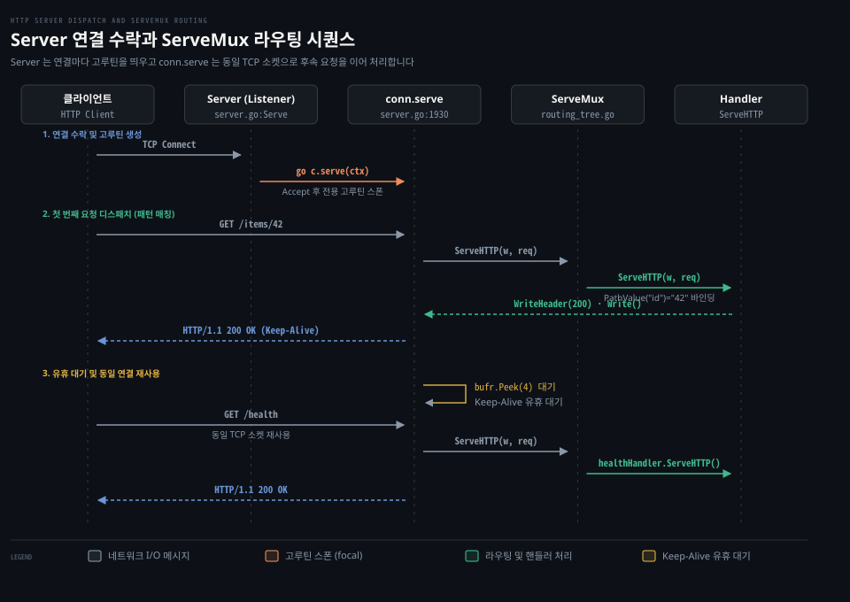

# Server·ServeMux·Handler

---

> Go HTTP 서버는 수신 소켓마다 전용 고루틴을 띄워 독립 처리하며 ServeMux 는 메서드와 와일드카드 경로를 결정 트리로 해석해 최적의 핸들러로 분배합니다.

## 핵심 요약

> Server 는 수락한 TCP 연결마다 conn.serve 고루틴을 생성해 동시성을 확보하고 ServeMux 는 Go 1.22 패턴 매칭 트리로 요청을 라우팅해 비즈니스 로직과 네트워크 프로토콜을 깔끔하게 분리합니다. 단일 연결 안에서 처리되는 각 HTTP 요청은 Handler 인터페이스의 규약을 엄격히 따르며 핸들러 내부에서 패닉이 일어나더라도 서버 전체는 멈추지 않고 해당 연결만 격리해 닫습니다.

소켓 수락을 전담하는 `http.Server` 는 하위 `net.Listener` 계층과 애플리케이션 비즈니스 계층 사이에 위치합니다. 서버 엔진은 연결 수락 루프와 프로토콜 파싱만을 책임지며 실제 비즈니스 응답은 `http.Handler` 구현체로 완전히 위임합니다.

Go 1.22 부터 개선된 `http.ServeMux` 는 HTTP 메서드 접두사와 경로 와일드카드 세그먼트 그리고 종단 매칭 문법을 표준으로 지원합니다. 등록된 패턴 간의 우선순위는 더 구체적인 패턴이 이기는 규칙을 따르며 `Request.PathValue` 를 통해 URL 경로 변수를 손쉽게 추출할 수 있습니다.


## 학습 목표

> 이 편을 읽고 나면 아래 다섯 가지를 스스로 해낼 수 있습니다.

1. `Server.Serve` 의 연결 수락 루프와 `conn.serve` 고루틴 스폰 구조를 설명할 수 있습니다.
2. `Handler` 인터페이스와 `ResponseWriter` 의 상태 전이 및 수명주기 계약을 정의할 수 있습니다.
3. `ServeMux` 의 Go 1.22 패턴 문법(메서드 접두사, 와일드카드, `{$}`)과 구체성 우선순위 규칙을 설명할 수 있습니다.
4. `server.go` 내부에서 `serverHandler` 가 nil 설정을 감지해 `DefaultServeMux` 로 디스패치하는 과정을 추적할 수 있습니다.
5. 핸들러 패닉 격리 동작과 `ResponseWriter` 헤더 작성 타이밍 위반 오류를 진단하고 방지할 수 있습니다.


## 1. Server 와 Handler 는 연결 수락과 요청 처리를 분리합니다

> 네트워크 소켓 수명주기를 통제하는 Server 와 개별 HTTP 트랜잭션을 처리하는 Handler 는 명확한 인터페이스로 격리됩니다.

아래 도식은 클라이언트가 서버에 접속하여 첫 번째 요청을 보내고 동일한 TCP 연결로 후속 요청을 처리하는 생명주기를 나타냅니다.



네트워크 애플리케이션에서 연결 관리와 비즈니스 처리가 한곳에 얽히면 동시성 제어와 장애 격리가 급격히 복잡해집니다. Go 는 이 문제를 연결 단위 고루틴 스폰과 단일 함수 인터페이스 규약으로 해결했습니다.

### 공식 계약: Handler 와 ResponseWriter 수명주기 규약

공식 문서 [Handler](https://pkg.go.dev/net/http#Handler) 는 HTTP 요청을 처리하는 기본 인터페이스입니다.

```go
type Handler interface {
    ServeHTTP(ResponseWriter, *Request)
}
```

공식 문서는 `Handler.ServeHTTP` 의 동작 계약을 다음과 같이 엄격하게 규정합니다.

> "A Handler responds to an HTTP request."
>
> "[Handler.ServeHTTP] should write reply headers and data to the ResponseWriter and then return. Returning signals that the request is finished; it is not valid to use the ResponseWriter or read from the [Request.Body] after or concurrently with the completion of the ServeHTTP call."
>
> "If ServeHTTP panics, the server (the caller of ServeHTTP) assumes that the effect of the panic was isolated to the active request. It recovers the panic, logs a stack trace to the server error log, and either closes the network connection or sends an HTTP/2 RST_STREAM, depending on the HTTP protocol. To abort a handler so the client sees an interrupted response but the server doesn't log an error, panic with the value ErrAbortHandler."
>
> — [net/http Handler](https://pkg.go.dev/net/http#Handler)

`ServeHTTP` 호출이 반환되는 시점은 해당 요청 처리가 완전히 끝났음을 엔진에 알리는 신호입니다. 반환 이후 또는 반환과 동시에 `ResponseWriter` 에 접근하거나 `Request.Body` 를 읽는 것은 허용되지 않습니다.

일반 함수를 핸들러로 등록할 때는 [HandlerFunc](https://pkg.go.dev/net/http#HandlerFunc) 어댑터 타입을 사용합니다.

> "The HandlerFunc type is an adapter to allow the use of ordinary functions as HTTP handlers. If f is a function with the appropriate signature, HandlerFunc(f) is a Handler that calls f."
>
> — [net/http HandlerFunc](https://pkg.go.dev/net/http#HandlerFunc)

응답을 작성하는 [ResponseWriter](https://pkg.go.dev/net/http#ResponseWriter) 는 헤더 조작과 상태 코드 전송 그리고 본문 쓰기를 관할합니다.

> "Changing the header map after a call to [ResponseWriter.WriteHeader] (or [ResponseWriter.Write]) has no effect unless the HTTP status code was of the 1xx class or the modified headers are trailers."
>
> "If [ResponseWriter.WriteHeader] has not yet been called, Write calls WriteHeader(http.StatusOK) before writing the data."
>
> — [net/http ResponseWriter](https://pkg.go.dev/net/http#ResponseWriter)

헤더 맵은 반드시 첫 번째 `WriteHeader` 또는 `Write` 호출 전에 변경해야 합니다. 명시적으로 상태 코드를 적지 않고 곧바로 본문을 쓰면 서버 엔진이 암묵적으로 `WriteHeader(http.StatusOK)` 를 먼저 전송합니다.

미들웨어는 표준 `Handler` 인터페이스를 인자로 받아 새로운 `Handler` 를 돌려주는 함수 형태로 구현합니다. 구체적인 미들웨어 체이닝 방식은 [Learning Go 13-04](../../../book/lgo_learning-go/13-04.net-http%20%EB%8A%94%20%ED%83%80%EC%9E%84%EC%95%84%EC%9B%83%EC%9D%84%20%EC%A7%81%EC%A0%91%20%EC%A0%95%ED%95%98%EA%B3%A0%20%EB%AF%B8%EB%93%A4%EC%9B%A8%EC%96%B4%EB%8A%94%20Handler%20%EB%A5%BC%20%EA%B0%90%EC%8B%B8%EB%A9%B0%20slog%20%EB%A1%9C%20%EA%B5%AC%EC%A1%B0%ED%99%94%20%EB%A1%9C%EA%B7%B8%EB%A5%BC%20%EB%82%A8%EA%B9%81%EB%8B%88%EB%8B%A4.md) 편에서 상세히 확인할 수 있습니다.

### 내부 동작: Server.Serve Accept 루프와 serverHandler 디스패치

서버 엔진의 심장은 [`src/net/http/server.go:3433`](https://github.com/golang/go/blob/go1.25.1/src/net/http/server.go#L3433) 의 `Server.Serve` 메서드입니다.

```go
// src/net/http/server.go:3470
for {
    rw, err := l.Accept()
    if err != nil {
        // ...
        return err
    }
    connCtx := ctx
    if cc := s.ConnContext; cc != nil {
        connCtx = cc(connCtx, rw)
    }
    c := s.newConn(rw)
    c.setState(c.rwc, StateNew, runHooks)
    go c.serve(connCtx);
}
```

1. 하위 [../net/02-02.Listen·ListenConfig·TCPListener.md](../net/02-02.Listen·ListenConfig·TCPListener.md) 계층의 `Listener.Accept` 로부터 소켓을 꺼냅니다.
2. 새 연결을 추적하는 내부 `conn` 구조체를 생성합니다.
3. `go c.serve(connCtx)` 로 즉시 전용 고루틴을 띄웁니다.
4. 리스너 루프는 지체 없이 다음 연결을 수락하러 돌아갑니다.

스폰된 고루틴은 [`src/net/http/server.go:1930`](https://github.com/golang/go/blob/go1.25.1/src/net/http/server.go#L1930) 의 `conn.serve` 메서드를 실행합니다. 내부 루프는 요청 라인과 헤더를 읽어 파싱한 후 [`src/net/http/server.go:3318`](https://github.com/golang/go/blob/go1.25.1/src/net/http/server.go#L3318) 의 `serverHandler` 를 호출합니다.

```go
// src/net/http/server.go:3320
func (sh serverHandler) ServeHTTP(rw ResponseWriter, req *Request) {
    handler := sh.srv.Handler
    if handler == nil {
        handler = DefaultServeMux
    }
    // ...
    handler.ServeHTTP(rw, req)
}
```

`Server.Handler` 필드가 nil 이면 기본 전역 멀티플렉서인 `http.DefaultServeMux` 가 호출됩니다. 요청 처리가 끝나면 `w.finishRequest()` 를 거쳐 버퍼를 플러시하고 `c.bufr.Peek(4)` 를 호출해 연결을 닫지 않은 채 다음 HTTP 요청을 대기합니다.

### 함정·관찰: 핸들러 패닉 격리와 헤더 변조 무효화

핸들러 로직 내부에서 nil 포인터 참조나 런타임 패닉이 발생했을 때의 복구 메커니즘은 [`src/net/http/server.go:1939`](https://github.com/golang/go/blob/go1.25.1/src/net/http/server.go#L1939) 에 구현되어 있습니다.

```go
// src/net/http/server.go:1939
defer func() {
    if err := recover(); err != nil && err != ErrAbortHandler {
        const size = 64 << 10
        buf := make([]byte, size)
        buf = buf[:runtime.Stack(buf, false)]
        c.server.logf("http: panic serving %v: %v\n%s", c.remoteAddr, err, buf)
    }
    if inFlightResponse != nil {
        inFlightResponse.cancelCtx()
        inFlightResponse.disableWriteContinue()
    }
    if !c.hijacked() {
        if inFlightResponse != nil {
            inFlightResponse.conn.rwc.Close()
        }
        c.close()
    }
}()
```

엔진은 `recover()` 로 패닉을 붙잡아 스택 트레이스를 기록한 뒤 실패한 연결 소켓만 `Close()` 로 끊어버립니다. 서버 전체 프로세스는 중단되지 않고 안전하게 살아남아 다른 클라이언트의 연결을 계속 처리합니다.

또 다른 흔한 함정은 `w.Write()` 호출 뒤에 헤더를 추가하는 실수입니다. 이미 본문 일부가 소켓으로 흘러갔다면 HTTP 상태 코드와 헤더는 이미 와이어로 전송된 상태입니다. 이후에 호출한 `w.Header().Set()` 은 아무런 효과 없이 무시됩니다.


## 2. ServeMux 는 패턴 매칭과 우선순위 규칙으로 요청을 라우팅합니다

> 다중 엔드포인트를 서비스하는 ServeMux 는 정밀한 패턴 문법과 특화도 우선순위 규칙으로 요청 경로를 매핑합니다.

Go 1.22 이전의 기본 멀티플렉서는 단순한 URL 접두사 일치만 지원하여 많은 개발자가 외부 라우팅 라이브러리를 찾았습니다. 그러나 Go 1.22 부터는 표준 라이브러리 `ServeMux` 자체에 메서드 필터링과 와일드카드 세그먼트가 내장되었습니다.

### 공식 계약: Go 1.22 패턴 문법과 Precedence 규칙

공식 문서 [ServeMux](https://pkg.go.dev/net/http#ServeMux) 는 요청 멀티플렉서의 역할을 다음과 같이 정의합니다.

> "ServeMux is an HTTP request multiplexer. It matches the URL of each incoming request against a list of registered patterns and calls the handler for the pattern that most closely matches the URL."
>
> — [net/http ServeMux](https://pkg.go.dev/net/http#ServeMux)

패턴 문법은 메서드와 호스트 그리고 경로를 조합해 구성합니다.

> "In general, a pattern looks like
> [METHOD ][HOST]/[PATH]
> All three parts are optional; "/" is a valid pattern. If METHOD is present, it must be followed by at least one space or tab."
>
> "A pattern with no method matches every method. A pattern with the method GET matches both GET and HEAD requests. Otherwise, the method must match exactly."
>
> "A path can include wildcard segments of the form {NAME} or {NAME...}. For example, "/b/{bucket}/o/{objectname...}"."
>
> "The special wildcard {$} matches only the end of the URL. For example, the pattern "/{$}" matches only the path "/", whereas the pattern "/" matches every path."
>
> — [net/http ServeMux Patterns](https://pkg.go.dev/net/http#ServeMux)

둘 이상의 등록 패턴이 동일한 요청과 일치할 때는 더 구체적인 패턴이 승리합니다.

> "If two or more patterns match a request, then the most specific pattern takes precedence. A pattern P1 is more specific than P2 if P1 matches a strict subset of P2’s requests; that is, if P2 matches all the requests of P1 and more. If neither is more specific, then the patterns conflict."
>
> "If a pattern passed to ServeMux.Handle or ServeMux.HandleFunc conflicts with another pattern that is already registered, those functions panic."
>
> — [net/http ServeMux Precedence](https://pkg.go.dev/net/http#ServeMux)

매칭된 와일드카드 값은 [Request.PathValue](https://pkg.go.dev/net/http#Request.PathValue) 메서드로 조회합니다.

> "PathValue returns the value for the named path wildcard in the ServeMux pattern that matched the request. It returns the empty string if the request was not matched against a pattern or there is no such wildcard in the pattern."
>
> — [net/http Request.PathValue](https://pkg.go.dev/net/http#Request.PathValue)

### 내부 동작: routingNode 결정 트리와 routingIndex 충돌 탐색

`ServeMux` 는 내부적으로 세그먼트 트리 구조체를 사용해 라우팅을 수행합니다. 핵심 구현체는 [`src/net/http/routing_tree.go:21`](https://github.com/golang/go/blob/go1.25.1/src/net/http/routing_tree.go#L21) 의 `routingNode` 구조체입니다.

```go
// src/net/http/routing_tree.go:21
type routingNode struct {
    pattern *pattern
    handler Handler
    // ...
}
```

트리의 루트 노드는 요청의 Host 로 분기하고 그 다음 단계는 HTTP Method 로 분기합니다. 이후 하위 레벨은 경로 세그먼트를 순차적으로 비교하며 내려갑니다.

패턴은 [`src/net/http/pattern.go:21`](https://github.com/golang/go/blob/go1.25.1/src/net/http/pattern.go#L21) 의 `pattern` 구조체로 컴파일됩니다. `pattern` 은 개별 경로 조각을 `segment` 슬라이스로 쪼개어 보관하며 와일드카드 여부와 다중 매칭(`multi`) 플래그를 관리합니다.

또한 패턴 등록 시 충돌 검사를 최적화하기 위해 [`src/net/http/routing_index.go:16`](https://github.com/golang/go/blob/go1.25.1/src/net/http/routing_index.go#L16) 의 `routingIndex` 가 사용됩니다. 세그먼트 위치와 리터럴 문자열을 색인화하여 불필요한 전체 순회를 방지하고 등록 시점에 충돌 여부를 신속하게 판정합니다.

요청이 들어오면 [`src/net/http/server.go:2683`](https://github.com/golang/go/blob/go1.25.1/src/net/http/server.go#L2683) 의 `mux.Handler(r)` 가 호출되어 트리를 탐색합니다. 매칭 결과로 얻은 와일드카드 슬라이스는 요청에 바인딩되며 [`src/net/http/request.go:1469`](https://github.com/golang/go/blob/go1.25.1/src/net/http/request.go#L1469) 의 `Request.PathValue` 메서드로 꺼내어 씁니다.

### 함정·관찰: 슬래시 리다이렉트와 등록 시점 충돌 패닉

`ServeMux` 에는 자동으로 클라이언트를 리다이렉트하는 기능이 포함되어 있습니다. 패턴 끝을 슬래시(`/images/`)로 등록한 서브트리가 있을 때 클라이언트가 슬래시 없이 `/images` 로 요청을 보내면 `ServeMux` 는 자동으로 `301 Moved Permanently` 리다이렉트 응답을 반환합니다. 만약 리다이렉트를 원하지 않는다면 `/images` 경로를 독립된 핸들러로 따로 등록해야 합니다.

또 다른 주의점은 패턴 충돌 판정이 런타임 요청 시점이 아니라 서버 시작 시점인 `Handle` 또는 `HandleFunc` 등록 시점에 발생한다는 사실입니다. 예를 들어 `GET /items/{id}` 와 `GET /items/{name}` 은 둘 중 어느 쪽도 부분집합이 아니므로 완전한 충돌이며 서버는 초기화 중에 즉시 패닉을 일으킵니다. 엔드포인트 설계 시 패턴 모호성이 없도록 경로 규칙을 설계해야 합니다.
