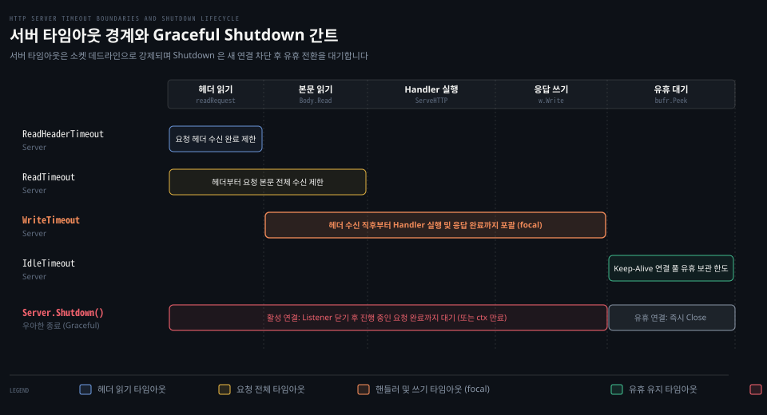

# Server 타임아웃·Shutdown

---

> Go HTTP 서버는 소켓 데드라인을 기반으로 요청 수명주기별 타임아웃을 강제하며 Shutdown 은 신규 수신을 닫고 활성 연결의 완료를 기다려 안전하게 프로세스를 종료합니다.

## 핵심 요약

> Server 의 4대 타임아웃(ReadHeaderTimeout·ReadTimeout·WriteTimeout·IdleTimeout)은 net 패키지의 소켓 데드라인 메커니즘 위에서 동작하며 비정상 클라이언트의 연결 점유를 방지합니다. 서비스 재배포나 중단 시에는 Shutdown 메서드를 통해 신규 연결 수락을 즉시 차단하고 유휴 소켓을 회수한 뒤 활성 트랜잭션이 완료될 때까지 안전하게 대기할 수 있습니다.

HTTP 서버는 외부의 지연과 악의적인 슬로우 공격(Slowloris)에 노출됩니다. 소켓 데드라인 기초는 [../net/03-02.SetDeadline·SetReadDeadline·SetWriteDeadline.md](../net/03-02.SetDeadline·SetReadDeadline·SetWriteDeadline.md) 편을 바탕으로 합니다. 표준 라이브러리는 이 데드라인을 `server.go` 생명주기 위에 배치했습니다.

서버 종료 시에는 무작정 프로세스를 강제 종료하는 대신 `Shutdown` 을 호출합니다. 리스너를 먼저 닫아 새 요청을 거부하고 유휴 상태인 연결을 정리한 뒤 진행 중인 비즈니스 핸들러가 반환될 때까지 우아하게 대기할 수 있습니다.


## 학습 목표

> 이 편을 읽고 나면 아래 다섯 가지를 스스로 해낼 수 있습니다.

1. `Server` 의 4대 타임아웃 필드가 적용되는 프로토콜 구간과 기본값을 설명할 수 있습니다.
2. `server.go` 내부에서 `readRequest` 와 `conn.serve` 가 소켓 데드라인을 설정하고 해제하는 위치를 추적할 수 있습니다.
3. `WriteTimeout` 이 응답 전송 시간뿐 아니라 핸들러 연산 시간까지 포괄하는 원리를 설명할 수 있습니다.
4. `Server.Shutdown` 과 `Server.Close` 의 동작 차이 및 `closeIdleConns` 루프의 동작 방식을 설명할 수 있습니다.
5. 클라이언트 소켓 단절 시 `Request.Context` 취소 전파를 확인하고 슬로우로리스 공격에 대응하는 타임아웃 전략을 수립할 수 있습니다.


## 1. 서버 타임아웃은 연결 데드라인 위에 얹힌 계층적 방어선입니다

> HTTP 요청의 각 단계는 서로 다른 성격의 지연을 가지므로 세분화된 소켓 데드라인으로 방어해야 합니다.

아래 도식은 단일 HTTP 요청의 처리 단계와 4대 타임아웃의 유효 구간 그리고 Graceful Shutdown 시점의 연결 상태별 처리 방식을 나타냅니다.



네트워크 환경에서 단일 타임아웃만으로는 느린 헤더 전송 공격과 대용량 본문 업로드를 동시에 유연하게 제어하기 어렵습니다. Go 는 헤더와 본문 그리고 핸들러 연산과 유휴 대기 구간을 별도의 시간 한도로 분리했습니다.

### 공식 계약: Server 의 4대 타임아웃 필드 주석 전문

공식 문서 [Server](https://pkg.go.dev/net/http#Server) 구조체는 4개의 핵심 타임아웃 필드에 대해 상세한 계약을 명시합니다.

첫째는 요청 전체 읽기를 제어하는 [ReadTimeout](https://pkg.go.dev/net/http#Server) 입니다.

> "ReadTimeout is the maximum duration for reading the entire request, including the body. A zero or negative value means there will be no timeout."
>
> "Because ReadTimeout does not let Handlers make per-request decisions on each request body's acceptable deadline or upload rate, most users will prefer to use ReadHeaderTimeout. It is valid to use them both."
>
> — [net/http Server.ReadTimeout](https://pkg.go.dev/net/http#Server)

둘째는 헤더 수신 한도만을 규정하는 [ReadHeaderTimeout](https://pkg.go.dev/net/http#Server) 입니다.

> "ReadHeaderTimeout is the amount of time allowed to read request headers. The connection's read deadline is reset after reading the headers and the Handler can decide what is considered too slow for the body. If zero, the value of ReadTimeout is used. If negative, or if zero and ReadTimeout is zero or negative, there is no timeout."
>
> — [net/http Server.ReadHeaderTimeout](https://pkg.go.dev/net/http#Server)

셋째는 핸들러 실행과 응답 작성을 감싸는 [WriteTimeout](https://pkg.go.dev/net/http#Server) 입니다.

> "WriteTimeout is the maximum duration before timing out writes of the response. It is reset whenever a new request's header is read. Like ReadTimeout, it does not let Handlers make decisions on a per-request basis. A zero or negative value means there will be no timeout."
>
> — [net/http Server.WriteTimeout](https://pkg.go.dev/net/http#Server)

넷째는 Keep-Alive 유지 시간을 통제하는 [IdleTimeout](https://pkg.go.dev/net/http#Server) 입니다.

> "IdleTimeout is the maximum amount of time to wait for the next request when keep-alives are enabled. If zero, the value of ReadTimeout is used. If negative, or if zero and ReadTimeout is zero or negative, there is no timeout."
>
> — [net/http Server.IdleTimeout](https://pkg.go.dev/net/http#Server)

이 설정들은 모두 [../net/03-02.SetDeadline·SetReadDeadline·SetWriteDeadline.md](../net/03-02.SetDeadline·SetReadDeadline·SetWriteDeadline.md) 편에서 살펴본 커널 소켓 데드라인을 직접 조작해 실현됩니다.

### 내부 동작: readRequest 의 SetReadDeadline 과 SetWriteDeadline 설정

`server.go` 내부에서 이 타임아웃들이 소켓에 적용되는 자리는 [`src/net/http/server.go:1010`](https://github.com/golang/go/blob/go1.25.1/src/net/http/server.go#L1010) 의 `c.readRequest` 메서드입니다.

```go
// src/net/http/server.go:1020
t0 := time.Now()
if d := c.server.readHeaderTimeout(); d > 0 {
    hdrDeadline = t0.Add(d)
}
if d := c.server.ReadTimeout; d > 0 {
    wholeReqDeadline = t0.Add(d)
}
c.rwc.SetReadDeadline(hdrDeadline)
if d := c.server.WriteTimeout; d > 0 {
    defer func() {
        c.rwc.SetWriteDeadline(time.Now().Add(d))
    }()
}
```

1. 헤더 파싱 시작 전 `c.rwc.SetReadDeadline(hdrDeadline)` 을 걸어 헤더 수신 완료 시점을 제한합니다.
2. 헤더 파싱이 끝나면 [`src/net/http/server.go:1086`](https://github.com/golang/go/blob/go1.25.1/src/net/http/server.go#L1086) 에서 `c.rwc.SetReadDeadline(wholeReqDeadline)` 으로 데드라인을 연장 조정합니다.
3. `readRequest` 가 종료될 때 `defer` 로 등록된 함수가 실행되면서 `c.rwc.SetWriteDeadline(time.Now().Add(d))` 가 설정됩니다.

즉 `WriteTimeout` 은 헤더 읽기가 끝난 직후부터 카운트다운을 시작합니다. 이후 `serverHandler.ServeHTTP` 가 실행되고 비즈니스 핸들러가 응답 바이트를 쓰는 전 과정이 이 데드라인 아래에 놓입니다.

요청 처리가 끝나면 [`src/net/http/server.go:2116`](https://github.com/golang/go/blob/go1.25.1/src/net/http/server.go#L2116) 의 `w.finishRequest()` 가 호출되어 `c.rwc.SetWriteDeadline(time.Time{})` 으로 쓰기 데드라인을 초기화합니다. 이후 [`src/net/http/server.go:2135`](https://github.com/golang/go/blob/go1.25.1/src/net/http/server.go#L2135) 에서 `IdleTimeout` 이 있으면 `c.rwc.SetReadDeadline(time.Now().Add(d))` 를 걸고 다음 요청을 기다립니다.

### 함정·관찰: WriteTimeout 의 핸들러 포괄 범위와 ReadHeaderTimeout 누락

실무에서 가장 흔히 오해하는 지점은 `WriteTimeout` 의 적용 범위입니다. 이름만 보면 순수하게 응답 바이트를 유선으로 쓰는 네트워크 시간만 잴 것처럼 보이지만 실제로는 `readRequest` 반환 직후부터 걸립니다. 핸들러 함수가 복잡한 데이터베이스 조회를 수행하느라 시간을 보내면 아직 응답을 한 바이트도 쓰지 않았더라도 `WriteTimeout` 만료로 소켓이 닫힙니다.

또 다른 치명적 함정은 `ReadTimeout` 만 설정하고 `ReadHeaderTimeout` 을 0(기본값)으로 두는 경우입니다. 공식 문서가 경고하듯 `ReadTimeout` 은 핸들러가 요청 본문의 크기나 업로드 속도를 고려해 개별적으로 데드라인을 연장할 기회를 주지 않습니다.

반면 `ReadHeaderTimeout` 만 걸어두면 느린 헤더 공격은 원천 차단하면서 본문 소비는 핸들러가 컨텍스트나 자체 타이머로 유연하게 제어할 수 있습니다. 특별한 이유가 없다면 프로덕션 서버에는 반드시 명시적인 `ReadHeaderTimeout` 을 설정해야 합니다.


## 2. Shutdown 은 새 연결을 차단하고 기존 연결의 유휴 전환을 대기합니다

> 서버 프로세스 종료 시에는 새 연결을 끊고 활성 트랜잭션이 안전하게 끝나도록 드레이닝해야 합니다.

프로세스에 SIGTERM 신호가 전달되었을 때 곧바로 프로세스를 종료하면 진행 중이던 결제나 파일 쓰기 트랜잭션이 중간에 끊깁니다. Go 표준 라이브러리는 안전한 프로세스 전환을 위해 `Shutdown` 메커니즘을 제공합니다.

### 공식 계약: Shutdown 과 Close 및 클라이언트 취소 전파

공식 문서 [Server.Shutdown](https://pkg.go.dev/net/http#Server.Shutdown) 은 우아한 종료 규약을 다음과 같이 정의합니다.

> "Shutdown gracefully shuts down the server without interrupting any active connections. Shutdown works by first closing all open listeners, then closing all idle connections, and then waiting indefinitely for connections to return to idle and then shut down. If the provided context expires before the shutdown is complete, Shutdown returns the context's error, otherwise it returns any error returned from closing the Server's underlying Listener(s)."
>
> "When Shutdown is called, Serve, ServeTLS, ListenAndServe, and ListenAndServeTLS immediately return ErrServerClosed. Make sure the program doesn't exit and waits instead for Shutdown to return."
>
> "Shutdown does not attempt to close nor wait for hijacked connections such as WebSockets. The caller of Shutdown should separately notify such long-lived connections of shutdown and wait for them to close, if desired. See Server.RegisterOnShutdown for a way to register shutdown notification functions."
>
> — [net/http Server.Shutdown](https://pkg.go.dev/net/http#Server.Shutdown)

반면 즉시 소켓을 끊어버리는 [Server.Close](https://pkg.go.dev/net/http#Server.Close) 는 기다리지 않고 소켓을 닫습니다.

> "Close immediately closes all active net.Listeners and any connections in state StateNew, StateActive, or StateIdle. For a graceful shutdown, use Server.Shutdown."
>
> — [net/http Server.Close](https://pkg.go.dev/net/http#Server.Close)

종료 시점에 특정 자원을 해제하거나 하이재킹된 연결에 종료를 통보하려면 [RegisterOnShutdown](https://pkg.go.dev/net/http#Server.RegisterOnShutdown) 을 사용합니다.

> "RegisterOnShutdown registers a function to call on Server.Shutdown. This can be used to gracefully shutdown connections that have undergone ALPN protocol upgrade or that have been hijacked. This function should start protocol-specific graceful shutdown, but should not wait for shutdown to complete."
>
> — [net/http Server.RegisterOnShutdown](https://pkg.go.dev/net/http#Server.RegisterOnShutdown)

정상 종료가 시작되면 서버 구동 메서드들은 [ErrServerClosed](https://pkg.go.dev/net/http#ErrServerClosed) 센티널 에러를 반환합니다.

> "ErrServerClosed is returned by the Server.Serve, ServeTLS, ListenAndServe, and ListenAndServeTLS methods after a call to Server.Shutdown or Server.Close."
>
> — [net/http ErrServerClosed](https://pkg.go.dev/net/http#ErrServerClosed)

서버가 클라이언트의 상태를 감지하는 핵심 수단은 [Request.Context](https://pkg.go.dev/net/http#Request.Context) 입니다.

> "For incoming server requests, the context is canceled when the client's connection closes, the request is canceled (with HTTP/2), or when the ServeHTTP method returns."
>
> — [net/http Request.Context](https://pkg.go.dev/net/http#Request.Context)

클라이언트가 응답을 다 받기 전에 연결을 끊어버리면 서버 핸들러가 쥐고 있는 `r.Context()` 가 즉시 취소됩니다. 취소 컨텍스트 활용법은 [Learning Go 14-02](../../../book/lgo_learning-go/14-02.%EC%B7%A8%EC%86%8C%ED%95%A0%20%EC%88%98%20%EC%9E%88%EB%8A%94%20context%20%EB%8A%94%20cancel%20%EC%9D%84%20%EA%BC%AD%20%EB%B6%80%EB%A5%B4%EA%B3%A0%20Done%20%EC%B1%84%EB%84%90%EB%A1%9C%20%EB%A9%88%EC%B6%94%EB%A9%B0%20Cause%20%EB%A1%9C%20%EC%9D%B4%EC%9C%A0%EB%A5%BC%20%EB%82%A8%EA%B9%81%EB%8B%88%EB%8B%A4.md) 편을 참고합니다.

### 내부 동작: closeListenersLocked 와 closeIdleConns 루프

우아한 종료의 실제 흐름은 [`src/net/http/server.go:3179`](https://github.com/golang/go/blob/go1.25.1/src/net/http/server.go#L3179) 의 `Server.Shutdown` 구현에 담겨 있습니다.

```go
// src/net/http/server.go:3180
s.inShutdown.Store(true)
s.mu.Lock()
lnerr := s.closeListenersLocked()
for _, f := range s.onShutdown {
    go f();
}
s.mu.Unlock()
s.listenerGroup.Wait()
```

1. `s.inShutdown` 원자적 플래그를 true 로 켜서 서버가 종료 중임을 기록합니다.
2. `s.closeListenersLocked()` 를 실행해 모든 `net.Listener` 를 닫습니다. 이 시점부터 신규 TCP 수락(`Accept`)은 즉시 에러를 반환하며 중단됩니다.
3. 등록된 `onShutdown` 콜백들을 별도 고루틴으로 실행합니다.

이후 서버는 활성 연결들이 유휴 상태로 내려오기를 기다리는 폴링 루프로 진입합니다.

```go
// src/net/http/server.go:3206
for {
    if s.closeIdleConns() {
        return lnerr
    }
    select {
    case <-ctx.Done():
        return ctx.Err()
    case <-timer.C:
        timer.Reset(nextPollInterval())
    }
}
```

[`src/net/http/server.go:3230`](https://github.com/golang/go/blob/go1.25.1/src/net/http/server.go#L3230) 의 `s.closeIdleConns()` 메서드는 전체 `s.activeConn` 맵을 순회합니다.

- 상태가 `StateIdle` 인 연결은 발견 즉시 `c.rwc.Close()` 를 호출하고 맵에서 제거합니다.
- 상태가 `StateActive` 인 연결이 하나라도 남아있다면 `quiescent` 플래그는 false 가 되어 루프가 유지됩니다.
- 진행 중이던 핸들러가 반환되어 해당 연결이 `StateIdle` 로 바뀌면 다음 회차에서 소켓이 닫히고 마침내 `quiescent` 가 true 가 되어 `Shutdown` 이 반환됩니다.

### 함정·관찰: main 고루틴 조기 종료와 하이재킹 소켓 누수

`Shutdown` 을 호출할 때 가장 자주 범하는 실수는 `ListenAndServe` 가 반환하는 에러를 곧바로 치명적 장애로 간주해 프로세스를 끝내는 패턴입니다.

`Shutdown` 이 리스너를 닫는 순간 실행 중이던 `ListenAndServe` 는 즉시 `ErrServerClosed` 를 반환하며 풀려납니다. 만약 메인 고루틴이 이를 보고 `os.Exit(0)` 이나 로그 패닉으로 프로세스를 즉시 종료해버리면 진행 중이던 요청을 기다리려던 `Shutdown` 로직 전체가 무력화됩니다. 메인 함수는 `errors.Is(err, http.ErrServerClosed)` 일 때 정상 종료 절차로 간주하고 `Shutdown` 반환을 끝까지 대기해야 합니다.

또 다른 주의점은 웹소켓처럼 연결 소켓을 가로챈 하이재킹(`Hijacker`) 연결입니다. 공식 문서가 밝히듯 `Shutdown` 은 하이재킹된 소켓의 존재를 추적하거나 기다리지 못합니다. 웹소켓과 같은 장기 연결은 `RegisterOnShutdown` 에 콜백을 등록해 애플리케이션 계층에서 종료 프레임을 직접 발송하고 수동으로 소켓을 닫아주어야 안전하게 누수를 막을 수 있습니다.
