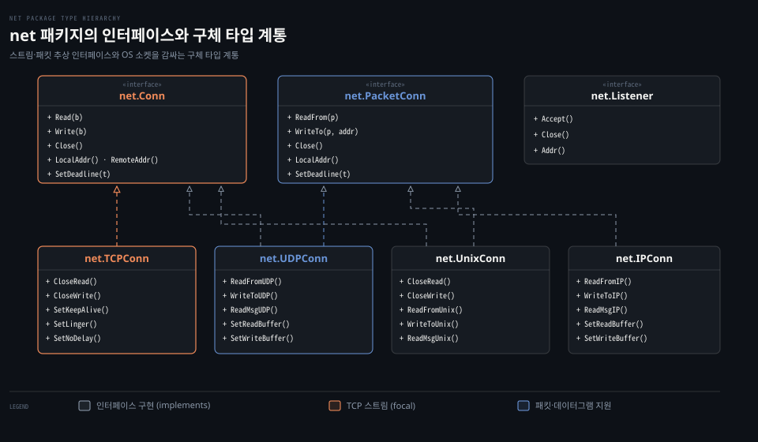
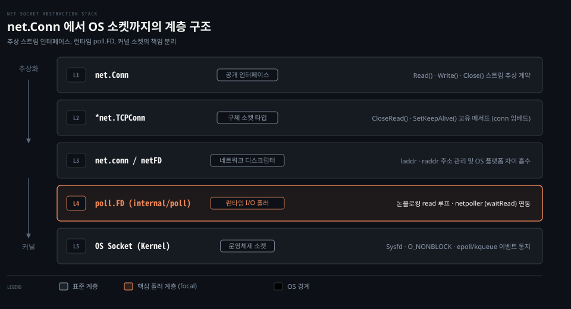

# Conn·Listener·PacketConn·Addr

---

> Go 의 net 패키지는 스트림 연결(Conn), 패킷 연결(PacketConn), 연결 리스너(Listener)라는 세 핵심 인터페이스와 종단 주소(Addr), 그리고 이를 구현하는 4대 구체 타입으로 네트워크 I/O 를 추상화합니다.

## 핵심 요약

> net 패키지는 인터페이스 셋과 구체 타입 넷으로 짜입니다. 복잡한 운영체제 소켓 옵션을 전면에 노출하지 않고, 세 가지 추상 인터페이스 뒤로 프로토콜 구현체를 캡슐화하여 일관된 동시성 통신 계약을 제공합니다.

네트워크 프로그래밍에서 프로토콜마다 소켓을 다루는 방식은 크게 다릅니다. 양방향 바이트 스트림을 흘려보내는 TCP, 경계가 분명한 데이터그램을 쏘는 UDP, 로컬 IPC 에 최적화된 유닉스 도메인 소켓은 커널 수준의 시스템 콜과 옵션이 저마다 다릅니다. Go 표준 라이브러리는 이 차이를 무작정 노출하는 대신 통신의 본질적인 성격에 맞춰 인터페이스를 나누었습니다.

개발자는 대부분의 상황에서 `net.Dial` 이나 `net.Listen` 이 반환하는 추상 인터페이스만으로 데이터를 주고받을 수 있습니다. 그러면서도 세밀한 TCP 튜닝이나 UDP 주소 제어가 필요할 때는 언제든 구체 타입으로 단언하여 운영체제 손잡이를 쥘 수 있도록 통로를 열어 두었습니다.


## 학습 목표

> 이 편을 읽고 나면 아래 다섯 가지를 스스로 해낼 수 있습니다.

1. `Conn`, `PacketConn`, `Listener` 세 핵심 인터페이스의 역할과 동시성 호출 계약을 설명할 수 있습니다.
2. 4대 구체 타입(`TCPConn`, `UDPConn`, `UnixConn`, `IPConn`)이 만족하는 인터페이스와 각 타입 고유의 메서드를 구분할 수 있습니다.
3. 표준 라이브러리 내부에서 `conn` 구조체와 `netFD`, `poll.FD` 가 계층을 이루어 소켓을 캡슐화하는 방식을 설명할 수 있습니다.
4. 함수가 `net.Conn` 을 반환할 때 구체 타입 고유 메서드를 사용하기 위한 안전한 타입 단언 패턴을 작성할 수 있습니다.
5. 추상 인터페이스를 경계로 유지해야 하는 이유와 구체 타입으로 내려가야 하는 시점을 판단할 수 있습니다.


## 1. 서로 다른 전송 방식을 하나의 소켓 API 로 다루려면 경계가 필요합니다

> net 패키지는 통신의 형태를 바이트 스트림, 패킷 데이터그램, 연결 수신으로 나누어 각각 전용 인터페이스를 부여합니다.

아래 도식은 net 패키지의 핵심 인터페이스 셋과 이를 구현하는 4대 구체 타입의 관계를 나타낸 구조도입니다.



네트워크 프로토콜은 바이트 스트림과 데이터그램처럼 전달 방식이 완전히 달라 하나의 통일된 함수만으로는 다루기 어렵습니다. net 패키지는 이 한계를 해결하기 위해 세 가지 대표 인터페이스로 역할을 분리했습니다.

### 공식 계약: 인터페이스 셋의 메서드와 동시성 보장

공식 패키지 개요(Overview)는 대부분의 클라이언트가 `Dial`, `Listen`, `Accept` 함수와 이와 연계된 `Conn`, `Listener` 인터페이스만으로 충분하다고 밝힙니다.[^net-overview] 도메인 이름 해석은 운영체제별 해석기 정책을 따르며 이는 뒤편 05-01(Resolver 편)에서 자세히 다룹니다.

첫째, **`Conn`** 은 일반적인 스트림 지향 네트워크 연결 인터페이스입니다.[^net-conn]
```go
type Conn interface {
	Read(b []byte) (n int, err error)
	Write(b []byte) (n int, err error)
	Close() error
	LocalAddr() Addr
	RemoteAddr() Addr
	SetDeadline(t time.Time) error
	SetReadDeadline(t time.Time) error
	SetWriteDeadline(t time.Time) error
}
```
공식 문서는 `Conn` 에 대해 중요한 동시성 계약을 명시합니다.
> "Multiple goroutines may invoke methods on a Conn simultaneously."[^net-conn]

즉 하나의 연결에 대해 읽기 고루틴과 쓰기 고루틴이 동시에 접근해도 안전합니다. 내부 락과 런타임 폴러가 동시 호출을 제어하므로 호출자가 외부에서 뮤텍스를 둘러쌀 필요가 없습니다.

둘째, **`Listener`** 는 스트림 지향 프로토콜의 서버 측 수신 인터페이스입니다.[^net-listener]
```go
type Listener interface {
	Accept() (Conn, error)
	Close() error
	Addr() Addr
}
```
`Listener` 역시 복수의 고루틴이 동시에 `Accept()` 를 호출할 수 있습니다. 수신 루프에서 새 연결이 맺어지면 스트림 연결인 `Conn` 을 반환합니다.

셋째, **`PacketConn`** 은 패킷 지향(데이터그램) 네트워크 연결 인터페이스입니다.[^net-packetconn]
```go
type PacketConn interface {
	ReadFrom(p []byte) (n int, addr Addr, err error)
	WriteTo(p []byte, addr Addr) (n int, err error)
	Close() error
	LocalAddr() Addr
	SetDeadline(t time.Time) error
	SetReadDeadline(t time.Time) error
	SetWriteDeadline(t time.Time) error
}
```
연결 지향 스트림과 달리 패킷 통신은 매 호출마다 목적지 주소를 명시하고(`WriteTo`), 수신 시 송신자 주소를 함께 받습니다(`ReadFrom`). 이 인터페이스 또한 여러 고루틴의 동시 호출을 지원합니다.

보조 인터페이스로는 네트워크 종단 주소를 표현하는 `Addr`(`Network()`, `String()`)와 타임아웃 판별을 제공하는 `Error`(`Timeout()`)가 있습니다.[^net-addr][^net-error]

### 공식 계약: 구체 타입 넷이 덧붙이는 전용 연산

네 가지 구체 타입(`TCPConn`, `UDPConn`, `UnixConn`, `IPConn`)은 각 프로토콜의 특성에 맞게 인터페이스를 구현하며 전용 메서드를 제공합니다.

- **`TCPConn`**: `Conn` 인터페이스를 만족합니다.[^net-tcpconn] 양방향 반절 닫기를 위한 `CloseRead()` 와 `CloseWrite()` 를 제공합니다. 여기에 커널 연결 유지를 위한 `SetKeepAlive()`, 종료 지연을 제어하는 `SetLinger()`, Nagle 알고리즘 제어를 위한 `SetNoDelay()` 를 덧붙입니다.
- **`UDPConn`**: `Conn` 과 `PacketConn` 인터페이스를 동시에 만족합니다.[^net-udpconn] 주소 할당 없이 바이트를 주고받는 `ReadFromUDP()`, `WriteToUDP()` 메서드를 추가로 제공합니다.
- **`UnixConn`**: 유닉스 도메인 소켓 구현체로 `Conn` 과 `PacketConn` 을 모두 만족합니다.[^net-unixconn] 파일 디스크립터 전달과 Out-of-band(OOB) 통신을 위한 `ReadMsgUnix()`, `WriteMsgUnix()` 및 `CloseWrite()` 를 갖춥니다.
- **`IPConn`**: 원시 IP 패킷 통신을 다루며 `Conn` 과 `PacketConn` 을 구현합니다.[^net-ipconn] `ReadFromIP()`, `WriteToIP()` 를 지원합니다.


## 2. 운영체제마다 다른 소켓 세부를 감추지 않으면 이식성이 깨집니다

> Go 의 구체 소켓 타입은 내부 구조체와 런타임 폴러 디스크립터를 감싸서 운영체제 시스템 콜 차이를 캡슐화합니다.

아래 도식은 공개 인터페이스 `net.Conn` 부터 운영체제 커널 소켓 디스크립터까지 내려가는 계층 구조를 보여줍니다.



운영체제마다 소켓 옵션과 파일 디스크립터 구조가 달라 상위 애플리케이션이 시스템 콜을 직접 다루면 플랫폼 이식성을 유지하기 어렵습니다. Go 는 이 문제를 해결하기 위해 공개 API 아래에 세 겹의 내부 구조체를 두었습니다.

### 내부 동작: conn 에서 netFD 로 이어지는 캡슐화

Go 표준 라이브러리 `src/net/net.go` 에는 외부에 공개되지 않은 기본 스트림 구조체 `conn` 이 정의되어 있습니다.[^src-net-conn]

```go
// src/net/net.go (go1.25.1)
type conn struct {
	fd *netFD
}

func (c *conn) ok() bool { return c != nil && c.fd != nil }

func (c *conn) Read(b []byte) (int, error) {
	if !c.ok() {
		return 0, syscall.EINVAL
	}
	n, err := c.fd.Read(b)
	if err != nil && err != io.EOF {
		err = &OpError{Op: "read", Net: c.fd.net, Source: c.fd.laddr, Addr: c.fd.raddr, Err: err}
	}
	return n, err
}
```

구체 타입인 `TCPConn` 은 이 `conn` 을 그대로 임베딩합니다.[^src-tcpsock]
```go
// src/net/tcpsock.go (go1.25.1)
type TCPConn struct {
	conn
}
```

그리고 `conn` 은 플랫폼 독립적인 네트워크 파일 디스크립터인 `netFD` 를 참조합니다.[^src-fd-posix]
```go
// src/net/fd_posix.go (go1.25.1)
type netFD struct {
	pfd poll.FD

	family      int
	sotype      int
	isConnected bool
	net         string
	laddr       Addr
	raddr       Addr
}
```
`netFD` 는 로컬 주소(`laddr`)와 원격 주소(`raddr`), 프로토콜 패밀리 정보를 보관하며, 실제 I/O 실행은 `pfd` 필드인 `poll.FD` 에게 위임합니다.

### 내부 동작: poll.FD 가 맡은 런타임 폴러 접점

`poll.FD` 는 Go 런타임의 내부 패키지인 `internal/poll` 에 위치합니다.[^src-poll-fd]

```go
// src/internal/poll/fd_unix.go (go1.25.1)
type FD struct {
	fdmu fdMutex
	Sysfd int
	pd pollDesc
	// ...
}
```
`poll.FD` 는 실제 운영체제 파일 디스크립터 번호인 `Sysfd` 를 품고 있습니다. 동시에 런타임 네트워크 폴러(netpoller)와 통신하는 `pd pollDesc` 를 관리합니다.

소켓이 생성되면 Go 런타임은 커널에 소켓을 `O_NONBLOCK`(논블로킹) 모드로 열어둡니다. 그리고 `poll.FD.Read` 에서 데이터를 읽으려 할 때 데이터가 없으면 `EAGAIN` 오류를 받고 고루틴을 대기 상태로 전환합니다. 이 런타임 논블로킹 전환 과정은 01-02(netpoller 편)에서 본격적으로 분석합니다.


## 3. 프로토콜 전용 손잡이가 필요할 때만 구체 타입으로 단언합니다

> net.Dial 이나 Accept 는 추상 인터페이스를 반환하므로, TCP 고유 설정이 필요할 때만 안전하게 타입 단언을 수행해야 합니다.

실무에서 네트워크 연결을 맺을 때 개발자는 주로 `net.Dial` 함수를 호출합니다.

```go
conn, err := net.Dial("tcp", "127.0.0.1:8080")
if err != nil {
	log.Fatal(err)
}
defer conn.Close()
```

이때 반환형은 구체 포인터 `*net.TCPConn` 이 아니라 인터페이스 `net.Conn` 입니다.

### 실용 관점: 언제 구체 타입으로 단언해야 하는가

일반적인 데이터 송수신에는 `conn.Read` 와 `conn.Write` 로 충분합니다. 하지만 프로토콜 수준의 세밀한 제어가 필요하다면 구체 타입으로 단언해야 합니다.

가장 대표적인 사례가 HTTP 클라이언트나 프록시가 요청 본문을 모두 전송한 뒤 쓰기 스트림만 닫는 half-close 연산입니다. `net.Conn` 인터페이스에는 `Close()` 만 존재하므로, TCP FIN 패킷만 전송하려면 다음과 같이 단언합니다.

```go
if tcpConn, ok := conn.(*net.TCPConn); ok {
	// TCP FIN 세그먼트 전송 (읽기 채널은 유지)
	if err := tcpConn.CloseWrite(); err != nil {
		log.Printf("CloseWrite 실패: %v", err)
	}
	// 연결 유지 옵션 설정
	_ = tcpConn.SetKeepAlive(true)
}
```

이러한 손잡이는 뒤편 04-01(TCPConn 편)에서 다루는 keepalive 주기 설정, linger 옵션, 버퍼 크기 조절 시에도 동일하게 쓰입니다.

### 함정과 관찰: 다형성 경계를 지키는 이유

그렇다면 처음부터 `net.DialTCP` 를 써서 `*net.TCPConn` 을 직접 받으면 안 될까요?

구체 타입을 직접 노출하면 코드의 유연성이 급격히 떨어집니다. `net.Conn` 인터페이스를 유지해야 하는 이유는 세 가지입니다.

1. **테스트 용이성**: `net.Conn` 인터페이스를 사용하는 비즈니스 로직은 메모리 파이프(`net.Pipe()`)나 모의 객체를 쉽게 주입할 수 있습니다.
2. **계층 합성**: `crypto/tls` 패키지의 `tls.Client(conn, config)` 처럼 인터페이스를 감싸 새로운 보안 스트림을 만드는 래핑이 자연스럽습니다.
3. **프로토콜 중립성**: 전송 계층이 TCP 에서 유닉스 도메인 소켓(`net.UnixConn`)으로 바뀌어도 비즈니스 처리부는 수정 없이 동작합니다.

따라서 API 경계에서는 항상 `net.Conn` 을 주고받고, 프로토콜 고유의 손잡이가 꼭 필요한 시점에만 국소적으로 타입 단언을 적용하는 것이 권장 설계입니다.


## 관련 문서

> 이 섹션과 함께 읽으면 좋은 참고 자료입니다.

- [01_language/docs/go/net MOC](README.md) — net 패키지 공식문서 정독 목록
- [01-02.netpoller](01-02.netpoller.md) — 런타임 netpoller 와 논블로킹 I/O 메커니즘
- [Learning Go 13-01](../../../book/lgo_learning-go/13-01.io.Reader%20%EB%8A%94%20%EB%B2%84%ED%8D%BC%EB%A5%BC%20%EB%B0%9B%EC%95%84%20%EC%B1%84%EC%9A%B0%EA%B3%A0%20%EC%9E%91%EC%9D%80%20%EC%9D%B8%ED%84%B0%ED%8E%98%EC%9D%B4%EC%8A%A4%EB%A5%BC%20%EA%B2%B9%EC%B3%90%20%EA%B8%B0%EB%8A%A5%EC%9D%84%20%EB%8D%94%ED%95%A9%EB%8B%88%EB%8B%A4.md) — io.Reader 와 io.Writer 스트림 추상화
- [gonet-lab 00-01](../../../../02_os/project/gonet-lab/00-01.listener%20%EC%86%8C%EC%BC%93%EA%B3%BC%20%EC%97%B0%EA%B2%B0%20%EC%86%8C%EC%BC%93.md) — 리스너 소켓과 연결 소켓의 분리

[^net-overview]: Go 공식 문서 [Package net](https://pkg.go.dev/net)
[^net-conn]: Go 공식 문서 [type Conn](https://pkg.go.dev/net#Conn)
[^net-listener]: Go 공식 문서 [type Listener](https://pkg.go.dev/net#Listener)
[^net-packetconn]: Go 공식 문서 [type PacketConn](https://pkg.go.dev/net#PacketConn)
[^net-addr]: Go 공식 문서 [type Addr](https://pkg.go.dev/net#Addr)
[^net-error]: Go 공식 문서 [type Error](https://pkg.go.dev/net#Error)
[^net-tcpconn]: Go 공식 문서 [type TCPConn](https://pkg.go.dev/net#TCPConn)
[^net-udpconn]: Go 공식 문서 [type UDPConn](https://pkg.go.dev/net#UDPConn)
[^net-unixconn]: Go 공식 문서 [type UnixConn](https://pkg.go.dev/net#UnixConn)
[^net-ipconn]: Go 공식 문서 [type IPConn](https://pkg.go.dev/net#IPConn)
[^src-net-conn]: Go 1.25.1 소스 [src/net/net.go#L183](https://github.com/golang/go/blob/go1.25.1/src/net/net.go#L183)
[^src-tcpsock]: Go 1.25.1 소스 [src/net/tcpsock.go#L112](https://github.com/golang/go/blob/go1.25.1/src/net/tcpsock.go#L112)
[^src-fd-posix]: Go 1.25.1 소스 [src/net/fd_posix.go#L17](https://github.com/golang/go/blob/go1.25.1/src/net/fd_posix.go#L17)
[^src-poll-fd]: Go 1.25.1 소스 [src/internal/poll/fd_unix.go#L18](https://github.com/golang/go/blob/go1.25.1/src/internal/poll/fd_unix.go#L18)
