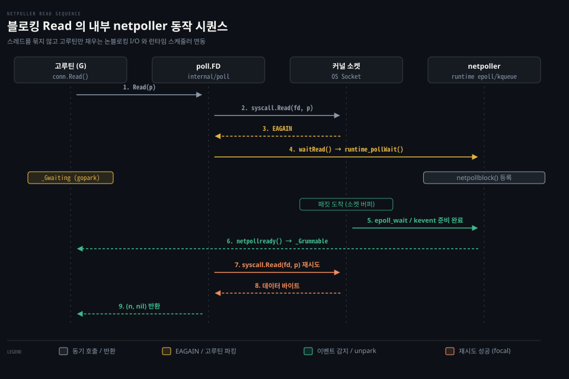

# netpoller

---

> Go 의 Conn.Read 는 호출자 관점에서 단순한 동기 블로킹 함수처럼 보이지만 런타임 netpoller 와 협력하여 운영체제 스레드를 잠재우지 않고 대기 고루틴만 파킹합니다.

## 핵심 요약

> 블로킹처럼 보이는 Read 는 netpoller 위에서 고루틴만 재웁니다. 복잡한 비동기 콜백 대신 동기식 블로킹 프로그래밍 모델을 제공하며 논블로킹 시스템 콜과 런타임 이벤트 폴러로 스레드 차단 비용을 제거합니다.

전통적인 네트워크 프로그래밍에서 동기식 I/O 호출은 커널이 응답을 반환할 때까지 OS 스레드를 멈춰 세웁니다. 동시 연결이 수만 개로 늘어나면 스레드 스택 메모리와 컨텍스트 스위칭 비용으로 인해 서버가 한계에 부딪힙니다.

Go 는 이 문제를 언어 런타임 수준에서 풀었습니다. 개발자는 직관적인 동기식 `conn.Read()` 코드를 작성합니다. 내부에서는 소켓을 논블로킹(`O_NONBLOCK`) 모드로 열고 `EAGAIN` 오류를 만나면 고루틴만 대기 상태로 전환합니다. 그동안 OS 스레드는 다른 고루틴을 실행하며 패킷이 도착하면 `epoll` 이나 `kqueue` 가 고루틴을 깨워 읽기 루프를 이어갑니다.


## 학습 목표

> 이 편을 읽고 나면 아래 다섯 가지를 스스로 해낼 수 있습니다.

1. `Conn.Read` 가 제공하는 동기식 블로킹 API 계약과 Go 런타임 내부의 논블로킹 구현 차이를 구별할 수 있습니다.
2. `poll.FD.Read` 의 루프 구조와 `syscall.Read` 가 `EAGAIN` 을 반환할 때의 처리 흐름을 설명할 수 있습니다.
3. `waitRead`, `runtime_pollWait`, `netpollblock`, `gopark` 으로 이어지는 고루틴 파킹 경로를 추적할 수 있습니다.
4. 운영체제 이벤트 멀티플렉서(`epoll_wait`, `kevent`)가 준비 완료된 고루틴을 찾아 깨워내는 `netpollready` 메커니즘을 설명할 수 있습니다.
5. 연결마다 고루틴을 띄우는(goroutine-per-connection) 모델이 대규모 동시성에서도 OS 스레드 고갈을 일으키지 않는 이유를 진단할 수 있습니다.


## 1. 동기식 블로킹 계약과 논블로킹 내부 구현은 나뉩니다

> 프로그래머가 체감하는 블로킹 동작은 API 계약일 뿐이며 운영체제 스레드가 멈추지 않는다는 사실은 Go 런타임의 내부 구현입니다.

소켓 프로그래밍을 처음 접할 때 가장 다루기 어려운 문제는 I/O 대기 시간 동안 애플리케이션의 제어 흐름이 묶이는 현상입니다. C 나 Java 초기의 소켓 API 는 `read()` 호출 시 데이터가 올 때까지 OS 스레드를 블로킹 상태로 가두었습니다.

### 공식 계약: 단순한 동기식 Read 와 동시 호출 안전성

Go 공식 문서는 `Conn.Read` 메서드를 다음과 같이 정의합니다.[^net-conn]

```go
// Read reads data from the connection.
// Read can be made to time out and return an error after a fixed
// time limit; see SetDeadline and SetReadDeadline.
Read(b []byte) (n int, err error)
```

이 시그니처에는 비동기 Future 나 콜백 함수, 완료 채널이 전혀 등장하지 않습니다.
호출자는 버퍼 슬라이스를 넘겨주고 바이트가 채워지거나 오류가 발생할 때까지 함수 안에서 멈춥니다.
공식 문서가 약속하는 계약은 두 가지입니다.

1. 데이터가 도착할 때까지 반환하지 않는 동기식 블로킹 인터페이스를 제공합니다.
2. 여러 고루틴이 하나의 `Conn` 에서 동시에 메서드를 호출해도 안전합니다.[^net-conn]

중요한 점은 "이 블로킹이 운영체제 스레드를 묶지 않는다"는 설명이 `Conn` 인터페이스 명세의 계약이 아니라는 사실입니다. 그것은 Go 언어 런타임과 표준 라이브러리가 뒤편에서 조용히 수행하는 구현 세부사항입니다.

### 비동기 복잡성을 감추는 Go 의 설계 철학

Node.js 나 C++ 의 리액터(Reactor) 패턴은 논블로킹 I/O 를 활용하기 위해 콜백 지옥이나 프로미스 체인, 이벤트 루프 등록을 개발자에게 강제합니다.
반면 Go 는 가장 읽기 쉽고 추론하기 쉬운 순차적 동기 코드를 유지하면서도 밑바닥에서 논블로킹 이벤트 처리를 수행합니다.

이 설계가 가능한 이유는 M:N 사용자 수준 스케줄러와 네트워크 폴러(netpoller)가 런타임 깊숙이 결합되어 있기 때문입니다. 이제 그 안쪽 루프가 어떻게 도는지 소스 코드로 내려가 봅니다.


## 2. 소켓 버퍼가 비어 데이터를 읽을 수 없으면 고루틴을 재웁니다

> poll.FD.Read 루프는 커널이 EAGAIN 을 내면 고루틴을 대기 상태로 파킹하고 OS 멀티플렉서가 이벤트를 감지하면 실행을 재개합니다.

아래 시퀀스 도식은 `conn.Read()` 호출부터 논블로킹 시스템 콜, 고루틴 파킹(`gopark`), 그리고 커널 이벤트 감지(`epoll`/`kqueue`)를 거쳐 데이터 수신에 이르는 전체 과정을 나타냅니다.



소켓 버퍼가 비어 즉각 데이터를 읽을 수 없을 때 발생하는 지연 문제를 Go 는 네 단계에 걸쳐 해결합니다.

### 내부 동작 1: 논블로킹 read 와 EAGAIN 감지

호출자가 `conn.Read` 를 실행하면 `netFD.Read` 를 거쳐 `internal/poll` 패키지의 `poll.FD.Read` 메서드로 진입합니다.[^src-poll-read]

```go
// src/internal/poll/fd_unix.go (go1.25.1)
func (fd *FD) Read(p []byte) (int, error) {
	if err := fd.readLock(); err != nil {
		return 0, err
	}
	defer fd.readUnlock()
	// ...
	for {
		n, err := ignoringEINTRIO(syscall.Read, fd.Sysfd, p)
		if err != nil {
			n = 0
			if err == syscall.EAGAIN && fd.pd.pollable() {
				if err = fd.pd.waitRead(fd.isFile); err == nil {
					continue
				}
			}
		}
		err = fd.eofError(n, err)
		return n, err
	}
}
```

Go 의 소켓은 생성 시점에 논블로킹 모드로 설정되어 있습니다. 따라서 `syscall.Read` 는 커널 소켓 수신 버퍼에 데이터가 없으면 즉시 `syscall.EAGAIN`(Resource temporarily unavailable) 오류를 뱉어내고 반환합니다.
이때 `poll.FD` 는 오류를 사용자에게 돌려주지 않고 `fd.pd.waitRead(fd.isFile)` 를 호출합니다.

### 내부 동작 2: 런타임 netpollblock 과 gopark

`waitRead` 는 런타임 링크네임 함수인 `runtime_pollWait` 을 호출합니다.[^src-poll-runtime]

```go
// src/internal/poll/fd_poll_runtime.go (go1.25.1)
func (pd *pollDesc) waitRead(isFile bool) error {
	return pd.wait('r', isFile)
}

func (pd *pollDesc) wait(mode int, isFile bool) error {
	res := runtime_pollWait(pd.runtimeCtx, mode)
	return convertErr(res, isFile)
}
```

이 호출은 Go 런타임 `src/runtime/netpoll.go` 의 `poll_runtime_pollWait` 으로 이어집니다.[^src-runtime-netpoll]

```go
// src/runtime/netpoll.go (go1.25.1)
func poll_runtime_pollWait(pd *pollDesc, mode int) int {
	// ...
	for !netpollblock(pd, int32(mode), false) {
		errcode = netpollcheckerr(pd, int32(mode))
		if errcode != pollNoError {
			return errcode
		}
	}
	return pollNoError
}
```

`netpollblock` 함수는 대기 상태 등록을 시도한 뒤 핵심 함수인 `gopark` 을 호출합니다.[^src-runtime-netpollblock]

```go
// src/runtime/netpoll.go (go1.25.1)
func netpollblock(pd *pollDesc, mode int32, waitio bool) bool {
	// ...
	if waitio || netpollcheckerr(pd, mode) == pollNoError {
		gopark(netpollblockcommit, unsafe.Pointer(gpp), waitReasonIOWait, traceBlockNet, 5)
	}
	old := gpp.Swap(pdNil)
	return old == pdReady
}
```

`gopark` 은 현재 고루틴의 상태를 `_Grunning` 에서 대기 상태인 `_Gwaiting` 으로 전환하고 스케줄러를 호출합니다.[^src-runtime-gopark]
대기 사유는 `waitReasonIOWait` 로 기록됩니다.
이 순간 고루틴은 현재 OS 스레드에서 완전히 분리되어 잠듭니다. OS 스레드는 차단되지 않고 런타임 실행 대기 큐에서 다른 준비된 고루틴을 꺼내어 즉시 실행합니다.

### 내부 동작 3: 커널 이벤트 멀티플렉서와 netpollready

상대방 호스트가 TCP 패킷을 보내 커널 소켓 수신 버퍼에 데이터가 쌓이면 운영체제는 감시 목록에 등록된 파일 디스크립터의 읽기 준비 완료 이벤트를 발생시킵니다.
Go 런타임 스케줄러는 주기적으로, 혹은 유휴 상태의 스레드가 있을 때 `netpoll` 함수를 호출합니다.[^src-runtime-epoll][^src-runtime-kqueue]

- **Linux**: `src/runtime/netpoll_epoll.go` 의 `netpoll()` 이 `syscall.EpollWait` 을 호출하여 준비된 이벤트를 꺼냅니다.
- **macOS / BSD**: `src/runtime/netpoll_kqueue.go` 의 `netpoll()` 이 `kevent` 시스템 콜을 통해 이벤트를 수거합니다.

이벤트가 감지되면 런타임은 `netpollready` 를 호출합니다.[^src-runtime-netpollready]

```go
// src/runtime/netpoll.go (go1.25.1)
func netpollready(toRun *gList, pd *pollDesc, mode int32) int32 {
	delta := int32(0)
	var readyG, wg *g
	if mode == 'r' || mode == 'r'+'w' {
		readyG = netpollunblock(pd, 'r', true, &delta)
	}
	// ...
	if readyG != nil {
		toRun.push(readyG)
	}
	return delta
}
```

`netpollunblock` 은 폴러 디스크립터에 잠들어 있던 대기 고루틴을 꺼내고 `toRun` 리스트에 담아 반환합니다.
스케줄러는 이 고루틴들의 상태를 `_Grunnable` 로 전환하고 프로세서(P)의 로컬 실행 큐에 밀어 넣습니다.

### 내부 동작 4: 고루틴 unpark 과 루프 재시도

스케줄러에 의해 다시 CPU 를 할당받은 고루틴은 `gopark` 지점에서 깨어납니다.
함수 호출 스택을 거슬러 올라가면 `poll.FD.Read` 의 `for` 루프 안으로 복귀합니다.
`if err = fd.pd.waitRead(fd.isFile); err == nil` 조건이 만족되었으므로 `continue` 문을 타고 루프 처음으로 돌아갑니다.

루프가 재시작되면 `syscall.Read(fd.Sysfd, p)` 가 다시 실행됩니다. 이미 커널 버퍼에 패킷이 들어와 있으므로 이번에는 `EAGAIN` 이 아니라 성공적으로 읽은 바이트 수 `n` 과 `nil` 에러를 반환합니다.
이로써 상위의 `conn.Read` 는 호출자에게 읽은 데이터를 건네며 평온하게 반환을 완료합니다.


## 3. 고루틴 전담 모델이 OS 스레드 고갈을 부르지 않는 이유

> 수만 개의 유휴 연결마다 고루틴을 띄워도 netpoller 가 대기 고루틴을 M 스레드에서 떼어내므로 스레드 폭증이 일어나지 않습니다.

Go 네트워크 프로그래밍의 정석 패턴은 연결 하나마다 읽기 고루틴을 띄우는 이른바 **goroutine-per-connection** 구조입니다.

```go
for {
	conn, err := ln.Accept()
	if err != nil {
		continue
	}
	// 연결마다 독립 고루틴으로 핸들러 실행
	go func(c net.Conn) {
		handleConnection(c)
	}(conn)
}
```

전통적인 C/Java 서버에서 이 패턴(thread-per-connection)은 1,000개만 넘어가도 OS 스레드 스택 메모리 고갈과 컨텍스트 스위칭 오버헤드로 인해 치명적인 성능 저하를 초래했습니다.

### 고루틴과 OS 스레드의 자원 격차

Go 에서 이 패턴이 대규모 프로덕션에서도 안전하게 동작하는 이유는 두 가지 자원 격차 덕분입니다.

1. **메모리 풋프린트**: OS 스레드는 보통 1MB~8MB 의 고정 스택을 차지하지만 Go 고루틴은 불과 2KB 안팎의 작은 스택으로 시작하여 필요할 때만 동적으로 자랍니다.
2. **비차단 스레드 공유**: 수만 개의 고루틴이 `conn.Read()` 에서 블로킹 상태로 대기하고 있어도 그 고루틴들은 전부 netpoller 에 파킹되어 있을 뿐 OS 스레드를 점유하지 않습니다.

실제 OS 스레드의 개수는 I/O 대기 고루틴 수와 무관하게 논리 프로세서 P 의 개수 수준으로 유지됩니다. P 의 기본값은 시스템의 CPU 코어 수입니다.

### 실측과 관찰: 커널에서 관측되는 것들

이 동작이 실제로 어떻게 커널에 찍히는지는 gonet-lab 프로젝트의 실측 노트에 상세히 기록되어 있습니다.
- `strace` 도구로 추적하면 서버 프로세스에서 소켓이 생성될 때 `O_NONBLOCK` 플래그가 붙고 `epoll_ctl(..., EPOLL_CTL_ADD, ...)` 로 등록되는 과정을 직접 볼 수 있습니다([gonet-lab 00-02 실습 편](../../../../02_os/project/gonet-lab/00-02.strace%20%EC%99%80%20proc%20%EB%A1%9C%20%EC%9D%BD%EC%9D%80%20%EA%B2%83%20-%20%EC%8B%A4%EC%8A%B5%EC%97%90%EC%84%9C%20%EB%A7%8C%EB%82%9C%20syscall%C2%B7FD%C2%B7TCP%20%EC%83%81%ED%83%9C.md)).
- 수만 개의 조용한 유휴 연결(idle connection)이 물려 있을 때 메모리와 파일 디스크립터, 스레드 수가 어떻게 관측되는지는 [gonet-lab 01-01 조용한 연결 편](../../../../02_os/project/gonet-lab/01-01.조용한%20연결이%20서버를%20멈춘다%20-%20goroutine%C2%B7FD%C2%B7idle%20timeout.md)에서 실증했습니다.

한편 `conn.SetDeadline` 을 설정했을 때 netpoller 가 런타임 타이머와 연동하여 잠든 고루틴을 깨우고 타임아웃 오류를 발생시키는 원리는 뒤편 03-02(SetDeadline 편)에서 깊이 있게 다룹니다.


## 관련 문서

> 이 섹션과 함께 읽으면 좋은 참고 자료입니다.

- [01_language/docs/go/net MOC](README.md) — net 패키지 공식문서 정독 목록
- [01-01.Conn·Listener·PacketConn·Addr](01-01.Conn%C2%B7Listener%C2%B7PacketConn%C2%B7Addr.md) — net 패키지 타입 체계와 추상화 계층
- [gonet-lab 00-02 strace 와 proc 로 읽은 것](../../../../02_os/project/gonet-lab/00-02.strace%20%EC%99%80%20proc%20%EB%A1%9C%20%EC%9D%BD%EC%9D%80%20%EA%B2%83%20-%20%EC%8B%A4%EC%8A%B5%EC%97%90%EC%84%9C%20%EB%A7%8C%EB%82%9C%20syscall%C2%B7FD%C2%B7TCP%20%EC%83%81%ED%83%9C.md) — 리눅스 시스템 콜과 O_NONBLOCK 소켓 관측
- [gonet-lab 01-01 조용한 연결이 서버를 멈춘다](../../../../02_os/project/gonet-lab/01-01.조용한%20연결이%20서버를%20멈춘다%20-%20goroutine%C2%B7FD%C2%B7idle%20timeout.md) — 유휴 고루틴과 파일 디스크립터 누수 실측

[^net-conn]: Go 공식 문서 [type Conn](https://pkg.go.dev/net#Conn)
[^src-poll-read]: Go 1.25.1 소스 [src/internal/poll/fd_unix.go#L141](https://github.com/golang/go/blob/go1.25.1/src/internal/poll/fd_unix.go#L141)
[^src-poll-runtime]: Go 1.25.1 소스 [src/internal/poll/fd_poll_runtime.go#L84](https://github.com/golang/go/blob/go1.25.1/src/internal/poll/fd_poll_runtime.go#L84)
[^src-runtime-netpoll]: Go 1.25.1 소스 [src/runtime/netpoll.go#L342](https://github.com/golang/go/blob/go1.25.1/src/runtime/netpoll.go#L342)
[^src-runtime-netpollblock]: Go 1.25.1 소스 [src/runtime/netpoll.go#L548](https://github.com/golang/go/blob/go1.25.1/src/runtime/netpoll.go#L548)
[^src-runtime-gopark]: Go 1.25.1 소스 [src/runtime/proc.go#L404](https://github.com/golang/go/blob/go1.25.1/src/runtime/proc.go#L404)
[^src-runtime-epoll]: Go 1.25.1 소스 [src/runtime/netpoll_epoll.go#L99](https://github.com/golang/go/blob/go1.25.1/src/runtime/netpoll_epoll.go#L99)
[^src-runtime-kqueue]: Go 1.25.1 소스 [src/runtime/netpoll_kqueue.go#L90](https://github.com/golang/go/blob/go1.25.1/src/runtime/netpoll_kqueue.go#L90)
[^src-runtime-netpollready]: Go 1.25.1 소스 [src/runtime/netpoll.go#L494](https://github.com/golang/go/blob/go1.25.1/src/runtime/netpoll.go#L494)
