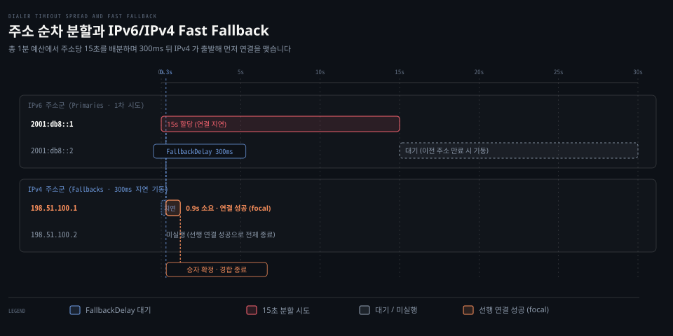

# Dial·Dialer

---

> Go 의 net.Dial 은 목적지 주소로 네트워크 연결을 맺는 가장 단순한 관문이며 타임아웃 예산 분배와 IPv6/IPv4 경합(Happy Eyeballs), 저수준 소켓 훅은 net.Dialer 구조체로 세밀하게 제어합니다.

## 핵심 요약

> 여러 IP 로 풀리는 호스트를 연결할 때 Go 는 동시 경합 대신 순차 시도와 계열 간 빠른 대비(Fast Fallback)를 조합합니다. 전체 타임아웃은 남은 IP 수로 균등하게 쪼개어 배분하고 IPv6 연결이 지연되면 300ms 뒤 IPv4 가 뒤따라 출발하여 먼저 성공한 쪽을 채택합니다.

외부 네트워크 자원에 접속할 때 클라이언트는 DNS 질의부터 다중 IP 시도, 타임아웃과 방화벽 정책까지 여러 불확실성을 마주합니다. 단순한 `net.Dial` 함수는 이러한 복잡성을 한 줄 뒤로 숨겨 편리한 기본 연결을 제공합니다.

하지만 프로덕션 환경에서는 단일 IP 연결 지연이 서비스 전체를 멈추게 만들 수 있습니다. 표준 라이브러리의 `net.Dialer` 는 RFC 6555 Fast Fallback 알고리즘을 내장하여 IPv6 지연 환경에서도 IPv4 로 매끄럽게 복구합니다. 나아가 소켓 생성 직후 커널 옵션을 조작할 수 있는 `Control` 훅을 열어 플랫폼 고유의 시스템 콜 요구를 수용합니다.


## 학습 목표

> 이 편을 읽고 나면 아래 다섯 가지를 스스로 해낼 수 있습니다.

1. `net.Dial`, `net.DialTimeout`, `net.Dialer.DialContext` 세 함수의 계약과 시그니처 차이를 구별할 수 있습니다.
2. `net.Dialer` 의 핵심 설정 필드(`Timeout`, `Deadline`, `FallbackDelay`, `KeepAlive`, `Control`)의 역할을 설명할 수 있습니다.
3. 호스트가 여러 IP 주소로 해석될 때 `dialSerial` 과 `partialDeadline` 이 타임아웃을 분배하는 내부 알고리즘을 설명할 수 있습니다.
4. `dialParallel` 이 IPv6 와 IPv4 주소군을 분리하여 300ms 지연 경합을 벌이는 RFC 6555 Fast Fallback 메커니즘을 추적할 수 있습니다.
5. `Control` 훅이 소켓 생성 직후와 `connect` 호출 직전 사이에 실행되는 시점을 짚고 컨텍스트 취소와의 협조적 관계를 진단할 수 있습니다.


## 1. 단순한 함수 뒤편에 세밀한 연결 손잡이가 준비되어 있습니다

> net.Dial 은 편의 래퍼이며 실제 연결 정책과 타임아웃은 Dialer 구조체의 필드와 DialContext 메서드로 결정됩니다.

클라이언트 애플리케이션은 대부분 `net.Dial("tcp", "golang.org:80")` 한 줄로 통신을 시작합니다. 그러나 타임아웃 기한을 정하거나 로컬 인터페이스 주소를 고정하려면 구조체 기반의 정밀한 API 가 필요합니다.

### 공식 계약: Dial 과 DialTimeout 의 시그니처

공식 문서는 `net.Dial` 을 다음과 같이 정의합니다.[^net-dial]

```go
func Dial(network, address string) (Conn, error)
```

이 함수는 `"tcp"`, `"tcp4"`, `"tcp6"`, `"udp"`, `"unix"` 등 알려진 네트워크 식별자를 받습니다. TCP 와 UDP 에서 주소는 `"host:port"` 형식이어야 합니다. 호스트는 리터럴 IP 주소이거나 해석 가능한 호스트 이름이며 포트는 숫자나 서비스 이름(`"http"`)입니다.

호스트가 비어 있거나 `":80"` 처럼 지정되면 로컬 시스템을 의미합니다. IPv6 리터럴 주소는 `"[2001:db8::1]:80"` 처럼 대괄호로 둘러싸야 합니다. 공식 문서는 호스트가 여러 IP 주소로 해석될 때의 동작을 분명히 명시합니다.

> "When using TCP, and the host resolves to multiple IP addresses, Dial will try each IP address in order until one succeeds."[^net-dial]

즉 무작위나 동시 시도가 아니라 해석된 순서대로 차례차례 시도합니다. `net.DialTimeout` 은 여기에 타임아웃 인자를 더합니다.[^net-dialtimeout]

```go
func DialTimeout(network, address string, timeout time.Duration) (Conn, error)
```

공식 문서는 타임아웃에 도메인 이름 해석 시간이 포함되며 여러 IP 가 존재할 때 타임아웃이 연속된 연결 시도로 나뉘어 분배된다고 밝힙니다.[^net-dialtimeout]

### 공식 계약: Dialer 구조체 필드와 DialContext

`net.Dial` 과 `net.DialTimeout` 은 내부적으로 기본 `Dialer` 인스턴스를 생성하여 호출을 위임합니다. 프로덕션 코드에서 직접 다루는 `net.Dialer` 구조체는 다음과 같은 제어 필드를 제공합니다.[^net-dialer]

```go
type Dialer struct {
	Timeout time.Duration
	Deadline time.Time
	LocalAddr Addr
	DualStack bool // Deprecated: Fast Fallback is enabled by default.
	FallbackDelay time.Duration
	KeepAlive time.Duration
	KeepAliveConfig KeepAliveConfig
	Resolver *Resolver
	Cancel <-chan struct{} // Deprecated: Use DialContext instead.
	Control func(network, address string, c syscall.RawConn) error
	ControlContext func(ctx context.Context, network, address string, c syscall.RawConn) error
}
```

`Dialer` 구조체는 연결 시도의 세부 사항을 조율하는 여러 설정 필드를 가집니다.

첫째, `Timeout` 은 연결 수립을 기다리는 최대 시간이며 `Deadline` 은 연결 시도가 실패로 처리되는 절대 시각입니다.

둘째, `LocalAddr` 는 소켓 바인딩에 사용할 로컬 송신 주소입니다.

셋째, `FallbackDelay` 는 RFC 6555 Fast Fallback 연결을 시작하기 전 대기하는 시간으로 기본값은 300ms 입니다. 음수를 주면 비활성화됩니다.

넷째, `KeepAlive` 와 `KeepAliveConfig` 는 수립된 TCP 연결의 프로브 주기를 제어합니다.

다섯째, `Control` 과 `ControlContext` 는 소켓 생성 직후 네트워크 다이얼이 커널 수준에서 이루어지기 직전에 실행되는 가로채기 훅입니다.

현대 Go 네트워크 프로그래밍의 정본은 `DialContext` 메서드입니다.[^net-dialcontext]

```go
func (d *Dialer) DialContext(ctx context.Context, network, address string) (Conn, error)
```

공식 문서는 `DialContext` 에 대해 중요한 타임아웃 배분 규칙을 명시합니다.

> "When using TCP, and the host in the address parameter resolves to multiple network addresses, any dial timeout (from d.Timeout or ctx) is spread over each consecutive dial, such that each is given an appropriate fraction of the time to connect. For example, if a host has 4 IP addresses and the timeout is 1 minute, the connect to each single address will be given 15 seconds to complete before trying the next one."[^net-dialcontext]

호스트가 4개의 IP 로 풀리고 전체 타임아웃이 1분이라면 각 주소마다 15초씩 순차 시도 기회가 주어집니다.


## 2. 순차 시도와 빠른 대비(Fast Fallback)가 결합되어 동작합니다

> dialParallel 은 IPv6 와 IPv4 주소를 두 갈래로 가르고 dialSerial 은 각 갈래 안에서 partialDeadline 으로 시간을 쪼갭니다.

목적지 호스트가 IPv6 와 IPv4 주소를 모두 가질 때 연결 지연을 어떻게 최소화할 것인가가 핵심 문제입니다. Go 는 두 주소군을 분리하여 빠른 쪽을 취하는 방식으로 이 문제를 해결합니다.

아래 간트 도식은 4개 주소에 대해 1분의 타임아웃이 15초씩 분할되는 순차 시도와 300ms 뒤 IPv4 가 병렬 출발하여 먼저 성공하는 Fast Fallback 흐름을 보여줍니다.



호스트 이름을 해석한 뒤 여러 주소가 나왔을 때 Go 가 연결을 시도하는 내부 경로는 세 함수로 구성됩니다.

### 내부 동작 1: DialContext 에서 dialParallel 로의 진입

호출자가 `d.DialContext(ctx, network, address)` 를 실행하면 표준 라이브러리 `src/net/dial.go` 의 `DialContext` 로 진입합니다.[^src-dial-context]

```go
func (d *Dialer) DialContext(ctx context.Context, network, address string) (Conn, error) {
	if ctx == nil {
		panic("nil context")
	}
	deadline := d.deadline(ctx, time.Now())
	// ... context 데드라인 합성 ...
	addrs, err := d.resolver().resolveAddrList(resolveCtx, "dial", network, address, d.LocalAddr)
	if err != nil {
		return nil, &OpError{Op: "dial", Net: network, Source: nil, Addr: nil, Err: err}
	}
	sd := &sysDialer{Dialer: *d, network: network, address: address}
	var primaries, fallbacks addrList
	if d.dualStack() && network == "tcp" {
		primaries, fallbacks = addrs.partition(isIPv4)
	} else {
		primaries = addrs
	}
	return sd.dialParallel(ctx, primaries, fallbacks)
}
```

코드에서 확인되듯 TCP 다이얼 시 `addrs.partition(isIPv4)` 를 호출하여 주소 목록을 둘로 나눕니다. RFC 6555(Happy Eyeballs) 철학에 따라 기본적으로 IPv6 주소군이 `primaries` 가 되고 IPv4 주소군이 `fallbacks` 로 분류됩니다.

### 내부 동작 2: dialParallel 의 300ms 지연 타이머와 경합

`dialParallel` 메서드는 `primaries` 와 `fallbacks` 두 그룹을 병렬로 경쟁시킵니다.[^src-dial-parallel]

```go
func (sd *sysDialer) dialParallel(ctx context.Context, primaries, fallbacks addrList) (Conn, error) {
	if len(fallbacks) == 0 {
		return sd.dialSerial(ctx, primaries)
	}
	// ... 결과 채널 준비 ...
	startRacer := func(ctx context.Context, primary bool) {
		ras := primaries
		if !primary {
			ras = fallbacks
		}
		c, err := sd.dialSerial(ctx, ras)
		// ... results 채널로 전송 또는 취소 시 닫기 ...
	}

	primaryCtx, primaryCancel := context.WithCancel(ctx)
	defer primaryCancel()
	go func() {
		startRacer(primaryCtx, true)
	}()

	fallbackTimer := time.NewTimer(sd.fallbackDelay())
	defer fallbackTimer.Stop()

	for {
		select {
		case <-fallbackTimer.C:
			fallbackCtx, fallbackCancel := context.WithCancel(ctx)
			defer fallbackCancel()
			go func() {
				startRacer(fallbackCtx, false)
			}()
		case res := <-results:
			if res.error == nil {
				return res.Conn, nil
			}
			// ... 에러 수집 및 폴백 즉시 기동 ...
		}
	}
}
```

`dialParallel` 의 실행 흐름은 5단계로 진행됩니다.

첫째, 주 레이서인 IPv6 고루틴이 즉시 출발합니다.

둘째, 기본 300ms 로 설정된 `fallbackDelay` 타이머가 함께 가동됩니다.

셋째, 300ms 동안 IPv6 에서 응답이 없으면 타이머가 만료되어 IPv4 고루틴이 뒤따라 출발합니다.

넷째, 만약 300ms 가 지나기 전에 IPv6 쪽에서 오류가 먼저 떨어지면 `Reset(0)` 을 통해 IPv4 를 즉시 출격시킵니다.

다섯째, 어느 쪽이든 연결에 먼저 성공하면 해당 `Conn` 을 채택하고 다른 쪽 고루틴은 컨텍스트 취소로 정리합니다.

### 내부 동작 3: dialSerial 과 partialDeadline 의 순차 분할

각 레이서 내부에서는 `dialSerial` 함수가 주소 목록을 하나씩 순회합니다.[^src-dial-serial]

```go
func (sd *sysDialer) dialSerial(ctx context.Context, ras addrList) (Conn, error) {
	var firstErr error
	for i, ra := range ras {
		// ... ctx.Done 확인 ...
		dialCtx := ctx
		if deadline, hasDeadline := ctx.Deadline(); hasDeadline {
			partialDeadline, err := partialDeadline(time.Now(), deadline, len(ras)-i)
			if err != nil {
				if firstErr == nil {
					firstErr = &OpError{Op: "dial", Net: sd.network, Source: sd.LocalAddr, Addr: ra, Err: err}
				}
				break
			}
			if partialDeadline.Before(deadline) {
				var cancel context.CancelFunc
				dialCtx, cancel = context.WithDeadline(ctx, partialDeadline)
				defer cancel()
			}
		}
		c, err := sd.dialSingle(dialCtx, ra)
		if err == nil {
			return c, nil
		}
		if firstErr == nil {
			firstErr = err
		}
	}
	return nil, firstErr
}
```

주소마다 얼마의 시간을 줄지는 `partialDeadline` 함수가 계산합니다.[^src-partial-deadline]

```go
func partialDeadline(now, deadline time.Time, addrsRemaining int) (time.Time, error) {
	if deadline.IsZero() {
		return deadline, nil
	}
	timeRemaining := deadline.Sub(now)
	if timeRemaining <= 0 {
		return time.Time{}, errTimeout
	}
	timeout := timeRemaining / time.Duration(addrsRemaining)
	const saneMinimum = 2 * time.Second
	if timeout < saneMinimum {
		if timeRemaining < saneMinimum {
			timeout = timeRemaining
		} else {
			timeout = saneMinimum
		}
	}
	return now.Add(timeout), nil
}
```

남은 시간(`timeRemaining`)을 남은 주소 개수(`addrsRemaining`)로 나눕니다. 단, 각 주소당 최소 2초(`saneMinimum`)는 확보하도록 보정하여 지나치게 짧은 기한으로 즉시 실패하는 참사를 방지합니다.


## 3. 동시 경합에 관한 오해와 소켓 제어 훅의 관찰

> 동일 주소 계열 안에서는 순차 시도이며 Control 훅은 소켓 생성 후 connect 이전에 불립니다.

네트워크 프로그래밍 실무에서는 다중 IP 연결의 경합 방식이나 소켓 옵션 적용 시점에 대해 의문이 생기기 쉽습니다. 소스 코드의 실제 실행 위치와 실습 데이터를 통해 이러한 의문을 점검합니다.

### 함정과 관찰: 모든 IP 가 동시에 경합한다는 오해

일부 네트워크 프로그래밍 교재는 호스트 이름에 여러 IP 가 묶여 있을 때 모든 IP 사이에서 동시 경합이 벌어진다고 서술하기도 합니다. 그러나 공식 문서와 Go 소스 코드가 증명하듯 동일 계열 주소는 철저히 **순차 시도(serial)** 입니다.

동시 경합은 오직 IPv6 와 IPv4 주소 계열 사이의 Fast Fallback 에서만 제한적으로 일어납니다. 이 사실은 [NPG 03-03 §2](../../../../02_os/book/npg_network-programming-with-go/03-03.타임아웃은%20Dialer·context%20로,%20유휴%20감지는%20데드라인과%20하트비트로%20건다.md#dialer-를-통한-세부-옵션-제어와-타임아웃)에서도 이미 바로잡아 정립했습니다. 주소마다 15초씩 균등하게 할당되어 순서대로 시도되므로 특정 주소의 연결 불능이 전체 주소의 즉각적인 소모로 이어지지 않습니다.

### 내부 동작 4: Control 과 ControlContext 훅의 실행 타이밍

`Dialer.Control` 또는 `ControlContext` 는 소켓 옵션을 건드릴 때 사용됩니다. 이 함수는 언제 실행될까요?

Go 의 `src/net/sock_posix.go` 의 `fd.dial` 구현을 보면 그 위치가 명확합니다.[^src-sock-dial]

```go
func (fd *netFD) dial(ctx context.Context, laddr, raddr sockaddr, ctrlCtxFn func(context.Context, string, string, syscall.RawConn) error) error {
	var c *rawConn
	if ctrlCtxFn != nil {
		c = newRawConn(fd)
		// ... ctrlAddr 구성 ...
		if err := ctrlCtxFn(ctx, fd.ctrlNetwork(), ctrlAddr, c); err != nil {
			return err
		}
	}
	// ... syscall.Bind (로컬 주소 있을 시) ...
	if raddr != nil {
		if crsa, err = fd.connect(ctx, lsa, rsa); err != nil {
			return err
		}
		fd.isConnected = true
	}
	return nil
}
```

`Control` 훅은 OS 소켓 파일 디스크립터가 막 생성된 직후, 그리고 `syscall.Bind` 나 `fd.connect` 가 호출되기 전에 실행됩니다. 따라서 소켓에 `SO_REUSEADDR`, `SO_MARK`, `IP_TOS` 같은 저수준 옵션을 주입하기에 완벽한 시점입니다.

### 실습 관찰: npg-practice 실험 1 과 협조적 취소

실습 저장소 `~/study/npg-practice/README.md` 의 3장 실험 기록은 컨텍스트 취소와 `Control` 훅의 상호작용을 실측값으로 보여줍니다.

첫째, **실험 1 (`TestDialContextDeadline`)**: 5초 데드라인 설정 시 5.001초에 정확히 `i/o timeout` 오류가 반환되었으며 `errors.Is(err, context.DeadlineExceeded)` 가 참을 만족했습니다.
둘째, **실험 1-b (`TestDialContextCancelMidway`)**: 연결 도중 101ms 시점에 부모 컨텍스트를 취소했으나 함수는 1.001초에 반환되었습니다.

이 현상은 `Control` 훅 내부에서 `time.Sleep` 처럼 블로킹 함수를 실행할 때 발생합니다. `Control` 훅 자체는 Go 런타임이 강제로 스레드를 중단시킬 수 없으므로, 훅 안의 코드가 `ctx.Done()` 채널을 스스로 확인하지 않으면 취소 시점에도 작업이 계속 실행됩니다. 이것이 바로 협조적 취소(cooperative cancellation)의 본질입니다.


## 관련 문서

> 이 섹션과 함께 읽으면 좋은 참고 자료입니다.

- [01_language/docs/go/net MOC](README.md) — net 패키지 공식문서 정독 목록
- [01-01.Conn·Listener·PacketConn·Addr](01-01.Conn·Listener·PacketConn·Addr.md) — net 핵심 인터페이스와 구체 타입 계통
- [01-02.netpoller](01-02.netpoller.md) — 런타임 netpoller 와 논블로킹 I/O 메커니즘
- [02-02.Listen·ListenConfig·TCPListener](02-02.Listen·ListenConfig·TCPListener.md) — 서버 소켓 수신과 백로그 큐 상태 전이
- [Learning Go 14-02](../../../book/lgo_learning-go/14-02.취소할%20수%20있는%20context%20는%20cancel%20을%20꼭%20부르고%20Done%20채널로%20멈추며%20Cause%20로%20이유를%20남깁니다.md) — 취소 가능한 context 와 수명주기
- [NPG 03-03](../../../../02_os/book/npg_network-programming-with-go/03-03.타임아웃은%20Dialer·context%20로,%20유휴%20감지는%20데드라인과%20하트비트로%20건다.md) — 타임아웃과 Fast Fallback 실습

[^net-dial]: Go 공식 문서 [func Dial](https://pkg.go.dev/net#Dial)
[^net-dialtimeout]: Go 공식 문서 [func DialTimeout](https://pkg.go.dev/net#DialTimeout)
[^net-dialer]: Go 공식 문서 [type Dialer](https://pkg.go.dev/net#Dialer)
[^net-dialcontext]: Go 공식 문서 [func (*Dialer) DialContext](https://pkg.go.dev/net#Dialer.DialContext)
[^src-dial-context]: Go 1.25.1 소스 [src/net/dial.go#L525](https://github.com/golang/go/blob/go1.25.1/src/net/dial.go#L525)
[^src-dial-parallel]: Go 1.25.1 소스 [src/net/dial.go#L585](https://github.com/golang/go/blob/go1.25.1/src/net/dial.go#L585)
[^src-dial-serial]: Go 1.25.1 소스 [src/net/dial.go#L659](https://github.com/golang/go/blob/go1.25.1/src/net/dial.go#L659)
[^src-partial-deadline]: Go 1.25.1 소스 [src/net/dial.go#L269](https://github.com/golang/go/blob/go1.25.1/src/net/dial.go#L269)
[^src-sock-dial]: Go 1.25.1 소스 [src/net/sock_posix.go#L92](https://github.com/golang/go/blob/go1.25.1/src/net/sock_posix.go#L92)
