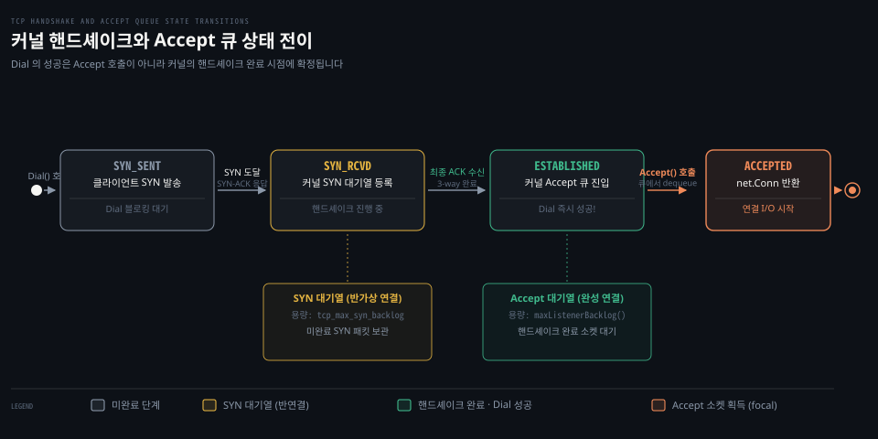

# Listen·ListenConfig·TCPListener

---

> Go 의 net.Listen 은 서버 측 수신 소켓을 열고 포트를 바인딩하며 ListenConfig 와 TCPListener 를 통해 백로그·KeepAlive 설정과 연결 수락 수명주기를 제어합니다.

## 핵심 요약

> 클라이언트 Dial 의 성공은 서버 애플리케이션의 Accept 호출이 아니라 커널 TCP 핸드셰이크의 완료입니다. Listen 으로 열린 수신 소켓은 커널 백로그 큐에 완료된 연결을 쌓아 두고 Accept 는 이 큐에서 완성된 소켓을 하나씩 꺼내 애플리케이션으로 넘깁니다.

서버 프로그래밍에서 클라이언트의 접속을 받아들이는 과정은 애플리케이션 혼자 수행하지 않습니다. 운영체제 커널의 TCP 스택이 3-way 핸드셰이크를 전담하여 수신 큐에 연결을 적재하고 서버 프로세스는 이를 비동기적으로 소비합니다.

Go 표준 라이브러리는 `net.Listen` 편의 함수와 `net.ListenConfig` 설정 구조체, 그리고 수신 루프의 구체 타입인 `net.TCPListener` 를 통해 이 수명주기를 우아하게 다룹니다. 특히 리스너의 `Close()` 메서드는 다른 고루틴에서 블로킹 대기 중인 `Accept()` 를 즉시 깨우는 명확한 종료 계약을 보장합니다.


## 학습 목표

> 이 편을 읽고 나면 아래 다섯 가지를 스스로 해낼 수 있습니다.

1. `net.Listen` 의 호스트 생략 규칙과 포트 0 자동 할당 메커니즘을 설명할 수 있습니다.
2. `net.ListenConfig` 의 `Control` 훅과 `KeepAliveConfig` 설정이 소켓에 반영되는 시점을 구별할 수 있습니다.
3. `net.TCPListener` 의 구체 메서드(`AcceptTCP`, `SetDeadline`, `File`, `Close`)와 종료 시 `Accept` 를 깨우는 계약을 설명할 수 있습니다.
4. 표준 라이브러리 내부에서 `socket` → `bind` → `listen` 호출 흐름과 `maxListenerBacklog` 가 OS 파라미터를 읽어오는 경로를 추적할 수 있습니다.
5. 클라이언트 핸드셰이크 완료와 서버 `Accept()` 호출 간의 시차를 커널 대기열 상태 전이로 설명할 수 있습니다.


## 1. 수신 소켓의 주소 바인딩과 종료 계약은 명확히 정의됩니다

> net.Listen 은 기본 리스너를 열고 ListenConfig 는 세부 옵션을 조율하며 Listener.Close 는 대기 중인 Accept 를 깨웁니다.

서버를 기동할 때 개발자는 어떤 IP 인터페이스에 바인딩할지, 동적 포트를 어떻게 배정받을지 결정해야 합니다. Go 표준 라이브러리는 직관적인 규칙으로 이를 처리합니다.

### 공식 계약: Listen 과 포트 0 바인딩 규칙

공식 문서는 `net.Listen` 함수를 다음과 같이 설명합니다.[^net-listen]

```go
func Listen(network, address string) (Listener, error)
```

네트워크는 `"tcp"`, `"tcp4"`, `"tcp6"`, `"unix"`, `"unixpacket"` 중 하나를 지원합니다.
공식 문서는 TCP 네트워크 주소의 생략 규칙을 엄격하게 명시합니다.

> "For TCP networks, if the host in the address parameter is empty or a literal unspecified IP address, Listen listens on all available unicast and anycast IP addresses of the local system. To only use IPv4, use network "tcp4"."[^net-listen]

호스트 부분이 비어 있거나 `":8080"` 처럼 포트만 지정되면 로컬 시스템의 모든 유니캐스트 및 애니캐스트 IP 주소(IPv4 `0.0.0.0` 과 IPv6 `::`)에 대해 수신 대기합니다. IPv4 로만 제한하려면 네트워크를 `"tcp4"` 로 명시해야 합니다.

테스트 환경에서 충돌 없는 포트를 얻으려면 포트 번호에 `"0"` 을 넘깁니다.

> "If the port in the address parameter is empty or "0", as in "127.0.0.1:" or "[::1]:0", a port number is automatically chosen. The Addr method of Listener can be used to discover the chosen port."[^net-listen]

운영체제가 사용 가능한 임의의 포트를 자동 할당하며 반환된 `Listener.Addr()` 메서드를 호출하여 배정된 실제 포트를 알아낼 수 있습니다.

또한 `Listen` 은 내부적으로 `context.Background()` 를 사용합니다. 컨텍스트 취소나 데드라인을 부여하려면 `ListenConfig.Listen` 을 사용해야 합니다.

### 공식 계약: ListenConfig 설정 구조체

`net.ListenConfig` 구조체는 리스너 생성 옵션을 캡슐화합니다.[^net-listenconfig]

```go
type ListenConfig struct {
	Control func(network, address string, c syscall.RawConn) error
	KeepAlive time.Duration
	KeepAliveConfig KeepAliveConfig
}

func (lc *ListenConfig) Listen(ctx context.Context, network, address string) (Listener, error)
func (lc *ListenConfig) ListenPacket(ctx context.Context, network, address string) (PacketConn, error)
```

`Control` 필드는 소켓이 생성된 직후 운영체제에 바인딩(`bind`)되기 직전에 호출되는 제어 함수입니다. 소켓 재사용 옵션(`SO_REUSEADDR`, `SO_REUSEPORT`)을 주입할 수 있습니다.

`KeepAlive` 와 `KeepAliveConfig` 는 이 리스너가 수락하는 모든 연결에 기본 적용될 프로브 주기를 지정합니다.

### 공식 계약: TCPListener 구체 타입과 Listener.Close 계약

`Listen` 이 반환하는 인터페이스는 추상 `net.Listener` 이지만 TCP 의 실제 구체 인스턴스는 `*net.TCPListener` 입니다.[^net-tcplistener]

```go
type TCPListener struct { /* ... */ }

func (l *TCPListener) Accept() (Conn, error)
func (l *TCPListener) AcceptTCP() (*TCPConn, error)
func (l *TCPListener) Addr() Addr
func (l *TCPListener) Close() error
func (l *TCPListener) File() (f *os.File, err error)
func (l *TCPListener) SetDeadline(t time.Time) error
func (l *TCPListener) SyscallConn() (syscall.RawConn, error)
```

`AcceptTCP()` 메서드는 타입 단언 없이 즉시 `*net.TCPConn` 을 돌려줍니다. `SetDeadline()` 은 리스너의 수락 대기 제한 시간을 지정합니다.

가장 중요한 계약은 `Listener.Close()` 의 블로킹 해제 동작입니다.[^net-listener]

> "Close closes the listener. Any blocked Accept operations will be unblocked and return errors."[^net-listener]

수신 루프를 도는 별도 고루틴이 `Accept()` 에서 멈춰 있을 때 메인 고루틴이 `l.Close()` 를 호출하면 대기 중이던 `Accept()` 가 즉시 깨어나 오류를 반환합니다. 이를 통해 안전하고 우아한 서버 셧다운 루프를 작성할 수 있습니다.


## 2. 커널 소켓 생성부터 Accept 큐 진입까지 단계별로 전이됩니다

> net.Listen 은 socket, bind, listen 시스템 콜을 부르고 poll.FD.Accept 는 netpoller 를 통해 준비된 소켓을 꺼냅니다.

아래 상태 전이 도식은 클라이언트의 SYN 발송부터 커널 큐 적재, 핸드셰이크 완료, 그리고 `Accept()` 가 새 소켓을 꺼내기까지의 상태 변화를 나타냅니다.



표준 라이브러리 내부에서 리스너가 열리고 연결을 수락하는 과정은 세 갈래로 나뉩니다.

### 내부 동작 1: socket, bind, listen 과 maxListenerBacklog

`ListenConfig.Listen` 은 `sysListener.listenTCP` 를 거쳐 `src/net/sock_posix.go` 의 `socket` 함수로 진입합니다.[^src-sock-posix]

```go
func (fd *netFD) listenStream(ctx context.Context, laddr sockaddr, backlog int, ctrlCtxFn func(context.Context, string, string, syscall.RawConn) error) error {
	var err error
	if err = setDefaultListenerSockopts(fd.pfd.Sysfd); err != nil {
		return err
	}
	var lsa syscall.Sockaddr
	if lsa, err = laddr.sockaddr(fd.family); err != nil {
		return err
	}
	if ctrlCtxFn != nil {
		c := newRawConn(fd)
		if err := ctrlCtxFn(ctx, fd.ctrlNetwork(), laddr.String(), c); err != nil {
			return err
		}
	}
	if err = syscall.Bind(fd.pfd.Sysfd, lsa); err != nil {
		return os.NewSyscallError("bind", err)
	}
	if err = listenFunc(fd.pfd.Sysfd, backlog); err != nil {
		return os.NewSyscallError("listen", err)
	}
	if err = fd.init(); err != nil {
		return err
	}
	lsa, _ = syscall.Getsockname(fd.pfd.Sysfd)
	fd.setAddr(fd.family, lsa, nil)
	return nil
}
```

첫째, 소켓 파일 디스크립터를 생성하고 수신 기본 소켓 옵션을 설정합니다.
둘째, `ctrlCtxFn` 이 존재하면 `syscall.Bind` 전에 호출합니다.
셋째, `syscall.Bind` 로 IP 와 포트를 소켓에 묶습니다.
넷째, `listenFunc(fd.pfd.Sysfd, backlog)` 시스템 콜을 호출하여 소켓을 수동 대기 상태(`LISTEN`)로 전환합니다.

여기서 넘겨주는 `backlog` 크기는 `net.go` 의 `listenerBacklog()` 함수가 결정합니다.[^src-net-backlog]
이 함수는 `sync.Once` 로 감싸진 `maxListenerBacklog()` 를 단 한 번 호출하여 시스템 최대값을 캐시합니다.

Linux 시스템(`src/net/sock_linux.go`)에서는 커널 설정 파일인 `/proc/sys/net/core/somaxconn` 을 직접 읽어옵니다.[^src-sock-linux]
파일을 열지 못하면 `syscall.SOMAXCONN`(기본 128)으로 폴백하며 65535 를 넘는 값은 오버플로를 막기 위해 클램핑합니다.
macOS 와 BSD 계열(`src/net/sock_bsd.go`)에서는 `sysctl kern.ipc.somaxconn` 커널 파라미터를 질의합니다.

### 내부 동작 2: poll.FD.Accept 의 논블로킹 루프와 waitRead

소켓이 열린 뒤 애플리케이션이 `l.Accept()` 를 부르면 `src/internal/poll/fd_unix.go` 의 `poll.FD.Accept` 로 진입합니다.[^src-poll-accept]

```go
func (fd *FD) Accept() (int, syscall.Sockaddr, string, error) {
	if err := fd.readLock(); err != nil {
		return -1, nil, "", err
	}
	defer fd.readUnlock()

	if err := fd.pd.prepareRead(fd.isFile); err != nil {
		return -1, nil, "", err
	}
	for {
		s, rsa, errcall, err := accept(fd.Sysfd)
		if err == nil {
			return s, rsa, "", err
		}
		switch err {
		case syscall.EINTR:
			continue
		case syscall.EAGAIN:
			if fd.pd.pollable() {
				if err = fd.pd.waitRead(fd.isFile); err == nil {
					continue
				}
			}
		case syscall.ECONNABORTED:
			continue
		}
		return -1, nil, errcall, err
	}
}
```

`poll.FD.Accept` 의 내부 흐름은 5단계로 진행됩니다.

첫째, 논블로킹 모드의 `accept(fd.Sysfd)` 시스템 콜을 직접 실행합니다.

둘째, 대기열에 완성된 연결이 없어 `syscall.EAGAIN` 오류가 떨어지면 `fd.pd.waitRead(fd.isFile)` 를 호출합니다.

셋째, netpoller 가 현재 고루틴을 대기 상태(`_Gwaiting`)로 파킹합니다. 이 메커니즘은 [01-02.netpoller](01-02.netpoller.md)의 읽기 파킹과 완전히 동일합니다.

넷째, 커널에서 새 연결 완료 이벤트가 도착하여 unpark 되면 루프를 재시작하여 `accept` 를 다시 시도합니다.

다섯째, 클라이언트가 수락 직전에 연결을 끊어 `ECONNABORTED` 가 발생하면 중단하지 않고 루프를 이어갑니다.


## 3. 연결의 성공은 Accept 가 아니라 커널 스택이 결정합니다

> Dial 의 반환 시점은 커널 3-way 핸드셰이크 완료이며 Accept 는 큐에 쌓인 결과를 꺼낼 뿐입니다.

네트워크 서버를 설계할 때 흔히 마주치는 의문은 클라이언트의 연결 성공과 서버 애플리케이션의 수락 사이의 시점 차이입니다. 소켓 프로그래밍을 처음 배울 때 서버의 `Accept()` 가 실행되어야만 클라이언트의 `Dial()` 이 성공한다고 오해하기 쉽습니다.

### 함정과 관찰: 핸드셰이크 완료와 Accept 의 분리

클라이언트 관점에서 `net.Dial()` 이 성공을 반환하는 순간은 서버 프로세스가 `Accept()` 를 실행한 시점이 아닙니다. 커널이 3-way 핸드셰이크(SYN → SYN-ACK → ACK)를 완료하고 소켓을 `ESTABLISHED` 상태로 승격시킨 시점입니다.

커널은 두 개의 대기열을 유지합니다.
1. **SYN 대기열 (반연결 큐)**: SYN 패킷을 받고 SYN-ACK 를 보낸 뒤 최종 ACK 를 기다리는 `SYN_RCVD` 상태의 연결들입니다.
2. **Accept 대기열 (완결 큐)**: 최종 ACK 가 도착하여 3-way 핸드셰이크가 끝난 `ESTABLISHED` 상태의 연결들입니다.

클라이언트의 `net.Dial()` 은 최종 ACK 를 전송한 직후 성공을 반환합니다. 이 시점에 서버 애플리케이션이 바빠서 `Accept()` 를 단 한 번도 부르지 않더라도 커널의 Accept 대기열이 가득 차지 않는 한 클라이언트는 완벽한 연결 성공으로 인식합니다.

이 구조는 [gonet-lab 00-01](../../../../02_os/project/gonet-lab/00-01.listener%20%EC%86%8C%EC%BC%93%EA%B3%BC%20%EC%97%B0%EA%B2%B0%20%EC%86%8C%EC%BC%93.md)에서 다룬 수신 전용 리스너 소켓(`LISTEN`)과 데이터 통신 전용 연결 소켓(`ESTABLISHED`)의 역할 분리와 정확히 일치합니다.

### 실습 관찰: npg-practice 실험 2-c 의 10/10 성공

실습 저장소 `~/study/npg-practice/README.md` 의 3장 실험 기록 중 실험 2-c(지연 취소 팬아웃 실험)는 이 동작을 명확히 증명합니다.

실험에서 서버는 `l.Accept()` 를 단 1회만 호출하도록 제한되었습니다. 그 상태에서 클라이언트 10개가 동시에 `net.DialContext` 를 호출하고 100ms 지연 후 취소를 걸었습니다.

결과는 **10개 연결 모두 핸드셰이크 성공(10/10 성공)** 이었습니다(이 값은 실습 기록에 명시된 AI 확인값입니다).

서버 코드가 두 번째 이후의 `Accept()` 를 전혀 호출하지 않았음에도 불구하고 커널 TCP 스택이 독자적으로 10개의 3-way 핸드셰이크를 모두 완결하여 Accept 큐에 넣어 두었기 때문에 클라이언트 10개 모두 `Dial` 성공을 반환받았습니다.

이 관찰은 백로그 큐 크기(`somaxconn`) 설정이 왜 트래픽 급증 상황에서 서버의 생존을 결정하는지 설명해 줍니다.


## 관련 문서

> 이 섹션과 함께 읽으면 좋은 참고 자료입니다.

- [01_language/docs/go/net MOC](README.md) — net 패키지 공식문서 정독 목록
- [01-01.Conn·Listener·PacketConn·Addr](01-01.Conn·Listener·PacketConn·Addr.md) — net 핵심 인터페이스와 구체 타입 계통
- [01-02.netpoller](01-02.netpoller.md) — 런타임 netpoller 와 논블로킹 I/O 메커니즘
- [02-01.Dial·Dialer](02-01.Dial·Dialer.md) — 클라이언트 연결 수립과 Fast Fallback
- [gonet-lab 00-01](../../../../02_os/project/gonet-lab/00-01.listener%20%EC%86%8C%EC%BC%93%EA%B3%BC%20%EC%97%B0%EA%B2%B0%20%EC%86%8C%EC%BC%93.md) — 리스너 소켓과 연결 소켓의 분리
- [NPG 03-02](../../../../02_os/book/npg_network-programming-with-go/03-02.Go%20의%20TCP%20연결은%20Listen·Accept·Dial%20세%20호출로%20맺는다.md) — Listen, Accept, Dial 세 호출의 기본 실습

[^net-listen]: Go 공식 문서 [func Listen](https://pkg.go.dev/net#Listen)
[^net-listenconfig]: Go 공식 문서 [type ListenConfig](https://pkg.go.dev/net#ListenConfig)
[^net-tcplistener]: Go 공식 문서 [type TCPListener](https://pkg.go.dev/net#TCPListener)
[^net-listener]: Go 공식 문서 [type Listener](https://pkg.go.dev/net#Listener)
[^src-sock-posix]: Go 1.25.1 소스 [src/net/sock_posix.go#L150](https://github.com/golang/go/blob/go1.25.1/src/net/sock_posix.go#L150)
[^src-net-backlog]: Go 1.25.1 소스 [src/net/net.go#L404](https://github.com/golang/go/blob/go1.25.1/src/net/net.go#L404)
[^src-sock-linux]: Go 1.25.1 소스 [src/net/sock_linux.go#L34](https://github.com/golang/go/blob/go1.25.1/src/net/sock_linux.go#L34)
[^src-poll-accept]: Go 1.25.1 소스 [src/internal/poll/fd_unix.go#L594](https://github.com/golang/go/blob/go1.25.1/src/internal/poll/fd_unix.go#L594)
