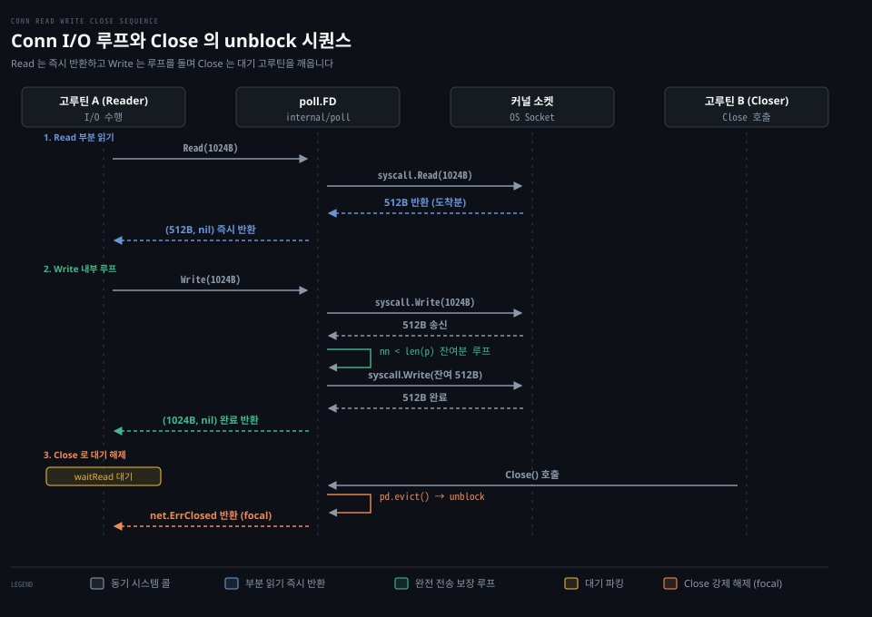

# Conn.Read·Conn.Write·Close

---

> Go 의 net.Conn 은 io.Reader 와 io.Writer 계약을 엄격히 따르며 부분 읽기와 완전 쓰기 루프, fdMutex 기반 동시성 제어, evict 를 통한 블로킹 해제 메커니즘으로 네트워크 I/O 를 완성합니다.

## 핵심 요약

> Read 는 버퍼를 채울 때까지 기다리지 않고 1바이트라도 도착하면 즉시 반환하지만 Write 는 모든 바이트를 쓸 때까지 내부에서 루프를 돕니다. Close 는 런타임 evict 를 호출하여 다른 고루틴에서 대기 중인 모든 Read 와 Write 를 즉각 unblock 시키고 net.ErrClosed 로 깨웁니다.

네트워크 연결이 맺어진 뒤 애플리케이션의 핵심 관심사는 데이터를 주고받고 안전하게 닫는 일입니다. 그러나 네트워크 소켓은 파일과 달리 언제든 데이터가 쪼개져 오거나 상대방이 일방적으로 연결을 끊을 수 있는 불확실한 매체입니다.

Go 는 `io.Reader` 와 `io.Writer` 라는 간결한 표준 인터페이스 계약 위에 소켓 I/O 를 정렬했습니다. 읽기 호출은 커널에 준비된 만큼만 부분 반환하여 반응성을 극대화하는 반면 쓰기 호출은 버퍼 전체가 커널 소켓 버퍼로 넘어갈 때까지 루프를 돌아 신뢰성을 보장합니다. 나아가 소켓 `Close()` 는 런타임 이벤트 폴러와 협력하여 대기 고루틴을 깨우는 깔끔한 정리 경로를 제공합니다.


## 학습 목표

> 이 편을 읽고 나면 아래 다섯 가지를 스스로 해낼 수 있습니다.

1. `io.Reader` 계약(n > 0 와 err 동시 반환 규칙)과 `Conn.Read` 의 부분 읽기 동작을 설명할 수 있습니다.
2. `Conn.Write` 가 버퍼 전체를 전송할 때까지 내부 루프를 순회하는 이유와 타임아웃 시의 부분 쓰기 동작을 구별할 수 있습니다.
3. `fdMutex` 가 64비트 원자적 상태로 읽기 락, 쓰기 락, 참조 카운트를 독립 관리하여 동시 I/O 를 직렬화하는 원리를 설명할 수 있습니다.
4. `Conn.Close` 호출 시 `poll.FD.Close` 에서 `pd.evict()` 와 `runtime_pollUnblock` 으로 이어지는 대기 고루틴 해제 경로를 추적할 수 있습니다.
5. 고정 길이 프레이밍에 `io.ReadFull` 을 사용해야 하는 이유와 `TCPConn.CloseWrite` 를 통한 half-close 의 안전한 적용 패턴을 설명할 수 있습니다.


## 1. 표준 스트림 계약과 네트워크 소켓의 메서드는 일치합니다

> Conn 은 io.Reader 와 io.Writer 를 포함하며 CloseRead 와 CloseWrite 로 단방향 종료를 지원합니다.

네트워크 소켓에서 바이트를 주고받는 인터페이스를 별도로 발명하지 않고 범용 I/O 추상화에 맞춘 것이 Go 라이브러리의 설계 특징입니다.

### 공식 계약: io.Reader 계약과 Conn.Read

`net.Conn` 은 표준 `io.Reader` 인터페이스를 포함합니다. 공식 문서의 `io.Reader` 명세는 모든 Go 개발자가 숙지해야 할 중요한 반환 규칙을 밝힙니다.[^io-reader]

> "Read reads up to len(p) bytes into p. It returns the number of bytes read (0 <= n <= len(p)) and any error encountered. Even if Read returns n < len(p), it may use all of p as scratch space during the call. If some data is available but not len(p) bytes, Read conventionally returns what is available instead of waiting for more."[^io-reader]

소켓에 `len(p)` 바이트보다 적은 데이터만 도착해 있다면 더 기다리지 않고 가용한 바이트만 즉시 반환합니다. 이것이 바로 부분 읽기(partial read)의 공식 계약입니다.

또한 에러와 읽은 바이트 수의 관계에 대해 다음과 같이 명시합니다.

> "When Read encounters an error or end-of-file condition after successfully reading n > 0 bytes, it returns the number of bytes read. It may return the (non-nil) error from the same call or return the error (and n == 0) from a subsequent call... Callers should always process the n > 0 bytes returned before considering the error err."[^io-reader]

`Read` 는 `n > 0` 바이트와 `err` 를 같은 호출에서 동시에 돌려줄 수 있습니다. 따라서 호출자는 에러를 확인하기 전에 반드시 `n > 0` 바이트를 먼저 처리해야 유실을 방지할 수 있습니다.

### 공식 계약: Conn.Write 와 Conn.Close

공식 문서는 `Conn.Write` 와 `Conn.Close` 를 다음과 같이 정의합니다.[^net-conn]

```go
Write(b []byte) (n int, err error)
Close() error
```

`Write` 는 슬라이스 `b` 의 데이터를 연결로 보냅니다. 타임아웃이 설정되면 일부 바이트만 전송된 상태(`n > 0`)에서 에러를 반환할 수 있습니다.

`Close` 는 연결을 완전히 닫습니다. 공식 문서는 닫기 연산의 동시성 계약을 강조합니다.

> "Close closes the connection. Any blocked Read or Write operations will be unblocked and return errors."[^net-conn]

이미 닫힌 연결이나 다른 고루틴이 `Close()` 를 호출하여 I/O 가 중단되었을 때 반환되는 정본 에러는 `net.ErrClosed` 입니다.[^net-errclosed]

```go
var ErrClosed error = errClosed
```

공식 문서는 `ErrClosed` 가 다른 에러에 감싸여 있을 수 있으므로 항상 `errors.Is(err, net.ErrClosed)` 로 판별해야 한다고 안내합니다.[^net-errclosed]

### 공식 계약: TCPConn 의 CloseRead 와 CloseWrite (Half-Close)

전체 소켓을 닫지 않고 한쪽 방향의 데이터 흐름만 종료하려면 `net.TCPConn` 의 단방향 닫기 메서드를 사용합니다.[^net-closeread]

```go
func (c *TCPConn) CloseRead() error
func (c *TCPConn) CloseWrite() error
```

`CloseWrite()` 는 대상 소켓에 TCP FIN 세그먼트만 전송하여 송신을 종료합니다. 읽기 채널은 살아 있으므로 상대방 서버가 보낸 나머지 응답 데이터를 끝까지 수신할 수 있습니다.


## 2. 부분 읽기와 완전 쓰기 루프는 서로 다르게 구현됩니다

> Read 는 syscall.Read 1회로 즉시 빠져나오지만 Write 는 버퍼가 소진될 때까지 내부 루프를 반복합니다.

아래 시퀀스 도식은 1024바이트를 읽을 때 512바이트만 도착해도 즉시 반환하는 부분 읽기, 1024바이트를 쓸 때 내부 루프를 도는 완전 쓰기, 그리고 `Close()` 가 막힌 `Read()` 고루틴을 깨우는 unblock 과정을 나타냅니다.



표준 라이브러리 `internal/poll/fd_unix.go` 의 구현을 보면 읽기와 쓰기의 비대칭 구조가 선명하게 드러납니다.

### 내부 동작 1: poll.FD.Read 의 단발 반환

`poll.FD.Read` 는 소켓 버퍼에서 한 번 읽어낸 즉시 호출자에게 제어를 넘깁니다.[^src-poll-read]

```go
func (fd *FD) Read(p []byte) (int, error) {
	if err := fd.readLock(); err != nil {
		return 0, err
	}
	defer fd.readUnlock()
	if len(p) == 0 {
		return 0, nil
	}
	if err := fd.pd.prepareRead(fd.isFile); err != nil {
		return 0, err
	}
	if fd.IsStream && len(p) > maxRW {
		p = p[:maxRW]
	}
	for {
		n, err := ignoringEINTRIO(syscall.Read, fd.Sysfd, p)
		if err != nil {
			n = 0
			if err == syscall.EAGAIN && fd.pd.pollable() {
				if err = fd.pd.waitRead(fd.isFile); err == nil {
					continue
				}
			}
		}
		err = fd.eofError(n, err)
		return n, err
	}
}
```

첫째, `fd.readLock()` 을 획득하여 동시 읽기 고루틴들 사이의 순서를 직렬화합니다.
둘째, `syscall.Read` 가 `EAGAIN` 을 내면 `waitRead` 로 고루틴을 파킹합니다.
셋째, 패킷이 도착하여 `n > 0` 바이트를 읽으면 루프를 다시 돌지 않고 즉시 `return n, err` 로 빠져나옵니다. 버퍼 `p` 가 아무리 크더라도 가용한 만큼만 읽고 즉각 반환합니다.

### 내부 동작 2: poll.FD.Write 의 완전 전송 보장 루프

반면 `poll.FD.Write` 는 버퍼 전체가 전송될 때까지 내부에서 루프를 돕니다.[^src-poll-write]

```go
func (fd *FD) Write(p []byte) (int, error) {
	if err := fd.writeLock(); err != nil {
		return 0, err
	}
	defer fd.writeUnlock()
	if err := fd.pd.prepareWrite(fd.isFile); err != nil {
		return 0, err
	}
	var nn int
	for {
		max := len(p)
		if fd.IsStream && max-nn > maxRW {
			max = nn + maxRW
		}
		n, err := ignoringEINTRIO(syscall.Write, fd.Sysfd, p[nn:max])
		if n > 0 {
			nn += n
		}
		if nn == len(p) {
			return nn, err
		}
		if err == syscall.EAGAIN && fd.pd.pollable() {
			if err = fd.pd.waitWrite(fd.isFile); err == nil {
				continue
			}
		}
		if err != nil {
			return nn, err
		}
		if n == 0 {
			return nn, io.ErrUnexpectedEOF
		}
	}
}
```

누적 전송 바이트 `nn` 이 슬라이스 전체 길이 `len(p)` 와 같아질 때 비로소 `return nn, err` 합니다. 커널 소켓 버퍼가 가득 차서 `syscall.Write` 가 일부만 쓰고 `EAGAIN` 을 반환하면 netpoller 로 고루틴을 잠재운 뒤 깨어나 남은 바이트 슬라이스 `p[nn:max]` 를 계속해서 밀어 넣습니다.

### 내부 동작 3: fdMutex 기반의 동시성 제어

`internal/poll/fd_mutex.go` 는 단일 64비트 원자적 정수로 소켓의 수명과 락을 관리합니다.[^src-poll-fdmutex]

```go
type fdMutex struct {
	state uint64
	rsema uint32
	wsema uint32
}
```

상태 필드의 비트 구성은 다음과 같습니다.
- 1비트: 소켓 종료 여부 (`mutexClosed`)
- 1비트: 읽기 연산 전용 락 (`mutexRLock`)
- 1비트: 쓰기 연산 전용 락 (`mutexWLock`)
- 20비트: 전체 참조 카운트 (`mutexRef`)
- 20비트: 읽기 대기자 수 (`mutexRWait`)
- 20비트: 쓰기 대기자 수 (`mutexWWait`)

읽기 연산은 `mutexRLock` 을 잡고 쓰기 연산은 `mutexWLock` 을 잡습니다. 두 비트가 완전히 분리되어 있으므로 하나의 `net.Conn` 에 대해 한 고루틴이 `Read` 를 수행하고 다른 고루틴이 `Write` 를 수행하는 것은 동시에 일어납니다. 반면 여러 고루틴이 동시에 `Read` 를 호출하면 `mutexRLock` 에 의해 직렬화됩니다.

### 내부 동작 4: Close 의 evict 경로와 대기 해제

소켓을 닫을 때 `poll.FD.Close` 는 다음과 같이 실행됩니다.[^src-poll-close]

```go
func (fd *FD) Close() error {
	if !fd.fdmu.increfAndClose() {
		return errClosing(fd.isFile)
	}
	fd.pd.evict()
	err := fd.decref()
	if fd.isBlocking == 0 {
		runtime_Semacquire(&fd.csema)
	}
	return err
}
```

`poll.FD.Close` 의 unblock 실행 순서는 4단계로 이어집니다.

첫째, `increfAndClose()` 로 상태에 `mutexClosed` 비트를 켭니다. 이후 들어오는 모든 I/O 시도는 즉시 실패합니다.

둘째, `fd.pd.evict()` 를 호출합니다. 이는 `runtime_pollUnblock(pd.runtimeCtx)` 으로 연결됩니다.[^src-poll-evict]

셋째, 런타임의 `poll_runtime_pollUnblock` 함수가 대기 중인 고루틴을 찾습니다.[^src-netpoll-unblock] `netpollunblock` 과 `netpollgoready` 를 호출하여 고루틴을 실행 가능 상태(`_Grunnable`)로 깨웁니다.

넷째, 깨어난 고루틴은 `errClosing` 감지 후 `net.ErrClosed` 를 반환하며 안전하게 빠져나옵니다.


## 3. 부분 읽기의 위험과 안전한 소켓 종료 패턴

> 고정 크기 메시지 수신에는 io.ReadFull 을 쓰고 단방향 전송 완료에는 CloseWrite 를 씁니다.

바이트 스트림 소켓을 다룰 때 가장 흔한 버그는 부분 읽기로 인한 메시지 깨짐과 성급한 연결 종료입니다. 스트림 지향 프로토콜 위에서 애플리케이션 프로토콜을 구현할 때 자주 겪는 함정과 해결책입니다.

### 함정과 관찰: Read 는 버퍼를 채운다는 보장이 없다

많은 초심자가 `buf := make([]byte, 1024)` 를 만든 뒤 `conn.Read(buf)` 가 1024바이트를 꽉 채워 돌려줄 것이라 가정하고 코드를 작성합니다.

하지만 TCP 는 경계 없는 바이트 스트림입니다. 네트워크 혼잡 제어나 패킷 분할로 인해 송신자가 1024바이트를 보냈더라도 수신 커널에는 먼저 100바이트만 도착할 수 있습니다. 앞서 본 `poll.FD.Read` 구현처럼 Go 는 100바이트가 도착한 즉시 `(100, nil)` 을 반환합니다.

따라서 헤더 길이나 고정 크기 페이로드를 읽을 때는 반드시 `io.ReadFull` 또는 `io.ReadAtLeast` 를 사용해야 합니다.

```go
header := make([]byte, 16)
if _, err := io.ReadFull(conn, header); err != nil {
	return fmt.Errorf("헤더 수신 실패: %w", err)
}
```

`io.ReadFull` 은 내부적으로 버퍼가 가득 찰 때까지 `conn.Read` 를 반복 호출해 주므로 부분 읽기로 인한 데이터 손상을 완벽히 차단합니다. 이에 관한 상세 분석은 [Learning Go 13-01](../../../book/lgo_learning-go/13-01.io.Reader%20%EB%8A%94%20%EB%B2%84%ED%8D%BC%EB%A5%BC%20%EB%B0%9B%EC%95%84%20%EC%B1%84%EC%9A%B0%EA%B3%A0%20%EC%9E%91%EC%9D%80%20%EC%9D%B8%ED%84%B0%ED%8E%98%EC%9D%B4%EC%8A%A4%EB%A5%BC%20%EA%B2%B9%EC%B3%90%20%EA%B8%B0%EB%8A%A5%EC%9D%84%20%EB%8D%94%ED%95%A9%EB%8B%88%EB%8B%A4.md)과 [NPG 04-01](../../../../02_os/book/npg_network-programming-with-go/04-01.TCP%20는%20경계%20없는%20바이트%20흐름이라%20읽는%20쪽이%20메시지를%20자른다.md)을 참고할 수 있습니다.

### 함정과 관찰: 프록시에서의 조기 Close 와 CloseWrite 의 역할

양방향 통신 프록시나 요청-응답 프로토콜에서 클라이언트가 데이터 송신을 마쳤다고 해서 소켓 전체를 `conn.Close()` 해 버리면 서버가 뒤이어 전송 중이던 응답 패킷까지 함께 소멸합니다.

이때 안전한 해결책이 `net.TCPConn.CloseWrite` 입니다.

```go
if tcpConn, ok := conn.(*net.TCPConn); ok {
	_ = tcpConn.CloseWrite()
}
```

쓰기 채널에만 FIN 세그먼트를 날려 서버에 "송신 완료"를 알리고 읽기 채널은 열어 두어 서버의 마지막 응답이 `io.EOF` 로 끝날 때까지 대기한 뒤 최종 `Close()` 를 부르는 구조입니다. 이 half-close 패턴의 구체적인 구현과 프록시 중계 기법은 [NPG 04-02](../../../../02_os/book/npg_network-programming-with-go/04-02.io%20의%20Copy·MultiWriter·TeeReader%20로%20연결을%20잇고%20엿본다.md)에서 자세히 다룹니다.


## 관련 문서

> 이 섹션과 함께 읽으면 좋은 참고 자료입니다.

- [01_language/docs/go/net MOC](README.md) — net 패키지 공식문서 정독 목록
- [01-01.Conn·Listener·PacketConn·Addr](01-01.Conn·Listener·PacketConn·Addr.md) — net 핵심 인터페이스와 구체 타입 계통
- [01-02.netpoller](01-02.netpoller.md) — 런타임 netpoller 와 논블로킹 I/O 메커니즘
- [02-01.Dial·Dialer](02-01.Dial·Dialer.md) — 클라이언트 연결 수립과 Fast Fallback
- [Learning Go 13-01](../../../book/lgo_learning-go/13-01.io.Reader%20%EB%8A%94%20%EB%B2%84%ED%8D%BC%EB%A5%BC%20%EB%B0%9B%EC%95%84%20%EC%B1%84%EC%9A%B0%EA%B3%A0%20%EC%9E%91%EC%9D%80%20%EC%9D%B8%ED%84%B0%ED%8E%98%EC%9D%B4%EC%8A%A4%EB%A5%BC%20%EA%B2%B9%EC%B3%90%20%EA%B8%B0%EB%8A%A5%EC%9D%84%20%EB%8D%94%ED%95%A9%EB%8B%88%EB%8B%A4.md) — io.Reader 의 버퍼 채우기 규약
- [NPG 04-01](../../../../02_os/book/npg_network-programming-with-go/04-01.TCP%20는%20경계%20없는%20바이트%20흐름이라%20읽는%20쪽이%20메시지를%20자른다.md) — TCP 바이트 스트림과 프레이밍
- [NPG 04-02](../../../../02_os/book/npg_network-programming-with-go/04-02.io%20의%20Copy·MultiWriter·TeeReader%20로%20연결을%20잇고%20엿본다.md) — io.Copy 와 CloseWrite 기반 half-close 프록시

[^io-reader]: Go 공식 문서 [type Reader](https://pkg.go.dev/io#Reader)
[^net-conn]: Go 공식 문서 [type Conn](https://pkg.go.dev/net#Conn)
[^net-errclosed]: Go 공식 문서 [var ErrClosed](https://pkg.go.dev/net#ErrClosed)
[^net-closeread]: Go 공식 문서 [func (*TCPConn) CloseRead](https://pkg.go.dev/net#TCPConn.CloseRead)
[^src-poll-read]: Go 1.25.1 소스 [src/internal/poll/fd_unix.go#L141](https://github.com/golang/go/blob/go1.25.1/src/internal/poll/fd_unix.go#L141)
[^src-poll-write]: Go 1.25.1 소스 [src/internal/poll/fd_unix.go#L360](https://github.com/golang/go/blob/go1.25.1/src/internal/poll/fd_unix.go#L360)
[^src-poll-fdmutex]: Go 1.25.1 소스 [src/internal/poll/fd_mutex.go#L12](https://github.com/golang/go/blob/go1.25.1/src/internal/poll/fd_mutex.go#L12)
[^src-poll-close]: Go 1.25.1 소스 [src/internal/poll/fd_unix.go#L91](https://github.com/golang/go/blob/go1.25.1/src/internal/poll/fd_unix.go#L91)
[^src-poll-evict]: Go 1.25.1 소스 [src/internal/poll/fd_poll_runtime.go#L57](https://github.com/golang/go/blob/go1.25.1/src/internal/poll/fd_poll_runtime.go#L57)
[^src-netpoll-unblock]: Go 1.25.1 소스 [src/runtime/netpoll.go#L452](https://github.com/golang/go/blob/go1.25.1/src/runtime/netpoll.go#L452)
