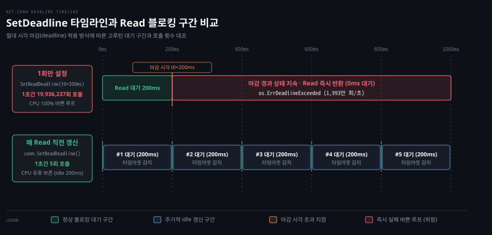

# SetDeadline·SetReadDeadline·SetWriteDeadline

---

> Go 의 네트워크 데드라인은 상대적 대기 시간이 아니라 미래의 한 시점을 못 박는 절대 시각이며, 지난 마감 시각을 갱신하지 않고 I/O 를 반복 호출하면 대기 없이 즉시 실패하여 1초에 수천만 회의 바쁜 루프를 유발합니다.


## 핵심 요약

> 데드라인은 상대 시간 간격이 아니라 미래의 특정 벽시계 시점을 가리키는 절대 시각입니다. 한 번 설정된 데드라인은 해당 시각 이후의 모든 Read 및 Write 호출을 즉시 실패하게 만들므로, 유휴 타임아웃을 안전하게 다루려면 I/O 호출 직전마다 미래 시점으로 마감 시각을 연장해야 합니다.

많은 프로그래밍 언어의 소켓 라이브러리는 읽기 타임아웃을 "호출 시점부터 5초"처럼 상대 시간 간격으로 지정합니다. 하지만 Go 의 `net.Conn` 인터페이스는 `time.Duration` 대신 `time.Time` 타입을 인자로 받는 세 가지 메서드(`SetDeadline`, `SetReadDeadline`, `SetWriteDeadline`)를 제공합니다.

이 설계는 단일 I/O 단위가 아니라 전체 작업 흐름의 최종 상한선을 정하는 데 적합합니다. 그러나 마감 시각이 한 번 지나간 소켓은 자동으로 복구되지 않으며, 새로운 마감 시각을 지정하기 전까지 모든 후속 I/O 가 대기 시간 없이 즉시 반환됩니다. 이를 간과하고 읽기 루프를 구성하면 심각한 CPU 낭비가 발생합니다.


## 학습 목표

> 이 편을 읽고 나면 아래 다섯 가지를 스스로 해낼 수 있습니다.

1. `net.Conn` 인터페이스가 정의하는 데드라인의 절대 시각 계약과 `zero value` 해제 동작을 설명할 수 있습니다.
2. `poll.FD.SetDeadline` 부터 `runtime_pollSetDeadline`, `netpolldeadlineimpl` 로 이어지는 런타임 타이머와 고루틴 깨움 메커니즘을 추적할 수 있습니다.
3. 데드라인 초과 시 반환되는 에러가 `os.ErrDeadlineExceeded` 를 래핑하는 구조와 `errors.Is` 판별법을 작성할 수 있습니다.
4. 마감 시각이 경과한 뒤 발생하는 바쁜 루프의 원인을 분석하고 실측 횟수 차이를 진단할 수 있습니다.
5. 유휴 연결을 안전하게 회수하기 위해 매 `Read` 직전마다 마감 시각을 갱신하는 idle timeout 패턴을 올바르게 구현할 수 있습니다.


## 1. 데드라인은 상대 간격이 아니라 절대 시각으로 모든 미래 I/O 에 적용됩니다

> 네트워크 통신에서 무한정 블로킹되는 현상을 막기 위해 Conn 은 절대 시각 기반의 데드라인 계약을 맺으며 제로 값 전달로 이를 해제합니다.

원격 서버가 침묵하거나 패킷이 유실될 때 I/O 호출이 제어권을 넘겨주지 못하면 애플리케이션의 고루틴과 메모리가 무제한으로 묶입니다. Go 는 이 문제를 해결하기 위해 절대 시각 기반의 세 가지 데드라인 메서드를 제공합니다.

### 공식 계약: Conn 인터페이스의 데드라인 명세 전문

Go 공식 문서는 `Conn.SetDeadline` 메서드의 계약을 다음과 같이 상세하게 규정합니다.[^godoc-conn]

```go
// SetDeadline sets the read and write deadlines associated
// with the connection. It is equivalent to calling both
// SetReadDeadline and SetWriteDeadline.
//
// A deadline is an absolute time after which I/O operations
// fail instead of blocking. The deadline applies to all future
// and pending I/O, not just the immediately following call to
// Read or Write. After a deadline has been exceeded, the
// connection can be refreshed by setting a deadline in the future.
//
// If the deadline is exceeded a call to Read or Write or to other
// I/O methods will return an error that wraps os.ErrDeadlineExceeded.
// This can be tested using errors.Is(err, os.ErrDeadlineExceeded).
// The error's Timeout method will return true, but note that there
// are other possible errors for which the Timeout method will
// return true even if the deadline has not been exceeded.
//
// An idle timeout can be implemented by repeatedly extending
// the deadline after successful Read or Write calls.
//
// A zero value for t means I/O operations will not time out.
SetDeadline(t time.Time) error
```

이 명세에서 주목해야 할 핵심 조항은 네 가지입니다.

첫째, 데드라인은 **절대 시각(absolute time)** 입니다. 5초 동안 기다리라는 뜻이 아니라 특정 벽시계 시점을 지정합니다. 호출자는 `time.Now().Add(5 * time.Second)` 와 같이 미래 시점을 계산하여 넘겨야 합니다.

둘째, 데드라인은 직후의 단일 호출뿐 아니라 **모든 미래 및 대기 중인 I/O(all future and pending I/O)** 에 적용됩니다. 즉 한 번 설정된 데드라인은 소켓의 영구적인 마감 상태로 남아 있으며, 이미 블로킹되어 있던 다른 고루틴의 `Read` 나 `Write` 도 해당 시각이 되면 즉시 중단됩니다.

셋째, 제로 값(`time.Time{}`)을 전달하면 타임아웃이 해제됩니다. 공식 문서는 "A zero value for t means I/O operations will not time out" 이라고 밝힙니다. 설정했던 마감 시한을 없애고 다시 무제한 블로킹 모드로 되돌릴 때 이 제로 값을 사용합니다.

넷째, 마감 초과 시 에러는 `os.ErrDeadlineExceeded` 를 감쌉니다. 호출자는 `errors.Is(err, os.ErrDeadlineExceeded)` 로 이를 신뢰성 있게 판별할 수 있습니다. `net.Error.Timeout()` 또한 `true` 를 반환하지만 공식 문서는 데드라인 초과 외의 다른 타임아웃 에러도 `Timeout() == true` 일 수 있음을 경고합니다.

### 읽기와 쓰기 데드라인의 분리

`SetReadDeadline` 과 `SetWriteDeadline` 은 읽기 채널과 쓰기 채널의 마감 시각을 독립적으로 다룹니다.[^godoc-conn] 특히 쓰기 작업에 대해 공식 문서는 중요한 단서를 덧붙입니다.

> "Even if write times out, it may return n > 0, indicating that some of the data was successfully written."[^godoc-conn]

네트워크 쓰기 작업이 타임아웃 오류를 반환하더라도 소켓 버퍼에 일부 바이트가 이미 적재되었을 수 있습니다. 따라서 쓰기 타임아웃 처리 시에는 반환된 바이트 수 `n` 을 반드시 확인해야 데이터 중복이나 유실을 방지할 수 있습니다.


## 2. 런타임 타이머는 마감 시각이 지나면 파킹된 고루틴을 깨웁니다

> I/O 대기 중 스레드를 낭비하지 않으려면 런타임 폴러와 타이머가 협력하여 정확한 마감 시각에 고루틴만 깨워내야 합니다.

동기식 블로킹 코드를 유지하면서도 마감 시각에 맞춰 작업을 중단시키기 위해, Go 런타임은 폴러 디스크립터(`pollDesc`) 안에 타이머를 직접 탑재했습니다.

### 내부 동작: poll.FD 에서 runtime_pollSetDeadline 으로의 흐름

호출자가 `conn.SetReadDeadline(t)` 를 호출하면 내부의 `poll.FD.SetReadDeadline` 으로 전달됩니다.[^src-poll-deadline]

```go
// src/internal/poll/fd_poll_runtime.go (go1.25.1)
func (fd *FD) SetReadDeadline(t time.Time) error {
	return setDeadlineImpl(fd, t, 'r')
}

func setDeadlineImpl(fd *FD, t time.Time, mode int) error {
	var d int64
	if !t.IsZero() {
		d = int64(time.Until(t))
		if d == 0 {
			d = -1 // don't confuse deadline right now with no deadline
		}
	}
	if err := fd.incref(); err != nil {
		return err
	}
	defer fd.decref()

	if fd.pd.runtimeCtx == 0 {
		return ErrNoDeadline
	}
	runtime_pollSetDeadline(fd.pd.runtimeCtx, d, mode)
	return nil
}
```

`setDeadlineImpl` 은 전달된 시각 `t` 가 제로 값이 아니면 `time.Until(t)` 를 통해 현재 시점과의 나노초 차이 `d` 를 계산합니다. 만약 차이가 정확히 0 이라면 마감이 없는 상태(`0`)와 혼동되지 않도록 `-1` 로 보정합니다.

이후 `runtime_pollSetDeadline` 을 호출하여 런타임으로 진입합니다. 이 함수는 `src/runtime/netpoll.go` 에 `//go:linkname` 으로 연결된 `poll_runtime_pollSetDeadline` 입니다.[^src-runtime-deadline]

```go
// src/runtime/netpoll.go (go1.25.1)
func poll_runtime_pollSetDeadline(pd *pollDesc, d int64, mode int) {
	lock(&pd.lock)
	// ...
	if d > 0 {
		d += nanotime()
	}
	if mode == 'r' || mode == 'r'+'w' {
		pd.rd = d
	}
	// ...
	if !pd.rrun {
		if pd.rd > 0 {
			pd.rt.modify(pd.rd, 0, rtf, pd.makeArg(), pd.rseq)
			pd.rrun = true
		}
	}
	// ...
	// 이미 지난 시각으로 설정한 경우 즉시 unblock
	delta := int32(0)
	var gRead *g
	if pd.rd < 0 {
		gRead = netpollunblock(pd, 'r', false, &delta)
	}
	unlock(&pd.lock)
	if gRead != nil {
		netpollgoready(gRead, 3)
	}
}
```

런타임은 디스크립터의 읽기 마감 시각 `pd.rd` 를 절대 나노초로 기록하고 런타임 타이머(`pd.rt`)를 설정합니다. 만약 이미 과거인 시각이 전달되어 `pd.rd < 0` 이 되면, 대기 중이던 고루틴을 `netpollunblock` 과 `netpollgoready` 로 즉시 깨워냅니다.

### 내부 동작: 타이머 만료와 고루틴 기상

대기 도중 타이머가 만료되면 런타임 타이머 콜백인 `netpolldeadlineimpl` 이 실행됩니다.[^src-runtime-deadlineimpl]

```go
// src/runtime/netpoll.go (go1.25.1)
func netpolldeadlineimpl(pd *pollDesc, seq uintptr, read, write bool) {
	lock(&pd.lock)
	// ...
	if read {
		pd.rd = -1 // 마감 초과 상태 기록
		pd.publishInfo()
		gRead = netpollunblock(pd, 'r', false, &delta)
	}
	unlock(&pd.lock)
	if gRead != nil {
		netpollgoready(gRead, 0) // 고루틴 실행 대기열 투입
	}
}
```

타이머가 울리면 `pd.rd` 를 `-1` 로 변경하여 마감이 초과되었음을 영구 표기하고, 파킹되어 있던 고루틴을 대기열로 깨워냅니다. 앞서 01-02(netpoller 편)에서 살펴본 것처럼, 잠에서 깬 고루틴은 `convertErr` 단계에서 `pollErrTimeout` 을 감지합니다. 이 값은 최종적으로 `poll.ErrDeadlineExceeded` 로 변환되어 호출자에게 반환됩니다.[^src-poll-err]


## 3. 지난 데드라인을 갱신하지 않으면 1초에 2천만 회의 바쁜 루프가 발생합니다

> 한 번 지난 데드라인을 연장하지 않고 루프를 반복하면 대기 시간 없이 즉시 에러가 반환되어 극심한 CPU 과부하가 일어납니다.

아래 도식은 데드라인을 한 번만 설정했을 때 발생하는 즉시 실패 바쁜 루프와, 매 `Read` 직전 갱신하는 유휴 타임아웃 패턴의 실행 구간을 시간축 위에서 대조합니다.



### 함정과 관찰: 마감 경과 후 Read 의 즉시 반환

데드라인에 관해 개발자가 가장 자주 범하는 실수는 "데드라인이 지났으니 다음 `Read` 는 다시 처음부터 기다릴 것이다"라는 오해입니다.

앞선 공식 계약에서 확인했듯, 데드라인은 "모든 미래 I/O" 에 적용됩니다. 따라서 `conn.SetReadDeadline(time.Now().Add(200 * time.Millisecond))` 를 한 번만 호출하고 읽기 루프를 돌리면 다음과 같은 파국이 벌어집니다.

1. 첫 번째 `Read`: 200ms 동안 정상 대기 후 타임아웃 오류를 반환합니다.
2. 마감 시각이 이미 지났으므로 `pd.rd` 는 여전히 과거 시점으로 남아 있습니다.
3. 두 번째 `Read`: 런타임 폴러로 들어가자마자 이미 지난 마감 시각을 확인하고 **0ms 만에 즉시 오류를 반환**합니다.
4. 이후 루프는 대기 시간 없이 초당 수백만 번을 돌며 CPU 코어 하나를 100% 점유합니다.

실제 실습 프로젝트인 `~/study/npg-practice` 3장 실험 3(실행 기록 2026-10-06)의 측정 결과는 이 위험을 숫자로 증명합니다. 아무 데이터도 보내지 않는 침묵 클라이언트를 상대로 1초 동안 200ms 데드라인 루프를 돌렸을 때:

- **한 번만 설정한 경우**: 1초 동안 `conn.Read` 가 **19,936,237회(약 1,993만 회)** 호출되었습니다.
- **매 `Read` 직전 재설정한 경우**: 1초 동안 정확히 **5회** 호출되었습니다.

두 경우 모두 반환된 에러는 `errors.Is(err, os.ErrDeadlineExceeded)` 가 `true` 였지만, 전자에서는 시스템 자원이 고갈되었습니다.

### 올바른 패턴: idle timeout 과 gonet-lab 인용

이 문제를 해결하는 정석 패턴은 공식 문서가 권고한 대로 "I/O 호출 직전마다 미래 시점으로 데드라인을 미는 것"입니다.

책 정독본 [NPG 03-03 §4](../../../../02_os/book/npg_network-programming-with-go/03-03.%ED%83%80%EC%9E%84%EC%95%84%EC%9B%83%EC%9D%80%20Dialer%C2%B7context%20%EB%A1%9C%2C%20%EC%9C%A0%ED%9C%B4%20%EA%B0%90%EC%A7%80%EB%8A%94%20%EB%8D%B0%EB%93%9C%EB%9D%BC%EC%9D%B8%EA%B3%BC%20%ED%95%98%ED%8A%B8%EB%B9%84%ED%8A%B8%EB%A1%9C%20%EA%B1%B4%EB%8B%A4.md)가 인용했듯이, `gonet-lab` 프로젝트의 에코 서버 구현체(`internal/tcp/server.go`)에서도 동일한 패턴을 채택하고 있습니다.[^gonet-lab-idle]

```go
// gonet-lab internal/tcp/server.go handleEcho 핵심 루프 패턴
for {
	// 매 Read 호출 직전에 데드라인을 지금 시점 + idle 시간으로 연장
	err := conn.SetReadDeadline(time.Now().Add(idleTimeout))
	if err != nil {
		return err
	}

	n, err := conn.Read(buf)
	if err != nil {
		if errors.Is(err, os.ErrDeadlineExceeded) {
			// 유휴 연결 시간 초과 처리
			log.Printf("연결 유휴 시간 초과: %v", conn.RemoteAddr())
			return nil
		}
		return err
	}
	// 데이터 처리 ...
}
```

이 패턴을 사용하면 클라이언트가 통신을 이어갈 때는 데드라인이 미래로 계속 연장됩니다. 반대로 연결이 침묵하여 `idleTimeout` 동안 패킷이 도착하지 않을 때만 안전하게 타임아웃을 감지하여 소켓을 회수할 수 있습니다.


## 관련 문서

> 이 섹션과 함께 읽으면 좋은 참고 자료입니다.

- [01_language/docs/go/net MOC](README.md) — net 패키지 공식문서 정독 목록
- [01-01.Conn·Listener·PacketConn·Addr](01-01.Conn%C2%B7Listener%C2%B7PacketConn%C2%B7Addr.md) — Conn 인터페이스 정의와 소켓 계층 구조
- [01-02.netpoller](01-02.netpoller.md) — 런타임 netpoller 와 고루틴 파킹 메커니즘
- [03-03.Error·OpError·DNSError](03-03.Error%C2%B7OpError%C2%B7DNSError.md) — net 패키지의 에러 계통과 타임아웃 판별
- [NPG 03-03](../../../../02_os/book/npg_network-programming-with-go/03-03.%ED%83%80%EC%9E%84%EC%95%84%EC%9B%83%EC%9D%80%20Dialer%C2%B7context%20%EB%A1%9C%2C%20%EC%9C%A0%ED%9C%B4%20%EA%B0%90%EC%A7%80%EB%8A%94%20%EB%8D%B0%EB%93%9C%EB%9D%BC%EC%9D%B8%EA%B3%BC%20%ED%95%98%ED%8A%B8%EB%B9%84%ED%8A%B8%EB%A1%9C%20%EA%B1%B4%EB%8B%A4.md) — 타임아웃과 데드라인 실습 및 handleEcho 인용
- [gonet-lab 01-01](../../../../02_os/project/gonet-lab/01-01.%EC%A1%B0%EC%9A%A9%ED%95%9C%20%EC%97%B0%EA%B2%B0%EC%9D%B4%20%EC%84%9C%EB%B2%84%EB%A5%BC%20%EB%A9%88%EC%B6%98%EB%8B%A4%20-%20goroutine%C2%B7FD%C2%B7idle%20timeout.md) — 조용한 연결이 유발하는 고루틴 고갈과 idle timeout 해법

[^godoc-conn]: Go 공식 문서 [net.Conn.SetDeadline](https://pkg.go.dev/net#Conn)
[^src-poll-deadline]: Go 1.25.1 소스 [src/internal/poll/fd_poll_runtime.go#L131](https://github.com/golang/go/blob/go1.25.1/src/internal/poll/fd_poll_runtime.go#L131)
[^src-runtime-deadline]: Go 1.25.1 소스 [src/runtime/netpoll.go#L372](https://github.com/golang/go/blob/go1.25.1/src/runtime/netpoll.go#L372)
[^src-runtime-deadlineimpl]: Go 1.25.1 소스 [src/runtime/netpoll.go#L622](https://github.com/golang/go/blob/go1.25.1/src/runtime/netpoll.go#L622)
[^src-poll-err]: Go 1.25.1 소스 [src/internal/poll/fd.go#L49](https://github.com/golang/go/blob/go1.25.1/src/internal/poll/fd.go#L49)
[^gonet-lab-idle]: 실습 프로젝트 `write/02_os/project/gonet-lab` 의 연결 유휴 타임아웃 구현 패턴 참조
