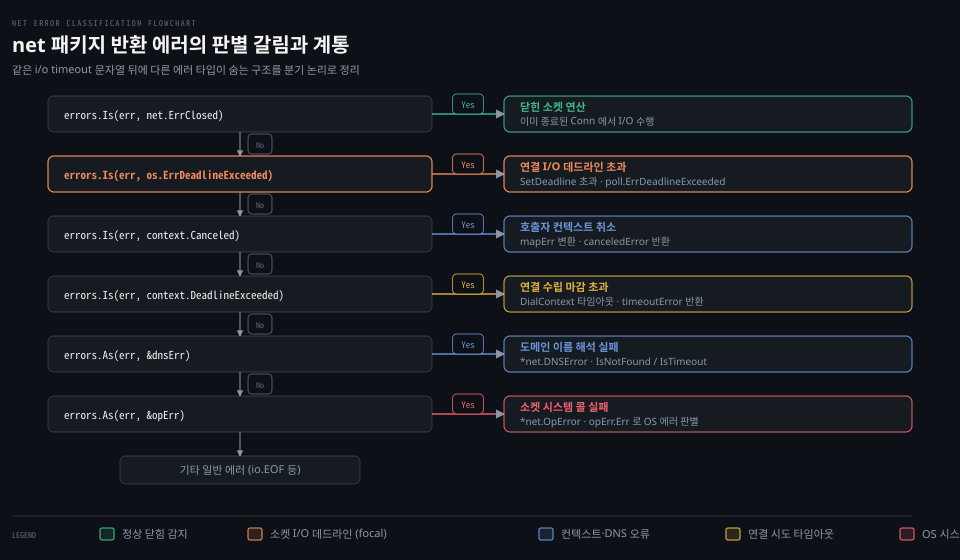

# Error·OpError·DNSError

---

> net 패키지가 반환하는 에러는 `net.Error` 인터페이스와 `*net.OpError` 구조체로 감싸져 있으며, 같은 "i/o timeout" 문자열이라도 연결 시도와 소켓 I/O 에 따라 실제 타입이 다르므로 `errors.Is` 와 `errors.As` 로 계통을 판별해야 합니다.


## 핵심 요약

> 네트워크 에러는 발생 맥락에 따라 서로 다른 구체 타입으로 래핑되므로 문자열 매칭 대신 트리 탐색 함수로 판별해야 합니다. Go 표준 라이브러리는 소켓 연산 메타데이터를 담는 OpError 와 네임서버 조회를 나타내는 DNSError 를 제공하며, 내부 mapErr 를 통해 컨텍스트 취소와 소켓 타임아웃을 정교하게 결합합니다.

네트워크 프로그래밍에서 실패는 여러 지점에서 발생합니다. 상대방이 포트를 열어두지 않아 즉시 거부당할 수도 있고, 도메인 이름 조회가 실패하거나, 연결 대기 시간이 초과될 수도 있습니다.

Go 는 이처럼 다양한 실패 상황을 다루기 위해 단순한 에러 문자열을 반환하지 않습니다. 대신 시스템 콜과 네트워크 종단 정보를 품은 `OpError` 로 감싸서 반환합니다. 특히 타임아웃의 경우 연결 수립 단계와 연결된 소켓 I/O 단계에서 서로 다른 센티널 에러가 매핑되므로, 정확한 원인을 진단하려면 표준 라이브러리의 에러 트리 구조를 이해해야 합니다.


## 학습 목표

> 이 편을 읽고 나면 아래 다섯 가지를 스스로 해낼 수 있습니다.

1. `net.Error` 인터페이스의 메서드 계약과 `Temporary()` 메서드가 폐기(Deprecated)된 이유를 설명할 수 있습니다.
2. `OpError`, `DNSError`, `AddrError`, `ErrClosed` 각 타입이 담고 있는 필드 구조와 역할을 구분할 수 있습니다.
3. `src/net/net.go` 내부의 `mapErr` 함수가 `context.Canceled` 와 `context.DeadlineExceeded` 를 내부 에러 타입으로 변환하는 동작을 추적할 수 있습니다.
4. 연결 시도 타임아웃과 연결 후 I/O 데드라인 초과가 같은 "i/o timeout" 문자열 뒤에 서로 다른 에러 값을 갖는 이유를 진단할 수 있습니다.
5. `errors.Is` 와 `errors.As` 를 활용하여 `syscall.ECONNREFUSED`, `net.ErrClosed`, 타임아웃 에러를 순서대로 판별하는 안전한 에러 처리 코드를 작성할 수 있습니다.


## 1. 네트워크 에러는 인터페이스 하나와 네 가지 구체 타입으로 계통을 이룹니다

> 실패한 시스템 콜과 네트워크 주소를 추적하지 못하면 분산 환경에서 장애 원인을 특정하기 어려우므로, net 패키지는 풍부한 메타데이터를 담은 에러 계통을 제공합니다.

네트워크 I/O 실패는 애플리케이션 버그인지, DNS 장애인지, 커널 소켓 거부인지 신속하게 가려내야 합니다. Go 는 이를 위해 세부 에러 타입을 분리했습니다.

### 공식 계약: net.Error 인터페이스와 Temporary() 의 폐기

모든 네트워크 에러의 바탕에는 `net.Error` 인터페이스가 있습니다.[^godoc-error]

```go
type Error interface {
	error
	Timeout() bool // Is the error a timeout?

	// Deprecated: Temporary errors are not well-defined.
	// Most "temporary" errors are timeouts, and the few exceptions are surprising.
	// Do not use this method.
	Temporary() bool
}
```

공식 문서는 `Temporary()` 메서드에 대해 명확한 사용 중단 경고를 남깁니다. 일시적 에러의 기준이 모호하고 대부분의 일시적 오류는 사실상 타임아웃에 불과하기 때문입니다.

극소수의 예외는 예상치 못한 동작을 유발하기도 합니다. 따라서 신규 코드에서는 `Temporary()` 를 호출하지 말고 `errors.Is` 나 `errors.As` 로 구체적인 원인을 직접 검사해야 합니다.

### 공식 계약: OpError, DNSError, AddrError, ErrClosed

함수들이 실제로 반환하는 대표적인 구체 타입은 다음과 같습니다.

첫째, **`OpError`** 는 net 패키지 함수가 가장 흔히 반환하는 래퍼 구조체입니다.[^godoc-operror]

```go
type OpError struct {
	Op     string // "read", "write", "dial" 등 실패한 연산
	Net    string // "tcp", "udp" 등 네트워크 종류
	Source Addr   // 로컬 네트워크 주소
	Addr   Addr   // 원격 네트워크 주소
	Err    error  // 실제 발생한 내부 에러
}

func (e *OpError) Unwrap() error
```

`OpError` 는 `Unwrap()` 메서드를 구현하고 있어 `errors.Is` 나 `errors.As` 가 그 안쪽의 시스템 콜 에러(`syscall.Errno`)나 타임아웃 에러를 자연스럽게 탐색할 수 있습니다.

둘째, **`DNSError`** 는 호스트 주소 해석 실패를 표현합니다.[^godoc-dnserror]

```go
type DNSError struct {
	UnwrapErr   error
	Err         string
	Name        string // 조회하려던 도메인 이름
	Server      string // 사용한 DNS 서버 주소
	IsTimeout   bool   // 타임아웃 여부
	IsTemporary bool
	IsNotFound  bool   // NXDOMAIN 또는 레코드 없음 여부
}
```

도메인을 찾지 못한 경우 `IsNotFound` 가 `true` 로 설정되므로 클라이언트는 잘못된 호스트명을 빠르게 감지할 수 있습니다.

셋째, **`AddrError`** 는 유효하지 않은 IP 주소나 포트 번호를 파싱할 때 발생합니다.[^godoc-addrerror]

```go
type AddrError struct {
	Err  string
	Addr string
}
```

넷째, **`net.ErrClosed`** 는 이미 닫힌 소켓에 I/O 를 시도했음을 나타내는 표준 센티널 에러입니다.[^godoc-errclosed]

```go
var ErrClosed error = errClosed
```

공식 문서는 다른 고루틴이 연결을 닫았거나 이미 닫힌 연결에서 읽기/쓰기를 호출했을 때 반환되며, `errors.Is(err, net.ErrClosed)` 로 판별할 것을 권장합니다.

### 시스템 콜 에러와 syscall.ECONNREFUSED 판별

원격 호스트가 포트 수신을 거부하면 운영체제는 TCP RST 세그먼트를 반환하고 시스템 콜은 `ECONNREFUSED` 에러를 냅니다. 이때 Go 는 `*OpError` 내부에 `*os.SyscallError` 를 담고 그 안에 `syscall.ECONNREFUSED` 를 포장합니다.

`errors.Is` 는 래핑 체인을 깊이 우선으로 탐색하므로, 최상위 `err` 에 대해 곧바로 다음과 같이 검사할 수 있습니다.[^godoc-errors-is]

```go
if errors.Is(err, syscall.ECONNREFUSED) {
	log.Println("서버가 연결을 거부했습니다. 포트가 닫혀 있습니다.")
}
```


## 2. mapErr 는 컨텍스트 에러를 내부 역사적 센티널로 매핑합니다

> 새로운 동시성 제어 추상화가 도입될 때 기존 에러 문자열 계약을 깨뜨리지 않으려면 타입 변환 어댑터가 필요합니다.

Go 1.7 에서 표준 라이브러리에 `context` 패키지가 편입되었을 때, `net` 패키지는 이전 버전과의 호환성을 지키면서도 `context.Canceled` 를 만족시켜야 하는 과제를 안았습니다.

### 내부 동작: src/net/net.go 의 mapErr 구현

표준 라이브러리는 `src/net/net.go` 에 내부 변환 함수 `mapErr` 를 두었습니다.[^src-net-maperr]

```go
// src/net/net.go (go1.25.1)
func mapErr(err error) error {
	switch err {
	case context.Canceled:
		return errCanceled
	case context.DeadlineExceeded:
		return errTimeout
	default:
		return err
	}
}
```

이 함수가 반환하는 `errCanceled` 와 `errTimeout` 은 표준 라이브러리 내부 전용 타입입니다.

```go
// src/net/net.go (go1.25.1)
type canceledError struct{}

func (canceledError) Error() string   { return "operation was canceled" }
func (canceledError) Is(err error) bool { return err == context.Canceled }

var errTimeout error = &timeoutError{}

type timeoutError struct{}

func (e *timeoutError) Error() string   { return "i/o timeout" }
func (e *timeoutError) Timeout() bool   { return true }
func (e *timeoutError) Temporary() bool { return true }
func (e *timeoutError) Is(err error) bool {
	return err == context.DeadlineExceeded
}
```

이 매핑 구조는 문자열과 타입 비교를 둘 다 충족합니다.

1. **문자열 호환성 유지**: `errTimeout.Error()` 는 수많은 레거시 코드가 문자열로 파싱하던 `"i/o timeout"` 을 그대로 유지합니다.
2. **트리 탐색 호환성 제공**: `timeoutError` 가 `Is(err error) bool` 메서드를 구현하여 `err == context.DeadlineExceeded` 일 때 `true` 를 반환합니다. 덕분에 최신 Go 코드의 `errors.Is(err, context.DeadlineExceeded)` 호출이 완벽하게 동작합니다.

하지만 여기서 중요한 비대칭이 발생합니다. `timeoutError` 는 `os.ErrDeadlineExceeded` 와는 아무런 관련이 없다는 점입니다.


## 3. 같은 "i/o timeout" 문자열이라도 내부 에러 값은 다릅니다

> 로그에 동일한 에러 문자열이 찍힌다고 해서 동일한 방법으로 복구를 시도하면, 조건문이 항상 거짓으로 평가되어 장애 처리 로직이 동작하지 않습니다.

아래 도식은 net 패키지 호출에서 에러가 반환되었을 때 `errors.Is` 와 `errors.As` 를 통해 올바른 원인을 짚어내는 체계적인 판별 순서를 보여줍니다.



### 함정과 관찰: npg-practice 실험 1 과 실험 3 의 실측 차이

실습 프로젝트 `~/study/npg-practice` 의 3장 실험 기록은 "i/o timeout" 뒤에 숨은 실체를 분명하게 드러냅니다.

실험 1(`dial_context_test.go`)은 `Dialer.Control` 에서 고의로 잠들게 하여 연결 시도 마감을 초과시켰고, 실험 3(`deadline_test.go`)은 이미 연결된 소켓에서 `SetReadDeadline` 을 초과시켰습니다. 두 실험의 판별 결과는 아래 표와 같이 완전히 갈렸습니다.

| 검사 항목 | 연결 시도 타임아웃 (실험 1 DialContext) | 소켓 I/O 데드라인 초과 (실험 3 SetReadDeadline) |
|---|---|---|
| 에러 문자열 (`err.Error()`) | `"i/o timeout"` (OpError 로 래핑) | `"i/o timeout"` (OpError 로 래핑) |
| `errors.Is(err, context.DeadlineExceeded)` | **`true`** (`timeoutError.Is` 만족) | **`false`** |
| `errors.Is(err, os.ErrDeadlineExceeded)` | **`false`** | **`true`** (`DeadlineExceededError`) |
| `errors.As(err, &netErr)` 후 `Timeout()` | **`true`** | **`true`** |

놀랍게도 두 에러 모두 화면에는 `"dial tcp 10.0.0.0:80: i/o timeout"` 혹은 `"read tcp 127.0.0.1:xxx: i/o timeout"` 처럼 동일한 문구가 찍힙니다. 하지만:

- `DialContext` 의 타임아웃은 `context.DeadlineExceeded` 로만 잡힙니다. `os.ErrDeadlineExceeded` 로 검사하면 무조건 `false` 가 나옵니다.
- `conn.Read` 의 타임아웃은 `os.ErrDeadlineExceeded` 로만 잡힙니다. `context.DeadlineExceeded` 로 검사하면 무조건 `false` 가 나옵니다.

따라서 소켓 읽기/쓰기 루프에서는 `os.ErrDeadlineExceeded` 를 기준으로 삼고, 다이얼이나 고수준 컨텍스트 파이프라인에서는 `context.DeadlineExceeded` 를 기준으로 삼아야 합니다.

### 안전한 에러 판별 종합 코드

이 원리를 종합한 네트워크 에러 처리 패턴은 다음과 같이 계통 순서대로 구성합니다.

```go
func handleNetError(err error) {
	if err == nil {
		return
	}

	// 1. 소켓 종료 여부 확인
	if errors.Is(err, net.ErrClosed) {
		log.Println("소켓이 정상 종료되었습니다.")
		return
	}

	// 2. 소켓 I/O 데드라인 초과 확인
	if errors.Is(err, os.ErrDeadlineExceeded) {
		log.Println("소켓 읽기/쓰기 마감 시각이 초과되었습니다.")
		return
	}

	// 3. 컨텍스트 마감 초과 확인 (DialContext 등)
	if errors.Is(err, context.DeadlineExceeded) {
		log.Println("컨텍스트 연결 수립 마감이 만료되었습니다.")
		return
	}

	// 4. 컨텍스트 명시적 취소 확인
	if errors.Is(err, context.Canceled) {
		log.Println("호출자에 의해 작업이 취소되었습니다.")
		return
	}

	// 5. DNS 해석 오류 확인
	var dnsErr *net.DNSError
	if errors.As(err, &dnsErr) {
		log.Printf("DNS 조회 실패: 호스트=%s, 미발견=%v", dnsErr.Name, dnsErr.IsNotFound)
		return
	}

	// 6. 구체 시스템 콜 오류 확인
	var opErr *net.OpError
	if errors.As(err, &opErr) {
		if errors.Is(opErr.Err, syscall.ECONNREFUSED) {
			log.Printf("연결 거부: %s (대상: %v)", opErr.Op, opErr.Addr)
			return
		}
		log.Printf("네트워크 시스템 콜 오류: 연산=%s, 에러=%v", opErr.Op, opErr.Err)
		return
	}

	log.Printf("기타 일반 오류: %v", err)
}
```

이처럼 구체적인 센티널 에러부터 시작해 `errors.As` 로 계층을 좁혀 들어가는 방식이 Go 표준 라이브러리가 의도한 네트워크 에러 처리 정석입니다.


## 관련 문서

> 이 섹션과 함께 읽으면 좋은 참고 자료입니다.

- [01_language/docs/go/net MOC](README.md) — net 패키지 공식문서 정독 목록
- [01-01.Conn·Listener·PacketConn·Addr](01-01.Conn%C2%B7Listener%C2%B7PacketConn%C2%B7Addr.md) — Conn 인터페이스와 소켓 추상화
- [03-02.SetDeadline·SetReadDeadline·SetWriteDeadline](03-02.SetDeadline%C2%B7SetReadDeadline%C2%B7SetWriteDeadline.md) — 데드라인 절대 시각 계약과 os.ErrDeadlineExceeded
- [Learning Go 09-02](../../../book/lgo_learning-go/09-02.%EC%98%A4%EB%A5%98%EB%A5%BC%20%EA%B0%90%EC%8B%B8%EB%A9%B4%20%ED%8A%B8%EB%A6%AC%EA%B0%80%20%EB%90%98%EA%B3%A0%20errors.Is%20%EC%99%80%20As%20%EA%B0%80%20%EA%B7%B8%20%EC%95%88%EC%9D%84%20%EC%B0%BE%EC%8A%B5%EB%8B%88%EB%8B%A4.md) — errors.Is 와 As 가 에러 트리를 탐색하는 원리
- [NPG 03-03](../../../../02_os/book/npg_network-programming-with-go/03-03.%ED%83%80%EC%9E%84%EC%95%84%EC%9B%83%EC%9D%80%20Dialer%C2%B7context%20%EB%A1%9C%2C%20%EC%9C%A0%ED%9C%B4%20%EA%B0%90%EC%A7%80%EB%8A%94%20%EB%8D%B0%EB%93%9C%EB%9D%BC%EC%9D%B8%EA%B3%BC%20%ED%95%98%ED%8A%B8%EB%B9%84%ED%8A%B8%EB%A1%9C%20%EA%B1%B4%EB%8B%A4.md) — 타임아웃과 컨텍스트 판별 실습

[^godoc-error]: Go 공식 문서 [net.Error](https://pkg.go.dev/net#Error)
[^godoc-operror]: Go 공식 문서 [net.OpError](https://pkg.go.dev/net#OpError)
[^godoc-dnserror]: Go 공식 문서 [net.DNSError](https://pkg.go.dev/net#DNSError)
[^godoc-addrerror]: Go 공식 문서 [net.AddrError](https://pkg.go.dev/net#AddrError)
[^godoc-errclosed]: Go 공식 문서 [net.ErrClosed](https://pkg.go.dev/net#ErrClosed)
[^godoc-errors-is]: Go 공식 문서 [errors.Is](https://pkg.go.dev/errors#Is)
[^src-net-maperr]: Go 1.25.1 소스 [src/net/net.go#L458](https://github.com/golang/go/blob/go1.25.1/src/net/net.go#L458)
