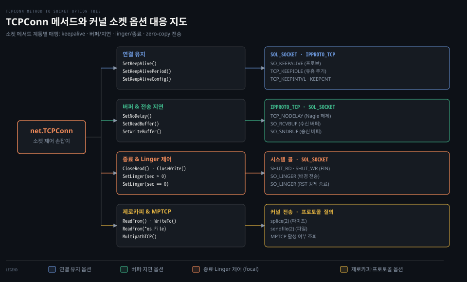

# TCPConn

---

> 구체 타입 `TCPConn` 은 `Conn` 추상 인터페이스 아래 감춰져 있던 운영체제 커널의 TCP 소켓 옵션과 제로카피 시스템 콜을 제어하는 저수준 손잡이입니다.


## 핵심 요약

> TCPConn 은 추상 스트림 연결을 넘어 커널 TCP 계층의 고유 설정과 최적화 전송을 직접 제어하는 구체 타입입니다. 연결 유지 프로브, Nagle 알고리즘 해제, RST 강제 종료를 동반하는 Linger 제어, 그리고 splice 및 sendfile 을 통한 제로카피 데이터 전송을 제공합니다.

표준 인터페이스 `net.Conn` 은 대부분의 애플리케이션에 충분한 읽기·쓰기 추상화를 제공합니다. 하지만 실시간 게임의 극단적인 지연 시간 단축, 고성능 파일 서버의 커널 전송 최적화, 프록시 서버의 TCP 반절 닫기(half-close) 같은 정밀한 제어는 인터페이스 수준에서 다룰 수 없습니다.

Go 는 이러한 요구를 수용하기 위해 구체 포인터 `*net.TCPConn` 에 전용 메서드들을 집중시켰습니다. 개발자는 필요할 때 타입 단언을 거쳐 소켓 옵션(`setsockopt`)과 시스템 콜(`shutdown`, `splice`, `sendfile`)을 직접 조작할 수 있습니다.


## 학습 목표

> 이 편을 읽고 나면 아래 다섯 가지를 스스로 해낼 수 있습니다.

1. `SetKeepAlive`, `SetKeepAlivePeriod`, `SetKeepAliveConfig` 메서드가 제어하는 커널 소켓 옵션을 구분할 수 있습니다.
2. `SetNoDelay` 메서드의 기본값과 Nagle 알고리즘 해제가 패킷 전송 지연에 미치는 영향을 설명할 수 있습니다.
3. `SetLinger` 의 세 가지 파라미터 영역(음수, 0, 양수)에 따른 커널 닫기 동작과 RST 강제 종료 메커니즘을 구별할 수 있습니다.
4. `ReadFrom` 과 `WriteTo` 가 리눅스 커널에서 `splice` 및 `sendfile` 로 진입하여 제로카피를 수행하는 조건을 설명할 수 있습니다.
5. `CloseRead` 와 `CloseWrite` 를 활용하여 TCP 반절 닫기(half-close) 프로토콜을 올바르게 구현할 수 있습니다.


## 1. 운영체제 TCP 옵션은 프로토콜 전용 메서드로 직접 조정합니다

> 범용 스트림 인터페이스만으로는 커널의 패킷 지연 알고리즘이나 연결 상태 감시 주기를 최적화할 수 없으므로, TCPConn 은 명시적인 소켓 튜닝 메서드를 제공합니다.

애플리케이션마다 네트워크 지연과 처리량에 대한 요구사항은 상반됩니다. 작은 패킷을 즉시 보내야 하는 대화형 셸과 큰 대역폭을 채워야 하는 대용량 전송은 서로 다른 소켓 옵션이 필요합니다.

### 공식 계약: 연결 유지와 KeepAliveConfig

TCP 연결 유지는 원격 종단의 비정상적인 전원 차단이나 중간 방화벽의 세션 증발을 감지하는 핵심 수단입니다.[^godoc-tcpconn]

```go
func (c *TCPConn) SetKeepAlive(keepalive bool) error
func (c *TCPConn) SetKeepAlivePeriod(d time.Duration) error
func (c *TCPConn) SetKeepAliveConfig(config KeepAliveConfig) error
```

Go 1.23 부터 도입된 `SetKeepAliveConfig` 는 연결 유지 프로브의 세부 파라미터를 구조체 단위로 제어합니다.[^godoc-keepalive-config]

```go
type KeepAliveConfig struct {
	Enable   bool
	Idle     time.Duration // 첫 프로브 전송 전 대기 시간 (기본값 15초)
	Interval time.Duration // 프로브 재전송 간격 (기본값 15초)
	Count    int           // 응답 없을 때 연결 종료 기준 실패 횟수 (기본값 9회)
}
```

공식 문서는 각 필드가 0 일 때 표준 기본값(Idle 15초, Interval 15초, Count 9회)이 적용되며, 음수를 지정하면 해당 소켓 옵션이 커널 기본값 상태로 유지된다고 명시합니다.

### 공식 계약: Nagle 알고리즘과 SetNoDelay

`SetNoDelay` 는 작은 패킷들을 묶어 전송 효율을 높이는 Nagle 알고리즘의 동작 여부를 제어합니다.[^godoc-tcpconn-nodelay]

> "SetNoDelay controls whether the operating system should delay packet transmission in hopes of sending fewer packets (Nagle's algorithm). The default is true (no delay), meaning that data is sent as soon as possible after a Write."[^godoc-tcpconn-nodelay]

Go 는 연결이 맺어지면 기본적으로 `SetNoDelay(true)` 를 적용합니다. 즉 Nagle 알고리즘을 해제하여 `Write` 호출 직후 패킷이 즉시 송신망으로 나가도록 설정합니다. 이는 대화형 RPC 나 웹 서비스에서 불필요한 전송 지연을 사전에 차단하기 위한 기본 설계입니다.

### 공식 계약: 종료 지연과 SetLinger

`SetLinger` 는 아직 커널 버퍼에 남아 있는 미전송 데이터를 `Close()` 호출 시 어떻게 다룰지 결정합니다.[^godoc-tcpconn-linger]

1. `sec < 0` (기본값): 소켓을 닫고 반환하되, 커널이 배경에서 남은 데이터를 모두 전송하고 정상 4-way FIN 핸드셰이크를 완료합니다.
2. `sec == 0`: 운영체제가 아직 송신되지 않았거나 확인 응답(ACK)을 받지 못한 **모든 데이터를 즉시 폐기**합니다.
3. `sec > 0`: 커널이 배경에서 데이터를 전송하지만, 리눅스 등 일부 운영체제에서는 모든 데이터가 전송되거나 폐기될 때까지 `Close()` 호출 자체가 블로킹될 수 있습니다.

### 공식 계약: TCP 반절 닫기와 MPTCP

`CloseRead` 와 `CloseWrite` 는 TCP 연결의 양방향 스트림 중 한쪽만 종료하는 반절 닫기(half-close)를 수행합니다.[^godoc-tcpconn]

- `CloseWrite()`: 송신 스트림을 닫고 상대방에게 FIN 세그먼트를 전달합니다. 클라이언트는 요청 본문 송신을 모두 마쳤음을 알리면서도 수신 채널은 그대로 열어두어 서버 응답을 계속 읽을 수 있습니다.
- `CloseRead()`: 수신 스트림을 닫습니다. 이후 도착하는 데이터는 버려집니다.

또한 `MultipathTCP()` 메서드는 현재 연결이 여러 네트워크 경로를 동시에 묶어 쓰는 MPTCP 로 동작하고 있는지 여부를 불리언 값으로 보고합니다.[^godoc-tcpconn-mptcp]


## 2. TCPConn 손잡이는 내부에서 계층별 소켓 옵션과 매핑됩니다

> 상위 계층의 단순한 함수 호출은 내부적으로 솔_소켓 레벨과 IP 프로토콜 레벨의 커널 시스템 콜로 변환됩니다.

아래 도식은 `TCPConn` 의 각 제어 메서드가 어떤 시스템 콜 및 소켓 옵션 레벨과 연결되는지를 구조도로 보여줍니다.



### 내부 동작: 소켓 옵션 레벨과 상수 매핑

Go 표준 라이브러리의 `src/net/tcpsockopt_*.go` 와 `src/net/sockopt_posix.go` 는 각 메서드를 커널 소켓 옵션 시스템 콜(`SetsockoptInt`, `SetsockoptLinger`)로 연결합니다.[^src-net-sockopt]

```go
// src/net/sockopt_posix.go (go1.25.1)
func (fd *netFD) setReadBuffer(bytes int) error {
	return fd.pfd.SetsockoptInt(syscall.SOL_SOCKET, syscall.SO_RCVBUF, bytes)
}

func (fd *netFD) setWriteBuffer(bytes int) error {
	return fd.pfd.SetsockoptInt(syscall.SOL_SOCKET, syscall.SO_SNDBUF, bytes)
}

func (fd *netFD) setKeepAlive(keepalive bool) error {
	return fd.pfd.SetsockoptInt(syscall.SOL_SOCKET, syscall.SO_KEEPALIVE, boolint(keepalive))
}

func (fd *netFD) setLinger(sec int) error {
	var l syscall.Linger
	if sec >= 0 {
		l.Onoff = 1
		l.Linger = int32(sec)
	}
	return fd.pfd.SetsockoptLinger(syscall.SOL_SOCKET, syscall.SO_LINGER, &l)
}
```

소켓 자체의 속성인 수신 버퍼(`SO_RCVBUF`), 송신 버퍼(`SO_SNDBUF`), 연결 유지 활성화(`SO_KEEPALIVE`), 종료 지연(`SO_LINGER`)은 모두 일반 소켓 레벨인 `syscall.SOL_SOCKET` 에 전달됩니다.

반면 TCP 고유의 옵션은 프로토콜 레벨인 `syscall.IPPROTO_TCP` 에 적용됩니다.[^src-net-tcpsockopt]

```go
// src/net/tcpsockopt_posix.go (go1.25.1)
func (fd *netFD) setNoDelay(noDelay bool) error {
	return fd.pfd.SetsockoptInt(syscall.IPPROTO_TCP, syscall.TCP_NODELAY, boolint(noDelay))
}

// src/net/tcpsockopt_unix.go (go1.25.1)
func setKeepAliveIdle(fd *netFD, d time.Duration) error {
	secs := int(roundDurationUp(d, time.Second))
	return fd.pfd.SetsockoptInt(syscall.IPPROTO_TCP, syscall.TCP_KEEPIDLE, secs)
}
```

유휴 주기는 리눅스에서 `TCP_KEEPIDLE`, macOS(Darwin)에서는 `TCP_KEEPALIVE` 상수로 매핑됩니다. 재전송 간격과 횟수 또한 각각 `TCP_KEEPINTVL` 과 `TCP_KEEPCNT` 로 변환되어 소켓에 반영됩니다.


## 3. ReadFrom 과 WriteTo 는 커널 제로카피로 사용자 복사를 건너뜁니다

> 유저 공간 버퍼로 데이터를 읽어 들인 뒤 다시 소켓으로 밀어 넣는 방식은 CPU 복사와 문맥 교환 비용을 유발하므로, Go 는 커널 수준의 제로카피 전송을 지원합니다.

`TCPConn` 은 `io.ReaderFrom` 과 `io.WriterTo` 인터페이스를 구현합니다. 일반적인 스트림 복사는 유저 버퍼(`[]byte`)를 거쳐 2회의 시스템 콜과 메모리 복사를 수반하지만, Go 는 가능한 경우 커널 전송 시스템 콜을 직접 호출합니다.

### 내부 동작: splice 와 sendfile 의 진입 경로

`src/net/tcpsock_posix.go` 의 `readFrom` 구현은 세 단계로 분기합니다.[^src-net-tcpsock-posix]

```go
// src/net/tcpsock_posix.go (go1.25.1)
func (c *TCPConn) readFrom(r io.Reader) (int64, error) {
	if n, err, handled := spliceFrom(c.fd, r); handled {
		return n, err
	}
	if n, err, handled := sendFile(c.fd, r); handled {
		return n, err
	}
	return genericReadFrom(c, r)
}

func (c *TCPConn) writeTo(w io.Writer) (int64, error) {
	if n, err, handled := spliceTo(w, c.fd); handled {
		return n, err
	}
	return genericWriteTo(c, w)
}
```

첫째, 리눅스 환경에서 입력 스트림 `r` 이 TCP 연결이거나 스트림 지향 유닉스 도메인 소켓인 경우 `spliceFrom` 이 동작합니다.[^src-net-splice] 이 함수는 리눅스의 `splice(2)` 시스템 콜을 호출하여 유저 공간을 거치지 않고 커널 파이프 버퍼를 통해 데이터를 즉시 중계합니다.

둘째, 입력 스트림 `r` 이 디스크 파일(`*os.File`)이거나 이를 감싼 `*io.LimitedReader` 인 경우 `sendFile` 이 동작합니다.[^src-net-sendfile] 이 경로는 운영체제의 `sendfile(2)` 시스템 콜을 실행하여 디스크 페이지 캐시에서 네트워크 카드 버퍼로 데이터를 직접 쏘아 올립니다.

셋째, 위 두 가지 제로카피 조건을 만족하지 못하면 `genericReadFrom` 으로 폴백하여 유저 공간 메모리 버퍼를 사용하는 일반 복사를 수행합니다.

### 함정과 관찰: SetLinger(0) 과 RST 강제 종료

책 정독본 [NPG 04-03](../../../../02_os/book/npg_network-programming-with-go/04-03.TCPConn%20%EC%86%90%EC%9E%A1%EC%9D%B4%EC%99%80%20%ED%9D%94%ED%95%9C%20%EB%B2%84%EA%B7%B8%20%E2%80%94%20keepalive%C2%B7linger%C2%B7%EB%B2%84%ED%8D%BC%C2%B7zero%20window%C2%B7CLOSE_WAIT.md)은 `TCPConn` 제어 손잡이와 흔한 버그 패턴을 자세히 다루고 있습니다.

그중에서도 특히 주의해야 할 손잡이가 바로 `SetLinger(0)` 입니다.

일반적인 소켓 종료(`Close()`)는 송신 버퍼의 잔여 데이터를 모두 보낸 뒤 FIN 패킷을 보내는 정상 종료 절차를 밟습니다. 반면 `tcpConn.SetLinger(0)` 을 설정한 뒤 `Close()` 를 호출하면 커널은 잔류 데이터를 즉시 버리고 상대방에게 **RST(Reset) 패킷**을 날립니다.

이 강제 종료는 소켓을 `TIME_WAIT` 상태에 남겨두지 않고 포트를 즉시 회수할 수 있다는 장점이 있습니다. 하지만 수신 측 소켓 버퍼에 도착해 있던 데이터까지 상대방 커널이 강제로 폐기해 버릴 수 있으므로, 비즈니스 데이터를 완전히 주고받아야 하는 일반 통신에서는 사용을 지양해야 합니다.


## 관련 문서

> 이 섹션과 함께 읽으면 좋은 참고 자료입니다.

- [01_language/docs/go/net MOC](README.md) — net 패키지 공식문서 정독 목록
- [01-01.Conn·Listener·PacketConn·Addr](01-01.Conn%C2%B7Listener%C2%B7PacketConn%C2%B7Addr.md) — net 패키지의 인터페이스 추상화와 구체 타입 계통
- [01-02.netpoller](01-02.netpoller.md) — 논블로킹 시스템 콜과 런타임 이벤트 폴러
- [03-02.SetDeadline·SetReadDeadline·SetWriteDeadline](03-02.SetDeadline%C2%B7SetReadDeadline%C2%B7SetWriteDeadline.md) — 데드라인 계약과 런타임 타이머 동작
- [03-03.Error·OpError·DNSError](03-03.Error%C2%B7OpError%C2%B7DNSError.md) — net 패키지 에러 계통과 타임아웃 판별
- [NPG 04-03](../../../../02_os/book/npg_network-programming-with-go/04-03.TCPConn%20%EC%86%90%EC%9E%A1%EC%9D%B4%EC%99%80%20%ED%9D%94%ED%95%9C%20%EB%B2%84%EA%B7%B8%20%E2%80%94%20keepalive%C2%B7linger%C2%B7%EB%B2%84%ED%8D%BC%C2%B7zero%20window%C2%B7CLOSE_WAIT.md) — TCPConn 손잡이와 흔한 버그 상세 분석

[^godoc-tcpconn]: Go 공식 문서 [type TCPConn](https://pkg.go.dev/net#TCPConn)
[^godoc-keepalive-config]: Go 공식 문서 [type KeepAliveConfig](https://pkg.go.dev/net#KeepAliveConfig)
[^godoc-tcpconn-nodelay]: Go 공식 문서 [TCPConn.SetNoDelay](https://pkg.go.dev/net#TCPConn.SetNoDelay)
[^godoc-tcpconn-linger]: Go 공식 문서 [TCPConn.SetLinger](https://pkg.go.dev/net#TCPConn.SetLinger)
[^godoc-tcpconn-mptcp]: Go 공식 문서 [TCPConn.MultipathTCP](https://pkg.go.dev/net#TCPConn.MultipathTCP)
[^src-net-sockopt]: Go 1.25.1 소스 [src/net/sockopt_posix.go#L44](https://github.com/golang/go/blob/go1.25.1/src/net/sockopt_posix.go#L44)
[^src-net-tcpsockopt]: Go 1.25.1 소스 [src/net/tcpsockopt_posix.go#L14](https://github.com/golang/go/blob/go1.25.1/src/net/tcpsockopt_posix.go#L14)
[^src-net-tcpsock-posix]: Go 1.25.1 소스 [src/net/tcpsock_posix.go#L47](https://github.com/golang/go/blob/go1.25.1/src/net/tcpsock_posix.go#L47)
[^src-net-splice]: Go 1.25.1 소스 [src/net/splice_linux.go#L19](https://github.com/golang/go/blob/go1.25.1/src/net/splice_linux.go#L19)
[^src-net-sendfile]: Go 1.25.1 소스 [src/net/sendfile.go#L15](https://github.com/golang/go/blob/go1.25.1/src/net/sendfile.go#L15)
