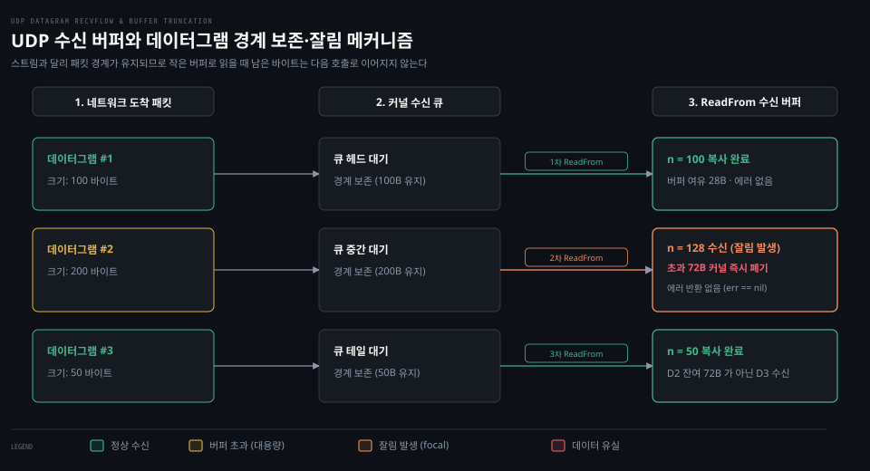

# UDPConn·ListenPacket

---

> UDP 소켓은 연결 수립 없이 패킷 단위로 통신하는 비연결 지향 전송이므로, net 패키지는 스트림 인터페이스(Conn)와 구별되는 PacketConn 인터페이스와 UDPConn 구체 손잡이를 제공합니다.


## 핵심 요약

> UDPConn 은 패킷 단위 독립 전송을 다루는 구체 타입으로 PacketConn 과 Conn 인터페이스를 동시에 충족합니다. ListenPacket 과 ListenUDP 는 바인딩된 로컬 주소에서 모든 원격 호스트의 데이터그램을 수신하고, DialUDP 로 커널 레벨 목적지를 고정한 connected UDP 에서는 주소 지정 없이 Read 와 Write 를 수행할 수 있습니다.

TCP 와 달리 UDP 는 연결 상태나 흐름 제어, 혼잡 제어를 커널이 보장하지 않습니다. 대신 독립된 데이터그램 경계를 보존하며 빠른 전송을 수행합니다.

Go 표준 라이브러리는 `net.PacketConn` 인터페이스를 통해 패킷 단위 읽기·쓰기 계약을 정의하고, `*net.UDPConn` 구체 포인터를 통해 Out-Of-Band(OOB) 제어 메시지와 IP 주소 계열별 최적화 메서드를 제공합니다.


## 학습 목표

> 이 편을 읽고 나면 아래 다섯 가지를 스스로 해낼 수 있습니다.

1. `ListenPacket`, `ListenUDP`, `DialUDP` 함수의 생성 계약과 반환 타입의 차이를 설명할 수 있습니다.
2. `PacketConn` 인터페이스의 `ReadFrom`·`WriteTo` 계약과 동시성 보장을 설명할 수 있습니다.
3. `UDPConn` 고유 메서드(`ReadFromUDP`, `ReadFromUDPAddrPort`, `ReadMsgUDP`)가 제공하는 성능 및 제어 메시지 이점을 구분할 수 있습니다.
4. `DialUDP` 로 생성된 connected UDP 소켓이 커널 수준에서 목적지를 고정하여 `Read`·`Write` 를 지원하는 원리를 설명할 수 있습니다.
5. 수신 버퍼보다 큰 데이터그램이 도착했을 때 발생하는 잘림(truncation) 현상과 데이터그램 경계 보존의 특성을 설명할 수 있습니다.


## 1. 패킷 지향 통신은 주소와 페이로드를 함께 다루는 계약을 요구합니다

> 스트림 통신과 달리 비연결 패킷 통신은 매 전송마다 송수신자 주소를 명시해야 하므로 별도의 인터페이스 계약이 필요합니다.

네트워크 프로토콜 중 UDP 는 사전에 3-way 핸드셰이크를 거치지 않습니다. 패킷 하나마다 독립적인 목적지 주소와 송신자 주소가 붙어 이동하므로, 단일 소켓으로 여러 상대방과 패킷을 주고받는 구조가 일반적입니다.

### 공식 계약: ListenPacket 과 PacketConn 인터페이스

Go 표준 라이브러리는 패킷 지향 소켓을 생성하는 관문으로 `ListenPacket` 함수를 제공합니다.[^godoc-listenpacket]

```go
func ListenPacket(network, address string) (PacketConn, error)
```

공식 문서는 `network` 매개변수로 `"udp"`, `"udp4"`, `"udp6"`, `"unixgram"` 또는 IP 전송 계열을 지정할 수 있다고 명시합니다. 이 함수가 반환하는 `net.PacketConn` 은 패킷 단위 네트워크 연결의 추상 인터페이스입니다.[^godoc-packetconn]

```go
type PacketConn interface {
	ReadFrom(p []byte) (n int, addr Addr, err error)
	WriteTo(p []byte, addr Addr) (n int, err error)
	Close() error
	LocalAddr() Addr
	SetDeadline(t time.Time) error
	SetReadDeadline(t time.Time) error
	SetWriteDeadline(t time.Time) error
}
```

공식 문서는 `PacketConn` 의 동시성 보장에 대해 다음과 같이 규정합니다.[^godoc-packetconn]

> "PacketConn is a generic packet-oriented network connection. Multiple goroutines may invoke methods on a PacketConn simultaneously."[^godoc-packetconn]

`ReadFrom` 메서드는 소켓에서 단일 패킷을 읽어 페이로드를 슬라이스 `p` 에 복사하고, 패킷에 담겨 있던 발신자 주소 `addr` 과 바이트 수 `n` 을 반환합니다. 공식 문서는 반환값 처리 순서에 대해 명확한 지침을 둡니다.

> "It returns the number of bytes read (0 <= n <= len(p)) and any error encountered. Callers should always process the n > 0 bytes returned before considering the error err."[^godoc-packetconn]

`WriteTo` 는 페이로드 `p` 를 대상 주소 `addr` 로 송신합니다. 공식 문서는 패킷 지향 연결의 특성상 쓰기 타임아웃은 드물게 발생한다고 설명합니다.[^godoc-packetconn]

### 공식 계약: UDPConn 고유 메서드와 netip 최적화

`net.UDPConn` 은 `net.Conn` 과 `net.PacketConn` 을 모두 구현하는 구체 구조체입니다.[^godoc-udpconn]

```go
func ListenUDP(network string, laddr *UDPAddr) (*UDPConn, error)
```

`ListenUDP` 는 구체 타입 `*UDPConn` 을 직접 반환합니다. `UDPConn` 은 인터페이스의 범용 `net.Addr` 대신 구체 주소 타입을 반환하는 전용 입출력 메서드를 갖추고 있습니다.[^godoc-udpconn]

```go
func (c *UDPConn) ReadFromUDP(b []byte) (n int, addr *UDPAddr, err error)
func (c *UDPConn) ReadFromUDPAddrPort(b []byte) (n int, addr netip.AddrPort, err error)
func (c *UDPConn) WriteToUDP(b []byte, addr *UDPAddr) (int, error)
func (c *UDPConn) WriteToUDPAddrPort(b []byte, addr netip.AddrPort) (int, error)
```

`ReadFromUDPAddrPort` 와 `WriteToUDPAddrPort` 는 Go 1.18 에 도입된 `netip.AddrPort` 값 타입을 사용합니다. 기존 `UDPAddr` 포인터는 힙 할당과 가비지 컬렉션 부담을 유발하지만, `netip.AddrPort` 는 24바이트 값 타입으로 스택에 머무르므로 고성능 UDP 수신 루프에서 메모리 할당을 제거합니다.

또한 `ReadMsgUDP` 와 `WriteMsgUDP` 는 Out-Of-Band(OOB) 보조 데이터와 소켓 플래그를 함께 다룰 수 있도록 지원합니다.[^godoc-udpconn]

```go
func (c *UDPConn) ReadMsgUDP(b, oob []byte) (n, oobn, flags int, addr *UDPAddr, err error)
func (c *UDPConn) WriteMsgUDP(b, oob []byte, addr *UDPAddr) (n, oobn int, err error)
```

### 공식 계약: DialUDP 와 connected UDP

UDP 소켓도 클라이언트 관점에서 특정 원격 종단과 1:1 로 통신하도록 고정할 수 있습니다.[^godoc-dialudp]

```go
func DialUDP(network string, laddr, raddr *UDPAddr) (*UDPConn, error)
```

공식 문서는 `DialUDP` 가 UDP 네트워크에 대해 `Dial` 처럼 동작한다고 명시합니다. 이때 커널 수준의 `connect(2)` 시스템 콜이 호출되어 소켓에 기본 원격 주소가 등록됩니다.

커널에 목적지가 바인딩된 connected UDP 소켓은 `PacketConn` 뿐만 아니라 일반 스트림 연결 인터페이스인 `net.Conn` 의 입출력 계약을 그대로 만족합니다. 즉 매번 수신자 주소를 명시하는 `WriteTo` 대신 주소가 생략된 `Write(b []byte)` 와 `Read(b []byte)` 를 직접 호출할 수 있습니다.


## 2. UDP 소켓 읽기는 내부 netFD 와 poll 계층을 거쳐 커널 시스템 콜로 진입합니다

> 사용자 공간의 ReadFrom 호출은 런타임의 주소 변환과 넷폴러 협력을 거쳐 커널의 recvfrom 시스템 콜로 연결됩니다.

도착한 패킷을 읽으려면 커널 소켓 버퍼에서 사용자 슬라이스로 데이터를 복사해야 합니다. 아래 도식은 UDP 데이터그램이 네트워크 계층에서 도착하여 커널 수신 버퍼에 쌓이고, 애플리케이션의 `ReadFrom` 호출에 의해 꺼내지는 전체 데이터 흐름을 보여줍니다.



### 내부 동작: udpsock_posix 의 readFrom 분기와 netFD

`src/net/udpsock_posix.go` 의 `readFrom` 은 소켓 주소 체계(`syscall.AF_INET` 및 `syscall.AF_INET6`)에 따라 내부 호출을 분기합니다.[^src-net-udpsock-posix]

```go
// src/net/udpsock_posix.go (go1.25.1)
func (c *UDPConn) readFrom(b []byte, addr *UDPAddr) (int, *UDPAddr, error) {
	var n int
	var err error
	switch c.fd.family {
	case syscall.AF_INET:
		var from syscall.SockaddrInet4
		n, err = c.fd.readFromInet4(b, &from)
		if err == nil {
			ip := from.Addr
			*addr = UDPAddr{IP: ip[:], Port: from.Port}
		}
	case syscall.AF_INET6:
		var from syscall.SockaddrInet6
		n, err = c.fd.readFromInet6(b, &from)
		if err == nil {
			ip := from.Addr
			*addr = UDPAddr{IP: ip[:], Port: from.Port, Zone: zoneCache.name(int(from.ZoneId))}
		}
	}
	if err != nil {
		addr = nil
	}
	return n, addr, err
}
```

이 코드는 IPv4 소켓일 때 `c.fd.readFromInet4(b, &from)` 를 호출합니다. `src/net/fd_posix.go` 의 `readFromInet4` 는 이를 다시 `internal/poll` 패키지로 전달합니다.[^src-net-fd-posix]

```go
// src/net/fd_posix.go (go1.25.1)
func (fd *netFD) readFromInet4(p []byte, from *syscall.SockaddrInet4) (n int, err error) {
	n, err = fd.pfd.ReadFromInet4(p, from)
	runtime.KeepAlive(fd)
	return n, wrapSyscallError(readFromSyscallName, err)
}
```

### 내부 동작: poll.FD 와 netpoller 대기 루프

실제 논블로킹 시스템 콜 실행과 고루틴 파킹은 `src/internal/poll/fd_unix.go` 의 `ReadFromInet4` 에서 이루어집니다.[^src-internal-poll-unix]

```go
// src/internal/poll/fd_unix.go (go1.25.1)
func (fd *FD) ReadFromInet4(p []byte, from *syscall.SockaddrInet4) (int, error) {
	if err := fd.readLock(); err != nil {
		return 0, err
	}
	defer fd.readUnlock()
	if err := fd.pd.prepareRead(fd.isFile); err != nil {
		return 0, err
	}
	for {
		n, err := unix.RecvfromInet4(fd.Sysfd, p, 0, from)
		if err != nil {
			if err == syscall.EINTR {
				continue
			}
			n = 0
			if err == syscall.EAGAIN && fd.pd.pollable() {
				if err = fd.pd.waitRead(fd.isFile); err == nil {
					continue
				}
			}
		}
		err = fd.eofError(n, err)
		return n, err
	}
}
```

함수는 루프 안에서 `unix.RecvfromInet4` 시스템 콜을 실행합니다. 소켓 수신 버퍼에 데이터그램이 아직 없으면 운영체제는 `syscall.EAGAIN` 에러를 반환합니다.

이때 Go 런타임은 스레드를 차단하지 않고 `fd.pd.waitRead` 를 호출하여 고루틴을 netpoller 위에서 재웁니다([01-02.netpoller](01-02.netpoller.md) 참고).

네트워크 인터페이스로 데이터그램이 도착하면 런타임이 고루틴을 깨워 `RecvfromInet4` 로 데이터를 수신합니다.


## 3. 데이터그램 경계 보존과 버퍼 크기 부족은 잘림을 발생시킵니다

> 스트림과 달리 UDP 는 패킷의 경계를 엄격히 보존하므로, 한 번의 수신 호출에서 버퍼가 작으면 남은 페이로드는 다음 호출로 이어지지 않고 소실됩니다.

스트림 통신에 익숙한 환경에서는 수신 버퍼를 임의의 크기로 잡아도 여러 번에 걸쳐 연속 읽기가 가능할 것이라고 기대하기 쉽습니다. 하지만 UDP 는 패킷 경계를 엄격히 보존하므로, 수신 버퍼가 작으면 초과 데이터가 즉시 유실되는 문제가 발생합니다([03-01.Conn.Read·Conn.Write·Close](03-01.Conn.Read%C2%B7Conn.Write%C2%B7Close.md) 참고).

### 함정과 관찰: 데이터그램 경계와 수신 버퍼 잘림

UDP 는 스트림이 아니라 메시지(데이터그램) 단위로 동작합니다. 발신자가 100바이트 데이터그램 1개를 보내면, 수신 측 커널 버퍼에도 정확히 100바이트 크기의 경계를 가진 데이터 단위로 보관됩니다.

공식 문서의 계약 문장은 다음과 같이 명시합니다.[^godoc-packetconn]

> "ReadFrom reads a packet from the connection, copying the payload into p. ... It returns the number of bytes read (0 <= n <= len(p)) and any error encountered."[^godoc-packetconn]

`ReadFrom` 호출 한 번은 커널 수신 큐에서 **정확히 단 하나의 데이터그램만** 꺼냅니다.

만약 도착한 데이터그램의 크기가 200바이트인데 애플리케이션이 전달한 수신 버퍼 `len(p)` 가 128바이트라면, 커널은 버퍼 크기에 맞추어 앞쪽 128바이트만 복사하고 **남은 72바이트를 즉시 폐기(truncation)** 합니다.

가장 주의해야 할 점은, 이 잘림 현상이 발생해도 `ReadFrom` 은 어떠한 에러도 반환하지 않는다는 사실입니다. `ReadFrom` 은 정상적으로 `n = 128, err = nil` 을 반환합니다. 다음 `ReadFrom` 을 호출하면 방금 잘려 나간 72바이트가 아니라, 큐의 다음 순서에 대기 중이던 새로운 데이터그램이 읽혀 나옵니다.

### 함정과 관찰: gonet-lab 실측과 ReadMsgUDP 플래그 검사

실습 프로젝트 [gonet-lab 02-01](../../../../02_os/project/gonet-lab/02-01.경계를%20지키는%20UDP,%20대신%20떠안는%20것%20-%20데이터그램·손실·순서.md)과 [gonet-lab 02-03](../../../../02_os/project/gonet-lab/02-03.UDP%20실습%20기록%20-%20경계·잘림·소켓·netem%20손실과%20순서.md)에서는 3바이트 버퍼를 가진 수신 서버를 띄우고 잘림 현상을 직접 실측했습니다.

클라이언트가 `"hello"` 와 `"world"` 라는 5바이트 데이터그램 두 장을 순차 송신했을 때, 3바이트 버퍼를 가진 Go 서버는 다음과 같이 동작했습니다.

첫 번째 `ReadFrom` 은 에러 없이 3바이트인 `"hel"` 을 읽었습니다. 하지만 남은 `"lo"` 는 커널에서 영구히 버려졌으며, 두 번째 `ReadFrom` 은 `"lo"` 가 아니라 다음 패킷의 앞부분인 `"wor"` 를 수신했습니다.

만약 애플리케이션 수준에서 데이터그램의 잘림 여부를 반드시 감지해야 한다면 `ReadFrom` 대신 `ReadMsgUDP` 를 사용해야 합니다. `ReadMsgUDP` 가 반환하는 `flags` 정수 값에 `syscall.MSG_TRUNC` 비트가 켜져 있는지 확인함으로써 패킷 유실을 감지하고 버퍼 크기를 재조정할 수 있습니다.


## 관련 문서

> 이 섹션과 함께 읽으면 좋은 참고 자료입니다.

- [01_language/docs/go/net MOC](README.md) — net 패키지 공식문서 정독 목록
- [01-01.Conn·Listener·PacketConn·Addr](01-01.Conn%C2%B7Listener%C2%B7PacketConn%C2%B7Addr.md) — net 패키지 인터페이스 계통과 구체 타입 구조
- [01-02.netpoller](01-02.netpoller.md) — 런타임 이벤트 폴러와 고루틴 파킹 메커니즘
- [03-01.Conn.Read·Conn.Write·Close](03-01.Conn.Read%C2%B7Conn.Write%C2%B7Close.md) — 스트림 연결의 I/O 계약과 버퍼링
- [04-01.TCPConn](04-01.TCPConn.md) — TCP 전용 소켓 옵션과 제로카피 시스템 콜
- [gonet-lab 02-01](../../../../02_os/project/gonet-lab/02-01.경계를%20지키는%20UDP,%20대신%20떠안는%20것%20-%20데이터그램·손실·순서.md) — UDP 데이터그램 경계와 잘림·손실 커널 관측
- [gonet-lab 02-03](../../../../02_os/project/gonet-lab/02-03.UDP%20실습%20기록%20-%20경계·잘림·소켓·netem%20손실과%20순서.md) — UDP 실습 기록과 무에러 잘림 검증

[^godoc-listenpacket]: Go 공식 문서 [func ListenPacket](https://pkg.go.dev/net#ListenPacket)
[^godoc-packetconn]: Go 공식 문서 [type PacketConn](https://pkg.go.dev/net#PacketConn)
[^godoc-udpconn]: Go 공식 문서 [type UDPConn](https://pkg.go.dev/net#UDPConn)
[^godoc-dialudp]: Go 공식 문서 [func DialUDP](https://pkg.go.dev/net#DialUDP)
[^src-net-udpsock-posix]: Go 1.25.1 소스 [src/net/udpsock_posix.go#L46](https://github.com/golang/go/blob/go1.25.1/src/net/udpsock_posix.go#L46)
[^src-net-fd-posix]: Go 1.25.1 소스 [src/net/fd_posix.go#L78](https://github.com/golang/go/blob/go1.25.1/src/net/fd_posix.go#L78)
[^src-internal-poll-unix]: Go 1.25.1 소스 [src/internal/poll/fd_unix.go#L225](https://github.com/golang/go/blob/go1.25.1/src/internal/poll/fd_unix.go#L225)
