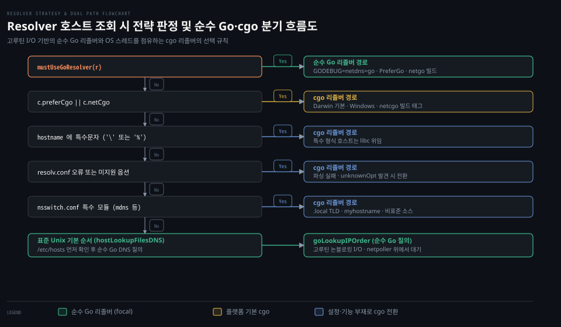

# Resolver

---

> 도메인 이름을 IP 주소로 변환하는 이름 해석은 네트워크 연결의 첫 관문이며, net 패키지는 순수 Go 구현체와 운영체제 cgo 라이브러리 사이의 전환 메커니즘을 Resolver 구조체로 제공합니다.


## 핵심 요약

> Resolver 는 호스트 이름과 네트워크 서비스 조회를 수행하는 이름 해석기입니다. 유닉스 환경에서 표준 라이브러리는 고루틴 자원만 사용하는 순수 Go 리졸버를 기본으로 선호하지만, 플랫폼 제약이나 시스템 설정(/etc/nsswitch.conf, mDNS 등)에 따라 C 라이브러리(cgo) 리졸버로 전환합니다.

`net.Dial` 과 `net.LookupHost` 같은 고수준 네트워크 함수 뒤에는 도메인 이름 해석을 전담하는 `net.Resolver` 가 동작하고 있습니다. 개발자가 별도의 리졸버를 지정하지 않으면 패키지 수준 싱글톤인 `net.DefaultResolver` 가 사용됩니다.

이름 해석 전략은 런타임 환경 변수(`GODEBUG=netdns=go` 또는 `cgo`), 빌드 태그(`netgo`, `netcgo`), 그리고 구조체의 `PreferGo` 필드로 직접 조정할 수 있습니다.


## 학습 목표

> 이 편을 읽고 나면 아래 다섯 가지를 스스로 해낼 수 있습니다.

1. 공식 문서의 "Name Resolution" 절이 규정하는 순수 Go 리졸버와 cgo 리졸버의 차이 및 플랫폼별 기본 정책을 설명할 수 있습니다.
2. `Resolver` 구조체의 핵심 필드(`PreferGo`, `StrictErrors`, `Dial`)와 `DefaultResolver` 의 동작 방식을 구별할 수 있습니다.
3. `src/net/conf.go` 의 `hostLookupOrder` 함수가 `/etc/resolv.conf` 와 `/etc/nsswitch.conf` 설정을 분석하여 해석 순서를 판정하는 흐름을 추적할 수 있습니다.
4. 순수 Go 리졸버가 `/etc/resolv.conf` 변경을 주기적으로 감지하고 TC(Truncated) 플래그 발생 시 TCP 로 재시도하는 내부 메커니즘을 설명할 수 있습니다.
5. `net.Dialer` 가 연결 시도 직전에 `Resolver` 를 호출하여 IP 주소 목록을 확보하는 연결 지점을 설명할 수 있습니다.


## 1. 운영체제 환경과 설정에 따라 이름 해석 경로가 결정됩니다

> 블로킹 C 라이브러리 호출과 논블로킹 고루틴 I/O 간의 자원 효율성 차이가 존재하므로, net 패키지는 이중 리졸버 엔진을 갖추고 있습니다.

도메인 이름을 IP 주소로 해석하는 과정은 단순해 보이지만 운영체제마다 차이가 큽니다. C 표준 라이브러리의 `getaddrinfo` 는 호출 스레드를 차단하므로 동시성 확장에 불리합니다. 반면 순수 Go 구현체는 소켓 I/O 를 넷폴러에 맡겨 고루틴만 파킹하므로 스레드 자원을 아낄 수 있습니다.

### 공식 계약: Name Resolution 절과 두 가지 리졸버

Go 공식 문서는 패키지 서두의 "Name Resolution" 절에서 유닉스 시스템의 두 가지 이름 해석 경로를 설명합니다.[^godoc-name-resolution]

> "On Unix systems, the resolver has two options for resolving names. It can use a pure Go resolver that sends DNS requests directly to the servers listed in /etc/resolv.conf, or it can use a cgo-based resolver that calls C library routines such as getaddrinfo and getnameinfo."[^godoc-name-resolution]

문서는 두 엔진 중 순수 Go 리졸버를 우선하는 이유를 다음과 같이 밝힙니다.[^godoc-name-resolution]

> "On Unix the pure Go resolver is preferred over the cgo resolver, because a blocked DNS request consumes only a goroutine, while a blocked C call consumes an operating system thread."[^godoc-name-resolution]

하지만 cgo 가 사용 가능한 환경에서도 다음과 같은 조건이 감지되면 cgo 기반 리졸버로 전환됩니다.[^godoc-name-resolution]

1. 프로그램의 직접 DNS 요청을 허용하지 않는 운영체제(macOS / OS X)인 경우
2. `LOCALDOMAIN` 환경 변수가 존재하는 경우(빈 값이어도 포함)
3. `RES_OPTIONS` 또는 `HOSTALIASES` 환경 변수가 비어 있지 않은 경우
4. OpenBSD 환경에서 `ASR_CONFIG` 환경 변수가 설정된 경우
5. `/etc/resolv.conf` 또는 `/etc/nsswitch.conf` 에 순수 Go 리졸버가 구현하지 않은 기능이 지정된 경우

또한 cgo 리졸버가 활성화될 때는 운영체제 스레드 고갈을 방지하기 위해 동시 cgo 조회 수가 최대 500개로 엄격히 제한됩니다.[^godoc-name-resolution]

### 공식 계약: GODEBUG 제어와 빌드 태그

개발자는 런타임 환경 변수나 빌드 태그를 통해 리졸버 선택 정책을 강제할 수 있습니다.[^godoc-name-resolution]

```bash
export GODEBUG=netdns=go     # 순수 Go 리졸버 강제
export GODEBUG=netdns=cgo    # 운영체제 네이티브(cgo) 리졸버 강제
export GODEBUG=netdns=1      # 리졸버 판정 디버그 로그 출력
export GODEBUG=netdns=go+1   # 순수 Go 리졸버 강제 및 디버그 출력
```

빌드 시점에는 `netgo` 태그를 주어 cgo 리졸버 코드를 바이너리에서 완전히 제외하거나, `netcgo` 태그를 주어 기본 선호 경로를 cgo 로 설정할 수 있습니다.

### 공식 계약: Resolver 구조체와 조회 메서드

`net.Resolver` 구조체는 이름 해석기의 세부 옵션을 캡슐화합니다.[^godoc-resolver]

```go
type Resolver struct {
	PreferGo bool
	StrictErrors bool
	Dial func(ctx context.Context, network, address string) (Conn, error)
}
```

`PreferGo` 필드를 true 로 지정하면 시스템 전역 `GODEBUG` 설정과 무관하게 해당 인스턴스에 한해 순수 Go DNS 리졸버를 사용하도록 지시합니다. `StrictErrors` 는 다중 질의(A 레코드 및 AAAA 레코드 동시 조회) 도중 일시적 오류가 발생했을 때 부분 결과를 버리고 전체 조회를 실패 처리할지 결정합니다.

`Dial` 필드는 DNS 서버와 통신할 때 사용할 커스텀 다이얼러 함수를 지정합니다. 이 훅을 활용하면 단위 테스트에서 인메모리 DNS 소켓을 주입하거나 특정 프록시를 경유하도록 구성할 수 있습니다.

패키지는 기본 인스턴스로 `DefaultResolver` 를 제공합니다.[^godoc-default-resolver]

```go
var DefaultResolver = &Resolver{}
```

`Resolver` 는 목적에 따라 다양한 조회 메서드를 제공합니다.[^godoc-resolver]

```go
func (r *Resolver) LookupHost(ctx context.Context, host string) (addrs []string, err error)
func (r *Resolver) LookupIP(ctx context.Context, network, host string) ([]IP, error)
func (r *Resolver) LookupNetIP(ctx context.Context, network, host string) ([]netip.Addr, error)
func (r *Resolver) LookupCNAME(ctx context.Context, host string) (string, error)
func (r *Resolver) LookupSRV(ctx context.Context, service, proto, name string) (string, []*SRV, error)
func (r *Resolver) LookupTXT(ctx context.Context, name string) ([]string, error)
```

이름 해석이 실패하면 상세 원인을 담은 `*net.DNSError` 가 반환됩니다([03-03.Error·OpError·DNSError](03-03.Error%C2%B7OpError%C2%B7DNSError.md) 참고).


## 2. conf 모듈은 설정 파일을 읽어 5가지 해석 전략 중 하나를 선택합니다

> 호스트 이름 조회가 들어오면 내부 시스템 설정 검사기가 플랫폼과 환경 변수, 설정 파일을 종합하여 분기를 결정합니다.

호스트 이름 조회가 들어오면 내부 `conf` 모듈은 호스트 문자열과 운영체제, 설정 파일을 분석하여 최적의 경로를 결정합니다. 아래 도식은 이름 해석 요청 시 순수 Go 와 cgo 분기 판정 흐름을 보여줍니다.



### 내부 동작: conf.go 의 lookupOrder 판정 로직

`src/net/lookup_unix.go` 의 `lookupIP` 는 먼저 시스템 설정 싱글톤에서 조회 전략(`order`)을 획득합니다.[^src-net-lookup-unix]

```go
// src/net/lookup_unix.go (go1.25.1)
func (r *Resolver) lookupIP(ctx context.Context, network, host string) (addrs []IPAddr, err error) {
	order, conf := systemConf().hostLookupOrder(r, host)
	if order == hostLookupCgo {
		return cgoLookupIP(ctx, network, host)
	}
	ips, _, err := r.goLookupIPCNAMEOrder(ctx, network, host, order, conf)
	return ips, err
}
```

`hostLookupOrder` 는 `src/net/dnsclient_unix.go` 에 정의된 열거형으로 다음 5가지 전략 중 하나를 나타냅니다.[^src-net-dnsclient-unix]

1. `hostLookupCgo`: C 라이브러리의 `getaddrinfo` 에 해석을 전적으로 위임합니다.
2. `hostLookupFilesDNS`: `/etc/hosts` 정적 파일을 먼저 확인하고 매칭이 없으면 순수 Go DNS 질의를 보냅니다.
3. `hostLookupDNSFiles`: DNS 질의를 먼저 수행하고 실패 시 정적 파일을 참조합니다.
4. `hostLookupFiles`: 정적 파일만 확인합니다.
5. `hostLookupDNS`: DNS 서버에만 질의합니다.

`src/net/conf.go` 의 `lookupOrder` 함수는 다음 순서로 전략을 판정합니다.[^src-net-conf]

첫째, `c.mustUseGoResolver(r)` 가 참인지 확인합니다. `netgo` 빌드 태그나 `r.PreferGo`, `GODEBUG=netdns=go` 가 지정되면 cgo 사용 플래그를 끕니다. 이후 기본 순서로 `hostLookupFilesDNS` 를 선택합니다.

둘째, 위 조건에 해당하지 않고 `c.preferCgo` 가 참(Darwin, iOS, Windows)이거나 `netcgo` 빌드 태그가 지정되어 있으면 즉시 `hostLookupCgo` 를 반환합니다.

셋째, 호스트 이름에 `\` 나 `%` 같은 특수 형식이 포함되어 있으면 표준 라이브러리 파서 대신 `hostLookupCgo` 로 넘깁니다.

넷째, `/etc/resolv.conf` 를 파싱하여 알 수 없는 옵션(`dnsConf.unknownOpt`)이 발견되거나 파일 읽기에 실패하면 cgo 로 전환합니다.

다섯째, `/etc/nsswitch.conf` 를 확인합니다. `hosts` 소스에 `mdns` 나 `myhostname` 같은 모듈이 들어 있고 도메인이 `.local` 로 끝나면 mDNS 처리를 위해 cgo 로 넘깁니다.

이 모든 특수 조건에 걸리지 않은 표준 리눅스 환경에서는 `hostLookupFilesDNS` 가 채택되어 순수 Go 리졸버로 진입합니다.

### 내부 동작: Dialer 가 Resolver 를 호출하는 지점

`net.Dialer` 가 원격 호스트로 소켓을 연결할 때도 이 `Resolver` 가 사용됩니다.[^src-net-dial]

```go
// src/net/dial.go (go1.25.1)
func (d *Dialer) resolver() *Resolver {
	if d.Resolver != nil {
		return d.Resolver
	}
	return DefaultResolver
}
```

`DialContext` 는 연결 시도 직전에 `d.resolver().resolveAddrList` 를 호출합니다([02-01.Dial·Dialer](02-01.Dial%C2%B7Dialer.md) 참고). 리졸버가 반환한 IP 주소 슬라이스를 바탕으로 순차 시도와 Happy Eyeballs 경합을 진행합니다.


## 3. 순수 Go 리졸버는 resolv.conf 를 감시하고 패킷 교환을 직접 수행합니다

> C 라이브러리에 기대지 않는 순수 Go 리졸버는 소켓을 직접 열어 DNS 요청을 바이트 단위로 패킹하고 수신 패킷을 파싱합니다.

순수 Go 리졸버 경로는 외부 공유 라이브러리에 의존하지 않으므로 완전히 격리된 고루틴 환경에서 동작합니다.

### 내부 동작: resolv.conf 동적 감시와 exchange 질의

`src/net/dnsclient_unix.go` 의 `getSystemDNSConfig()` 는 시스템 DNS 설정을 주기적으로 갱신합니다.[^src-net-dnsclient-unix]

```go
// src/net/dnsclient_unix.go (go1.25.1)
func getSystemDNSConfig() *dnsConfig {
	resolvConf.tryUpdate("/etc/resolv.conf")
	return resolvConf.dnsConfig.Load()
}
```

`tryUpdate` 메서드는 매 질의마다 시스템 콜을 남발하지 않도록 5초 유휴 간격(`lastChecked`)을 둡니다. 5초가 지난 뒤 `/etc/resolv.conf` 의 수정 시각(`ModTime`)이 바뀌었을 때만 파일을 다시 파싱하여 `atomic.Pointer` 를 교체합니다.

실제 DNS 패킷 전송은 `exchange` 메서드가 담당합니다.[^src-net-dnsclient-unix]

```go
// src/net/dnsclient_unix.go (go1.25.1)
func (r *Resolver) exchange(ctx context.Context, server string, q dnsmessage.Question, timeout time.Duration, useTCP, ad bool) (dnsmessage.Parser, dnsmessage.Header, error) {
    ...
    if useTCP {
        networks = []string{"tcp"}
    } else {
        networks = []string{"udp", "tcp"}
    }
    for _, network := range networks {
        c, err := r.dial(ctx, network, server)
        ...
        p, h, err = dnsPacketRoundTrip(c, id, q, udpReq)
        ...
        if h.Truncated && network == "udp" {
            continue
        }
        return p, h, nil
    }
    ...
}
```

`exchange` 는 기본적으로 UDP 전송을 먼저 시도합니다. 만약 DNS 응답 헤더의 `Truncated`(TC) 비트가 1 로 설정되어 패킷이 잘렸음을 알리면, 함수는 에러를 반환하지 않고 루프의 다음 회차인 TCP 로 즉시 재시도하여 완전한 응답을 받아옵니다.

### 함정과 관찰: 플랫폼 기본 차이와 gonet-lab 직접 구현 관측

운영체제에 따라 기본 리졸버 동작은 확연히 다릅니다. macOS 에서는 시스템의 mDNSResponder 데몬이 단일 창구 역할을 하므로 표준 Go 바이너리는 기본적으로 cgo 경로(`getaddrinfo`)를 탑재하여 실행됩니다. 반면 정적 링크(`CGO_ENABLED=0`)된 Linux 컨테이너 환경에서는 cgo 가 없으므로 항상 순수 Go 리졸버만 동작합니다.

실습 프로젝트 [gonet-lab 03-01](../../../../02_os/project/gonet-lab/03-01.DNS%20질의%20한%20장을%20바이트로%20-%20헤더·라벨·압축%20포인터·TC.md)과 [gonet-lab 03-02](../../../../02_os/project/gonet-lab/03-02.DNS%20실습%20기록%20-%20dig%20대조·바이트%20순서·포인터·TC·재시도.md)에서는 표준 라이브러리의 추상화를 걷어내고 DNS 클라이언트를 직접 구현하여 네트워크 패킷을 실측했습니다.

실측 과정에서 29바이트의 질의 헤더와 질문 섹션을 직접 인코딩하여 `1.1.1.1:53` 에 전송했습니다. 응답 크기가 512바이트를 초과하여 TC 플래그가 설정된 응답을 수신했을 때, 클라이언트가 소켓을 TCP 로 다시 열어 재조회하는 과정을 바이트 단위로 관측했습니다.

Go 표준 라이브러리의 `exchange` 메서드 역시 이와 동일한 RFC 5966 규칙을 따르고 있음을 표준 라이브러리 소스 분석을 통해 명확히 확인할 수 있습니다.


## 관련 문서

> 이 섹션과 함께 읽으면 좋은 참고 자료입니다.

- [01_language/docs/go/net MOC](README.md) — net 패키지 공식문서 정독 목록
- [02-01.Dial·Dialer](02-01.Dial%C2%B7Dialer.md) — 다이얼러의 IP 해석 위임과 Happy Eyeballs 경합
- [03-03.Error·OpError·DNSError](03-03.Error%C2%B7OpError%C2%B7DNSError.md) — DNSError 판별과 타임아웃 처리
- [04-02.UDPConn·ListenPacket](04-02.UDPConn%C2%B7ListenPacket.md) — UDP 패킷 통신과 데이터그램 소켓
- [gonet-lab 03-01](../../../../02_os/project/gonet-lab/03-01.DNS%20질의%20한%20장을%20바이트로%20-%20헤더·라벨·압축%20포인터·TC.md) — DNS 질의·응답 패킷 바이트 구조와 TC 플래그 실측
- [gonet-lab 03-02](../../../../02_os/project/gonet-lab/03-02.DNS%20실습%20기록%20-%20dig%20대조·바이트%20순서·포인터·TC·재시도.md) — DNS 실습 기록과 UDP/TCP 재시도 관측

[^godoc-name-resolution]: Go 공식 문서 [Name Resolution](https://pkg.go.dev/net#hdr-Name_Resolution)
[^godoc-resolver]: Go 공식 문서 [type Resolver](https://pkg.go.dev/net#Resolver)
[^godoc-default-resolver]: Go 공식 문서 [var DefaultResolver](https://pkg.go.dev/net#DefaultResolver)
[^src-net-lookup-unix]: Go 1.25.1 소스 [src/net/lookup_unix.go#L61](https://github.com/golang/go/blob/go1.25.1/src/net/lookup_unix.go#L61)
[^src-net-dnsclient-unix]: Go 1.25.1 소스 [src/net/dnsclient_unix.go#L169](https://github.com/golang/go/blob/go1.25.1/src/net/dnsclient_unix.go#L169)
[^src-net-conf]: Go 1.25.1 소스 [src/net/conf.go#L232](https://github.com/golang/go/blob/go1.25.1/src/net/conf.go#L232)
[^src-net-dial]: Go 1.25.1 소스 [src/net/dial.go#L260](https://github.com/golang/go/blob/go1.25.1/src/net/dial.go#L260)
