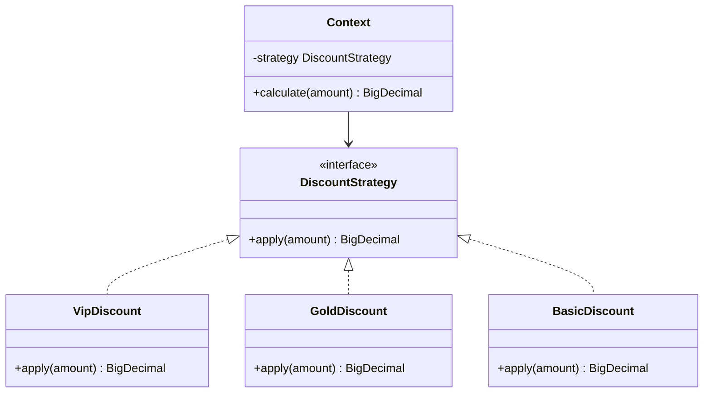
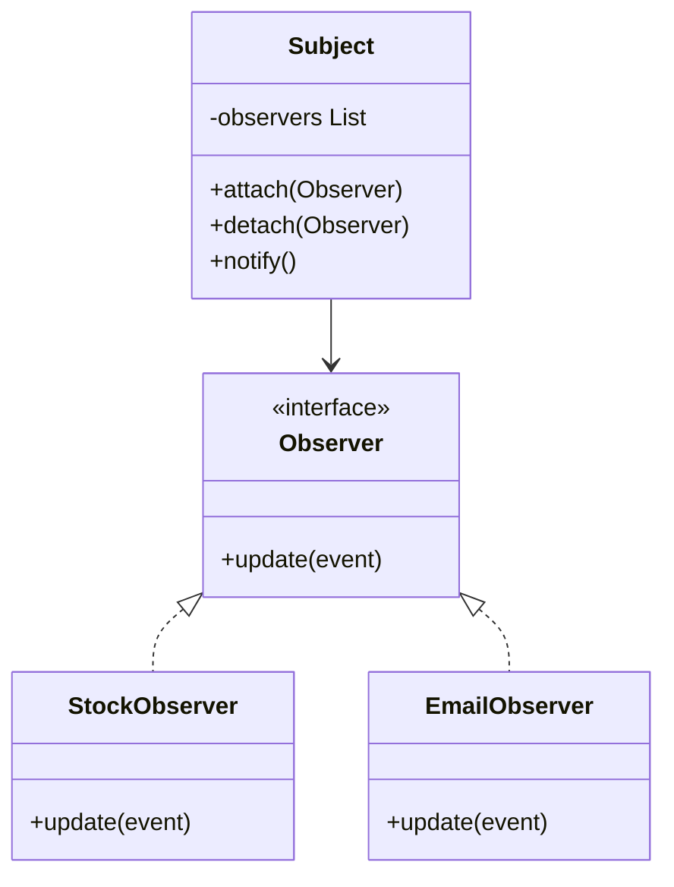
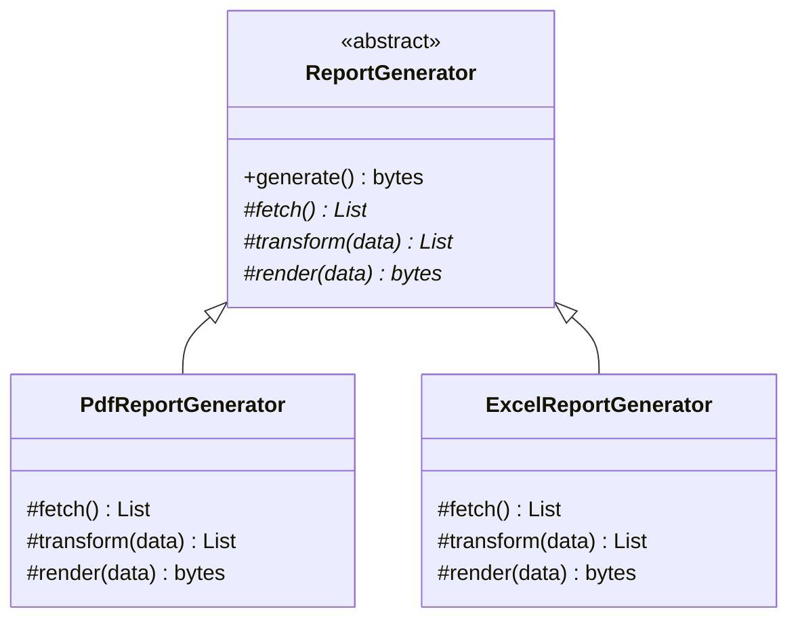
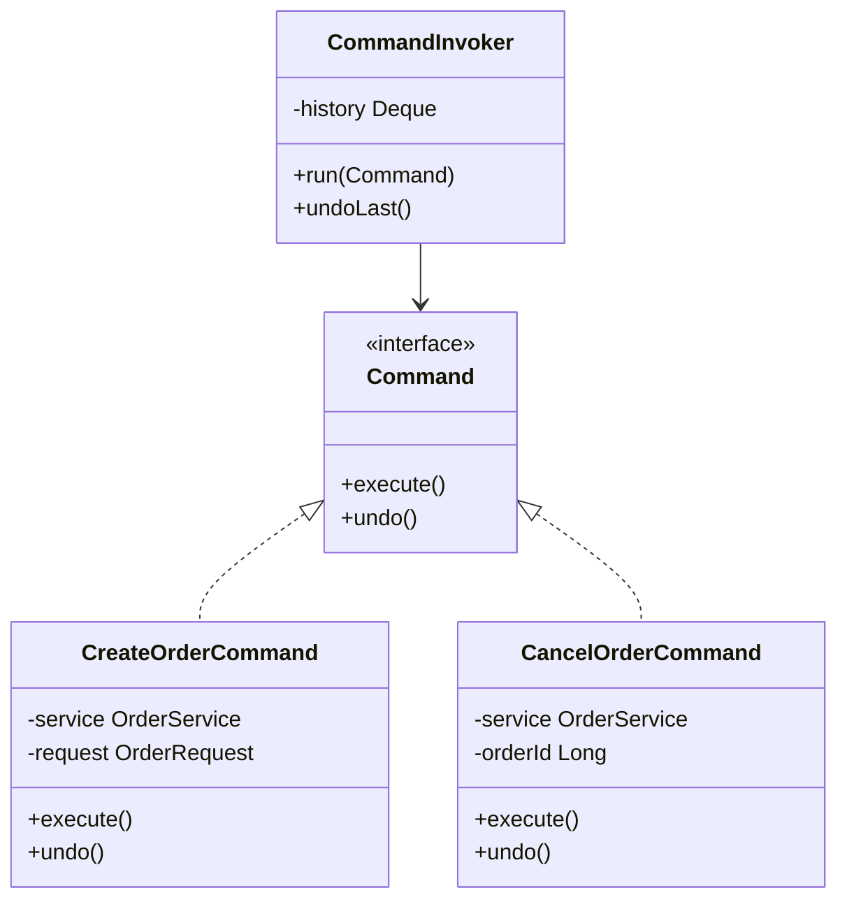
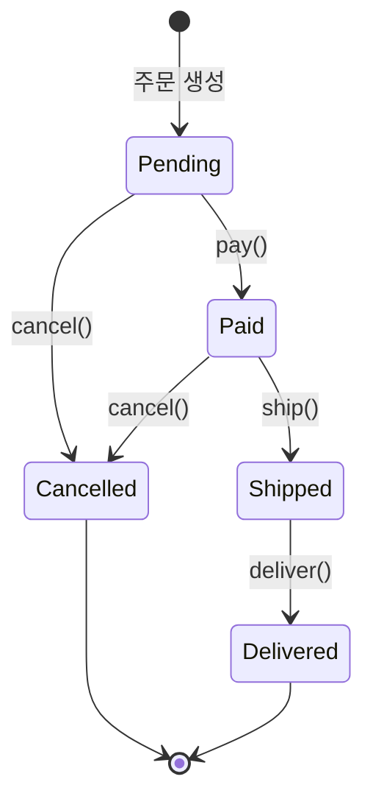
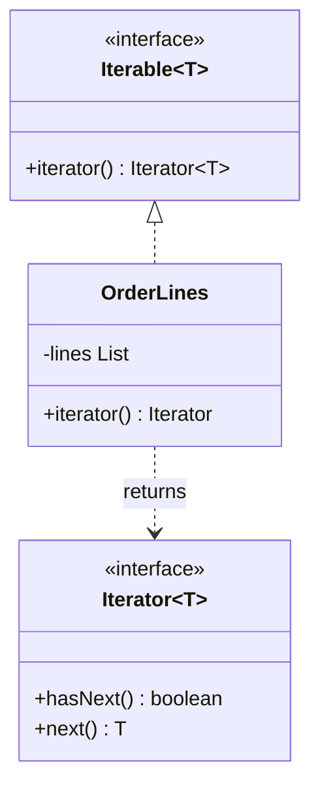
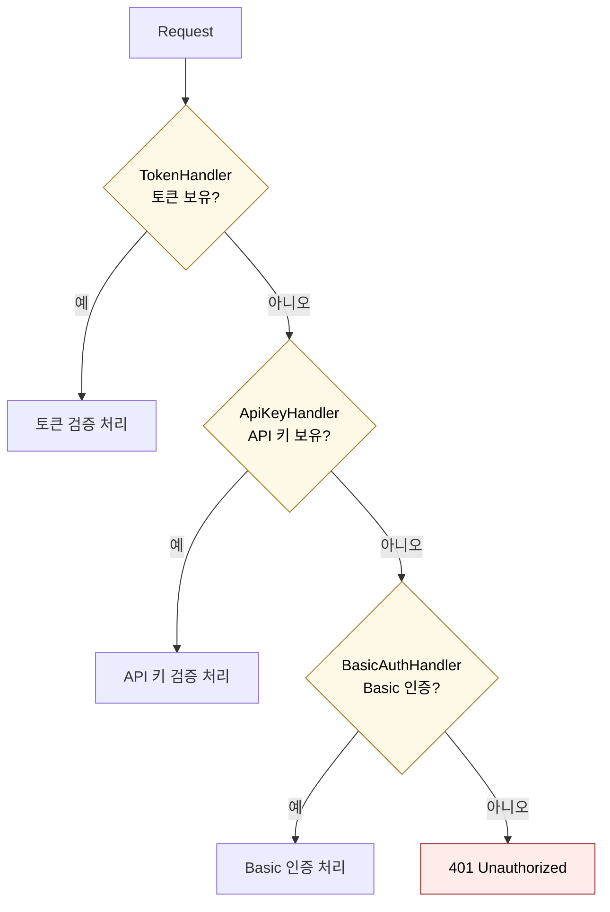

# 행동 패턴

---

> 객체 사이를 흐르는 책임과 통신을 어떻게 나누느냐는 곧 코드의 변경 비용을 결정한다. 행동 패턴은 객체들이 협력하는 방식 자체를 1급 구조로 끌어올린다.


## Strategy — 전략

*의도*: 알고리즘군을 정의하고 각각을 캡슐화해, 런타임에 교체 가능하게 만든다.

if-else로 분기되던 정책을 객체로 끌어올리면 OCP가 자연스럽게 충족된다. 등급별 할인, 결제 수단별 처리, 정렬 기준 교체처럼 "동일한 입력에서 절차만 달라지는" 자리가 전략 패턴의 자리다. Java 8 이후로는 람다로 구현해도 패턴 의도가 거의 그대로 보존된다.

**구조**



**Before — if-else 지옥**

```java
public BigDecimal calculate(Order order, String grade) {
    if ("VIP".equals(grade))    return order.amount().multiply(new BigDecimal("0.2"));
    if ("GOLD".equals(grade))   return order.amount().multiply(new BigDecimal("0.1"));
    if ("BASIC".equals(grade))  return BigDecimal.ZERO;
    throw new IllegalArgumentException("unknown grade: " + grade);
}
```

새 등급이 추가될 때마다 메서드를 수정해야 한다. 등급을 `String`으로 받기 때문에 오타가 컴파일러를 통과한다.

**After — Java 21 구현**

```java
public interface DiscountStrategy {
    BigDecimal apply(BigDecimal amount);
}

public class VipDiscount implements DiscountStrategy {
    @Override
    public BigDecimal apply(BigDecimal amount) {
        return amount.multiply(new BigDecimal("0.2"));
    }
}

public class DiscountContext {
    private DiscountStrategy strategy;

    public DiscountContext(DiscountStrategy strategy) {
        this.strategy = strategy;
    }

    public BigDecimal calculate(BigDecimal amount) {
        return strategy.apply(amount);
    }
}

// 사용 (람다로도 동일하게 표현 가능)
DiscountContext context = new DiscountContext(amount -> amount.multiply(new BigDecimal("0.2")));
BigDecimal price = context.calculate(new BigDecimal("100000"));
```

*사용 시점*: 같은 시그니처의 알고리즘을 런타임에 교체해야 할 때. 알고리즘 종류가 1~2개로 고정되어 있고 늘어날 일이 없다면 패턴 도입은 과잉이다.

> **실무 적용 예시 — Strategy를 *일부러 도입하지 않은* TPS executor**
>
> `DispatchService.submitBatch`는 `SubmitResult.status()`가 4가지 값(SUBMITTED / CONNECTION_FAILED / JOB_NOT_FOUND / SCRIPT_INVALID / CONFIG_UPDATE_FAILED / TRIGGER_FAILED) 중 하나로 분기된다. 분기 신호가 "셋 이상"이라는 Strategy 도입 조건을 충족하는 것처럼 보인다.
>
> ```java
> for (ExecutionJob job : eligible) {
>     SubmitResult result = submitDomainComponent.submit(job);
>     switch (result.status()) {
>         case SUBMITTED -> {
>             log.info("[SubmitBatch] SUBMITTING → SUBMITTED: ...");
>             submitted++;
>         }
>         case CONNECTION_FAILED, JOB_NOT_FOUND, SCRIPT_INVALID ->
>             log.warn("[SubmitBatch] Permanent failure: ...");
>         case CONFIG_UPDATE_FAILED, TRIGGER_FAILED ->
>             log.warn("[SubmitBatch] Transient failure: ...");
>     }
> }
> ```
>
> 그러나 *분기 본문이 로그 레벨 차이뿐*이라 Strategy로 끌어올리는 비용 대비 가치가 낮다. 각 case가 별도 클래스가 되면 *클래스 6개를 추가*해서 *log.info/log.warn만 다르게* 부르는 결과가 된다. 현재 switch 형태가 더 정직한 표현이다. 만약 각 분기마다 *복구 액션*(예: CONNECTION_FAILED는 재시도, SCRIPT_INVALID는 알림)이 도입되면 그때 `SubmitFailureHandler` 전략 인터페이스로 승격할 수 있다. 이것이 본 학습 문서 §과한 패턴 적용 경계의 실제 적용 사례다.

## Observer — 옵저버

*의도*: 한 객체의 상태가 변할 때, 그에 의존하는 객체들에 자동으로 통지가 전파되도록 한다.

이벤트 구독 모델의 원형이다. Subject가 상태 변화 시점에 등록된 Observer들에 `update()`를 호출해 알린다. 푸시 알림, UI 데이터 바인딩, 도메인 이벤트 발행 모두 이 구조 위에 서 있다.

**구조**



**Java 21 구현**

```java
public interface OrderObserver {
    void onOrderPlaced(Order order);
}

public class OrderPublisher {
    private final List<OrderObserver> observers = new CopyOnWriteArrayList<>();

    public void subscribe(OrderObserver observer)   { observers.add(observer); }
    public void unsubscribe(OrderObserver observer) { observers.remove(observer); }

    public void publish(Order order) {
        for (OrderObserver o : observers) {
            o.onOrderPlaced(order);
        }
    }
}

// 구독자들
public class InventoryObserver implements OrderObserver {
    @Override
    public void onOrderPlaced(Order order) { /* 재고 차감 */ }
}

public class EmailObserver implements OrderObserver {
    @Override
    public void onOrderPlaced(Order order) { /* 발송 큐에 적재 */ }
}

// 연결
OrderPublisher publisher = new OrderPublisher();
publisher.subscribe(new InventoryObserver());
publisher.subscribe(new EmailObserver());
publisher.publish(order); // 두 옵저버에 동시 통지
```

`CopyOnWriteArrayList`를 쓴 이유는 `notify` 중에 구독자가 추가/해지될 가능성에 대비한 단순한 동시성 가드다. 부하가 큰 환경에서는 별도 메시지 브로커(Kafka, ApplicationEventPublisher 등)로 옮긴다.

*사용 시점*: 발행자가 구독자 종류를 알 필요가 없을 때. 구독자가 영구적이고 적은 경우라면 패턴 도입 전에 단순한 콜백 함수 호출을 먼저 고려한다.

## Template Method — 템플릿 메서드

*의도*: 알고리즘의 골격을 상위 클래스가 정의하고, 변하는 일부 단계만 서브클래스가 구현하게 한다.

전체 흐름은 동일한데 중간에 한두 단계만 다른 경우가 후보다. 동일한 순서로 흐르는 처리 절차에 분기점만 살짝 다른 자리가 보이면 템플릿 메서드를 떠올린다. Spring의 `JdbcTemplate`이 이 패턴의 교과서적 예다.

**구조**



**Java 21 구현**

```java
public abstract class ReportGenerator {

    // 최종 알고리즘 흐름 (변경 불가)
    public final byte[] generate() {
        var data = fetch();
        var transformed = transform(data);
        return render(transformed);
    }

    protected abstract List<Row> fetch();
    protected abstract List<Row> transform(List<Row> data);
    protected abstract byte[] render(List<Row> data);
}

public class PdfReportGenerator extends ReportGenerator {
    @Override protected List<Row> fetch()                    { /* DB 조회 */ }
    @Override protected List<Row> transform(List<Row> data)  { /* 마스킹 */ }
    @Override protected byte[] render(List<Row> data)        { /* PDF 변환 */ }
}
```

`generate()`를 `final`로 두는 이유는 흐름이 서브클래스 임의로 바뀌지 못하도록 잠그기 위해서다. *Hollywood Principle*("Don't call us, we'll call you")이 여기서 나온다. 서브클래스가 골격을 호출하지 않고, 골격이 서브클래스의 훅을 호출한다.

*사용 시점*: 알고리즘 골격이 거의 같고 단계 일부만 다른 변형이 둘 이상일 때. 단 한 가지 구현만 존재한다면 상속이 아닌 직접 작성이 더 단순하다.

> **실무 적용 예시 — TPS executor의 Recovery 스케줄러 3종**
>
> `ExecutionRecoverScheduler`는 SUBMITTING/SUBMITTED/RUNNING 세 상태에 대해 *동일한 골격*의 복구 로직을 가지지만, 현재 *추출되지 않고 복사돼 있다*. 골격이 어떻게 같은지 보면 다음과 같다.
>
> ```java
> private void recoverSubmittedAll() {
>     LocalDateTime cutoff = LocalDateTime.now(clock).minus(...);    // 1) cutoff
>     List<ExecutionJob> jobs = queryPort.findAgedByStatus(SUBMITTED, cutoff);  // 2) query
>     if (jobs.isEmpty()) return;
>
>     int recovered = 0, canceled = 0, timedOut = 0, skipped = 0;
>     for (ExecutionJob job : jobs) {                                // 3) per-job 처리
>         try {
>             RecoveryResult result = recoveryUseCase.recoverSubmitted(job);
>             switch (result.status()) { ... }                       // 4) 결과 누적
>         } catch (Exception e) {
>             log.warn("[Recover] failed: {}", e.getMessage());      // 5) catch-warn-continue
>             skipped++;
>         }
>     }
>     log.info("[Recover] sync: candidates={}, recovered={}, ...", ...); // 6) 통계 로그
> }
> ```
>
> `recoverRunningAged()`와 `expireTimedOutSubmitting()` 모두 *같은 1~6 골격*에 호출 메서드(`recoverSubmitted` vs `recoverRunning`)와 카운터 종류(RECOVERED_RUNNING/CANCELED/TIMED_OUT vs COMPLETED/NOT_FOUND/...)만 다르다. 진화 후보는 다음과 같은 `AgedRecoveryTemplate`다.
>
> ```java
> public abstract class AgedRecoveryTemplate<S extends Enum<S>, R> {
>     public final void run(S targetStatus, Duration threshold) {
>         LocalDateTime cutoff = LocalDateTime.now(clock()).minus(threshold);
>         List<ExecutionJob> jobs = queryPort().findAgedByStatus(targetStatus, cutoff);
>         if (jobs.isEmpty()) return;
>         Map<R, Integer> counters = new EnumMap<>(resultType());
>         for (ExecutionJob job : jobs) {
>             try { counters.merge(process(job).status(), 1, Integer::sum); }
>             catch (Exception e) { onError(job, e); }
>         }
>         log(targetStatus, jobs.size(), counters);
>     }
>     protected abstract R process(ExecutionJob job);
>     // ...
> }
> ```
>
> 다만 *현재* 스케줄러 3개 각각이 80~150줄로 *읽힌다는 점*에서, 골격 추출의 ROI는 메서드가 4개로 늘 때 명확해진다. 본 학습 문서 §과한 패턴 적용 경계의 원칙이 그대로 적용된 자리다.

## Command — 커맨드

*의도*: 요청 자체를 객체로 캡슐화해, 매개변수화·큐잉·실행 취소를 가능하게 한다.

호출자와 실행자 사이에 "요청 객체"를 끼워 넣으면 다음 세 가지가 가능해진다. 요청을 큐에 쌓아 비동기로 처리할 수 있고, 실행 이력을 남겨 undo를 구현할 수 있으며, 매크로처럼 요청들을 묶어 한 번에 실행할 수 있다.

**구조**



**Java 21 구현**

```java
public interface Command {
    void execute();
    void undo();
}

public class CreateOrderCommand implements Command {
    private final OrderService service;
    private final OrderRequest request;
    private Long createdId;

    public CreateOrderCommand(OrderService service, OrderRequest request) {
        this.service = service;
        this.request = request;
    }

    @Override
    public void execute() {
        this.createdId = service.create(request);
    }

    @Override
    public void undo() {
        if (createdId != null) service.cancel(createdId);
    }
}

public class CommandInvoker {
    private final Deque<Command> history = new ArrayDeque<>();

    public void run(Command command) {
        command.execute();
        history.push(command);
    }

    public void undoLast() {
        if (!history.isEmpty()) history.pop().undo();
    }
}
```

Java의 `Runnable`, `Callable`이 가장 흔히 만나는 Command 변형이다. `ExecutorService.submit(Runnable)`은 사실상 커맨드를 큐에 적재하는 호출이다.

*사용 시점*: 실행 시점과 호출 시점을 분리해야 하거나, 작업 이력·재시도·undo가 필요할 때.

> **실무 적용 예시 — TPS UseCase의 Command 객체**
>
> DDD Hexagonal 구조에서 UseCase 인터페이스의 인자가 자연스럽게 Command 객체가 된다. TPS executor의 `DispatchUseCase.receive(ReceiveJobCommand)`가 그 예다.
>
> ```java
> public record ReceiveJobCommand(
>         String jobExcnId, String jobId, String jobPath
>         , String tlId, int jobVsrn, String kind, LocalDateTime priorityDt
> ) {}
>
> public interface DispatchUseCase {
>     void receive(ReceiveJobCommand command);
>     int dispatchBatch(List<ExecutionJob> candidates);
>     // ...
> }
> ```
>
> "왜 record DTO 이름이 `ReceiveJobCommand`인가"의 답이 본 절에 있다. *요청을 객체로 캡슐화*하면 호출자는 인자 7개를 한 덩어리로 다룰 수 있고, 큐잉(메시지 브로커 적재)·undo(보상 트랜잭션)가 필요해질 때 같은 구조 위에서 확장 가능하다. 현재 TPS는 *순수 명령 캡슐화* 단계에 멈춰 있다. `Deque<Command> history`나 `execute()/undo()` 인터페이스는 도입하지 않았다. 결재 도메인이 보상 트랜잭션이 필요해지는 시점이 오면 그때 진화시킬 수 있는 출발선이 이미 깔려 있는 셈이다.

## State — 상태

*의도*: 객체가 내부 상태에 따라 행동을 바꾸도록, 상태를 별도 객체로 분리한다.

전략 패턴과 구조는 똑같이 보이지만 의도가 다르다. 전략은 외부에서 알고리즘을 주입받는 반면, 상태는 객체 스스로 다음 상태를 결정하고 자기 자신을 전이시킨다. 주문 라이프사이클(PENDING → PAID → SHIPPED → DELIVERED), 결제 상태 머신 등이 전형적이다.

**상태 전이 다이어그램**



각 상태는 자기가 받아들이는 전이만 허용한다. `Pending`은 `ship()`을 받으면 예외를 던지고, `Paid`는 다시 `pay()`를 받으면 예외를 던진다. 허용 전이를 *상태 객체 안에* 두면 if-else 체인이 사라진다.

**Java 21 구현**

```java
public interface OrderState {
    OrderState pay(Order order);
    OrderState ship(Order order);
    OrderState cancel(Order order);
}

public class Pending implements OrderState {
    @Override public OrderState pay(Order order)    { return new Paid(); }
    @Override public OrderState ship(Order order)   { throw new IllegalStateException("아직 결제 전"); }
    @Override public OrderState cancel(Order order) { return new Cancelled(); }
}

public class Paid implements OrderState {
    @Override public OrderState pay(Order order)    { throw new IllegalStateException("이미 결제됨"); }
    @Override public OrderState ship(Order order)   { return new Shipped(); }
    @Override public OrderState cancel(Order order) { return new Cancelled(); }
}

public class Order {
    private OrderState state = new Pending();

    public void pay()    { this.state = state.pay(this); }
    public void ship()   { this.state = state.ship(this); }
    public void cancel() { this.state = state.cancel(this); }
}
```

상태별 클래스가 늘어나는 비용은 명확하다. 단 상태가 셋 이하이고 전이 규칙이 단순하다면 enum + switch가 더 읽힌다.

*사용 시점*: 상태 수가 많고 전이 규칙이 복잡해, if-else로는 가독성을 잃기 시작했을 때.

> **실무 적용 예시 — TPS approval 도메인**
>
> 본 절은 *상태별 클래스 분리*를 정통 State 패턴으로 다뤘다. 그러나 실무에서는 분리 비용 vs 응집의 트레이드오프 때문에 *Aggregate 내부 switch*로 변형하는 사례도 흔하다. `ApprovalExecution.isValidTransition`이 그 예시다.
>
> ```java
> // ApprovalExecution.java (Aggregate Root)
> private static boolean isValidTransition(ApprovalProgressStatusType from, ApprovalProgressStatusType to) {
>     if (from == to) return true;
>     return switch (from) {
>         case WAIT -> to == EXCN || to == RVTL || to == FAIL;
>         case EXCN -> to == APRV || to == RJCT || to == RVTL || to == FAIL;
>         case APRV, RJCT, RVTL, FAIL -> false;   // terminal
>     };
> }
>
> public void changeStatus(ApprovalProgressStatusType nextStatus) {
>     if (!isValidTransition(this.prgrsSttsCd, nextStatus)) {
>         throw new TpsException(INVALID_EXECUTION_STATE_TRANSITION, ...);
>     }
>     this.prgrsSttsCd = nextStatus;
> }
> ```
>
> 상태가 5개(WAIT/EXCN/APRV/RJCT/RVTL/FAIL)로 *고정*돼 있고 더 늘어날 신호가 없어, 클래스 분리 비용을 *일부러 풀고* Aggregate 내부 switch로 응집을 유지한 결정이다. State 패턴의 핵심 가치인 "잘못된 전이가 컴파일/런타임에 차단된다"는 보장은 그대로 유지된다. 만약 상태별 *행위*가 크게 달라지면(예: PAID는 결제 검증, SHIPPED는 운송장 발급) 그때 클래스 분리로 진화할 수 있다.

## Iterator — 이터레이터

*의도*: 집합 객체의 내부 표현을 노출하지 않으면서, 원소를 순차적으로 탐색하는 방법을 제공한다.

Java에서는 이미 `Iterable`/`Iterator`로 언어 차원에서 흡수되어 있다. 직접 구현할 일은 드물지만, 외부에 컬렉션을 통째로 노출하지 않으면서 순회만 허용해야 할 때 패턴이 살아난다. "내부 표현 은닉"이라는 캡슐화 가치가 핵심이다.

**구조**



```java
public class OrderLines implements Iterable<OrderLine> {
    private final List<OrderLine> lines;

    public OrderLines(List<OrderLine> lines) {
        this.lines = List.copyOf(lines);
    }

    @Override
    public Iterator<OrderLine> iterator() {
        return lines.iterator(); // 불변 컬렉션이므로 안전하게 위임
    }
}

// 사용자는 List 자체를 받지 못한다. for-each만 가능
for (OrderLine line : orderLines) {
    // ...
}
```

*사용 시점*: 컬렉션을 외부에 직접 노출하면 캡슐화가 깨질 때. 일급 컬렉션과 짝을 이뤄 자주 쓰인다.

## Chain of Responsibility — 책임 연쇄

*의도*: 요청을 처리할 수 있는 객체들을 사슬로 연결해, 처리될 때까지 차례로 넘긴다.

`if-else if-else if` 의 객체 버전이다. 각 핸들러는 자기가 처리 가능한 요청만 응답하고, 아니면 다음 핸들러로 넘긴다. Spring Security의 `FilterChain`, Servlet의 `Filter`가 대표적이다.

**구조**



사슬 순서가 곧 처리 우선순위다. 토큰 우선, API 키 다음, Basic 인증 마지막.

**Java 21 구현**

```java
public abstract class AuthHandler {
    protected AuthHandler next;

    public AuthHandler chain(AuthHandler next) {
        this.next = next;
        return next;
    }

    public final boolean handle(Request request) {
        if (canHandle(request)) return process(request);
        if (next != null)       return next.handle(request);
        return false;
    }

    protected abstract boolean canHandle(Request request);
    protected abstract boolean process(Request request);
}

public class TokenHandler extends AuthHandler {
    @Override protected boolean canHandle(Request r) { return r.hasToken(); }
    @Override protected boolean process(Request r)   { /* 토큰 검증 */ return true; }
}

public class ApiKeyHandler extends AuthHandler {
    @Override protected boolean canHandle(Request r) { return r.hasApiKey(); }
    @Override protected boolean process(Request r)   { /* 키 검증 */ return true; }
}

// 사슬 구성
AuthHandler chain = new TokenHandler();
chain.chain(new ApiKeyHandler());
chain.handle(request);
```

사슬 순서가 처리 우선순위를 결정한다. 순서가 의미를 가진다는 점에서 단순 전략 리스트와 다르다.

*사용 시점*: 처리 가능한 핸들러가 여럿이고 우선순위가 있으며, 추가/제거가 빈번할 때.

> **실무 적용 예시 — TPS `submitBatch` 파이프라인은 CoR이 아니다**
>
> 처음 코드를 보면 CoR로 보일 수 있는 자리가 있다. `DispatchService.submitBatch`가 "상태 필터링 → priority 정렬 → per-job submit"의 *순차 단계*로 구성되기 때문이다. 그러나 이 구조는 CoR이 아니다.
>
> ```java
> public int submitBatch(List<ExecutionJob> candidates) {
>     // Step 1: 상태 게이트
>     List<ExecutionJob> eligible = new ArrayList<>();
>     for (ExecutionJob job : candidates) {
>         if (job.getStatus() == SUBMITTING) eligible.add(job);
>         else log.debug("[SubmitBatch] Not SUBMITTING, skip: ...");
>     }
>     // Step 2: per-job submit
>     for (ExecutionJob job : eligible) { ... }
> }
> ```
>
> 차이는 *핸들러 다양성*에 있다. CoR은 여러 처리 후보 중 하나가 응답하는 구조인데, 여기서는 *상태별 게이트 한 단계*만 있고 처리자는 단 하나(`submitDomainComponent.submit`)다. 핸들러 추가/제거가 빈번한 자리도 아니다. 그래서 CoR이 아니라 *명시적 순차 흐름*이 더 정직하다. 만약 인증·인가가 늘어서 토큰/API 키/Basic 같은 *다양한 처리 후보*가 등장한다면 그때 진짜 CoR로 도입할 자리가 된다.

## 행동 패턴 비교

| 패턴 | 변화의 축 | 클라이언트 인지 | 상태 보유 |
|------|-----------|----------------|----------|
| Strategy | 알고리즘 교체 | 클라이언트가 전략을 선택 | 보통 무상태 |
| State | 자기 상태에 따른 행동 변경 | 객체 내부에 숨겨짐 | 상태 보유 |
| Template Method | 알고리즘 골격의 일부 단계 | 상위 클래스가 흐름 통제 | 무상태 |
| Command | 요청을 객체화 | 호출자와 실행자 분리 | 실행 컨텍스트 보유 가능 |
| Observer | 변경 전파 대상 | 발행자는 구독자를 모름 | 구독자 목록 |
| Iterator | 순회 방식 | 컬렉션 내부를 숨김 | 위치 커서 |
| Chain of Responsibility | 책임을 가질 핸들러 | 호출자는 사슬 구조를 모름 | 다음 핸들러 참조 |

## Strategy vs State — 같아 보이지만 다른 둘

두 패턴은 클래스 구조가 거의 동일하지만 *의도*가 다르다. 다음 표를 기준으로 어느 쪽인지 판단한다.

| 구분 | Strategy | State |
|------|----------|-------|
| 누가 알고리즘을 선택하는가 | 외부(클라이언트) | 객체 자신 |
| 알고리즘 간 전이가 있는가 | 보통 없음 | 상태 → 상태로 전이 |
| 알고리즘끼리 서로를 아는가 | 모름 | 다음 상태로 자기 자신을 교체 |
| 예시 | 할인 정책, 정렬 비교자 | 주문 라이프사이클, TCP 연결 상태 |

## Observer vs Pub/Sub

옵저버는 발행자가 구독자 객체 참조를 직접 들고 있다. 반면 메시지 브로커(Kafka, Redis pub/sub) 기반 Pub/Sub은 발행자와 구독자가 서로의 존재를 전혀 모른다. 패턴 차원에서는 옵저버, 인프라 차원에서는 Pub/Sub으로 구분하면 충돌하지 않는다.

## 과한 패턴 적용을 경계하라

행동 패턴은 가장 매혹적이지만 가장 남용되기 쉽다. 등급이 둘뿐이고 늘어날 일이 없는데 전략 패턴을 박는 코드, 상태가 둘뿐인데 State 객체를 분리한 코드는 추상화의 비용만 짊어진다. 도입 신호는 "현재 분기가 셋 이상이고, 다음 3개월 안에 추가될 가능성이 보일 때"이다. 그 조건이 충족되지 않으면 평범한 if-else 또는 enum이 더 정직하다.
