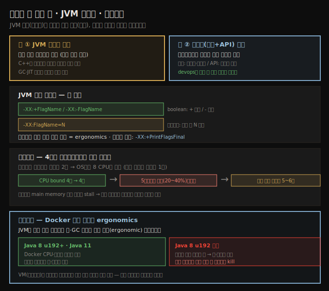
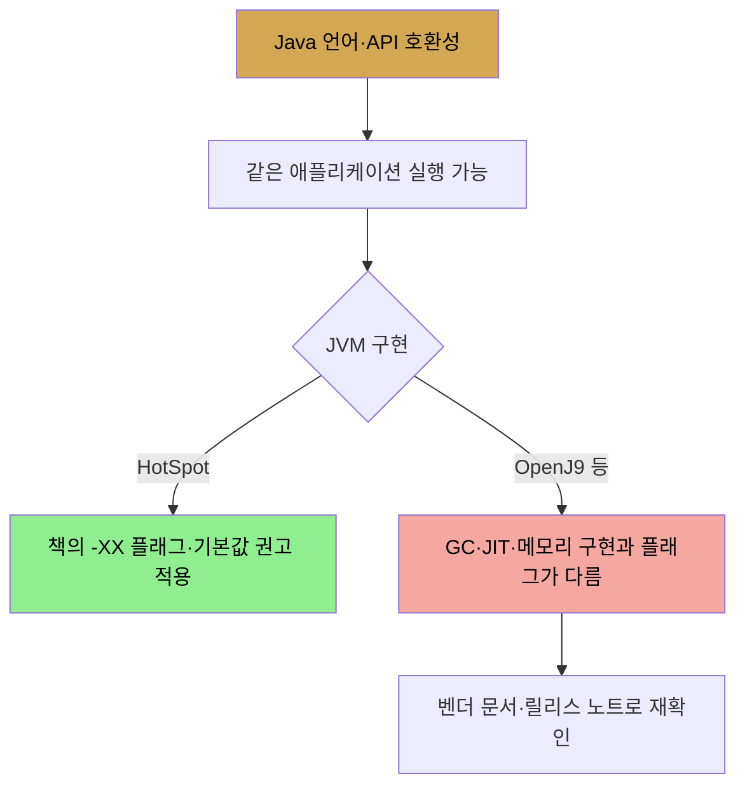
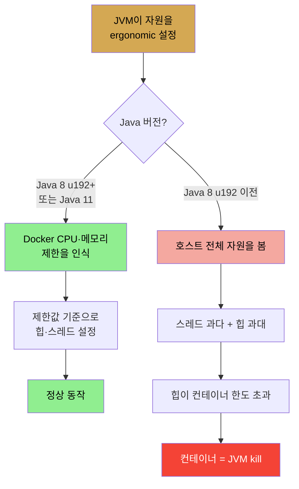

# 성능 — art와 science, 그리고 플랫폼·환경
> Java 성능 지식은 JVM 튜닝(플래그)과 플랫폼 모범 사례(코드) 두 축이며, 하드웨어·컨테이너 환경이 그 위에 영향을 줍니다

1장 Introduction은 본격적인 튜닝에 들어가기 전에 두 가지를 깔아 둡니다. 

1. "Java 성능이란 무엇을 아는 일인가"라는 관점
2. "그 지식이 어떤 플랫폼·환경 위에서 작동하는가"라는 전제입니다. 

이 노트는 그중 관점과 플랫폼·환경을 다루고, 성능 작업의 원칙(더 나은 알고리즘·더 적은 코드 등)은 [다음 편](./01-02.완전한%20성능%20이야기%20—%20JVM%20밖의%20일곱%20원칙.md)에서 이어집니다.

저자는 Java 성능이 art와 science 둘 다라고 말합니다.

- science 쪽은 놀랍지 않습니다. 성능 논의에는 숫자·측정·분석이 가득하고, 과학적 엄밀함을 적용하는 것이 최대 성능을 얻는 핵심입니다. 
- art 쪽은 덜 인정받지만, 좋은 성능 엔지니어가 내놓는 결과물이 예술처럼 보이는 이유는 사실 깊은 지식·경험·직관의 적용이기 때문입니다. 

저자는 "충분히 발전한 기술은 마법과 구별되지 않는다"는 말을 빌려, 원탁의 기사에게 휴대폰이 마법으로 보이듯 깊은 지식의 산물이 예술로 보일 뿐이라고 설명합니다. 이 책은 경험과 직관까지 줄 수는 없지만, 깊은 지식은 줄 수 있습니다.

## 1. 두 가지 지식의 축 — JVM 튜닝과 플랫폼 모범 사례
> JVM 성능은 주로 플래그로, 플랫폼 성능은 주로 코드의 모범 사례로 결정됩니다

저자는 이 깊은 지식이 크게 두 범주로 나뉜다고 봅니다.

1. **JVM 자체의 성능** — JVM이 어떻게 구성되느냐가 프로그램 성능의 여러 측면에 영향을 줍니다. 
   - 다른 언어 경험이 많은 개발자는 튜닝의 필요를 다소 성가시게 느낄 수 있지만, JVM 튜닝은 C++ 프로그래머가 컴파일 시 컴파일러 플래그를 테스트하고 고르는 일, PHP 코더가 *php.ini* 파일의 변수를 적절히 설정하는 일과 완전히 같은 성격입니다.
2. **Java 플랫폼 기능의 성능** — 여기서 "플랫폼"이라는 단어가 중요합니다. 
   - 어떤 기능(스레딩·동기화)은 언어의 일부이고, 어떤 기능(문자열 처리)은 표준 Java API의 일부입니다. 
   - Java 언어와 Java API 사이에는 중요한 구분이 있지만, 성능 관점에서는 비슷하게 다룹니다. 이 책은 플랫폼의 두 측면을 모두 다룹니다.

핵심 대비는 이렇습니다. **JVM의 성능은 주로 튜닝 플래그에 기반하고, 플랫폼의 성능은 애플리케이션 코드 안의 모범 사례로 더 많이 결정됩니다.** 

- 오랫동안 이 둘은 별개의 전문 영역으로 여겨졌습니다. 개발자는 코딩하고, 성능 그룹은 테스트하고 수정을 권고하는 식이었습니다. 그러나 이는 그리 유용한 구분이 아니었습니다. 
- Java를 다루는 사람이라면 코드가 JVM에서 어떻게 동작하는지, 어떤 튜닝이 성능에 도움이 될지를 똑같이 잘 이해해야 합니다. 프로젝트가 devops 모델로 옮겨가면서 이 구분은 점점 덜 엄격해지고 있습니다. 영역 전체를 아는 것이 작업에 예술의 광택을 입혀 줍니다.

실무적으로는 "플래그는 운영팀, 코드는 개발팀"처럼 자르면 판단이 늦어집니다. 예를 들어 애플리케이션 코드가 많은 객체를 오래 붙잡는 구조라면 GC 플래그만 바꿔서는 한계가 있고, 반대로 컨테이너 CPU limit이 작게 잡힌 환경에서는 같은 코드라도 GC 스레드 수·JIT 컴파일 스레드 수 같은 JVM 기본값이 달라져야 합니다. 그래서 Java 성능을 설명할 때는 항상 **코드가 JVM 위에서 어떻게 실행되고, 그 JVM이 어떤 하드웨어·컨테이너 제한 안에서 기본값을 고르는지**까지 한 문장으로 연결해야 합니다.

## 2. 책의 개요 — 어떤 순서로 다루는가
> 측정·모니터링을 먼저 깔고, JIT·GC 같은 공통 튜닝, 그다음 플랫폼별 모범 사례로 진행합니다

저자는 본문의 진행 순서를 미리 안내합니다. 정독 노트의 지도로 삼을 수 있어 그대로 옮깁니다.

1. **2장** — Java 애플리케이션 테스트의 일반 방법론, Java 벤치마킹의 함정
2. **3장** — Java 애플리케이션을 모니터링하는 도구 개요 (성능 분석은 애플리케이션이 무엇을 하는지 들여다볼 수 있어야 하므로)
3. **4장** — just-in-time 컴파일 (공통 튜닝)
4. **5장·6장** — 가비지 컬렉션 (공통 튜닝)
5. **7장** — Java 힙의 메모리 사용
6. **8장** — native 메모리 사용
7. **9장** — 스레드 성능
8. **10장** — Java 서버 기술
9. **11장** — 데이터베이스 접근
10. **12장** — 일반 Java SE API 팁
11. **부록 A** — 책에서 논의한 모든 튜닝 플래그 목록 (다룬 장으로의 상호 참조 포함)

앞쪽(2~6장)이 측정과 공통 튜닝, 뒤쪽(7~12장)이 플랫폼 각 부분의 모범 사례라는 큰 구조가 보입니다.

## 3. Java 플랫폼 — HotSpot, JDK 8과 11, LTS
> 이 책은 Oracle HotSpot JVM의 Java 8(jdk8u222)과 11(11.0.5)을 다루며, 둘은 LTS 릴리스입니다

이 책이 다루는 것은 **Oracle HotSpot Java Virtual Machine과 JDK 버전 8, 11**입니다. 

- 이것은 Java, Standard Edition(SE)으로도 불립니다. JRE는 JVM만 담은 JDK의 부분집합이지만, 성능 분석에는 JDK의 도구들이 중요하므로 이 책은 JDK에 초점을 둡니다. 
- 실용적으로는 OpenJDK 저장소에서 파생된 플랫폼들(AdoptOpenJDK 프로젝트가 릴리스한 JVM 포함)도 다루는 셈입니다. 
- 엄밀히는 Oracle 바이너리가 프로덕션 사용에 라이선스를 요구하고 AdoptOpenJDK 바이너리는 오픈소스 라이선스로 오지만, 이 책의 목적상 둘을 같은 것으로 보고 JDK 또는 Java 플랫폼이라 부릅니다.

버전에 관해 저자가 강조하는 점은 다음과 같습니다.

1. 집필 시점 현재 버전은 Java 8이 jdk8u222(버전 222), Java 11이 11.0.5입니다. **적어도 이 버전 이상**을 쓰는 것이 중요한데, 특히 Java 8이 그렇습니다. 초기 Java 8(대략 jdk8u60까지)은 이 책에서 다루는 많은 성능 개선과 기능, 특히 GC와 G1 가비지 컬렉터 관련 기능을 담고 있지 않습니다.
2. 이 버전들이 선택된 이유는 Oracle의 **장기 지원(LTS)**을 받기 때문입니다. Java 8은 적어도 2023년까지(AdoptOpenJDK 경유, 이후 Oracle 확장 지원 계약), Java 11은 적어도 2022년까지 지원·이용 가능합니다. 다음 LTS는 2021년 말로 예상됩니다.
3. Java 11 논의에는 Java 9·10에서 처음 제공된 기능도 포함됩니다. Java 9·10은 Oracle과 커뮤니티 모두에서 지원되지 않습니다. 저자는 이런 기능을 다소 부정확하게 "Java 11에 들어왔다"고 말하기도 하는데, Java 9·10이 쓰이지 않으므로 그 기능이 정확히 언제 처음 나왔는지는 중요하지 않다는 입장입니다. 같은 이유로 출간 시점에 Java 13이 나와 있어도 Java 12·13은 비중 있게 다루지 않습니다. 비-LTS 릴리스는 6개월만 지원되고 곧 다음 릴리스로 올려야 하므로, 초점은 Java 8과 11에 유지됩니다.

다른 구현(Eclipse OpenJ9 등)도 있지만, 호환성 테스트를 통과해 Java 이름을 쓸 수 있더라도 그 호환성이 이 책 주제까지 미치지는 않습니다. 특히 튜닝 플래그가 그렇습니다. 

- 모든 JVM 구현에 GC가 하나 이상 있지만, 각 벤더 GC를 튜닝하는 플래그는 제품마다 다릅니다. 
- 따라서 이 책의 **개념은 모든 Java 구현에 적용되지만, 구체적인 플래그와 권고는 HotSpot JVM에만 적용**됩니다. 같은 주의가 HotSpot의 이전 릴리스에도 적용됩니다. 
- 플래그와 기본값은 릴리스마다 바뀌므로, 여기 논의는 Java 8(버전 222)과 11(11.0.5) 기준이고 항상 릴리스 노트를 확인해야 합니다. 책 나머지에서 Java와 JVM은 Oracle HotSpot 구현을 가리킵니다.

이 구분은 "Java 프로그램이 돌아간다"와 "같은 플래그가 같은 의미로 먹힌다"를 분리하면 이해하기 쉽습니다.

## 4. JVM 튜닝 플래그 문법
> boolean은 -XX:+/-FlagName, 파라미터는 -XX:FlagName=값이며, 기본값은 환경 따라 자동(ergonomics) 결정됩니다

JVM은 몇 가지 예외를 빼면 두 종류의 플래그를 받습니다. 이 문법은 책 전체에서 반복되므로 정확히 익혀 둡니다.

1. **boolean 플래그**: `-XX:+FlagName` 은 플래그를 켜고, `-XX:-FlagName` 은 끕니다.
2. **파라미터 플래그**: `-XX:FlagName=something` 은 FlagName 값을 something으로 설정합니다. 본문에서 값은 보통 임의 값을 뜻하는 형태로 표기됩니다. 예를 들어 `-XX:NewRatio=N` 은 NewRatio 플래그를 임의 값 N으로 설정할 수 있다는 뜻이고, N의 함의가 논의의 초점이 됩니다.

각 플래그의 기본값은 플래그를 소개할 때 함께 설명됩니다. 그 기본값은 흔히 여러 요인의 조합에 기반합니다. 

- JVM이 도는 플랫폼, 그리고 JVM에 준 다른 명령행 인자가 그 요인입니다. **환경에 따라 플래그를 자동으로 튜닝하는 과정을 ergonomics라 부릅니다.** 
- 특정 환경·명령행에서 특정 플래그의 기본값이 궁금하면 `-XX:+PrintFlagsFinal` 플래그(기본값 false)로 확인합니다.

Oracle·AdoptOpenJDK 사이트에서 받는 JVM은 product build라 부릅니다. 소스에서 빌드하면 debug build, developer build 등 여러 빌드를 만들 수 있고, 이들은 추가 기능을 가집니다. 특히 developer build는 더 큰 튜닝 플래그 집합을 포함해 알고리즘의 미세한 동작까지 실험할 수 있게 하지만, 이 책에서는 일반적으로 다루지 않습니다.

## 5. 하드웨어 — 멀티코어와 하이퍼스레딩
> 4코어 하이퍼스레딩 머신은 8 CPU로 보이지만, 실제 처리량은 단일 코어의 5~6배에 그칩니다

오늘날 거의 모든 머신은 다중 코어를 가지며, JVM(과 다른 프로그램)에는 다중 CPU로 보입니다. 보통 각 코어는 하이퍼스레딩이 켜져 있습니다. 하이퍼스레딩은 Intel이 선호하는 용어이고, AMD 등은 simultaneous multithreading이라 부르며 일부 제조사는 코어 안의 hardware strand라 부릅니다. 모두 같은 것이고, 이 책은 하이퍼스레딩이라 부릅니다.

성능 관점에서 머신의 중요한 속성은 코어 수입니다. 기본형 4코어 머신을 보면, 각 코어는 대체로 독립적으로 처리할 수 있어 4코어 머신은 단일 코어 머신의 4배 처리량을 낼 수 있습니다. 그런데 대개 각 코어는 하드웨어(하이퍼) 스레드 2개를 가지며, 이 둘은 서로 독립적이지 않습니다. **코어는 한 번에 둘 중 하나만 실행할 수 있습니다.** 스레드는 자주 스톨합니다. 예를 들어 main memory에서 값을 로드해야 하고 그 과정이 몇 사이클 걸립니다. 단일 스레드 코어라면 이때 사이클이 낭비되지만, 두 스레드 코어는 다른 스레드의 명령으로 전환해 실행합니다.

그래서 하이퍼스레딩이 켜진 4코어 머신은 한 번에 8개 스레드의 명령을 실행할 수 있는 것처럼 보입니다(엄밀히는 CPU 사이클당 4개 명령만 실행 가능). OS와 Java에는 CPU 8개로 보입니다. 하지만 이 CPU들이 성능상 동등하지는 않습니다. 처리량의 실제 증가는 다음과 같이 전개됩니다.

| 동시 CPU bound 작업 수 | 효과 |
|------------------------|------|
| 1~4개 | 코어를 하나씩 차지 → 4배까지 선형 증가 |
| 5번째 | 다른 작업이 스톨할 때만 실행 가능 (평균 20~40% 시점) → 약 30%만 추가 |
| 8개(논리 CPU 전부) | 결국 단일 코어 대비 약 5~6배 |

핵심은 **논리 CPU 수가 곧 독립적인 물리 실행 자원 수는 아니라는 점**입니다. 1~4번째 CPU bound 작업은 물리 코어를 하나씩 차지하므로 설명이 쉽지만, 5번째 작업부터는 이미 바쁜 코어 안의 남는 사이클을 빌려 쓰는 형태가 됩니다. 이 남는 사이클은 보통 메모리 접근 같은 스톨 구간에서 생기므로, 하이퍼스레딩의 추가 처리량은 작업의 스톨 비율에 묶입니다.

GC는 상당히 CPU bound한 작업이라 5장에서 하이퍼스레딩이 GC 알고리즘 병렬화에 어떻게 영향을 주는지 보이고, 9장에서 Java 스레딩을 잘 활용하는 법과 함께 하이퍼스레딩 코어 스케일링 예를 다시 봅니다.

## 6. 소프트웨어 컨테이너 — VM과 Docker, 그리고 ergonomics 함정
> Java 8 u192+ · Java 11은 Docker 자원 제한을 인식하지만, 이전 버전은 호스트 전체를 보고 컨테이너를 죽일 수 있습니다

최근 Java 배포의 가장 큰 변화는 소프트웨어 컨테이너 안에 배포되는 경우가 잦아진 것입니다. 클라우드 컴퓨팅으로의 이동이 가속한 산업 추세입니다. 여기서 중요한 컨테이너는 둘입니다.

1. **가상 머신(VM)** — 자신이 도는 하드웨어의 부분집합 위에 완전히 격리된 OS 사본을 둡니다. 
   - 클라우드 컴퓨팅의 기반입니다. 벤더의 데이터센터에는 잠재적으로 128코어인 큰 머신들이 있고, VM은 그 일부(예: 코어 2개, 하이퍼스레딩이라 4 CPU, 메모리 16GB)에 접근합니다. 
   - **Java의 관점에서 그 VM은 코어 2개·메모리 16GB의 일반 머신과 구별되지 않습니다.** 튜닝·성능 목적으로는 같은 방식으로 보면 됩니다.
2. **Docker 컨테이너** — Docker 안에서 도는 Java 프로세스는 자신이 컨테이너 안에 있는지 꼭 알지는 못합니다(들여다보면 알 수는 있음). 
   - Docker 컨테이너는 도는 OS 안의 한 프로세스(자원 제약이 걸릴 수 있는)일 뿐입니다. 
   - 그래서 다른 프로세스의 CPU·메모리 사용으로부터의 격리가 VM과는 다소 다릅니다.

기본적으로 Docker 컨테이너는 머신의 모든 자원(모든 CPU, 모든 메모리)을 쓸 수 있습니다. 단일 애플리케이션 배포를 간소화하려는 용도라면 괜찮습니다. 그러나 한 머신에 여러 컨테이너를 배포하고 각각의 자원을 제한하려는 경우가 잦습니다. 예를 들어 4코어·16GB 머신에 코어 2개·8GB씩 쓰는 컨테이너 2개를 둘 수 있습니다. Docker 설정은 간단하지만, Java 레벨에서 문제가 생길 수 있습니다.

**수많은 Java 자원이 JVM이 도는 머신 크기에 기반해 자동(ergonomic)으로 설정됩니다.** 기본 힙 크기, GC가 쓰는 스레드 수(5장), 일부 스레드 풀 설정(9장)이 그렇습니다. 여기서 Java 버전에 따라 동작이 갈립니다.

최신 Java 8(update 192 이상)이나 Java 11이면 JVM은 기대대로 동작합니다. 

- 컨테이너를 코어 2개로 제한하면 CPU 수 기반 ergonomic 값이 컨테이너 한도 기준으로 정해지고, 메모리 기반 설정(힙 등)도 컨테이너에 준 메모리 한도 기준으로 정해집니다. 
- 반면 이전 Java 8은 컨테이너가 강제할 한도를 모릅니다. 기본 힙 계산을 위해 메모리를 조사하면 컨테이너 허용량이 아니라 머신 전체 메모리를 보고, GC 튜닝을 위해 CPU 수를 보면 컨테이너에 할당된 수가 아니라 머신 전체 CPU를 봅니다. 
- 그 결과 스레드를 너무 많이 띄우고 힙을 너무 크게 잡습니다. 스레드 과다도 성능을 떨어뜨리지만 진짜 문제는 메모리입니다. 최대 힙이 컨테이너에 할당된 메모리보다 커질 수 있고, 힙이 그 크기로 자라면 컨테이너(따라서 JVM)가 죽습니다.

운영 판단으로 바꾸면 질문은 단순합니다. **이 JVM이 Docker의 CPU limit과 memory limit을 보고 기본값을 정하는 버전인가?** Java 8u192 이전이면 JVM은 컨테이너의 2 CPU·4GB가 아니라 호스트의 32 CPU·64GB 같은 전체 자원을 기준으로 힙과 스레드를 잡을 수 있습니다. 이때 애플리케이션이 평소에는 떠 있더라도 트래픽 증가로 힙이 커지는 순간 컨테이너 memory limit을 넘고, Java 예외가 아니라 컨테이너 OOM kill로 사라질 수 있습니다.

이전 Java 8에서는 메모리·CPU 값을 손으로 적절히 설정할 수 있지만, 저자는 그냥 이후 Java 8 버전(또는 Java 11)으로 올리는 편이 낫다고 권합니다. 추가로 Docker는 진단 도구 문제도 줍니다. Java의 풍부한 성능 진단 도구들이 Docker 컨테이너에서는 쓰지 못하는 경우가 잦은데, 이는 3장에서 더 봅니다.

저자는 VM 오버구독(oversubscription)도 짚습니다. 32코어 물리 박스에 보통 4코어 VM 8개를 두면 각 VM이 전용 코어 4개를 갖지만, 비용을 아끼려 4코어 VM 16개를 둘 수도 있습니다. 16개가 동시에 바쁠 일이 드물다는 가정인데, 너무 많이 바쁘면 CPU 사이클을 두고 경쟁해 성능이 나빠집니다. CPU를 throttle해 버스트만 허용하고 지속 사용은 막기도 합니다(무료·체험 제공에서 흔함). 이런 영향은 성능에 크지만 Java에 국한되지 않고, VM 안의 다른 것과 다르게 영향을 주지도 않습니다.

## 자주 받는 오해
> 컨테이너 안이면 JVM이 알아서 작은 자원에 맞춘다고 믿기 쉽지만, 버전이 가릅니다

1. "Docker로 자원을 제한하면 JVM이 당연히 그 한도에 맞춘다"고 생각하기 쉽지만, 실제로는 **Java 8 update 192가 경계선**입니다. 그 이전 버전은 호스트 전체 자원을 보고 힙·스레드를 과다 설정해, 힙이 컨테이너 메모리 한도를 넘으면 컨테이너째 kill됩니다.
2. "8 CPU로 보이니 8배 빠르다"고 생각하기 쉽지만, 하이퍼스레딩은 코어당 한 번에 한 스레드만 실행합니다. 4코어 하이퍼스레딩의 실제 처리량은 단일 코어의 5~6배 수준입니다.
3. "이 책의 플래그를 아무 JVM에나 쓸 수 있다"고 생각하기 쉽지만, 개념은 모든 구현에 적용돼도 **구체적 플래그·기본값은 HotSpot의 특정 버전(8u222·11.0.5)에만** 유효합니다.

## 면접에서 받을 만한 질문
1. **JVM ergonomics가 무엇이고 왜 컨테이너에서 문제가 됩니까?** → ergonomics는 JVM이 도는 머신의 CPU 수·메모리에 기반해 힙 크기·GC 스레드 수 등을 자동으로 정하는 메커니즘입니다. Docker처럼 자원이 제한된 환경에서, Java 8 update 192 이전 JVM은 컨테이너 한도가 아니라 호스트 전체 자원을 보고 설정합니다. 그래서 힙을 컨테이너 메모리보다 크게 잡으면 힙이 그만큼 자랐을 때 컨테이너가 죽습니다. 예를 들어 8GB 제한 컨테이너인데 JVM이 호스트의 64GB를 보고 힙을 16GB로 잡으면 OOM kill로 이어집니다.
2. **JVM 튜닝 플래그의 두 문법은 무엇입니까?** → boolean 플래그는 `-XX:+FlagName`으로 켜고 `-XX:-FlagName`으로 끕니다. 파라미터 플래그는 `-XX:FlagName=값` 형식입니다. 특정 환경의 실제 기본값은 `-XX:+PrintFlagsFinal`로 확인할 수 있습니다. 예를 들어 `-XX:NewRatio=2`는 파라미터 플래그입니다.
3. **하이퍼스레딩이 켜진 4코어 머신이 8배 성능을 못 내는 이유는?** → 코어 하나에 하드웨어 스레드가 2개 보이지만 코어는 한 번에 하나만 실행합니다. 두 번째 스레드는 첫 스레드가 메모리 로드 등으로 스톨할 때만 끼어들어 실행됩니다. CPU bound 작업은 4개까지 코어를 하나씩 차지해 4배가 나지만, 5번째부터는 스톨이 생기는 20~40% 시간만큼만 보태져, 8개를 다 돌려도 단일 코어의 5~6배에 그칩니다.
4. **이 책이 HotSpot에만 적용된다고 못 박는 이유는?** → 개념(GC가 무엇을 하는가 등)은 모든 Java 구현에 통하지만, GC를 조정하는 튜닝 플래그는 벤더 제품마다 다릅니다. 같은 GC 개념이라도 OpenJ9와 HotSpot의 플래그 이름·기본값이 다릅니다. 그래서 구체적 플래그·권고는 HotSpot Java 8u222·11.0.5 기준으로만 유효하고, 다른 구현·다른 버전에서는 릴리스 노트를 확인해야 합니다.

## 관련 문서
- [완전한 성능 이야기 — JVM 밖의 일곱 원칙](./01-02.완전한%20성능%20이야기%20—%20JVM%20밖의%20일곱%20원칙.md) — 1장 후반부, JVM 튜닝 밖의 영향과 원칙
- [서문 — 책 소개와 2판 변경점](./00-00.서문%20—%20책%20소개와%202판%20변경점.md) — 책 전체 관점과 대상 독자
- [이 책 인덱스 (Java Performance MOC)](./README.md) — 장별 정독 노트 진척
