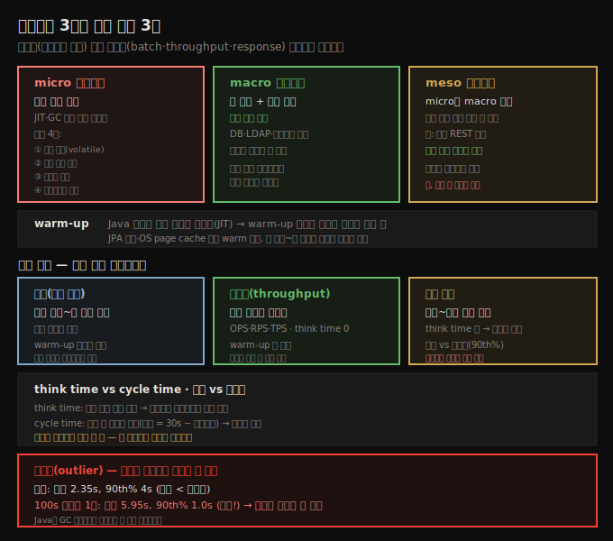
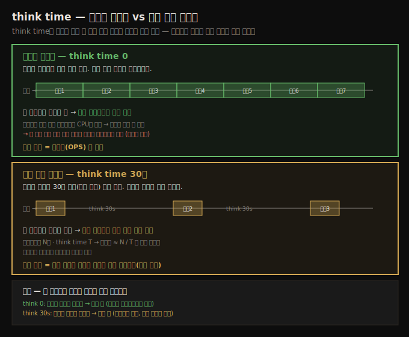

# 무엇을 측정할까 — 벤치마크 종류와 성능 지표
> 실제 애플리케이션을 micro·macro·meso 중 맞는 방식으로 테스트하고, batch·throughput·response time 중 목표에 맞는 지표를 골라야 합니다

2장은 성능 테스트에서 유효한 분석을 얻는 네 원칙을 다룹니다. **실제 애플리케이션을 테스트하라, 처리량·배치·응답 시간을 이해하라, 변동성을 이해하라, 일찍 자주 테스트하라입니다.** 이 노트는 앞 두 원칙, 곧 "무엇을 어떤 지표로 측정하는가"를 다룹니다. 나머지 두 원칙(변동성·일찍 자주)은 [다음 편](./02-02.결과를%20어떻게%20믿을까%20—%20변동성과%20통계,%20일찍%20자주.md)으로 이어집니다.

저자는 성능 엔지니어링의 science 부분이 이 원칙들에 담긴다고 말합니다. 테스트를 돌리는 것 자체는 괜찮지만, 그 뒤에 과학적 분석이 없으면 너무 자주 틀리거나 불완전한 결론으로 이어집니다. 핵심은 테스트가 **유효한 분석**을 낳도록 만드는 것입니다.




## 1. 실제 애플리케이션을 테스트하라
> 테스트할 코드는 micro·macro·meso 세 종류이며, 실제 애플리케이션을 포함하는 쪽이 가장 좋은 결과를 줍니다

첫째 원칙은 실제 제품을, 제품이 쓰일 방식대로 테스트하라는 것입니다. 성능 테스트에 쓰는 코드는 대략 세 범주로 나뉩니다. 마이크로벤치마크, 매크로벤치마크, 메소벤치마크입니다. 각각 장단점이 있고, 실제 애플리케이션을 포함하는 범주가 가장 좋은 결과를 줍니다.


## 2. 마이크로벤치마크와 네 가지 함정
> 작은 단위를 재지만 JIT·GC 때문에 올바로 쓰기 어렵고, 결과 읽기·입력 범위·올바른 입력·프로덕션 차이를 조심해야 합니다

마이크로벤치마크는 여러 대안 구현 중 어느 쪽이 나은지 정하려고 작은 성능 단위를 재는 테스트입니다. 

스레드 생성 오버헤드 vs 스레드 풀, 한 산술 알고리즘 vs 다른 구현 같은 것입니다. 좋아 보이지만, Java를 매력적으로 만드는 바로 그 기능들(JIT 컴파일과 GC) 때문에 올바로 쓰기 어렵습니다. 함정은 넷입니다.

1. **결과를 반드시 읽어야 한다.** Java 코드는 처음 몇 번은 인터프리트되므로 오래 돌수록 빨라집니다. 그래서 모든 벤치마크는 JVM이 코드를 최적 상태로 컴파일하도록 warm-up 기간을 둡니다. 그런데 다음 코드처럼 계산 결과 `l`을 어디서도 읽지 않으면, 컴파일러가 계산 자체를 건너뛰어도 됩니다. 시간 측정이 0(또는 빈 for 루프 시간)이 나옵니다.

```java
public void doTest() {
    // Main Loop
    double l;
    for (int i = 0; i < nWarmups; i++) {
        l = fibImpl1(50);
    }
    long then = System.currentTimeMillis();
    for (int i = 0; i < nLoops; i++) {
        l = fibImpl1(50);
    }
    long now = System.currentTimeMillis();
    System.out.println("Elapsed time: " + (now - then));
}
```

- 해결책은 각 결과를 쓰기만 하지 말고 읽게 하는 것입니다. 실무에서는 `l`을 지역 변수에서 `volatile`로 선언한 인스턴스 변수로 바꾸면 메서드 성능을 잴 수 있습니다(`volatile`이 필요한 이유는 9장에 있습니다). 
- 이 필요성은 단일 스레드 마이크로벤치마크에도 적용됩니다. 한편 **스레드 마이크로벤치마크는 특히 조심**해야 합니다. 작은 코드 조각을 여러 스레드가 실행하면 동기화 병목 가능성이 큽니다. 
- 두 스레드가 synchronized 메서드를 호출하는 경우, 벤치마크 코드가 작아 대부분이 그 안에서 실행되므로 두 스레드만으로도 동시 진입 경합이 일어나기 쉽습니다. 결국 테스트가 마이크로벤치마크의 목표가 아니라 **JVM이 경합을 어떻게 다루는지**를 재게 됩니다.

2. **입력 범위를 넓혀야 한다.** 50번째 피보나치 수만 계산하면, 똑똑한 컴파일러가 루프를 한 번만 돌리거나 중복 반복을 버릴 수 있습니다. 또 `fibImpl1(1000)`과 `fibImpl1(1)`의 성능은 크게 다릅니다. 무작위 입력을 쓰되 루프 안에서 난수를 만들면 난수 생성 시간이 측정에 섞이므로, 입력을 미리 계산해 두는 편이 낫습니다.

```java
int[] input = new int[nLoops];
for (int i = 0; i < nLoops; i++) {
    input[i] = random.nextInt();
}
long then = System.currentTimeMillis();
for (int i = 0; i < nLoops; i++) {
    try {
        l = fibImpl1(input[i]);
    } catch (IllegalArgumentException iae) {
    }
}
long now = System.currentTimeMillis();
```

3. **올바른 입력을 재야 한다.** 위 코드는 이제 예외를 잡아야 합니다. 입력 범위에 피보나치 수가 없는 음수와, double로 표현 못 하는 1,476 초과 값이 들어가기 때문입니다. 문제는 그 범위가 프로덕션에서 실제로 들어오는 값이냐입니다. 두 구현을 비교한다고 합시다. 하나는 범위 검사 없이 빠르게 계산하고, 다른 하나는 범위를 벗어나면 즉시 예외를 던지되 느린 재귀로 계산합니다.

```java
public double fibImplSlow(int n) {
    if (n < 0) throw new IllegalArgumentException("Must be > 0");
    if (n > 1476) throw new ArithmeticException("Must be < 1476");
    return recursiveFib(n);
}
```

- 넓은 입력 범위로 비교하면 이 새 구현이 단지 앞쪽 범위 검사 덕분에 훨씬 빨라 보입니다. 
- 그러나 실제 사용자가 늘 100 미만 값을 넘긴다면 그 비교는 틀린 답을 줍니다. 흔한 경우에는 원래 `fibImpl1()`이 더 빠르고, 1장에서 말했듯 흔한 경우를 최적화해야 합니다.

4. **프로덕션에서 다르게 동작할 수 있다.** 컴파일러는 코드의 프로파일 피드백(자주 호출되는 메서드, 호출 시 스택 깊이, 인자의 실제 타입 등)으로 최적화를 정하므로, 같은 코드라도 마이크로벤치마크에서와 큰 애플리케이션에서 다르게 최적화됩니다. 
   - GC 측면도 다릅니다. 빠르지만 단명 객체를 많이 만드는 구현은, 작은 프로그램에서는 young generation에서 빠르게 수거돼 더 빨라 보입니다. 그러나 여러 스레드가 동시에 도는 서버에서는 young generation이 빨리 차서 그 단명 객체들이 old generation으로 승격되고, 잦고 비싼 full GC를 부릅니다. 그 경우 "빠른" 구현이 오히려 더 느려집니다. 
   - 마지막으로 마이크로벤치마크의 의미 자체를 생각해야 합니다. 반복당 차이는 나노초 단위인 경우가 많은데, 회귀 테스트에서 나노초 수준을 추적하는 게 의미 있는지 따져야 합니다. 수백만 번 접근하는 컬렉션이면 접근당 몇 나노초가 중요하지만(12장), REST 호출당 한 번 일어나는 연산이면 그 나노초 회귀를 고치는 시간은 다른 최적화에 쓰는 게 낫습니다.

이런 함정에도 마이크로벤치마크는 인기가 많아, OpenJDK에 핵심 프레임워크인 jmh(Java Microbenchmark Harness)가 있습니다. JDK 개발자들이 JDK 자체의 회귀 테스트에 쓰며, 일반 벤치마크 개발 프레임워크도 제공합니다. jmh는 [다음다음 편](./02-03.벤치마크%20실전%20—%20jmh와%20공통%20예제%20코드.md)에서 자세히 다룹니다.


## 3. 매크로벤치마크 — 실제 앱 전체
> 애플리케이션 자체를 외부 자원과 함께 재는 것이 가장 좋고, 부분을 mock하면 전체의 거동을 놓칩니다

**애플리케이션 성능을 재는 가장 좋은 것은 애플리케이션 자체와 그것이 쓰는 외부 자원입니다.** 

이것이 매크로벤치마크입니다. 애플리케이션이 보통 LDAP으로 사용자 자격을 확인한다면 그 모드로 테스트해야 합니다. LDAP 호출을 stub으로 빼는 것은 모듈 수준 테스트에는 합리적이지만, 애플리케이션은 완전한 구성으로 테스트해야 합니다.

- 애플리케이션이 커질수록 이 격언은 지키기 더 중요해지면서 더 어려워집니다. **복잡한 시스템은 부분의 합 이상**이라, 부분이 조립되면 꽤 다르게 동작합니다. 
- DB 호출을 mock하면 DB 성능을 신경 안 써도 될 것 같지만, DB 연결은 버퍼로 힙을 많이 쓰고, 네트워크는 데이터가 늘면 포화되며, 코드는 단순한 메서드 집합을 호출할 때(복잡한 JDBC 드라이버와 달리) 다르게 최적화되고, CPU는 짧은 코드 경로를 더 효율적으로 파이프라인·캐시합니다.

전체 애플리케이션을 테스트할 또 다른 이유는 자원 배분입니다. 완벽한 세상이라면 모든 줄을 최적화할 시간이 있지만, 현실에는 마감이 있고 복잡한 환경의 한 부분만 최적화하면 즉각적 이득이 없을 수 있습니다. 저자의 데이터 흐름 예가 이를 보여 줍니다(원문 Figure 2-1). 사용자 입력 → 독자 비즈니스 계산 → DB 로드 → 추가 계산 → DB 저장 → 응답이고, 각 모듈이 격리 테스트에서 처리하는 초당 요청 수(RPS)가 다릅니다.


- 비즈니스 계산이 사업상 가장 중요하지만, 그것을 100% 빠르게 해도 이 예에서는 아무 이득이 없습니다. 계산을 200 RPS로 개선하고 부하도 늘리면 LDAP은 견디고 200 RPS가 계산 모듈로 흘러 200 RPS가 나옵니다. 
- 그러나 **DB 로드가 여전히 100 RPS만 처리**하므로, 200 RPS가 들어가도 100 RPS만 나와 전체 처리량은 그대로 100 RPS입니다. 비즈니스 로직 효율이 두 배가 돼도 소용없고, 다른 부분을 개선하기 전에는 추가 시도가 헛됩니다. 
- 계산 최적화가 완전히 낭비는 아니지만(다른 병목을 고치면 그제야 이득이 드러남), 우선순위의 문제입니다. 전체 애플리케이션을 테스트하지 않으면 어디에 성능 작업 시간을 써야 이득인지 알 수 없습니다.

다중 JVM도 같은 맥락입니다. 같은 하드웨어에서 여러 애플리케이션이 동시에 돌면, 기본값이 머신 자원을 독점한다고 가정하는 JVM의 여러 측면이 다르게 거동합니다. 

- 예를 들어 한 JVM은 GC 사이클에서 기본 구성상 모든 프로세서를 100%까지 몰아붙입니다. 실행 중 평균 CPU가 40%로 보여도, 실제로는 어떤 때 30%, 어떤 때 100%라는 뜻입니다. 
- 격리 실행에서는 괜찮지만, 다른 애플리케이션과 함께 돌면 GC 동안 100%를 못 받아 성능이 뚜렷이 달라집니다.


## 4. 메소벤치마크 — 중간 지대
> 실제 일은 하지만 전체 앱은 아닌 중간 형태로, 함정이 적고 다루기 쉽지만 전체 앱을 대체하진 못합니다

메소벤치마크는 마이크로벤치마크와 전체 애플리케이션 사이의 중간 지대입니다. 저자가 쓰는 용어로, Java SE 엔지니어에게 "마이크로벤치마크"는 아주 작은 측정을 뜻하지만, 애플리케이션 개발자에게는 한 성능 측면을 재면서도 많은 코드를 실행하는 것을 뜻합니다. 

- 예를 들어 단순 REST 호출 응답을 서버가 얼마나 빨리 돌려주는지 재는 것은, 소켓 관리·요청 읽기·응답 쓰기 코드가 많아 전통적 마이크로벤치마크가 아닙니다. 
- 그렇다고 보안·세션 관리가 없으니 매크로벤치마크도 아닙니다. 실제 애플리케이션의 부분집합이라 중간에 놓이는 메소벤치마크입니다.

메소벤치마크는 마이크로벤치마크보다 함정이 적고 매크로벤치마크보다 다루기 쉽습니다. 컴파일러가 제거할 죽은 코드를 크게 담지 않고, 스레드화도 쉽습니다. 여전히 전체 앱보다 동기화 병목을 더 만날 수 있지만, 그 병목은 실제 앱이 더 큰 하드웨어·부하에서 결국 만날 것들입니다. 다만 완벽하진 않습니다. 

두 애플리케이션 서버를 메소벤치마크로 비교하면 잘못 이끌릴 수 있습니다.

| 테스트 | 서버 1 | 서버 2 |
|--------|--------|--------|
| 단순 REST 호출 | 19 ± 2.1 ms | 50 ± 2.3 ms |
| 인가 포함 REST 호출 | 75 ± 3.4 ms | 50 ± 3.1 ms |

- 단순 REST 호출만 보면 서버 1이 빨라 서버 1을 고르기 쉽습니다. 그러나 서버 2는 매 요청마다 인가를 자동 수행하고 있었고, 애플리케이션이 늘 인가를 필요로 한다면(보통 그렇습니다) 서버 1이 인가에 훨씬 오래 걸려 잘못된 선택이 됩니다. 
- 그래도 메소벤치마크는 전체 앱 테스트의 합리적 대안이고, 성능 특성이 마이크로벤치마크보다 실제 앱에 훨씬 가깝습니다. 자동화 테스트, 특히 모듈 수준에도 좋습니다.

요약하면, 좋은 마이크로벤치마크는 적절한 프레임워크 없이는 쓰기 어렵고, 전체 애플리케이션 테스트가 코드의 실제 거동을 아는 유일한 길이며, 메소벤치마크는 합리적 접근이지만 전체 앱 테스트의 대체는 아닙니다.


## 5. 성능 지표 — 배치·처리량·응답 시간
> 세 지표는 서로 연관되며, 부하가 고정 속도로 들어오는지(think time)에 따라 처리량과 응답 시간이 갈립니다

둘째 원칙은 애플리케이션에 맞는 테스트 지표를 이해하고 고르는 것입니다. 성능은 처리량(RPS), 경과 시간(배치 시간), 응답 시간으로 잴 수 있고 셋은 서로 연관됩니다.

1. **배치(경과 시간)** — 어떤 작업을 끝내는 데 걸린 시간을 봅니다. 가장 단순한 측정입니다. 
   - 정적 컴파일 언어에서는 간단하지만, Java는 JIT 때문에 코드가 완전히 최적화돼 최고 성능에 이르기까지 수 초에서 수 분이 걸립니다. 그래서 보통 warm-up 후에 잽니다. 
   - warm-up은 컴파일러 최적화만이 아니라 JPA 캐시·OS page cache 같은 다른 요인에도 걸립니다. 다만 시작부터 끝까지 전체 성능이 중요한 경우도 많습니다. 
   - 1만 개를 처리하는 리포트 생성기는 앞 5천 개가 뒤 5천 개보다 50% 느려도 최종 사용자에겐 상관없고, REST 서버조차 warm-up 동안 접속한 사용자에겐 초기 성능이 중요합니다. 그래서 이 책의 많은 예제가 배치 지향입니다.

2. **처리량(throughput)** — 일정 시간에 끝낸 작업량입니다. 
   - 클라이언트/서버 테스트에서 처리량 측정은 클라이언트에 think time이 없다는 뜻입니다. 응답을 받으면 즉시 새 요청을 보내고, 끝에 총 작업 수를 보고합니다. 보통 초당 작업 수(OPS·RPS·TPS)로 보고합니다. 
   - 클라이언트 구성이 중요한데, 클라이언트가 충분히 빨리 데이터를 못 보내면 서버가 아니라 클라이언트 성능을 재게 됩니다. think time 0 테스트는 각 스레드가 더 많은 요청을 하므로 이 위험이 커서, 처리량 테스트는 보통 응답 시간 테스트보다 적은 클라이언트 스레드로 돌립니다. 
   - 처리량 테스트는 평균 응답 시간도 보고하지만, 처리량이 같지 않으면 그 변화만으로 성능 문제라 할 수 없습니다. **0.5초 응답에 500 OPS인 서버가 0.3초 응답에 400 OPS인 서버보다 낫습니다.**

3. **응답 시간** — 요청 전송과 응답 수신 사이 시간입니다. 

   - 처리량 테스트와의 차이는, 응답 시간 테스트의 클라이언트는 작업 사이에 일정 시간 잠든다는 점입니다.  이것이 think time이고, 사용자 행동(URL 입력 → 읽기 → 클릭 → 읽기)을 흉내 냅니다. think time이 들어오면 처리량은 고정됩니다. 

   - 주어진 클라이언트 수와 think time이면 늘 같은 TPS가 나오고, 그때 중요한 측정은 그 고정 부하에 얼마나 빨리 응답하느냐입니다.

think time과 cycle time의 차이도 알아 둘 만합니다. 

- think time은 요청 사이에 고정 시간(예: 30초) 잠드는 방식이라, 처리량이 응답 시간에 약간 의존합니다(응답 1초면 31초마다 요청 → 0.032 OPS). 
- cycle time은 요청 간 총시간을 30초로 고정해 수면 시간을 `30초 − 응답시간`으로 두는 방식이라, 응답 시간과 무관하게 처리량이 고정됩니다(0.033 OPS). 
- 단 테스트 도구의 think time은 보통 무작위 변동을 섞고 스레드 스케줄링도 정확히 실시간이 아니라, cycle time을 써도 실행 간 처리량은 조금씩 변합니다.


## 6. 평균 vs 백분위, 그리고 이상치
> 응답 시간은 평균과 백분위를 함께 봐야 하며, 큰 이상치는 평균을 흔들어 백분위와 순서가 뒤집히기도 합니다

응답 시간은 두 방식으로 보고합니다. **평균**은 개별 시간을 더해 요청 수로 나눈 값이고, **백분위**는 예를 들어 90번째 백분위(90th%) 응답입니다. 

- 응답의 90%가 1.5초 이하이고 10%가 1.5초 초과면 1.5초가 90th% 응답입니다. 차이는 이상치가 계산에 미치는 영향입니다. 이상치는 평균에 포함되므로 큰 이상치는 평균을 크게 흔듭니다.

원문 Figure 2-2는 1~5초 범위의 정상적 응답 20건을 보여 줍니다.

-  평균은 2.35초, 90%가 4초 이하입니다. 잘 동작하는 테스트의 흔한 모습입니다. 그러나 Figure 2-3처럼 한 요청이 100초 걸린 큰 이상치가 끼면, 90th%와 평균의 위치가 뒤집힙니다. 평균은 무려 5.95초인데 90th%는 1.0초입니다. 
- 이 경우 평균을 끌어내리는 이상치를 줄이는 데 집중해야 합니다. 이런 이상치는 여러 이유로 생기고, **Java에서는 GC 일시 정지 때문에 더 쉽게** 발생합니다(GC가 100초 지연을 낸다는 뜻은 아니지만, 평균 응답이 작은 테스트에서는 GC 일시 정지가 큰 이상치를 만들 수 있습니다).

보통은 90th%(또는 95th·99th%)에 집중합니다. 하나만 본다면 백분위가 더 낫습니다. 그 값을 줄이면 다수 사용자가 이득을 보기 때문입니다. 그러나 큰 이상치를 놓치지 않으려면 평균과 적어도 하나의 백분위를 함께 보는 게 더 낫습니다.

부하 생성기로는 여러 도구가 있습니다. 이 책 예제는 오픈소스 Java 기반 Faban을 쓰고, SPECjEnterprise 같은 상용 벤치마크 드라이버의 기반 코드이기도 합니다. Faban의 `fhb` 프로그램으로 단순 URL 성능을 잴 수 있습니다.

```
% fhb -W 1000 -r 300/300/60 -c 25  http://host:port/StockServlet?stock=SDO
ops/sec: 8.247
% errors: 0.0
avg. time: 0.022
max time: 0.045
90th %: 0.030
95th %: 0.035
99th %: 0.035
```

- 이 예는 클라이언트 25개(`-c 25`)가 stock 서블릿(심볼 SDO)에 1초 cycle time(`-W 1000`)으로 요청하고, 5분 warm-up·5분 측정·1분 ramp-down(`-r 300/300/60`)을 돕니다. 
- think time을 포함하므로 응답 시간이 중요 지표이고 OPS는 거의 일정합니다. 더 복잡한 도구로는 Apache JMeter, Gatling, Micro Focus LoadRunner 등이 있습니다.


## 7. 더 깊이 — 본문이 짧게 넘어가는 지점들
> 본문이 한 줄로 단정하고 지나가는 여섯 지점을 "왜 그런가"까지 풀어 둡니다

본문은 결론을 빠르게 제시하느라 몇 곳에서 근거를 생략합니다. 학습하며 막히기 쉬운 여섯 지점을 따로 풀어 둡니다.

### 7.1 `volatile`이어야 하는 진짜 이유 — 동시성이 아니라 가시성

§2 첫 함정에서 저자는 "결과를 지역 변수가 아니라 `volatile` 인스턴스 변수에 쓰라"고 합니다. 여기서 `volatile`을 동시성 보호 장치로 오해하기 쉽지만, 핵심은 **가시성(visibility)**입니다.

- JIT 컴파일러는 어떤 값이 "이 스레드 안에서만 쓰인다"고 판단하면 그 값을 레지스터에만 두거나, 아무도 안 읽으면 계산 자체를 없앱니다. 그냥 인스턴스 필드로 바꿔도 컴파일러가 "이 필드를 읽는 곳이 없다"고 보면 여전히 쓰기를 날릴 수 있습니다. 
- 그런데 필드를 `volatile`로 선언하면 의미가 "이 값은 언제든 다른 스레드가 읽을 수 있다"로 바뀝니다. 컴파일러는 그 쓰기를 함부로 제거하지 못하고, `fibImpl1(50)`의 계산도 살아남습니다. 
- 즉 `volatile`은 결과를 "반드시 외부로 보이게" 만들어 컴파일러의 제거 최적화를 막는 장치이지, 동시 수정을 막는 락이 아닙니다.

> **실습으로 확인**: 같은 10,000회 산술 루프를 JMH로 재되, 결과를 *소비하지 않는* 버전과 *`volatile` 필드에 쓰는* 버전을 나란히 측정하면 이 차이가 숫자로 드러납니다. 
>
> 한 측정에서 결과를 안 읽은 버전은 약 0.3 ns/op, `volatile` 필드에 쓴 버전은 약 8,500 ns/op로 대략 28,000배 차이가 났습니다.
>
> - 0.3 ns는 10,000회 루프가 끝날 수 없는 시간이므로, JIT가 "아무도 안 읽는다"를 확인하고 루프 전체를 제거(dead code elimination)했다는 뜻입니다. 
> - JMH의 `Blackhole.consume()`도 `volatile`과 같은 값(약 8,500 ns/op)을 내, 둘이 "결과를 외부로 내보내 제거를 막는" 같은 원리임을 보여 줍니다. 
>
> 한편 계산 메서드에 `@CompilerControl(DONT_INLINE)`를 붙이면 제거가 *일어나지 않아* 세 버전이 똑같이 나오는데, 이는 JIT가 인라인하지 못한 호출을 "부작용이 있을 수 있다"고 보수적으로 가정하기 때문입니다(§2 넷째 함정 "프로덕션에서 다르게 동작한다"의 실증). 벤치마크 코드: `~/jvm-practice/jpf-deadcode-elimination`(`DeadCodeEliminationBenchmark`).

### 7.2 micro vs macro vs meso — 무엇이 다른가

세 벤치마크의 차이는 "얼마나 많은 코드·스레드·자원이 동시에 도느냐"의 차이입니다.

- **마이크로벤치마크**는 한 메서드만, 대개 단일 스레드로 잽니다. JVM이 그 코드만 집중 최적화하고 힙 압박도 거의 없어, JIT가 "이 메서드만 엄청 호출된다"는 프로파일로 공격적으로 컴파일합니다.
- **큰 애플리케이션(단일 JVM)**은 수십~수백 메서드가 함께 돕니다. JIT의 프로파일 피드백이 분산되어, 마이크로벤치에서 "핫"하던 코드가 여기선 덜 뜨겁게 취급돼 최적화 수준이 낮아질 수 있습니다.
- **멀티스레드 서버**는 위에 더해 여러 스레드가 동시에 young generation에 객체를 할당합니다. young generation이 훨씬 빨리 차고, GC 압박이 스레드 수에 비례해 커집니다.

§2 넷째 함정에서 "마이크로벤치에선 빠르던 구현이 서버에선 느려진다"가 이 차이에서 나옵니다. 

- 단명 객체를 많이 만드는 구현은, 단일 스레드 마이크로벤치에선 young generation에 여유가 있어 minor GC가 드물고 승격이 거의 없어 빠릅니다. 
- 그러나 여러 스레드가 동시에 단명 객체를 쏟아내는 서버에선 young generation이 빠르게 차 minor GC가 잦아지고, 아직 다른 스레드가 잡고 있는 객체들이 old generation으로 승격되어 결국 잦고 비싼 full GC를 부릅니다.

### 7.3 think time이 정확히 무엇인가

think time은 클라이언트가 **한 응답을 받은 뒤 다음 요청을 보내기 전까지 일부러 쉬는 시간**입니다. "생각하는 시간"이라 부르는 이유는 실제 사용자 행동을 흉내 내기 때문입니다. 사람은 페이지를 받으면 곧장 다음 클릭을 하지 않고, 화면을 읽고 생각한 뒤 행동합니다. 그 멈춤을 테스트 클라이언트가 `sleep(30초)` 같은 식으로 재현한 것이 think time입니다.



### 7.4 처리량 테스트에서 클라이언트 스레드를 적게 두는 이유

think time이 0인 처리량 테스트에서는 한 스레드가 응답을 받자마자 다음 요청을 보냅니다. 요청을 만들고 보내고 응답을 받아 파싱하는 이 모든 일이 클라이언트 CPU를 씁니다. 그래서 스레드 하나하나가 무겁고, 적은 수로도 서버를 포화시킬 수 있습니다.

스레드를 너무 많이 두면 클라이언트 머신의 CPU가 먼저 포화됩니다. 그러면 클라이언트가 요청을 제때 만들어 보내지 못하고, 그 순간 측정되는 것은 서버의 한계가 아니라 클라이언트의 한계가 됩니다. 서버는 놀고 있는데 클라이언트가 못 따라가는 셈입니다. 그래서 처리량 테스트는 클라이언트 자원 포화로 인한 병목을 피하려고 스레드를 적게 둡니다. 반대로 think time 30초인 응답 시간 테스트는 한 스레드가 30초에 한 번꼴로만 요청해 부하가 약하므로, 의미 있는 부하를 주려면 스레드를 많이 둬야 합니다.

### 7.5 메소벤치마크의 함정은 §2의 어느 함정과 같은가

§4의 서버 1·2 비교(단순 REST에선 서버 1이 빠르지만 인가를 포함하면 서버 2가 빠름)는 §2 셋째 함정 "올바른 입력을 재야 한다"와 구조가 같습니다. 두 경우 모두 **실제 프로덕션에서 일어나는 조건을 재지 않고, 실제로는 안 쓰는 조건으로 비교했기 때문에** 틀린 우열이 나왔습니다. 

피보나치 예에서 실제 사용자가 늘 100 미만 값을 넘기는데 넓은 범위로 비교한 것과, REST 예에서 실제로는 늘 인가가 필요한데 인가 없는 단순 호출로 비교한 것이 같은 실수입니다. 본문은 "이렇게 설계하라"는 처방까지는 주지 않고, 흔한 경우(프로덕션의 실제 조건)를 입력으로 써야 한다는 원칙만 보여 줍니다.


## 자주 받는 오해
> 응답 시간이 낮으면 무조건 빠른 서버라고 보기 쉽지만, 처리량과 함께 봐야 합니다

1. "평균 응답 시간이 낮으면 더 빠른 서버"라고 생각하기 쉽지만, 처리량이 같지 않으면 비교가 안 됩니다. 0.3초 응답에 400 OPS인 서버보다 0.5초 응답에 500 OPS인 서버가 더 낫습니다.
2. "마이크로벤치마크에서 빠른 구현이 프로덕션에서도 빠르다"고 생각하기 쉽지만, 프로파일 피드백과 GC 프로파일이 달라집니다. 단명 객체를 많이 만드는 빠른 구현이 멀티스레드 서버에서는 old generation 승격·full GC로 더 느려질 수 있습니다.
3. "단순 REST 호출 비교면 서버 우열을 알 수 있다"고 생각하기 쉽지만, 한 서버가 매 요청 인가를 수행하는 등 숨은 차이가 있으면, 인가가 늘 필요한 실제 앱에서는 반대 결론이 납니다.


## 면접에서 받을 만한 질문
1. **micro/macro/meso 벤치마크의 차이는?** → 마이크로벤치마크는 스레드 생성 같은 아주 작은 단위를 재고, 매크로벤치마크는 외부 자원을 포함한 애플리케이션 전체를 재며, 메소벤치마크는 그 중간으로 실제 일은 하지만 전체 앱은 아닙니다(예: 보안·세션 없는 단순 REST 호출). 가장 정확한 건 매크로벤치마크지만, 메소벤치마크가 함정이 적고 자동화에 적합해 실무에서 자주 씁니다.
2. **마이크로벤치마크의 대표적 함정은?** → 결과를 안 읽으면 컴파일러가 계산을 제거하므로 `volatile` 인스턴스 변수 등으로 결과를 소비해야 하고, 단일 입력만 쓰면 컴파일러가 루프를 한 번만 돌리므로 입력 범위를 미리 계산해 넓혀야 하며, 실제 안 쓰는 입력 범위를 재면 왜곡되고, 프로파일 피드백·GC 프로파일이 달라 프로덕션과 다르게 동작합니다.
3. **throughput 테스트와 response-time 테스트의 차이는?** → response-time 테스트는 클라이언트가 작업 사이에 think time만큼 잠들어 사용자 행동을 흉내 내고, throughput 테스트는 think time 없이 응답 즉시 다음 요청을 보냅니다. think time이 있으면 처리량이 고정되어 응답 시간이 중요 지표가 되고, think time이 없으면 처리량이 핵심이라 클라이언트 스레드를 더 적게 둡니다(클라이언트가 병목이 되지 않도록).
4. **응답 시간을 평균과 백분위 둘 다 봐야 하는 이유는?** → 평균은 이상치를 포함해 계산하므로 100초 같은 큰 이상치 하나가 평균을 5.95초로 끌어올리면서 90th%는 1.0초로 낮을 수 있습니다(순서 역전). 백분위 하나만 보면 다수 사용자 체감을 잘 잡지만 큰 이상치를 놓치고, 평균만 보면 이상치에 휘둘립니다. Java는 GC 일시 정지로 이상치가 쉬워 둘을 함께 봐야 합니다.


## 관련 문서
- [완전한 성능 이야기 — JVM 밖의 일곱 원칙](./01-02.완전한%20성능%20이야기%20—%20JVM%20밖의%20일곱%20원칙.md) — "흔한 경우 최적화"가 입력 범위 함정과 이어짐
- [결과를 어떻게 믿을까 — 변동성과 통계, 일찍 자주](./02-02.결과를%20어떻게%20믿을까%20—%20변동성과%20통계,%20일찍%20자주.md) — 2장 원칙③④
- [벤치마크 실전 — jmh와 공통 예제 코드](./02-03.벤치마크%20실전%20—%20jmh와%20공통%20예제%20코드.md) — 마이크로벤치마크 함정을 jmh가 어떻게 막는지
- [이 책 인덱스 (Java Performance MOC)](./README.md) — 장별 정독 노트 진척
