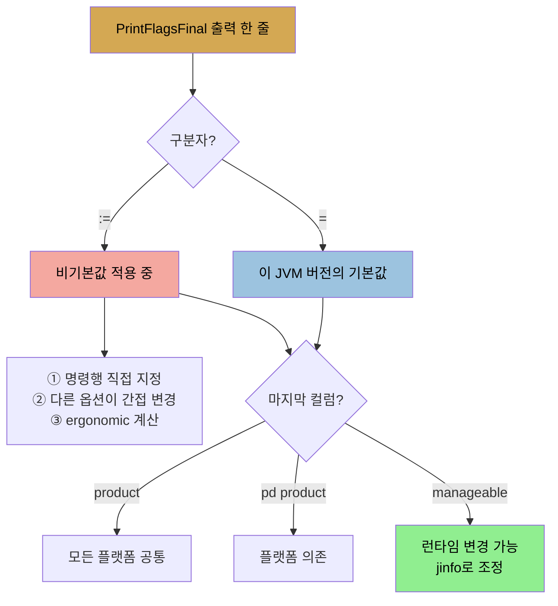

# JDK 기본 도구와 VM 정보·튜닝 플래그
> JVM 내부 가시성은 JDK에 딸린 도구로 얻으며, jcmd로 기본 정보·플래그를, jinfo로 개별 플래그를 다룹니다

[앞 편](./03-01.OS%20레벨%20도구%20—%20CPU·디스크·네트워크.md)이 OS 레벨 도구였다면, 이 편은 JVM 자체를 들여다보는 도구입니다. JVM 내부에 대한 통찰을 얻으려면 Java 모니터링 도구가 필요하고, 이 도구들은 JDK에 딸려 옵니다. 오픈소스·상용 경쟁 도구도 있지만, 이 장은 편의상 JDK 도구에 집중합니다.


## 1. JDK 기본 모니터링 도구 7종
> jcmd가 기본 정보 만능 도구이며, GUI 도구(jconsole·jvisualvm)를 뺀 나머지는 스크립트에 적합합니다

JDK에 딸린 도구는 다음과 같습니다.

| 도구 | 역할 | 스크립트 |
|------|------|----------|
| `jcmd` | Java 프로세스의 기본 클래스·스레드·JVM 정보 출력 (`jcmd process_id command optional_arguments`) | 적합 |
| `jconsole` | 스레드·클래스·GC 활동의 그래픽 뷰 | GUI |
| `jmap` | 힙 덤프와 JVM 메모리 정보 (덤프는 후처리 도구로) | 적합 |
| `jinfo` | JVM 시스템 프로퍼티 가시성, 일부 프로퍼티 동적 설정 | 적합 |
| `jstack` | Java 프로세스 스택 덤프 | 적합 |
| `jstat` | GC·클래스로딩 활동 정보 | 적합 |
| `jvisualvm` | JVM 모니터·실행 중 프로파일·힙 덤프 분석 GUI | GUI |

`jcmd`에 `help`를 주면 가능한 모든 명령을, `help <command>`를 주면 특정 명령 문법을 보여 줍니다. 이 도구들은 JVM과 같은 머신에서 쉽게 돌립니다. **JVM이 Docker 컨테이너 안에 있으면, 비그래픽 도구(jconsole·jvisualvm 제외)는 `docker exec`로 실행**하거나 `nsenter`로 컨테이너에 들어가 돌립니다. 단 그 도구가 Docker 이미지에 설치돼 있어야 하므로 설치를 권합니다. 보통 이미지를 애플리케이션 최소 필수(JRE만)로 줄이지만, 프로덕션에서 언젠가 통찰이 필요해지므로 JDK에 묶인 도구를 이미지에 넣는 게 낫습니다. `jconsole`은 시스템 자원을 꽤 써서 프로덕션에서 돌리면 간섭하므로, 로컬에서 돌려 원격 시스템에 붙이도록 설정할 수 있습니다(프로덕션에서는 SSL 인증서·보안 인증 설정 필요).

이 도구들은 여섯 가시성 영역으로 나뉩니다. **기본 VM 정보, 스레드 정보, 클래스 정보, 실시간 GC 분석, 힙 덤프 후처리, JVM 프로파일링**입니다. 도구와 영역은 일대일이 아니어서, 한 도구가 여러 영역 기능을 합니다. 그래서 도구별이 아니라 영역별로 살핍니다.


## 2. 기본 VM 정보 — uptime·프로퍼티·버전·명령행·플래그
> jcmd의 VM.* 명령으로 실행 중 JVM의 가동 시간·시스템 프로퍼티·버전·명령행·플래그를 봅니다

`jcmd`로 실행 중 JVM의 기본 정보를 얻습니다.

| 정보 | 명령 |
|------|------|
| 가동 시간 | `jcmd process_id VM.uptime` |
| 시스템 프로퍼티 | `jcmd process_id VM.system_properties` 또는 `jinfo -sysprops process_id` |
| JVM 버전 | `jcmd process_id VM.version` |
| 명령행 | `jcmd process_id VM.command_line` |
| 튜닝 플래그 | `jcmd process_id VM.flags [-all]` |

시스템 프로퍼티에는 명령행 `-D` 옵션으로 준 것, 애플리케이션이 동적으로 추가한 것, JVM 기본 프로퍼티가 모두 포함됩니다. 플래그 추적에는 마지막 두 명령이 유용합니다. **`command_line`은 명령행에서 직접 지정한 플래그를, `flags`는 명령행 플래그에 더해 JVM이 (ergonomic하게 값이 정해져) 직접 설정한 플래그를 보여 줍니다.** `-all` 옵션은 JVM 안 모든 플래그를 나열합니다.


## 3. PrintFlagsFinal — 플랫폼별 기본값과 표기 읽기
> 콜론(:=)은 비기본값, 등호(=)는 기본값을 뜻하고, product는 플랫폼 공통·pd product는 플랫폼 의존입니다

수백 개 JVM 튜닝 플래그가 있고 대부분 모호합니다. 어느 플래그가 적용 중인지 알아내는 것은 성능 진단의 잦은 작업이고, `jcmd` 명령이 실행 중 JVM에 대해 그걸 합니다. 특정 JVM의 플랫폼별 기본값을 알고 싶으면 명령행에서 `-XX:+PrintFlagsFinal`을 쓰는 게 더 유용합니다.

```
% java other_options -XX:+PrintFlagsFinal -version
...Hundreds of lines of output, including...
uintx InitialHeapSize                          := 4169431040     {product}
intx InlineSmallCode                           = 2000            {pd product}
```

쓰려는 다른 옵션을 함께 줘야 합니다. 일부 옵션(특히 GC 관련)이 다른 옵션의 최종값에 영향을 주기 때문입니다. 출력의 **콜론(`:=`)은 비기본값이 적용 중임을 뜻하고**, 다음 세 이유로 생깁니다.

1. 플래그 값을 명령행에서 직접 지정
2. 다른 옵션이 그 옵션을 간접 변경
3. JVM이 기본값을 ergonomic하게 계산

**콜론 없는 등호(`=`)는 이 JVM 버전의 기본값**임을 뜻합니다. 마지막 컬럼은 기본값의 플랫폼 의존성을 보여 줍니다. `product`는 모든 플랫폼에서 동일한 기본값, `pd product`는 플랫폼 의존 기본값입니다. 다른 값으로는 `manageable`(런타임에 값을 동적 변경 가능)과 `C2 diagnostic`(컴파일러 진단 출력)이 있습니다.




## 4. jinfo — 개별 플래그 조회와 동적 변경
> jinfo로 개별 플래그를 보고, manageable 플래그는 런타임에 켜고 끌 수 있습니다

실행 중 애플리케이션의 플래그 정보를 보는 또 다른 방법은 `jinfo`입니다. 장점은 일부 플래그 값을 실행 중에 바꿀 수 있다는 점입니다. 프로세스의 모든 플래그를 보려면 `jinfo -flags process_id`를 씁니다(`-flags` 없이는 명령행에서 지정한 것만). 출력이 `PrintFlagsFinal`만큼 읽기 좋진 않지만, 다른 기능이 있습니다. 개별 플래그 값을 조회할 수 있습니다.

```
% jinfo -flag PrintGCDetails process_id
-XX:+PrintGCDetails
```

`jinfo` 자체는 플래그가 manageable인지 표시하지 않지만, **manageable 플래그(`PrintFlagsFinal`로 식별)는 `jinfo`로 켜고 끌 수 있습니다.**

```
% jinfo -flag -PrintGCDetails process_id  # turns off PrintGCDetails
% jinfo -flag PrintGCDetails process_id
-XX:-PrintGCDetails
```

여기서 중요한 주의가 있습니다. **JDK 8에서 `jinfo`는 어떤 플래그 값이든 바꿀 수 있지만, JVM이 그 변경에 반응한다는 뜻은 아닙니다.** 예를 들어 GC 알고리즘 동작에 영향을 주는 대부분 플래그는 시작 시점에 컬렉터 동작을 정하는 데 쓰입니다. 나중에 `jinfo`로 바꿔도 JVM은 동작을 바꾸지 않고 초기화된 대로 실행을 이어갑니다. 그래서 이 기법은 `PrintFlagsFinal` 출력에서 manageable로 표시된 플래그에만 통합니다. **JDK 11에서는 바꿀 수 없는 플래그를 바꾸려 하면 `jinfo`가 에러를 냅니다.**

플래그가 너무 많다는 점도 알아 둬야 합니다. `PrintFlagsFinal`은 수백 개(JDK 8u202에 729개)를 출력합니다. 대부분은 지원 엔지니어가 실행 중(오작동하는) 애플리케이션에서 더 많은 정보를 모으게 하려는 것입니다. `AllocatePrefetchLines`(기본값 3) 같은 플래그를 보면 바꿔서 prefetching이 더 잘되게 할 수 있을 것 같지만, 진공 상태의 hit-or-miss 튜닝은 가치가 없습니다. **강력한 근거 없이 어떤 플래그도 바꾸면 안 됩니다.** 이 플래그라면 애플리케이션의 prefetch 성능, CPU 특성, 그 변경이 JVM 코드에 미칠 효과를 알아야 합니다.


## 5. 스레드·클래스·GC 정보
> 스레드 스택은 jstack·jcmd Thread.print로, 클래스 정보는 jconsole·jstat로, GC는 거의 모든 도구가 보여 줍니다

나머지 영역은 다른 장에서 깊이 다루므로 도구 매핑만 정리합니다.

1. **스레드 정보** — `jconsole`·`jvisualvm`이 실행 중 스레드 수를 실시간 표시합니다. 스레드가 블록됐는지 보려면 스택을 봅니다. 스택은 `jstack process_id` 또는 `jcmd process_id Thread.print`로 얻습니다(자세한 모니터링은 9장).
2. **클래스 정보** — 사용 중 클래스 수는 `jconsole`·`jstat`에서 얻고, `jstat`은 클래스 컴파일 정보도 줍니다(클래스 사용은 12장, 클래스 컴파일 모니터링은 4장).
3. **실시간 GC 분석** — 거의 모든 모니터링 도구가 GC 활동을 보고합니다. `jconsole`은 힙 사용 라이브 그래프를, `jcmd`는 GC 작업 수행을, `jmap`은 힙 요약·permanent generation 정보·힙 덤프를, `jstat`은 GC 동작의 여러 뷰를 줍니다(5장).
4. **힙 덤프 후처리** — 힙 덤프는 `jvisualvm` GUI, `jcmd`·`jmap` 명령행에서 캡처합니다. 힙의 스냅샷이라 여러 도구로 분석하며, 이 영역은 서드파티 도구가 한발 앞서 있어 7장은 Eclipse Memory Analyzer Tool(mat)을 씁니다.


## 자주 받는 오해
> jinfo로 플래그를 바꾸면 JVM이 따른다고 생각하기 쉽지만, manageable 플래그만 반응합니다

1. "JDK 8 `jinfo`로 플래그를 바꾸면 JVM이 그대로 따른다"고 생각하기 쉽지만, GC 동작 플래그처럼 시작 시점에 쓰이는 플래그는 나중에 바꿔도 JVM이 반응하지 않습니다. `PrintFlagsFinal`에서 manageable로 표시된 플래그만 런타임에 반응하고, JDK 11은 아예 변경 불가 플래그에 에러를 냅니다.
2. "흥미로워 보이는 플래그는 바꿔서 튜닝하면 된다"고 생각하기 쉽지만, 729개 플래그 대부분은 지원 엔지니어용 진단 플래그입니다. 강력한 근거(애플리케이션·CPU 특성·JVM 코드 영향) 없이 바꾸는 hit-or-miss 튜닝은 가치가 없습니다.
3. "Docker 이미지는 JRE만 넣어 가볍게 하면 된다"고 생각하기 쉽지만, 프로덕션에서 진단이 필요해지므로 JDK 도구를 이미지에 넣는 게 낫습니다. 비그래픽 도구는 `docker exec`로 돌릴 수 있습니다.


## 면접에서 받을 만한 질문
1. **실행 중 JVM에 어떤 플래그가 적용됐는지 어떻게 확인합니까?** → `jcmd process_id VM.flags`로 명령행 플래그와 JVM이 ergonomic하게 정한 플래그를 보고, `-all`로 모든 플래그를 봅니다. 플랫폼별 기본값을 알려면 명령행에서 `java ... -XX:+PrintFlagsFinal -version`을 씁니다. 이때 쓰려는 다른 옵션도 함께 줘야 일부 옵션이 다른 옵션 기본값에 미치는 영향이 반영됩니다.
2. **PrintFlagsFinal 출력의 콜론(:=)과 등호(=)는 무슨 차이입니까?** → 콜론은 비기본값이 적용 중임을 뜻하고, 이유는 명령행 직접 지정·다른 옵션의 간접 변경·ergonomic 계산 셋입니다. 등호는 그 JVM 버전의 기본값입니다. 마지막 컬럼의 `product`는 모든 플랫폼 공통 기본값, `pd product`는 플랫폼 의존 기본값, `manageable`은 런타임 변경 가능을 뜻합니다.
3. **jinfo로 어떤 플래그를 런타임에 바꿀 수 있습니까?** → `PrintFlagsFinal` 출력에서 `manageable`로 표시된 플래그만 실제로 반응합니다. JDK 8 `jinfo`는 어떤 플래그든 바꿀 수 있지만, GC 동작처럼 시작 시점에 결정되는 플래그는 바꿔도 JVM이 반응하지 않고 초기화된 대로 실행합니다. JDK 11은 변경 불가 플래그를 바꾸려 하면 에러를 냅니다.
4. **Docker 컨테이너 안 JVM은 어떻게 진단합니까?** → 비그래픽 도구(jcmd·jstack·jmap·jinfo·jstat)는 `docker exec`로 컨테이너에 들어가 실행하거나 `nsenter`를 씁니다. 단 그 도구가 이미지에 설치돼 있어야 합니다. 이미지를 JRE만으로 최소화하기 쉽지만, 프로덕션에서 진단이 필요해지므로 JDK 도구를 이미지에 넣는 것이 좋습니다.


## 관련 문서
- [OS 레벨 도구 — CPU·디스크·네트워크](./03-01.OS%20레벨%20도구%20—%20CPU·디스크·네트워크.md) — 이 편 앞, OS 레벨 가시성
- [프로파일러 — sampling·instrumented·native](./03-03.프로파일러%20—%20sampling·instrumented·native.md) — JVM 프로파일링 영역 상세
- [성능 — art와 science, 그리고 플랫폼·환경](./01-01.성능%20—%20art와%20science,%20그리고%20플랫폼·환경.md) — JVM 플래그 문법과 ergonomics의 첫 소개
- [이 책 인덱스 (Java Performance MOC)](./README.md) — 장별 정독 노트 진척
